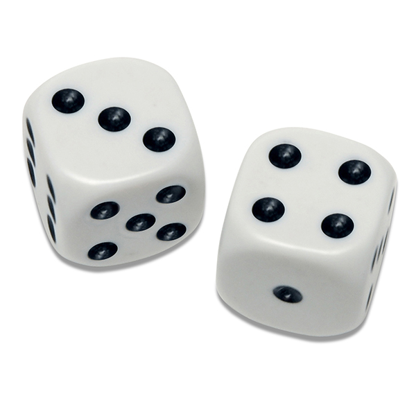
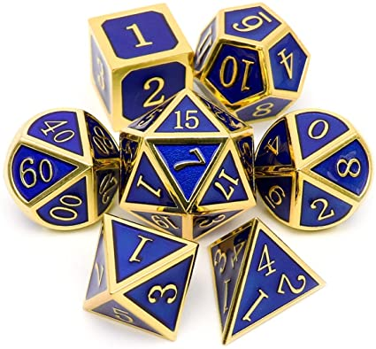

# 1. Задачи на базовые операции

---
## 1.1 Упражнения

а) пользователь вводит целое число, программа выводит число, делённое на 10

б) пользователь вводит сумму в рублях, программа переводит её в доллары (курс можно взять из интернета)

в) пользователь вводит температуру в цельсиях, программа её переводит в Фаренгейты

t<sub>F</sub> = (t<sub>C</sub> × 9/5) + 32

**Для проверки:**

°C  | °F
---:|----:
-20 | -4
-15 | 5
0   | 32
20  | 68
36  | 96.8
50  | 122
100 | 212

г) Пользователь вводит рост в "американском стиле": футы и дюймы (два input'a - один для футов, второй для дюймов). Программа переводит рост в см

* 1 дюйм = 2.54см
* 1 фут = 30.48см
* 1 фут = 12 дюймов ровно

Для проверки:

Футы, дюймы | Сантиметры
:----------:|:---------:
4'10"       | 147
5'0"        | 152
5'5"        | 165
5'7"        | 170
6'2"        | 188
6'6"        | 198

## 1.2 Високосный год

Пользователь вводит номер года (например, 2021).
программа выводит True, если он високосный и False в противном случае

Год високосный, если:
* он делится на 4, но не заканчивается на два нуля
* либо заканчивается на два нуля, и при этом делится на 400

*Примечание. Использовать условный оператор if не нужно, достаточно составить выражение и передать его результат функции `print()`*
<details><summary>Подсказка 1</summary>Делимость можно проверить с помощью операций %, == и != </details>
<details><summary>Подсказка 2</summary>Нужно составить несколько операций сравнений и скомбинировать с помощью and и or, получив выражения вида:

```python
((...) and (...)) or ((...) and (...))
```
</details>

	

## 1.3 Перевод секунд в дд:мм:чч:сс

а) Пользователь вводит большое число в секундах, программа пересчитывает его в количество дней, часов, минут, секунд 

Для проверки:

На входе | На выходе
--------:|----------------
315      | 0 дней 0 часов 5 минут 15 секунд
43200    | 0 дней 12 часов 0 минут 0 секунд
25800    | 0 дней 7 часов 10 минут 0 секунд
93784    | 1 дней 2 часов 3 минут 4 секунд

<details><summary>Подсказка</summary>Здесь понадобятся операции % (остаток от деления) и // (деление без остатка)</details>

★ б) То же самое, но программа прибавляет к введённому времени два с половиной часа. При этом время должно отображаться корректно (число минут по-прежнему должно быть меньше 60 и т.п.)

## 1.4 Кредитный калькулятор

Пользователь вводит желаемую сумму кредита в тысячах рублей и срок в годах (и то, и другое может быть дробным числом),
программа выводит сумму ежемесячного платежа. Ставка 5.5% в год

^n}{(1+r)^n-1})

Обозначение | Расшифровка  | Единица измерения
-:|------------------------|-----
A | ежемесячный платёж     | ₽
P | размер кредита         | ₽
r | ставка кредита в месяц | доли единицы (не %)
n | срок кредита           | месяцы

Некоторые единицы измерения в задании и в формуле различается, так что программа должна перевести некоторые значения в другие единицы.

**Для проверки:**

Сумма кредита, р. | Срок, лет | Ежемесячный платёж, ₽
-----------------:|-----------|----------------------
50 000            | 2         | 2 205
2 000 000         | 2         | 88 192
1 000 000         | 3         | 30 196
5 000 000         | 4         | 116 283


# 2. Задачи на условный оператор

## 2.1 Покупка в долларах
Пользователь хочет совершить покупку за 100 **долларов**. А у пользователя счёт в рублях, поэтому программа спрашивает, сколько у него **рублей** на счету.

а) если денег хватает, то программа выводит на экран остаток на счету после покупки

б) если не хватает, то пишет, сколько рублей не хватает для покупки

Курс доллара для можно взять любой или скопировать из интернета


## 2.2 Льготный курс обмена

Пользователь пишет, сколько долларов он хочет купить. Программа выбирает курс в зависимости от размера покупки и выводит сумму в рублях

  Сумма  |  Курс
---------|-------
до $1000 | 74.30₽
от $1000 | 73.96₽

## 2.3 Таможенная пошлина
Пользователь вводит сумму покупки
а) в евро
б) в рублях
Программа выводит размер пошлины в рублях

Пошлина считается следующим образом:
* меньше 200 евро - без пошлины
* всё свыше 200 евро облагается 15% пошлиной (на разницу стоимости товара и 200 евро)

# 3. Задачи на цикл while

## 3.1 Лесенка
Пользователь вводит целое число n от 1 до 9.

а) Программа выводит на экран цифру "1" указанное пользователем количество раз.
Например, для n = 4 нужно вывести:
```
1
1
1
1
```

б) Программа выводит отсчёт от единицы до указанного числа.
Например, для n = 4 нужно вывести:
```
1
2
3
4
```

в) Программа выводит лесенку из n ступенек, i-я ступень состоит из цифр от 1 до i без пробелов.
Например, для n = 4 нужно вывести:
```
1
12
123
1234
```
<details><summary>Подсказка</summary>
Здесь в цикле предстоит делать два действия: сложение и умножение на 10
</details>

## 3.2 Количество и сумма цифр в числе

Пользователь вводит большое целое число (например, 4568)

а) программа выводит на экран все цифры этого числа по одной (в любом порядке)

б) программа считает количество цифр в этом числе

в) программа считает сумму цифр в этом числе (например, 4+5+6+8 для числа 4568)
<details><summary>Подсказка про цифры</summary>
Здесь вам помогут:
<pre>
while ...
digit = x % 10
x = x // 10
</pre>
</details>

<details><summary>Подсказка про условие для остановки цикла</summary>
Операция деления без остатка // на 10 "удаляет" младший разряд (последнюю цифру). Когда в числе остаётся только одна цифра, результат этой операции станет равным нулю. Когда в числе закончатся цифры в результате делений на 10 без остатка и оно превратится в ноль, все дальнейшие операции деления на 10 будут давать нули. Это и будет признаком того, что пора остановиться.
</details>

<details><summary>Подсказка про вычисление суммы или количества</summary>
Чтобы вычислить сумму, количество или накопить что-то другое в цикле, обычно создают переменную перед циклом, дают ей начальное значение, а в цикле уже постепенно её пополняют. В итоге на выходе из цикла в ней накопится искомое значение. 
<pre>
summa = 0
while ...:
    # ...
    summa += y
    # ...
print(summa)
</pre>
</details>

## 3.3 Подписка
Пользователь хочет подписаться на некий сервис. Подписка будет стоить 1000₽ в месяц.

Пользователь вводит сумму на своём счету (один раз). Дальше начинается цикл, в котором программа спрашивает “Хотите ли продолжить подписку (y/n)?” Пусть 1 итерация цикла означает 1 месяц.
* Если пользователь печатает  букву “n”, цикл прекращается, программа показывает сколько осталось на счету денег.
* Если печатает “y”, то подписка продолжается, со счёта списывается 1000р, и цикл продолжается. При этом если денег на счету недостаточно, то подписка тоже прекратится.
Баланс на счету пользователя ни в коем случае не должен оказаться меньше нуля.

*Примечание: В этой задаче цикл может прерваться по двум совершенно не связанным друг с другом условиям: пользователь решил отписаться от сервиса или у него кончились деньги. Сложность в том, что нужно придумать, как и где записать эти условия.*

*Примечание 2: Здесь будет удобно воспользоваться конструкцией while-else, которая поможет понять, закончился ли цикл по "штатному" условию или по инструкции break*

## 3.4 Проверка номера кредитки

Последняя цифра номера банковской карты (и некоторых других номеров карт и счетов) - это всегда контрольная сумма, которая считается по алгоритму Луна. Таким образом, если пользователь ошибётся в одной цифре или перепутает две цифры местами, то это легко вычислить на стороне терминала, не делая запрос в банк. 

Пользователь вводит номер кредитной карты (16-значное целое число), а программа вычисляет и проверяет проверяет контрольную сумму, и говорит, валидный номер или нет. Алгоритм подсчёта суммы:

1. Цифры проверяемой последовательности нумеруются справа налево (Последняя цифра тоже считается, её номер - единица).
2. Цифры, оказавшиеся на нечётных местах, остаются без изменений.
3. Цифры, стоящие на чётных местах, умножаются на 2.
4. Если в результате такого умножения возникает число больше 9, оно заменяется суммой цифр получившегося произведения — однозначным числом, то есть цифрой.
5. Все полученные в результате преобразования цифры складываются. Если сумма кратна 10, то исходные данные верны.

*Примечание: Длина номера карты может не равняться 16 (дополнительные карты, экзотические платёжные системы и прочее). Также этот алгоритм часто парименяют, например, к номерам счетов и дисконтных карт. Поэтому лучше обобщить своё решение на произвольную длину номера*

Примеры корректных номеров:
```
5019 5555 4444 5555
8171 9999 0000 0000 021
4917 4845 8989 7107
6011 5564 4857 8945 8
5425 2334 3010 9903
```

# 4. Задачи на циклы for

## 4.1 Упражнения
а) Вывести на экран все числа от 25 до 70 не включительно, посчитать их сумму

б) Вывести все числа от 20 до 100, которые делятся на 5

в) Вывести все числа от 20 до 100, которые делятся на 7 или на 9

г) Вывести все числа вида:
```
1
10
100
…
1000000
```
(до миллиона включительно)
<details><summary>Подсказка</summary>Здесь range напрямую использовать не получится, т.к. он работает только с фиксированным шагом (арифметическая прогрессия). Но можно придумать, как свести требуемые числа к выражению, которые содержат переменную, растущую линейно.</details>
<details><summary>Подсказка 2</summary>

    * 1 = 10 ** 0
    * 10 = 10 ** 1
    * 100 = 10 ** 2
    * 1000 = 10 ** 3
    ...

    также это можно сделать через строки:

    * '1' = '1' + '0' * 0
    * '10' = '1' + '0' * 1
    * '100' = '1' + '0' * 2
    * '1000' = '1' + '0' * 3
    ...
</details>

д) Вывести все степени двойки от 1 (2<sup>0</sup>) до 1024 (2<sup>10</sup>) включительно

<details><summary>Подсказка</summary>

    * 1 = 2 ** 0
    * 2 = 2 ** 1
    * 4 = 2 ** 2
    * 8 = 2 ** 3
    ...

    также это можно сделать через битовые операции, если вы привыкли мыслить как программист:

    * 1 = 1 << 0
    * 2 = 1 << 1
    * 4 = 1 << 2
    * 8 = 1 << 3
    ...
</details>

---

## 4.2 Количество и сумма цифр в числе, дубль два
Решить задачу про сумму цифр в числе (№3.2), но теперь через цикл for. После ввода пользователем числа оставляем его строкой (не преобразовываем в int), что позволит нам его легко обойти в цикле.


# 5. Задачи на списки и строки

## 5.0 Упражнения
а) Дан список чисел. Вывести на экран эти числа, делённые на 100.

``` python
numbers = [614, 667, 919, 793, 423, 314, 974, 249, 915, 708, 361, 358, 2, 435, 676, 638, 682, 891, 46, 131, 409, 739, 289, 187, 683, 749, 569, 441, 403, 902, 652, 941, 607, 885, 686, 958, 311, 949, 829, 511, 478, 995, 612, 444, 846, 636, 162, 770, 862, 869, 482, 787, 315, 936, 324, 972, 707, 346, 303, 738, 340, 894, 47, 997, 998, 557, 641, 662, 120, 104, 414, 347, 855, 102, 538, 506, 389, 795, 129, 690, 470, 937, 227, 924, 179, 496, 7, 77, 224, 412, 394, 374, 492, 246, 979, 63, 591, 385, 691, 547, 380, 6, 206, 766, 462, 755, 10, 985, 79, 719, 863, 15, 740, 41, 489, 645, 566, 94, 527, 796, 925, 605, 51, 890, 386, 698, 88, 382, 416, 799, 57, 695, 378, 345, 880, 101, 270, 208, 451, 279, 818, 809, 384, 286, 34, 282, 723, 711, 744, 176]
```

б) Дан список имен. Найдите самое длинное имя, если таких имен несколько - выведи любое их них

``` python
names = ["Иван", "Ирина", "Вячеслав", "Василий", "Петр"]
```

<details><summary>Подсказка длину слова</summary>Длину строки можно узнать при помощи встроенной функции len()</details>

<details><summary>Подсказка про алгоритм</summary>Можно выдвинуть гипотезу, что какое-то из этих имён самое длинное (например, первое). А потом в цикле проверять эту гипотезу и корректировать, если увидем более длинное имя.</details>

## 5.1 Курс доллара

Есть список чисел (можно скопировать в программу)

``` python
usd = [63.1385, 63.9091, 63.4342, 63.1742, 62.7977, 63.472, 63.7708, 63.949, 63.047, 63.6016, 63.4536, 63.3085, 63.7698, 63.6873, 63.7413, 64.3008, 64.9213, 65.5177, 65.6097, 66.9909, 66.3274, 66.4437, 66.0784, 66.1854, 67.5175, 72.0208, 71.472, 74.0274, 73.1882, 74.1262, 73.8896, 77.2131, 80.157, 78.0443, 80.8815, 78.8493, 77.7928, 78.7223, 77.7325, 76.4074, 75.455, 75.7499, 74.605, 73.7515, 73.5245, 73.315, 73.7145, 74.7119, 73.9441, 74.6657, 76.2562, 77.0416, 75.129, 74.7163, 74.496, 74.5706, 73.6894, 72.7263, 73.9719, 74.1169, 73.8725, 73.4326, 73.5819, 73.9298, 73.2056, 72.9798, 72.3918, 72.3381, 70.924, 71.8804, 71.5962, 71.1408, 71.0635, 71.1012, 70.752, 69.7114, 68.9831, 68.3413, 69.0151, 68.6319, 68.3123, 68.6745, 68.6183, 69.1219, 70.395, 69.7524, 69.4822, 69.618, 69.5725, 69.4835, 68.8376, 68.8376, 69.466, 69.1284, 69.9513, 70.4413, 70.4413, 70.5198, 70.4999, 71.3409]
```

а) Вывести элементы списка, которые больше, чем 70

б) Вычислить среднее арифметическое всего списка
Формула (здесь n - количество элементов):


<details><summary>Подсказка 1</summary>стандартная ф-ия len() даст количество элементов в списке. Функция sum() - сумму.</details>

в) Вычислить среднеквадратическое отклонение (здесь s - среднее арифметическое)

^2+(x_2-s)^2+\ldots+(x_n-s)^2}{n-1}})
<details><summary>Подсказка про корень квадратный</summary>Корень квадратный можно вычислить при помощи функции sqrt() из модуля math. Но т.к. на момент решения задачи модули мы не проходили, здесь можно просто возвести результат в степень 0.5.</details>

## 5.2 Список звонков

Дан список номеров телефонов (можно скопировать в программу). Все телефоны одной и той же длины, в одном и том же формате, один и тот же код страны и код оператора везде из трёх цифр.

``` python
nums = ['+7 (960) 870-22-29', '+7 (926) 184-98-14', '+7 (960) 750-30-94', '+7 (926) 302-98-89', '+7 (916) 634-55-56', '+7 (960) 814-20-17', '+7 (960) 438-13-75', '+7 (926) 184-98-14', '+7 (960) 616-92-88', '+7 (999) 325-03-31', '+7 (495) 804-89-53', '+7 (926) 184-98-14', '+7 (916) 950-04-91', '+7 (960) 616-92-88', '+7 (960) 616-92-88', '+7 (999) 325-03-31', '+7 (915) 478-27-38', '+7 (916) 254-83-22', '+7 (495) 704-04-87', '+7 (960) 750-30-94', '+7 (499) 148-33-29', '+7 (916) 634-55-56', '+7 (926) 184-98-14', '+7 (900) 045-24-15', '+7 (900) 922-37-25', '+7 (960) 814-20-17', '+7 (495) 804-89-53', '+7 (960) 870-22-29', '+7 (960) 616-92-88', '+7 (960) 750-30-94', '+7 (499) 932-24-07', '+7 (999) 325-03-31', '+7 (916) 634-55-56', '+7 (960) 750-30-94', '+7 (960) 870-22-29', '+7 (960) 750-30-94', '+7 (960) 870-22-29', '+7 (915) 478-27-38', '+7 (960) 616-92-88', '+7 (916) 254-83-22', '+7 (999) 872-70-56', '+7 (926) 184-98-14', '+7 (495) 804-89-53', '+7 (495) 804-89-53', '+7 (495) 804-89-53', '+7 (960) 616-92-88', '+7 (926) 208-72-22', '+7 (900) 922-37-25', '+7 (916) 950-04-91', '+7 (915) 478-27-38', '+7 (926) 208-72-22', '+7 (960) 911-09-70', '+7 (926) 208-72-22', '+7 (999) 325-03-31', '+7 (499) 163-06-85', '+7 (915) 478-27-38', '+7 (926) 302-98-89', '+7 (999) 325-03-31', '+7 (960) 870-22-29', '+7 (916) 950-04-91', '+7 (916) 634-55-56', '+7 (916) 254-83-22', '+7 (900) 335-38-27', '+7 (900) 045-24-15', '+7 (900) 481-88-07', '+7 (999) 325-03-31', '+7 (915) 478-27-38', '+7 (499) 163-06-85', '+7 (960) 870-22-29', '+7 (926) 897-30-99', '+7 (900) 045-24-15', '+7 (916) 950-04-91', '+7 (926) 302-98-89', '+7 (926) 302-98-89', '+7 (900) 481-88-07', '+7 (495) 704-04-87', '+7 (499) 163-06-85', '+7 (495) 804-89-53', '+7 (960) 870-22-29', '+7 (960) 750-30-94', '+7 (900) 922-37-25', '+7 (916) 254-83-22', '+7 (495) 704-04-87', '+7 (960) 814-20-17', '+7 (916) 950-04-91', '+7 (916) 254-83-22', '+7 (960) 750-30-94', '+7 (916) 634-55-56', '+7 (495) 704-04-87', '+7 (999) 325-03-31', '+7 (495) 804-89-53', '+7 (915) 949-38-81', '+7 (926) 208-72-22', '+7 (499) 163-06-85', '+7 (916) 634-55-56', '+7 (916) 634-55-56', '+7 (960) 911-09-70', '+7 (999) 951-31-21', '+7 (900) 481-88-07', '+7 (499) 148-33-29', '+7 (900) 922-37-25', '+7 (926) 208-72-22', '+7 (900) 045-24-15', '+7 (495) 804-89-53', '+7 (916) 634-55-56', '+7 (960) 616-92-88', '+7 (960) 750-30-94', '+7 (916) 634-55-56', '+7 (499) 163-06-85', '+7 (916) 950-04-91', '+7 (915) 949-38-81', '+7 (960) 870-22-29', '+7 (900) 335-38-27', '+7 (960) 870-22-29', '+7 (926) 184-98-14', '+7 (900) 045-24-15', '+7 (915) 478-27-38', '+7 (926) 184-98-14', '+7 (900) 045-24-15', '+7 (900) 045-24-15', '+7 (960) 870-22-29', '+7 (495) 804-89-53', '+7 (900) 045-24-15', '+7 (915) 949-38-81', '+7 (916) 950-04-91', '+7 (960) 870-22-29', '+7 (999) 325-03-31', '+7 (916) 634-55-56', '+7 (499) 163-06-85', '+7 (960) 814-20-17', '+7 (499) 148-33-29', '+7 (999) 872-70-56', '+7 (999) 325-03-31', '+7 (900) 922-37-25', '+7 (960) 616-92-88', '+7 (900) 922-37-25', '+7 (900) 045-24-15', '+7 (916) 634-55-56', '+7 (900) 045-24-15', '+7 (900) 045-24-15', '+7 (999) 872-70-56', '+7 (960) 750-30-94', '+7 (900) 922-37-25', '+7 (960) 911-09-70', '+7 (999) 951-31-21', '+7 (926) 184-98-14', '+7 (900) 922-37-25', '+7 (960) 616-92-88', '+7 (499) 163-06-85', '+7 (495) 804-89-53', '+7 (926) 184-98-14', '+7 (916) 950-04-91', '+7 (960) 870-22-29', '+7 (495) 804-89-53', '+7 (999) 325-03-31', '+7 (900) 045-24-15', '+7 (926) 208-72-22', '+7 (926) 302-98-89', '+7 (926) 302-98-89', '+7 (900) 922-37-25', '+7 (960) 870-22-29', '+7 (900) 481-88-07', '+7 (900) 045-24-15', '+7 (916) 950-04-91', '+7 (960) 750-30-94', '+7 (960) 911-09-70', '+7 (499) 148-33-29', '+7 (960) 616-92-88', '+7 (926) 208-72-22', '+7 (499) 932-24-07', '+7 (916) 634-55-56', '+7 (916) 634-55-56', '+7 (926) 208-72-22', '+7 (900) 045-24-15', '+7 (926) 208-72-22', '+7 (960) 616-92-88', '+7 (495) 804-89-53', '+7 (495) 704-04-87', '+7 (960) 870-22-29', '+7 (499) 932-24-07', '+7 (960) 750-30-94', '+7 (999) 325-03-31', '+7 (900) 922-37-25', '+7 (999) 325-03-31', '+7 (900) 045-24-15', '+7 (960) 750-30-94', '+7 (926) 184-98-14', '+7 (960) 911-09-70', '+7 (916) 707-62-70', '+7 (926) 302-98-89', '+7 (960) 750-30-94', '+7 (900) 481-88-07', '+7 (926) 184-98-14', '+7 (900) 922-37-25', '+7 (495) 804-89-53', '+7 (960) 814-20-17', '+7 (900) 922-37-25', '+7 (926) 302-98-89', '+7 (499) 932-24-07', '+7 (499) 163-06-85']
```

Из списка номеров телефонов:

а) вывести первые 10 номеров

б) вывести номера с 5го по 10й не включительно (считая от нуля)

в) каждый десятый номер из списка

г) вывести на экран код города каждого телефона

д) вывести на экран только телефоны, у которых код города 499 или 495

е) составить список ```list``` московских номеров (см. п. (д))

<details><summary>Подсказка про составление списков</summary>Чтобы составить какой-то список, можно создать пустой список, а потом в цикле наполнить его элементами при помощи операции append:
<pre>
numbers = []  # Пустой список
for ... in ...:  # обходим что-то в цикле
    # ...
    numbers.append(x)  # кладём что-то в наш список
    # ...
</pre>
</details>

★ ж) те же задания, но более сложный список
``` python
nums = ['8 (999) 031 31 32', 79005552543, '7 (999) 031-31-32', 74997177804, '7 (499) 7816448', '8 916 599 87 17', '+7-499-717-78-04', '7 (960) 225 17 73', '+7 999 031 31 32', '7 (499) 381 85 94', '7-499-781-64-48', 84993818594, '7 915 861 14 30', '8 (926) 2006304', '+7 (499) 717 78 04', '7 999 251 14 96', '8 926 200 63 04', '+7 (900) 5552543', 89165998717, '+7 (960) 9921345', '+7 916 272 29 48', '8 (900) 5552543', '+79158611430', 79168571046, '8 (926) 200-63-04', '89165163715', 74997177804, 79600729120, 89990232281, '79162722948', '74956285138', '79600729120', '7-499-381-85-94', '8 499 717 78 04', 79161853299, 79602251773, '+79991820683', 84999731258, '+7-900-372-17-33', '+7 (495) 628 51 38', '+7 915 861 14 30', 89165163715, 84953524680, '7 (499) 973 12 58', 89262006304, '8-915-861-14-30', '+7 999 023 22 81', '7 916 185 32 99', '7 (499) 636 12 24', '+79165998717', '84997816448', '7 (916) 857 10 46', '+7 (960) 225 17 73', 89165163715, '7-960-072-91-20', '89602251773', 74995885010, '7-499-636-12-24', '+7 (900) 372 17 33', '7 (960) 0729120', '+7-499-781-64-48', 89262006304, '+7 (900) 5552543', 79005552543, '+7-960-810-64-12', 84995885010, 79600729120, 89608106412, '+7 495 352 46 80', 89005552543, '8 (916) 5163715', 89602251773, '7-916-599-87-17', '79608106412', '8 916 857 10 46', '8 (900) 555 25 43', '8-960-992-13-45', '7 (499) 7177804', 79165163715, '7 (495) 628 51 38', '7-499-588-50-10', 89158611430, '79602251773', 89165998717, 79158611430, '7 (926) 200 63 04', '89992511496', '7-495-628-51-38', '+7 (495) 6285138', '+7 (999) 2511496', '+79602251773', 89165163715, '79162722948', '8 (926) 200 63 04', '8 (916) 5163715', '7 (499) 5885010', '+7 916 516 37 15', '8-999-023-22-81', '8 (916) 857-10-46', 79990313132, '+7 495 628 51 38', '7 916 599 87 17', '+7 (915) 8611430', 89990313132, 79158611430, '8-960-225-17-73', '7 (499) 5885010', '+7 (916) 516 37 15', 89262006304, 79165163715, '+74997177804', 79165163715, 74997177804, '8 (960) 810 64 12', 89165998717, '8 (916) 8571046', '7-900-555-25-43', 79600729120, '+7 (499) 7177804', '8-916-516-37-15', 79005552543, 89990313132, 89992511496, '8 499 381 85 94', 79003721733, '+7 (495) 352-46-80', '+7 (499) 381-85-94', '+79168571046', '7-960-810-64-12', 79003721733, '+7 495 628 51 38', '7 (999) 031 31 32', 79262006304, '+7 (916) 599 87 17', 74997177804, '+74996361224', 89003721733, 79162722948, '7-495-352-46-80', '7 (900) 555-25-43', '+7 (900) 3208711', '8 (916) 5163715', '+7-960-810-64-12', '7 (915) 861 14 30', '7-495-628-51-38', 79005552543, '+7 (960) 225 17 73', '+7 495 628 51 38', '8-916-599-87-17', 79992511496, 89600729120, '+7-916-599-87-17', '7 (960) 9921345', '7 (916) 857 10 46', '+74997816448', '7 (499) 7816448', '+7-926-200-63-04', 79162722948, 79158611430, '8 (499) 5885010', '+7-916-857-10-46', '8 (499) 7177804', 89609921345, '8-916-857-10-46', 89609921345, '7 (499) 381 85 94', '8-495-352-46-80', '7 (495) 352 46 80', '+7 499 781 64 48', 84996361224, '74993818594', '8 999 031 31 32', 89992511496, 89262006304, '7 (916) 185 32 99', 89165998717, 89602251773, 89992511496, 74997816448, '8 (499) 781-64-48', 89600729120, 74997177804, '+7 (999) 251 14 96', '+7 (999) 182 06 83', 79005552543, '+79165163715', 84956285138, '+7 (960) 992 13 45', '84956285138', '+7 (916) 272-29-48', '8-499-717-78-04', 89003721733, 89262006304, '+7-915-861-14-30', '+7 916 272 29 48', '7 (495) 628 51 38', '+7 900 372 17 33', '8 (916) 5998717', '8 499 717 78 04', 89991820683, 89165163715, 79003721733, 89158611430, 79160923145, '8 916 599 87 17', '7 (999) 251 14 96', '7 960 225 17 73', '8 (960) 225-17-73', 84997177804]
```

## 5.3 Палиндромы

а) Пользователь вводит слово, программа пишет, палиндром это или нет.
Палиндром - слово, которое читается задом наперёд так же, как и слева направо, например, “доход”.

★ б) То же самое, но про целое предложение, например:

* “Кит на море - не романтик!”

* “А роза упала на лапу Азора”

При этом знаки препинания, пробелы и регистр самого текста нужно игнорировать.

## 5.4 Порт
В порт прибыл корабль с посылками. 

а) Дан список стоимостей посылок в евро

``` python
prices_eur = [88300, 23400, 13600, 6800, 80500, 13200, 89200, 50, 58100, 58500, 2500, 48100, 62, 52600, 68700, 61400, 56800, 85000, 64900, 24200, 7700, 59600, 55800, 6700, 45900, 83800, 45800, 73800, 33200, 25300, 56700, 44900, 49200, 16900, 66500, 32900, 12200, 89100, 9, 82500, 25700, 43100, 67800, 67500, 77500, 81500, 14300, 16300, 60500, 65900, 3, 56]
```
Вывести на экран сумму пошлины каждой посылки (см. задача 2.3) и посчитать суммарную пошлину для всего корабля (в рублях).

б) Дан список в разных валютах (рубли и евро), сделать то же самое

``` python
prices = ['60500₽', '68€', '79900₽', '1700€', '8400₽', '1200₽', '10200€', '81000₽', '22900₽', '60€', '70500€', '39300₽', '80200₽', '6200€', '45100₽', '56000₽', '18600₽', '72100₽', '39200€', '51100€', '63700₽', '22500₽', '41000€', '59900₽', '33100€', '56400₽', '83400€', '42100₽', '31€', '41800₽', '84200₽', '7800€', '47900€', '35300₽', '87800€', '75700€', '63900€', '71000₽', '22700₽', '63100₽', '89100€', '85700₽', '65300₽', '78100₽', '2700₽', '55700€', '89800₽', '31700€', '580€', '40€']
```

<details><summary>Подсказка про знак валюты</summary>
Поскольку в этом примере знак валюты - всегда самый последний символ в строке, его можно подсмотреть операцией x[-1], где x - элемент этого списка (строка).
</details>
<details><summary>Подсказка про преобразование цены со знаком валюты в число</summary>Чтобы преобразовать строки в числа, нужно сначала удалить знак валюты из строки, иначе будет ошибка ValueError. Это можно сделать либо с помощью среза (взять все элементы, кроме последнего), либо с помощию методов строки <a href="https://docs.python.org/3/library/stdtypes.html#str.replace" target="_blank">replace()</a> или <a href="https://docs.python.org/3/library/stdtypes.html#str.removesuffix" target="_blank">removesuffix()</a> (последний работает только в python 3.9 и новее).
</details>

# 6. Задачи на множества, кортежи и словари

## 6.1 Уникальные номера телефонов
Взять список из задачи про телефонные звонки (5.2)

а) вывести на экран только уникальные номера (убрать дубликаты), и количество уникальных номеров

<details><summary>Подсказка</summary>Для этого будет достаточно просто преобразовать исходный список в множество. А количество уникальных номеров - это длина полученного множества (уже знакомая вам функция len()). </details>

б) вывести уникальные коды городов и их количество

в) вывести коды городов, с которых звонили, но только если они находятся среди множества ```{499, 495, 916, 968, 888}```

<details><summary>Подсказка</summary>Здесь будет уместно воспользоваться операцией пересечения множеств: a & b</details>

г) вывести номера телефонов (целиком), у которых коды городов удовлетворяют пункту (в)

## 6.2 Количество дней в месяцах

Пользователь вводит название месяца в формате jan, feb, mar, …, а программа:

* Пишет на экране количество дней в этом месяце. Количество дней в феврале - как в текущем году.

* Считает премию сотруднику из расчета 500р на календарный день за указанный месяц.

а) решить на основе словаря (составить вручную)

``` python
days = {'jan': 31, 'feb': 28, …}
```

б) решить на основе операции in и if-elif

``` python
if mon in {'jan', 'mar', 'may' …}:
    days = 31
elif …
    days = 30
elif …
```

## 6.3 Подсчёт символов в строке

а) Пользователь вводит строку, программа составляет словарь, где ключ - это символ, значение - это количество этого символа в этой строке. Пример:

``` python
s = 'Hello'
d = {'H': 1, 'e':1, 'l': 2, 'o':1}
```

б) Анаграммы. Пользователь вводит два слова (два раза вызываем ```input()```), а программа пишет, являются ли они анаграммой. Анаграммой называют пару слов, которые состоят из одного и того же набора букв. Причём количество каждой буквы тоже должно совпадать в обоих словах.

Примеры анаграмм:
- апорт-тропа
- дежурство - дружество
- антиквар - травинка
- просветитель - терпеливость
- равновесие - своенравие
- автопарк - отправка
- минотавр - норматив
- отсечка - сеточка - стоечка - тесачок - чесотка
- останки - остинка - скотина

<details><summary>А при чём здесь словари?</summary>
При решении пункта б) можно использовать результат пункта а). Если составить словарь с количеством букв для каждого из слов, их можно сравнить (операция "=="). Если два словаря имеют один и тот же набор ключей с одинаковыми значениями при этих ключах, сравнение даст True, в противном случае - False.
</details>

## 6.4 Склад одежды
Данные о товарах на складе хранятся в словаре (можно скопировать в программу)

``` python
items = [
    {
        "name": "Кроссовки",
        "brand": "adidas",
        "price": 3440
    },
    {
        "name": "Кепка",
        "brand": "reebok",
        "price": 3500
    },
    {
        "name": "Рюкзак",
        "brand": "reebok",
        "price": 4800
    },
    {
        "name": "Шорты",
        "brand": "puma",
        "price": 2500
    },
    {
        "name": "Шорты",
        "brand": "adidas",
        "price": 2750
    },
    {
        "name": "Футболка",
        "brand": "puma",
        "price": 1700
    },
]
```

а) Вывести перечень брендов, чьи товары есть на складе (без повторов).

б) Вывести бренд, чьих товаров больше всего на складе

в) Вывести бренд, тип и цену самого дорогого товара

## 6.5 Игральные кубики

Составить словарь (программно), где ключ - это сумма очков на двух кубиках, а значение - перечень всех комбинаций, которые дадут это количество очков



а) Вывести на экран все возможные комбинации очков на кубиках и сумму очков для каждой комбинации (кубик1-кубик2-сумма):

```
1 1 2
1 2 3
1 3 4
1 4 5
...
6 6 12
```

<details><summary>Подсказка про представление кубика</summary>Кубик удобно представить в виде диапазона чисел range (от 1 до 6 включительно), и обойти этот диапазон в цикле
</details>

<details><summary>Подсказка про комбинации</summary>Для того, чтобы перебрать все комбинации чего-то с чем-то, обычно используют вложенные циклы:
<pre>
for d1 in ...:
    for d2 in ...:
        score = d1 + d2
        # ...
</pre>
</details>


б) Сделать словарь списков списков

``` python
dice = {
    2: [[1, 1]],
    # ...
    6: [[1, 5], [2, 4], [3, 3], [4, 2], [5, 1]],
    7: [[1, 6], [2, 5], [3, 4], [4, 3], [5, 2], [6, 1]],
    # ...
    12: [[6, 6]]
    }
```

в) Избавиться от дубликатов вида ```[1, 2]``` и ```[2, 1]``` в каждом списке

``` python
dice = {
    2: [[1, 1]],
    # ...
    6: [[1, 5], [2, 4], [3, 3]],
    7: [[1, 6], [2, 5], [3, 4]],
    # ...
    12: [[6, 6]]
    }
```

г) Подобрать другие типы для хранения комбинаций (кортеж кортежей, множество кортежей, список множеств, ...). Например:

``` python
dice = {
    2: {(1, 1)},
    # ...
    6: {(1, 5), (2, 4), (3, 3)},
    7: {(1, 6), (2, 5), (3, 4)},
    # ...
    12: {(6, 6)}
    }
```

д) То же самое, но для двух кубиков произвольной конфигурации




## 6.6 Факториалы

Составить словарь, где ключ - это целое число (от 1 до 30 включительно), а значение - это факториал этого числа

```
1!  = 1
2!  = 1×2
5!  = 1×2×3×4×5
10! = 1×2×3×...×9×10 = 9!×10
```

б) Программа спрашивает у пользователя число, и выводит его факториал. Это повторяется до тех пор, пока пользователь не ввёл -1. Причём:

* Если факториал этого числа уже как-то ранее вычислялся, то программа берёт готовое число

* Если нет, то программа считает его от ближайшего ранее вычисленного факториала

Нужно свести к минимуму количество операций умножения. Пример:

```
Пользователь ввёл 5
> Считаем факториал 5, попутно вычисляя факториалы 4, 3 и 2. Все значения сохраняем в кэше.

Пользователь ввёл 3
> Такой факториал мы только что сосчитали, пока считали факториал пяти, берём готовое значение из кэша

Пользователь ввёл 7
> Такой факториал мы не считали, но знаем факториал 5. Поэтому считаем его как 5! * 6 * 7
```

## 6.7 Платёжные системы

Пользователь вводит номер банковской карты, программа определяет тип платёжной системы. Задачу можно решить как с использованием словаря, так и с использованием конструкции if-elif совмество с оператором in. Номера карт начинаются с:

* 2 - Мир
* 3 - American Express, JCB International, Diners Club
  * 30, 36, 38 - Diners Club
  * 31, 35 - JCB International
  * 34, 37 - American Express
* 4 - VISA
* 5 - MasterCard, Maestro
  * 50, 56, 57, 58 - Maestro
  * 51, 52, 53, 54, 55 - MasterCard
* 6 - Maestro, China UnionPay, Discover
  * 60 - Discover
  * 62 - China UnionPay
  * 63, 67 - Maestro
* 7 - УЭК (Универсальная электронная карта)

а) по первой цифре карты
``` python
int(s[0]) == 4 # Visa
```

б) по первым двум цифрам карты

``` python
int(s[0:2]) == 56 # Maestro
```

## 6.8 Болты

Есть большая таблица с массой 1000 болтов по ГОСТу разных диаметров и длин
<details><summary>Болт шестигранный ГОСТ 7798-70 (кликабельно)</summary>
<table>
<tbody>
<tr>
<th rowspan="2">Длина, мм</th>
<th colspan="15">Теоретическая масса 1000 шт. болтов кг при номинальном диаметре резьбы <i>d</i>, мм</th></tr>
<tr><th>М6</th><th>М8</th><th>М10</th><th>М12</th><th>М14</th><th>М16</th><th>М18</th><th>М20</th><th>М22</th><th>М24</th><th>М27</th><th>М30</th><th>М36</th><th>М42</th><th>М48</th></tr>
<tr>
<td>8</td><td>4,306</td><td>8,668</td><td>-</td><td>-</td><td>-</td><td>-</td><td>-</td><td>-</td><td>-</td><td>-</td><td>-</td><td>-</td><td>-</td><td>-</td><td>-</td></tr>
<tr>
<td>10</td><td>4,712</td><td>9,394</td><td>16,68</td><td>-</td><td>-</td><td>-</td><td>-</td><td>-</td><td>-</td><td>-</td><td>-</td><td>-</td><td>-</td><td>-</td><td>-</td></tr>
<tr>
<td>12</td><td>5,118</td><td>10,120</td><td>17,82</td><td>-</td><td>-</td><td>-</td><td>-</td><td>-</td><td>-</td><td>-</td><td>-</td><td>-</td><td>-</td><td>-</td><td>-</td></tr>
<tr>                      
<td>14</td><td>5,524</td><td>10,850</td><td>18,96</td><td>27,89</td><td>-</td><td>-</td><td>-</td><td>-</td><td>-</td><td>-</td><td>-</td><td>-</td><td>-</td><td>-</td><td>-</td></tr>
<tr>
<td>16</td><td>5,930</td><td>11,570</td><td>20,10</td><td>29,48</td><td>43,98</td><td>-</td><td>-</td><td>-</td><td>-</td><td>-</td><td>-</td><td>-</td><td>-</td><td>-</td><td>-</td></tr>
<tr>
<td>18</td><td>6,336</td><td>12,300</td><td>21,23</td><td>31,12</td><td>46,21</td><td>65,54</td><td>-</td><td>-</td><td>-</td><td>-</td><td>-</td><td>-</td><td>-</td><td>-</td><td>-</td></tr>
<tr>
<td>20</td><td>6,742</td><td>13,020</td><td>22,37</td><td>32,76</td><td>48,45</td><td>68,49</td><td>95,81</td><td>-</td><td>-</td><td>-</td><td>-</td><td>-</td><td>-</td><td>-</td><td>-</td></tr>
<tr>
<td>22</td><td>7,204</td><td>13,520</td><td>23,51</td><td>34,40</td><td>50,69</td><td>71,44</td><td>99,52</td><td>-</td><td>-</td><td>-</td><td>-</td><td>-</td><td>-</td><td>-</td><td>-</td></tr>
<tr>
<td>25</td><td>7,871</td><td>14,840</td><td>25,22</td><td>36,86</td><td>54,05</td><td>75,87</td><td>105,10</td><td>133,3</td><td>-</td><td>-</td><td>-</td><td>-</td><td>-</td><td>-</td><td>-</td></tr>
<tr>
<td>28</td><td>8,537</td><td>16,330</td><td>26,92</td><td>39,32</td><td>57,40</td><td>80,29</td><td>110,60</td><td>140,2</td><td>-</td><td>-</td><td>-</td><td>-</td><td>-</td><td>-</td><td>-</td></tr>
<tr>
<td>30</td><td>8,981</td><td>17,120</td><td>28,52</td><td>40,96</td><td>59,64</td><td>83,24</td><td>114,30</td><td>144,8</td><td>193,0</td><td>-</td><td>-</td><td>-</td><td>-</td><td>-</td><td>-</td></tr>
<tr>
<td>32</td><td>9,426</td><td>17,910</td><td>29,43</td><td>42,59</td><td>61,87</td><td>86,19</td><td>118,00</td><td>149,4</td><td>198,6</td><td>237,0</td><td>-</td><td>-</td><td>-</td><td>-</td><td>-</td></tr>
<tr>
<td>35</td><td>10,090</td><td>19,090</td><td>31,28</td><td>45,34</td><td>65,24</td><td>90,62</td><td>123,60</td><td>156,3</td><td>207,0</td><td>246,9</td><td>340,6</td><td>-</td><td>-</td><td>-</td><td>-</td></tr>
<tr>
<td>38</td><td>10,760</td><td>20,280</td><td>33,18</td><td>48,00</td><td>68,59</td><td>95,04</td><td>129,20</td><td>163,2</td><td>215,4</td><td>256,9</td><td>353,3</td><td>-</td><td>-</td><td>-</td><td>-</td></tr>
<tr>
<td>40</td><td>11,200</td><td>21,070</td><td>34,36</td><td>49,78</td><td>71,25</td><td>97,99</td><td>132,90</td><td>167,8</td><td>221,0</td><td>263,5</td><td>361,8</td><td>474,8</td><td>-</td><td>-</td><td>-</td></tr>
<tr>
<td>45</td><td>12,310</td><td>23,040</td><td>37,45</td><td>54,22</td><td>77,30</td><td>105,70</td><td>142,10</td><td>179,4</td><td>235,0</td><td>280,1</td><td>373,0</td><td>500,9</td><td>-</td><td>-</td><td>-</td></tr>
<tr>
<td>50</td><td>13,420</td><td>25,020</td><td>40,53</td><td>58,67</td><td>83,35</td><td>113,60</td><td>152,40</td><td>190,9</td><td>249,0</td><td>296,7</td><td>404,1</td><td>526,9</td><td>834,5</td><td>-</td><td>-</td></tr>
<tr>
<td>55</td><td>14,530</td><td>26,990</td><td>43,62</td><td>63,11</td><td>89,39</td><td>121,50</td><td>162,40</td><td>203,7</td><td>263,1</td><td>313,3</td><td>425,3</td><td>553,0</td><td>872,1</td><td>1304</td><td>-</td></tr>
<tr>
<td>60</td><td>15,640</td><td>28,970</td><td>46,70</td><td>67,55</td><td>95,44</td><td>129,40</td><td>172,40</td><td>216,0</td><td>278,9</td><td>329,9</td><td>446,5</td><td>579,0</td><td>909,8</td><td>1356</td><td>-</td></tr>
<tr>
<td>65</td><td>16,760</td><td>30,940</td><td>49,79</td><td>71,99</td><td>101,50</td><td>137,30</td><td>182,40</td><td>228,4</td><td>293,8</td><td>348,8</td><td>467,7</td><td>605,1</td><td>947,4</td><td>1407</td><td>2009</td></tr>
<tr>
<td>70</td><td>17,870</td><td>32,910</td><td>52,87</td><td>76,44</td><td>107,50</td><td>145,20</td><td>192,40</td><td>240,7</td><td>308,8</td><td>366,5</td><td>491,1</td><td>631,1</td><td>985,0</td><td>1458</td><td>2076</td></tr>
<tr>
<td>75</td><td>18,980</td><td>34,890</td><td>55,96</td><td>80,88</td><td>113,60</td><td>153,10</td><td>202,40</td><td>253,0</td><td>323,7</td><td>384,3</td><td>513,6</td><td>659,7</td><td>1023,0</td><td>1509</td><td>2143</td></tr>
<tr>
<td>80</td><td>20,090</td><td>36,860</td><td>59,04</td><td>85,33</td><td>119,60</td><td>161,00</td><td>212,40</td><td>265,0</td><td>338,6</td><td>402,1</td><td>536,1</td><td>687,5</td><td>1061,0</td><td>1561</td><td>2211</td></tr>
<tr>
<td>85</td><td>21,200</td><td>38,840</td><td>62,13</td><td>89,77</td><td>125,70</td><td>168,90</td><td>222,40</td><td>277,7</td><td>353,6</td><td>419,8</td><td>558,6</td><td>715,2</td><td>1098,0</td><td>1612</td><td>2278</td></tr>
<tr>
<td>90</td><td>22,310</td><td>40,810</td><td>65,21</td><td>94,20</td><td>131,70</td><td>176,80</td><td>232,40</td><td>290,1</td><td>368,5</td><td>437,6</td><td>581,0</td><td>743,0</td><td>1141,0</td><td>1663</td><td>2345</td></tr>
<tr>
<td>95</td><td>-</td><td>42,790</td><td>68,30</td><td>98,64</td><td>137,80</td><td>184,70</td><td>242,40</td><td>302,4</td><td>383,4</td><td>455,4</td><td>603,5</td><td>770,8</td><td>1181,0</td><td>1715</td><td>2412</td></tr>
<tr>
<td>100</td><td>-</td><td>44,760</td><td>71,38</td><td>103,10</td><td>143,80</td><td>192,60</td><td>252,40</td><td>314,7</td><td>398,3</td><td>473,2</td><td>626,0</td><td>798,5</td><td>1221,0</td><td>1766</td><td>2479</td></tr>
<tr>
<td>105</td><td>-</td><td>-</td><td>74,47</td><td>107,50</td><td>149,90</td><td>200,50</td><td>262,40</td><td>327,1</td><td>413,3</td><td>490,9</td><td>648,5</td><td>826,3</td><td>1261,0</td><td>1826</td><td>2546</td></tr>
<tr>
<td>110</td><td>-</td><td>-</td><td>77,55</td><td>112,00</td><td>155,90</td><td>208,40</td><td>272,30</td><td>339,4</td><td>428,2</td><td>508,7</td><td>671,0</td><td>854,1</td><td>1301,0</td><td>1880</td><td>2614</td></tr>
<tr>
<td>115</td><td>-</td><td>-</td><td>80,63</td><td>116,40</td><td>162,00</td><td>216,30</td><td>282,30</td><td>351,8</td><td>443,1</td><td>526,5</td><td>693,5</td><td>881,8</td><td>1341,0</td><td>1934</td><td>2690</td></tr>
<tr>
<td>120</td><td>-</td><td>-</td><td>83,72</td><td>120,90</td><td>168,00</td><td>224,20</td><td>292,30</td><td>364,1</td><td>458,1</td><td>544,2</td><td>716,0</td><td>909,6</td><td>1381,0</td><td>1989</td><td>2760</td></tr>
<tr>
<td>125</td><td>-</td><td>-</td><td>86,80</td><td>125,30</td><td>174,00</td><td>232,10</td><td>302,30</td><td>376,4</td><td>473,0</td><td>562,0</td><td>738,5</td><td>937,4</td><td>1421,0</td><td>2043</td><td>2831</td></tr>
<tr>
<td>130</td><td>-</td><td>-</td><td>89,89</td><td>129,70</td><td>180,10</td><td>240,00</td><td>312,30</td><td>388,8</td><td>487,9</td><td>579,8</td><td>761,0</td><td>965,2</td><td>1461,0</td><td>2098</td><td>2903</td></tr>
<tr>
<td>140</td><td>-</td><td>-</td><td>96,06</td><td>138,60</td><td>192,20</td><td>255,80</td><td>332,30</td><td>413,5</td><td>517,8</td><td>615,3</td><td>806,0</td><td>1021,0</td><td>1541,0</td><td>2207</td><td>3045</td></tr>
<tr>
<td>150</td><td>-</td><td>-</td><td>102,18</td><td>147,50</td><td>204,30</td><td>271,60</td><td>352,30</td><td>438,1</td><td>547,6</td><td>650,8</td><td>850,1</td><td>1076,0</td><td>1621,0</td><td>2315</td><td>3187</td></tr>
<tr>
<td>160</td><td>-</td><td>-</td><td>108,38</td><td>156,40</td><td>216,40</td><td>287,40</td><td>372,30</td><td>462,8</td><td>577,5</td><td>686,4</td><td>895,9</td><td>1132,0</td><td>1701,0</td><td>2424</td><td>3329</td></tr>
<tr>
<td>170</td><td>-</td><td>-</td><td>114,58</td><td>165,30</td><td>228,50</td><td>303,20</td><td>392,30</td><td>487,5</td><td>607,4</td><td>721,9</td><td>940,9</td><td>1188,0</td><td>1780,0</td><td>2533</td><td>3471</td></tr>
<tr>
<td>180</td><td>-</td><td>-</td><td>120,68</td><td>174,20</td><td>240,60</td><td>319,00</td><td>412,30</td><td>512,2</td><td>637,2</td><td>757,5</td><td>985,9</td><td>1243,0</td><td>1860,0</td><td>2642</td><td>3614</td></tr>
<tr>
<td>190</td><td>-</td><td>-</td><td>126,88</td><td>183,10</td><td>252,70</td><td>333,80</td><td>432,30</td><td>536,9</td><td>667,1</td><td>793,0</td><td>1031,0</td><td>1299,0</td><td>1940,0</td><td>2751</td><td>3756</td></tr>
<tr>
<td>200</td><td>-</td><td>-</td><td>133,08</td><td>191,90</td><td>264,70</td><td>350,60</td><td>452,20</td><td>561,5</td><td>697,0</td><td>828,6</td><td>1076,0</td><td>1354,0</td><td>2020,0</td><td>2860</td><td>3898</td></tr>
<tr>
<td>220</td><td>-</td><td>-</td><td>-</td><td>209,70</td><td>228,90</td><td>382,20</td><td>492,20</td><td>610,9</td><td>756,7</td><td>899,6</td><td>1166,0</td><td>1465,0</td><td>2180,0</td><td>3077</td><td>4182</td></tr>
<tr>
<td>240</td><td>-</td><td>-</td><td>-</td><td>227,50</td><td>313,10</td><td>413,80</td><td>532,20</td><td>660,3</td><td>816,4</td><td>970,8</td><td>1256,0</td><td>1576,0</td><td>2340,0</td><td>3295</td><td>4466</td></tr>
<tr>
<td>260</td><td>-</td><td>-</td><td>-</td><td>245,20</td><td>337,60</td><td>445,40</td><td>572,20</td><td>709,6</td><td>876,1</td><td>1042,0</td><td>1346,0</td><td>1687,0</td><td>2500,0</td><td>3513</td><td>4751</td></tr>
<tr>
<td>280</td><td>-</td><td>-</td><td>-</td><td>-</td><td>361,50</td><td>476,90</td><td>612,20</td><td>759,0</td><td>935,9</td><td>1113,0</td><td>1436,0</td><td>1798,0</td><td>2660,0</td><td>3730</td><td>5035</td></tr>
<tr>
<td>300</td><td>-</td><td>-</td><td>-</td><td>-</td><td>385,70</td><td>508,50</td><td>652,20</td><td>808,3</td><td>995,6</td><td>1184,0</td><td>1526,0</td><td>1910,0</td><td>2820,0</td><td>3948</td><td>5319</td></tr></tbody></table>
</details>

Записанная в виде словаря (скопировать в программу)

``` python
bolts = {'М6': {8: 4.306, 10: 4.712, 12: 5.118, 14: 5.524, 16: 5.93, 18: 6.336, 20: 6.742, 22: 7.204, 25: 7.871, 28: 8.537, 30: 8.981, 32: 9.426, 35: 10.09, 38: 10.76, 40: 11.2, 45: 12.31, 50: 13.42, 55: 14.53, 60: 15.64, 65: 16.76, 70: 17.87, 75: 18.98, 80: 20.09, 85: 21.2, 90: 22.31, 95: None, 100: None, 105: None, 110: None, 115: None, 120: None, 125: None, 130: None, 140: None, 150: None, 160: None, 170: None, 180: None, 190: None, 200: None, 220: None, 240: None, 260: None, 280: None, 300: None}, 'М8': {8: 8.668, 10: 9.394, 12: 10.12, 14: 10.85, 16: 11.57, 18: 12.3, 20: 13.02, 22: 13.52, 25: 14.84, 28: 16.33, 30: 17.12, 32: 17.91, 35: 19.09, 38: 20.28, 40: 21.07, 45: 23.04, 50: 25.02, 55: 26.99, 60: 28.97, 65: 30.94, 70: 32.91, 75: 34.89, 80: 36.86, 85: 38.84, 90: 40.81, 95: 42.79, 100: 44.76, 105: None, 110: None, 115: None, 120: None, 125: None, 130: None, 140: None, 150: None, 160: None, 170: None, 180: None, 190: None, 200: None, 220: None, 240: None, 260: None, 280: None, 300: None}, 'М10': {8: None, 10: 16.68, 12: 17.82, 14: 18.96, 16: 20.1, 18: 21.23, 20: 22.37, 22: 23.51, 25: 25.22, 28: 26.92, 30: 28.52, 32: 29.43, 35: 31.28, 38: 33.18, 40: 34.36, 45: 37.45, 50: 40.53, 55: 43.62, 60: 46.7, 65: 49.79, 70: 52.87, 75: 55.96, 80: 59.04, 85: 62.13, 90: 65.21, 95: 68.3, 100: 71.38, 105: 74.47, 110: 77.55, 115: 80.63, 120: 83.72, 125: 86.8, 130: 89.89, 140: 96.06, 150: 102.18, 160: 108.38, 170: 114.58, 180: 120.68, 190: 126.88, 200: 133.08, 220: None, 240: None, 260: None, 280: None, 300: None}, 'М12': {8: None, 10: None, 12: None, 14: 27.89, 16: 29.48, 18: 31.12, 20: 32.76, 22: 34.4, 25: 36.86, 28: 39.32, 30: 40.96, 32: 42.59, 35: 45.34, 38: 48.0, 40: 49.78, 45: 54.22, 50: 58.67, 55: 63.11, 60: 67.55, 65: 71.99, 70: 76.44, 75: 80.88, 80: 85.33, 85: 89.77, 90: 94.2, 95: 98.64, 100: 103.1, 105: 107.5, 110: 112.0, 115: 116.4, 120: 120.9, 125: 125.3, 130: 129.7, 140: 138.6, 150: 147.5, 160: 156.4, 170: 165.3, 180: 174.2, 190: 183.1, 200: 191.9, 220: 209.7, 240: 227.5, 260: 245.2, 280: None, 300: None}, 'М14': {8: None, 10: None, 12: None, 14: None, 16: 43.98, 18: 46.21, 20: 48.45, 22: 50.69, 25: 54.05, 28: 57.4, 30: 59.64, 32: 61.87, 35: 65.24, 38: 68.59, 40: 71.25, 45: 77.3, 50: 83.35, 55: 89.39, 60: 95.44, 65: 101.5, 70: 107.5, 75: 113.6, 80: 119.6, 85: 125.7, 90: 131.7, 95: 137.8, 100: 143.8, 105: 149.9, 110: 155.9, 115: 162.0, 120: 168.0, 125: 174.0, 130: 180.1, 140: 192.2, 150: 204.3, 160: 216.4, 170: 228.5, 180: 240.6, 190: 252.7, 200: 264.7, 220: 228.9, 240: 313.1, 260: 337.6, 280: 361.5, 300: 385.7}, 'М16': {8: None, 10: None, 12: None, 14: None, 16: None, 18: 65.54, 20: 68.49, 22: 71.44, 25: 75.87, 28: 80.29, 30: 83.24, 32: 86.19, 35: 90.62, 38: 95.04, 40: 97.99, 45: 105.7, 50: 113.6, 55: 121.5, 60: 129.4, 65: 137.3, 70: 145.2, 75: 153.1, 80: 161.0, 85: 168.9, 90: 176.8, 95: 184.7, 100: 192.6, 105: 200.5, 110: 208.4, 115: 216.3, 120: 224.2, 125: 232.1, 130: 240.0, 140: 255.8, 150: 271.6, 160: 287.4, 170: 303.2, 180: 319.0, 190: 333.8, 200: 350.6, 220: 382.2, 240: 413.8, 260: 445.4, 280: 476.9, 300: 508.5}, 'М18': {8: None, 10: None, 12: None, 14: None, 16: None, 18: None, 20: 95.81, 22: 99.52, 25: 105.1, 28: 110.6, 30: 114.3, 32: 118.0, 35: 123.6, 38: 129.2, 40: 132.9, 45: 142.1, 50: 152.4, 55: 162.4, 60: 172.4, 65: 182.4, 70: 192.4, 75: 202.4, 80: 212.4, 85: 222.4, 90: 232.4, 95: 242.4, 100: 252.4, 105: 262.4, 110: 272.3, 115: 282.3, 120: 292.3, 125: 302.3, 130: 312.3, 140: 332.3, 150: 352.3, 160: 372.3, 170: 392.3, 180: 412.3, 190: 432.3, 200: 452.2, 220: 492.2, 240: 532.2, 260: 572.2, 280: 612.2, 300: 652.2}, 'М20': {8: None, 10: None, 12: None, 14: None, 16: None, 18: None, 20: None, 22: None, 25: 133.3, 28: 140.2, 30: 144.8, 32: 149.4, 35: 156.3, 38: 163.2, 40: 167.8, 45: 179.4, 50: 190.9, 55: 203.7, 60: 216.0, 65: 228.4, 70: 240.7, 75: 253.0, 80: 265.0, 85: 277.7, 90: 290.1, 95: 302.4, 100: 314.7, 105: 327.1, 110: 339.4, 115: 351.8, 120: 364.1, 125: 376.4, 130: 388.8, 140: 413.5, 150: 438.1, 160: 462.8, 170: 487.5, 180: 512.2, 190: 536.9, 200: 561.5, 220: 610.9, 240: 660.3, 260: 709.6, 280: 759.0, 300: 808.3}, 'М22': {8: None, 10: None, 12: None, 14: None, 16: None, 18: None, 20: None, 22: None, 25: None, 28: None, 30: 193.0, 32: 198.6, 35: 207.0, 38: 215.4, 40: 221.0, 45: 235.0, 50: 249.0, 55: 263.1, 60: 278.9, 65: 293.8, 70: 308.8, 75: 323.7, 80: 338.6, 85: 353.6, 90: 368.5, 95: 383.4, 100: 398.3, 105: 413.3, 110: 428.2, 115: 443.1, 120: 458.1, 125: 473.0, 130: 487.9, 140: 517.8, 150: 547.6, 160: 577.5, 170: 607.4, 180: 637.2, 190: 667.1, 200: 697.0, 220: 756.7, 240: 816.4, 260: 876.1, 280: 935.9, 300: 995.6}, 'М24': {8: None, 10: None, 12: None, 14: None, 16: None, 18: None, 20: None, 22: None, 25: None, 28: None, 30: None, 32: 237.0, 35: 246.9, 38: 256.9, 40: 263.5, 45: 280.1, 50: 296.7, 55: 313.3, 60: 329.9, 65: 348.8, 70: 366.5, 75: 384.3, 80: 402.1, 85: 419.8, 90: 437.6, 95: 455.4, 100: 473.2, 105: 490.9, 110: 508.7, 115: 526.5, 120: 544.2, 125: 562.0, 130: 579.8, 140: 615.3, 150: 650.8, 160: 686.4, 170: 721.9, 180: 757.5, 190: 793.0, 200: 828.6, 220: 899.6, 240: 970.8, 260: 1042.0, 280: 1113.0, 300: 1184.0}, 'М27': {8: None, 10: None, 12: None, 14: None, 16: None, 18: None, 20: None, 22: None, 25: None, 28: None, 30: None, 32: None, 35: 340.6, 38: 353.3, 40: 361.8, 45: 373.0, 50: 404.1, 55: 425.3, 60: 446.5, 65: 467.7, 70: 491.1, 75: 513.6, 80: 536.1, 85: 558.6, 90: 581.0, 95: 603.5, 100: 626.0, 105: 648.5, 110: 671.0, 115: 693.5, 120: 716.0, 125: 738.5, 130: 761.0, 140: 806.0, 150: 850.1, 160: 895.9, 170: 940.9, 180: 985.9, 190: 1031.0, 200: 1076.0, 220: 1166.0, 240: 1256.0, 260: 1346.0, 280: 1436.0, 300: 1526.0}, 'М30': {8: None, 10: None, 12: None, 14: None, 16: None, 18: None, 20: None, 22: None, 25: None, 28: None, 30: None, 32: None, 35: None, 38: None, 40: 474.8, 45: 500.9, 50: 526.9, 55: 553.0, 60: 579.0, 65: 605.1, 70: 631.1, 75: 659.7, 80: 687.5, 85: 715.2, 90: 743.0, 95: 770.8, 100: 798.5, 105: 826.3, 110: 854.1, 115: 881.8, 120: 909.6, 125: 937.4, 130: 965.2, 140: 1021.0, 150: 1076.0, 160: 1132.0, 170: 1188.0, 180: 1243.0, 190: 1299.0, 200: 1354.0, 220: 1465.0, 240: 1576.0, 260: 1687.0, 280: 1798.0, 300: 1910.0}, 'М36': {8: None, 10: None, 12: None, 14: None, 16: None, 18: None, 20: None, 22: None, 25: None, 28: None, 30: None, 32: None, 35: None, 38: None, 40: None, 45: None, 50: 834.5, 55: 872.1, 60: 909.8, 65: 947.4, 70: 985.0, 75: 1023.0, 80: 1061.0, 85: 1098.0, 90: 1141.0, 95: 1181.0, 100: 1221.0, 105: 1261.0, 110: 1301.0, 115: 1341.0, 120: 1381.0, 125: 1421.0, 130: 1461.0, 140: 1541.0, 150: 1621.0, 160: 1701.0, 170: 1780.0, 180: 1860.0, 190: 1940.0, 200: 2020.0, 220: 2180.0, 240: 2340.0, 260: 2500.0, 280: 2660.0, 300: 2820.0}, 'М42': {8: None, 10: None, 12: None, 14: None, 16: None, 18: None, 20: None, 22: None, 25: None, 28: None, 30: None, 32: None, 35: None, 38: None, 40: None, 45: None, 50: None, 55: 1304.0, 60: 1356.0, 65: 1407.0, 70: 1458.0, 75: 1509.0, 80: 1561.0, 85: 1612.0, 90: 1663.0, 95: 1715.0, 100: 1766.0, 105: 1826.0, 110: 1880.0, 115: 1934.0, 120: 1989.0, 125: 2043.0, 130: 2098.0, 140: 2207.0, 150: 2315.0, 160: 2424.0, 170: 2533.0, 180: 2642.0, 190: 2751.0, 200: 2860.0, 220: 3077.0, 240: 3295.0, 260: 3513.0, 280: 3730.0, 300: 3948.0}, 'М48': {8: None, 10: None, 12: None, 14: None, 16: None, 18: None, 20: None, 22: None, 25: None, 28: None, 30: None, 32: None, 35: None, 38: None, 40: None, 45: None, 50: None, 55: None, 60: None, 65: 2009.0, 70: 2076.0, 75: 2143.0, 80: 2211.0, 85: 2278.0, 90: 2345.0, 95: 2412.0, 100: 2479.0, 105: 2546.0, 110: 2614.0, 115: 2690.0, 120: 2760.0, 125: 2831.0, 130: 2903.0, 140: 3045.0, 150: 3187.0, 160: 3329.0, 170: 3471.0, 180: 3614.0, 190: 3756.0, 200: 3898.0, 220: 4182.0, 240: 4466.0, 260: 4751.0, 280: 5035.0, 300: 5319.0}}
```

а) Пользователь вводит диаметр, длину и количество болтов (три <code>input()</code>'а), программа выводит массу в кг. Если такого болта не существует, программа тоже об этом сообщает.

*Примечание: если в словаре стоит None, значит такого болта по ГОСТу не существует.*

б) Преобразовать словарь в одноуровневый словарь, где ключ - это кортеж вида ```(диаметр, длина)```, а значение - масса **одного** такого болта. Несуществующие болты (где вес - это None) в новый словарь не добавлять. Число в обозначениях вида "М6", "М8" ... "М48" и есть диаметр болта в мм.

``` python
bolts2 = {
    (6, 8): 0.004306,
    (8, 8): 0.008668,
    (6, 10): 0.004712,
    ...
    (48, 300): 5.319
}
```

в) Решить пункт (а), но с новым словарём из пункта (б)


## 6.9 Чек из супермаркета

Дан список покупок в виде словаря с вложенными списками:

``` python
receipt = {
    'Наименование': ['HORTEX Фасоль стручк. б/зам', 'Яблоки КРИПС ПИНК отборные', 'ДОБ.НЕК.БОД.ЦИТ.ап/гр/ман/ли', 'СВЯТ.ИСТ.Вода прир.пит.негаз. ПЭТ 5л', 'СПк Свинина с грибами зап. 1к', 'МЯГК ВАФ С ВАР СГ ЯШ', 'КАРТОФЕЛЬ БЕЛЫЙ РАНН', 'ЧУДО Мол.ВАН.стер.фр.2% 200г', 'Пакет майка', 'GOUR.Корм MON PETIT.кош.кур.', 'Ф-Н.Пюре и/яб/абр со сл/сах', 'MATTI Мюсли ОРЕХ/ЯБЛОКО 250г', 'ХЛ.ДОМ Кекс Яг. Лук.нач.ч.см', 'GREENF.Чай GOLD.CEYL.чер.', 'Куриное Филе ПЕТЕЛ.на подл'],
    'Кол-во': [1, 0.466, 2, 1, 0.178, 2, 0.57, 5, 1, 10, 6, 1, 1, 1, 0.758],
    'Цена': [124.9, 129.9, 189.9, 104.9, 699.0, 37.6, 44.9, 44.9, 6.9, 23.9, 57.9, 129.9, 89.9, 119.9, 355.01],
    'Цена со скидкой': [124.9, 129.9, 109.9, 104.9, 699.0, 37.6, 44.9, 44.9, 6.9, 17.9, 34.9, 69.9, 59.9, 69.9, 279.89],
}
```

Каждый список в словаре соответсвует колонке таблицы:

Наименование                         | Кол-во |  Цена  | Цена со скидкой
-------------------------------------|-------:|-------:|----------------:
HORTEX ФАСОЛЬ СТРУЧК. Б/ЗАМ          |      1 | 124.90 | 124.90
ЯБЛОКИ КРИПС ПИНК ОТБОРНЫЕ           |  0.466 | 129.90 | 129.90
ДОБ.НЕК.БОД.ЦИТ.АП/ГР/МАН/ЛИ         |      2 | 189.90 | 109.90
СВЯТ.ИСТ.ВОДА ПРИР.ПИТ.НЕГАЗ. ПЭТ 5Л |      1 | 104.90 | 104.90
СПК СВИНИНА С ГРИБАМИ ЗАП. 1К        |  0.178 | 699.00 | 699.00
МЯГК ВАФ С ВАР СГ ЯШ                 |      2 |  37.60 |  37.60
КАРТОФЕЛЬ БЕЛЫЙ РАНН                 |  0.570 |  44.90 |  44.90
ЧУДО МОЛ.ВАН.СТЕР.ФР.2% 200Г         |      5 |  44.90 |  44.90
ПАКЕТ МАЙКА                          |      1 |   6.90 |   6.90
GOUR.КОРМ MON PETIT.КОШ.КУР.         |     10 |  23.90 |  17.90
Ф-Н.ПЮРЕ И/ЯБ/АБР СО СЛ/САХ          |      6 |  57.90 |  34.90
MATTI МЮСЛИ ОРЕХ/ЯБЛОКО 250Г         |      1 | 129.90 |  69.90
ХЛ.ДОМ КЕКС ЯГ. ЛУК.НАЧ.Ч.СМ         |      1 |  89.90 |  59.90
GREENF.ЧАЙ GOLD.CEYL.ЧЕР.            |      1 | 119.90 |  69.90
КУРИНОЕ ФИЛЕ ПЕТЕЛ.НА ПОДЛ           |  0.758 | 355.01 | 279.89

а) Используя функцию ```zip()```, обойдите попарно списки с ценой со скидкой и количеством. Посчитайте суммарную стоимость корзины. Цена в колонке указана за одну единицу товара.

б) Посчитайте суммарную сумму скидки в рублях для всей корзины целиком.

★ в) Найдите товар с самой большой скидкой в *процентах*. Выведите на экран наименование товара размер его скидки в рублях и процентах.


## 6.10 Снова про таможню

Дан список посылок с адресами и ценами в евро в виде списка кортежей:

``` python 
packages = [('2-я Бауманская улица, 5', 141.59), ('ул. Воронцовская, д. 35Б, корп.2', 130.87), ('Ленинские Горы, 1П', 113.26), ('ул. Воронцовская, д. 35Б, корп.2', 108.54), ('ул. Радио, д.24, корпус 1', 98.04), ('ул. Бауманская, д. 6, стр. 2', 60.88), ('ул. Воронцовская, д. 35Б, корп.2', 40.3), ('2-я Бауманская улица, 5', 49.99), ('ул. Бауманская, д. 6, стр. 2', 51.07), ('ул. Воронцовская, д. 35Б, корп.2', 85.74), ('2-я Бауманская улица, 5', 99.38), ('Госпитальный переулок, д. 4/6', 4.51), ('3-я ул. Ямского Поля, д. 32', 29.24), ('2-я Бауманская улица, 5', 92.99), ('Ленинские Горы, 1П', 70.77), ('Госпитальный переулок, д. 4/6', 4.0), ('Госпитальный переулок, д. 4/6', 93.53), ('2-я Бауманская улица, 5', 51.13), ('2-я Бауманская улица, 5', 12.63), ('ул. Воронцовская, д. 35Б, корп.2', 31.96), ('ул. Бауманская, д. 6, стр. 2', 70.42), ('Ленинские Горы, 1с46', 8.56), ('ул. Радио, д.24, корпус 1', 49.98), ('Госпитальный переулок, д. 4/6', 105.0), ('ул. Радио, д.24, корпус 1', 118.84), ('Ленинские Горы, 1П', 5.59), ('Госпитальный переулок, д. 4/6', 4.47), ('Ленинские Горы, 1П', 100.7), ('3-я ул. Ямского Поля, д. 32', 15.18), ('Ленинские Горы, 1П', 19.01), ('Ленинские Горы, 1П', 8.68), ('ул. Бауманская, д. 6, стр. 2', 139.56), ('Ленинские Горы, 1П', 102.21), ('ул. Воронцовская, д. 35Б, корп.2', 106.15), ('ул. Воронцовская, д. 35Б, корп.2', 130.44), ('Ленинские Горы, 1П', 146.66), ('2-я Бауманская улица, 5', 41.63), ('Госпитальный переулок, д. 4/6', 54.06), ('Ленинские Горы, 1П', 21.08), ('ул. Воронцовская, д. 35Б, корп.2', 68.34), ('Ленинские Горы, 1П', 138.69), ('ул. Бауманская, д. 6, стр. 2', 77.28), ('ул. Воронцовская, д. 35Б, корп.2', 62.62), ('3-я ул. Ямского Поля, д. 32', 73.93), ('ул. Воронцовская, д. 35Б, корп.2', 96.33), ('3-я ул. Ямского Поля, д. 32', 98.77), ('Госпитальный переулок, д. 4/6', 123.99), ('ул. Бауманская, д. 6, стр. 2', 22.68), ('Ленинские Горы, 1с46', 113.53), ('Ленинские Горы, 1П', 13.08)]
```

а) посчитать сумму всех стоимостей посылок (игнорируя адреса)

б) посчитать суммарную сумму покупок и количество посылок для каждого адреса (в каком виде считать и отображать, выберите самостоятельно)

в) посчитать сумму таможенной пошлины для каждого адреса, исходя из суммарной стоимости посылок (см. задачу 2.3)

г) то же самое, что в пункте (в), только теперь кортеж из 3 элементов: ```(адрес_дома, номер_квартиры, стоимость_посылки_в_евро)```. Будем считать, что один получатель - это одна квартира, то есть порог в 200 евро распространяется на каждую квартиру.

``` python
packages_rooms = [('Ленинские Горы, 1с46', 9, 9.94), ('3-я ул. Ямского Поля, д. 32', 5, 14.32), ('2-я Бауманская улица, 5', 1, 12.43), ('ул. Бауманская, д. 6, стр. 2', 2, 12.99), ('ул. Бауманская, д. 6, стр. 2', 5, 8.87), ('Ленинские Горы, 1с46', 6, 6.64), ('Ленинские Горы, 1с46', 7, 9.82), ('Ленинские Горы, 1с46', 4, 13.95), ('ул. Бауманская, д. 6, стр. 2', 2, 10.24), ('ул. Бауманская, д. 6, стр. 2', 3, 7.63), ('Ленинские Горы, 1П', 7, 10.06), ('3-я ул. Ямского Поля, д. 32', 8, 14.25), ('Госпитальный переулок, д. 4/6', 1, 13.81), ('Госпитальный переулок, д. 4/6', 5, 1.49), ('Ленинские Горы, 1с46', 8, 3.25), ('ул. Воронцовская, д. 35Б, корп.2', 7, 10.95), ('3-я ул. Ямского Поля, д. 32', 3, 1.37), ('ул. Воронцовская, д. 35Б, корп.2', 1, 11.62), ('3-я ул. Ямского Поля, д. 32', 3, 8.85), ('ул. Радио, д.24, корпус 1', 6, 4.5), ('2-я Бауманская улица, 5', 1, 10.38), ('ул. Воронцовская, д. 35Б, корп.2', 8, 6.2), ('ул. Воронцовская, д. 35Б, корп.2', 8, 13.82), ('3-я ул. Ямского Поля, д. 32', 8, 2.99), ('3-я ул. Ямского Поля, д. 32', 5, 2.45), ('2-я Бауманская улица, 5', 6, 13.72), ('Ленинские Горы, 1П', 3, 4.08), ('ул. Воронцовская, д. 35Б, корп.2', 7, 8.42), ('ул. Воронцовская, д. 35Б, корп.2', 1, 3.86), ('3-я ул. Ямского Поля, д. 32', 4, 6.92), ('Ленинские Горы, 1П', 4, 4.47), ('Ленинские Горы, 1с46', 9, 6.58), ('3-я ул. Ямского Поля, д. 32', 3, 10.84), ('ул. Воронцовская, д. 35Б, корп.2', 7, 11.14), ('ул. Бауманская, д. 6, стр. 2', 5, 5.56), ('Ленинские Горы, 1с46', 7, 13.94), ('Ленинские Горы, 1с46', 3, 3.27), ('ул. Бауманская, д. 6, стр. 2', 4, 7.42), ('Ленинские Горы, 1с46', 1, 10.31), ('Ленинские Горы, 1П', 5, 14.0), ('2-я Бауманская улица, 5', 3, 3.17), ('ул. Воронцовская, д. 35Б, корп.2', 2, 7.32), ('ул. Радио, д.24, корпус 1', 9, 14.89), ('ул. Воронцовская, д. 35Б, корп.2', 6, 11.1), ('Ленинские Горы, 1с46', 2, 13.19), ('2-я Бауманская улица, 5', 5, 2.14), ('ул. Радио, д.24, корпус 1', 7, 14.66), ('2-я Бауманская улица, 5', 8, 12.35), ('Ленинские Горы, 1с46', 4, 5.18), ('2-я Бауманская улица, 5', 7, 13.43), ('3-я ул. Ямского Поля, д. 32', 8, 12.67), ('Госпитальный переулок, д. 4/6', 6, 10.06), ('ул. Воронцовская, д. 35Б, корп.2', 6, 12.78), ('Ленинские Горы, 1с46', 1, 12.49), ('Госпитальный переулок, д. 4/6', 3, 14.49), ('ул. Радио, д.24, корпус 1', 4, 5.24), ('2-я Бауманская улица, 5', 5, 2.24), ('ул. Бауманская, д. 6, стр. 2', 7, 3.88), ('ул. Воронцовская, д. 35Б, корп.2', 2, 9.03), ('ул. Радио, д.24, корпус 1', 1, 13.18), ('Ленинские Горы, 1с46', 7, 11.34), ('2-я Бауманская улица, 5', 4, 9.91), ('ул. Радио, д.24, корпус 1', 4, 14.94), ('ул. Воронцовская, д. 35Б, корп.2', 9, 9.33), ('Ленинские Горы, 1П', 8, 8.99), ('Госпитальный переулок, д. 4/6', 3, 2.77), ('Госпитальный переулок, д. 4/6', 6, 12.76), ('ул. Радио, д.24, корпус 1', 6, 14.27), ('3-я ул. Ямского Поля, д. 32', 1, 14.0), ('ул. Радио, д.24, корпус 1', 1, 9.23), ('2-я Бауманская улица, 5', 9, 8.6), ('ул. Бауманская, д. 6, стр. 2', 8, 13.07), ('Ленинские Горы, 1П', 1, 7.32), ('3-я ул. Ямского Поля, д. 32', 4, 1.91), ('ул. Бауманская, д. 6, стр. 2', 3, 6.17), ('ул. Бауманская, д. 6, стр. 2', 8, 11.51), ('Ленинские Горы, 1с46', 1, 2.09), ('Ленинские Горы, 1П', 1, 10.48), ('ул. Бауманская, д. 6, стр. 2', 8, 3.09), ('ул. Воронцовская, д. 35Б, корп.2', 6, 11.38), ('2-я Бауманская улица, 5', 9, 3.38), ('Ленинские Горы, 1с46', 3, 3.29), ('ул. Бауманская, д. 6, стр. 2', 1, 10.82), ('2-я Бауманская улица, 5', 6, 10.15), ('Госпитальный переулок, д. 4/6', 2, 11.19), ('2-я Бауманская улица, 5', 5, 7.97), ('Ленинские Горы, 1П', 8, 7.75), ('ул. Бауманская, д. 6, стр. 2', 3, 9.86), ('ул. Радио, д.24, корпус 1', 9, 2.88), ('ул. Воронцовская, д. 35Б, корп.2', 3, 13.74), ('Ленинские Горы, 1с46', 9, 5.58), ('ул. Бауманская, д. 6, стр. 2', 2, 14.93), ('Ленинские Горы, 1с46', 9, 12.92), ('2-я Бауманская улица, 5', 4, 8.71), ('3-я ул. Ямского Поля, д. 32', 6, 10.97), ('2-я Бауманская улица, 5', 1, 11.41), ('ул. Воронцовская, д. 35Б, корп.2', 5, 10.6), ('3-я ул. Ямского Поля, д. 32', 7, 5.95), ('2-я Бауманская улица, 5', 6, 2.28), ('Госпитальный переулок, д. 4/6', 4, 8.53), ('Госпитальный переулок, д. 4/6', 7, 9.67), ('ул. Радио, д.24, корпус 1', 5, 1.78), ('ул. Воронцовская, д. 35Б, корп.2', 8, 4.57), ('ул. Воронцовская, д. 35Б, корп.2', 6, 13.45), ('Ленинские Горы, 1с46', 4, 11.23), ('Госпитальный переулок, д. 4/6', 6, 5.38), ('ул. Радио, д.24, корпус 1', 5, 2.21), ('Госпитальный переулок, д. 4/6', 4, 4.73), ('Ленинские Горы, 1с46', 7, 6.79), ('ул. Бауманская, д. 6, стр. 2', 9, 9.38), ('3-я ул. Ямского Поля, д. 32', 1, 10.28), ('Ленинские Горы, 1П', 9, 1.29), ('ул. Радио, д.24, корпус 1', 8, 13.39), ('ул. Радио, д.24, корпус 1', 2, 8.8), ('3-я ул. Ямского Поля, д. 32', 7, 7.77), ('Госпитальный переулок, д. 4/6', 6, 13.85), ('3-я ул. Ямского Поля, д. 32', 6, 6.89), ('Ленинские Горы, 1с46', 3, 10.94), ('2-я Бауманская улица, 5', 8, 12.11), ('3-я ул. Ямского Поля, д. 32', 6, 1.68), ('ул. Бауманская, д. 6, стр. 2', 5, 8.41), ('Ленинские Горы, 1П', 8, 14.25), ('3-я ул. Ямского Поля, д. 32', 8, 12.76), ('Госпитальный переулок, д. 4/6', 4, 13.65), ('2-я Бауманская улица, 5', 4, 7.33), ('Ленинские Горы, 1П', 5, 2.54), ('2-я Бауманская улица, 5', 5, 13.09), ('3-я ул. Ямского Поля, д. 32', 6, 10.78), ('Ленинские Горы, 1П', 7, 9.86), ('2-я Бауманская улица, 5', 1, 14.35), ('Госпитальный переулок, д. 4/6', 9, 10.81), ('Ленинские Горы, 1с46', 2, 1.96), ('Ленинские Горы, 1П', 3, 13.42), ('Госпитальный переулок, д. 4/6', 9, 3.44), ('Ленинские Горы, 1с46', 6, 3.37), ('ул. Воронцовская, д. 35Б, корп.2', 3, 13.53), ('Госпитальный переулок, д. 4/6', 2, 7.03), ('Ленинские Горы, 1с46', 3, 4.04), ('Госпитальный переулок, д. 4/6', 7, 6.87), ('2-я Бауманская улица, 5', 8, 14.58), ('Ленинские Горы, 1с46', 1, 4.51), ('ул. Радио, д.24, корпус 1', 5, 6.54), ('Госпитальный переулок, д. 4/6', 4, 5.41), ('ул. Воронцовская, д. 35Б, корп.2', 8, 5.24), ('ул. Бауманская, д. 6, стр. 2', 7, 3.37), ('3-я ул. Ямского Поля, д. 32', 4, 7.26), ('3-я ул. Ямского Поля, д. 32', 2, 14.99), ('2-я Бауманская улица, 5', 1, 1.94), ('ул. Воронцовская, д. 35Б, корп.2', 7, 9.21), ('3-я ул. Ямского Поля, д. 32', 5, 9.49), ('ул. Радио, д.24, корпус 1', 5, 4.64), ('2-я Бауманская улица, 5', 6, 1.01), ('ул. Воронцовская, д. 35Б, корп.2', 7, 3.2), ('Ленинские Горы, 1с46', 9, 11.39), ('Госпитальный переулок, д. 4/6', 3, 2.78), ('3-я ул. Ямского Поля, д. 32', 7, 8.1), ('Ленинские Горы, 1П', 4, 8.28), ('ул. Бауманская, д. 6, стр. 2', 6, 10.05), ('Госпитальный переулок, д. 4/6', 9, 5.82), ('2-я Бауманская улица, 5', 3, 5.74), ('ул. Бауманская, д. 6, стр. 2', 7, 4.72), ('Ленинские Горы, 1П', 3, 1.48), ('ул. Воронцовская, д. 35Б, корп.2', 8, 9.41), ('ул. Радио, д.24, корпус 1', 5, 5.21), ('3-я ул. Ямского Поля, д. 32', 2, 8.84), ('ул. Воронцовская, д. 35Б, корп.2', 2, 13.74), ('Госпитальный переулок, д. 4/6', 5, 5.76), ('2-я Бауманская улица, 5', 3, 7.46), ('ул. Воронцовская, д. 35Б, корп.2', 7, 5.09), ('ул. Радио, д.24, корпус 1', 1, 5.88), ('Ленинские Горы, 1П', 8, 9.43), ('ул. Радио, д.24, корпус 1', 4, 4.19), ('ул. Бауманская, д. 6, стр. 2', 9, 4.84), ('2-я Бауманская улица, 5', 8, 11.38), ('Госпитальный переулок, д. 4/6', 4, 11.53), ('Госпитальный переулок, д. 4/6', 4, 10.36), ('2-я Бауманская улица, 5', 6, 3.67), ('3-я ул. Ямского Поля, д. 32', 8, 11.88), ('Ленинские Горы, 1П', 9, 12.92), ('Госпитальный переулок, д. 4/6', 5, 1.33), ('Госпитальный переулок, д. 4/6', 5, 8.33), ('Ленинские Горы, 1с46', 9, 1.73), ('3-я ул. Ямского Поля, д. 32', 6, 5.41), ('Ленинские Горы, 1с46', 5, 11.41), ('ул. Радио, д.24, корпус 1', 6, 14.78), ('Ленинские Горы, 1с46', 3, 7.56), ('ул. Воронцовская, д. 35Б, корп.2', 6, 14.06), ('ул. Радио, д.24, корпус 1', 7, 12.94), ('Госпитальный переулок, д. 4/6', 8, 7.24), ('ул. Бауманская, д. 6, стр. 2', 8, 4.03), ('ул. Бауманская, д. 6, стр. 2', 9, 1.85), ('3-я ул. Ямского Поля, д. 32', 8, 13.81), ('ул. Радио, д.24, корпус 1', 5, 5.7), ('Ленинские Горы, 1П', 3, 10.03), ('2-я Бауманская улица, 5', 6, 2.25), ('Ленинские Горы, 1П', 1, 13.73), ('ул. Воронцовская, д. 35Б, корп.2', 4, 8.28), ('ул. Бауманская, д. 6, стр. 2', 6, 10.39), ('Ленинские Горы, 1с46', 8, 14.52), ('3-я ул. Ямского Поля, д. 32', 5, 4.17), ('ул. Бауманская, д. 6, стр. 2', 7, 6.12), ('2-я Бауманская улица, 5', 6, 6.52), ('2-я Бауманская улица, 5', 2, 7.64), ('3-я ул. Ямского Поля, д. 32', 8, 4.04), ('Ленинские Горы, 1с46', 6, 13.97), ('ул. Бауманская, д. 6, стр. 2', 7, 11.11), ('ул. Радио, д.24, корпус 1', 2, 6.3), ('Ленинские Горы, 1с46', 9, 5.02), ('3-я ул. Ямского Поля, д. 32', 7, 14.55), ('2-я Бауманская улица, 5', 3, 11.73), ('2-я Бауманская улица, 5', 3, 11.56), ('ул. Воронцовская, д. 35Б, корп.2', 5, 11.1), ('Госпитальный переулок, д. 4/6', 5, 3.94), ('Ленинские Горы, 1с46', 4, 12.44), ('Ленинские Горы, 1П', 8, 14.17), ('ул. Воронцовская, д. 35Б, корп.2', 8, 14.47), ('ул. Радио, д.24, корпус 1', 8, 11.19), ('2-я Бауманская улица, 5', 6, 2.82), ('ул. Радио, д.24, корпус 1', 4, 13.34), ('2-я Бауманская улица, 5', 9, 6.56), ('Ленинские Горы, 1с46', 4, 8.1), ('Ленинские Горы, 1П', 1, 3.17), ('Госпитальный переулок, д. 4/6', 6, 8.25), ('2-я Бауманская улица, 5', 3, 2.98), ('ул. Бауманская, д. 6, стр. 2', 7, 1.06), ('ул. Бауманская, д. 6, стр. 2', 5, 9.88), ('ул. Воронцовская, д. 35Б, корп.2', 8, 4.26), ('3-я ул. Ямского Поля, д. 32', 3, 8.08), ('ул. Воронцовская, д. 35Б, корп.2', 2, 9.62), ('3-я ул. Ямского Поля, д. 32', 3, 11.85), ('ул. Радио, д.24, корпус 1', 1, 14.59), ('Ленинские Горы, 1с46', 6, 14.72), ('ул. Радио, д.24, корпус 1', 4, 5.34), ('Госпитальный переулок, д. 4/6', 8, 3.93), ('Ленинские Горы, 1П', 3, 5.69), ('3-я ул. Ямского Поля, д. 32', 3, 10.87), ('Ленинские Горы, 1с46', 1, 2.48), ('Ленинские Горы, 1П', 1, 11.48), ('ул. Воронцовская, д. 35Б, корп.2', 1, 11.57), ('ул. Радио, д.24, корпус 1', 3, 1.83), ('3-я ул. Ямского Поля, д. 32', 8, 12.9), ('3-я ул. Ямского Поля, д. 32', 8, 2.38), ('ул. Радио, д.24, корпус 1', 2, 14.6), ('ул. Воронцовская, д. 35Б, корп.2', 9, 14.93), ('3-я ул. Ямского Поля, д. 32', 1, 9.64), ('3-я ул. Ямского Поля, д. 32', 9, 1.38), ('Госпитальный переулок, д. 4/6', 5, 11.74), ('ул. Бауманская, д. 6, стр. 2', 1, 7.15), ('3-я ул. Ямского Поля, д. 32', 3, 9.47), ('ул. Бауманская, д. 6, стр. 2', 8, 1.19), ('3-я ул. Ямского Поля, д. 32', 1, 4.79), ('Ленинские Горы, 1с46', 5, 4.71), ('2-я Бауманская улица, 5', 8, 12.2), ('Ленинские Горы, 1с46', 6, 3.2), ('Ленинские Горы, 1П', 2, 9.15), ('ул. Радио, д.24, корпус 1', 9, 4.05), ('ул. Бауманская, д. 6, стр. 2', 8, 4.07), ('ул. Бауманская, д. 6, стр. 2', 4, 7.99), ('Госпитальный переулок, д. 4/6', 9, 3.31), ('Госпитальный переулок, д. 4/6', 8, 7.74), ('ул. Бауманская, д. 6, стр. 2', 8, 11.14), ('ул. Воронцовская, д. 35Б, корп.2', 7, 14.04), ('ул. Воронцовская, д. 35Б, корп.2', 4, 6.12), ('Госпитальный переулок, д. 4/6', 6, 10.49), ('ул. Радио, д.24, корпус 1', 1, 12.25), ('Ленинские Горы, 1П', 6, 13.16), ('3-я ул. Ямского Поля, д. 32', 3, 9.59), ('ул. Бауманская, д. 6, стр. 2', 2, 9.46), ('ул. Радио, д.24, корпус 1', 5, 8.13), ('ул. Радио, д.24, корпус 1', 3, 9.86), ('Ленинские Горы, 1П', 3, 7.05), ('3-я ул. Ямского Поля, д. 32', 8, 11.37), ('2-я Бауманская улица, 5', 7, 1.72), ('Ленинские Горы, 1П', 5, 6.14), ('ул. Радио, д.24, корпус 1', 3, 1.4), ('Ленинские Горы, 1с46', 5, 8.02), ('ул. Воронцовская, д. 35Б, корп.2', 4, 13.34), ('ул. Радио, д.24, корпус 1', 5, 7.15), ('2-я Бауманская улица, 5', 4, 8.46), ('ул. Радио, д.24, корпус 1', 6, 3.62), ('ул. Радио, д.24, корпус 1', 4, 4.3), ('Ленинские Горы, 1П', 4, 11.49), ('Ленинские Горы, 1с46', 3, 12.43), ('ул. Воронцовская, д. 35Б, корп.2', 3, 11.03), ('Ленинские Горы, 1П', 2, 5.19), ('2-я Бауманская улица, 5', 9, 1.51), ('ул. Бауманская, д. 6, стр. 2', 5, 11.83), ('ул. Воронцовская, д. 35Б, корп.2', 4, 12.95), ('2-я Бауманская улица, 5', 6, 14.68), ('ул. Бауманская, д. 6, стр. 2', 1, 10.19), ('Ленинские Горы, 1П', 2, 9.95), ('ул. Бауманская, д. 6, стр. 2', 4, 12.52), ('ул. Бауманская, д. 6, стр. 2', 7, 6.78), ('3-я ул. Ямского Поля, д. 32', 7, 7.24), ('Ленинские Горы, 1П', 1, 11.2), ('ул. Бауманская, д. 6, стр. 2', 7, 2.6), ('Ленинские Горы, 1с46', 2, 6.58), ('2-я Бауманская улица, 5', 7, 1.77), ('Госпитальный переулок, д. 4/6', 2, 14.58), ('2-я Бауманская улица, 5', 6, 1.91)]
```

д) То же самое в виде других комбинаций

``` python
# Вариант: 1
# Все цены в рублях
packages_1 = [(('Новоколхозная ул.', '11c6, кв 6'), 2496.14), (('ул. Олений Вал', '10к6, кв 9'), 4671.85), (('ул Леннона', '58, кв 9'), 2724.15), (('Пельменная ул.', '11к9, кв 1'), 3828.71), (('Заборный пер.', '1c6, кв 7'), 2564.28), (('Заборный пер.', '10к6, кв 1'), 4678.76), (('Староколпакский пер.', '13к4, кв 6'), 4887.66), (('Староколпакский пер.', '9к6, кв 6'), 2993.66), (('Староколбасный проезд', '44, кв 4'), 1832.08), (('Новоколхозная ул.', '11/4, кв 7'), 4492.05), (('Заборный пер.', '10к6, кв 7'), 2850.52), (('Заборный пер.', '44, кв 2'), 4042.36), (('проспект 220 летия Октябрьской Революции', '1/7, кв 1'), 2907.56), (('Заборный пер.', '11c2, кв 3'), 4957.46), (('Новоколхозная ул.', '4/6, кв 3'), 867.52), (('Проектируемый пр-д №3.1415926', '17/1, кв 5'), 2093.23), (('Староколбасный проезд', '17/3, кв 3'), 3980.09), (('ул. Олений Вал', '11c2, кв 9'), 2897.78), (('Новоколхозная ул.', '11/4, кв 1'), 3450.53), (('ул. Кирпичные Выемки', '13к4, кв 2'), 219.39), (('Староколпакский пер.', '13к4, кв 8'), 1418.31), (('Староколбасный проезд', '17/1, кв 3'), 2794.82), (('ул. Олений Вал', '1/7, кв 3'), 3108.23), (('Староколбасный проезд', '4/5, кв 8'), 4663.27), (('проспект Капитанов Америки', '11/4, кв 2'), 3124.91), (('проспект Капитанов Америки', '4/6, кв 6'), 3056.29), (('ул. Кирпичные Выемки', '12/6, кв 7'), 1625.75), (('ул. Кирпичные Выемки', '44, кв 7'), 2241.46), (('Пельменная ул.', '4/5, кв 6'), 2724.15), (('ул. Кирпичные Выемки', '1/7, кв 8'), 4210.91), (('Пельменная ул.', '58, кв 7'), 2838.28), (('ул. Олений Вал', '11/4, кв 9'), 2286.28), (('Проектируемый пр-д №3.1415926', '6/3, кв 6'), 3648.84), (('Заборный пер.', '11c6, кв 4'), 3828.71), (('ул Леннона', '9к6, кв 6'), 1624.22), (('Староколбасный проезд', '103, кв 8'), 2897.78), (('ул Леннона', '1c6, кв 5'), 4589.65), (('Староколбасный проезд', '9к6, кв 4'), 3056.29), (('Староколбасный проезд', '8/1, кв 6'), 3784.62), (('Пельменная ул.', '10к6, кв 6'), 4190.49), (('Проектируемый пр-д №3.1415926', '6/3, кв 3'), 1418.31), (('проспект Капитанов Америки', '58, кв 4'), 2496.14), (('Староколпакский пер.', '44, кв 8'), 2666.9), (('ул. Академика Шарикова', '103, кв 1'), 3056.29), (('Заборный пер.', '1c6, кв 8'), 2286.28), (('Проектируемый пр-д №3.1415926', '1/7, кв 5'), 1244.36), (('проспект Капитанов Америки', '17/3, кв 2'), 3800.33), (('ул. Олений Вал', '1/7, кв 7'), 3124.91), (('ул Леннона', '1c6, кв 7'), 2238.75), (('ул. Олений Вал', '1/7, кв 3'), 1363.83), (('проспект Капитанов Америки', '44, кв 9'), 1206.99), (('Пельменная ул.', '57, кв 1'), 2666.9), (('ул. Академика Шарикова', '1c6, кв 2'), 2897.78), (('Проектируемый пр-д №3.1415926', '57, кв 7'), 2834.73), (('ул. Академика Шарикова', '17/3, кв 4'), 2467.88), (('Новоколхозная ул.', '11c6, кв 6'), 3124.91), (('Новоколхозная ул.', '17/3, кв 1'), 867.52), (('проспект 220 летия Октябрьской Революции', '10к6, кв 3'), 1687.9), (('ул Леннона', '8/1, кв 4'), 3980.09), (('Пельменная ул.', '17/1, кв 1'), 3450.53), (('Новоколхозная ул.', '11c6, кв 6'), 2666.9), (('Староколбасный проезд', '1c6, кв 4'), 604.36), (('Заборный пер.', '4/6, кв 1'), 2838.28), (('Пельменная ул.', '17/3, кв 6'), 2897.78), (('Староколбасный проезд', '17/3, кв 8'), 1521.96), (('Проектируемый пр-д №3.1415926', '6/3, кв 1'), 832.14), (('Заборный пер.', '58, кв 5'), 4734.43), (('Заборный пер.', '11к9, кв 5'), 4671.85), (('ул. Академика Шарикова', '57, кв 7'), 1625.75), (('Проектируемый пр-д №3.1415926', '1/7, кв 9'), 2390.23), (('ул. Академика Шарикова', '11c6, кв 3'), 3619.83), (('Староколбасный проезд', '4/6, кв 6'), 2286.28), (('ул Леннона', '58, кв 9'), 3942.37), (('Староколпакский пер.', '6/3, кв 5'), 3450.53), (('проспект 220 летия Октябрьской Революции', '58, кв 4'), 1832.08), (('проспект Капитанов Америки', '103, кв 4'), 2666.9), (('проспект Капитанов Америки', '4/5, кв 3'), 2019.94), (('ул. Кирпичные Выемки', '11к9, кв 2'), 2794.82), (('Заборный пер.', '57, кв 9'), 1244.36), (('проспект 220 летия Октябрьской Революции', '10к6, кв 4'), 2897.78), (('Проектируемый пр-д №3.1415926', '11/4, кв 8'), 313.02), (('ул. Олений Вал', '17/1, кв 8'), 3942.37), (('Новоколхозная ул.', '103, кв 6'), 2019.94), (('проспект 220 летия Октябрьской Революции', '57, кв 7'), 4210.91), (('Заборный пер.', '10к6, кв 6'), 3468.17), (('ул. Кирпичные Выемки', '58, кв 5'), 4957.46), (('Проектируемый пр-д №3.1415926', '57, кв 2'), 3108.23), (('Староколпакский пер.', '1/7, кв 9'), 2241.46), (('Староколпакский пер.', '58, кв 4'), 836.74), (('проспект 220 летия Октябрьской Революции', '4/5, кв 7'), 3752.0), (('Новоколхозная ул.', '44, кв 5'), 2666.9), (('проспект 220 летия Октябрьской Революции', '103, кв 1'), 836.74), (('ул. Олений Вал', '44, кв 5'), 4631.1), (('Староколбасный проезд', '1c6, кв 3'), 604.36), (('ул. Академика Шарикова', '17/3, кв 5'), 4210.91), (('Новоколхозная ул.', '4/5, кв 3'), 1977.95), (('ул. Академика Шарикова', '1c6, кв 5'), 2238.75), (('Новоколхозная ул.', '12/6, кв 9'), 4589.65), (('проспект 220 летия Октябрьской Революции', '57, кв 5'), 2390.23), (('Пельменная ул.', '17/3, кв 4'), 2828.13), (('Новоколхозная ул.', '4/5, кв 9'), 1152.77), (('Заборный пер.', '44, кв 1'), 2828.13), (('проспект Капитанов Америки', '12/6, кв 1'), 2093.23), (('Проектируемый пр-д №3.1415926', '8/1, кв 1'), 2019.94), (('Пельменная ул.', '11c6, кв 8'), 1047.4), (('Пельменная ул.', '11к9, кв 9'), 1847.57), (('Проектируемый пр-д №3.1415926', '17/3, кв 7'), 2907.56), (('Пельменная ул.', '11c6, кв 5'), 4042.36), (('ул Леннона', '4/6, кв 7'), 836.74), (('проспект Капитанов Америки', '103, кв 3'), 3468.17), (('Заборный пер.', '17/1, кв 5'), 2897.78), (('Пельменная ул.', '11/4, кв 4'), 1327.93), (('Новоколхозная ул.', '1c6, кв 3'), 878.8), (('Заборный пер.', '44, кв 6'), 3124.91), (('проспект 220 летия Октябрьской Революции', '1/7, кв 8'), 1832.08), (('ул. Кирпичные Выемки', '17/1, кв 4'), 847.5), (('Новоколхозная ул.', '4/6, кв 3'), 4589.65), (('Проектируемый пр-д №3.1415926', '103, кв 3'), 2993.66), (('проспект 220 летия Октябрьской Революции', '9к6, кв 1'), 2834.73), (('Староколбасный проезд', '11c6, кв 9'), 4168.15), (('Заборный пер.', '4/6, кв 1'), 3828.71), (('ул. Академика Шарикова', '4/6, кв 2'), 2834.73), (('Пельменная ул.', '11к9, кв 3'), 3489.33), (('Проектируемый пр-д №3.1415926', '17/1, кв 7'), 1625.75), (('Староколпакский пер.', '11/4, кв 7'), 3056.29), (('ул. Академика Шарикова', '17/1, кв 3'), 1327.93), (('Пельменная ул.', '44, кв 9'), 3828.71), (('Пельменная ул.', '17/3, кв 6'), 4785.88), (('проспект Капитанов Америки', '11/4, кв 2'), 832.14), (('Проектируемый пр-д №3.1415926', '17/3, кв 5'), 2519.63), (('ул. Академика Шарикова', '44, кв 1'), 1047.4), (('ул Леннона', '11c2, кв 4'), 4734.43), (('ул. Олений Вал', '17/3, кв 6'), 4734.43), (('ул. Академика Шарикова', '57, кв 7'), 4589.65), (('Староколпакский пер.', '1/7, кв 4'), 3437.44), (('Новоколхозная ул.', '1c6, кв 5'), 3800.33), (('ул. Олений Вал', '10к6, кв 7'), 4785.88), (('ул. Академика Шарикова', '11c6, кв 8'), 3108.23), (('Проектируемый пр-д №3.1415926', '103, кв 4'), 628.59), (('ул. Олений Вал', '17/1, кв 3'), 878.8), (('Староколбасный проезд', '6/3, кв 9'), 3437.44), (('Заборный пер.', '9к6, кв 7'), 2496.14), (('Заборный пер.', '58, кв 5'), 2238.75), (('Староколпакский пер.', '58, кв 7'), 1832.08), (('Пельменная ул.', '17/1, кв 8'), 604.36), (('ул. Олений Вал', '1c6, кв 9'), 4685.28), (('Пельменная ул.', '1c6, кв 6'), 4734.43), (('проспект Капитанов Америки', '58, кв 1'), 2519.63), (('ул Леннона', '103, кв 7'), 3124.91), (('Староколпакский пер.', '44, кв 6'), 847.5), (('проспект Капитанов Америки', '11/4, кв 6'), 2794.82), (('Новоколхозная ул.', '12/6, кв 6'), 1847.57), (('проспект Капитанов Америки', '17/1, кв 8'), 832.14), (('Новоколхозная ул.', '13к4, кв 4'), 3468.17), (('ул. Олений Вал', '10к6, кв 3'), 3980.09), (('ул Леннона', '103, кв 2'), 2666.9), (('проспект 220 летия Октябрьской Революции', '1/7, кв 7'), 1521.96), (('ул. Олений Вал', '44, кв 9'), 4663.27), (('проспект Капитанов Америки', '17/3, кв 8'), 2280.41), (('Заборный пер.', '9к6, кв 8'), 1152.77), (('Староколбасный проезд', '103, кв 8'), 2838.28), (('Новоколхозная ул.', '4/6, кв 6'), 1433.01), (('Новоколхозная ул.', '11c6, кв 5'), 2834.73), (('ул. Олений Вал', '44, кв 6'), 4785.88), (('Пельменная ул.', '103, кв 6'), 1433.01), (('Пельменная ул.', '58, кв 3'), 3108.23), (('ул. Академика Шарикова', '10к6, кв 5'), 1398.9), (('ул. Академика Шарикова', '58, кв 6'), 219.39), (('ул. Олений Вал', '4/5, кв 6'), 2834.73), (('Новоколхозная ул.', '4/5, кв 9'), 1778.54), (('Староколпакский пер.', '1c6, кв 3'), 878.8), (('ул. Академика Шарикова', '17/3, кв 1'), 2286.28), (('проспект 220 летия Октябрьской Революции', '4/6, кв 1'), 3784.62), (('Староколпакский пер.', '8/1, кв 6'), 1443.98), (('ул. Академика Шарикова', '11c2, кв 4'), 3800.33), (('ул. Олений Вал', '17/3, кв 4'), 1812.21), (('Новоколхозная ул.', '17/1, кв 7'), 3056.29), (('Заборный пер.', '11/4, кв 7'), 3468.17), (('Новоколхозная ул.', '8/1, кв 1'), 2467.88), (('Староколпакский пер.', '103, кв 6'), 2459.97), (('Новоколхозная ул.', '12/6, кв 3'), 2020.29), (('Староколбасный проезд', '17/1, кв 4'), 2093.23), (('Заборный пер.', '17/3, кв 5'), 3489.33), (('ул Леннона', '57, кв 2'), 1047.4), (('Староколпакский пер.', '58, кв 7'), 3828.71), (('Пельменная ул.', '58, кв 2'), 3468.17), (('Староколбасный проезд', '11/4, кв 8'), 2459.97), (('Староколбасный проезд', '11c2, кв 4'), 219.39), (('ул Леннона', '4/6, кв 9'), 1812.21), (('Проектируемый пр-д №3.1415926', '13к4, кв 9'), 3056.29), (('Заборный пер.', '8/1, кв 9'), 2496.14), (('ул. Академика Шарикова', '13к4, кв 3'), 1847.57), (('ул. Олений Вал', '4/5, кв 8'), 628.59), (('Заборный пер.', '11к9, кв 4'), 2666.9), (('Пельменная ул.', '11c6, кв 2'), 3800.33), (('ул. Кирпичные Выемки', '44, кв 3'), 4663.27), (('Староколпакский пер.', '1/7, кв 5'), 3125.17), (('проспект 220 летия Октябрьской Революции', '58, кв 6'), 2496.14), (('проспект Капитанов Америки', '9к6, кв 3'), 1244.36), (('проспект 220 летия Октябрьской Революции', '44, кв 1'), 2390.23), (('Староколпакский пер.', '10к6, кв 6'), 2411.99), (('проспект 220 летия Октябрьской Революции', '4/5, кв 6'), 2907.56), (('Проектируемый пр-д №3.1415926', '1/7, кв 8'), 4044.83), (('ул. Кирпичные Выемки', '44, кв 2'), 2238.75), (('ул. Олений Вал', '6/3, кв 5'), 878.8), (('ул. Академика Шарикова', '10к6, кв 6'), 2411.99), (('ул. Кирпичные Выемки', '10к6, кв 6'), 3619.83), (('ул. Кирпичные Выемки', '44, кв 4'), 313.02), (('ул. Академика Шарикова', '11к9, кв 4'), 832.14), (('Новоколхозная ул.', '58, кв 9'), 3399.96), (('Заборный пер.', '44, кв 6'), 4370.15), (('ул. Олений Вал', '12/6, кв 8'), 3643.87), (('ул. Академика Шарикова', '11c6, кв 6'), 628.59), (('проспект 220 летия Октябрьской Революции', '8/1, кв 4'), 847.5), (('Проектируемый пр-д №3.1415926', '1c6, кв 5'), 3437.44), (('проспект Капитанов Америки', '11c6, кв 4'), 604.36), (('ул. Академика Шарикова', '4/5, кв 6'), 3643.87), (('проспект 220 летия Октябрьской Революции', '6/3, кв 6'), 2564.28), (('Заборный пер.', '44, кв 8'), 2390.23), (('проспект 220 летия Октябрьской Революции', '57, кв 9'), 1152.77), (('ул Леннона', '4/6, кв 5'), 4678.76), (('Проектируемый пр-д №3.1415926', '11c2, кв 7'), 4678.76), (('ул. Кирпичные Выемки', '12/6, кв 8'), 1624.22), (('Заборный пер.', '17/1, кв 1'), 2241.46), (('Новоколхозная ул.', '44, кв 7'), 1152.77), (('Проектируемый пр-д №3.1415926', '13к4, кв 6'), 847.5), (('ул. Олений Вал', '17/1, кв 4'), 878.8), (('ул. Кирпичные Выемки', '13к4, кв 2'), 4957.46), (('Староколбасный проезд', '44, кв 5'), 2993.66), (('Заборный пер.', '44, кв 8'), 1327.93), (('проспект 220 летия Октябрьской Революции', '103, кв 4'), 1327.93), (('ул Леннона', '1c6, кв 2'), 1433.01), (('ул. Академика Шарикова', '44, кв 4'), 3125.17), (('ул. Кирпичные Выемки', '1/7, кв 4'), 1418.31), (('Староколпакский пер.', '9к6, кв 8'), 3450.53), (('Староколбасный проезд', '9к6, кв 8'), 4233.44), (('проспект 220 летия Октябрьской Революции', '8/1, кв 6'), 1433.01), (('Староколпакский пер.', '9к6, кв 9'), 2794.82), (('проспект Капитанов Америки', '58, кв 4'), 4492.05), (('Пельменная ул.', '8/1, кв 2'), 2519.63), (('Староколбасный проезд', '8/1, кв 6'), 4190.49), (('ул. Олений Вал', '44, кв 9'), 3619.83), (('Пельменная ул.', '57, кв 3'), 4671.85), (('ул Леннона', '12/6, кв 8'), 1791.0), (('ул. Кирпичные Выемки', '9к6, кв 7'), 1812.21), (('Староколпакский пер.', '58, кв 6'), 2238.75), (('Староколбасный проезд', '44, кв 2'), 2519.63), (('ул. Кирпичные Выемки', '9к6, кв 5'), 1363.83), (('ул. Олений Вал', '17/3, кв 8'), 2020.29), (('Проектируемый пр-д №3.1415926', '17/3, кв 7'), 1244.36), (('ул Леннона', '11к9, кв 7'), 4492.05), (('Пельменная ул.', '58, кв 6'), 3056.29), (('ул. Кирпичные Выемки', '11c2, кв 5'), 2093.23), (('Новоколхозная ул.', '4/5, кв 8'), 4168.15), (('проспект 220 летия Октябрьской Революции', '12/6, кв 9'), 2241.46), (('проспект 220 летия Октябрьской Революции', '4/6, кв 2'), 3828.71), (('проспект Капитанов Америки', '44, кв 5'), 2390.23), (('Заборный пер.', '1/7, кв 7'), 1977.95), (('Староколбасный проезд', '13к4, кв 9'), 4685.28), (('Староколбасный проезд', '1/7, кв 7'), 4044.83), (('проспект 220 летия Октябрьской Революции', '13к4, кв 6'), 2993.66), (('Староколпакский пер.', '17/1, кв 8'), 3399.96), (('Проектируемый пр-д №3.1415926', '13к4, кв 8'), 3489.33), (('Староколпакский пер.', '11c2, кв 9'), 2564.28), (('проспект 220 летия Октябрьской Революции', '17/1, кв 3'), 4957.46), (('Заборный пер.', '103, кв 1'), 4168.15), (('ул Леннона', '12/6, кв 7'), 313.02), (('ул Леннона', '1c6, кв 1'), 2993.66), (('ул. Академика Шарикова', '44, кв 5'), 1443.98), (('Новоколхозная ул.', '17/3, кв 7'), 836.74), (('Пельменная ул.', '11/4, кв 3'), 4168.15), (('Проектируемый пр-д №3.1415926', '17/1, кв 2'), 836.74), (('проспект Капитанов Америки', '11c6, кв 2'), 515.93), (('ул. Академика Шарикова', '9к6, кв 5'), 1152.77), (('проспект 220 летия Октябрьской Революции', '17/1, кв 7'), 4168.15), (('Новоколхозная ул.', '11к9, кв 5'), 4492.05), (('проспект 220 летия Октябрьской Революции', '11к9, кв 4'), 2467.88), (('Новоколхозная ул.', '58, кв 9'), 3942.37), (('Новоколхозная ул.', '57, кв 8'), 3800.33), (('Новоколхозная ул.', '10к6, кв 6'), 4044.83), (('Новоколхозная ул.', '17/1, кв 9'), 3124.91), (('Староколпакский пер.', '13к4, кв 1'), 1443.98), (('ул. Кирпичные Выемки', '1c6, кв 8'), 3173.51), (('Староколбасный проезд', '103, кв 6'), 3752.0), (('Заборный пер.', '103, кв 8'), 2411.99), (('ул. Олений Вал', '44, кв 5'), 4121.48), (('Пельменная ул.', '4/5, кв 5'), 2564.28), (('Пельменная ул.', '4/5, кв 3'), 3650.7), (('ул. Академика Шарикова', '10к6, кв 2'), 4233.44), (('проспект 220 летия Октябрьской Революции', '11/4, кв 4'), 3942.37), (('ул. Олений Вал', '11c2, кв 6'), 3784.62), (('ул. Олений Вал', '10к6, кв 6'), 3468.17), (('ул. Кирпичные Выемки', '9к6, кв 4'), 3648.84), (('Староколпакский пер.', '12/6, кв 1'), 2724.15), (('Проектируемый пр-д №3.1415926', '1/7, кв 6'), 3648.84), (('проспект Капитанов Америки', '1/7, кв 4'), 2519.63), (('ул Леннона', '9к6, кв 9'), 4663.27), (('Проектируемый пр-д №3.1415926', '57, кв 5'), 2850.52), (('Староколпакский пер.', '17/1, кв 6'), 3942.37), (('проспект Капитанов Америки', '8/1, кв 5'), 3942.37), (('Староколпакский пер.', '1c6, кв 7'), 4589.65), (('ул Леннона', '9к6, кв 7'), 4044.83), (('проспект 220 летия Октябрьской Революции', '17/3, кв 8'), 4233.44), (('ул Леннона', '58, кв 3'), 1363.83), (('Заборный пер.', '13к4, кв 1'), 2897.78), (('Пельменная ул.', '11c2, кв 9'), 3942.37), (('проспект Капитанов Америки', '10к6, кв 4'), 1047.4), (('проспект Капитанов Америки', '8/1, кв 7'), 3125.17), (('проспект Капитанов Америки', '4/5, кв 5'), 1443.98), (('ул. Кирпичные Выемки', '11c2, кв 7'), 1418.31), (('Староколбасный проезд', '9к6, кв 3'), 1791.0), (('Новоколхозная ул.', '4/6, кв 6'), 1327.93), (('проспект Капитанов Америки', '11c6, кв 9'), 4492.05), (('ул. Олений Вал', '11c6, кв 2'), 3173.51), (('Новоколхозная ул.', '1c6, кв 1'), 847.5), (('Пельменная ул.', '4/5, кв 8'), 1363.83), (('ул Леннона', '57, кв 8'), 2019.94), (('ул. Кирпичные Выемки', '17/1, кв 6'), 3056.29), (('Пельменная ул.', '8/1, кв 4'), 4233.44), (('Проектируемый пр-д №3.1415926', '4/5, кв 2'), 1625.75), (('Пельменная ул.', '8/1, кв 7'), 4492.05), (('проспект 220 летия Октябрьской Революции', '6/3, кв 1'), 2828.13), (('Новоколхозная ул.', '9к6, кв 4'), 3437.44), (('ул Леннона', '57, кв 2'), 4887.66), (('ул Леннона', '58, кв 2'), 4785.88), (('Заборный пер.', '103, кв 2'), 2519.63), (('Староколпакский пер.', '6/3, кв 1'), 3124.91), (('проспект 220 летия Октябрьской Революции', '17/1, кв 4'), 2467.88), (('ул Леннона', '57, кв 7'), 2496.14), (('Староколпакский пер.', '8/1, кв 7'), 1363.83), (('ул. Академика Шарикова', '11c6, кв 9'), 3173.51), (('Проектируемый пр-д №3.1415926', '10к6, кв 6'), 4671.85), (('Заборный пер.', '13к4, кв 1'), 2459.97), (('ул. Академика Шарикова', '11/4, кв 3'), 1832.08), (('Заборный пер.', '44, кв 7'), 313.02), (('Староколпакский пер.', '13к4, кв 7'), 4663.27), (('Новоколхозная ул.', '17/3, кв 3'), 1778.54), (('Пельменная ул.', '6/3, кв 5'), 3619.83), (('проспект 220 летия Октябрьской Революции', '13к4, кв 6'), 3752.0), (('проспект 220 летия Октябрьской Революции', '17/3, кв 7'), 4210.91), (('проспект 220 летия Октябрьской Революции', '8/1, кв 5'), 3980.09), (('Староколбасный проезд', '17/3, кв 4'), 2390.23), (('ул. Академика Шарикова', '9к6, кв 4'), 2390.23), (('проспект 220 летия Октябрьской Революции', '57, кв 5'), 2280.41), (('Новоколхозная ул.', '4/5, кв 7'), 3468.17), (('ул Леннона', '57, кв 4'), 3980.09), (('ул. Кирпичные Выемки', '11c6, кв 1'), 4957.46), (('Новоколхозная ул.', '8/1, кв 6'), 313.02), (('Пельменная ул.', '11c2, кв 6'), 4492.05), (('Новоколхозная ул.', '13к4, кв 6'), 4631.1), (('ул. Академика Шарикова', '4/5, кв 5'), 4589.65), (('Староколпакский пер.', '10к6, кв 5'), 4589.65), (('ул. Кирпичные Выемки', '1c6, кв 8'), 3450.53), (('проспект 220 летия Октябрьской Революции', '11/4, кв 5'), 1418.31), (('проспект 220 летия Октябрьской Революции', '11/4, кв 1'), 4671.85), (('Староколбасный проезд', '10к6, кв 2'), 3291.9), (('Заборный пер.', '11/4, кв 1'), 2411.99), (('ул. Академика Шарикова', '11к9, кв 9'), 4370.15), (('Проектируемый пр-д №3.1415926', '17/1, кв 9'), 1778.54), (('Проектируемый пр-д №3.1415926', '9к6, кв 7'), 1244.36), (('Проектируемый пр-д №3.1415926', '17/3, кв 8'), 2666.45), (('ул Леннона', '8/1, кв 4'), 1791.0), (('Заборный пер.', '58, кв 5'), 1152.77), (('Пельменная ул.', '11c6, кв 2'), 604.36), (('ул. Кирпичные Выемки', '44, кв 1'), 3650.7), (('Заборный пер.', '1/7, кв 6'), 2280.41), (('проспект Капитанов Америки', '1/7, кв 5'), 1791.0), (('проспект Капитанов Америки', '10к6, кв 2'), 2519.63), (('ул Леннона', '11к9, кв 6'), 4044.83), (('Проектируемый пр-д №3.1415926', '57, кв 8'), 4887.66), (('Пельменная ул.', '13к4, кв 3'), 3784.62), (('Пельменная ул.', '57, кв 7'), 3648.84), (('Староколпакский пер.', '11c6, кв 9'), 4678.76), (('Староколбасный проезд', '10к6, кв 4'), 3643.87), (('ул Леннона', '17/1, кв 5'), 1625.75), (('Заборный пер.', '11к9, кв 3'), 4233.44), (('ул Леннона', '12/6, кв 7'), 3643.87), (('ул. Кирпичные Выемки', '103, кв 3'), 3828.71), (('проспект 220 летия Октябрьской Революции', '8/1, кв 1'), 2907.56), (('проспект Капитанов Америки', '6/3, кв 4'), 1152.77), (('ул. Кирпичные Выемки', '17/1, кв 5'), 1418.31), (('ул. Олений Вал', '44, кв 8'), 1624.22), (('ул Леннона', '58, кв 1'), 3980.09), (('Староколпакский пер.', '10к6, кв 2'), 2897.78), (('Староколбасный проезд', '17/3, кв 9'), 4785.88), (('проспект Капитанов Америки', '11c2, кв 9'), 2390.23), (('Новоколхозная ул.', '1c6, кв 4'), 4685.28), (('Проектируемый пр-д №3.1415926', '58, кв 6'), 3643.87), (('ул. Академика Шарикова', '9к6, кв 4'), 515.93), (('ул. Академика Шарикова', '8/1, кв 4'), 2993.66), (('Заборный пер.', '9к6, кв 9'), 3980.09), (('Староколпакский пер.', '44, кв 2'), 2794.82), (('ул. Академика Шарикова', '13к4, кв 2'), 4631.1), (('ул. Академика Шарикова', '1/7, кв 1'), 4190.49), (('ул. Олений Вал', '11c6, кв 2'), 4663.27), (('ул. Олений Вал', '1c6, кв 8'), 1881.12), (('ул. Академика Шарикова', '57, кв 4'), 3450.53), (('ул Леннона', '13к4, кв 4'), 2519.63), (('Заборный пер.', '8/1, кв 2'), 2280.41), (('ул. Академика Шарикова', '11к9, кв 4'), 2993.66), (('ул. Олений Вал', '57, кв 3'), 1809.87), (('Заборный пер.', '11к9, кв 7'), 1791.0), (('Проектируемый пр-д №3.1415926', '17/1, кв 9'), 3437.44), (('ул. Академика Шарикова', '103, кв 7'), 1398.9), (('Заборный пер.', '12/6, кв 4'), 1327.93), (('Пельменная ул.', '1/7, кв 1'), 2390.23), (('Пельменная ул.', '6/3, кв 2'), 4685.28), (('проспект 220 летия Октябрьской Революции', '6/3, кв 9'), 4685.28), (('Заборный пер.', '17/3, кв 7'), 1881.12), (('Староколбасный проезд', '11к9, кв 8'), 3399.96), (('проспект 220 летия Октябрьской Революции', '57, кв 7'), 4044.83), (('ул. Кирпичные Выемки', '11к9, кв 9'), 4663.27), (('Заборный пер.', '11c2, кв 3'), 4233.44), (('ул. Кирпичные Выемки', '8/1, кв 1'), 1624.22), (('проспект Капитанов Америки', '11c6, кв 4'), 3089.91), (('проспект 220 летия Октябрьской Революции', '11c6, кв 7'), 1418.31), (('проспект 220 летия Октябрьской Революции', '4/5, кв 1'), 4589.65), (('Пельменная ул.', '8/1, кв 3'), 1363.83), (('проспект 220 летия Октябрьской Революции', '12/6, кв 9'), 2850.52), (('Староколбасный проезд', '10к6, кв 8'), 2496.14), (('проспект 220 летия Октябрьской Революции', '57, кв 8'), 1152.77), (('ул Леннона', '4/6, кв 6'), 1206.99), (('ул. Академика Шарикова', '4/6, кв 1'), 4678.76), (('ул. Кирпичные Выемки', '58, кв 9'), 2020.29), (('ул. Академика Шарикова', '1/7, кв 7'), 4957.46), (('ул. Кирпичные Выемки', '9к6, кв 2'), 3489.33), (('Пельменная ул.', '103, кв 7'), 3619.83), (('проспект Капитанов Америки', '11c6, кв 9'), 4044.83), (('Староколпакский пер.', '4/5, кв 7'), 3489.33), (('ул. Академика Шарикова', '11c6, кв 8'), 1809.87), (('ул Леннона', '1c6, кв 8'), 4168.15), (('Староколпакский пер.', '57, кв 1'), 2286.28), (('ул Леннона', '11к9, кв 4'), 1433.01), (('ул Леннона', '103, кв 9'), 3125.17), (('ул. Олений Вал', '10к6, кв 8'), 3752.0), (('ул. Кирпичные Выемки', '8/1, кв 6'), 1778.54), (('проспект 220 летия Октябрьской Революции', '6/3, кв 4'), 1847.57), (('ул. Академика Шарикова', '12/6, кв 8'), 4671.85), (('Новоколхозная ул.', '58, кв 1'), 878.8), (('Староколбасный проезд', '9к6, кв 8'), 313.02), (('Пельменная ул.', '10к6, кв 9'), 1624.22), (('ул. Кирпичные Выемки', '4/5, кв 9'), 1433.01), (('Заборный пер.', '9к6, кв 7'), 1363.83), (('ул. Кирпичные Выемки', '4/5, кв 7'), 1244.36), (('проспект 220 летия Октябрьской Революции', '12/6, кв 9'), 1521.96), (('ул Леннона', '12/6, кв 3'), 1977.95), (('ул Леннона', '17/3, кв 3'), 2838.28), (('Заборный пер.', '4/6, кв 6'), 1832.08), (('проспект Капитанов Америки', '103, кв 2'), 1832.08), (('ул Леннона', '12/6, кв 4'), 1418.31), (('ул Леннона', '12/6, кв 4'), 2850.52), (('Новоколхозная ул.', '57, кв 2'), 1443.98), (('Проектируемый пр-д №3.1415926', '103, кв 8'), 1812.21), (('ул Леннона', '57, кв 5'), 2907.56), (('проспект Капитанов Америки', '6/3, кв 3'), 1687.9), (('проспект Капитанов Америки', '44, кв 5'), 2496.14), (('Староколпакский пер.', '58, кв 4'), 3692.99), (('проспект Капитанов Америки', '11c6, кв 4'), 4121.48), (('ул. Кирпичные Выемки', '11c6, кв 7'), 4121.48), (('Проектируемый пр-д №3.1415926', '44, кв 2'), 3784.62), (('Заборный пер.', '12/6, кв 3'), 4210.91), (('Пельменная ул.', '9к6, кв 9'), 1206.99), (('ул Леннона', '57, кв 1'), 4678.76), (('Староколпакский пер.', '11/4, кв 5'), 3468.17), (('Пельменная ул.', '57, кв 8'), 1812.21), (('ул. Олений Вал', '13к4, кв 5'), 1206.99), (('Староколпакский пер.', '4/6, кв 2'), 3828.71), (('ул. Академика Шарикова', '4/5, кв 6'), 3089.91), (('Новоколхозная ул.', '8/1, кв 9'), 1363.83), (('Староколбасный проезд', '13к4, кв 6'), 3173.51), (('проспект Капитанов Америки', '8/1, кв 8'), 878.8), (('проспект 220 летия Октябрьской Революции', '9к6, кв 2'), 1433.01), (('ул. Академика Шарикова', '11c2, кв 4'), 2850.52), (('ул. Кирпичные Выемки', '4/6, кв 2'), 3752.0), (('ул. Олений Вал', '1c6, кв 9'), 1847.57), (('Проектируемый пр-д №3.1415926', '13к4, кв 9'), 3643.87), (('ул. Академика Шарикова', '8/1, кв 2'), 4685.28), (('Проектируемый пр-д №3.1415926', '10к6, кв 4'), 2390.23), (('ул Леннона', '9к6, кв 9'), 3173.51), (('Староколпакский пер.', '13к4, кв 4'), 3056.29), (('Староколбасный проезд', '4/5, кв 3'), 1624.22), (('Проектируемый пр-д №3.1415926', '6/3, кв 8'), 2390.23), (('проспект 220 летия Октябрьской Революции', '17/3, кв 1'), 4190.49), (('Проектируемый пр-д №3.1415926', '17/1, кв 3'), 4589.65), (('Пельменная ул.', '17/1, кв 7'), 2019.94), (('Новоколхозная ул.', '17/1, кв 1'), 3056.29), (('Новоколхозная ул.', '17/1, кв 4'), 1687.9), (('ул. Олений Вал', '1/7, кв 8'), 3291.9), (('ул. Олений Вал', '11c6, кв 3'), 4370.15), (('ул. Академика Шарикова', '11/4, кв 4'), 3784.62), (('ул. Олений Вал', '1/7, кв 9'), 2666.45), (('Заборный пер.', '8/1, кв 3'), 2519.63), (('проспект Капитанов Америки', '17/1, кв 9'), 2280.41), (('Пельменная ул.', '57, кв 7'), 219.39), (('ул. Кирпичные Выемки', '11/4, кв 7'), 1521.96), (('проспект 220 летия Октябрьской Революции', '17/3, кв 9'), 1152.77), (('ул. Кирпичные Выемки', '11c6, кв 4'), 4678.76), (('Проектируемый пр-д №3.1415926', '57, кв 3'), 3980.09), (('проспект 220 летия Октябрьской Революции', '11c2, кв 2'), 4671.85), (('ул. Олений Вал', '11/4, кв 8'), 2838.28)]

# Вариант: 2
# Все цены в евро
packages_2 = [(('ул. Кирпичные Выемки', '1c6', '2'), 163.72), (('ул. Олений Вал', '9к6', '3'), 185.32), (('проспект Капитанов Америки', '10к6', '1'), 90.47), (('Проектируемый пр-д №3.1415926', '103', '7'), 4685.28), (('ул. Академика Шарикова', '17/3', '5'), 2241.46), (('Проектируемый пр-д №3.1415926', '4/6', '5'), 3089.91), (('проспект 220 летия Октябрьской Революции', '11c6', '6'), 4233.44), (('Староколбасный проезд', '11c2', '6'), 65.85), (('Заборный пер.', '58', '5'), 22.1), (('Новоколхозная ул.', '11c2', '3'), 128.36), (('проспект Капитанов Америки', '17/1', '4'), 12.18), (('Пельменная ул.', '6/3', '5'), 3752.0), (('ул. Академика Шарикова', '6/3', '7'), 167.01), (('ул. Кирпичные Выемки', '11/4', '7'), 1791.0), (('проспект Капитанов Америки', '44', '1'), 1398.9), (('Староколпакский пер.', '13к4', '5'), 133.56), (('проспект 220 летия Октябрьской Революции', '8/1', '3'), 153.26), (('Проектируемый пр-д №3.1415926', '103', '8'), 1433.01), (('Заборный пер.', '12/6', '3'), 31.94), (('ул. Академика Шарикова', '11/4', '1'), 192.0), (('проспект 220 летия Октябрьской Революции', '103', '3'), 97.7), (('Новоколхозная ул.', '11c2', '3'), 41.1), (('Заборный пер.', '17/1', '7'), 141.49), (('ул. Кирпичные Выемки', '11/4', '6'), 18.17), (('Заборный пер.', '8/1', '5'), 97.11), (('Пельменная ул.', '17/1', '6'), 836.74), (('Заборный пер.', '17/3', '2'), 72.11), (('Проектируемый пр-д №3.1415926', '57', '3'), 1398.9), (('Проектируемый пр-д №3.1415926', '6/3', '3'), 113.3), (('ул Леннона', '1c6', '9'), 3942.37), (('ул. Кирпичные Выемки', '10к6', '9'), 2496.14), (('Проектируемый пр-д №3.1415926', '1/7', '7'), 164.37), (('ул. Кирпичные Выемки', '6/3', '2'), 21.3), (('Пельменная ул.', '17/1', '7'), 195.08), (('проспект Капитанов Америки', '8/1', '5'), 95.78), (('проспект 220 летия Октябрьской Революции', '17/3', '3'), 123.16), (('Пельменная ул.', '58', '6'), 82.33), (('ул Леннона', '8/1', '4'), 22.2), (('ул Леннона', '17/3', '2'), 122.65), (('проспект Капитанов Америки', '11к9', '4'), 192.02), (('Проектируемый пр-д №3.1415926', '4/5', '1'), 11.66), (('Новоколхозная ул.', '58', '5'), 157.38), (('Пельменная ул.', '57', '1'), 2794.82), (('Проектируемый пр-д №3.1415926', '8/1', '8'), 167.01), (('ул. Академика Шарикова', '4/6', '3'), 21.02), (('ул. Кирпичные Выемки', '4/5', '9'), 4044.83), (('Пельменная ул.', '4/5', '1'), 194.0), (('ул. Кирпичные Выемки', '4/5', '9'), 2907.56), (('Староколпакский пер.', '11c6', '6'), 4671.85), (('проспект 220 летия Октябрьской Революции', '103', '9'), 100.8), (('Проектируемый пр-д №3.1415926', '10к6', '2'), 150.67), (('ул. Академика Шарикова', '4/5', '3'), 18.26), (('ул Леннона', '10к6', '7'), 19.62), (('ул. Олений Вал', '58', '1'), 153.32), (('Проектируемый пр-д №3.1415926', '17/1', '9'), 24.46), (('Заборный пер.', '1/7', '1'), 60.62), (('Заборный пер.', '4/6', '8'), 3489.33), (('ул. Академика Шарикова', '11/4', '8'), 4589.65), (('ул. Олений Вал', '1c6', '6'), 135.21), (('Пельменная ул.', '11c6', '6'), 13.73), (('Новоколхозная ул.', '57', '9'), 125.3), (('проспект Капитанов Америки', '11/4', '7'), 847.5), (('ул. Академика Шарикова', '4/6', '2'), 171.26), (('Заборный пер.', '17/1', '1'), 182.94), (('Проектируемый пр-д №3.1415926', '1/7', '7'), 157.03), (('Староколпакский пер.', '1/7', '4'), 847.5), (('проспект Капитанов Америки', '12/6', '5'), 60.27), (('ул. Олений Вал', '57', '5'), 832.14), (('Пельменная ул.', '8/1', '8'), 867.52), (('Заборный пер.', '1/7', '3'), 176.95), (('ул Леннона', '11/4', '9'), 27.71), (('Проектируемый пр-д №3.1415926', '11к9', '8'), 171.71), (('проспект 220 летия Октябрьской Революции', '1c6', '2'), 67.36), (('ул. Кирпичные Выемки', '9к6', '5'), 3399.96), (('ул. Олений Вал', '17/1', '8'), 10.04), (('Новоколхозная ул.', '4/5', '1'), 2241.46), (('Проектируемый пр-д №3.1415926', '11c6', '4'), 157.76), (('ул. Олений Вал', '8/1', '1'), 3800.33), (('Староколпакский пер.', '1/7', '2'), 60.62), (('Заборный пер.', '9к6', '4'), 65.18), (('ул Леннона', '58', '7'), 58.68), (('ул Леннона', '4/5', '2'), 26.67), (('проспект Капитанов Америки', '11/4', '4'), 1433.01), (('ул. Кирпичные Выемки', '4/5', '7'), 143.19), (('ул Леннона', '12/6', '9'), 175.73), (('Заборный пер.', '11c2', '7'), 140.06), (('ул. Кирпичные Выемки', '8/1', '1'), 29.58), (('ул. Академика Шарикова', '1c6', '2'), 21.3), (('Пельменная ул.', '58', '9'), 23.24), (('ул. Кирпичные Выемки', '11к9', '8'), 3692.99), (('ул. Академика Шарикова', '4/6', '4'), 178.1), (('ул. Академика Шарикова', '4/6', '4'), 12.3), (('проспект Капитанов Америки', '58', '3'), 2286.28), (('ул Леннона', '8/1', '4'), 96.45), (('ул. Академика Шарикова', '11/4', '2'), 172.74), (('Староколпакский пер.', '58', '8'), 177.48), (('проспект Капитанов Америки', '13к4', '1'), 22.29), (('ул. Кирпичные Выемки', '6/3', '4'), 3125.17), (('Староколпакский пер.', '103', '5'), 154.95), (('Староколпакский пер.', '4/6', '6'), 155.35), (('Староколпакский пер.', '6/3', '8'), 14.18), (('Пельменная ул.', '13к4', '3'), 123.37), (('Староколпакский пер.', '4/6', '5'), 4198.89), (('ул. Олений Вал', '1/7', '8'), 141.49), (('ул. Академика Шарикова', '11/4', '7'), 1812.21), (('ул. Академика Шарикова', '11/4', '2'), 836.74), (('Новоколхозная ул.', '103', '2'), 2907.56), (('ул. Кирпичные Выемки', '11c2', '7'), 313.02), (('проспект 220 летия Октябрьской Революции', '17/1', '4'), 125.33), (('Проектируемый пр-д №3.1415926', '103', '5'), 28.33), (('ул. Олений Вал', '11к9', '5'), 2019.94), (('Проектируемый пр-д №3.1415926', '17/3', '6'), 96.12), (('ул. Кирпичные Выемки', '10к6', '8'), 60.95), (('ул Леннона', '4/6', '7'), 116.61), (('Проектируемый пр-д №3.1415926', '57', '6'), 63.2), (('Заборный пер.', '8/1', '6'), 128.31), (('проспект 220 летия Октябрьской Революции', '12/6', '1'), 150.67), (('проспект 220 летия Октябрьской Революции', '11/4', '7'), 176.84), (('Староколбасный проезд', '58', '7'), 22.1), (('ул. Олений Вал', '103', '5'), 192.0), (('проспект 220 летия Октябрьской Революции', '17/1', '1'), 72.72), (('Староколпакский пер.', '9к6', '8'), 116.97), (('Староколбасный проезд', '11к9', '1'), 4887.66), (('Староколпакский пер.', '10к6', '9'), 3752.0), (('ул Леннона', '11к9', '9'), 69.87), (('ул. Олений Вал', '10к6', '4'), 164.31), (('ул. Академика Шарикова', '6/3', '2'), 150.71), (('Заборный пер.', '11/4', '9'), 113.3), (('ул. Кирпичные Выемки', '1c6', '9'), 2724.15), (('Новоколхозная ул.', '1/7', '4'), 114.68), (('Проектируемый пр-д №3.1415926', '12/6', '9'), 177.04), (('проспект Капитанов Америки', '12/6', '6'), 2666.9), (('проспект 220 летия Октябрьской Революции', '11/4', '9'), 836.74), (('проспект Капитанов Америки', '1c6', '8'), 65.85), (('Пельменная ул.', '6/3', '6'), 172.74), (('Староколбасный проезд', '17/3', '4'), 18.6), (('ул. Кирпичные Выемки', '1/7', '6'), 116.87), (('ул. Кирпичные Выемки', '10к6', '1'), 97.05), (('проспект Капитанов Америки', '1/7', '9'), 63.2), (('ул. Академика Шарикова', '11к9', '3'), 93.94), (('Староколпакский пер.', '58', '3'), 4631.1), (('Новоколхозная ул.', '17/3', '1'), 113.72), (('Пельменная ул.', '9к6', '4'), 100.12), (('ул. Академика Шарикова', '6/3', '5'), 119.43), (('ул. Кирпичные Выемки', '9к6', '7'), 19.62), (('проспект 220 летия Октябрьской Революции', '4/6', '4'), 123.04), (('Заборный пер.', '44', '3'), 128.02), (('ул. Олений Вал', '1c6', '1'), 1418.31), (('проспект Капитанов Америки', '10к6', '9'), 129.87), (('Заборный пер.', '8/1', '7'), 152.48), (('Пельменная ул.', '57', '4'), 196.47), (('ул. Академика Шарикова', '4/5', '4'), 18.17), (('Проектируемый пр-д №3.1415926', '12/6', '3'), 148.3), (('Староколпакский пер.', '9к6', '2'), 32.42), (('ул. Олений Вал', '4/6', '8'), 2897.78), (('ул. Олений Вал', '11c6', '2'), 2907.56), (('ул. Академика Шарикова', '4/5', '2'), 2907.56), (('Новоколхозная ул.', '4/6', '1'), 127.95), (('Староколбасный проезд', '17/1', '9'), 173.28), (('ул. Академика Шарикова', '17/3', '9'), 26.99), (('Староколпакский пер.', '9к6', '5'), 80.17), (('ул Леннона', '57', '3'), 3648.84), (('Староколбасный проезд', '1c6', '4'), 192.02), (('ул Леннона', '4/6', '4'), 49.95), (('ул. Кирпичные Выемки', '17/3', '4'), 147.83), (('проспект Капитанов Америки', '8/1', '2'), 60.62), (('Новоколхозная ул.', '11к9', '8'), 2519.63), (('проспект 220 летия Октябрьской Революции', '11к9', '3'), 46.31), (('ул. Кирпичные Выемки', '13к4', '5'), 10.04), (('Староколпакский пер.', '4/5', '7'), 2280.41), (('Староколбасный проезд', '6/3', '6'), 65.57), (('проспект Капитанов Америки', '8/1', '6'), 3648.84), (('ул. Олений Вал', '57', '2'), 43.54), (('ул. Кирпичные Выемки', '4/6', '7'), 43.38), (('ул. Академика Шарикова', '4/6', '7'), 172.88), (('Новоколхозная ул.', '1/7', '7'), 2286.28), (('Староколпакский пер.', '1c6', '6'), 4190.49), (('Староколпакский пер.', '17/1', '1'), 63.2), (('ул Леннона', '11к9', '4'), 1809.87), (('Заборный пер.', '10к6', '4'), 22.29), (('Новоколхозная ул.', '57', '7'), 195.17), (('проспект 220 летия Октябрьской Революции', '11к9', '9'), 60.49), (('ул. Академика Шарикова', '4/5', '5'), 106.13), (('ул. Академика Шарикова', '11к9', '3'), 1206.99), (('Пельменная ул.', '11c6', '9'), 2286.28), (('проспект Капитанов Америки', '17/1', '3'), 60.27), (('ул. Олений Вал', '9к6', '3'), 66.25), (('проспект 220 летия Октябрьской Революции', '13к4', '6'), 139.92), (('Заборный пер.', '4/6', '1'), 130.11), (('ул. Кирпичные Выемки', '58', '1'), 26.67), (('Заборный пер.', '1c6', '8'), 65.57), (('ул. Кирпичные Выемки', '11c6', '9'), 2459.97), (('ул. Кирпичные Выемки', '8/1', '1'), 44.24), (('ул. Академика Шарикова', '58', '5'), 72.31), (('ул. Олений Вал', '44', '4'), 125.73), (('ул. Академика Шарикова', '57', '6'), 80.63), (('Заборный пер.', '4/6', '6'), 3650.7), (('Пельменная ул.', '1/7', '5'), 63.2), (('Пельменная ул.', '58', '3'), 21.3), (('ул. Олений Вал', '1/7', '8'), 140.06), (('ул. Олений Вал', '44', '5'), 2280.41), (('Староколбасный проезд', '12/6', '1'), 2286.28), (('проспект Капитанов Америки', '13к4', '2'), 10.04), (('ул. Академика Шарикова', '11к9', '5'), 4887.66), (('ул. Олений Вал', '13к4', '9'), 2907.56), (('проспект Капитанов Америки', '103', '5'), 41.1), (('Пельменная ул.', '8/1', '4'), 68.7), (('Новоколхозная ул.', '17/1', '8'), 29.58), (('Заборный пер.', '10к6', '1'), 878.8), (('ул. Олений Вал', '57', '7'), 2286.28), (('Заборный пер.', '1/7', '5'), 3828.71), (('ул. Кирпичные Выемки', '10к6', '5'), 129.87), (('Староколбасный проезд', '10к6', '5'), 123.04), (('проспект Капитанов Америки', '6/3', '6'), 15.77), (('проспект 220 летия Октябрьской Революции', '44', '6'), 116.47), (('ул. Академика Шарикова', '11к9', '2'), 133.56), (('ул. Олений Вал', '11/4', '4'), 183.07), (('ул. Кирпичные Выемки', '58', '9'), 3124.91), (('ул. Академика Шарикова', '8/1', '4'), 27.71), (('ул Леннона', '11к9', '9'), 43.54), (('Староколпакский пер.', '4/5', '2'), 100.12), (('ул. Олений Вал', '103', '2'), 152.48), (('Проектируемый пр-д №3.1415926', '11/4', '9'), 172.74), (('Заборный пер.', '4/6', '3'), 155.35), (('Проектируемый пр-д №3.1415926', '11c6', '6'), 3828.71), (('проспект 220 летия Октябрьской Революции', '103', '2'), 116.87), (('ул. Олений Вал', '1/7', '8'), 153.34), (('Староколбасный проезд', '4/5', '1'), 1443.98), (('Пельменная ул.', '11/4', '7'), 116.97), (('Пельменная ул.', '58', '9'), 106.78), (('Новоколхозная ул.', '17/1', '5'), 22.8), (('проспект 220 летия Октябрьской Революции', '103', '2'), 28.33), (('ул. Кирпичные Выемки', '10к6', '5'), 151.09), (('ул. Кирпичные Выемки', '11c6', '4'), 139.92), (('Пельменная ул.', '11к9', '1'), 116.61), (('Новоколхозная ул.', '11к9', '6'), 1778.54), (('ул Леннона', '11c6', '1'), 3089.91), (('Новоколхозная ул.', '4/6', '8'), 44.81), (('ул. Академика Шарикова', '9к6', '9'), 44.24), (('ул. Олений Вал', '11c2', '9'), 83.27), (('ул Леннона', '11/4', '8'), 130.59), (('Пельменная ул.', '13к4', '8'), 49.95), (('Новоколхозная ул.', '1/7', '4'), 18.26), (('ул. Олений Вал', '6/3', '9'), 2666.45), (('Староколпакский пер.', '44', '6'), 4121.48), (('ул. Кирпичные Выемки', '58', '8'), 878.8), (('проспект 220 летия Октябрьской Революции', '10к6', '6'), 183.98), (('Пельменная ул.', '13к4', '2'), 158.57), (('Заборный пер.', '11/4', '1'), 35.28), (('ул. Академика Шарикова', '10к6', '7'), 145.31), (('ул. Олений Вал', '17/3', '8'), 129.87), (('Новоколхозная ул.', '1/7', '6'), 190.34), (('ул. Академика Шарикова', '1/7', '2'), 1881.12), (('ул Леннона', '10к6', '1'), 32.7), (('ул Леннона', '12/6', '4'), 127.95), (('ул. Кирпичные Выемки', '1/7', '1'), 96.45), (('ул. Академика Шарикова', '44', '1'), 158.5), (('ул. Кирпичные Выемки', '4/5', '2'), 84.59), (('Новоколхозная ул.', '13к4', '8'), 195.66), (('Пельменная ул.', '11/4', '8'), 128.36), (('Пельменная ул.', '12/6', '7'), 4370.15), (('Заборный пер.', '9к6', '2'), 56.63), (('Пельменная ул.', '17/1', '8'), 21.89), (('ул Леннона', '11c2', '1'), 123.04), (('Заборный пер.', '1/7', '5'), 32.7), (('Заборный пер.', '1/7', '8'), 132.83), (('ул. Академика Шарикова', '103', '5'), 113.94), (('ул. Академика Шарикова', '9к6', '3'), 867.52), (('Проектируемый пр-д №3.1415926', '6/3', '9'), 4370.15), (('ул. Олений Вал', '6/3', '6'), 2666.45), (('ул. Академика Шарикова', '58', '2'), 33.12), (('Новоколхозная ул.', '9к6', '9'), 116.47), (('Проектируемый пр-д №3.1415926', '58', '3'), 88.3), (('ул. Кирпичные Выемки', '10к6', '8'), 59.78), (('Пельменная ул.', '44', '5'), 119.95), (('ул Леннона', '8/1', '4'), 15.74), (('Проектируемый пр-д №3.1415926', '11c6', '3'), 4631.1), (('ул. Академика Шарикова', '58', '8'), 128.36), (('Староколпакский пер.', '44', '3'), 50.18), (('Староколбасный проезд', '11/4', '2'), 148.73), (('Новоколхозная ул.', '11/4', '5'), 179.55), (('ул. Кирпичные Выемки', '11c2', '3'), 1809.87), (('ул. Академика Шарикова', '103', '3'), 100.12), (('Староколпакский пер.', '103', '4'), 1521.96), (('Староколбасный проезд', '6/3', '2'), 1778.54), (('ул. Академика Шарикова', '17/1', '8'), 152.84), (('Заборный пер.', '11/4', '3'), 1363.83), (('ул. Кирпичные Выемки', '17/1', '6'), 196.47), (('Новоколхозная ул.', '17/1', '1'), 1244.36), (('Новоколхозная ул.', '11c2', '3'), 4044.83), (('Новоколхозная ул.', '8/1', '1'), 157.03), (('Заборный пер.', '4/5', '2'), 79.24), (('проспект 220 летия Октябрьской Революции', '103', '4'), 39.16), (('ул Леннона', '8/1', '2'), 26.67), (('ул. Олений Вал', '11c6', '5'), 28.33), (('проспект 220 летия Октябрьской Революции', '9к6', '3'), 36.45), (('Заборный пер.', '103', '5'), 4734.43), (('Пельменная ул.', '6/3', '8'), 3650.7), (('Староколпакский пер.', '9к6', '1'), 2390.23), (('Пельменная ул.', '1/7', '3'), 1791.0), (('Заборный пер.', '57', '2'), 127.95), (('Проектируемый пр-д №3.1415926', '1/7', '2'), 122.65), (('ул. Олений Вал', '11/4', '2'), 134.33), (('ул. Академика Шарикова', '103', '1'), 113.72), (('Староколбасный проезд', '11c6', '6'), 67.36), (('Староколпакский пер.', '11c6', '3'), 3692.99), (('Пельменная ул.', '11/4', '6'), 125.73), (('Староколпакский пер.', '58', '2'), 65.85), (('Староколпакский пер.', '6/3', '7'), 148.09), (('Проектируемый пр-д №3.1415926', '6/3', '1'), 83.27), (('проспект Капитанов Америки', '17/3', '9'), 71.46), (('проспект 220 летия Октябрьской Революции', '11к9', '9'), 80.63), (('Новоколхозная ул.', '1/7', '3'), 2019.94), (('проспект Капитанов Америки', '4/6', '7'), 3468.17), (('Заборный пер.', '11c6', '4'), 134.33), (('Заборный пер.', '17/3', '1'), 80.17), (('проспект 220 летия Октябрьской Революции', '8/1', '1'), 142.64), (('Староколпакский пер.', '58', '3'), 60.49), (('Заборный пер.', '6/3', '8'), 49.95), (('Проектируемый пр-д №3.1415926', '6/3', '3'), 10.04), (('ул. Академика Шарикова', '12/6', '2'), 132.83), (('ул. Академика Шарикова', '103', '4'), 140.51), (('Проектируемый пр-д №3.1415926', '17/3', '1'), 106.78), (('Новоколхозная ул.', '17/3', '7'), 60.62), (('Проектируемый пр-д №3.1415926', '11c6', '9'), 8.51), (('Новоколхозная ул.', '58', '1'), 72.11), (('ул. Олений Вал', '11/4', '7'), 67.36), (('Заборный пер.', '11/4', '8'), 4734.43), (('ул. Кирпичные Выемки', '11/4', '5'), 3828.71), (('Новоколхозная ул.', '1c6', '5'), 123.16), (('проспект Капитанов Америки', '11/4', '1'), 140.0), (('Староколбасный проезд', '58', '3'), 74.22), (('Староколпакский пер.', '11c2', '1'), 148.26), (('Староколбасный проезд', '17/3', '7'), 1363.83), (('Староколбасный проезд', '10к6', '6'), 16.52), (('Пельменная ул.', '44', '4'), 36.45), (('проспект Капитанов Америки', '17/1', '2'), 164.31), (('Староколпакский пер.', '11c2', '1'), 1363.83), (('проспект Капитанов Америки', '1/7', '1'), 19.23), (('Староколпакский пер.', '58', '4'), 116.47), (('ул. Академика Шарикова', '1c6', '5'), 2794.82), (('Новоколхозная ул.', '10к6', '7'), 1152.77), (('ул. Кирпичные Выемки', '58', '7'), 193.69), (('ул. Олений Вал', '6/3', '9'), 116.47), (('Пельменная ул.', '6/3', '5'), 43.38), (('Пельменная ул.', '4/6', '7'), 4671.85), (('Заборный пер.', '4/5', '9'), 119.43), (('Проектируемый пр-д №3.1415926', '8/1', '1'), 156.08), (('Проектируемый пр-д №3.1415926', '4/6', '2'), 87.79), (('ул Леннона', '44', '3'), 13.75), (('ул. Академика Шарикова', '9к6', '2'), 27.71), (('Староколбасный проезд', '12/6', '6'), 156.08), (('ул. Олений Вал', '1/7', '4'), 103.33), (('Проектируемый пр-д №3.1415926', '6/3', '3'), 2666.9), (('ул. Академика Шарикова', '11c2', '9'), 80.33), (('проспект Капитанов Америки', '58', '7'), 75.3), (('Новоколхозная ул.', '8/1', '2'), 4370.15), (('ул Леннона', '11/4', '5'), 113.09), (('Новоколхозная ул.', '13к4', '6'), 134.33), (('ул. Кирпичные Выемки', '6/3', '4'), 177.48), (('Проектируемый пр-д №3.1415926', '4/5', '7'), 192.22), (('Староколпакский пер.', '4/5', '6'), 3650.7), (('Заборный пер.', '6/3', '6'), 313.02), (('Заборный пер.', '13к4', '6'), 129.49), (('проспект 220 летия Октябрьской Революции', '58', '8'), 28.33), (('ул. Кирпичные Выемки', '8/1', '2'), 84.67), (('ул. Кирпичные Выемки', '13к4', '5'), 11.66), (('проспект Капитанов Америки', '11c6', '4'), 21.3), (('ул. Академика Шарикова', '17/1', '2'), 32.42), (('Староколпакский пер.', '11к9', '1'), 129.87), (('ул. Кирпичные Выемки', '17/3', '4'), 106.13), (('Староколпакский пер.', '13к4', '6'), 3450.53), (('Староколбасный проезд', '17/1', '1'), 135.21), (('проспект Капитанов Америки', '103', '7'), 88.3), (('Заборный пер.', '57', '6'), 176.84), (('ул. Олений Вал', '103', '6'), 100.8), (('ул Леннона', '1c6', '7'), 143.42), (('Пельменная ул.', '6/3', '6'), 179.84), (('Заборный пер.', '58', '8'), 101.58), (('ул. Кирпичные Выемки', '1/7', '3'), 130.59), (('Проектируемый пр-д №3.1415926', '13к4', '1'), 1398.9), (('проспект 220 летия Октябрьской Революции', '10к6', '6'), 75.54), (('Пельменная ул.', '11c6', '2'), 147.62), (('проспект 220 летия Октябрьской Революции', '9к6', '9'), 76.61), (('проспект 220 летия Октябрьской Революции', '4/6', '6'), 171.26), (('ул. Академика Шарикова', '17/3', '1'), 3124.91), (('проспект 220 летия Октябрьской Революции', '17/1', '7'), 184.38), (('Староколбасный проезд', '1c6', '7'), 1418.31), (('проспект Капитанов Америки', '9к6', '1'), 2411.99), (('Староколбасный проезд', '10к6', '8'), 18.24), (('ул. Олений Вал', '57', '5'), 84.59), (('Пельменная ул.', '17/3', '4'), 36.16), (('ул. Академика Шарикова', '57', '5'), 3450.53), (('Проектируемый пр-д №3.1415926', '1/7', '6'), 125.29), (('Староколбасный проезд', '1c6', '4'), 24.41), (('Пельменная ул.', '13к4', '2'), 81.52), (('ул Леннона', '12/6', '4'), 1625.75), (('Новоколхозная ул.', '11/4', '2'), 12.18), (('ул. Кирпичные Выемки', '44', '5'), 35.53), (('ул. Академика Шарикова', '1c6', '8'), 18.26), (('Пельменная ул.', '6/3', '9'), 82.39), (('Новоколхозная ул.', '17/3', '3'), 68.7), (('ул Леннона', '103', '7'), 21.89), (('Заборный пер.', '44', '6'), 158.57), (('Пельменная ул.', '11/4', '3'), 72.31), (('ул. Олений Вал', '8/1', '8'), 1433.01), (('проспект 220 летия Октябрьской Революции', '17/1', '3'), 59.14), (('проспект Капитанов Америки', '4/5', '5'), 194.0), (('Новоколхозная ул.', '6/3', '9'), 628.59), (('Староколпакский пер.', '11c2', '6'), 4663.27), (('Новоколхозная ул.', '57', '2'), 183.98), (('ул. Олений Вал', '13к4', '9'), 63.2), (('Пельменная ул.', '11к9', '1'), 104.78), (('Староколпакский пер.', '1c6', '1'), 159.59), (('Заборный пер.', '6/3', '4'), 2794.82), (('Староколбасный проезд', '1/7', '7'), 2834.73), (('Староколпакский пер.', '103', '4'), 60.49), (('проспект 220 летия Октябрьской Революции', '11к9', '5'), 3450.53), (('Староколбасный проезд', '6/3', '9'), 2724.15), (('проспект 220 летия Октябрьской Революции', '10к6', '4'), 191.27), (('Пельменная ул.', '57', '3'), 148.94), (('проспект Капитанов Америки', '8/1', '2'), 147.83), (('проспект 220 летия Октябрьской Революции', '17/3', '2'), 22.1), (('проспект 220 летия Октябрьской Революции', '4/6', '5'), 191.95), (('ул Леннона', '12/6', '6'), 116.61), (('проспект 220 летия Октябрьской Революции', '17/1', '1'), 82.33), (('ул Леннона', '11c6', '3'), 11.51), (('проспект 220 летия Октябрьской Революции', '12/6', '8'), 2907.56), (('Проектируемый пр-д №3.1415926', '9к6', '3'), 75.54), (('Староколпакский пер.', '1c6', '8'), 126.28), (('проспект 220 летия Октябрьской Революции', '17/3', '9'), 119.43), (('Староколпакский пер.', '17/3', '7'), 3125.17), (('проспект 220 летия Октябрьской Революции', '10к6', '4'), 176.19), (('проспект Капитанов Америки', '11к9', '2'), 148.73), (('проспект 220 летия Октябрьской Революции', '17/1', '8'), 2459.97), (('ул. Кирпичные Выемки', '4/5', '4'), 148.94), (('Новоколхозная ул.', '58', '8'), 2850.52), (('Заборный пер.', '12/6', '3'), 4042.36), (('проспект Капитанов Америки', '103', '5'), 3648.84), (('Заборный пер.', '103', '4'), 55.41), (('ул. Олений Вал', '12/6', '2'), 2724.15), (('Староколбасный проезд', '103', '4'), 154.95), (('Заборный пер.', '13к4', '5'), 15.77), (('Заборный пер.', '11c2', '1'), 154.95), (('ул Леннона', '12/6', '2'), 2666.9), (('проспект 220 летия Октябрьской Революции', '10к6', '8'), 19.27), (('Пельменная ул.', '11/4', '4'), 3399.96), (('проспект Капитанов Америки', '17/1', '8'), 21.3), (('Новоколхозная ул.', '57', '6'), 2724.15), (('ул. Кирпичные Выемки', '11к9', '8'), 2907.56), (('ул. Академика Шарикова', '8/1', '7'), 2390.23), (('ул. Кирпичные Выемки', '57', '5'), 2897.78), (('ул Леннона', '10к6', '6'), 182.94), (('Новоколхозная ул.', '17/3', '7'), 3650.7), (('Заборный пер.', '4/6', '3'), 164.37), (('проспект 220 летия Октябрьской Революции', '57', '1'), 129.49), (('Новоколхозная ул.', '13к4', '3'), 4785.88), (('Проектируемый пр-д №3.1415926', '9к6', '4'), 167.39), (('Заборный пер.', '6/3', '9'), 60.95), (('ул. Олений Вал', '4/5', '3'), 44.24), (('Заборный пер.', '10к6', '1'), 134.33), (('ул. Кирпичные Выемки', '11c6', '2'), 79.24), (('Староколбасный проезд', '11к9', '3'), 1977.95), (('Пельменная ул.', '1/7', '4'), 31.89), (('проспект 220 летия Октябрьской Революции', '103', '7'), 45.85), (('Староколбасный проезд', '57', '6'), 25.83), (('ул. Кирпичные Выемки', '103', '4'), 1812.21), (('Новоколхозная ул.', '11c2', '3'), 2794.82), (('проспект 220 летия Октябрьской Революции', '6/3', '7'), 21.02), (('Староколбасный проезд', '11c6', '2'), 163.72), (('ул. Олений Вал', '6/3', '5'), 170.26), (('проспект 220 летия Октябрьской Революции', '4/5', '4'), 186.89), (('ул. Кирпичные Выемки', '12/6', '6'), 157.76), (('ул. Академика Шарикова', '11c6', '3'), 157.76), (('ул. Академика Шарикова', '13к4', '8'), 195.17), (('ул. Кирпичные Выемки', '12/6', '9'), 101.19), (('ул. Олений Вал', '103', '3'), 123.37), (('Пельменная ул.', '12/6', '2'), 1881.12), (('ул. Академика Шарикова', '17/1', '4'), 152.48), (('ул. Кирпичные Выемки', '13к4', '3'), 156.36), (('ул Леннона', '44', '8'), 183.07), (('Пельменная ул.', '1c6', '3'), 53.17), (('Новоколхозная ул.', '103', '7'), 148.3), (('Новоколхозная ул.', '58', '5'), 36.45), (('Новоколхозная ул.', '58', '3'), 148.3), (('ул. Академика Шарикова', '13к4', '4'), 1206.99), (('Староколбасный проезд', '103', '7'), 183.07), (('Староколбасный проезд', '8/1', '9'), 129.87), (('Пельменная ул.', '44', '1'), 158.5), (('Пельменная ул.', '4/5', '7'), 21.66), (('Проектируемый пр-д №3.1415926', '4/5', '1'), 4685.28), (('Проектируемый пр-д №3.1415926', '1/7', '4'), 179.84), (('ул Леннона', '4/6', '5'), 4121.48), (('Заборный пер.', '1/7', '9'), 142.88), (('ул. Академика Шарикова', '12/6', '8'), 219.39), (('проспект 220 летия Октябрьской Революции', '4/5', '9'), 152.04), (('Пельменная ул.', '6/3', '7'), 186.03), (('ул. Кирпичные Выемки', '12/6', '8'), 3437.44), (('Староколбасный проезд', '17/1', '7'), 17.78), (('Проектируемый пр-д №3.1415926', '11c2', '3'), 113.94)]

# Вариант: 3
# Все цены в рублях
packages_3 = [({'улица': 'проспект 220 летия Октябрьской Революции', 'дом': '11/4', 'кв': '5'}, 12.3), ({'улица': 'Пельменная ул.', 'дом': '10к6', 'кв': '6'}, 101.19), ({'улица': 'Староколбасный проезд', 'дом': '1/7', 'кв': '2'}, 13.73), ({'улица': 'ул. Кирпичные Выемки', 'дом': '11/4', 'кв': '5'}, 21.89), ({'улица': 'ул. Академика Шарикова', 'дом': '11c6', 'кв': '8'}, 80.33), ({'улица': 'ул Леннона', 'дом': '13к4', 'кв': '5'}, 5.68), ({'улица': 'Староколпакский пер.', 'дом': '9к6', 'кв': '3'}, 628.59), ({'улица': 'Староколбасный проезд', 'дом': '58', 'кв': '5'}, 165.13), ({'улица': 'проспект Капитанов Америки', 'дом': '58', 'кв': '7'}, 149.38), ({'улица': 'Новоколхозная ул.', 'дом': '57', 'кв': '8'}, 22.1), ({'улица': 'ул Леннона', 'дом': '17/1', 'кв': '5'}, 604.36), ({'улица': 'проспект 220 летия Октябрьской Революции', 'дом': '57', 'кв': '8'}, 84.59), ({'улица': 'Новоколхозная ул.', 'дом': '11к9', 'кв': '7'}, 3291.9), ({'улица': 'проспект Капитанов Америки', 'дом': '4/6', 'кв': '2'}, 69.87), ({'улица': 'Новоколхозная ул.', 'дом': '8/1', 'кв': '2'}, 3619.83), ({'улица': 'Проектируемый пр-д №3.1415926', 'дом': '13к4', 'кв': '6'}, 4685.28), ({'улица': 'Заборный пер.', 'дом': '57', 'кв': '9'}, 75.54), ({'улица': 'ул Леннона', 'дом': '10к6', 'кв': '3'}, 152.04), ({'улица': 'ул Леннона', 'дом': '10к6', 'кв': '3'}, 101.58), ({'улица': 'Пельменная ул.', 'дом': '4/6', 'кв': '3'}, 153.26), ({'улица': 'Новоколхозная ул.', 'дом': '44', 'кв': '8'}, 60.27), ({'улица': 'Пельменная ул.', 'дом': '4/5', 'кв': '3'}, 2019.94), ({'улица': 'Староколпакский пер.', 'дом': '11c6', 'кв': '2'}, 159.59), ({'улица': 'Староколбасный проезд', 'дом': '44', 'кв': '1'}, 3437.44), ({'улица': 'Староколпакский пер.', 'дом': '103', 'кв': '9'}, 1363.83), ({'улица': 'Заборный пер.', 'дом': '17/3', 'кв': '2'}, 66.46), ({'улица': 'Заборный пер.', 'дом': '103', 'кв': '6'}, 22.4), ({'улица': 'ул Леннона', 'дом': '57', 'кв': '1'}, 87.06), ({'улица': 'проспект Капитанов Америки', 'дом': '8/1', 'кв': '5'}, 165.13), ({'улица': 'ул Леннона', 'дом': '103', 'кв': '9'}, 180.26), ({'улица': 'Заборный пер.', 'дом': '8/1', 'кв': '2'}, 60.95), ({'улица': 'Проектируемый пр-д №3.1415926', 'дом': '11/4', 'кв': '8'}, 129.87), ({'улица': 'проспект 220 летия Октябрьской Революции', 'дом': '11c6', 'кв': '4'}, 60.77), ({'улица': 'проспект 220 летия Октябрьской Революции', 'дом': '12/6', 'кв': '4'}, 72.11), ({'улица': 'проспект 220 летия Октябрьской Революции', 'дом': '11/4', 'кв': '2'}, 1812.21), ({'улица': 'проспект 220 летия Октябрьской Революции', 'дом': '6/3', 'кв': '6'}, 192.68), ({'улица': 'Пельменная ул.', 'дом': '11к9', 'кв': '2'}, 140.06), ({'улица': 'проспект 220 летия Октябрьской Революции', 'дом': '12/6', 'кв': '7'}, 604.36), ({'улица': 'проспект Капитанов Америки', 'дом': '13к4', 'кв': '6'}, 35.53), ({'улица': 'ул Леннона', 'дом': '4/6', 'кв': '8'}, 190.34), ({'улица': 'Староколбасный проезд', 'дом': '17/3', 'кв': '9'}, 177.85), ({'улица': 'проспект Капитанов Америки', 'дом': '11/4', 'кв': '2'}, 183.07), ({'улица': 'проспект Капитанов Америки', 'дом': '1c6', 'кв': '6'}, 178.1), ({'улица': 'Староколпакский пер.', 'дом': '103', 'кв': '8'}, 1977.95), ({'улица': 'Староколпакский пер.', 'дом': '57', 'кв': '8'}, 128.36), ({'улица': 'Староколпакский пер.', 'дом': '1c6', 'кв': '1'}, 3489.33), ({'улица': 'ул. Олений Вал', 'дом': '1c6', 'кв': '5'}, 79.24), ({'улица': 'Проектируемый пр-д №3.1415926', 'дом': '9к6', 'кв': '6'}, 2724.15), ({'улица': 'Староколпакский пер.', 'дом': '11c2', 'кв': '1'}, 19.62), ({'улица': 'Новоколхозная ул.', 'дом': '1/7', 'кв': '4'}, 104.78), ({'улица': 'Заборный пер.', 'дом': '11/4', 'кв': '9'}, 153.26), ({'улица': 'Заборный пер.', 'дом': '4/5', 'кв': '4'}, 195.08), ({'улица': 'Новоколхозная ул.', 'дом': '57', 'кв': '2'}, 45.85), ({'улица': 'ул. Олений Вал', 'дом': '4/6', 'кв': '7'}, 138.9), ({'улица': 'Староколпакский пер.', 'дом': '10к6', 'кв': '3'}, 148.94), ({'улица': 'Староколпакский пер.', 'дом': '12/6', 'кв': '7'}, 152.06), ({'улица': 'Староколпакский пер.', 'дом': '11/4', 'кв': '9'}, 3980.09), ({'улица': 'ул. Олений Вал', 'дом': '103', 'кв': '9'}, 148.09), ({'улица': 'проспект Капитанов Америки', 'дом': '1/7', 'кв': '6'}, 628.59), ({'улица': 'Проектируемый пр-д №3.1415926', 'дом': '9к6', 'кв': '6'}, 127.95), ({'улица': 'ул Леннона', 'дом': '4/5', 'кв': '5'}, 100.74), ({'улица': 'Староколпакский пер.', 'дом': '11/4', 'кв': '9'}, 4685.28), ({'улица': 'Заборный пер.', 'дом': '8/1', 'кв': '8'}, 79.24), ({'улица': 'Новоколхозная ул.', 'дом': '9к6', 'кв': '3'}, 174.14), ({'улица': 'Новоколхозная ул.', 'дом': '1/7', 'кв': '3'}, 123.16), ({'улица': 'ул Леннона', 'дом': '13к4', 'кв': '9'}, 118.37), ({'улица': 'ул. Олений Вал', 'дом': '4/6', 'кв': '1'}, 22.29), ({'улица': 'ул Леннона', 'дом': '12/6', 'кв': '6'}, 177.85), ({'улица': 'Заборный пер.', 'дом': '58', 'кв': '5'}, 22.4), ({'улица': 'ул. Олений Вал', 'дом': '44', 'кв': '2'}, 58.46), ({'улица': 'ул. Кирпичные Выемки', 'дом': '11/4', 'кв': '2'}, 65.85), ({'улица': 'ул. Олений Вал', 'дом': '103', 'кв': '8'}, 164.14), ({'улица': 'Староколпакский пер.', 'дом': '11c2', 'кв': '4'}, 65.57), ({'улица': 'проспект Капитанов Америки', 'дом': '9к6', 'кв': '6'}, 100.8), ({'улица': 'ул Леннона', 'дом': '11/4', 'кв': '6'}, 136.93), ({'улица': 'Заборный пер.', 'дом': '9к6', 'кв': '2'}, 10.04), ({'улица': 'ул. Академика Шарикова', 'дом': '6/3', 'кв': '4'}, 19.62), ({'улица': 'Проектируемый пр-д №3.1415926', 'дом': '10к6', 'кв': '4'}, 3124.91), ({'улица': 'Староколпакский пер.', 'дом': '11/4', 'кв': '1'}, 158.57), ({'улица': 'проспект Капитанов Америки', 'дом': '4/5', 'кв': '4'}, 191.95), ({'улица': 'проспект 220 летия Октябрьской Революции', 'дом': '8/1', 'кв': '9'}, 11.66), ({'улица': 'Староколбасный проезд', 'дом': '11/4', 'кв': '7'}, 11.51), ({'улица': 'Староколбасный проезд', 'дом': '11/4', 'кв': '9'}, 3108.23), ({'улица': 'проспект 220 летия Октябрьской Революции', 'дом': '17/1', 'кв': '6'}, 195.08), ({'улица': 'проспект 220 летия Октябрьской Революции', 'дом': '103', 'кв': '7'}, 2238.75), ({'улица': 'ул. Олений Вал', 'дом': '8/1', 'кв': '7'}, 97.05), ({'улица': 'проспект Капитанов Америки', 'дом': '4/6', 'кв': '2'}, 96.45), ({'улица': 'проспект 220 летия Октябрьской Революции', 'дом': '6/3', 'кв': '4'}, 2459.97), ({'улица': 'ул Леннона', 'дом': '10к6', 'кв': '8'}, 141.51), ({'улица': 'ул. Олений Вал', 'дом': '103', 'кв': '8'}, 87.06), ({'улица': 'ул Леннона', 'дом': '11c6', 'кв': '9'}, 144.79), ({'улица': 'Новоколхозная ул.', 'дом': '13к4', 'кв': '1'}, 43.38), ({'улица': 'ул. Кирпичные Выемки', 'дом': '10к6', 'кв': '9'}, 152.84), ({'улица': 'ул. Олений Вал', 'дом': '1c6', 'кв': '9'}, 82.39), ({'улица': 'ул. Олений Вал', 'дом': '11c6', 'кв': '3'}, 2666.9), ({'улица': 'Староколпакский пер.', 'дом': '4/5', 'кв': '8'}, 125.33), ({'улица': 'Староколбасный проезд', 'дом': '11к9', 'кв': '3'}, 147.91), ({'улица': 'ул Леннона', 'дом': '4/5', 'кв': '9'}, 140.09), ({'улица': 'Новоколхозная ул.', 'дом': '11к9', 'кв': '1'}, 1977.95), ({'улица': 'Пельменная ул.', 'дом': '11c6', 'кв': '6'}, 4887.66), ({'улица': 'ул. Академика Шарикова', 'дом': '103', 'кв': '6'}, 4589.65), ({'улица': 'ул. Академика Шарикова', 'дом': '1/7', 'кв': '7'}, 97.7), ({'улица': 'проспект 220 летия Октябрьской Революции', 'дом': '6/3', 'кв': '1'}, 147.02), ({'улица': 'проспект Капитанов Америки', 'дом': '8/1', 'кв': '9'}, 139.92), ({'улица': 'ул. Олений Вал', 'дом': '57', 'кв': '5'}, 3125.17), ({'улица': 'Староколпакский пер.', 'дом': '17/1', 'кв': '2'}, 1624.22), ({'улица': 'ул. Академика Шарикова', 'дом': '44', 'кв': '8'}, 878.8), ({'улица': 'Староколбасный проезд', 'дом': '8/1', 'кв': '8'}, 125.73), ({'улица': 'Староколпакский пер.', 'дом': '11/4', 'кв': '7'}, 74.22), ({'улица': 'проспект Капитанов Америки', 'дом': '1c6', 'кв': '1'}, 142.42), ({'улица': 'проспект 220 летия Октябрьской Революции', 'дом': '8/1', 'кв': '7'}, 192.68), ({'улица': 'Проектируемый пр-д №3.1415926', 'дом': '103', 'кв': '2'}, 64.66), ({'улица': 'проспект 220 летия Октябрьской Революции', 'дом': '17/3', 'кв': '5'}, 18.26), ({'улица': 'Староколбасный проезд', 'дом': '9к6', 'кв': '9'}, 150.67), ({'улица': 'ул Леннона', 'дом': '1/7', 'кв': '5'}, 153.26), ({'улица': 'Новоколхозная ул.', 'дом': '1c6', 'кв': '5'}, 93.96), ({'улица': 'Заборный пер.', 'дом': '4/5', 'кв': '4'}, 83.27), ({'улица': 'Новоколхозная ул.', 'дом': '17/1', 'кв': '1'}, 87.06), ({'улица': 'Староколбасный проезд', 'дом': '57', 'кв': '1'}, 94.3), ({'улица': 'ул. Кирпичные Выемки', 'дом': '11/4', 'кв': '3'}, 143.42), ({'улица': 'ул. Академика Шарикова', 'дом': '17/3', 'кв': '4'}, 80.63), ({'улица': 'Староколпакский пер.', 'дом': '11c6', 'кв': '6'}, 4685.28), ({'улица': 'Проектируемый пр-д №3.1415926', 'дом': '12/6', 'кв': '2'}, 48.44), ({'улица': 'ул. Академика Шарикова', 'дом': '1c6', 'кв': '2'}, 193.69), ({'улица': 'Пельменная ул.', 'дом': '103', 'кв': '7'}, 125.29), ({'улица': 'Староколпакский пер.', 'дом': '57', 'кв': '9'}, 313.02), ({'улица': 'ул Леннона', 'дом': '8/1', 'кв': '6'}, 96.12), ({'улица': 'Новоколхозная ул.', 'дом': '11/4', 'кв': '2'}, 154.95), ({'улица': 'ул. Кирпичные Выемки', 'дом': '103', 'кв': '2'}, 867.52), ({'улица': 'ул Леннона', 'дом': '57', 'кв': '7'}, 184.38), ({'улица': 'проспект 220 летия Октябрьской Революции', 'дом': '11/4', 'кв': '8'}, 2907.56), ({'улица': 'проспект 220 летия Октябрьской Революции', 'дом': '11c2', 'кв': '5'}, 3399.96), ({'улица': 'Староколбасный проезд', 'дом': '1/7', 'кв': '6'}, 64.85), ({'улица': 'Староколбасный проезд', 'дом': '4/5', 'кв': '7'}, 11.51), ({'улица': 'Новоколхозная ул.', 'дом': '103', 'кв': '4'}, 157.03), ({'улица': 'Староколпакский пер.', 'дом': '10к6', 'кв': '3'}, 152.21), ({'улица': 'ул Леннона', 'дом': '11c2', 'кв': '7'}, 67.36), ({'улица': 'ул. Кирпичные Выемки', 'дом': '8/1', 'кв': '8'}, 196.47), ({'улица': 'ул. Олений Вал', 'дом': '4/5', 'кв': '9'}, 32.86), ({'улица': 'ул Леннона', 'дом': '6/3', 'кв': '2'}, 132.83), ({'улица': 'Заборный пер.', 'дом': '12/6', 'кв': '5'}, 97.7), ({'улица': 'ул Леннона', 'дом': '17/1', 'кв': '1'}, 140.09), ({'улица': 'Староколпакский пер.', 'дом': '6/3', 'кв': '8'}, 3489.33), ({'улица': 'Новоколхозная ул.', 'дом': '4/5', 'кв': '6'}, 3619.83), ({'улица': 'проспект Капитанов Америки', 'дом': '12/6', 'кв': '8'}, 832.14), ({'улица': 'ул. Олений Вал', 'дом': '11c6', 'кв': '2'}, 193.69), ({'улица': 'ул. Академика Шарикова', 'дом': '11/4', 'кв': '5'}, 183.95), ({'улица': 'Староколбасный проезд', 'дом': '1c6', 'кв': '4'}, 28.33), ({'улица': 'Проектируемый пр-д №3.1415926', 'дом': '11/4', 'кв': '2'}, 60.49), ({'улица': 'Пельменная ул.', 'дом': '10к6', 'кв': '4'}, 15.77), ({'улица': 'Новоколхозная ул.', 'дом': '8/1', 'кв': '5'}, 36.16), ({'улица': 'проспект Капитанов Америки', 'дом': '4/5', 'кв': '4'}, 166.33), ({'улица': 'ул. Кирпичные Выемки', 'дом': '103', 'кв': '4'}, 1398.9), ({'улица': 'ул. Олений Вал', 'дом': '12/6', 'кв': '2'}, 219.39), ({'улица': 'ул. Олений Вал', 'дом': '103', 'кв': '5'}, 58.46), ({'улица': 'Староколбасный проезд', 'дом': '44', 'кв': '9'}, 106.78), ({'улица': 'ул. Кирпичные Выемки', 'дом': '13к4', 'кв': '2'}, 12.18), ({'улица': 'проспект 220 летия Октябрьской Революции', 'дом': '11c2', 'кв': '2'}, 2794.82), ({'улица': 'проспект 220 летия Октябрьской Революции', 'дом': '1/7', 'кв': '8'}, 143.42), ({'улица': 'ул. Академика Шарикова', 'дом': '4/5', 'кв': '8'}, 195.08), ({'улица': 'проспект 220 летия Октябрьской Революции', 'дом': '17/1', 'кв': '9'}, 141.49), ({'улица': 'Пельменная ул.', 'дом': '57', 'кв': '3'}, 1687.9), ({'улица': 'ул. Академика Шарикова', 'дом': '1/7', 'кв': '7'}, 145.31), ({'улица': 'ул. Академика Шарикова', 'дом': '13к4', 'кв': '4'}, 101.19), ({'улица': 'проспект 220 летия Октябрьской Революции', 'дом': '12/6', 'кв': '6'}, 120.92), ({'улица': 'ул Леннона', 'дом': '13к4', 'кв': '9'}, 156.08), ({'улица': 'Проектируемый пр-д №3.1415926', 'дом': '11c6', 'кв': '4'}, 185.77), ({'улица': 'ул. Академика Шарикова', 'дом': '11/4', 'кв': '2'}, 136.49), ({'улица': 'Староколбасный проезд', 'дом': '11/4', 'кв': '4'}, 64.85), ({'улица': 'Староколпакский пер.', 'дом': '9к6', 'кв': '8'}, 104.25), ({'улица': 'ул. Олений Вал', 'дом': '4/6', 'кв': '1'}, 138.9), ({'улица': 'Пельменная ул.', 'дом': '4/6', 'кв': '8'}, 179.84), ({'улица': 'Староколбасный проезд', 'дом': '10к6', 'кв': '7'}, 4785.88), ({'улица': 'ул. Академика Шарикова', 'дом': '1c6', 'кв': '2'}, 28.33), ({'улица': 'проспект 220 летия Октябрьской Революции', 'дом': '44', 'кв': '3'}, 2828.13), ({'улица': 'проспект 220 летия Октябрьской Революции', 'дом': '103', 'кв': '7'}, 50.18), ({'улица': 'проспект Капитанов Америки', 'дом': '1/7', 'кв': '5'}, 142.64), ({'улица': 'Новоколхозная ул.', 'дом': '4/6', 'кв': '9'}, 60.62), ({'улица': 'ул Леннона', 'дом': '12/6', 'кв': '3'}, 59.78), ({'улица': 'ул. Академика Шарикова', 'дом': '1c6', 'кв': '2'}, 3784.62), ({'улица': 'Проектируемый пр-д №3.1415926', 'дом': '12/6', 'кв': '6'}, 17.78), ({'улица': 'ул Леннона', 'дом': '12/6', 'кв': '3'}, 100.09), ({'улица': 'Заборный пер.', 'дом': '57', 'кв': '4'}, 4198.89), ({'улица': 'Староколбасный проезд', 'дом': '12/6', 'кв': '2'}, 152.04), ({'улица': 'ул Леннона', 'дом': '103', 'кв': '8'}, 133.56), ({'улица': 'ул. Кирпичные Выемки', 'дом': '103', 'кв': '1'}, 164.31), ({'улица': 'проспект Капитанов Америки', 'дом': '11c6', 'кв': '9'}, 58.68), ({'улица': 'ул. Академика Шарикова', 'дом': '10к6', 'кв': '9'}, 96.45), ({'улица': 'ул. Академика Шарикова', 'дом': '11c2', 'кв': '5'}, 48.44), ({'улица': 'Новоколхозная ул.', 'дом': '17/1', 'кв': '1'}, 48.44), ({'улица': 'Заборный пер.', 'дом': '11/4', 'кв': '9'}, 45.85), ({'улица': 'ул Леннона', 'дом': '11к9', 'кв': '8'}, 628.59), ({'улица': 'проспект Капитанов Америки', 'дом': '6/3', 'кв': '2'}, 4121.48), ({'улица': 'Староколпакский пер.', 'дом': '58', 'кв': '2'}, 100.8), ({'улица': 'проспект Капитанов Америки', 'дом': '57', 'кв': '7'}, 3489.33), ({'улица': 'Заборный пер.', 'дом': '58', 'кв': '2'}, 2286.28), ({'улица': 'ул Леннона', 'дом': '57', 'кв': '5'}, 164.14), ({'улица': 'Пельменная ул.', 'дом': '9к6', 'кв': '9'}, 19.62), ({'улица': 'Староколпакский пер.', 'дом': '10к6', 'кв': '8'}, 2019.94), ({'улица': 'ул Леннона', 'дом': '13к4', 'кв': '2'}, 133.56), ({'улица': 'ул. Олений Вал', 'дом': '1/7', 'кв': '5'}, 55.41), ({'улица': 'Заборный пер.', 'дом': '4/6', 'кв': '5'}, 1625.75), ({'улица': 'Пельменная ул.', 'дом': '10к6', 'кв': '3'}, 186.89), ({'улица': 'Проектируемый пр-д №3.1415926', 'дом': '44', 'кв': '8'}, 101.19), ({'улица': 'Заборный пер.', 'дом': '1/7', 'кв': '3'}, 101.19), ({'улица': 'проспект Капитанов Америки', 'дом': '9к6', 'кв': '4'}, 24.41), ({'улица': 'Заборный пер.', 'дом': '1c6', 'кв': '3'}, 31.94), ({'улица': 'Староколпакский пер.', 'дом': '6/3', 'кв': '5'}, 72.72), ({'улица': 'ул. Олений Вал', 'дом': '13к4', 'кв': '2'}, 24.46), ({'улица': 'ул. Кирпичные Выемки', 'дом': '1c6', 'кв': '6'}, 19.27), ({'улица': 'Пельменная ул.', 'дом': '8/1', 'кв': '2'}, 39.16), ({'улица': 'Пельменная ул.', 'дом': '17/1', 'кв': '9'}, 12.18), ({'улица': 'ул Леннона', 'дом': '10к6', 'кв': '2'}, 87.79), ({'улица': 'проспект 220 летия Октябрьской Революции', 'дом': '17/1', 'кв': '3'}, 4044.83), ({'улица': 'ул. Кирпичные Выемки', 'дом': '11c6', 'кв': '3'}, 1812.21), ({'улица': 'проспект 220 летия Октябрьской Революции', 'дом': '1/7', 'кв': '9'}, 95.78), ({'улица': 'проспект 220 летия Октябрьской Революции', 'дом': '1c6', 'кв': '2'}, 2467.88), ({'улица': 'проспект 220 летия Октябрьской Революции', 'дом': '6/3', 'кв': '3'}, 1847.57), ({'улица': 'Проектируемый пр-д №3.1415926', 'дом': '13к4', 'кв': '5'}, 195.66), ({'улица': 'Староколпакский пер.', 'дом': '44', 'кв': '6'}, 147.83), ({'улица': 'Заборный пер.', 'дом': '58', 'кв': '3'}, 3399.96), ({'улица': 'Заборный пер.', 'дом': '103', 'кв': '8'}, 128.31), ({'улица': 'ул. Академика Шарикова', 'дом': '4/6', 'кв': '3'}, 151.09), ({'улица': 'Проектируемый пр-д №3.1415926', 'дом': '1/7', 'кв': '3'}, 100.09), ({'улица': 'Проектируемый пр-д №3.1415926', 'дом': '6/3', 'кв': '6'}, 192.02), ({'улица': 'Проектируемый пр-д №3.1415926', 'дом': '17/1', 'кв': '1'}, 132.03), ({'улица': 'ул. Олений Вал', 'дом': '57', 'кв': '6'}, 41.1), ({'улица': 'Заборный пер.', 'дом': '17/3', 'кв': '7'}, 3828.71), ({'улица': 'Заборный пер.', 'дом': '10к6', 'кв': '9'}, 169.17), ({'улица': 'проспект 220 летия Октябрьской Революции', 'дом': '44', 'кв': '5'}, 128.36), ({'улица': 'Проектируемый пр-д №3.1415926', 'дом': '13к4', 'кв': '8'}, 172.88), ({'улица': 'ул. Академика Шарикова', 'дом': '17/3', 'кв': '6'}, 18.17), ({'улица': 'ул. Олений Вал', 'дом': '13к4', 'кв': '5'}, 104.25), ({'улица': 'Пельменная ул.', 'дом': '44', 'кв': '4'}, 4042.36), ({'улица': 'ул. Академика Шарикова', 'дом': '58', 'кв': '6'}, 3752.0), ({'улица': 'Староколпакский пер.', 'дом': '6/3', 'кв': '7'}, 1398.9), ({'улица': 'Староколбасный проезд', 'дом': '44', 'кв': '4'}, 22.4), ({'улица': 'ул. Кирпичные Выемки', 'дом': '4/6', 'кв': '6'}, 628.59), ({'улица': 'Пельменная ул.', 'дом': '13к4', 'кв': '1'}, 3173.51), ({'улица': 'ул Леннона', 'дом': '57', 'кв': '3'}, 195.66), ({'улица': 'Заборный пер.', 'дом': '9к6', 'кв': '6'}, 97.7), ({'улица': 'Новоколхозная ул.', 'дом': '6/3', 'кв': '7'}, 179.55), ({'улица': 'проспект Капитанов Америки', 'дом': '11/4', 'кв': '5'}, 90.47), ({'улица': 'ул Леннона', 'дом': '13к4', 'кв': '1'}, 63.2), ({'улица': 'проспект 220 летия Октябрьской Революции', 'дом': '1/7', 'кв': '9'}, 182.94), ({'улица': 'ул. Кирпичные Выемки', 'дом': '4/5', 'кв': '6'}, 43.54), ({'улица': 'ул Леннона', 'дом': '17/3', 'кв': '9'}, 113.72), ({'улица': 'Заборный пер.', 'дом': '13к4', 'кв': '6'}, 3173.51), ({'улица': 'ул. Кирпичные Выемки', 'дом': '8/1', 'кв': '2'}, 95.78), ({'улица': 'проспект Капитанов Америки', 'дом': '11/4', 'кв': '5'}, 33.12), ({'улица': 'проспект 220 летия Октябрьской Революции', 'дом': '9к6', 'кв': '5'}, 28.33), ({'улица': 'Новоколхозная ул.', 'дом': '4/6', 'кв': '8'}, 2724.15), ({'улица': 'Заборный пер.', 'дом': '9к6', 'кв': '1'}, 81.52), ({'улица': 'проспект Капитанов Америки', 'дом': '1c6', 'кв': '6'}, 116.97), ({'улица': 'Заборный пер.', 'дом': '6/3', 'кв': '2'}, 2907.56), ({'улица': 'ул. Академика Шарикова', 'дом': '17/1', 'кв': '8'}, 4121.48), ({'улица': 'Заборный пер.', 'дом': '44', 'кв': '7'}, 33.12), ({'улица': 'проспект 220 летия Октябрьской Революции', 'дом': '57', 'кв': '3'}, 179.55), ({'улица': 'проспект Капитанов Америки', 'дом': '17/1', 'кв': '1'}, 97.7), ({'улица': 'Новоколхозная ул.', 'дом': '11/4', 'кв': '4'}, 143.3), ({'улица': 'ул Леннона', 'дом': '4/6', 'кв': '6'}, 140.09), ({'улица': 'ул Леннона', 'дом': '103', 'кв': '1'}, 135.21), ({'улица': 'ул. Академика Шарикова', 'дом': '6/3', 'кв': '3'}, 153.26), ({'улица': 'Заборный пер.', 'дом': '8/1', 'кв': '8'}, 112.88), ({'улица': 'ул Леннона', 'дом': '4/5', 'кв': '3'}, 31.94), ({'улица': 'Заборный пер.', 'дом': '57', 'кв': '6'}, 3692.99), ({'улица': 'ул. Олений Вал', 'дом': '11c6', 'кв': '2'}, 148.09), ({'улица': 'проспект Капитанов Америки', 'дом': '8/1', 'кв': '1'}, 1047.4), ({'улица': 'Проектируемый пр-д №3.1415926', 'дом': '13к4', 'кв': '8'}, 158.5), ({'улица': 'Староколпакский пер.', 'дом': '11c6', 'кв': '3'}, 32.7), ({'улица': 'Новоколхозная ул.', 'дом': '103', 'кв': '4'}, 53.17), ({'улица': 'Староколпакский пер.', 'дом': '11c6', 'кв': '9'}, 183.07), ({'улица': 'проспект Капитанов Америки', 'дом': '13к4', 'кв': '6'}, 2834.73), ({'улица': 'ул. Академика Шарикова', 'дом': '11к9', 'кв': '6'}, 4663.27), ({'улица': 'ул. Олений Вал', 'дом': '11c2', 'кв': '9'}, 119.95), ({'улица': 'ул. Олений Вал', 'дом': '58', 'кв': '1'}, 75.54), ({'улица': 'ул. Олений Вал', 'дом': '12/6', 'кв': '6'}, 32.7), ({'улица': 'Заборный пер.', 'дом': '44', 'кв': '2'}, 140.09), ({'улица': 'Староколпакский пер.', 'дом': '4/6', 'кв': '6'}, 18.6), ({'улица': 'Новоколхозная ул.', 'дом': '1/7', 'кв': '8'}, 79.24), ({'улица': 'Проектируемый пр-д №3.1415926', 'дом': '58', 'кв': '3'}, 2724.15), ({'улица': 'Староколпакский пер.', 'дом': '11к9', 'кв': '5'}, 19.27), ({'улица': 'Новоколхозная ул.', 'дом': '9к6', 'кв': '7'}, 72.11), ({'улица': 'ул. Олений Вал', 'дом': '1/7', 'кв': '3'}, 1152.77), ({'улица': 'ул Леннона', 'дом': '4/5', 'кв': '9'}, 4233.44), ({'улица': 'Новоколхозная ул.', 'дом': '11c2', 'кв': '4'}, 120.92), ({'улица': 'Пельменная ул.', 'дом': '1c6', 'кв': '3'}, 32.86), ({'улица': 'Пельменная ул.', 'дом': '11к9', 'кв': '6'}, 2467.88), ({'улица': 'ул. Олений Вал', 'дом': '17/1', 'кв': '7'}, 51.5), ({'улица': 'Проектируемый пр-д №3.1415926', 'дом': '11c2', 'кв': '2'}, 145.31), ({'улица': 'ул Леннона', 'дом': '103', 'кв': '6'}, 4678.76), ({'улица': 'Староколбасный проезд', 'дом': '11/4', 'кв': '4'}, 169.17), ({'улица': 'Пельменная ул.', 'дом': '4/5', 'кв': '8'}, 58.46), ({'улица': 'Староколбасный проезд', 'дом': '4/5', 'кв': '4'}, 163.72), ({'улица': 'ул. Академика Шарикова', 'дом': '11к9', 'кв': '2'}, 15.77), ({'улица': 'проспект 220 летия Октябрьской Революции', 'дом': '58', 'кв': '7'}, 13.73), ({'улица': 'проспект Капитанов Америки', 'дом': '103', 'кв': '8'}, 165.13), ({'улица': 'проспект Капитанов Америки', 'дом': '12/6', 'кв': '4'}, 157.03), ({'улица': 'Новоколхозная ул.', 'дом': '1c6', 'кв': '9'}, 97.05), ({'улица': 'ул Леннона', 'дом': '103', 'кв': '6'}, 60.95), ({'улица': 'Пельменная ул.', 'дом': '11/4', 'кв': '7'}, 604.36), ({'улица': 'Заборный пер.', 'дом': '11c2', 'кв': '7'}, 157.03), ({'улица': 'проспект Капитанов Америки', 'дом': '11c6', 'кв': '8'}, 2519.63), ({'улица': 'ул. Кирпичные Выемки', 'дом': '58', 'кв': '6'}, 192.68), ({'улица': 'проспект 220 летия Октябрьской Революции', 'дом': '17/3', 'кв': '9'}, 35.53), ({'улица': 'Староколбасный проезд', 'дом': '6/3', 'кв': '8'}, 1363.83), ({'улица': 'ул. Олений Вал', 'дом': '1c6', 'кв': '1'}, 112.21), ({'улица': 'проспект 220 летия Октябрьской Революции', 'дом': '11c6', 'кв': '5'}, 125.3), ({'улица': 'ул. Кирпичные Выемки', 'дом': '17/3', 'кв': '8'}, 1521.96), ({'улица': 'Проектируемый пр-д №3.1415926', 'дом': '11c2', 'кв': '6'}, 75.42), ({'улица': 'проспект 220 летия Октябрьской Революции', 'дом': '57', 'кв': '3'}, 3648.84), ({'улица': 'Староколпакский пер.', 'дом': '10к6', 'кв': '3'}, 179.84), ({'улица': 'ул. Академика Шарикова', 'дом': '11c2', 'кв': '9'}, 96.45), ({'улица': 'Заборный пер.', 'дом': '1c6', 'кв': '4'}, 63.2), ({'улица': 'ул. Кирпичные Выемки', 'дом': '58', 'кв': '7'}, 32.41), ({'улица': 'Староколпакский пер.', 'дом': '103', 'кв': '8'}, 64.85), ({'улица': 'Новоколхозная ул.', 'дом': '44', 'кв': '9'}, 147.91), ({'улица': 'Проектируемый пр-д №3.1415926', 'дом': '12/6', 'кв': '9'}, 128.36), ({'улица': 'Староколпакский пер.', 'дом': '57', 'кв': '9'}, 4121.48), ({'улица': 'ул. Олений Вал', 'дом': '11/4', 'кв': '9'}, 178.1), ({'улица': 'проспект Капитанов Америки', 'дом': '17/1', 'кв': '2'}, 4671.85), ({'улица': 'ул. Кирпичные Выемки', 'дом': '13к4', 'кв': '8'}, 195.08), ({'улица': 'Староколбасный проезд', 'дом': '17/1', 'кв': '7'}, 1244.36), ({'улица': 'проспект Капитанов Америки', 'дом': '4/6', 'кв': '3'}, 128.36), ({'улица': 'ул Леннона', 'дом': '1c6', 'кв': '9'}, 129.49), ({'улица': 'Заборный пер.', 'дом': '9к6', 'кв': '8'}, 4042.36), ({'улица': 'проспект 220 летия Октябрьской Революции', 'дом': '1c6', 'кв': '6'}, 75.54), ({'улица': 'ул. Олений Вал', 'дом': '8/1', 'кв': '4'}, 4589.65), ({'улица': 'Пельменная ул.', 'дом': '58', 'кв': '8'}, 2411.99), ({'улица': 'проспект 220 летия Октябрьской Революции', 'дом': '8/1', 'кв': '2'}, 1152.77), ({'улица': 'ул. Академика Шарикова', 'дом': '11к9', 'кв': '6'}, 179.84), ({'улица': 'ул. Академика Шарикова', 'дом': '58', 'кв': '9'}, 2019.94), ({'улица': 'Староколбасный проезд', 'дом': '44', 'кв': '8'}, 60.77), ({'улица': 'ул. Кирпичные Выемки', 'дом': '11c2', 'кв': '2'}, 1687.9), ({'улица': 'Заборный пер.', 'дом': '1c6', 'кв': '3'}, 113.72), ({'улица': 'Пельменная ул.', 'дом': '17/3', 'кв': '3'}, 832.14), ({'улица': 'проспект 220 летия Октябрьской Революции', 'дом': '11c6', 'кв': '1'}, 1812.21), ({'улица': 'Пельменная ул.', 'дом': '13к4', 'кв': '2'}, 15.74), ({'улица': 'Пельменная ул.', 'дом': '11c2', 'кв': '5'}, 2897.78), ({'улица': 'Староколпакский пер.', 'дом': '1c6', 'кв': '9'}, 2020.29), ({'улица': 'ул. Олений Вал', 'дом': '9к6', 'кв': '5'}, 58.68), ({'улица': 'проспект Капитанов Америки', 'дом': '11к9', 'кв': '5'}, 18.24), ({'улица': 'проспект 220 летия Октябрьской Революции', 'дом': '4/5', 'кв': '8'}, 72.17), ({'улица': 'Пельменная ул.', 'дом': '13к4', 'кв': '2'}, 17.78), ({'улица': 'Заборный пер.', 'дом': '1c6', 'кв': '7'}, 1521.96), ({'улица': 'Проектируемый пр-д №3.1415926', 'дом': '11c6', 'кв': '8'}, 104.78), ({'улица': 'Проектируемый пр-д №3.1415926', 'дом': '6/3', 'кв': '8'}, 140.51), ({'улица': 'ул. Кирпичные Выемки', 'дом': '11c6', 'кв': '8'}, 177.04), ({'улица': 'ул. Олений Вал', 'дом': '8/1', 'кв': '2'}, 179.55), ({'улица': 'Заборный пер.', 'дом': '11к9', 'кв': '4'}, 100.74), ({'улица': 'Староколпакский пер.', 'дом': '4/6', 'кв': '4'}, 95.78), ({'улица': 'Староколпакский пер.', 'дом': '13к4', 'кв': '2'}, 172.88), ({'улица': 'ул. Олений Вал', 'дом': '4/6', 'кв': '1'}, 170.26), ({'улица': 'ул Леннона', 'дом': '8/1', 'кв': '1'}, 847.5), ({'улица': 'Проектируемый пр-д №3.1415926', 'дом': '4/6', 'кв': '7'}, 3468.17), ({'улица': 'ул Леннона', 'дом': '11c2', 'кв': '9'}, 3089.91), ({'улица': 'проспект Капитанов Америки', 'дом': '12/6', 'кв': '7'}, 158.57), ({'улица': 'Новоколхозная ул.', 'дом': '17/1', 'кв': '2'}, 3784.62), ({'улица': 'Пельменная ул.', 'дом': '8/1', 'кв': '6'}, 176.19), ({'улица': 'Староколбасный проезд', 'дом': '57', 'кв': '9'}, 116.47), ({'улица': 'проспект 220 летия Октябрьской Революции', 'дом': '17/3', 'кв': '3'}, 60.62), ({'улица': 'Заборный пер.', 'дом': '10к6', 'кв': '8'}, 4589.65), ({'улица': 'ул. Олений Вал', 'дом': '11к9', 'кв': '7'}, 176.84), ({'улица': 'проспект 220 летия Октябрьской Революции', 'дом': '10к6', 'кв': '2'}, 36.16), ({'улица': 'Новоколхозная ул.', 'дом': '12/6', 'кв': '1'}, 149.38), ({'улица': 'Староколбасный проезд', 'дом': '8/1', 'кв': '5'}, 186.89), ({'улица': 'Заборный пер.', 'дом': '9к6', 'кв': '9'}, 185.77), ({'улица': 'Новоколхозная ул.', 'дом': '11/4', 'кв': '6'}, 35.73), ({'улица': 'Староколпакский пер.', 'дом': '17/3', 'кв': '6'}, 2238.75), ({'улица': 'Пельменная ул.', 'дом': '57', 'кв': '9'}, 148.09), ({'улица': 'проспект Капитанов Америки', 'дом': '10к6', 'кв': '6'}, 2238.75), ({'улица': 'Староколпакский пер.', 'дом': '11c6', 'кв': '7'}, 44.81), ({'улица': 'ул. Олений Вал', 'дом': '17/3', 'кв': '1'}, 2794.82), ({'улица': 'проспект 220 летия Октябрьской Революции', 'дом': '12/6', 'кв': '6'}, 44.24), ({'улица': 'Староколпакский пер.', 'дом': '6/3', 'кв': '2'}, 194.0), ({'улица': 'Проектируемый пр-д №3.1415926', 'дом': '44', 'кв': '6'}, 93.96), ({'улица': 'ул. Олений Вал', 'дом': '103', 'кв': '1'}, 128.36), ({'улица': 'Староколпакский пер.', 'дом': '58', 'кв': '5'}, 4887.66), ({'улица': 'ул. Олений Вал', 'дом': '1/7', 'кв': '2'}, 4663.27), ({'улица': 'Староколпакский пер.', 'дом': '11/4', 'кв': '6'}, 22.1), ({'улица': 'Проектируемый пр-д №3.1415926', 'дом': '17/1', 'кв': '8'}, 141.49), ({'улица': 'Новоколхозная ул.', 'дом': '57', 'кв': '3'}, 147.62), ({'улица': 'проспект 220 летия Октябрьской Революции', 'дом': '13к4', 'кв': '1'}, 176.84), ({'улица': 'Заборный пер.', 'дом': '4/5', 'кв': '5'}, 172.74), ({'улица': 'Пельменная ул.', 'дом': '10к6', 'кв': '2'}, 120.92), ({'улица': 'ул Леннона', 'дом': '11к9', 'кв': '3'}, 157.03), ({'улица': 'ул. Олений Вал', 'дом': '10к6', 'кв': '4'}, 142.64), ({'улица': 'Староколпакский пер.', 'дом': '11к9', 'кв': '5'}, 104.25), ({'улица': 'Староколбасный проезд', 'дом': '44', 'кв': '7'}, 14.18), ({'улица': 'проспект 220 летия Октябрьской Революции', 'дом': '11c2', 'кв': '3'}, 91.83), ({'улица': 'Староколбасный проезд', 'дом': '17/3', 'кв': '9'}, 163.16), ({'улица': 'Новоколхозная ул.', 'дом': '9к6', 'кв': '2'}, 3650.7), ({'улица': 'Староколпакский пер.', 'дом': '10к6', 'кв': '3'}, 3752.0), ({'улица': 'Староколпакский пер.', 'дом': '4/5', 'кв': '2'}, 3980.09), ({'улица': 'Староколбасный проезд', 'дом': '57', 'кв': '9'}, 2241.46), ({'улица': 'ул. Академика Шарикова', 'дом': '1c6', 'кв': '4'}, 157.03), ({'улица': 'ул. Кирпичные Выемки', 'дом': '1/7', 'кв': '1'}, 29.58), ({'улица': 'Проектируемый пр-д №3.1415926', 'дом': '10к6', 'кв': '5'}, 3450.53), ({'улица': 'проспект 220 летия Октябрьской Революции', 'дом': '11/4', 'кв': '4'}, 2390.23), ({'улица': 'Староколбасный проезд', 'дом': '8/1', 'кв': '3'}, 14.18), ({'улица': 'Новоколхозная ул.', 'дом': '1c6', 'кв': '7'}, 74.22), ({'улица': 'ул. Кирпичные Выемки', 'дом': '9к6', 'кв': '6'}, 2907.56), ({'улица': 'ул. Академика Шарикова', 'дом': '6/3', 'кв': '4'}, 65.57), ({'улица': 'Заборный пер.', 'дом': '9к6', 'кв': '6'}, 4671.85), ({'улица': 'Пельменная ул.', 'дом': '4/5', 'кв': '9'}, 7.93), ({'улица': 'Пельменная ул.', 'дом': '13к4', 'кв': '8'}, 2241.46), ({'улица': 'Проектируемый пр-д №3.1415926', 'дом': '10к6', 'кв': '6'}, 3108.23), ({'улица': 'ул. Кирпичные Выемки', 'дом': '8/1', 'кв': '6'}, 2907.56), ({'улица': 'ул Леннона', 'дом': '12/6', 'кв': '4'}, 113.72), ({'улица': 'ул Леннона', 'дом': '17/3', 'кв': '8'}, 140.06), ({'улица': 'Староколбасный проезд', 'дом': '17/3', 'кв': '3'}, 116.87), ({'улица': 'Староколпакский пер.', 'дом': '1c6', 'кв': '3'}, 149.38), ({'улица': 'проспект Капитанов Америки', 'дом': '12/6', 'кв': '2'}, 88.3), ({'улица': 'Новоколхозная ул.', 'дом': '12/6', 'кв': '5'}, 114.68), ({'улица': 'проспект Капитанов Америки', 'дом': '11c6', 'кв': '5'}, 44.24), ({'улица': 'Староколпакский пер.', 'дом': '1/7', 'кв': '8'}, 15.74), ({'улица': 'Староколбасный проезд', 'дом': '8/1', 'кв': '7'}, 2666.45), ({'улица': 'проспект Капитанов Америки', 'дом': '17/1', 'кв': '4'}, 186.89), ({'улица': 'Новоколхозная ул.', 'дом': '1c6', 'кв': '8'}, 148.73), ({'улица': 'Проектируемый пр-д №3.1415926', 'дом': '6/3', 'кв': '3'}, 2020.29), ({'улица': 'Староколбасный проезд', 'дом': '1c6', 'кв': '5'}, 65.57), ({'улица': 'ул. Академика Шарикова', 'дом': '11c2', 'кв': '5'}, 182.11), ({'улица': 'Проектируемый пр-д №3.1415926', 'дом': '44', 'кв': '8'}, 119.43), ({'улица': 'Староколбасный проезд', 'дом': '17/1', 'кв': '8'}, 2467.88), ({'улица': 'Пельменная ул.', 'дом': '4/6', 'кв': '7'}, 16.52), ({'улица': 'ул Леннона', 'дом': '4/6', 'кв': '5'}, 3125.17), ({'улица': 'Проектируемый пр-д №3.1415926', 'дом': '8/1', 'кв': '4'}, 81.52), ({'улица': 'Староколпакский пер.', 'дом': '11c2', 'кв': '6'}, 515.93), ({'улица': 'ул. Олений Вал', 'дом': '4/5', 'кв': '1'}, 4957.46), ({'улица': 'ул. Кирпичные Выемки', 'дом': '17/3', 'кв': '4'}, 18.73), ({'улица': 'ул Леннона', 'дом': '8/1', 'кв': '2'}, 80.33), ({'улица': 'Староколпакский пер.', 'дом': '12/6', 'кв': '6'}, 130.11), ({'улица': 'Заборный пер.', 'дом': '6/3', 'кв': '1'}, 140.09), ({'улица': 'Староколпакский пер.', 'дом': '1/7', 'кв': '5'}, 53.17), ({'улица': 'Новоколхозная ул.', 'дом': '9к6', 'кв': '9'}, 3108.23), ({'улица': 'ул. Олений Вал', 'дом': '17/1', 'кв': '3'}, 148.3), ({'улица': 'ул. Кирпичные Выемки', 'дом': '1c6', 'кв': '7'}, 151.09), ({'улица': 'ул. Кирпичные Выемки', 'дом': '13к4', 'кв': '1'}, 96.45), ({'улица': 'Новоколхозная ул.', 'дом': '11/4', 'кв': '8'}, 2093.23), ({'улица': 'Заборный пер.', 'дом': '9к6', 'кв': '3'}, 139.98), ({'улица': 'Староколбасный проезд', 'дом': '57', 'кв': '7'}, 142.64), ({'улица': 'ул. Академика Шарикова', 'дом': '9к6', 'кв': '5'}, 63.2), ({'улица': 'ул. Олений Вал', 'дом': '1c6', 'кв': '7'}, 152.21), ({'улица': 'ул. Кирпичные Выемки', 'дом': '1/7', 'кв': '7'}, 63.2), ({'улица': 'Заборный пер.', 'дом': '44', 'кв': '7'}, 867.52), ({'улица': 'Новоколхозная ул.', 'дом': '13к4', 'кв': '5'}, 104.25), ({'улица': 'ул. Кирпичные Выемки', 'дом': '58', 'кв': '3'}, 176.95), ({'улица': 'Проектируемый пр-д №3.1415926', 'дом': '8/1', 'кв': '4'}, 147.83), ({'улица': 'Пельменная ул.', 'дом': '58', 'кв': '4'}, 60.95), ({'улица': 'Староколбасный проезд', 'дом': '8/1', 'кв': '6'}, 72.17), ({'улица': 'Пельменная ул.', 'дом': '9к6', 'кв': '1'}, 4198.89), ({'улица': 'ул. Олений Вал', 'дом': '10к6', 'кв': '2'}, 156.36), ({'улица': 'Староколпакский пер.', 'дом': '57', 'кв': '1'}, 4685.28), ({'улица': 'Староколпакский пер.', 'дом': '6/3', 'кв': '1'}, 134.33), ({'улица': 'Староколпакский пер.', 'дом': '58', 'кв': '9'}, 66.46), ({'улица': 'Староколпакский пер.', 'дом': '58', 'кв': '7'}, 163.72), ({'улица': 'Пельменная ул.', 'дом': '6/3', 'кв': '8'}, 93.96), ({'улица': 'Заборный пер.', 'дом': '11c6', 'кв': '4'}, 60.62), ({'улица': 'проспект 220 летия Октябрьской Революции', 'дом': '44', 'кв': '4'}, 182.93), ({'улица': 'Пельменная ул.', 'дом': '11к9', 'кв': '5'}, 177.04), ({'улица': 'Заборный пер.', 'дом': '17/3', 'кв': '2'}, 157.76), ({'улица': 'ул Леннона', 'дом': '103', 'кв': '6'}, 19.62), ({'улица': 'Староколбасный проезд', 'дом': '10к6', 'кв': '9'}, 53.17), ({'улица': 'ул. Олений Вал', 'дом': '17/1', 'кв': '8'}, 2411.99), ({'улица': 'Староколбасный проезд', 'дом': '17/3', 'кв': '5'}, 172.74), ({'улица': 'Заборный пер.', 'дом': '17/3', 'кв': '5'}, 3489.33), ({'улица': 'Пельменная ул.', 'дом': '13к4', 'кв': '5'}, 19.23), ({'улица': 'Староколбасный проезд', 'дом': '4/6', 'кв': '3'}, 67.36), ({'улица': 'ул. Академика Шарикова', 'дом': '57', 'кв': '2'}, 18.26), ({'улица': 'Староколпакский пер.', 'дом': '103', 'кв': '5'}, 33.12), ({'улица': 'проспект 220 летия Октябрьской Революции', 'дом': '10к6', 'кв': '7'}, 148.09), ({'улица': 'ул. Олений Вал', 'дом': '4/6', 'кв': '8'}, 60.62), ({'улица': 'проспект 220 летия Октябрьской Революции', 'дом': '4/6', 'кв': '3'}, 4671.85), ({'улица': 'проспект 220 летия Октябрьской Революции', 'дом': '13к4', 'кв': '6'}, 28.33), ({'улица': 'ул. Кирпичные Выемки', 'дом': '4/5', 'кв': '9'}, 167.01), ({'улица': 'Заборный пер.', 'дом': '11/4', 'кв': '3'}, 3942.37), ({'улица': 'Староколбасный проезд', 'дом': '4/6', 'кв': '4'}, 19.27), ({'улица': 'проспект 220 летия Октябрьской Революции', 'дом': '4/5', 'кв': '4'}, 104.78), ({'улица': 'ул Леннона', 'дом': '1c6', 'кв': '1'}, 65.18), ({'улица': 'ул Леннона', 'дом': '11c6', 'кв': '2'}, 106.78), ({'улица': 'ул. Академика Шарикова', 'дом': '9к6', 'кв': '8'}, 18.17), ({'улица': 'ул. Олений Вал', 'дом': '11к9', 'кв': '7'}, 136.93), ({'улица': 'Пельменная ул.', 'дом': '9к6', 'кв': '7'}, 123.04), ({'улица': 'проспект Капитанов Америки', 'дом': '6/3', 'кв': '5'}, 97.05), ({'улица': 'Проектируемый пр-д №3.1415926', 'дом': '17/3', 'кв': '2'}, 114.68), ({'улица': 'ул. Кирпичные Выемки', 'дом': '10к6', 'кв': '1'}, 2850.52), ({'улица': 'проспект Капитанов Америки', 'дом': '44', 'кв': '2'}, 172.74), ({'улица': 'Староколпакский пер.', 'дом': '12/6', 'кв': '1'}, 2459.97), ({'улица': 'ул. Олений Вал', 'дом': '9к6', 'кв': '1'}, 176.84), ({'улица': 'Пельменная ул.', 'дом': '17/1', 'кв': '1'}, 127.95), ({'улица': 'Пельменная ул.', 'дом': '11c6', 'кв': '8'}, 1809.87), ({'улица': 'ул. Олений Вал', 'дом': '17/3', 'кв': '9'}, 1398.9), ({'улица': 'ул. Олений Вал', 'дом': '4/5', 'кв': '5'}, 195.53), ({'улица': 'ул. Олений Вал', 'дом': '4/6', 'кв': '8'}, 179.55), ({'улица': 'проспект Капитанов Америки', 'дом': '12/6', 'кв': '1'}, 8.51), ({'улица': 'Новоколхозная ул.', 'дом': '44', 'кв': '5'}, 67.36), ({'улица': 'ул. Олений Вал', 'дом': '6/3', 'кв': '5'}, 1363.83), ({'улица': 'Заборный пер.', 'дом': '44', 'кв': '1'}, 133.56), ({'улица': 'Проектируемый пр-д №3.1415926', 'дом': '9к6', 'кв': '4'}, 66.25), ({'улица': 'ул Леннона', 'дом': '1c6', 'кв': '6'}, 2794.82)]

# Вариант: 4
packages_4 = [('проспект Капитанов Америки, дом 11c2, кв. 1', (182.94, 'USD')), ('проспект Капитанов Америки, дом 13к4, кв. 7', (51.5, 'USD')), ('ул. Академика Шарикова, дом 10к6, кв. 3', (18.26, 'USD')), ('ул. Олений Вал, дом 11c6, кв. 7', (132.03, 'RUB')), ('ул. Кирпичные Выемки, дом 4/6, кв. 3', (2519.63, 'EUR')), ('Новоколхозная ул., дом 17/3, кв. 5', (60.62, 'USD')), ('Проектируемый пр-д №3.1415926, дом 1c6, кв. 9', (164.14, 'EUR')), ('Проектируемый пр-д №3.1415926, дом 11к9, кв. 1', (2666.45, 'EUR')), ('Новоколхозная ул., дом 17/3, кв. 1', (148.3, 'EUR')), ('Проектируемый пр-д №3.1415926, дом 6/3, кв. 8', (2564.28, 'RUB')), ('Староколпакский пер., дом 11к9, кв. 8', (72.72, 'RUB')), ('Проектируемый пр-д №3.1415926, дом 9к6, кв. 9', (96.45, 'USD')), ('проспект Капитанов Америки, дом 12/6, кв. 4', (152.06, 'RUB')), ('Заборный пер., дом 9к6, кв. 9', (2666.45, 'RUB')), ('ул. Академика Шарикова, дом 12/6, кв. 6', (101.48, 'EUR')), ('ул. Олений Вал, дом 8/1, кв. 6', (152.48, 'USD')), ('Заборный пер., дом 103, кв. 6', (152.06, 'EUR')), ('ул. Академика Шарикова, дом 44, кв. 6', (3942.37, 'USD')), ('Новоколхозная ул., дом 103, кв. 3', (192.84, 'RUB')), ('проспект 220 летия Октябрьской Революции, дом 103, кв. 3', (2238.75, 'USD')), ('ул. Кирпичные Выемки, дом 8/1, кв. 3', (104.78, 'RUB')), ('ул. Академика Шарикова, дом 8/1, кв. 3', (53.17, 'USD')), ('ул. Академика Шарикова, дом 12/6, кв. 4', (31.89, 'RUB')), ('проспект Капитанов Америки, дом 11к9, кв. 4', (2666.45, 'RUB')), ('ул. Олений Вал, дом 10к6, кв. 6', (2666.45, 'USD')), ('ул. Академика Шарикова, дом 6/3, кв. 1', (6.03, 'EUR')), ('ул. Кирпичные Выемки, дом 17/1, кв. 2', (125.29, 'EUR')), ('Проектируемый пр-д №3.1415926, дом 57, кв. 4', (136.49, 'USD')), ('ул Леннона, дом 11/4, кв. 9', (22.1, 'EUR')), ('Проектируемый пр-д №3.1415926, дом 8/1, кв. 7', (1832.08, 'RUB')), ('проспект Капитанов Америки, дом 4/6, кв. 2', (83.27, 'USD')), ('Заборный пер., дом 12/6, кв. 5', (36.23, 'USD')), ('проспект Капитанов Америки, дом 4/6, кв. 6', (106.13, 'RUB')), ('Заборный пер., дом 8/1, кв. 4', (112.88, 'RUB')), ('Проектируемый пр-д №3.1415926, дом 12/6, кв. 2', (195.66, 'USD')), ('ул. Академика Шарикова, дом 57, кв. 5', (190.34, 'RUB')), ('Заборный пер., дом 12/6, кв. 5', (140.51, 'EUR')), ('ул Леннона, дом 4/5, кв. 5', (2838.28, 'USD')), ('ул. Академика Шарикова, дом 8/1, кв. 7', (2467.88, 'RUB')), ('ул. Академика Шарикова, дом 6/3, кв. 6', (82.33, 'USD')), ('Староколбасный проезд, дом 10к6, кв. 2', (3437.44, 'USD')), ('ул Леннона, дом 58, кв. 9', (142.88, 'RUB')), ('Пельменная ул., дом 13к4, кв. 8', (164.37, 'USD')), ('Староколпакский пер., дом 13к4, кв. 3', (186.89, 'EUR')), ('Заборный пер., дом 57, кв. 5', (50.18, 'EUR')), ('ул Леннона, дом 1c6, кв. 6', (65.18, 'RUB')), ('Староколпакский пер., дом 9к6, кв. 7', (4887.66, 'EUR')), ('ул Леннона, дом 11c6, кв. 5', (1809.87, 'USD')), ('ул Леннона, дом 44, кв. 4', (49.95, 'RUB')), ('ул. Академика Шарикова, дом 1/7, кв. 3', (12.18, 'USD')), ('Староколбасный проезд, дом 4/5, кв. 4', (28.33, 'RUB')), ('Заборный пер., дом 1c6, кв. 5', (169.17, 'EUR')), ('Заборный пер., дом 4/5, кв. 3', (133.56, 'USD')), ('Староколпакский пер., дом 58, кв. 2', (60.77, 'USD')), ('проспект 220 летия Октябрьской Революции, дом 103, кв. 6', (157.38, 'RUB')), ('проспект 220 летия Октябрьской Революции, дом 57, кв. 9', (199.16, 'RUB')), ('Староколбасный проезд, дом 4/6, кв. 8', (49.95, 'EUR')), ('проспект 220 летия Октябрьской Революции, дом 8/1, кв. 9', (33.12, 'EUR')), ('Староколпакский пер., дом 9к6, кв. 4', (60.77, 'EUR')), ('Заборный пер., дом 11c6, кв. 5', (88.3, 'USD')), ('ул. Академика Шарикова, дом 11/4, кв. 6', (60.95, 'USD')), ('Новоколхозная ул., дом 44, кв. 3', (191.95, 'RUB')), ('Новоколхозная ул., дом 8/1, кв. 6', (93.96, 'EUR')), ('Заборный пер., дом 10к6, кв. 7', (83.27, 'EUR')), ('Проектируемый пр-д №3.1415926, дом 13к4, кв. 9', (106.13, 'RUB')), ('ул. Кирпичные Выемки, дом 4/5, кв. 2', (4663.27, 'EUR')), ('ул. Олений Вал, дом 11к9, кв. 2', (14.18, 'USD')), ('ул. Кирпичные Выемки, дом 11c2, кв. 5', (195.53, 'EUR')), ('ул. Кирпичные Выемки, дом 17/1, кв. 1', (63.2, 'RUB')), ('Проектируемый пр-д №3.1415926, дом 10к6, кв. 2', (71.46, 'USD')), ('ул. Кирпичные Выемки, дом 13к4, кв. 1', (192.02, 'EUR')), ('Староколбасный проезд, дом 11c6, кв. 6', (116.97, 'RUB')), ('Заборный пер., дом 1c6, кв. 9', (18.73, 'EUR')), ('проспект Капитанов Америки, дом 1c6, кв. 3', (116.61, 'RUB')), ('ул. Олений Вал, дом 6/3, кв. 2', (141.51, 'EUR')), ('Пельменная ул., дом 8/1, кв. 1', (183.95, 'USD')), ('ул. Академика Шарикова, дом 6/3, кв. 1', (149.38, 'RUB')), ('ул. Академика Шарикова, дом 13к4, кв. 1', (152.84, 'USD')), ('Новоколхозная ул., дом 11c6, кв. 6', (116.97, 'USD')), ('Староколбасный проезд, дом 58, кв. 3', (72.17, 'RUB')), ('проспект 220 летия Октябрьской Революции, дом 57, кв. 6', (2834.73, 'USD')), ('проспект Капитанов Америки, дом 6/3, кв. 8', (2993.66, 'USD')), ('Староколпакский пер., дом 12/6, кв. 5', (12.3, 'EUR')), ('Проектируемый пр-д №3.1415926, дом 58, кв. 7', (141.49, 'EUR')), ('Заборный пер., дом 8/1, кв. 7', (2390.23, 'USD')), ('ул. Олений Вал, дом 6/3, кв. 4', (8.51, 'USD')), ('проспект 220 летия Октябрьской Революции, дом 6/3, кв. 8', (1687.9, 'USD')), ('Заборный пер., дом 11/4, кв. 8', (44.81, 'RUB')), ('Новоколхозная ул., дом 12/6, кв. 5', (79.24, 'USD')), ('ул. Академика Шарикова, дом 11c6, кв. 8', (4370.15, 'EUR')), ('ул. Академика Шарикова, дом 8/1, кв. 6', (2993.66, 'USD')), ('проспект Капитанов Америки, дом 12/6, кв. 2', (183.07, 'EUR')), ('проспект Капитанов Америки, дом 10к6, кв. 7', (130.59, 'EUR')), ('Новоколхозная ул., дом 6/3, кв. 6', (184.38, 'EUR')), ('Староколбасный проезд, дом 8/1, кв. 9', (1778.54, 'USD')), ('ул Леннона, дом 9к6, кв. 4', (143.19, 'EUR')), ('ул Леннона, дом 58, кв. 1', (157.03, 'EUR')), ('Проектируемый пр-д №3.1415926, дом 4/6, кв. 2', (152.04, 'USD')), ('ул. Академика Шарикова, дом 17/1, кв. 9', (2666.9, 'EUR')), ('Проектируемый пр-д №3.1415926, дом 4/5, кв. 5', (33.12, 'RUB')), ('проспект Капитанов Америки, дом 103, кв. 5', (44.24, 'RUB')), ('ул Леннона, дом 44, кв. 8', (2020.29, 'RUB')), ('Староколпакский пер., дом 44, кв. 7', (144.79, 'RUB')), ('ул. Кирпичные Выемки, дом 4/6, кв. 6', (128.02, 'USD')), ('Староколпакский пер., дом 11/4, кв. 1', (36.23, 'USD')), ('ул. Академика Шарикова, дом 4/5, кв. 7', (191.95, 'RUB')), ('проспект Капитанов Америки, дом 17/3, кв. 3', (31.94, 'EUR')), ('Заборный пер., дом 13к4, кв. 7', (1443.98, 'RUB')), ('ул. Академика Шарикова, дом 1/7, кв. 3', (60.62, 'USD')), ('ул Леннона, дом 58, кв. 1', (35.28, 'USD')), ('ул. Олений Вал, дом 17/1, кв. 8', (72.72, 'RUB')), ('ул. Кирпичные Выемки, дом 10к6, кв. 7', (3980.09, 'EUR')), ('Проектируемый пр-д №3.1415926, дом 6/3, кв. 5', (19.62, 'USD')), ('проспект 220 летия Октябрьской Революции, дом 11c6, кв. 2', (832.14, 'USD')), ('Проектируемый пр-д №3.1415926, дом 11c2, кв. 3', (12.63, 'USD')), ('Заборный пер., дом 57, кв. 4', (5.68, 'USD')), ('ул. Олений Вал, дом 17/1, кв. 2', (177.85, 'EUR')), ('Новоколхозная ул., дом 4/5, кв. 6', (12.18, 'EUR')), ('проспект 220 летия Октябрьской Революции, дом 11c6, кв. 1', (104.78, 'RUB')), ('Староколбасный проезд, дом 17/3, кв. 1', (72.72, 'USD')), ('Новоколхозная ул., дом 4/5, кв. 3', (60.49, 'RUB')), ('Новоколхозная ул., дом 9к6, кв. 4', (186.89, 'EUR')), ('ул Леннона, дом 10к6, кв. 5', (179.84, 'EUR')), ('Проектируемый пр-д №3.1415926, дом 4/5, кв. 7', (158.57, 'USD')), ('Староколбасный проезд, дом 12/6, кв. 5', (12.3, 'RUB')), ('Староколбасный проезд, дом 17/1, кв. 9', (1047.4, 'RUB')), ('Заборный пер., дом 17/3, кв. 8', (192.22, 'USD')), ('Новоколхозная ул., дом 58, кв. 8', (119.95, 'RUB')), ('ул. Кирпичные Выемки, дом 57, кв. 5', (104.25, 'USD')), ('Пельменная ул., дом 9к6, кв. 5', (2724.15, 'RUB')), ('Староколбасный проезд, дом 58, кв. 8', (16.52, 'EUR')), ('ул. Академика Шарикова, дом 9к6, кв. 8', (132.83, 'RUB')), ('проспект 220 летия Октябрьской Революции, дом 11c6, кв. 9', (192.68, 'USD')), ('Проектируемый пр-д №3.1415926, дом 57, кв. 2', (4190.49, 'RUB')), ('Заборный пер., дом 12/6, кв. 9', (2666.45, 'RUB')), ('ул. Академика Шарикова, дом 10к6, кв. 1', (133.56, 'RUB')), ('Заборный пер., дом 17/3, кв. 8', (66.25, 'RUB')), ('Проектируемый пр-д №3.1415926, дом 8/1, кв. 1', (21.3, 'RUB')), ('ул Леннона, дом 6/3, кв. 8', (10.04, 'EUR')), ('Староколбасный проезд, дом 11c6, кв. 1', (60.49, 'USD')), ('ул. Академика Шарикова, дом 9к6, кв. 4', (313.02, 'RUB')), ('ул Леннона, дом 58, кв. 4', (134.33, 'EUR')), ('Пельменная ул., дом 17/1, кв. 3', (112.88, 'EUR')), ('проспект 220 летия Октябрьской Революции, дом 12/6, кв. 2', (1047.4, 'USD')), ('проспект 220 летия Октябрьской Революции, дом 11к9, кв. 3', (628.59, 'EUR')), ('Заборный пер., дом 11c2, кв. 3', (177.85, 'RUB')), ('ул. Академика Шарикова, дом 1/7, кв. 8', (11.51, 'USD')), ('ул. Кирпичные Выемки, дом 13к4, кв. 8', (17.78, 'USD')), ('Новоколхозная ул., дом 11c2, кв. 2', (158.5, 'EUR')), ('ул. Олений Вал, дом 57, кв. 9', (21.02, 'USD')), ('Староколбасный проезд, дом 11/4, кв. 5', (80.33, 'RUB')), ('проспект Капитанов Америки, дом 9к6, кв. 9', (15.77, 'RUB')), ('Заборный пер., дом 12/6, кв. 3', (112.88, 'USD')), ('ул. Кирпичные Выемки, дом 12/6, кв. 2', (96.12, 'USD')), ('Староколбасный проезд, дом 12/6, кв. 9', (1398.9, 'RUB')), ('Пельменная ул., дом 17/3, кв. 8', (106.13, 'RUB')), ('Новоколхозная ул., дом 57, кв. 3', (35.53, 'EUR')), ('проспект 220 летия Октябрьской Революции, дом 17/1, кв. 5', (3173.51, 'RUB')), ('Заборный пер., дом 6/3, кв. 4', (140.51, 'RUB')), ('проспект 220 летия Октябрьской Революции, дом 58, кв. 7', (21.89, 'RUB')), ('Пельменная ул., дом 103, кв. 1', (157.03, 'USD')), ('Староколбасный проезд, дом 11c6, кв. 7', (4887.66, 'RUB')), ('ул. Академика Шарикова, дом 44, кв. 6', (628.59, 'RUB')), ('Староколпакский пер., дом 11к9, кв. 4', (114.68, 'EUR')), ('Новоколхозная ул., дом 57, кв. 2', (313.02, 'RUB')), ('Староколбасный проезд, дом 17/3, кв. 2', (153.32, 'EUR')), ('ул Леннона, дом 1c6, кв. 4', (103.33, 'RUB')), ('Проектируемый пр-д №3.1415926, дом 103, кв. 2', (18.24, 'EUR')), ('Проектируемый пр-д №3.1415926, дом 4/5, кв. 8', (196.47, 'EUR')), ('ул. Кирпичные Выемки, дом 11/4, кв. 1', (123.16, 'RUB')), ('Староколбасный проезд, дом 58, кв. 8', (1624.22, 'USD')), ('ул. Академика Шарикова, дом 11к9, кв. 3', (128.02, 'RUB')), ('Пельменная ул., дом 11к9, кв. 8', (186.89, 'USD')), ('проспект Капитанов Америки, дом 17/3, кв. 2', (1152.77, 'USD')), ('Заборный пер., дом 17/3, кв. 4', (3828.71, 'USD')), ('Новоколхозная ул., дом 57, кв. 7', (170.26, 'USD')), ('ул Леннона, дом 8/1, кв. 9', (147.83, 'EUR')), ('проспект 220 летия Октябрьской Революции, дом 11c2, кв. 7', (113.11, 'USD')), ('ул. Олений Вал, дом 1/7, кв. 1', (128.36, 'USD')), ('Староколбасный проезд, дом 9к6, кв. 3', (157.38, 'USD')), ('ул. Академика Шарикова, дом 6/3, кв. 8', (182.11, 'EUR')), ('ул Леннона, дом 17/1, кв. 4', (72.11, 'USD')), ('ул. Кирпичные Выемки, дом 4/5, кв. 7', (1418.31, 'EUR')), ('Пельменная ул., дом 17/3, кв. 7', (142.64, 'USD')), ('Староколпакский пер., дом 11c6, кв. 4', (116.97, 'RUB')), ('ул. Академика Шарикова, дом 44, кв. 3', (191.27, 'USD')), ('ул. Академика Шарикова, дом 17/1, кв. 9', (2459.97, 'EUR')), ('Проектируемый пр-д №3.1415926, дом 12/6, кв. 2', (88.3, 'EUR')), ('ул. Олений Вал, дом 13к4, кв. 2', (150.71, 'USD')), ('Пельменная ул., дом 17/3, кв. 6', (114.68, 'RUB')), ('Проектируемый пр-д №3.1415926, дом 1/7, кв. 9', (3125.17, 'USD')), ('проспект Капитанов Америки, дом 11c6, кв. 7', (138.9, 'RUB')), ('Проектируемый пр-д №3.1415926, дом 1/7, кв. 9', (2564.28, 'EUR')), ('Заборный пер., дом 8/1, кв. 5', (15.74, 'RUB')), ('Проектируемый пр-д №3.1415926, дом 58, кв. 9', (31.89, 'USD')), ('Староколпакский пер., дом 1c6, кв. 7', (2993.66, 'EUR')), ('ул. Академика Шарикова, дом 44, кв. 2', (116.61, 'USD')), ('ул. Кирпичные Выемки, дом 13к4, кв. 8', (106.78, 'RUB')), ('Проектируемый пр-д №3.1415926, дом 58, кв. 3', (21.02, 'EUR')), ('Новоколхозная ул., дом 58, кв. 3', (2411.99, 'RUB')), ('Заборный пер., дом 10к6, кв. 7', (182.94, 'USD')), ('проспект Капитанов Америки, дом 13к4, кв. 8', (122.65, 'RUB')), ('проспект Капитанов Америки, дом 57, кв. 5', (125.3, 'USD')), ('Староколбасный проезд, дом 1c6, кв. 7', (15.74, 'USD')), ('Заборный пер., дом 4/5, кв. 2', (33.12, 'EUR')), ('ул. Олений Вал, дом 17/1, кв. 6', (69.87, 'EUR')), ('Пельменная ул., дом 17/1, кв. 3', (2519.63, 'RUB')), ('Новоколхозная ул., дом 10к6, кв. 5', (148.73, 'EUR')), ('ул Леннона, дом 58, кв. 9', (128.36, 'USD')), ('Староколпакский пер., дом 10к6, кв. 5', (195.53, 'EUR')), ('проспект 220 летия Октябрьской Революции, дом 4/5, кв. 2', (2564.28, 'RUB')), ('проспект 220 летия Октябрьской Революции, дом 57, кв. 4', (132.03, 'RUB')), ('проспект Капитанов Америки, дом 58, кв. 5', (125.29, 'EUR')), ('Заборный пер., дом 12/6, кв. 9', (22.4, 'RUB')), ('проспект 220 летия Октябрьской Революции, дом 58, кв. 6', (167.39, 'EUR')), ('ул. Академика Шарикова, дом 8/1, кв. 4', (1625.75, 'EUR')), ('Пельменная ул., дом 17/1, кв. 4', (1521.96, 'RUB')), ('Староколбасный проезд, дом 1/7, кв. 4', (18.6, 'EUR')), ('Новоколхозная ул., дом 17/1, кв. 9', (192.84, 'RUB')), ('ул. Кирпичные Выемки, дом 44, кв. 1', (147.83, 'USD')), ('проспект 220 летия Октябрьской Революции, дом 13к4, кв. 4', (15.74, 'USD')), ('Заборный пер., дом 17/3, кв. 7', (80.63, 'USD')), ('проспект 220 летия Октябрьской Революции, дом 11к9, кв. 2', (143.42, 'RUB')), ('ул. Олений Вал, дом 17/3, кв. 1', (165.13, 'EUR')), ('проспект Капитанов Америки, дом 11c6, кв. 5', (43.38, 'EUR')), ('ул. Кирпичные Выемки, дом 1c6, кв. 8', (118.37, 'EUR')), ('Староколпакский пер., дом 1c6, кв. 8', (128.36, 'EUR')), ('Новоколхозная ул., дом 10к6, кв. 3', (153.34, 'RUB')), ('ул. Кирпичные Выемки, дом 13к4, кв. 1', (141.51, 'USD')), ('ул Леннона, дом 10к6, кв. 3', (145.31, 'EUR')), ('Староколпакский пер., дом 6/3, кв. 6', (136.93, 'RUB')), ('ул. Академика Шарикова, дом 1c6, кв. 6', (8.51, 'RUB')), ('ул. Академика Шарикова, дом 4/6, кв. 5', (195.53, 'RUB')), ('проспект 220 летия Октябрьской Революции, дом 11c2, кв. 3', (3643.87, 'RUB')), ('ул Леннона, дом 4/5, кв. 4', (69.87, 'USD')), ('Староколпакский пер., дом 1c6, кв. 7', (3784.62, 'EUR')), ('ул Леннона, дом 11к9, кв. 8', (163.16, 'USD')), ('Заборный пер., дом 44, кв. 2', (153.32, 'RUB')), ('Новоколхозная ул., дом 1/7, кв. 3', (63.2, 'EUR')), ('Староколбасный проезд, дом 11/4, кв. 6', (2093.23, 'RUB')), ('ул. Олений Вал, дом 9к6, кв. 8', (1521.96, 'EUR')), ('ул Леннона, дом 11c2, кв. 3', (57.95, 'USD')), ('проспект Капитанов Америки, дом 57, кв. 2', (35.53, 'USD')), ('проспект Капитанов Америки, дом 6/3, кв. 7', (2411.99, 'EUR')), ('проспект Капитанов Америки, дом 44, кв. 4', (165.13, 'EUR')), ('ул Леннона, дом 4/5, кв. 3', (199.16, 'USD')), ('Староколбасный проезд, дом 8/1, кв. 4', (155.35, 'RUB')), ('ул. Олений Вал, дом 1/7, кв. 1', (65.57, 'USD')), ('Пельменная ул., дом 12/6, кв. 3', (191.95, 'USD')), ('Пельменная ул., дом 1/7, кв. 7', (60.77, 'RUB')), ('Новоколхозная ул., дом 17/1, кв. 5', (4663.27, 'RUB')), ('ул. Академика Шарикова, дом 8/1, кв. 6', (119.95, 'RUB')), ('проспект 220 летия Октябрьской Революции, дом 4/6, кв. 8', (69.87, 'EUR')), ('проспект 220 летия Октябрьской Революции, дом 11c2, кв. 1', (60.95, 'RUB')), ('ул. Олений Вал, дом 1/7, кв. 8', (22.4, 'EUR')), ('ул. Кирпичные Выемки, дом 1c6, кв. 9', (2850.52, 'EUR')), ('Пельменная ул., дом 6/3, кв. 4', (2459.97, 'RUB')), ('Староколбасный проезд, дом 11/4, кв. 9', (60.27, 'RUB')), ('Пельменная ул., дом 17/1, кв. 6', (2411.99, 'RUB')), ('Проектируемый пр-д №3.1415926, дом 103, кв. 8', (140.06, 'EUR')), ('ул. Олений Вал, дом 1c6, кв. 8', (191.27, 'RUB')), ('Проектируемый пр-д №3.1415926, дом 11c2, кв. 3', (155.35, 'RUB')), ('ул. Академика Шарикова, дом 12/6, кв. 7', (3056.29, 'EUR')), ('Заборный пер., дом 10к6, кв. 5', (1327.93, 'EUR')), ('ул. Академика Шарикова, дом 4/6, кв. 6', (19.23, 'EUR')), ('Пельменная ул., дом 44, кв. 2', (113.09, 'USD')), ('Пельменная ул., дом 17/1, кв. 7', (152.21, 'RUB')), ('ул. Академика Шарикова, дом 17/3, кв. 4', (3980.09, 'USD')), ('ул. Олений Вал, дом 103, кв. 4', (878.8, 'USD')), ('Староколпакский пер., дом 1/7, кв. 7', (76.61, 'USD')), ('Новоколхозная ул., дом 4/6, кв. 4', (1624.22, 'RUB')), ('ул Леннона, дом 12/6, кв. 1', (113.09, 'EUR')), ('проспект Капитанов Америки, дом 12/6, кв. 9', (69.87, 'RUB')), ('Заборный пер., дом 6/3, кв. 6', (55.41, 'EUR')), ('проспект 220 летия Октябрьской Революции, дом 57, кв. 3', (151.09, 'EUR')), ('ул. Кирпичные Выемки, дом 11/4, кв. 8', (4233.44, 'EUR')), ('ул. Академика Шарикова, дом 4/5, кв. 6', (177.48, 'USD')), ('Проектируемый пр-д №3.1415926, дом 10к6, кв. 1', (192.68, 'RUB')), ('проспект Капитанов Америки, дом 4/6, кв. 5', (97.11, 'RUB')), ('ул. Кирпичные Выемки, дом 17/3, кв. 8', (80.77, 'EUR')), ('ул Леннона, дом 4/5, кв. 7', (113.72, 'RUB')), ('Проектируемый пр-д №3.1415926, дом 11к9, кв. 2', (32.41, 'EUR')), ('проспект 220 летия Октябрьской Революции, дом 13к4, кв. 9', (35.73, 'USD')), ('проспект Капитанов Америки, дом 57, кв. 3', (1791.0, 'USD')), ('проспект Капитанов Америки, дом 13к4, кв. 7', (2241.46, 'USD')), ('Новоколхозная ул., дом 103, кв. 5', (140.51, 'RUB')), ('Староколпакский пер., дом 1/7, кв. 6', (1398.9, 'RUB')), ('Новоколхозная ул., дом 17/3, кв. 4', (122.65, 'EUR')), ('ул. Кирпичные Выемки, дом 57, кв. 9', (125.3, 'RUB')), ('ул. Кирпичные Выемки, дом 103, кв. 3', (128.31, 'EUR')), ('ул Леннона, дом 12/6, кв. 2', (24.41, 'EUR')), ('проспект Капитанов Америки, дом 4/6, кв. 4', (628.59, 'RUB')), ('ул. Кирпичные Выемки, дом 1/7, кв. 3', (179.84, 'EUR')), ('Староколпакский пер., дом 1c6, кв. 1', (167.01, 'RUB')), ('Староколбасный проезд, дом 58, кв. 1', (138.9, 'RUB')), ('проспект 220 летия Октябрьской Революции, дом 11c2, кв. 4', (878.8, 'RUB')), ('ул Леннона, дом 10к6, кв. 4', (22.29, 'USD')), ('Староколпакский пер., дом 1/7, кв. 4', (2020.29, 'EUR')), ('ул. Академика Шарикова, дом 17/1, кв. 4', (116.97, 'USD')), ('ул Леннона, дом 1c6, кв. 1', (148.94, 'RUB')), ('Заборный пер., дом 11c6, кв. 9', (4957.46, 'EUR')), ('проспект Капитанов Америки, дом 11/4, кв. 2', (1778.54, 'RUB')), ('проспект 220 летия Октябрьской Революции, дом 44, кв. 3', (28.33, 'EUR')), ('Новоколхозная ул., дом 8/1, кв. 8', (2280.41, 'USD')), ('ул. Академика Шарикова, дом 4/5, кв. 3', (4121.48, 'EUR')), ('Заборный пер., дом 1c6, кв. 5', (3108.23, 'RUB')), ('проспект Капитанов Америки, дом 44, кв. 2', (173.28, 'RUB')), ('ул. Олений Вал, дом 11/4, кв. 5', (156.08, 'RUB')), ('Новоколхозная ул., дом 4/6, кв. 7', (97.05, 'EUR')), ('ул. Академика Шарикова, дом 12/6, кв. 2', (72.31, 'EUR')), ('Пельменная ул., дом 13к4, кв. 3', (128.36, 'RUB')), ('Пельменная ул., дом 11к9, кв. 9', (167.39, 'USD')), ('ул. Академика Шарикова, дом 8/1, кв. 4', (32.41, 'USD')), ('ул. Академика Шарикова, дом 11к9, кв. 4', (132.03, 'USD')), ('ул. Олений Вал, дом 11к9, кв. 7', (106.78, 'RUB')), ('Староколпакский пер., дом 17/1, кв. 4', (32.41, 'RUB')), ('ул. Олений Вал, дом 44, кв. 8', (179.84, 'RUB')), ('проспект 220 летия Октябрьской Революции, дом 10к6, кв. 7', (186.03, 'EUR')), ('ул Леннона, дом 4/6, кв. 4', (12.63, 'RUB')), ('ул. Кирпичные Выемки, дом 1c6, кв. 8', (130.59, 'USD')), ('Староколбасный проезд, дом 57, кв. 9', (48.44, 'EUR')), ('Заборный пер., дом 103, кв. 4', (126.28, 'RUB')), ('Староколбасный проезд, дом 17/1, кв. 5', (142.64, 'RUB')), ('ул. Академика Шарикова, дом 11c2, кв. 1', (167.25, 'RUB')), ('ул Леннона, дом 1c6, кв. 2', (65.18, 'RUB')), ('Староколбасный проезд, дом 11к9, кв. 2', (60.27, 'RUB')), ('проспект 220 летия Октябрьской Революции, дом 1/7, кв. 1', (4887.66, 'EUR')), ('ул. Академика Шарикова, дом 1/7, кв. 3', (72.31, 'RUB')), ('проспект Капитанов Америки, дом 10к6, кв. 3', (4957.46, 'RUB')), ('Староколбасный проезд, дом 6/3, кв. 5', (113.11, 'USD')), ('проспект 220 летия Октябрьской Революции, дом 4/5, кв. 8', (195.17, 'RUB')), ('Заборный пер., дом 17/1, кв. 6', (171.71, 'EUR')), ('Заборный пер., дом 1/7, кв. 2', (172.88, 'RUB')), ('проспект Капитанов Америки, дом 17/1, кв. 8', (177.04, 'RUB')), ('ул. Олений Вал, дом 8/1, кв. 5', (185.77, 'EUR')), ('Заборный пер., дом 4/5, кв. 5', (94.3, 'RUB')), ('ул Леннона, дом 10к6, кв. 3', (112.88, 'USD')), ('Новоколхозная ул., дом 1/7, кв. 8', (129.87, 'EUR')), ('Новоколхозная ул., дом 1c6, кв. 4', (32.42, 'EUR')), ('Проектируемый пр-д №3.1415926, дом 17/1, кв. 6', (1206.99, 'USD')), ('ул Леннона, дом 4/6, кв. 6', (4121.48, 'RUB')), ('Пельменная ул., дом 11c2, кв. 4', (10.04, 'RUB')), ('ул. Олений Вал, дом 6/3, кв. 5', (169.17, 'USD')), ('проспект 220 летия Октябрьской Революции, дом 17/1, кв. 6', (1418.31, 'RUB')), ('Заборный пер., дом 10к6, кв. 6', (1809.87, 'USD')), ('ул. Академика Шарикова, дом 4/5, кв. 8', (184.38, 'USD')), ('проспект Капитанов Америки, дом 10к6, кв. 1', (628.59, 'RUB')), ('проспект Капитанов Америки, дом 17/3, кв. 3', (106.13, 'USD')), ('ул. Кирпичные Выемки, дом 1c6, кв. 4', (148.3, 'RUB')), ('проспект Капитанов Америки, дом 44, кв. 4', (24.41, 'RUB')), ('Староколпакский пер., дом 4/6, кв. 6', (96.45, 'RUB')), ('Пельменная ул., дом 12/6, кв. 4', (28.33, 'USD')), ('Староколбасный проезд, дом 4/6, кв. 1', (192.02, 'USD')), ('ул. Академика Шарикова, дом 10к6, кв. 7', (142.88, 'RUB')), ('Староколбасный проезд, дом 1/7, кв. 6', (4589.65, 'USD')), ('Староколбасный проезд, дом 11c6, кв. 3', (152.04, 'EUR')), ('Пельменная ул., дом 10к6, кв. 9', (117.91, 'USD')), ('Пельменная ул., дом 4/5, кв. 8', (117.91, 'EUR')), ('Староколбасный проезд, дом 12/6, кв. 4', (43.38, 'USD')), ('ул. Кирпичные Выемки, дом 13к4, кв. 1', (101.19, 'USD')), ('Староколпакский пер., дом 4/6, кв. 7', (147.91, 'USD')), ('ул. Олений Вал, дом 57, кв. 8', (127.95, 'USD')), ('ул. Кирпичные Выемки, дом 11/4, кв. 4', (2834.73, 'EUR')), ('ул. Олений Вал, дом 1/7, кв. 4', (18.73, 'USD')), ('Пельменная ул., дом 57, кв. 2', (2280.41, 'EUR')), ('Проектируемый пр-д №3.1415926, дом 13к4, кв. 4', (836.74, 'USD')), ('Пельменная ул., дом 44, кв. 4', (149.38, 'USD')), ('ул Леннона, дом 4/6, кв. 8', (49.95, 'USD')), ('ул. Олений Вал, дом 12/6, кв. 3', (23.24, 'EUR')), ('ул. Кирпичные Выемки, дом 17/3, кв. 9', (3468.17, 'USD')), ('проспект Капитанов Америки, дом 4/5, кв. 7', (3828.71, 'RUB')), ('ул. Олений Вал, дом 58, кв. 2', (41.1, 'RUB')), ('Староколпакский пер., дом 11к9, кв. 8', (185.77, 'RUB')), ('проспект 220 летия Октябрьской Революции, дом 17/3, кв. 6', (100.74, 'RUB')), ('Староколпакский пер., дом 4/6, кв. 1', (116.97, 'EUR')), ('проспект Капитанов Америки, дом 58, кв. 9', (11.51, 'RUB')), ('Староколпакский пер., дом 9к6, кв. 3', (169.17, 'USD')), ('ул Леннона, дом 4/5, кв. 6', (4210.91, 'RUB')), ('Староколбасный проезд, дом 57, кв. 2', (153.26, 'RUB')), ('Пельменная ул., дом 1c6, кв. 9', (8.51, 'RUB')), ('ул. Олений Вал, дом 6/3, кв. 8', (154.95, 'EUR')), ('ул. Олений Вал, дом 8/1, кв. 2', (18.24, 'EUR')), ('ул Леннона, дом 1c6, кв. 8', (112.88, 'RUB')), ('ул. Олений Вал, дом 17/3, кв. 6', (178.1, 'USD')), ('проспект 220 летия Октябрьской Революции, дом 11c2, кв. 8', (2411.99, 'RUB')), ('проспект 220 летия Октябрьской Революции, дом 10к6, кв. 6', (195.53, 'RUB')), ('Староколпакский пер., дом 10к6, кв. 8', (94.3, 'EUR')), ('Проектируемый пр-д №3.1415926, дом 58, кв. 4', (87.79, 'EUR')), ('ул Леннона, дом 11/4, кв. 6', (22.29, 'USD')), ('Староколбасный проезд, дом 9к6, кв. 5', (4121.48, 'EUR')), ('проспект Капитанов Америки, дом 17/3, кв. 4', (134.33, 'RUB')), ('Новоколхозная ул., дом 11к9, кв. 2', (2459.97, 'EUR')), ('ул. Олений Вал, дом 13к4, кв. 9', (173.28, 'USD')), ('Заборный пер., дом 11/4, кв. 5', (2828.13, 'USD')), ('ул Леннона, дом 17/1, кв. 2', (119.95, 'RUB')), ('ул. Академика Шарикова, дом 4/6, кв. 8', (143.42, 'EUR')), ('Пельменная ул., дом 1c6, кв. 3', (143.3, 'RUB')), ('Новоколхозная ул., дом 11c6, кв. 5', (166.33, 'USD')), ('ул. Академика Шарикова, дом 11c6, кв. 6', (130.11, 'EUR')), ('ул. Олений Вал, дом 17/3, кв. 2', (95.78, 'USD')), ('Заборный пер., дом 4/6, кв. 2', (21.89, 'EUR')), ('ул. Олений Вал, дом 17/1, кв. 6', (878.8, 'USD')), ('Проектируемый пр-д №3.1415926, дом 9к6, кв. 9', (28.33, 'RUB')), ('Новоколхозная ул., дом 103, кв. 7', (101.19, 'RUB')), ('Староколпакский пер., дом 44, кв. 9', (95.78, 'USD')), ('Староколбасный проезд, дом 6/3, кв. 1', (148.09, 'RUB')), ('ул Леннона, дом 57, кв. 9', (157.76, 'RUB')), ('ул. Кирпичные Выемки, дом 8/1, кв. 5', (32.41, 'RUB')), ('проспект 220 летия Октябрьской Революции, дом 11к9, кв. 5', (2390.23, 'USD')), ('Проектируемый пр-д №3.1415926, дом 4/5, кв. 7', (139.98, 'EUR')), ('ул Леннона, дом 13к4, кв. 2', (158.57, 'USD')), ('Проектируемый пр-д №3.1415926, дом 4/6, кв. 1', (142.42, 'USD')), ('Староколпакский пер., дом 17/3, кв. 3', (134.33, 'USD')), ('Пельменная ул., дом 4/6, кв. 7', (1244.36, 'USD')), ('ул. Олений Вал, дом 11к9, кв. 8', (1433.01, 'RUB')), ('ул. Кирпичные Выемки, дом 4/6, кв. 3', (3173.51, 'EUR')), ('Проектируемый пр-д №3.1415926, дом 9к6, кв. 5', (101.48, 'RUB')), ('проспект 220 летия Октябрьской Революции, дом 17/1, кв. 2', (194.0, 'EUR')), ('ул Леннона, дом 57, кв. 8', (122.65, 'RUB')), ('Заборный пер., дом 11/4, кв. 3', (18.6, 'RUB')), ('ул. Академика Шарикова, дом 1c6, кв. 9', (182.94, 'RUB')), ('ул Леннона, дом 10к6, кв. 8', (23.24, 'EUR')), ('проспект Капитанов Америки, дом 11c2, кв. 1', (157.03, 'EUR')), ('ул Леннона, дом 12/6, кв. 2', (3784.62, 'RUB')), ('Староколбасный проезд, дом 103, кв. 4', (219.39, 'USD')), ('ул Леннона, дом 17/3, кв. 6', (5.68, 'RUB')), ('проспект 220 летия Октябрьской Революции, дом 6/3, кв. 2', (49.95, 'USD')), ('Пельменная ул., дом 9к6, кв. 6', (65.85, 'RUB')), ('ул. Академика Шарикова, дом 8/1, кв. 8', (153.26, 'USD')), ('проспект Капитанов Америки, дом 1/7, кв. 5', (128.36, 'RUB')), ('ул. Академика Шарикова, дом 10к6, кв. 2', (847.5, 'RUB')), ('Новоколхозная ул., дом 58, кв. 4', (2666.9, 'USD')), ('проспект Капитанов Америки, дом 13к4, кв. 2', (1847.57, 'USD')), ('проспект Капитанов Америки, дом 9к6, кв. 3', (32.86, 'USD')), ('Проектируемый пр-д №3.1415926, дом 1c6, кв. 1', (193.69, 'RUB')), ('ул. Академика Шарикова, дом 12/6, кв. 5', (2907.56, 'EUR')), ('Староколбасный проезд, дом 57, кв. 1', (83.54, 'EUR')), ('проспект 220 летия Октябрьской Революции, дом 4/5, кв. 9', (4121.48, 'USD')), ('Новоколхозная ул., дом 58, кв. 5', (3437.44, 'RUB')), ('ул Леннона, дом 17/3, кв. 8', (65.85, 'USD')), ('Пельменная ул., дом 17/3, кв. 1', (3752.0, 'EUR')), ('ул. Олений Вал, дом 44, кв. 5', (171.26, 'USD')), ('проспект 220 летия Октябрьской Революции, дом 8/1, кв. 7', (80.63, 'RUB')), ('Пельменная ул., дом 4/6, кв. 6', (87.06, 'RUB')), ('ул Леннона, дом 17/3, кв. 7', (1363.83, 'USD')), ('Новоколхозная ул., дом 17/1, кв. 2', (3942.37, 'USD')), ('Пельменная ул., дом 17/3, кв. 6', (194.0, 'EUR')), ('проспект Капитанов Америки, дом 11/4, кв. 9', (1521.96, 'EUR')), ('Новоколхозная ул., дом 17/3, кв. 2', (136.49, 'RUB')), ('Проектируемый пр-д №3.1415926, дом 44, кв. 1', (125.73, 'EUR')), ('ул. Академика Шарикова, дом 4/6, кв. 1', (21.3, 'USD')), ('проспект Капитанов Америки, дом 44, кв. 9', (142.64, 'USD')), ('Проектируемый пр-д №3.1415926, дом 11/4, кв. 3', (82.33, 'RUB')), ('проспект Капитанов Америки, дом 11c6, кв. 9', (124.2, 'EUR')), ('Проектируемый пр-д №3.1415926, дом 11c2, кв. 2', (175.73, 'USD')), ('Староколпакский пер., дом 44, кв. 8', (2020.29, 'EUR')), ('Заборный пер., дом 57, кв. 8', (116.47, 'RUB')), ('ул. Олений Вал, дом 1c6, кв. 5', (147.83, 'USD')), ('проспект 220 летия Октябрьской Революции, дом 10к6, кв. 1', (114.68, 'RUB')), ('ул. Кирпичные Выемки, дом 8/1, кв. 3', (152.84, 'USD')), ('ул. Кирпичные Выемки, дом 10к6, кв. 1', (153.26, 'RUB')), ('Староколбасный проезд, дом 103, кв. 1', (75.54, 'EUR')), ('Староколпакский пер., дом 4/6, кв. 3', (129.49, 'USD')), ('Староколпакский пер., дом 6/3, кв. 2', (163.72, 'USD')), ('проспект 220 летия Октябрьской Революции, дом 13к4, кв. 7', (156.08, 'EUR')), ('Староколпакский пер., дом 4/6, кв. 7', (63.2, 'EUR')), ('ул. Кирпичные Выемки, дом 12/6, кв. 9', (100.12, 'USD')), ('ул Леннона, дом 9к6, кв. 7', (113.94, 'EUR')), ('ул. Академика Шарикова, дом 4/5, кв. 3', (2838.28, 'EUR')), ('Пельменная ул., дом 4/6, кв. 2', (4785.88, 'EUR')), ('проспект Капитанов Америки, дом 11c6, кв. 5', (125.29, 'RUB')), ('Староколбасный проезд, дом 58, кв. 5', (15.74, 'RUB')), ('ул. Академика Шарикова, дом 6/3, кв. 2', (219.39, 'USD')), ('Новоколхозная ул., дом 57, кв. 3', (219.39, 'EUR')), ('Староколпакский пер., дом 13к4, кв. 2', (4678.76, 'EUR')), ('Заборный пер., дом 1/7, кв. 8', (10.04, 'USD')), ('Староколпакский пер., дом 17/3, кв. 1', (4685.28, 'RUB')), ('ул. Кирпичные Выемки, дом 4/5, кв. 6', (151.09, 'USD')), ('Новоколхозная ул., дом 6/3, кв. 5', (18.24, 'USD')), ('Пельменная ул., дом 8/1, кв. 3', (97.05, 'EUR')), ('ул. Академика Шарикова, дом 58, кв. 8', (104.78, 'USD')), ('Пельменная ул., дом 12/6, кв. 3', (57.95, 'EUR')), ('Староколпакский пер., дом 4/5, кв. 4', (74.22, 'USD')), ('Пельменная ул., дом 8/1, кв. 9', (4887.66, 'RUB')), ('ул. Олений Вал, дом 17/1, кв. 6', (96.45, 'EUR')), ('Новоколхозная ул., дом 58, кв. 2', (3784.62, 'EUR')), ('ул. Академика Шарикова, дом 17/1, кв. 5', (140.09, 'EUR')), ('ул. Академика Шарикова, дом 44, кв. 1', (76.61, 'EUR')), ('ул. Олений Вал, дом 11к9, кв. 3', (171.26, 'USD')), ('Заборный пер., дом 9к6, кв. 1', (5.68, 'EUR')), ('Заборный пер., дом 1c6, кв. 3', (2794.82, 'EUR')), ('Заборный пер., дом 11к9, кв. 3', (1398.9, 'RUB')), ('Проектируемый пр-д №3.1415926, дом 11c2, кв. 5', (88.3, 'EUR')), ('ул. Академика Шарикова, дом 11к9, кв. 1', (32.41, 'EUR')), ('ул. Академика Шарикова, дом 12/6, кв. 9', (150.67, 'RUB')), ('ул. Кирпичные Выемки, дом 17/1, кв. 3', (4044.83, 'RUB')), ('Заборный пер., дом 58, кв. 1', (185.32, 'EUR')), ('Новоколхозная ул., дом 4/6, кв. 5', (21.66, 'USD')), ('проспект Капитанов Америки, дом 13к4, кв. 2', (4671.85, 'RUB')), ('Новоколхозная ул., дом 4/6, кв. 6', (18.6, 'EUR'))]

# Вариант: 5
packages_5 = {(('проспект 220 летия Октябрьской Революции', '13к4, кв 6'), ('RUB', 156.36)), (('ул. Олений Вал', '4/6, кв 6'), ('USD', 157.38)), (('Заборный пер.', '103, кв 5'), ('EUR', 4198.89)), (('ул. Академика Шарикова', '10к6, кв 2'), ('EUR', 182.94)), (('Староколбасный проезд', '6/3, кв 9'), ('RUB', 167.25)), (('проспект 220 летия Октябрьской Революции', '57, кв 2'), ('RUB', 4678.76)), (('ул. Кирпичные Выемки', '4/6, кв 9'), ('RUB', 832.14)), (('Пельменная ул.', '11c6, кв 2'), ('EUR', 159.59)), (('проспект Капитанов Америки', '8/1, кв 9'), ('EUR', 103.33)), (('проспект 220 летия Октябрьской Революции', '10к6, кв 1'), ('RUB', 179.55)), (('Новоколхозная ул.', '17/1, кв 3'), ('EUR', 1363.83)), (('Новоколхозная ул.', '11c2, кв 5'), ('USD', 3399.96)), (('Проектируемый пр-д №3.1415926', '9к6, кв 1'), ('USD', 59.14)), (('Староколпакский пер.', '11c6, кв 9'), ('USD', 43.54)), (('ул. Академика Шарикова', '57, кв 1'), ('RUB', 60.77)), (('Пельменная ул.', '44, кв 8'), ('USD', 174.14)), (('ул. Олений Вал', '1c6, кв 8'), ('USD', 18.26)), (('проспект 220 летия Октябрьской Революции', '8/1, кв 8'), ('USD', 1847.57)), (('проспект Капитанов Америки', '12/6, кв 9'), ('EUR', 76.61)), (('Пельменная ул.', '17/3, кв 8'), ('RUB', 41.1)), (('Староколпакский пер.', '6/3, кв 5'), ('EUR', 1687.9)), (('Новоколхозная ул.', '58, кв 6'), ('USD', 32.7)), (('Новоколхозная ул.', '57, кв 4'), ('RUB', 3450.53)), (('проспект 220 летия Октябрьской Революции', '9к6, кв 7'), ('RUB', 113.11)), (('проспект Капитанов Америки', '103, кв 7'), ('RUB', 44.24)), (('ул. Академика Шарикова', '44, кв 3'), ('USD', 41.1)), (('Новоколхозная ул.', '11/4, кв 3'), ('EUR', 116.61)), (('Проектируемый пр-д №3.1415926', '11c6, кв 2'), ('EUR', 82.39)), (('ул. Кирпичные Выемки', '1c6, кв 6'), ('RUB', 22.2)), (('ул. Академика Шарикова', '6/3, кв 4'), ('RUB', 195.66)), (('ул. Кирпичные Выемки', '13к4, кв 5'), ('USD', 183.07)), (('Староколпакский пер.', '11c6, кв 3'), ('EUR', 173.28)), (('ул Леннона', '11к9, кв 5'), ('EUR', 2828.13)), (('Проектируемый пр-д №3.1415926', '4/5, кв 2'), ('USD', 32.42)), (('ул. Кирпичные Выемки', '44, кв 4'), ('USD', 31.89)), (('Проектируемый пр-д №3.1415926', '17/1, кв 1'), ('USD', 21.66)), (('ул Леннона', '9к6, кв 7'), ('RUB', 13.73)), (('ул Леннона', '103, кв 8'), ('RUB', 18.73)), (('ул. Олений Вал', '1c6, кв 3'), ('EUR', 19.27)), (('ул. Кирпичные Выемки', '4/6, кв 1'), ('RUB', 96.12)), (('Староколпакский пер.', '10к6, кв 6'), ('EUR', 194.0)), (('Староколпакский пер.', '44, кв 7'), ('RUB', 847.5)), (('Новоколхозная ул.', '11/4, кв 5'), ('EUR', 191.27)), (('ул. Олений Вал', '44, кв 7'), ('EUR', 87.06)), (('ул. Академика Шарикова', '11c6, кв 7'), ('EUR', 60.95)), (('Новоколхозная ул.', '44, кв 3'), ('RUB', 183.07)), (('Пельменная ул.', '13к4, кв 6'), ('EUR', 59.14)), (('Староколпакский пер.', '12/6, кв 2'), ('USD', 83.27)), (('Проектируемый пр-д №3.1415926', '12/6, кв 1'), ('RUB', 157.03)), (('проспект 220 летия Октябрьской Революции', '103, кв 6'), ('RUB', 172.88)), (('ул. Академика Шарикова', '13к4, кв 2'), ('USD', 72.31)), (('ул. Кирпичные Выемки', '11c2, кв 1'), ('EUR', 158.57)), (('Староколбасный проезд', '103, кв 7'), ('RUB', 219.39)), (('Староколпакский пер.', '11c2, кв 7'), ('EUR', 4685.28)), (('Новоколхозная ул.', '4/6, кв 3'), ('USD', 2850.52)), (('Староколбасный проезд', '11c6, кв 7'), ('RUB', 2564.28)), (('Староколбасный проезд', '57, кв 6'), ('EUR', 149.38)), (('Староколбасный проезд', '12/6, кв 2'), ('RUB', 3437.44)), (('Новоколхозная ул.', '4/6, кв 9'), ('USD', 3980.09)), (('ул. Кирпичные Выемки', '1/7, кв 4'), ('USD', 129.49)), (('ул. Кирпичные Выемки', '13к4, кв 1'), ('USD', 136.49)), (('Заборный пер.', '58, кв 2'), ('USD', 96.12)), (('ул Леннона', '4/6, кв 7'), ('RUB', 60.27)), (('проспект 220 летия Октябрьской Революции', '12/6, кв 7'), ('EUR', 112.88)), (('ул. Кирпичные Выемки', '11c6, кв 3'), ('USD', 25.83)), (('Новоколхозная ул.', '103, кв 4'), ('EUR', 159.59)), (('Староколбасный проезд', '11/4, кв 2'), ('RUB', 119.43)), (('ул Леннона', '4/6, кв 2'), ('RUB', 195.53)), (('ул. Олений Вал', '11c6, кв 7'), ('EUR', 2564.28)), (('проспект Капитанов Америки', '1c6, кв 8'), ('EUR', 60.95)), (('Староколбасный проезд', '58, кв 5'), ('USD', 118.37)), (('Заборный пер.', '11к9, кв 6'), ('RUB', 164.37)), (('Староколбасный проезд', '11к9, кв 2'), ('EUR', 2411.99)), (('Пельменная ул.', '11c2, кв 8'), ('EUR', 3619.83)), (('Новоколхозная ул.', '44, кв 7'), ('RUB', 163.72)), (('Пельменная ул.', '10к6, кв 2'), ('USD', 93.94)), (('Новоколхозная ул.', '10к6, кв 8'), ('RUB', 57.95)), (('Заборный пер.', '6/3, кв 1'), ('RUB', 60.49)), (('ул. Олений Вал', '13к4, кв 5'), ('EUR', 126.28)), (('проспект Капитанов Америки', '10к6, кв 2'), ('RUB', 158.5)), (('проспект Капитанов Америки', '1c6, кв 1'), ('RUB', 143.42)), (('Староколбасный проезд', '17/1, кв 9'), ('RUB', 59.14)), (('ул. Академика Шарикова', '11/4, кв 5'), ('RUB', 2093.23)), (('проспект 220 летия Октябрьской Революции', '13к4, кв 7'), ('RUB', 100.12)), (('Староколпакский пер.', '8/1, кв 1'), ('USD', 14.18)), (('проспект 220 летия Октябрьской Революции', '10к6, кв 1'), ('USD', 143.3)), (('Пельменная ул.', '1c6, кв 8'), ('USD', 15.74)), (('Заборный пер.', '4/6, кв 6'), ('EUR', 63.2)), (('ул Леннона', '11c2, кв 6'), ('USD', 5.68)), (('проспект 220 летия Октябрьской Революции', '12/6, кв 2'), ('RUB', 153.26)), (('ул Леннона', '9к6, кв 7'), ('RUB', 128.02)), (('Заборный пер.', '11/4, кв 9'), ('RUB', 100.74)), (('Новоколхозная ул.', '9к6, кв 4'), ('RUB', 135.21)), (('ул Леннона', '17/3, кв 4'), ('USD', 1624.22)), (('Староколбасный проезд', '11c6, кв 3'), ('EUR', 195.53)), (('Проектируемый пр-д №3.1415926', '58, кв 6'), ('RUB', 1521.96)), (('Староколпакский пер.', '11/4, кв 2'), ('RUB', 94.3)), (('Староколбасный проезд', '4/5, кв 4'), ('USD', 45.85)), (('Проектируемый пр-д №3.1415926', '6/3, кв 3'), ('EUR', 31.94)), (('Проектируемый пр-д №3.1415926', '11c2, кв 4'), ('EUR', 4663.27)), (('Заборный пер.', '11к9, кв 2'), ('RUB', 68.7)), (('проспект Капитанов Америки', '4/5, кв 5'), ('RUB', 1443.98)), (('Староколпакский пер.', '9к6, кв 5'), ('EUR', 126.28)), (('Староколбасный проезд', '11c6, кв 9'), ('EUR', 21.02)), (('проспект Капитанов Америки', '12/6, кв 8'), ('EUR', 148.94)), (('проспект 220 летия Октябрьской Революции', '11c2, кв 4'), ('EUR', 21.3)), (('ул. Академика Шарикова', '9к6, кв 1'), ('USD', 116.87)), (('проспект Капитанов Америки', '17/3, кв 4'), ('USD', 32.86)), (('Староколпакский пер.', '44, кв 4'), ('USD', 3648.84)), (('проспект Капитанов Америки', '17/1, кв 5'), ('EUR', 3489.33)), (('ул. Академика Шарикова', '58, кв 1'), ('USD', 191.27)), (('Староколбасный проезд', '11к9, кв 4'), ('USD', 72.11)), (('Новоколхозная ул.', '44, кв 8'), ('USD', 140.51)), (('ул. Кирпичные Выемки', '17/3, кв 3'), ('USD', 141.49)), (('Пельменная ул.', '9к6, кв 1'), ('RUB', 12.3)), (('Староколбасный проезд', '44, кв 5'), ('RUB', 147.02)), (('проспект 220 летия Октябрьской Революции', '44, кв 9'), ('EUR', 18.26)), (('Новоколхозная ул.', '17/1, кв 9'), ('RUB', 75.54)), (('Заборный пер.', '13к4, кв 4'), ('RUB', 19.62)), (('ул. Олений Вал', '12/6, кв 6'), ('RUB', 128.02)), (('Пельменная ул.', '12/6, кв 7'), ('USD', 142.42)), (('проспект Капитанов Америки', '57, кв 1'), ('RUB', 74.22)), (('проспект Капитанов Америки', '57, кв 7'), ('USD', 22.29)), (('Староколпакский пер.', '11к9, кв 5'), ('EUR', 179.84)), (('Староколбасный проезд', '12/6, кв 1'), ('RUB', 36.45)), (('Новоколхозная ул.', '4/6, кв 8'), ('USD', 76.61)), (('Проектируемый пр-д №3.1415926', '11к9, кв 4'), ('EUR', 163.16)), (('Новоколхозная ул.', '1/7, кв 8'), ('EUR', 71.46)), (('проспект Капитанов Америки', '1c6, кв 2'), ('RUB', 176.95)), (('ул. Академика Шарикова', '12/6, кв 7'), ('EUR', 128.31)), (('Новоколхозная ул.', '9к6, кв 3'), ('USD', 199.16)), (('Проектируемый пр-д №3.1415926', '11c2, кв 4'), ('RUB', 1521.96)), (('Староколпакский пер.', '11c2, кв 8'), ('EUR', 153.32)), (('Староколпакский пер.', '58, кв 4'), ('USD', 1832.08)), (('Новоколхозная ул.', '57, кв 1'), ('EUR', 1812.21)), (('ул. Академика Шарикова', '44, кв 2'), ('RUB', 124.2)), (('ул Леннона', '1/7, кв 1'), ('EUR', 125.73)), (('Новоколхозная ул.', '11c2, кв 6'), ('RUB', 124.2)), (('Проектируемый пр-д №3.1415926', '58, кв 8'), ('RUB', 152.04)), (('ул Леннона', '58, кв 6'), ('RUB', 63.2)), (('ул. Кирпичные Выемки', '4/6, кв 1'), ('EUR', 183.95)), (('ул. Кирпичные Выемки', '103, кв 2'), ('EUR', 183.98)), (('Пельменная ул.', '4/6, кв 5'), ('EUR', 1625.75)), (('ул Леннона', '8/1, кв 4'), ('RUB', 46.31)), (('Староколбасный проезд', '1/7, кв 7'), ('USD', 49.95)), (('проспект Капитанов Америки', '11к9, кв 8'), ('RUB', 3643.87)), (('Староколпакский пер.', '13к4, кв 4'), ('USD', 39.16)), (('Пельменная ул.', '10к6, кв 9'), ('USD', 185.32)), (('Староколбасный проезд', '17/1, кв 5'), ('USD', 16.52)), (('ул. Кирпичные Выемки', '4/6, кв 1'), ('USD', 2519.63)), (('ул Леннона', '1/7, кв 3'), ('USD', 12.3)), (('Староколпакский пер.', '17/1, кв 3'), ('EUR', 3619.83)), (('Пельменная ул.', '44, кв 8'), ('RUB', 80.77)), (('ул. Олений Вал', '6/3, кв 5'), ('USD', 182.94)), (('ул. Олений Вал', '58, кв 4'), ('RUB', 153.26)), (('Проектируемый пр-д №3.1415926', '17/1, кв 9'), ('EUR', 128.31)), (('проспект 220 летия Октябрьской Революции', '10к6, кв 7'), ('USD', 28.33)), (('Староколбасный проезд', '11к9, кв 3'), ('RUB', 59.14)), (('Проектируемый пр-д №3.1415926', '8/1, кв 5'), ('USD', 65.57)), (('Староколпакский пер.', '12/6, кв 8'), ('RUB', 515.93)), (('ул. Кирпичные Выемки', '6/3, кв 1'), ('USD', 199.16)), (('Проектируемый пр-д №3.1415926', '1/7, кв 3'), ('EUR', 122.65)), (('ул. Академика Шарикова', '103, кв 2'), ('EUR', 19.62)), (('ул. Академика Шарикова', '44, кв 1'), ('RUB', 4887.66)), (('Новоколхозная ул.', '103, кв 7'), ('EUR', 152.21)), (('ул. Олений Вал', '13к4, кв 5'), ('EUR', 136.49)), (('Заборный пер.', '11к9, кв 2'), ('RUB', 113.09)), (('Пельменная ул.', '9к6, кв 6'), ('EUR', 7.93)), (('проспект Капитанов Америки', '11/4, кв 6'), ('RUB', 3828.71)), (('ул. Олений Вал', '44, кв 1'), ('EUR', 313.02)), (('Староколбасный проезд', '11к9, кв 4'), ('RUB', 63.2)), (('ул Леннона', '44, кв 8'), ('EUR', 171.26)), (('Новоколхозная ул.', '4/5, кв 4'), ('EUR', 82.39)), (('проспект 220 летия Октябрьской Революции', '11/4, кв 1'), ('USD', 4233.44)), (('ул Леннона', '9к6, кв 4'), ('EUR', 141.49)), (('Староколпакский пер.', '10к6, кв 9'), ('USD', 164.31)), (('Проектируемый пр-д №3.1415926', '17/1, кв 4'), ('EUR', 3784.62)), (('Заборный пер.', '10к6, кв 3'), ('USD', 41.1)), (('Староколпакский пер.', '9к6, кв 5'), ('EUR', 176.95)), (('Новоколхозная ул.', '11c2, кв 9'), ('RUB', 3692.99)), (('проспект Капитанов Америки', '4/5, кв 6'), ('EUR', 74.22)), (('ул. Кирпичные Выемки', '12/6, кв 5'), ('RUB', 2496.14)), (('проспект Капитанов Америки', '4/5, кв 6'), ('USD', 176.19)), (('Пельменная ул.', '9к6, кв 2'), ('EUR', 81.52)), (('ул. Кирпичные Выемки', '11к9, кв 5'), ('RUB', 172.88)), (('Заборный пер.', '1c6, кв 7'), ('RUB', 2850.52)), (('ул. Академика Шарикова', '6/3, кв 7'), ('RUB', 67.36)), (('Староколпакский пер.', '4/5, кв 1'), ('RUB', 156.36)), (('Староколбасный проезд', '58, кв 3'), ('USD', 3619.83)), (('ул. Академика Шарикова', '17/1, кв 8'), ('USD', 64.66)), (('Новоколхозная ул.', '1c6, кв 3'), ('EUR', 50.18)), (('Новоколхозная ул.', '8/1, кв 7'), ('EUR', 134.33)), (('ул Леннона', '1/7, кв 9'), ('EUR', 4663.27)), (('проспект 220 летия Октябрьской Революции', '9к6, кв 4'), ('RUB', 76.61)), (('Заборный пер.', '11к9, кв 6'), ('RUB', 153.34)), (('Пельменная ул.', '103, кв 8'), ('RUB', 118.37)), (('ул Леннона', '57, кв 4'), ('EUR', 3980.09)), (('проспект Капитанов Америки', '17/1, кв 8'), ('RUB', 165.13)), (('Пельменная ул.', '44, кв 2'), ('EUR', 113.3)), (('проспект Капитанов Америки', '17/3, кв 5'), ('USD', 149.38)), (('ул. Кирпичные Выемки', '58, кв 3'), ('USD', 101.48)), (('ул. Кирпичные Выемки', '11c6, кв 4'), ('EUR', 1812.21)), (('ул. Академика Шарикова', '11c6, кв 5'), ('RUB', 1977.95)), (('ул Леннона', '4/5, кв 8'), ('RUB', 191.95)), (('Новоколхозная ул.', '4/6, кв 2'), ('USD', 1244.36)), (('Пельменная ул.', '9к6, кв 1'), ('EUR', 2907.56)), (('Проектируемый пр-д №3.1415926', '11/4, кв 9'), ('USD', 97.11)), (('Проектируемый пр-д №3.1415926', '4/5, кв 5'), ('USD', 136.93)), (('Староколпакский пер.', '10к6, кв 3'), ('RUB', 196.47)), (('ул Леннона', '9к6, кв 8'), ('EUR', 157.38)), (('Новоколхозная ул.', '1/7, кв 4'), ('EUR', 2286.28)), (('проспект Капитанов Америки', '11к9, кв 1'), ('EUR', 3800.33)), (('Проектируемый пр-д №3.1415926', '11к9, кв 2'), ('RUB', 83.27)), (('Пельменная ул.', '6/3, кв 8'), ('USD', 106.13)), (('Староколбасный проезд', '9к6, кв 9'), ('EUR', 878.8)), (('ул Леннона', '9к6, кв 3'), ('EUR', 97.11)), (('Заборный пер.', '1/7, кв 6'), ('EUR', 49.95)), (('Староколбасный проезд', '44, кв 5'), ('EUR', 116.61)), (('Заборный пер.', '9к6, кв 6'), ('RUB', 32.42)), (('ул Леннона', '11c6, кв 2'), ('EUR', 84.67)), (('ул. Кирпичные Выемки', '8/1, кв 7'), ('RUB', 3643.87)), (('Пельменная ул.', '9к6, кв 7'), ('RUB', 104.78)), (('Новоколхозная ул.', '1/7, кв 2'), ('EUR', 3643.87)), (('Пельменная ул.', '8/1, кв 6'), ('RUB', 4198.89)), (('Заборный пер.', '10к6, кв 3'), ('USD', 12.3)), (('Пельменная ул.', '1c6, кв 5'), ('USD', 116.61)), (('Проектируемый пр-д №3.1415926', '10к6, кв 8'), ('USD', 60.27)), (('Пельменная ул.', '57, кв 1'), ('USD', 140.09)), (('Проектируемый пр-д №3.1415926', '8/1, кв 8'), ('USD', 129.49)), (('Староколпакский пер.', '8/1, кв 9'), ('RUB', 152.84)), (('проспект Капитанов Америки', '10к6, кв 2'), ('USD', 67.36)), (('Проектируемый пр-д №3.1415926', '17/3, кв 6'), ('RUB', 35.73)), (('Пельменная ул.', '1c6, кв 2'), ('USD', 24.41)), (('ул Леннона', '17/3, кв 7'), ('EUR', 878.8)), (('Новоколхозная ул.', '103, кв 8'), ('RUB', 177.48)), (('проспект Капитанов Америки', '6/3, кв 5'), ('RUB', 3108.23)), (('ул Леннона', '103, кв 8'), ('EUR', 44.81)), (('проспект Капитанов Америки', '4/6, кв 9'), ('EUR', 19.62)), (('Пельменная ул.', '13к4, кв 8'), ('RUB', 18.6)), (('Новоколхозная ул.', '10к6, кв 8'), ('EUR', 104.78)), (('ул. Академика Шарикова', '4/6, кв 8'), ('EUR', 172.0)), (('Заборный пер.', '44, кв 1'), ('RUB', 180.26)), (('Заборный пер.', '10к6, кв 4'), ('RUB', 135.21)), (('ул. Кирпичные Выемки', '11c2, кв 2'), ('RUB', 191.27)), (('проспект 220 летия Октябрьской Революции', '11к9, кв 3'), ('RUB', 103.33)), (('Новоколхозная ул.', '103, кв 4'), ('USD', 1244.36)), (('Проектируемый пр-д №3.1415926', '57, кв 8'), ('EUR', 2666.9)), (('ул. Кирпичные Выемки', '1/7, кв 5'), ('RUB', 4678.76)), (('Проектируемый пр-д №3.1415926', '9к6, кв 9'), ('RUB', 130.59)), (('Староколбасный проезд', '11c6, кв 6'), ('EUR', 195.17)), (('Староколпакский пер.', '9к6, кв 3'), ('RUB', 878.8)), (('проспект 220 летия Октябрьской Революции', '1/7, кв 1'), ('EUR', 100.12)), (('Староколпакский пер.', '1/7, кв 2'), ('USD', 186.03)), (('ул Леннона', '4/6, кв 9'), ('RUB', 2907.56)), (('Староколпакский пер.', '4/6, кв 8'), ('USD', 157.38)), (('Староколпакский пер.', '8/1, кв 5'), ('EUR', 28.33)), (('Пельменная ул.', '10к6, кв 2'), ('RUB', 12.3)), (('Староколбасный проезд', '11c6, кв 8'), ('USD', 195.17)), (('Новоколхозная ул.', '1c6, кв 1'), ('RUB', 21.89)), (('Староколпакский пер.', '11c6, кв 8'), ('RUB', 194.0)), (('Староколбасный проезд', '11c2, кв 5'), ('EUR', 3692.99)), (('ул Леннона', '103, кв 8'), ('EUR', 4210.91)), (('ул Леннона', '11c2, кв 3'), ('USD', 51.5)), (('ул. Олений Вал', '57, кв 3'), ('EUR', 1418.31)), (('проспект Капитанов Америки', '4/5, кв 6'), ('RUB', 153.34)), (('Проектируемый пр-д №3.1415926', '4/6, кв 9'), ('EUR', 195.66)), (('Заборный пер.', '11c2, кв 4'), ('EUR', 39.16)), (('проспект Капитанов Америки', '11к9, кв 3'), ('EUR', 6.03)), (('Заборный пер.', '103, кв 3'), ('USD', 4631.1)), (('Проектируемый пр-д №3.1415926', '17/1, кв 7'), ('EUR', 149.38)), (('ул. Академика Шарикова', '1/7, кв 7'), ('RUB', 151.09)), (('ул Леннона', '10к6, кв 4'), ('USD', 31.94)), (('ул. Олений Вал', '1c6, кв 9'), ('EUR', 1778.54)), (('Староколбасный проезд', '4/5, кв 9'), ('USD', 83.54)), (('Новоколхозная ул.', '4/6, кв 2'), ('RUB', 93.94)), (('ул. Кирпичные Выемки', '44, кв 5'), ('RUB', 1625.75)), (('Староколпакский пер.', '17/1, кв 9'), ('EUR', 4663.27)), (('Староколпакский пер.', '17/3, кв 9'), ('RUB', 80.33)), (('ул Леннона', '17/1, кв 1'), ('RUB', 2834.73)), (('Пельменная ул.', '12/6, кв 4'), ('RUB', 100.8)), (('проспект Капитанов Америки', '9к6, кв 9'), ('USD', 87.06)), (('ул. Академика Шарикова', '11c2, кв 3'), ('EUR', 11.51)), (('ул. Академика Шарикова', '4/6, кв 4'), ('USD', 2993.66)), (('ул. Академика Шарикова', '11к9, кв 9'), ('EUR', 3056.29)), (('Новоколхозная ул.', '1c6, кв 7'), ('EUR', 832.14)), (('Проектируемый пр-д №3.1415926', '11c2, кв 8'), ('RUB', 167.39)), (('проспект 220 летия Октябрьской Революции', '1c6, кв 6'), ('RUB', 183.29)), (('ул. Кирпичные Выемки', '17/1, кв 5'), ('USD', 32.42)), (('Пельменная ул.', '11c6, кв 2'), ('USD', 171.26)), (('Новоколхозная ул.', '9к6, кв 8'), ('EUR', 22.4)), (('Староколбасный проезд', '4/6, кв 1'), ('RUB', 847.5)), (('Заборный пер.', '12/6, кв 7'), ('RUB', 7.93)), (('проспект 220 летия Октябрьской Революции', '11c6, кв 5'), ('USD', 8.51)), (('Заборный пер.', '4/5, кв 8'), ('EUR', 167.01)), (('Проектируемый пр-д №3.1415926', '11/4, кв 8'), ('EUR', 13.73)), (('ул. Олений Вал', '11к9, кв 7'), ('USD', 140.09)), (('Заборный пер.', '13к4, кв 4'), ('USD', 24.41)), (('ул. Академика Шарикова', '1c6, кв 7'), ('EUR', 177.04)), (('Новоколхозная ул.', '1/7, кв 9'), ('USD', 80.77)), (('проспект Капитанов Америки', '4/5, кв 4'), ('RUB', 11.51)), (('ул. Олений Вал', '11c6, кв 3'), ('USD', 136.93)), (('ул. Олений Вал', '6/3, кв 8'), ('USD', 3980.09)), (('Пельменная ул.', '103, кв 7'), ('USD', 28.33)), (('Пельменная ул.', '57, кв 6'), ('EUR', 3124.91)), (('Староколбасный проезд', '1/7, кв 9'), ('RUB', 190.34)), (('Новоколхозная ул.', '57, кв 7'), ('RUB', 60.49)), (('Староколбасный проезд', '44, кв 4'), ('EUR', 60.27)), (('Пельменная ул.', '11/4, кв 7'), ('RUB', 50.18)), (('проспект Капитанов Америки', '1/7, кв 5'), ('RUB', 18.6)), (('ул. Академика Шарикова', '11c2, кв 6'), ('EUR', 155.35)), (('ул. Кирпичные Выемки', '4/6, кв 2'), ('EUR', 119.95)), (('ул. Олений Вал', '12/6, кв 5'), ('EUR', 3125.17)), (('Проектируемый пр-д №3.1415926', '58, кв 3'), ('EUR', 22.8)), (('Пельменная ул.', '1/7, кв 4'), ('RUB', 4685.28)), (('Пельменная ул.', '44, кв 3'), ('USD', 156.36)), (('ул. Кирпичные Выемки', '13к4, кв 3'), ('USD', 60.77)), (('Пельменная ул.', '11/4, кв 4'), ('RUB', 4044.83)), (('Староколбасный проезд', '1c6, кв 5'), ('RUB', 148.26)), (('проспект 220 летия Октябрьской Революции', '6/3, кв 3'), ('RUB', 2850.52)), (('Заборный пер.', '11c2, кв 8'), ('USD', 144.79)), (('Пельменная ул.', '4/6, кв 4'), ('EUR', 41.1)), (('Пельменная ул.', '4/5, кв 6'), ('RUB', 80.77)), (('ул. Кирпичные Выемки', '17/1, кв 5'), ('USD', 2093.23)), (('Проектируемый пр-д №3.1415926', '10к6, кв 4'), ('USD', 31.89)), (('Староколпакский пер.', '17/1, кв 6'), ('USD', 27.71)), (('ул. Академика Шарикова', '4/5, кв 8'), ('RUB', 152.84)), (('Новоколхозная ул.', '103, кв 4'), ('USD', 165.13)), (('Староколпакский пер.', '11/4, кв 7'), ('EUR', 58.68)), (('проспект 220 летия Октябрьской Революции', '6/3, кв 1'), ('EUR', 2993.66)), (('проспект Капитанов Америки', '103, кв 6'), ('USD', 144.79)), (('проспект Капитанов Америки', '58, кв 8'), ('EUR', 138.9)), (('Заборный пер.', '103, кв 7'), ('EUR', 175.73)), (('ул Леннона', '11c2, кв 4'), ('USD', 97.05)), (('Заборный пер.', '44, кв 9'), ('RUB', 157.03)), (('Пельменная ул.', '57, кв 2'), ('EUR', 128.36)), (('Староколбасный проезд', '44, кв 6'), ('USD', 136.49)), (('ул. Олений Вал', '17/1, кв 5'), ('USD', 46.31)), (('Староколпакский пер.', '9к6, кв 9'), ('RUB', 116.97)), (('Заборный пер.', '57, кв 2'), ('USD', 172.88)), (('Староколпакский пер.', '1c6, кв 5'), ('USD', 4042.36)), (('ул Леннона', '9к6, кв 1'), ('USD', 77.48)), (('ул Леннона', '103, кв 3'), ('USD', 176.19)), (('Новоколхозная ул.', '8/1, кв 5'), ('USD', 77.48)), (('проспект Капитанов Америки', '1/7, кв 1'), ('RUB', 113.94)), (('Новоколхозная ул.', '11к9, кв 7'), ('EUR', 169.17)), (('Проектируемый пр-д №3.1415926', '17/1, кв 6'), ('USD', 48.44)), (('Проектируемый пр-д №3.1415926', '11c6, кв 8'), ('RUB', 60.95)), (('Староколбасный проезд', '13к4, кв 7'), ('EUR', 2907.56)), (('проспект 220 летия Октябрьской Революции', '12/6, кв 3'), ('EUR', 164.14)), (('ул. Олений Вал', '17/1, кв 4'), ('USD', 31.94)), (('Пельменная ул.', '4/5, кв 6'), ('USD', 91.83)), (('ул. Академика Шарикова', '4/5, кв 3'), ('USD', 192.0)), (('Староколпакский пер.', '10к6, кв 3'), ('EUR', 12.3)), (('Пельменная ул.', '11/4, кв 7'), ('EUR', 192.84)), (('проспект 220 летия Октябрьской Революции', '11c2, кв 7'), ('USD', 3437.44)), (('Проектируемый пр-д №3.1415926', '10к6, кв 8'), ('EUR', 1443.98)), (('ул. Кирпичные Выемки', '8/1, кв 3'), ('EUR', 141.51)), (('ул. Академика Шарикова', '11к9, кв 7'), ('EUR', 35.28)), (('Новоколхозная ул.', '58, кв 6'), ('RUB', 1847.57)), (('ул. Академика Шарикова', '58, кв 5'), ('USD', 76.61)), (('Проектируемый пр-д №3.1415926', '12/6, кв 7'), ('USD', 11.66)), (('Заборный пер.', '11/4, кв 7'), ('USD', 2564.28)), (('Староколпакский пер.', '103, кв 8'), ('EUR', 65.18)), (('проспект Капитанов Америки', '44, кв 2'), ('EUR', 57.95)), (('Пельменная ул.', '4/5, кв 9'), ('RUB', 867.52)), (('ул. Академика Шарикова', '12/6, кв 6'), ('RUB', 183.29)), (('проспект Капитанов Америки', '10к6, кв 5'), ('USD', 185.77)), (('ул Леннона', '4/6, кв 4'), ('RUB', 113.72)), (('ул. Академика Шарикова', '10к6, кв 8'), ('USD', 139.92)), (('Новоколхозная ул.', '13к4, кв 8'), ('USD', 173.28)), (('проспект 220 летия Октябрьской Революции', '1c6, кв 2'), ('EUR', 2241.46)), (('Проектируемый пр-д №3.1415926', '8/1, кв 8'), ('EUR', 158.57)), (('ул. Кирпичные Выемки', '13к4, кв 7'), ('RUB', 134.33)), (('Староколпакский пер.', '57, кв 7'), ('RUB', 65.85)), (('ул. Олений Вал', '4/6, кв 9'), ('USD', 152.21)), (('Староколбасный проезд', '12/6, кв 6'), ('USD', 43.38)), (('проспект 220 летия Октябрьской Революции', '1c6, кв 6'), ('EUR', 178.1)), (('Проектируемый пр-д №3.1415926', '10к6, кв 7'), ('RUB', 176.95)), (('проспект Капитанов Америки', '103, кв 7'), ('USD', 24.41)), (('Староколпакский пер.', '44, кв 3'), ('USD', 18.6)), (('Заборный пер.', '1c6, кв 6'), ('RUB', 45.85)), (('Новоколхозная ул.', '1c6, кв 4'), ('USD', 159.59)), (('ул. Олений Вал', '11к9, кв 4'), ('EUR', 65.57)), (('Заборный пер.', '1/7, кв 3'), ('EUR', 152.48)), (('Староколпакский пер.', '4/5, кв 7'), ('USD', 4663.27)), (('Староколпакский пер.', '13к4, кв 4'), ('RUB', 50.18)), (('Пельменная ул.', '4/5, кв 4'), ('EUR', 192.84)), (('проспект 220 летия Октябрьской Революции', '11c6, кв 7'), ('EUR', 113.3)), (('Проектируемый пр-д №3.1415926', '4/6, кв 1'), ('EUR', 156.08)), (('Староколбасный проезд', '6/3, кв 3'), ('EUR', 2286.28)), (('ул. Академика Шарикова', '4/6, кв 3'), ('USD', 75.54)), (('Заборный пер.', '11c6, кв 1'), ('RUB', 100.09)), (('Заборный пер.', '11c2, кв 3'), ('RUB', 65.85)), (('проспект Капитанов Америки', '11/4, кв 4'), ('RUB', 1687.9)), (('проспект Капитанов Америки', '4/6, кв 5'), ('RUB', 113.09)), (('Новоколхозная ул.', '11/4, кв 6'), ('USD', 148.3)), (('ул Леннона', '6/3, кв 7'), ('RUB', 48.44)), (('ул. Олений Вал', '17/1, кв 8'), ('RUB', 55.41)), (('ул. Олений Вал', '9к6, кв 7'), ('RUB', 71.46)), (('ул. Академика Шарикова', '12/6, кв 3'), ('USD', 113.3)), (('ул. Академика Шарикова', '10к6, кв 7'), ('USD', 28.33)), (('Староколпакский пер.', '11c2, кв 8'), ('USD', 1152.77)), (('Проектируемый пр-д №3.1415926', '57, кв 8'), ('EUR', 4190.49)), (('Новоколхозная ул.', '6/3, кв 6'), ('USD', 13.73)), (('проспект 220 летия Октябрьской Революции', '44, кв 8'), ('RUB', 5.68)), (('Пельменная ул.', '103, кв 1'), ('USD', 71.36)), (('ул. Олений Вал', '57, кв 3'), ('RUB', 191.27)), (('Заборный пер.', '1c6, кв 3'), ('EUR', 123.37)), (('Пельменная ул.', '13к4, кв 6'), ('USD', 36.45)), (('ул. Академика Шарикова', '4/6, кв 6'), ('RUB', 3784.62)), (('Заборный пер.', '11/4, кв 2'), ('EUR', 2280.41)), (('Проектируемый пр-д №3.1415926', '58, кв 1'), ('USD', 176.84)), (('проспект Капитанов Америки', '58, кв 7'), ('EUR', 130.11)), (('ул Леннона', '11c2, кв 1'), ('EUR', 43.38)), (('Староколпакский пер.', '11/4, кв 5'), ('USD', 132.83)), (('Проектируемый пр-д №3.1415926', '4/6, кв 9'), ('USD', 1398.9)), (('проспект 220 летия Октябрьской Революции', '8/1, кв 6'), ('EUR', 157.76)), (('ул. Академика Шарикова', '4/6, кв 8'), ('EUR', 19.27)), (('Староколбасный проезд', '58, кв 3'), ('EUR', 100.8)), (('Проектируемый пр-д №3.1415926', '6/3, кв 1'), ('RUB', 100.12)), (('проспект 220 летия Октябрьской Революции', '8/1, кв 5'), ('USD', 191.27)), (('Староколбасный проезд', '11c2, кв 8'), ('RUB', 3291.9)), (('Староколпакский пер.', '1c6, кв 9'), ('EUR', 24.46)), (('ул. Кирпичные Выемки', '9к6, кв 6'), ('RUB', 114.68)), (('Староколбасный проезд', '11c6, кв 3'), ('EUR', 2019.94)), (('Староколпакский пер.', '44, кв 8'), ('EUR', 139.92)), (('ул. Олений Вал', '58, кв 8'), ('USD', 2897.78)), (('Пельменная ул.', '13к4, кв 7'), ('USD', 170.26)), (('ул Леннона', '11c6, кв 9'), ('EUR', 165.13)), (('Пельменная ул.', '8/1, кв 1'), ('RUB', 116.87)), (('ул Леннона', '1c6, кв 7'), ('RUB', 18.26)), (('Новоколхозная ул.', '4/6, кв 5'), ('RUB', 44.24)), (('ул. Олений Вал', '1/7, кв 2'), ('RUB', 195.08)), (('Проектируемый пр-д №3.1415926', '1c6, кв 1'), ('USD', 129.87)), (('Проектируемый пр-д №3.1415926', '1c6, кв 3'), ('RUB', 152.21)), (('проспект Капитанов Америки', '12/6, кв 1'), ('USD', 88.3)), (('Проектируемый пр-д №3.1415926', '9к6, кв 6'), ('RUB', 172.74)), (('Новоколхозная ул.', '4/5, кв 2'), ('EUR', 147.83)), (('Староколбасный проезд', '6/3, кв 7'), ('USD', 147.62)), (('проспект 220 летия Октябрьской Революции', '17/3, кв 4'), ('USD', 80.63)), (('ул. Кирпичные Выемки', '10к6, кв 1'), ('RUB', 152.06)), (('Новоколхозная ул.', '9к6, кв 8'), ('EUR', 123.04)), (('проспект Капитанов Америки', '57, кв 2'), ('USD', 31.89)), (('Новоколхозная ул.', '11/4, кв 1'), ('RUB', 116.61)), (('проспект 220 летия Октябрьской Революции', '9к6, кв 3'), ('USD', 18.24)), (('ул Леннона', '11/4, кв 4'), ('RUB', 1363.83)), (('Новоколхозная ул.', '10к6, кв 5'), ('EUR', 112.88)), (('проспект Капитанов Америки', '11/4, кв 3'), ('RUB', 113.72)), (('Староколбасный проезд', '4/6, кв 7'), ('EUR', 2907.56)), (('проспект 220 летия Октябрьской Революции', '11c2, кв 6'), ('RUB', 2496.14)), (('Проектируемый пр-д №3.1415926', '11c6, кв 3'), ('EUR', 48.44)), (('проспект Капитанов Америки', '9к6, кв 9'), ('USD', 136.49)), (('ул. Кирпичные Выемки', '12/6, кв 2'), ('EUR', 155.35)), (('ул. Кирпичные Выемки', '11/4, кв 4'), ('RUB', 88.3)), (('Староколбасный проезд', '1c6, кв 1'), ('EUR', 80.17)), (('Заборный пер.', '103, кв 9'), ('EUR', 43.54)), (('Новоколхозная ул.', '11c6, кв 4'), ('USD', 4663.27)), (('ул. Олений Вал', '17/3, кв 9'), ('USD', 4492.05)), (('ул. Академика Шарикова', '4/5, кв 1'), ('RUB', 106.13)), (('Пельменная ул.', '17/3, кв 8'), ('USD', 1687.9)), (('Староколпакский пер.', '1/7, кв 8'), ('RUB', 58.46)), (('ул. Академика Шарикова', '10к6, кв 4'), ('USD', 166.33)), (('ул. Кирпичные Выемки', '11к9, кв 8'), ('USD', 878.8)), (('ул Леннона', '11c2, кв 5'), ('RUB', 132.83)), (('Заборный пер.', '17/1, кв 9'), ('USD', 103.33)), (('Новоколхозная ул.', '58, кв 5'), ('EUR', 192.02)), (('Заборный пер.', '17/1, кв 7'), ('EUR', 164.31)), (('Староколбасный проезд', '11/4, кв 1'), ('EUR', 21.66)), (('Староколбасный проезд', '44, кв 4'), ('RUB', 63.2)), (('ул. Академика Шарикова', '103, кв 9'), ('USD', 113.11)), (('ул. Олений Вал', '17/1, кв 4'), ('RUB', 67.36)), (('проспект Капитанов Америки', '11c6, кв 3'), ('USD', 3124.91)), (('Заборный пер.', '17/1, кв 8'), ('USD', 3089.91)), (('проспект Капитанов Америки', '17/3, кв 9'), ('USD', 4198.89)), (('Заборный пер.', '10к6, кв 1'), ('USD', 140.09)), (('Староколпакский пер.', '58, кв 2'), ('EUR', 164.31)), (('проспект Капитанов Америки', '103, кв 7'), ('RUB', 113.11)), (('Новоколхозная ул.', '4/6, кв 4'), ('RUB', 12.63)), (('ул. Кирпичные Выемки', '12/6, кв 6'), ('EUR', 148.73)), (('Проектируемый пр-д №3.1415926', '11c6, кв 4'), ('USD', 69.87)), (('ул Леннона', '9к6, кв 3'), ('EUR', 142.42)), (('проспект 220 летия Октябрьской Революции', '11/4, кв 9'), ('RUB', 138.9)), (('Староколбасный проезд', '11c6, кв 7'), ('USD', 192.0)), (('Староколбасный проезд', '4/5, кв 3'), ('USD', 4631.1)), (('Новоколхозная ул.', '57, кв 6'), ('EUR', 182.11)), (('Староколбасный проезд', '103, кв 9'), ('RUB', 103.33)), (('ул Леннона', '13к4, кв 6'), ('RUB', 195.17)), (('ул. Олений Вал', '11/4, кв 5'), ('EUR', 125.3)), (('Проектируемый пр-д №3.1415926', '103, кв 4'), ('RUB', 31.89)), (('Староколпакский пер.', '8/1, кв 3'), ('EUR', 125.33)), (('Староколбасный проезд', '6/3, кв 3'), ('USD', 150.71)), (('проспект 220 летия Октябрьской Революции', '12/6, кв 5'), ('RUB', 4678.76)), (('ул. Кирпичные Выемки', '9к6, кв 6'), ('USD', 2794.82)), (('Новоколхозная ул.', '103, кв 3'), ('EUR', 6.03)), (('Заборный пер.', '13к4, кв 4'), ('USD', 66.25)), (('проспект 220 летия Октябрьской Революции', '57, кв 1'), ('USD', 195.53)), (('Новоколхозная ул.', '44, кв 1'), ('USD', 2020.29)), (('Заборный пер.', '17/3, кв 4'), ('EUR', 138.9)), (('ул Леннона', '10к6, кв 6'), ('USD', 149.38)), (('проспект 220 летия Октябрьской Революции', '11c2, кв 5'), ('RUB', 116.97))}

# Вариант: 6
packages_6 = [(('проспект 220 летия Октябрьской Революции', '10к6', '3'), '10.04$'), (('ул. Академика Шарикова', '11c2', '5'), '148.3$'), (('ул. Академика Шарикова', '17/1', '9'), '22.1€'), (('Заборный пер.', '11c2', '3'), '3450.53€'), (('Заборный пер.', '44', '8'), '164.14$'), (('ул. Академика Шарикова', '58', '1'), '147.62₽'), (('Староколбасный проезд', '11c6', '9'), '11.51€'), (('Пельменная ул.', '4/5', '6'), '156.08₽'), (('ул. Олений Вал', '4/6', '1'), '74.22$'), (('ул. Кирпичные Выемки', '11/4', '5'), '2666.45₽'), (('ул. Академика Шарикова', '4/6', '3'), '148.09€'), (('Заборный пер.', '57', '2'), '2411.99$'), (('ул. Олений Вал', '13к4', '9'), '114.68€'), (('Староколпакский пер.', '11к9', '3'), '2828.13₽'), (('Новоколхозная ул.', '10к6', '3'), '142.64$'), (('ул. Олений Вал', '4/5', '9'), '3450.53€'), (('Заборный пер.', '11c2', '1'), '82.33€'), (('ул. Олений Вал', '8/1', '8'), '22.29$'), (('ул. Кирпичные Выемки', '4/5', '8'), '182.94₽'), (('проспект 220 летия Октябрьской Революции', '1c6', '3'), '74.22$'), (('Новоколхозная ул.', '9к6', '3'), '130.11$'), (('ул. Олений Вал', '6/3', '4'), '198.25$'), (('Заборный пер.', '57', '6'), '2286.28$'), (('проспект Капитанов Америки', '8/1', '1'), '12.63₽'), (('Новоколхозная ул.', '1c6', '1'), '135.21₽'), (('проспект Капитанов Америки', '11c6', '8'), '192.68€'), (('Староколпакский пер.', '11к9', '6'), '867.52€'), (('Проектируемый пр-д №3.1415926', '11c6', '8'), '134.33₽'), (('Староколпакский пер.', '9к6', '3'), '1418.31₽'), (('Проектируемый пр-д №3.1415926', '57', '8'), '156.36₽'), (('Пельменная ул.', '13к4', '1'), '142.88$'), (('ул. Олений Вал', '12/6', '5'), '628.59€'), (('ул. Академика Шарикова', '1c6', '7'), '3692.99₽'), (('Проектируемый пр-д №3.1415926', '8/1', '5'), '152.06€'), (('Староколбасный проезд', '57', '2'), '22.4₽'), (('ул. Академика Шарикова', '1/7', '4'), '4671.85$'), (('Староколпакский пер.', '57', '3'), '185.32$'), (('Староколпакский пер.', '58', '6'), '177.48€'), (('Староколбасный проезд', '12/6', '8'), '1791.0$'), (('Староколпакский пер.', '103', '8'), '26.67€'), (('проспект Капитанов Америки', '4/6', '5'), '145.31$'), (('Заборный пер.', '58', '9'), '100.12€'), (('ул. Академика Шарикова', '11/4', '9'), '80.17₽'), (('проспект 220 летия Октябрьской Революции', '57', '3'), '179.55₽'), (('ул Леннона', '1/7', '9'), '19.23₽'), (('Пельменная ул.', '11к9', '1'), '7.93€'), (('Заборный пер.', '10к6', '6'), '4121.48€'), (('проспект 220 летия Октябрьской Революции', '11к9', '9'), '2020.29$'), (('ул. Кирпичные Выемки', '4/5', '4'), '153.26₽'), (('Староколбасный проезд', '12/6', '5'), '182.94$'), (('проспект Капитанов Америки', '11к9', '6'), '515.93₽'), (('Староколпакский пер.', '17/1', '9'), '3692.99₽'), (('ул. Кирпичные Выемки', '11к9', '4'), '133.56₽'), (('проспект 220 летия Октябрьской Революции', '4/6', '1'), '69.87€'), (('ул. Кирпичные Выемки', '1/7', '6'), '32.86€'), (('ул Леннона', '12/6', '3'), '138.9$'), (('Пельменная ул.', '10к6', '2'), '100.74€'), (('Проектируемый пр-д №3.1415926', '44', '8'), '5.68€'), (('Заборный пер.', '11/4', '7'), '140.09₽'), (('проспект 220 летия Октябрьской Революции', '4/6', '3'), '97.05$'), (('Новоколхозная ул.', '1/7', '3'), '82.39€'), (('ул. Кирпичные Выемки', '11c2', '6'), '87.79$'), (('проспект 220 летия Октябрьской Революции', '1c6', '5'), '4198.89€'), (('ул. Кирпичные Выемки', '10к6', '5'), '1363.83€'), (('Заборный пер.', '103', '5'), '104.25$'), (('проспект Капитанов Америки', '57', '6'), '4198.89€'), (('ул. Олений Вал', '1c6', '6'), '2459.97€'), (('Староколпакский пер.', '11к9', '9'), '2459.97₽'), (('ул. Академика Шарикова', '6/3', '2'), '3942.37₽'), (('ул Леннона', '17/1', '9'), '134.33$'), (('ул. Кирпичные Выемки', '11к9', '2'), '176.19₽'), (('ул. Академика Шарикова', '1c6', '3'), '84.67₽'), (('проспект Капитанов Америки', '58', '4'), '186.03$'), (('ул Леннона', '17/3', '9'), '140.0$'), (('ул. Академика Шарикова', '57', '3'), '1624.22€'), (('ул. Кирпичные Выемки', '11c2', '7'), '28.33₽'), (('проспект 220 летия Октябрьской Революции', '17/1', '6'), '1809.87€'), (('Заборный пер.', '1c6', '4'), '183.95₽'), (('ул. Олений Вал', '17/3', '8'), '19.23$'), (('Новоколхозная ул.', '44', '2'), '1778.54€'), (('Староколбасный проезд', '8/1', '7'), '60.95₽'), (('Заборный пер.', '11/4', '6'), '63.2€'), (('ул. Олений Вал', '1/7', '6'), '191.27$'), (('Проектируемый пр-д №3.1415926', '10к6', '4'), '63.2€'), (('ул. Академика Шарикова', '17/3', '3'), '80.33₽'), (('Проектируемый пр-д №3.1415926', '44', '8'), '53.17€'), (('Пельменная ул.', '11c6', '1'), '4671.85$'), (('ул. Академика Шарикова', '4/6', '4'), '101.19₽'), (('Пельменная ул.', '8/1', '4'), '100.74$'), (('ул. Академика Шарикова', '11/4', '7'), '93.96€'), (('Проектируемый пр-д №3.1415926', '103', '1'), '165.13€'), (('Заборный пер.', '17/3', '4'), '60.27₽'), (('проспект Капитанов Америки', '11c6', '4'), '129.87₽'), (('ул Леннона', '11c6', '6'), '63.2€'), (('Староколпакский пер.', '13к4', '5'), '56.63€'), (('Новоколхозная ул.', '9к6', '5'), '1244.36€'), (('Староколбасный проезд', '57', '5'), '1206.99$'), (('ул. Академика Шарикова', '10к6', '6'), '867.52₽'), (('Заборный пер.', '17/3', '8'), '166.33$'), (('ул. Олений Вал', '11c6', '9'), '48.44₽'), (('Староколпакский пер.', '1/7', '5'), '36.45€'), (('Староколбасный проезд', '57', '6'), '2496.14$'), (('ул. Олений Вал', '17/3', '7'), '3643.87€'), (('ул. Олений Вал', '4/5', '7'), '2838.28$'), (('проспект Капитанов Америки', '4/6', '6'), '171.26$'), (('ул. Олений Вал', '1c6', '7'), '4734.43₽'), (('Новоколхозная ул.', '13к4', '4'), '74.22$'), (('ул. Кирпичные Выемки', '11c2', '8'), '60.77₽'), (('Новоколхозная ул.', '6/3', '7'), '123.37₽'), (('Проектируемый пр-д №3.1415926', '44', '9'), '143.19€'), (('ул. Олений Вал', '6/3', '2'), '128.02€'), (('ул. Олений Вал', '6/3', '5'), '148.09₽'), (('ул. Олений Вал', '11к9', '6'), '71.36€'), (('Староколпакский пер.', '44', '4'), '199.16$'), (('Староколбасный проезд', '11c6', '1'), '2286.28€'), (('проспект 220 летия Октябрьской Революции', '58', '5'), '100.74€'), (('проспект Капитанов Америки', '11/4', '3'), '193.69₽'), (('Заборный пер.', '1/7', '5'), '178.1€'), (('ул. Кирпичные Выемки', '58', '9'), '14.18$'), (('проспект 220 летия Октябрьской Революции', '17/3', '1'), '182.94€'), (('Пельменная ул.', '12/6', '2'), '3056.29₽'), (('Староколпакский пер.', '9к6', '6'), '36.23$'), (('ул. Академика Шарикова', '13к4', '9'), '95.78€'), (('ул. Олений Вал', '17/1', '3'), '3125.17₽'), (('проспект Капитанов Америки', '11/4', '9'), '164.31$'), (('ул. Кирпичные Выемки', '11к9', '2'), '16.52$'), (('Пельменная ул.', '12/6', '7'), '2838.28$'), (('проспект Капитанов Америки', '1/7', '1'), '192.22€'), (('проспект Капитанов Америки', '17/3', '4'), '2411.99₽'), (('ул. Кирпичные Выемки', '4/5', '1'), '97.05€'), (('Пельменная ул.', '9к6', '8'), '4678.76₽'), (('проспект Капитанов Америки', '6/3', '2'), '153.26€'), (('ул. Олений Вал', '17/3', '5'), '3291.9€'), (('ул. Олений Вал', '44', '9'), '101.48€'), (('ул. Кирпичные Выемки', '17/1', '3'), '2093.23€'), (('Пельменная ул.', '103', '3'), '94.3₽'), (('Проектируемый пр-д №3.1415926', '4/6', '6'), '33.12€'), (('Староколбасный проезд', '58', '3'), '127.95₽'), (('Заборный пер.', '4/6', '7'), '12.3₽'), (('Пельменная ул.', '11к9', '2'), '171.71₽'), (('Проектируемый пр-д №3.1415926', '17/3', '8'), '148.09€'), (('Проектируемый пр-д №3.1415926', '8/1', '2'), '177.04$'), (('Пельменная ул.', '4/5', '3'), '72.11₽'), (('ул. Кирпичные Выемки', '12/6', '2'), '4685.28€'), (('Староколбасный проезд', '103', '2'), '123.37€'), (('Пельменная ул.', '4/6', '8'), '72.11$'), (('Заборный пер.', '11/4', '9'), '43.38$'), (('Проектируемый пр-д №3.1415926', '58', '1'), '32.7₽'), (('ул. Академика Шарикова', '11c6', '5'), '18.6€'), (('Проектируемый пр-д №3.1415926', '11c6', '8'), '22.29₽'), (('ул. Олений Вал', '58', '5'), '180.26₽'), (('ул. Олений Вал', '6/3', '6'), '1206.99₽'), (('проспект Капитанов Америки', '11c6', '7'), '26.99€'), (('Проектируемый пр-д №3.1415926', '17/3', '3'), '16.52€'), (('ул. Академика Шарикова', '58', '1'), '126.33$'), (('Проектируемый пр-д №3.1415926', '44', '5'), '79.24₽'), (('Заборный пер.', '11c6', '7'), '178.1€'), (('ул Леннона', '1/7', '8'), '3828.71€'), (('ул. Академика Шарикова', '9к6', '8'), '3124.91€'), (('Новоколхозная ул.', '57', '9'), '195.17$'), (('Староколбасный проезд', '12/6', '7'), '2828.13$'), (('проспект 220 летия Октябрьской Революции', '17/3', '3'), '126.28€'), (('ул. Кирпичные Выемки', '11к9', '5'), '101.58$'), (('Пельменная ул.', '103', '8'), '4631.1$'), (('ул Леннона', '11/4', '3'), '93.96$'), (('проспект 220 летия Октябрьской Революции', '8/1', '1'), '21.02€'), (('ул. Олений Вал', '10к6', '5'), '3643.87₽'), (('Проектируемый пр-д №3.1415926', '6/3', '9'), '101.48€'), (('Староколбасный проезд', '10к6', '9'), '3125.17$'), (('Проектируемый пр-д №3.1415926', '1/7', '8'), '75.3€'), (('Пельменная ул.', '11/4', '3'), '130.59₽'), (('ул Леннона', '4/5', '9'), '32.41₽'), (('Проектируемый пр-д №3.1415926', '9к6', '6'), '164.37$'), (('ул Леннона', '17/1', '4'), '1809.87₽'), (('Новоколхозная ул.', '11c6', '5'), '127.95₽'), (('проспект Капитанов Америки', '11c6', '5'), '95.78€'), (('ул. Олений Вал', '103', '3'), '96.12₽'), (('ул. Академика Шарикова', '103', '3'), '192.22€'), (('Новоколхозная ул.', '11к9', '3'), '3784.62₽'), (('проспект Капитанов Америки', '17/3', '3'), '151.09$'), (('Староколбасный проезд', '12/6', '4'), '179.55$'), (('Проектируемый пр-д №3.1415926', '11c6', '2'), '2093.23$'), (('Пельменная ул.', '1/7', '2'), '22.29€'), (('Заборный пер.', '6/3', '9'), '148.94₽'), (('Заборный пер.', '1c6', '6'), '163.16₽'), (('Новоколхозная ул.', '12/6', '9'), '97.11₽'), (('Проектируемый пр-д №3.1415926', '4/6', '4'), '3056.29₽'), (('Новоколхозная ул.', '17/3', '7'), '2666.45₽'), (('ул Леннона', '44', '9'), '96.45€'), (('ул. Олений Вал', '103', '1'), '2019.94₽'), (('ул. Кирпичные Выемки', '4/5', '9'), '15.77₽'), (('ул. Кирпичные Выемки', '17/1', '1'), '113.3€'), (('Староколбасный проезд', '11к9', '4'), '198.25₽'), (('Проектируемый пр-д №3.1415926', '6/3', '9'), '4671.85₽'), (('ул. Кирпичные Выемки', '11/4', '7'), '2794.82€'), (('Староколбасный проезд', '11/4', '3'), '18.6$'), (('ул. Кирпичные Выемки', '10к6', '6'), '22.8₽'), (('ул. Кирпичные Выемки', '12/6', '4'), '2993.66$'), (('Проектируемый пр-д №3.1415926', '10к6', '8'), '134.33$'), (('ул. Олений Вал', '8/1', '1'), '125.29₽'), (('проспект Капитанов Америки', '8/1', '5'), '157.76₽'), (('проспект 220 летия Октябрьской Революции', '8/1', '7'), '2238.75€'), (('Заборный пер.', '11к9', '4'), '49.95$'), (('Заборный пер.', '4/5', '4'), '128.31$'), (('ул. Кирпичные Выемки', '13к4', '8'), '18.24€'), (('ул Леннона', '103', '2'), '90.47€'), (('Староколпакский пер.', '57', '5'), '150.67€'), (('ул. Академика Шарикова', '10к6', '6'), '12.63€'), (('Новоколхозная ул.', '6/3', '5'), '3450.53₽'), (('ул. Академика Шарикова', '10к6', '2'), '153.26€'), (('Пельменная ул.', '4/6', '7'), '4671.85₽'), (('проспект 220 летия Октябрьской Революции', '57', '8'), '18.6$'), (('ул. Олений Вал', '4/6', '3'), '152.06$'), (('ул. Олений Вал', '4/6', '4'), '97.7€'), (('Проектируемый пр-д №3.1415926', '4/6', '3'), '3828.71₽'), (('проспект Капитанов Америки', '6/3', '9'), '152.84₽'), (('Пельменная ул.', '9к6', '9'), '100.12€'), (('ул. Олений Вал', '13к4', '7'), '101.48₽'), (('ул. Олений Вал', '9к6', '3'), '106.13₽'), (('проспект Капитанов Америки', '11c6', '7'), '13.73€'), (('Заборный пер.', '4/6', '3'), '3125.17$'), (('ул. Олений Вал', '6/3', '9'), '12.18€'), (('ул. Олений Вал', '1/7', '8'), '50.18$'), (('ул Леннона', '4/5', '1'), '179.84₽'), (('проспект 220 летия Октябрьской Революции', '1/7', '8'), '14.18$'), (('проспект 220 летия Октябрьской Революции', '11/4', '5'), '36.16€'), (('проспект 220 летия Октябрьской Революции', '17/3', '2'), '1809.87€'), (('проспект Капитанов Америки', '17/3', '3'), '158.57€'), (('проспект 220 летия Октябрьской Революции', '8/1', '1'), '31.94€'), (('Новоколхозная ул.', '8/1', '1'), '95.78$'), (('проспект 220 летия Октябрьской Революции', '17/3', '6'), '129.87₽'), (('ул. Олений Вал', '13к4', '1'), '136.49$'), (('Староколпакский пер.', '11/4', '3'), '65.57€'), (('ул. Академика Шарикова', '11к9', '6'), '4671.85$'), (('ул. Кирпичные Выемки', '10к6', '4'), '147.83₽'), (('Староколпакский пер.', '4/6', '7'), '1791.0$'), (('ул. Олений Вал', '10к6', '3'), '167.25$'), (('Пельменная ул.', '12/6', '8'), '1443.98₽'), (('ул. Олений Вал', '57', '3'), '141.49₽'), (('Новоколхозная ул.', '6/3', '1'), '134.33$'), (('ул. Кирпичные Выемки', '103', '9'), '138.9$'), (('Заборный пер.', '44', '7'), '71.36$'), (('проспект 220 летия Октябрьской Революции', '11c6', '6'), '135.21₽'), (('ул Леннона', '8/1', '1'), '3784.62$'), (('Заборный пер.', '11/4', '6'), '21.3₽'), (('ул. Академика Шарикова', '11c2', '7'), '195.08₽'), (('проспект 220 летия Октябрьской Революции', '11c6', '1'), '165.13$'), (('Староколпакский пер.', '8/1', '9'), '104.25€'), (('Староколбасный проезд', '11/4', '3'), '192.0€'), (('ул. Олений Вал', '11c6', '4'), '29.58$'), (('проспект 220 летия Октябрьской Революции', '11c2', '7'), '3450.53₽'), (('Староколбасный проезд', '10к6', '2'), '80.33₽'), (('проспект Капитанов Америки', '6/3', '4'), '142.88₽'), (('ул. Академика Шарикова', '17/1', '5'), '12.3€'), (('проспект Капитанов Америки', '17/3', '1'), '65.18₽'), (('ул. Олений Вал', '17/1', '2'), '148.09$'), (('Староколбасный проезд', '6/3', '4'), '2907.56€'), (('Староколпакский пер.', '10к6', '7'), '195.17$'), (('Староколпакский пер.', '4/6', '5'), '148.94€'), (('ул. Академика Шарикова', '11/4', '1'), '4671.85€'), (('ул. Олений Вал', '11/4', '6'), '35.53$'), (('проспект Капитанов Америки', '44', '8'), '106.13€'), (('ул. Кирпичные Выемки', '1c6', '7'), '184.38$'), (('Староколбасный проезд', '57', '6'), '12.18₽'), (('ул. Кирпичные Выемки', '11к9', '5'), '182.11$'), (('ул. Олений Вал', '57', '8'), '91.83₽'), (('Проектируемый пр-д №3.1415926', '17/1', '9'), '10.04₽'), (('ул. Олений Вал', '12/6', '7'), '72.11₽'), (('Проектируемый пр-д №3.1415926', '11c2', '4'), '2467.88$'), (('Заборный пер.', '1c6', '7'), '2828.13$'), (('Староколбасный проезд', '11к9', '3'), '147.91$'), (('Староколпакский пер.', '57', '6'), '129.87₽'), (('Заборный пер.', '57', '9'), '177.04₽'), (('Заборный пер.', '12/6', '9'), '1398.9₽'), (('Проектируемый пр-д №3.1415926', '17/3', '5'), '71.46₽'), (('проспект Капитанов Америки', '11к9', '4'), '114.68€'), (('Староколпакский пер.', '8/1', '4'), '126.28₽'), (('Проектируемый пр-д №3.1415926', '10к6', '2'), '2467.88$'), (('ул. Олений Вал', '6/3', '6'), '4492.05₽'), (('Заборный пер.', '8/1', '9'), '123.37₽'), (('проспект 220 летия Октябрьской Революции', '103', '1'), '169.17₽'), (('проспект Капитанов Америки', '12/6', '3'), '13.73$'), (('проспект Капитанов Америки', '11/4', '3'), '41.1₽'), (('Заборный пер.', '4/5', '7'), '21.89€'), (('ул. Олений Вал', '4/5', '7'), '18.17€'), (('ул. Кирпичные Выемки', '1c6', '5'), '126.33€'), (('Пельменная ул.', '11/4', '9'), '43.38$'), (('проспект Капитанов Америки', '13к4', '6'), '182.94₽'), (('ул. Кирпичные Выемки', '17/1', '1'), '74.22€'), (('ул. Олений Вал', '44', '9'), '64.85$'), (('Новоколхозная ул.', '58', '2'), '60.62₽'), (('ул. Кирпичные Выемки', '11c2', '1'), '1418.31€'), (('ул. Олений Вал', '44', '2'), '150.71€'), (('Староколбасный проезд', '11к9', '9'), '2459.97€'), (('Заборный пер.', '17/3', '4'), '176.19₽'), (('Староколпакский пер.', '4/5', '4'), '58.68€'), (('Новоколхозная ул.', '44', '6'), '1687.9$'), (('проспект Капитанов Америки', '13к4', '9'), '134.33₽'), (('Проектируемый пр-д №3.1415926', '17/1', '9'), '112.21$'), (('проспект Капитанов Америки', '9к6', '5'), '24.41₽'), (('ул. Олений Вал', '11/4', '9'), '123.04€'), (('Староколпакский пер.', '58', '7'), '140.09$'), (('Пельменная ул.', '103', '8'), '22.8€'), (('ул. Кирпичные Выемки', '12/6', '6'), '157.03$'), (('Проектируемый пр-д №3.1415926', '4/5', '5'), '69.87₽'), (('Заборный пер.', '4/6', '3'), '2907.56₽'), (('Новоколхозная ул.', '12/6', '8'), '174.14€'), (('Староколпакский пер.', '58', '8'), '119.95$'), (('Заборный пер.', '9к6', '1'), '46.31₽'), (('Заборный пер.', '11/4', '3'), '150.71$'), (('ул. Олений Вал', '4/5', '9'), '167.01$'), (('проспект Капитанов Америки', '17/3', '7'), '32.41$'), (('Пельменная ул.', '6/3', '8'), '15.74€'), (('Заборный пер.', '103', '3'), '75.54€'), (('Новоколхозная ул.', '11/4', '3'), '64.85₽'), (('Проектируемый пр-д №3.1415926', '58', '7'), '113.72₽'), (('ул. Кирпичные Выемки', '11c2', '9'), '183.95₽'), (('проспект 220 летия Октябрьской Революции', '8/1', '8'), '173.28₽'), (('ул Леннона', '13к4', '3'), '125.73$'), (('Староколпакский пер.', '57', '1'), '58.68₽'), (('проспект 220 летия Октябрьской Революции', '6/3', '6'), '123.04$'), (('Староколпакский пер.', '11c6', '3'), '176.95$'), (('проспект 220 летия Октябрьской Революции', '8/1', '4'), '11.51₽'), (('ул. Олений Вал', '11к9', '7'), '193.69₽'), (('Проектируемый пр-д №3.1415926', '4/5', '4'), '104.25$'), (('Староколбасный проезд', '1/7', '3'), '125.73€'), (('ул. Академика Шарикова', '58', '2'), '2850.52₽'), (('Пельменная ул.', '11c6', '8'), '27.71$'), (('проспект Капитанов Америки', '11c6', '5'), '12.18$'), (('ул Леннона', '12/6', '8'), '171.26€'), (('Пельменная ул.', '8/1', '1'), '90.47$'), (('Староколпакский пер.', '1/7', '1'), '128.31$'), (('проспект 220 летия Октябрьской Революции', '11к9', '1'), '59.78₽'), (('Староколбасный проезд', '103', '7'), '60.62$'), (('Староколбасный проезд', '17/3', '7'), '175.73$'), (('проспект 220 летия Октябрьской Революции', '11к9', '9'), '133.56₽'), (('проспект 220 летия Октябрьской Революции', '11к9', '2'), '83.54$'), (('ул. Академика Шарикова', '11к9', '1'), '113.94$'), (('Заборный пер.', '58', '6'), '157.03€'), (('ул. Академика Шарикова', '103', '6'), '116.61₽'), (('ул Леннона', '58', '2'), '12.3€'), (('ул. Академика Шарикова', '4/5', '1'), '33.12$'), (('проспект 220 летия Октябрьской Революции', '1/7', '5'), '71.36$'), (('проспект 220 летия Октябрьской Революции', '13к4', '9'), '145.31€'), (('ул Леннона', '11/4', '6'), '139.98€'), (('Новоколхозная ул.', '103', '5'), '2467.88$'), (('Новоколхозная ул.', '8/1', '8'), '23.24₽'), (('проспект Капитанов Америки', '10к6', '4'), '32.7$'), (('Проектируемый пр-д №3.1415926', '10к6', '2'), '72.17€'), (('Новоколхозная ул.', '57', '9'), '142.64$'), (('Пельменная ул.', '11к9', '2'), '21.02$'), (('ул. Кирпичные Выемки', '1c6', '9'), '127.95₽'), (('проспект Капитанов Америки', '44', '5'), '1687.9$'), (('ул. Кирпичные Выемки', '4/5', '9'), '8.51₽'), (('Заборный пер.', '9к6', '1'), '83.27₽'), (('Пельменная ул.', '17/3', '5'), '58.68€'), (('ул. Кирпичные Выемки', '58', '8'), '152.21$'), (('ул. Академика Шарикова', '103', '9'), '2897.78€'), (('проспект 220 летия Октябрьской Революции', '1/7', '3'), '41.1₽'), (('проспект 220 летия Октябрьской Революции', '57', '6'), '2241.46$'), (('проспект 220 летия Октябрьской Революции', '11/4', '9'), '219.39$'), (('Заборный пер.', '12/6', '1'), '58.46$'), (('проспект Капитанов Америки', '11к9', '8'), '176.95€'), (('Староколбасный проезд', '17/1', '2'), '5.68₽'), (('ул Леннона', '8/1', '7'), '79.24$'), (('Староколбасный проезд', '17/3', '5'), '14.18$'), (('Староколбасный проезд', '11/4', '5'), '176.95€'), (('ул. Кирпичные Выемки', '103', '7'), '140.0₽'), (('Пельменная ул.', '9к6', '9'), '16.52€'), (('Пельменная ул.', '12/6', '4'), '46.31€'), (('проспект 220 летия Октябрьской Революции', '9к6', '9'), '71.46$'), (('ул. Академика Шарикова', '13к4', '6'), '183.98$'), (('проспект Капитанов Америки', '57', '3'), '147.83€'), (('Заборный пер.', '17/1', '9'), '194.0€'), (('Староколпакский пер.', '57', '8'), '2467.88€'), (('проспект 220 летия Октябрьской Революции', '57', '9'), '4957.46€'), (('Проектируемый пр-д №3.1415926', '13к4', '7'), '143.19$'), (('ул. Академика Шарикова', '6/3', '5'), '7.93₽'), (('ул. Кирпичные Выемки', '12/6', '2'), '84.59€'), (('Заборный пер.', '11/4', '2'), '124.2₽'), (('ул. Кирпичные Выемки', '11c6', '7'), '97.11₽'), (('ул. Олений Вал', '11к9', '4'), '128.36₽'), (('ул. Академика Шарикова', '57', '4'), '126.33€'), (('Проектируемый пр-д №3.1415926', '1/7', '5'), '134.33₽'), (('ул Леннона', '17/1', '7'), '4734.43$'), (('ул. Олений Вал', '17/1', '6'), '836.74₽'), (('ул. Академика Шарикова', '103', '6'), '140.0€'), (('ул Леннона', '9к6', '1'), '153.34$'), (('Проектируемый пр-д №3.1415926', '58', '7'), '173.28$'), (('Пельменная ул.', '17/1', '7'), '148.09₽'), (('Пельменная ул.', '11c2', '2'), '1778.54€'), (('ул. Кирпичные Выемки', '1c6', '5'), '2241.46€'), (('ул. Академика Шарикова', '11к9', '2'), '80.17€'), (('Пельменная ул.', '17/1', '7'), '91.83€'), (('Пельменная ул.', '13к4', '4'), '122.65€'), (('Староколпакский пер.', '10к6', '5'), '90.47₽'), (('ул Леннона', '4/5', '9'), '192.68$'), (('Пельменная ул.', '12/6', '4'), '128.02₽'), (('проспект Капитанов Америки', '11c6', '1'), '143.19₽'), (('проспект 220 летия Октябрьской Революции', '9к6', '3'), '2907.56₽'), (('Пельменная ул.', '57', '4'), '3291.9$'), (('ул. Кирпичные Выемки', '4/5', '9'), '106.78€'), (('проспект Капитанов Америки', '17/1', '2'), '18.26€'), (('ул. Олений Вал', '4/5', '5'), '2496.14€'), (('Новоколхозная ул.', '103', '7'), '60.49$'), (('Пельменная ул.', '11c6', '8'), '21.89₽'), (('Проектируемый пр-д №3.1415926', '11к9', '6'), '515.93$'), (('Староколпакский пер.', '11c2', '8'), '145.31€'), (('Староколпакский пер.', '8/1', '9'), '74.22₽'), (('ул Леннона', '11c2', '9'), '142.64€'), (('ул. Академика Шарикова', '11к9', '4'), '176.95₽'), (('Заборный пер.', '11/4', '2'), '29.58$'), (('Проектируемый пр-д №3.1415926', '10к6', '9'), '48.44₽'), (('ул. Кирпичные Выемки', '103', '6'), '878.8€'), (('ул. Олений Вал', '8/1', '9'), '177.85₽'), (('ул. Кирпичные Выемки', '10к6', '9'), '24.46₽'), (('проспект Капитанов Америки', '11/4', '3'), '4957.46₽'), (('проспект 220 летия Октябрьской Революции', '12/6', '9'), '175.73₽'), (('Проектируемый пр-д №3.1415926', '4/5', '7'), '173.28₽'), (('ул. Олений Вал', '58', '4'), '7.93₽'), (('Новоколхозная ул.', '44', '2'), '4168.15€'), (('Староколпакский пер.', '1c6', '9'), '1625.75€'), (('ул. Академика Шарикова', '11к9', '4'), '21.3₽'), (('Новоколхозная ул.', '6/3', '2'), '75.42$'), (('проспект Капитанов Америки', '12/6', '8'), '4370.15€'), (('ул. Кирпичные Выемки', '17/1', '4'), '128.36$'), (('Заборный пер.', '58', '9'), '93.96$'), (('Новоколхозная ул.', '11/4', '5'), '176.84₽'), (('Заборный пер.', '1/7', '4'), '35.28$'), (('Проектируемый пр-д №3.1415926', '11c2', '6'), '39.16₽'), (('Заборный пер.', '6/3', '3'), '113.09€'), (('Староколбасный проезд', '4/6', '4'), '157.76$'), (('Пельменная ул.', '1c6', '5'), '41.1$'), (('Проектируемый пр-д №3.1415926', '6/3', '7'), '171.71₽'), (('Заборный пер.', '8/1', '9'), '628.59$'), (('Заборный пер.', '4/5', '8'), '113.72₽'), (('ул. Олений Вал', '10к6', '6'), '60.77₽'), (('Староколпакский пер.', '11c2', '3'), '176.95$'), (('ул Леннона', '57', '7'), '104.25$'), (('Пельменная ул.', '11к9', '7'), '31.89$'), (('Староколпакский пер.', '103', '6'), '163.16€'), (('ул. Кирпичные Выемки', '11к9', '3'), '2993.66$'), (('проспект 220 летия Октябрьской Революции', '1c6', '1'), '4671.85$'), (('ул. Академика Шарикова', '11c6', '2'), '2238.75€'), (('Пельменная ул.', '4/6', '7'), '219.39€'), (('Староколбасный проезд', '44', '2'), '58.68₽'), (('проспект 220 летия Октябрьской Революции', '17/3', '9'), '55.41$'), (('проспект 220 летия Октябрьской Революции', '9к6', '3'), '2519.63$'), (('ул. Олений Вал', '6/3', '4'), '157.38₽'), (('ул. Олений Вал', '17/1', '5'), '154.95$'), (('Пельменная ул.', '13к4', '5'), '140.51₽'), (('ул Леннона', '8/1', '3'), '104.78€'), (('Проектируемый пр-д №3.1415926', '44', '8'), '176.84$'), (('ул Леннона', '4/5', '2'), '148.94€'), (('Заборный пер.', '11c2', '4'), '141.51$'), (('ул. Олений Вал', '10к6', '6'), '100.12$'), (('проспект Капитанов Америки', '17/3', '6'), '24.41$'), (('ул. Кирпичные Выемки', '11к9', '4'), '177.48$'), (('Староколбасный проезд', '10к6', '5'), '60.27₽'), (('ул Леннона', '1c6', '9'), '17.78€'), (('ул. Академика Шарикова', '6/3', '9'), '183.98€'), (('Староколпакский пер.', '17/3', '7'), '123.16$'), (('Проектируемый пр-д №3.1415926', '8/1', '9'), '1521.96₽'), (('проспект Капитанов Америки', '4/5', '9'), '147.62€'), (('Новоколхозная ул.', '4/5', '5'), '144.79€'), (('Староколбасный проезд', '11c6', '6'), '1327.93$'), (('ул. Академика Шарикова', '1/7', '6'), '2019.94€'), (('ул. Академика Шарикова', '11c2', '3'), '182.93$'), (('Заборный пер.', '12/6', '6'), '3980.09$'), (('ул Леннона', '11c6', '6'), '166.33₽'), (('ул Леннона', '12/6', '4'), '60.95€'), (('Староколбасный проезд', '17/3', '6'), '158.5€'), (('ул. Академика Шарикова', '11/4', '2'), '82.33€'), (('Проектируемый пр-д №3.1415926', '9к6', '2'), '172.88$'), (('ул Леннона', '6/3', '8'), '124.2$'), (('Староколпакский пер.', '4/6', '3'), '17.78$'), (('ул. Кирпичные Выемки', '17/3', '5'), '100.74₽'), (('проспект 220 летия Октябрьской Революции', '10к6', '4'), '1881.12$'), (('ул Леннона', '8/1', '2'), '2020.29₽'), (('Новоколхозная ул.', '11c6', '3'), '72.17$'), (('проспект 220 летия Октябрьской Революции', '1/7', '9'), '119.95₽'), (('ул. Академика Шарикова', '11/4', '1'), '22.29$'), (('Староколпакский пер.', '17/3', '7'), '176.95€'), (('ул Леннона', '17/3', '5'), '847.5€'), (('Проектируемый пр-д №3.1415926', '9к6', '6'), '142.64₽'), (('ул. Академика Шарикова', '1c6', '7'), '1047.4€'), (('Проектируемый пр-д №3.1415926', '17/3', '6'), '72.31$'), (('Заборный пер.', '57', '2'), '151.09₽'), (('ул. Кирпичные Выемки', '4/6', '7'), '15.77€'), (('проспект Капитанов Америки', '44', '6'), '141.49$'), (('ул Леннона', '4/5', '7'), '4589.65₽'), (('Новоколхозная ул.', '6/3', '4'), '140.51$'), (('ул. Академика Шарикова', '10к6', '8'), '164.31₽'), (('ул. Академика Шарикова', '10к6', '3'), '2459.97€'), (('проспект Капитанов Америки', '103', '8'), '4589.65$'), (('Заборный пер.', '17/1', '7'), '7.93₽'), (('Заборный пер.', '10к6', '7'), '148.94€'), (('Староколбасный проезд', '17/3', '7'), '77.48₽'), (('проспект 220 летия Октябрьской Революции', '1c6', '1'), '185.77$'), (('Новоколхозная ул.', '11к9', '8'), '19.23$')]

# Вариант: 7
packages_7 = [({'улица': 'Заборный пер.', 'дом': '11c6', 'кв': '5'}, '2390.23$'), ({'улица': 'Староколпакский пер.', 'дом': '58', 'кв': '7'}, '75.42€'), ({'улица': 'Заборный пер.', 'дом': '9к6', 'кв': '2'}, '35.28€'), ({'улица': 'ул. Академика Шарикова', 'дом': '11c6', 'кв': '9'}, '878.8€'), ({'улица': 'ул. Олений Вал', 'дом': '17/3', 'кв': '8'}, '83.27$'), ({'улица': 'проспект Капитанов Америки', 'дом': '17/1', 'кв': '3'}, '12.18€'), ({'улица': 'проспект 220 летия Октябрьской Революции', 'дом': '11к9', 'кв': '7'}, '515.93€'), ({'улица': 'Проектируемый пр-д №3.1415926', 'дом': '10к6', 'кв': '9'}, '3752.0€'), ({'улица': 'Заборный пер.', 'дом': '12/6', 'кв': '2'}, '186.03$'), ({'улица': 'ул. Олений Вал', 'дом': '17/1', 'кв': '7'}, '171.26$'), ({'улица': 'ул. Академика Шарикова', 'дом': '8/1', 'кв': '2'}, '139.98$'), ({'улица': 'ул. Академика Шарикова', 'дом': '11c6', 'кв': '6'}, '157.38€'), ({'улица': 'проспект 220 летия Октябрьской Революции', 'дом': '58', 'кв': '2'}, '100.8₽'), ({'улица': 'Заборный пер.', 'дом': '11/4', 'кв': '5'}, '25.83€'), ({'улица': 'ул. Олений Вал', 'дом': '11к9', 'кв': '1'}, '1625.75₽'), ({'улица': 'ул Леннона', 'дом': '58', 'кв': '4'}, '75.54₽'), ({'улица': 'ул Леннона', 'дом': '44', 'кв': '9'}, '63.2₽'), ({'улица': 'Новоколхозная ул.', 'дом': '13к4', 'кв': '7'}, '166.33$'), ({'улица': 'Староколбасный проезд', 'дом': '4/6', 'кв': '6'}, '2390.23€'), ({'улица': 'ул. Кирпичные Выемки', 'дом': '1/7', 'кв': '7'}, '31.89$'), ({'улица': 'Староколбасный проезд', 'дом': '57', 'кв': '7'}, '150.67₽'), ({'улица': 'ул. Олений Вал', 'дом': '11c6', 'кв': '2'}, '153.34₽'), ({'улица': 'Староколпакский пер.', 'дом': '8/1', 'кв': '3'}, '63.2₽'), ({'улица': 'проспект 220 летия Октябрьской Революции', 'дом': '4/5', 'кв': '1'}, '3450.53$'), ({'улица': 'Староколпакский пер.', 'дом': '4/5', 'кв': '4'}, '36.45$'), ({'улица': 'Новоколхозная ул.', 'дом': '4/6', 'кв': '5'}, '65.57₽'), ({'улица': 'Новоколхозная ул.', 'дом': '103', 'кв': '4'}, '1832.08$'), ({'улица': 'Заборный пер.', 'дом': '17/3', 'кв': '6'}, '59.78€'), ({'улица': 'Заборный пер.', 'дом': '1c6', 'кв': '8'}, '628.59$'), ({'улица': 'проспект Капитанов Америки', 'дом': '57', 'кв': '7'}, '1152.77€'), ({'улица': 'Проектируемый пр-д №3.1415926', 'дом': '9к6', 'кв': '9'}, '142.42₽'), ({'улица': 'Староколбасный проезд', 'дом': '1c6', 'кв': '8'}, '3752.0€'), ({'улица': 'ул. Олений Вал', 'дом': '4/6', 'кв': '5'}, '82.33₽'), ({'улица': 'Пельменная ул.', 'дом': '12/6', 'кв': '3'}, '3643.87₽'), ({'улица': 'ул. Кирпичные Выемки', 'дом': '17/3', 'кв': '9'}, '156.08€'), ({'улица': 'ул. Олений Вал', 'дом': '9к6', 'кв': '3'}, '125.73$'), ({'улица': 'ул. Академика Шарикова', 'дом': '10к6', 'кв': '6'}, '147.91$'), ({'улица': 'Староколпакский пер.', 'дом': '9к6', 'кв': '1'}, '118.37$'), ({'улица': 'Новоколхозная ул.', 'дом': '13к4', 'кв': '9'}, '2411.99₽'), ({'улица': 'Проектируемый пр-д №3.1415926', 'дом': '17/3', 'кв': '2'}, '22.1€'), ({'улица': 'ул Леннона', 'дом': '44', 'кв': '9'}, '163.72€'), ({'улица': 'Новоколхозная ул.', 'дом': '11c6', 'кв': '2'}, '3125.17€'), ({'улица': 'ул. Олений Вал', 'дом': '4/6', 'кв': '3'}, '72.72$'), ({'улица': 'Пельменная ул.', 'дом': '11/4', 'кв': '9'}, '50.18$'), ({'улица': 'ул Леннона', 'дом': '103', 'кв': '6'}, '176.19€'), ({'улица': 'ул. Академика Шарикова', 'дом': '9к6', 'кв': '2'}, '4685.28₽'), ({'улица': 'Староколпакский пер.', 'дом': '57', 'кв': '6'}, '4121.48$'), ({'улица': 'Староколбасный проезд', 'дом': '12/6', 'кв': '3'}, '79.24₽'), ({'улица': 'Новоколхозная ул.', 'дом': '6/3', 'кв': '8'}, '100.8€'), ({'улица': 'Проектируемый пр-д №3.1415926', 'дом': '6/3', 'кв': '8'}, '177.04$'), ({'улица': 'Пельменная ул.', 'дом': '103', 'кв': '6'}, '97.05$'), ({'улица': 'Заборный пер.', 'дом': '9к6', 'кв': '6'}, '23.24€'), ({'улица': 'Староколбасный проезд', 'дом': '13к4', 'кв': '6'}, '18.17€'), ({'улица': 'проспект Капитанов Америки', 'дом': '11/4', 'кв': '6'}, '141.51₽'), ({'улица': 'ул. Кирпичные Выемки', 'дом': '57', 'кв': '6'}, '126.28€'), ({'улица': 'Староколпакский пер.', 'дом': '11к9', 'кв': '1'}, '39.16€'), ({'улица': 'Пельменная ул.', 'дом': '58', 'кв': '6'}, '3125.17₽'), ({'улица': 'Новоколхозная ул.', 'дом': '1/7', 'кв': '4'}, '128.36$'), ({'улица': 'Новоколхозная ул.', 'дом': '17/3', 'кв': '8'}, '2907.56₽'), ({'улица': 'Пельменная ул.', 'дом': '1c6', 'кв': '4'}, '172.88€'), ({'улица': 'Заборный пер.', 'дом': '11/4', 'кв': '8'}, '141.51$'), ({'улица': 'ул. Академика Шарикова', 'дом': '17/3', 'кв': '2'}, '174.14$'), ({'улица': 'ул. Олений Вал', 'дом': '57', 'кв': '5'}, '132.03$'), ({'улица': 'проспект Капитанов Америки', 'дом': '6/3', 'кв': '1'}, '147.91$'), ({'улица': 'ул. Кирпичные Выемки', 'дом': '17/1', 'кв': '6'}, '878.8$'), ({'улица': 'Пельменная ул.', 'дом': '10к6', 'кв': '5'}, '116.47$'), ({'улица': 'ул. Кирпичные Выемки', 'дом': '10к6', 'кв': '9'}, '2834.73$'), ({'улица': 'Староколбасный проезд', 'дом': '57', 'кв': '1'}, '66.46₽'), ({'улица': 'Новоколхозная ул.', 'дом': '103', 'кв': '1'}, '143.19₽'), ({'улица': 'проспект Капитанов Америки', 'дом': '11c2', 'кв': '9'}, '124.2₽'), ({'улица': 'Новоколхозная ул.', 'дом': '10к6', 'кв': '3'}, '13.73₽'), ({'улица': 'Староколпакский пер.', 'дом': '10к6', 'кв': '8'}, '184.38€'), ({'улица': 'ул Леннона', 'дом': '1/7', 'кв': '9'}, '128.36€'), ({'улица': 'Пельменная ул.', 'дом': '13к4', 'кв': '8'}, '1363.83€'), ({'улица': 'проспект Капитанов Америки', 'дом': '11c2', 'кв': '2'}, '80.63₽'), ({'улица': 'ул Леннона', 'дом': '57', 'кв': '9'}, '4190.49₽'), ({'улица': 'проспект Капитанов Америки', 'дом': '12/6', 'кв': '9'}, '171.26€'), ({'улица': 'Пельменная ул.', 'дом': '1c6', 'кв': '9'}, '196.47€'), ({'улица': 'Проектируемый пр-д №3.1415926', 'дом': '17/3', 'кв': '4'}, '116.47$'), ({'улица': 'проспект 220 летия Октябрьской Революции', 'дом': '9к6', 'кв': '3'}, '152.84€'), ({'улица': 'Староколпакский пер.', 'дом': '13к4', 'кв': '9'}, '60.77$'), ({'улица': 'ул Леннона', 'дом': '57', 'кв': '1'}, '184.38₽'), ({'улица': 'проспект 220 летия Октябрьской Революции', 'дом': '44', 'кв': '9'}, '97.7€'), ({'улица': 'ул. Олений Вал', 'дом': '1c6', 'кв': '7'}, '104.25€'), ({'улица': 'проспект Капитанов Америки', 'дом': '8/1', 'кв': '3'}, '24.46$'), ({'улица': 'проспект 220 летия Октябрьской Революции', 'дом': '1/7', 'кв': '2'}, '134.33€'), ({'улица': 'Заборный пер.', 'дом': '9к6', 'кв': '1'}, '93.94₽'), ({'улица': 'Новоколхозная ул.', 'дом': '17/3', 'кв': '6'}, '4663.27€'), ({'улица': 'ул Леннона', 'дом': '11c6', 'кв': '5'}, '119.43₽'), ({'улица': 'Староколбасный проезд', 'дом': '8/1', 'кв': '9'}, '66.46€'), ({'улица': 'Новоколхозная ул.', 'дом': '4/6', 'кв': '9'}, '878.8₽'), ({'улица': 'ул. Кирпичные Выемки', 'дом': '103', 'кв': '1'}, '1624.22€'), ({'улица': 'ул. Академика Шарикова', 'дом': '1c6', 'кв': '8'}, '49.95₽'), ({'улица': 'ул. Олений Вал', 'дом': '4/6', 'кв': '6'}, '1244.36€'), ({'улица': 'ул Леннона', 'дом': '1c6', 'кв': '3'}, '8.51€'), ({'улица': 'ул. Кирпичные Выемки', 'дом': '10к6', 'кв': '4'}, '3125.17₽'), ({'улица': 'Новоколхозная ул.', 'дом': '103', 'кв': '9'}, '199.16€'), ({'улица': 'ул. Олений Вал', 'дом': '58', 'кв': '8'}, '186.89€'), ({'улица': 'ул. Кирпичные Выемки', 'дом': '11c6', 'кв': '5'}, '83.54₽'), ({'улица': 'ул. Академика Шарикова', 'дом': '1/7', 'кв': '5'}, '136.49$'), ({'улица': 'ул. Кирпичные Выемки', 'дом': '1/7', 'кв': '5'}, '72.17₽'), ({'улица': 'Староколбасный проезд', 'дом': '11к9', 'кв': '7'}, '16.52€'), ({'улица': 'ул. Олений Вал', 'дом': '12/6', 'кв': '1'}, '195.08$'), ({'улица': 'ул. Олений Вал', 'дом': '1c6', 'кв': '5'}, '156.36€'), ({'улица': 'Пельменная ул.', 'дом': '6/3', 'кв': '3'}, '182.11₽'), ({'улица': 'Новоколхозная ул.', 'дом': '1/7', 'кв': '5'}, '66.46$'), ({'улица': 'ул. Олений Вал', 'дом': '17/3', 'кв': '5'}, '4044.83₽'), ({'улица': 'проспект Капитанов Америки', 'дом': '44', 'кв': '5'}, '55.41€'), ({'улица': 'ул Леннона', 'дом': '6/3', 'кв': '2'}, '57.95€'), ({'улица': 'Новоколхозная ул.', 'дом': '10к6', 'кв': '5'}, '3980.09₽'), ({'улица': 'ул. Кирпичные Выемки', 'дом': '4/5', 'кв': '3'}, '628.59$'), ({'улица': 'Староколбасный проезд', 'дом': '11c6', 'кв': '5'}, '1244.36₽'), ({'улица': 'ул. Академика Шарикова', 'дом': '1/7', 'кв': '2'}, '114.68$'), ({'улица': 'Новоколхозная ул.', 'дом': '11к9', 'кв': '4'}, '57.95€'), ({'улица': 'Пельменная ул.', 'дом': '8/1', 'кв': '2'}, '3752.0$'), ({'улица': 'ул. Олений Вал', 'дом': '17/3', 'кв': '9'}, '127.95€'), ({'улица': 'проспект Капитанов Америки', 'дом': '8/1', 'кв': '6'}, '133.56₽'), ({'улица': 'Проектируемый пр-д №3.1415926', 'дом': '6/3', 'кв': '8'}, '3291.9₽'), ({'улица': 'Пельменная ул.', 'дом': '44', 'кв': '1'}, '186.89$'), ({'улица': 'Новоколхозная ул.', 'дом': '1c6', 'кв': '5'}, '104.78$'), ({'улица': 'Заборный пер.', 'дом': '10к6', 'кв': '2'}, '36.16€'), ({'улица': 'ул Леннона', 'дом': '1/7', 'кв': '1'}, '90.47€'), ({'улица': 'Заборный пер.', 'дом': '1/7', 'кв': '8'}, '3399.96₽'), ({'улица': 'ул. Олений Вал', 'дом': '1c6', 'кв': '7'}, '128.36$'), ({'улица': 'Пельменная ул.', 'дом': '6/3', 'кв': '9'}, '195.66$'), ({'улица': 'ул. Олений Вал', 'дом': '103', 'кв': '2'}, '94.3$'), ({'улица': 'Новоколхозная ул.', 'дом': '58', 'кв': '6'}, '15.74€'), ({'улица': 'Староколбасный проезд', 'дом': '11к9', 'кв': '2'}, '75.42₽'), ({'улица': 'ул Леннона', 'дом': '9к6', 'кв': '4'}, '147.91€'), ({'улица': 'Староколбасный проезд', 'дом': '10к6', 'кв': '2'}, '847.5$'), ({'улица': 'ул. Олений Вал', 'дом': '44', 'кв': '9'}, '57.95₽'), ({'улица': 'ул. Академика Шарикова', 'дом': '6/3', 'кв': '5'}, '88.3₽'), ({'улица': 'ул. Академика Шарикова', 'дом': '58', 'кв': '2'}, '4370.15₽'), ({'улица': 'Проектируемый пр-д №3.1415926', 'дом': '11/4', 'кв': '4'}, '1152.77₽'), ({'улица': 'ул Леннона', 'дом': '11c6', 'кв': '9'}, '4121.48€'), ({'улица': 'Заборный пер.', 'дом': '8/1', 'кв': '2'}, '136.49₽'), ({'улица': 'Проектируемый пр-д №3.1415926', 'дом': '4/6', 'кв': '8'}, '113.09€'), ({'улица': 'ул. Кирпичные Выемки', 'дом': '4/6', 'кв': '9'}, '72.11₽'), ({'улица': 'Староколпакский пер.', 'дом': '9к6', 'кв': '1'}, '176.19₽'), ({'улица': 'проспект Капитанов Америки', 'дом': '11к9', 'кв': '4'}, '79.24₽'), ({'улица': 'Староколпакский пер.', 'дом': '8/1', 'кв': '8'}, '3291.9€'), ({'улица': 'проспект 220 летия Октябрьской Революции', 'дом': '13к4', 'кв': '7'}, '113.94₽'), ({'улица': 'Староколбасный проезд', 'дом': '11c2', 'кв': '1'}, '132.83₽'), ({'улица': 'Заборный пер.', 'дом': '11c2', 'кв': '7'}, '117.91$'), ({'улица': 'Новоколхозная ул.', 'дом': '12/6', 'кв': '6'}, '57.95€'), ({'улица': 'Староколбасный проезд', 'дом': '57', 'кв': '3'}, '49.95₽'), ({'улица': 'проспект 220 летия Октябрьской Революции', 'дом': '4/6', 'кв': '1'}, '3173.51€'), ({'улица': 'ул Леннона', 'дом': '8/1', 'кв': '8'}, '170.26₽'), ({'улица': 'проспект 220 летия Октябрьской Революции', 'дом': '6/3', 'кв': '9'}, '65.85₽'), ({'улица': 'Староколпакский пер.', 'дом': '58', 'кв': '8'}, '2241.46€'), ({'улица': 'ул. Кирпичные Выемки', 'дом': '6/3', 'кв': '9'}, '11.66€'), ({'улица': 'Заборный пер.', 'дом': '17/3', 'кв': '7'}, '36.23₽'), ({'улица': 'ул. Кирпичные Выемки', 'дом': '57', 'кв': '3'}, '3108.23€'), ({'улица': 'проспект 220 летия Октябрьской Революции', 'дом': '4/6', 'кв': '2'}, '155.35$'), ({'улица': 'ул. Кирпичные Выемки', 'дом': '1/7', 'кв': '9'}, '152.04$'), ({'улица': 'ул. Олений Вал', 'дом': '1c6', 'кв': '8'}, '11.51€'), ({'улица': 'Староколпакский пер.', 'дом': '11к9', 'кв': '4'}, '867.52€'), ({'улица': 'Проектируемый пр-д №3.1415926', 'дом': '1c6', 'кв': '3'}, '35.28$'), ({'улица': 'Староколпакский пер.', 'дом': '11c2', 'кв': '1'}, '24.41₽'), ({'улица': 'Пельменная ул.', 'дом': '17/3', 'кв': '2'}, '116.61$'), ({'улица': 'Новоколхозная ул.', 'дом': '44', 'кв': '8'}, '26.67€'), ({'улица': 'Заборный пер.', 'дом': '1c6', 'кв': '9'}, '3450.53$'), ({'улица': 'Заборный пер.', 'дом': '17/3', 'кв': '4'}, '128.31₽'), ({'улица': 'Староколбасный проезд', 'дом': '57', 'кв': '8'}, '164.14€'), ({'улица': 'ул Леннона', 'дом': '9к6', 'кв': '1'}, '112.88€'), ({'улица': 'ул. Академика Шарикова', 'дом': '17/3', 'кв': '3'}, '1521.96€'), ({'улица': 'ул Леннона', 'дом': '57', 'кв': '2'}, '126.33₽'), ({'улица': 'проспект 220 летия Октябрьской Революции', 'дом': '11c2', 'кв': '3'}, '180.26$'), ({'улица': 'Староколбасный проезд', 'дом': '4/5', 'кв': '4'}, '139.98$'), ({'улица': 'ул. Кирпичные Выемки', 'дом': '4/5', 'кв': '8'}, '18.73$'), ({'улица': 'Пельменная ул.', 'дом': '103', 'кв': '7'}, '75.3€'), ({'улица': 'Заборный пер.', 'дом': '17/1', 'кв': '9'}, '130.59$'), ({'улица': 'ул. Кирпичные Выемки', 'дом': '17/3', 'кв': '5'}, '192.02$'), ({'улица': 'проспект 220 летия Октябрьской Революции', 'дом': '17/3', 'кв': '7'}, '186.03€'), ({'улица': 'Староколпакский пер.', 'дом': '58', 'кв': '1'}, '33.12$'), ({'улица': 'проспект Капитанов Америки', 'дом': '6/3', 'кв': '3'}, '151.09$'), ({'улица': 'Староколпакский пер.', 'дом': '12/6', 'кв': '2'}, '31.94€'), ({'улица': 'ул. Олений Вал', 'дом': '11к9', 'кв': '5'}, '169.17₽'), ({'улица': 'Заборный пер.', 'дом': '11/4', 'кв': '4'}, '22.4$'), ({'улица': 'ул. Академика Шарикова', 'дом': '11c2', 'кв': '8'}, '28.33€'), ({'улица': 'ул. Олений Вал', 'дом': '4/6', 'кв': '2'}, '13.75€'), ({'улица': 'ул. Академика Шарикова', 'дом': '17/3', 'кв': '8'}, '152.06$'), ({'улица': 'проспект Капитанов Америки', 'дом': '4/5', 'кв': '9'}, '163.16€'), ({'улица': 'Староколпакский пер.', 'дом': '12/6', 'кв': '3'}, '104.78€'), ({'улица': 'Староколбасный проезд', 'дом': '12/6', 'кв': '5'}, '3399.96€'), ({'улица': 'Староколбасный проезд', 'дом': '4/6', 'кв': '9'}, '182.11$'), ({'улица': 'ул. Академика Шарикова', 'дом': '17/1', 'кв': '6'}, '836.74€'), ({'улица': 'Заборный пер.', 'дом': '17/3', 'кв': '7'}, '16.52₽'), ({'улица': 'ул. Кирпичные Выемки', 'дом': '13к4', 'кв': '5'}, '32.42$'), ({'улица': 'ул Леннона', 'дом': '4/5', 'кв': '7'}, '4233.44$'), ({'улица': 'проспект Капитанов Америки', 'дом': '103', 'кв': '9'}, '128.31₽'), ({'улица': 'проспект 220 летия Октябрьской Революции', 'дом': '11/4', 'кв': '4'}, '3752.0€'), ({'улица': 'проспект 220 летия Октябрьской Революции', 'дом': '4/5', 'кв': '6'}, '1812.21₽'), ({'улица': 'ул. Академика Шарикова', 'дом': '11c2', 'кв': '9'}, '12.18₽'), ({'улица': 'проспект 220 летия Октябрьской Революции', 'дом': '103', 'кв': '7'}, '3784.62€'), ({'улица': 'ул Леннона', 'дом': '8/1', 'кв': '4'}, '195.17$'), ({'улица': 'Проектируемый пр-д №3.1415926', 'дом': '1/7', 'кв': '8'}, '134.33₽'), ({'улица': 'Новоколхозная ул.', 'дом': '1/7', 'кв': '4'}, '36.16$'), ({'улица': 'Пельменная ул.', 'дом': '13к4', 'кв': '8'}, '158.57$'), ({'улица': 'проспект 220 летия Октябрьской Революции', 'дом': '44', 'кв': '4'}, '58.68$'), ({'улица': 'ул. Академика Шарикова', 'дом': '4/5', 'кв': '6'}, '97.11$'), ({'улица': 'Пельменная ул.', 'дом': '11c6', 'кв': '5'}, '149.38€'), ({'улица': 'Новоколхозная ул.', 'дом': '57', 'кв': '3'}, '2724.15$'), ({'улица': 'Заборный пер.', 'дом': '103', 'кв': '1'}, '157.03$'), ({'улица': 'Заборный пер.', 'дом': '44', 'кв': '7'}, '153.32$'), ({'улица': 'Заборный пер.', 'дом': '11к9', 'кв': '9'}, '2907.56$'), ({'улица': 'проспект Капитанов Америки', 'дом': '1/7', 'кв': '9'}, '25.83₽'), ({'улица': 'Заборный пер.', 'дом': '11c6', 'кв': '8'}, '69.87€'), ({'улица': 'ул. Олений Вал', 'дом': '58', 'кв': '9'}, '1847.57€'), ({'улица': 'ул. Кирпичные Выемки', 'дом': '8/1', 'кв': '7'}, '172.88$'), ({'улица': 'Проектируемый пр-д №3.1415926', 'дом': '6/3', 'кв': '7'}, '171.26₽'), ({'улица': 'Староколпакский пер.', 'дом': '17/3', 'кв': '6'}, '186.89$'), ({'улица': 'ул. Олений Вал', 'дом': '11c2', 'кв': '9'}, '4785.88₽'), ({'улица': 'ул. Кирпичные Выемки', 'дом': '11к9', 'кв': '9'}, '7.93₽'), ({'улица': 'проспект 220 летия Октябрьской Революции', 'дом': '103', 'кв': '1'}, '183.95₽'), ({'улица': 'ул. Кирпичные Выемки', 'дом': '11c6', 'кв': '3'}, '32.7$'), ({'улица': 'проспект 220 летия Октябрьской Революции', 'дом': '10к6', 'кв': '3'}, '167.01€'), ({'улица': 'ул. Олений Вал', 'дом': '9к6', 'кв': '1'}, '150.67€'), ({'улица': 'Заборный пер.', 'дом': '10к6', 'кв': '6'}, '58.46₽'), ({'улица': 'проспект Капитанов Америки', 'дом': '8/1', 'кв': '3'}, '100.8$'), ({'улица': 'Новоколхозная ул.', 'дом': '17/1', 'кв': '1'}, '95.78₽'), ({'улица': 'проспект 220 летия Октябрьской Революции', 'дом': '13к4', 'кв': '1'}, '132.83$'), ({'улица': 'Староколпакский пер.', 'дом': '1c6', 'кв': '4'}, '135.21₽'), ({'улица': 'проспект 220 летия Октябрьской Революции', 'дом': '11c6', 'кв': '7'}, '60.49₽'), ({'улица': 'ул. Олений Вал', 'дом': '58', 'кв': '9'}, '94.3$'), ({'улица': 'ул. Кирпичные Выемки', 'дом': '58', 'кв': '7'}, '4663.27$'), ({'улица': 'Новоколхозная ул.', 'дом': '44', 'кв': '6'}, '84.59₽'), ({'улица': 'Староколбасный проезд', 'дом': '17/3', 'кв': '2'}, '142.42€'), ({'улица': 'проспект Капитанов Америки', 'дом': '4/6', 'кв': '3'}, '75.3₽'), ({'улица': 'ул. Академика Шарикова', 'дом': '103', 'кв': '9'}, '152.21₽'), ({'улица': 'Староколбасный проезд', 'дом': '11c6', 'кв': '6'}, '628.59₽'), ({'улица': 'проспект 220 летия Октябрьской Революции', 'дом': '17/1', 'кв': '7'}, '130.11₽'), ({'улица': 'Новоколхозная ул.', 'дом': '44', 'кв': '9'}, '148.94₽'), ({'улица': 'Заборный пер.', 'дом': '13к4', 'кв': '9'}, '152.48€'), ({'улица': 'проспект 220 летия Октябрьской Революции', 'дом': '58', 'кв': '4'}, '142.64₽'), ({'улица': 'Проектируемый пр-д №3.1415926', 'дом': '6/3', 'кв': '9'}, '134.33$'), ({'улица': 'ул. Кирпичные Выемки', 'дом': '1/7', 'кв': '6'}, '19.62€'), ({'улица': 'Пельменная ул.', 'дом': '11/4', 'кв': '6'}, '87.06₽'), ({'улица': 'Староколпакский пер.', 'дом': '11/4', 'кв': '1'}, '2564.28$'), ({'улица': 'ул. Кирпичные Выемки', 'дом': '12/6', 'кв': '3'}, '12.18€'), ({'улица': 'проспект 220 летия Октябрьской Революции', 'дом': '1/7', 'кв': '3'}, '128.31₽'), ({'улица': 'Заборный пер.', 'дом': '11c2', 'кв': '8'}, '194.0€'), ({'улица': 'ул. Олений Вал', 'дом': '11к9', 'кв': '2'}, '72.17€'), ({'улица': 'Староколпакский пер.', 'дом': '8/1', 'кв': '6'}, '116.47₽'), ({'улица': 'ул Леннона', 'дом': '11c6', 'кв': '3'}, '10.04₽'), ({'улица': 'проспект 220 летия Октябрьской Революции', 'дом': '58', 'кв': '7'}, '80.77€'), ({'улица': 'Староколпакский пер.', 'дом': '11c6', 'кв': '1'}, '148.26€'), ({'улица': 'ул Леннона', 'дом': '4/5', 'кв': '2'}, '119.95$'), ({'улица': 'проспект Капитанов Америки', 'дом': '1c6', 'кв': '1'}, '32.41$'), ({'улица': 'Заборный пер.', 'дом': '11c2', 'кв': '2'}, '17.78$'), ({'улица': 'Проектируемый пр-д №3.1415926', 'дом': '4/5', 'кв': '4'}, '100.8$'), ({'улица': 'Новоколхозная ул.', 'дом': '1/7', 'кв': '2'}, '186.89₽'), ({'улица': 'Староколпакский пер.', 'дом': '12/6', 'кв': '6'}, '65.18₽'), ({'улица': 'Новоколхозная ул.', 'дом': '4/6', 'кв': '8'}, '4671.85$'), ({'улица': 'проспект Капитанов Америки', 'дом': '1c6', 'кв': '4'}, '46.31$'), ({'улица': 'проспект Капитанов Америки', 'дом': '12/6', 'кв': '3'}, '4785.88₽'), ({'улица': 'Староколбасный проезд', 'дом': '17/3', 'кв': '6'}, '157.38€'), ({'улица': 'ул. Олений Вал', 'дом': '1c6', 'кв': '6'}, '2907.56$'), ({'улица': 'Пельменная ул.', 'дом': '13к4', 'кв': '8'}, '133.56€'), ({'улица': 'Староколбасный проезд', 'дом': '44', 'кв': '9'}, '64.85$'), ({'улица': 'ул. Кирпичные Выемки', 'дом': '13к4', 'кв': '6'}, '116.87$'), ({'улица': 'Заборный пер.', 'дом': '13к4', 'кв': '1'}, '100.09$'), ({'улица': 'Заборный пер.', 'дом': '11/4', 'кв': '1'}, '84.59$'), ({'улица': 'Староколпакский пер.', 'дом': '8/1', 'кв': '7'}, '60.62$'), ({'улица': 'ул. Академика Шарикова', 'дом': '11/4', 'кв': '3'}, '96.45$'), ({'улица': 'Заборный пер.', 'дом': '103', 'кв': '4'}, '87.06$'), ({'улица': 'ул. Академика Шарикова', 'дом': '103', 'кв': '8'}, '141.51₽'), ({'улица': 'ул. Олений Вал', 'дом': '1/7', 'кв': '4'}, '116.97€'), ({'улица': 'Староколбасный проезд', 'дом': '11к9', 'кв': '4'}, '183.98₽'), ({'улица': 'проспект Капитанов Америки', 'дом': '11к9', 'кв': '5'}, '1521.96₽'), ({'улица': 'Пельменная ул.', 'дом': '12/6', 'кв': '7'}, '116.47€'), ({'улица': 'проспект Капитанов Америки', 'дом': '13к4', 'кв': '4'}, '24.41$'), ({'улица': 'Новоколхозная ул.', 'дом': '6/3', 'кв': '9'}, '128.36€'), ({'улица': 'ул. Олений Вал', 'дом': '44', 'кв': '5'}, '150.71$'), ({'улица': 'Новоколхозная ул.', 'дом': '17/3', 'кв': '1'}, '177.85€'), ({'улица': 'Староколпакский пер.', 'дом': '11к9', 'кв': '7'}, '148.73₽'), ({'улица': 'ул. Кирпичные Выемки', 'дом': '17/1', 'кв': '5'}, '132.83€'), ({'улица': 'Староколбасный проезд', 'дом': '4/5', 'кв': '6'}, '1687.9₽'), ({'улица': 'ул. Академика Шарикова', 'дом': '44', 'кв': '3'}, '57.95₽'), ({'улица': 'Староколпакский пер.', 'дом': '17/1', 'кв': '1'}, '130.59₽'), ({'улица': 'Новоколхозная ул.', 'дом': '9к6', 'кв': '4'}, '39.16₽'), ({'улица': 'ул. Кирпичные Выемки', 'дом': '11c2', 'кв': '6'}, '149.38₽'), ({'улица': 'Заборный пер.', 'дом': '57', 'кв': '8'}, '164.31₽'), ({'улица': 'Пельменная ул.', 'дом': '17/3', 'кв': '9'}, '3650.7$'), ({'улица': 'ул. Кирпичные Выемки', 'дом': '6/3', 'кв': '5'}, '18.73€'), ({'улица': 'ул. Академика Шарикова', 'дом': '12/6', 'кв': '7'}, '3643.87€'), ({'улица': 'ул. Кирпичные Выемки', 'дом': '11c2', 'кв': '6'}, '150.67₽'), ({'улица': 'ул. Академика Шарикова', 'дом': '58', 'кв': '2'}, '195.17₽'), ({'улица': 'Староколбасный проезд', 'дом': '11/4', 'кв': '1'}, '164.37$'), ({'улица': 'проспект 220 летия Октябрьской Революции', 'дом': '6/3', 'кв': '8'}, '104.78$'), ({'улица': 'проспект 220 летия Октябрьской Революции', 'дом': '6/3', 'кв': '6'}, '11.51$'), ({'улица': 'Проектируемый пр-д №3.1415926', 'дом': '11/4', 'кв': '2'}, '59.14$'), ({'улица': 'ул Леннона', 'дом': '58', 'кв': '5'}, '4663.27$'), ({'улица': 'ул Леннона', 'дом': '57', 'кв': '1'}, '1398.9€'), ({'улица': 'Проектируемый пр-д №3.1415926', 'дом': '1c6', 'кв': '7'}, '143.19₽'), ({'улица': 'проспект Капитанов Америки', 'дом': '4/6', 'кв': '2'}, '96.12$'), ({'улица': 'ул. Кирпичные Выемки', 'дом': '57', 'кв': '1'}, '48.44₽'), ({'улица': 'Проектируемый пр-д №3.1415926', 'дом': '11c2', 'кв': '3'}, '14.18€'), ({'улица': 'Новоколхозная ул.', 'дом': '58', 'кв': '5'}, '4044.83$'), ({'улица': 'Новоколхозная ул.', 'дом': '6/3', 'кв': '7'}, '75.54₽'), ({'улица': 'Пельменная ул.', 'дом': '1c6', 'кв': '5'}, '174.14₽'), ({'улица': 'ул Леннона', 'дом': '4/5', 'кв': '4'}, '2020.29€'), ({'улица': 'ул. Кирпичные Выемки', 'дом': '17/1', 'кв': '9'}, '149.38$'), ({'улица': 'проспект Капитанов Америки', 'дом': '11к9', 'кв': '5'}, '3108.23$'), ({'улица': 'ул. Кирпичные Выемки', 'дом': '58', 'кв': '1'}, '113.3$'), ({'улица': 'Проектируемый пр-д №3.1415926', 'дом': '11/4', 'кв': '5'}, '191.95₽'), ({'улица': 'Пельменная ул.', 'дом': '11c2', 'кв': '3'}, '153.32€'), ({'улица': 'Новоколхозная ул.', 'дом': '13к4', 'кв': '5'}, '71.36€'), ({'улица': 'проспект Капитанов Америки', 'дом': '11c6', 'кв': '2'}, '14.18$'), ({'улица': 'ул. Академика Шарикова', 'дом': '11c6', 'кв': '1'}, '1625.75€'), ({'улица': 'ул. Кирпичные Выемки', 'дом': '1c6', 'кв': '9'}, '141.49$'), ({'улица': 'проспект Капитанов Америки', 'дом': '11к9', 'кв': '9'}, '2907.56$'), ({'улица': 'проспект Капитанов Америки', 'дом': '10к6', 'кв': '4'}, '177.48€'), ({'улица': 'проспект 220 летия Октябрьской Революции', 'дом': '4/6', 'кв': '5'}, '867.52€'), ({'улица': 'Новоколхозная ул.', 'дом': '11/4', 'кв': '6'}, '12.18$'), ({'улица': 'проспект Капитанов Америки', 'дом': '58', 'кв': '7'}, '72.17€'), ({'улица': 'Староколбасный проезд', 'дом': '17/3', 'кв': '8'}, '2020.29₽'), ({'улица': 'проспект Капитанов Америки', 'дом': '11c6', 'кв': '5'}, '153.26₽'), ({'улица': 'проспект Капитанов Америки', 'дом': '17/1', 'кв': '8'}, '836.74€'), ({'улица': 'ул. Академика Шарикова', 'дом': '12/6', 'кв': '4'}, '126.28₽'), ({'улица': 'Староколпакский пер.', 'дом': '103', 'кв': '4'}, '190.34₽'), ({'улица': 'Проектируемый пр-д №3.1415926', 'дом': '4/6', 'кв': '8'}, '17.78$'), ({'улица': 'проспект 220 летия Октябрьской Революции', 'дом': '11c6', 'кв': '1'}, '18.73$'), ({'улица': 'ул. Олений Вал', 'дом': '8/1', 'кв': '4'}, '177.04$'), ({'улица': 'Заборный пер.', 'дом': '57', 'кв': '5'}, '158.5₽'), ({'улица': 'ул. Олений Вал', 'дом': '1c6', 'кв': '1'}, '4198.89₽'), ({'улица': 'Заборный пер.', 'дом': '10к6', 'кв': '4'}, '149.38€'), ({'улица': 'ул Леннона', 'дом': '17/3', 'кв': '1'}, '3173.51$'), ({'улица': 'ул Леннона', 'дом': '1c6', 'кв': '8'}, '60.77€'), ({'улица': 'ул. Олений Вал', 'дом': '8/1', 'кв': '7'}, '122.65€'), ({'улица': 'Заборный пер.', 'дом': '17/3', 'кв': '9'}, '21.02₽'), ({'улица': 'ул. Академика Шарикова', 'дом': '57', 'кв': '4'}, '64.66₽'), ({'улица': 'ул. Олений Вал', 'дом': '1/7', 'кв': '9'}, '140.0€'), ({'улица': 'ул Леннона', 'дом': '12/6', 'кв': '9'}, '69.87₽'), ({'улица': 'Староколбасный проезд', 'дом': '11/4', 'кв': '4'}, '13.75$'), ({'улица': 'Староколбасный проезд', 'дом': '1/7', 'кв': '7'}, '145.31$'), ({'улица': 'ул. Академика Шарикова', 'дом': '9к6', 'кв': '3'}, '3619.83$'), ({'улица': 'проспект 220 летия Октябрьской Революции', 'дом': '11c2', 'кв': '1'}, '156.36€'), ({'улица': 'Пельменная ул.', 'дом': '11c2', 'кв': '2'}, '3124.91€'), ({'улица': 'ул. Кирпичные Выемки', 'дом': '13к4', 'кв': '3'}, '155.35₽'), ({'улица': 'Заборный пер.', 'дом': '8/1', 'кв': '8'}, '14.18$'), ({'улица': 'ул. Академика Шарикова', 'дом': '12/6', 'кв': '2'}, '32.7$'), ({'улица': 'Проектируемый пр-д №3.1415926', 'дом': '13к4', 'кв': '7'}, '152.84$'), ({'улица': 'ул. Академика Шарикова', 'дом': '17/3', 'кв': '6'}, '148.3$'), ({'улица': 'Заборный пер.', 'дом': '8/1', 'кв': '7'}, '72.31$'), ({'улица': 'ул. Кирпичные Выемки', 'дом': '57', 'кв': '7'}, '60.77₽'), ({'улица': 'Староколбасный проезд', 'дом': '57', 'кв': '9'}, '11.51$'), ({'улица': 'Проектируемый пр-д №3.1415926', 'дом': '12/6', 'кв': '7'}, '3108.23$'), ({'улица': 'ул. Олений Вал', 'дом': '13к4', 'кв': '5'}, '71.46$'), ({'улица': 'ул. Кирпичные Выемки', 'дом': '9к6', 'кв': '1'}, '4887.66$'), ({'улица': 'ул Леннона', 'дом': '8/1', 'кв': '5'}, '119.95₽'), ({'улица': 'проспект Капитанов Америки', 'дом': '11к9', 'кв': '1'}, '159.59$'), ({'улица': 'Староколпакский пер.', 'дом': '58', 'кв': '9'}, '4663.27€'), ({'улица': 'ул Леннона', 'дом': '17/1', 'кв': '6'}, '18.6$'), ({'улица': 'Проектируемый пр-д №3.1415926', 'дом': '4/6', 'кв': '9'}, '2286.28₽'), ({'улица': 'ул. Академика Шарикова', 'дом': '11c2', 'кв': '4'}, '3643.87€'), ({'улица': 'Проектируемый пр-д №3.1415926', 'дом': '4/5', 'кв': '4'}, '75.3₽'), ({'улица': 'Староколбасный проезд', 'дом': '13к4', 'кв': '9'}, '1244.36₽'), ({'улица': 'Заборный пер.', 'дом': '17/3', 'кв': '6'}, '144.79₽'), ({'улица': 'Проектируемый пр-д №3.1415926', 'дом': '17/1', 'кв': '8'}, '19.27₽'), ({'улица': 'Новоколхозная ул.', 'дом': '17/3', 'кв': '3'}, '3643.87₽'), ({'улица': 'ул. Академика Шарикова', 'дом': '44', 'кв': '6'}, '60.62€'), ({'улица': 'проспект 220 летия Октябрьской Революции', 'дом': '10к6', 'кв': '7'}, '604.36€'), ({'улица': 'ул. Кирпичные Выемки', 'дом': '6/3', 'кв': '7'}, '152.48₽'), ({'улица': 'ул. Кирпичные Выемки', 'дом': '10к6', 'кв': '7'}, '2467.88$'), ({'улица': 'ул Леннона', 'дом': '6/3', 'кв': '4'}, '4887.66$'), ({'улица': 'ул. Академика Шарикова', 'дом': '1c6', 'кв': '3'}, '46.31€'), ({'улица': 'Проектируемый пр-д №3.1415926', 'дом': '11c6', 'кв': '1'}, '123.04₽'), ({'улица': 'проспект 220 летия Октябрьской Революции', 'дом': '11к9', 'кв': '3'}, '3489.33€'), ({'улица': 'ул. Академика Шарикова', 'дом': '1/7', 'кв': '7'}, '122.65₽'), ({'улица': 'ул. Кирпичные Выемки', 'дом': '1c6', 'кв': '3'}, '97.7€'), ({'улица': 'ул. Олений Вал', 'дом': '8/1', 'кв': '2'}, '119.43₽'), ({'улица': 'Пельменная ул.', 'дом': '11c6', 'кв': '7'}, '44.24₽'), ({'улица': 'ул Леннона', 'дом': '11c6', 'кв': '4'}, '143.19₽'), ({'улица': 'Заборный пер.', 'дом': '10к6', 'кв': '6'}, '104.78₽'), ({'улица': 'Пельменная ул.', 'дом': '12/6', 'кв': '5'}, '2280.41₽'), ({'улица': 'ул Леннона', 'дом': '1c6', 'кв': '9'}, '26.99$'), ({'улица': 'Староколбасный проезд', 'дом': '11c6', 'кв': '7'}, '832.14€'), ({'улица': 'ул. Академика Шарикова', 'дом': '1/7', 'кв': '2'}, '19.62€'), ({'улица': 'ул Леннона', 'дом': '10к6', 'кв': '8'}, '195.66$'), ({'улица': 'проспект Капитанов Америки', 'дом': '13к4', 'кв': '5'}, '3752.0₽'), ({'улица': 'ул. Академика Шарикова', 'дом': '17/3', 'кв': '5'}, '129.87€'), ({'улица': 'Заборный пер.', 'дом': '17/1', 'кв': '5'}, '1778.54$'), ({'улица': 'Заборный пер.', 'дом': '17/3', 'кв': '1'}, '3619.83₽'), ({'улица': 'ул. Академика Шарикова', 'дом': '11c2', 'кв': '8'}, '4785.88₽'), ({'улица': 'проспект Капитанов Америки', 'дом': '103', 'кв': '5'}, '100.09$'), ({'улица': 'Проектируемый пр-д №3.1415926', 'дом': '11к9', 'кв': '5'}, '141.51€'), ({'улица': 'Заборный пер.', 'дом': '103', 'кв': '3'}, '126.28$'), ({'улица': 'Новоколхозная ул.', 'дом': '17/1', 'кв': '6'}, '1812.21$'), ({'улица': 'Проектируемый пр-д №3.1415926', 'дом': '11c2', 'кв': '6'}, '21.89₽'), ({'улица': 'Заборный пер.', 'дом': '57', 'кв': '1'}, '4492.05€'), ({'улица': 'Староколпакский пер.', 'дом': '17/1', 'кв': '1'}, '22.1€'), ({'улица': 'проспект Капитанов Америки', 'дом': '11/4', 'кв': '2'}, '79.24₽'), ({'улица': 'ул. Кирпичные Выемки', 'дом': '4/5', 'кв': '9'}, '132.03₽'), ({'улица': 'проспект Капитанов Америки', 'дом': '44', 'кв': '2'}, '152.21€'), ({'улица': 'Староколбасный проезд', 'дом': '103', 'кв': '2'}, '14.18$'), ({'улица': 'ул. Кирпичные Выемки', 'дом': '8/1', 'кв': '8'}, '126.28$'), ({'улица': 'Проектируемый пр-д №3.1415926', 'дом': '17/1', 'кв': '4'}, '26.99$'), ({'улица': 'Староколбасный проезд', 'дом': '11/4', 'кв': '9'}, '13.75₽'), ({'улица': 'ул. Академика Шарикова', 'дом': '11c6', 'кв': '5'}, '113.94₽'), ({'улица': 'ул. Олений Вал', 'дом': '1/7', 'кв': '2'}, '35.53$'), ({'улица': 'Новоколхозная ул.', 'дом': '9к6', 'кв': '2'}, '129.49$'), ({'улица': 'ул. Кирпичные Выемки', 'дом': '10к6', 'кв': '4'}, '75.42$'), ({'улица': 'Новоколхозная ул.', 'дом': '13к4', 'кв': '2'}, '28.33€'), ({'улица': 'ул Леннона', 'дом': '6/3', 'кв': '5'}, '130.59$'), ({'улица': 'Проектируемый пр-д №3.1415926', 'дом': '4/6', 'кв': '9'}, '72.72$'), ({'улица': 'ул Леннона', 'дом': '103', 'кв': '1'}, '13.73$'), ({'улица': 'Заборный пер.', 'дом': '11c2', 'кв': '1'}, '4370.15₽'), ({'улица': 'Староколбасный проезд', 'дом': '4/5', 'кв': '9'}, '1327.93$'), ({'улица': 'проспект 220 летия Октябрьской Революции', 'дом': '1c6', 'кв': '7'}, '84.59€'), ({'улица': 'ул. Олений Вал', 'дом': '17/1', 'кв': '8'}, '14.18$'), ({'улица': 'ул. Кирпичные Выемки', 'дом': '10к6', 'кв': '7'}, '116.47₽'), ({'улица': 'проспект 220 летия Октябрьской Революции', 'дом': '17/1', 'кв': '3'}, '67.36₽'), ({'улица': 'ул Леннона', 'дом': '4/5', 'кв': '6'}, '12.18₽'), ({'улица': 'Пельменная ул.', 'дом': '4/5', 'кв': '9'}, '128.31₽'), ({'улица': 'ул. Кирпичные Выемки', 'дом': '103', 'кв': '5'}, '163.72₽'), ({'улица': 'Пельменная ул.', 'дом': '9к6', 'кв': '1'}, '68.7$'), ({'улица': 'проспект 220 летия Октябрьской Революции', 'дом': '8/1', 'кв': '9'}, '148.09₽'), ({'улица': 'проспект 220 летия Октябрьской Революции', 'дом': '1c6', 'кв': '1'}, '4210.91₽'), ({'улица': 'ул. Академика Шарикова', 'дом': '11/4', 'кв': '1'}, '41.1$'), ({'улица': 'ул. Олений Вал', 'дом': '17/3', 'кв': '7'}, '142.88₽'), ({'улица': 'Пельменная ул.', 'дом': '10к6', 'кв': '7'}, '4678.76€'), ({'улица': 'Проектируемый пр-д №3.1415926', 'дом': '9к6', 'кв': '2'}, '1047.4€'), ({'улица': 'Проектируемый пр-д №3.1415926', 'дом': '17/3', 'кв': '7'}, '67.36$'), ({'улица': 'Староколпакский пер.', 'дом': '44', 'кв': '2'}, '24.41€'), ({'улица': 'ул. Академика Шарикова', 'дом': '4/6', 'кв': '7'}, '150.67$'), ({'улица': 'Новоколхозная ул.', 'дом': '11c2', 'кв': '5'}, '2280.41€'), ({'улица': 'Староколбасный проезд', 'дом': '57', 'кв': '5'}, '58.46₽'), ({'улица': 'проспект 220 летия Октябрьской Революции', 'дом': '8/1', 'кв': '8'}, '182.94$'), ({'улица': 'Староколпакский пер.', 'дом': '9к6', 'кв': '4'}, '175.73$'), ({'улица': 'проспект 220 летия Октябрьской Революции', 'дом': '6/3', 'кв': '1'}, '123.04€'), ({'улица': 'проспект Капитанов Америки', 'дом': '44', 'кв': '2'}, '145.31€'), ({'улица': 'Староколбасный проезд', 'дом': '4/5', 'кв': '8'}, '44.81$'), ({'улица': 'ул Леннона', 'дом': '58', 'кв': '6'}, '183.95€'), ({'улица': 'Староколпакский пер.', 'дом': '1/7', 'кв': '4'}, '2564.28€'), ({'улица': 'проспект 220 летия Октябрьской Революции', 'дом': '9к6', 'кв': '3'}, '80.17€'), ({'улица': 'ул. Кирпичные Выемки', 'дом': '11c6', 'кв': '6'}, '119.43₽'), ({'улица': 'Заборный пер.', 'дом': '11c6', 'кв': '8'}, '199.16$'), ({'улица': 'Староколбасный проезд', 'дом': '8/1', 'кв': '5'}, '100.8€'), ({'улица': 'проспект Капитанов Америки', 'дом': '10к6', 'кв': '8'}, '192.02₽'), ({'улица': 'ул. Олений Вал', 'дом': '11c2', 'кв': '4'}, '97.7₽'), ({'улица': 'проспект Капитанов Америки', 'дом': '44', 'кв': '7'}, '66.25₽'), ({'улица': 'ул. Олений Вал', 'дом': '10к6', 'кв': '9'}, '125.3€'), ({'улица': 'ул Леннона', 'дом': '11c2', 'кв': '9'}, '138.9₽'), ({'улица': 'ул. Академика Шарикова', 'дом': '44', 'кв': '2'}, '847.5€'), ({'улица': 'Староколбасный проезд', 'дом': '4/6', 'кв': '5'}, '100.8€'), ({'улица': 'проспект 220 летия Октябрьской Революции', 'дом': '9к6', 'кв': '9'}, '18.26€'), ({'улица': 'проспект 220 летия Октябрьской Революции', 'дом': '17/3', 'кв': '3'}, '116.47$'), ({'улица': 'Проектируемый пр-д №3.1415926', 'дом': '11c6', 'кв': '3'}, '183.29$'), ({'улица': 'ул. Академика Шарикова', 'дом': '4/6', 'кв': '2'}, '113.09$'), ({'улица': 'ул. Академика Шарикова', 'дом': '1c6', 'кв': '9'}, '134.33$'), ({'улица': 'Пельменная ул.', 'дом': '11c2', 'кв': '3'}, '113.72€'), ({'улица': 'проспект Капитанов Америки', 'дом': '11c6', 'кв': '4'}, '3291.9$'), ({'улица': 'проспект Капитанов Америки', 'дом': '4/6', 'кв': '4'}, '3125.17₽'), ({'улица': 'ул. Кирпичные Выемки', 'дом': '1/7', 'кв': '1'}, '2794.82$'), ({'улица': 'ул. Олений Вал', 'дом': '9к6', 'кв': '9'}, '21.89₽'), ({'улица': 'Староколбасный проезд', 'дом': '11/4', 'кв': '5'}, '4678.76€'), ({'улица': 'ул. Кирпичные Выемки', 'дом': '11к9', 'кв': '2'}, '832.14$'), ({'улица': 'Проектируемый пр-д №3.1415926', 'дом': '44', 'кв': '5'}, '165.13$'), ({'улица': 'Заборный пер.', 'дом': '6/3', 'кв': '7'}, '3828.71₽'), ({'улица': 'Заборный пер.', 'дом': '12/6', 'кв': '1'}, '80.17€'), ({'улица': 'Проектируемый пр-д №3.1415926', 'дом': '9к6', 'кв': '3'}, '173.28₽'), ({'улица': 'ул. Кирпичные Выемки', 'дом': '4/5', 'кв': '9'}, '87.06$'), ({'улица': 'Новоколхозная ул.', 'дом': '58', 'кв': '6'}, '2564.28₽'), ({'улица': 'проспект 220 летия Октябрьской Революции', 'дом': '1c6', 'кв': '9'}, '836.74$'), ({'улица': 'Проектируемый пр-д №3.1415926', 'дом': '103', 'кв': '4'}, '129.87₽'), ({'улица': 'проспект Капитанов Америки', 'дом': '11/4', 'кв': '4'}, '130.11₽'), ({'улица': 'Заборный пер.', 'дом': '6/3', 'кв': '5'}, '90.47₽'), ({'улица': 'Пельменная ул.', 'дом': '11c2', 'кв': '3'}, '2093.23€'), ({'улица': 'ул. Академика Шарикова', 'дом': '13к4', 'кв': '8'}, '60.95€'), ({'улица': 'Староколбасный проезд', 'дом': '44', 'кв': '7'}, '195.53€'), ({'улица': 'ул. Академика Шарикова', 'дом': '17/3', 'кв': '2'}, '4492.05₽'), ({'улица': 'ул Леннона', 'дом': '4/5', 'кв': '6'}, '180.26€'), ({'улица': 'Заборный пер.', 'дом': '1c6', 'кв': '7'}, '151.09₽'), ({'улица': 'ул. Олений Вал', 'дом': '11c2', 'кв': '3'}, '3648.84₽'), ({'улица': 'Проектируемый пр-д №3.1415926', 'дом': '44', 'кв': '8'}, '199.16$'), ({'улица': 'Новоколхозная ул.', 'дом': '11к9', 'кв': '2'}, '4671.85₽'), ({'улица': 'ул. Олений Вал', 'дом': '1/7', 'кв': '7'}, '3056.29$'), ({'улица': 'ул. Академика Шарикова', 'дом': '11c6', 'кв': '1'}, '41.1€'), ({'улица': 'Пельменная ул.', 'дом': '58', 'кв': '1'}, '142.88€'), ({'улица': 'Заборный пер.', 'дом': '6/3', 'кв': '5'}, '26.99$'), ({'улица': 'Староколбасный проезд', 'дом': '8/1', 'кв': '9'}, '22.2₽'), ({'улица': 'Пельменная ул.', 'дом': '44', 'кв': '6'}, '15.77₽'), ({'улица': 'проспект Капитанов Америки', 'дом': '17/3', 'кв': '5'}, '2459.97€'), ({'улица': 'Староколбасный проезд', 'дом': '4/6', 'кв': '6'}, '195.66₽'), ({'улица': 'Староколбасный проезд', 'дом': '10к6', 'кв': '5'}, '118.37₽'), ({'улица': 'ул Леннона', 'дом': '11к9', 'кв': '9'}, '1418.31€'), ({'улица': 'проспект Капитанов Америки', 'дом': '10к6', 'кв': '1'}, '171.71$'), ({'улица': 'ул. Олений Вал', 'дом': '11c6', 'кв': '2'}, '29.58€'), ({'улица': 'Новоколхозная ул.', 'дом': '1c6', 'кв': '6'}, '41.1€'), ({'улица': 'ул. Кирпичные Выемки', 'дом': '4/6', 'кв': '2'}, '43.38$'), ({'улица': 'Пельменная ул.', 'дом': '4/5', 'кв': '4'}, '41.1€'), ({'улица': 'Заборный пер.', 'дом': '11c6', 'кв': '7'}, '167.25$'), ({'улица': 'Староколбасный проезд', 'дом': '103', 'кв': '3'}, '195.17€'), ({'улица': 'Староколпакский пер.', 'дом': '17/1', 'кв': '5'}, '158.57€'), ({'улица': 'ул. Олений Вал', 'дом': '17/1', 'кв': '9'}, '136.93€'), ({'улица': 'ул. Академика Шарикова', 'дом': '58', 'кв': '5'}, '69.87₽'), ({'улица': 'Проектируемый пр-д №3.1415926', 'дом': '58', 'кв': '9'}, '192.68€'), ({'улица': 'Староколбасный проезд', 'дом': '1/7', 'кв': '4'}, '177.48$'), ({'улица': 'Новоколхозная ул.', 'дом': '1c6', 'кв': '9'}, '2897.78$')]

# Вариант: 8
packages_8 = {(('ул. Кирпичные Выемки', '58, кв 4'), 4631.1), (('Заборный пер.', '12/6, кв 9'), 2093.23), (('Заборный пер.', '10к6, кв 1'), 4190.49), (('Староколбасный проезд', '13к4, кв 1'), 2724.15), (('Староколпакский пер.', '12/6, кв 5'), 313.02), (('Староколпакский пер.', '58, кв 5'), 2897.78), (('ул. Академика Шарикова', '1/7, кв 7'), 832.14), (('Пельменная ул.', '10к6, кв 4'), 1809.87), (('ул. Олений Вал', '57, кв 5'), 4121.48), (('Пельменная ул.', '17/1, кв 5'), 1624.22), (('Староколбасный проезд', '12/6, кв 7'), 3108.23), (('ул. Академика Шарикова', '57, кв 9'), 3942.37), (('ул Леннона', '9к6, кв 2'), 867.52), (('ул. Академика Шарикова', '9к6, кв 9'), 1778.54), (('проспект 220 летия Октябрьской Революции', '17/3, кв 8'), 2411.99), (('проспект Капитанов Америки', '13к4, кв 3'), 4785.88), (('проспект 220 летия Октябрьской Революции', '11/4, кв 2'), 4671.85), (('проспект Капитанов Америки', '44, кв 7'), 1363.83), (('Проектируемый пр-д №3.1415926', '58, кв 2'), 2459.97), (('Староколбасный проезд', '58, кв 3'), 2838.28), (('Староколбасный проезд', '11к9, кв 4'), 836.74), (('ул. Олений Вал', '17/1, кв 7'), 2897.78), (('ул. Академика Шарикова', '17/1, кв 1'), 3643.87), (('ул. Кирпичные Выемки', '4/5, кв 6'), 2238.75), (('Заборный пер.', '1/7, кв 2'), 515.93), (('Староколбасный проезд', '11c6, кв 9'), 1398.9), (('Староколпакский пер.', '9к6, кв 4'), 1847.57), (('Заборный пер.', '1/7, кв 7'), 3125.17), (('проспект Капитанов Америки', '4/5, кв 1'), 878.8), (('ул. Кирпичные Выемки', '1c6, кв 1'), 4370.15), (('ул. Кирпичные Выемки', '13к4, кв 6'), 3291.9), (('Староколбасный проезд', '17/3, кв 8'), 2459.97), (('ул. Кирпичные Выемки', '103, кв 3'), 2828.13), (('Староколпакский пер.', '12/6, кв 3'), 832.14), (('Новоколхозная ул.', '57, кв 5'), 2724.15), (('ул. Олений Вал', '58, кв 2'), 4210.91), (('Проектируемый пр-д №3.1415926', '1/7, кв 5'), 1847.57), (('Новоколхозная ул.', '9к6, кв 6'), 2459.97), (('ул. Олений Вал', '11/4, кв 3'), 1687.9), (('ул Леннона', '11к9, кв 8'), 2907.56), (('Новоколхозная ул.', '12/6, кв 8'), 3619.83), (('Староколпакский пер.', '11к9, кв 1'), 3489.33), (('Проектируемый пр-д №3.1415926', '6/3, кв 3'), 3828.71), (('Староколбасный проезд', '11к9, кв 8'), 2666.45), (('ул. Олений Вал', '11к9, кв 1'), 1687.9), (('ул. Кирпичные Выемки', '103, кв 7'), 832.14), (('проспект 220 летия Октябрьской Революции', '103, кв 6'), 1206.99), (('Староколбасный проезд', '8/1, кв 7'), 4678.76), (('проспект 220 летия Октябрьской Революции', '10к6, кв 1'), 2390.23), (('проспект Капитанов Америки', '8/1, кв 1'), 2834.73), (('проспект 220 летия Октябрьской Революции', '58, кв 1'), 2838.28), (('проспект 220 летия Октябрьской Революции', '17/3, кв 4'), 2496.14), (('ул Леннона', '4/5, кв 6'), 2390.23), (('Пельменная ул.', '11/4, кв 9'), 1418.31), (('Заборный пер.', '1/7, кв 4'), 1625.75), (('Новоколхозная ул.', '17/1, кв 9'), 219.39), (('Пельменная ул.', '10к6, кв 4'), 2411.99), (('проспект 220 летия Октябрьской Революции', '11c2, кв 4'), 1687.9), (('проспект 220 летия Октябрьской Революции', '17/3, кв 8'), 3173.51), (('Заборный пер.', '1c6, кв 8'), 3173.51), (('Проектируемый пр-д №3.1415926', '44, кв 2'), 4678.76), (('Новоколхозная ул.', '17/1, кв 4'), 4121.48), (('ул. Кирпичные Выемки', '17/3, кв 4'), 2666.45), (('Староколпакский пер.', '11/4, кв 6'), 2724.15), (('Новоколхозная ул.', '11c6, кв 3'), 1418.31), (('Заборный пер.', '11к9, кв 2'), 2897.78), (('проспект Капитанов Америки', '4/6, кв 5'), 313.02), (('Новоколхозная ул.', '6/3, кв 3'), 836.74), (('ул. Академика Шарикова', '4/6, кв 5'), 3468.17), (('ул. Кирпичные Выемки', '17/1, кв 6'), 1624.22), (('Заборный пер.', '17/1, кв 6'), 3784.62), (('ул. Олений Вал', '1c6, кв 8'), 2238.75), (('ул. Кирпичные Выемки', '103, кв 5'), 1244.36), (('Староколбасный проезд', '4/5, кв 1'), 2907.56), (('Новоколхозная ул.', '4/6, кв 6'), 1977.95), (('Пельменная ул.', '12/6, кв 7'), 2238.75), (('проспект Капитанов Америки', '11c6, кв 9'), 3291.9), (('Новоколхозная ул.', '44, кв 8'), 3980.09), (('Пельменная ул.', '13к4, кв 5'), 3648.84), (('проспект 220 летия Октябрьской Революции', '11/4, кв 4'), 2238.75), (('Новоколхозная ул.', '9к6, кв 9'), 2093.23), (('ул. Кирпичные Выемки', '9к6, кв 1'), 2467.88), (('ул Леннона', '13к4, кв 5'), 1206.99), (('ул. Кирпичные Выемки', '10к6, кв 7'), 2093.23), (('ул. Кирпичные Выемки', '57, кв 6'), 4198.89), (('проспект Капитанов Америки', '11c6, кв 6'), 4631.1), (('ул. Академика Шарикова', '4/5, кв 2'), 219.39), (('проспект Капитанов Америки', '10к6, кв 1'), 2828.13), (('проспект 220 летия Октябрьской Революции', '11к9, кв 9'), 515.93), (('ул Леннона', '11c2, кв 9'), 3800.33), (('проспект 220 летия Октябрьской Революции', '17/3, кв 8'), 4492.05), (('ул. Академика Шарикова', '4/5, кв 3'), 3089.91), (('ул. Олений Вал', '4/6, кв 6'), 3450.53), (('Староколпакский пер.', '8/1, кв 8'), 3468.17), (('проспект 220 летия Октябрьской Революции', '11к9, кв 1'), 1832.08), (('Староколбасный проезд', '9к6, кв 3'), 1812.21), (('ул Леннона', '9к6, кв 2'), 2666.45), (('ул. Олений Вал', '8/1, кв 3'), 4233.44), (('ул Леннона', '11c6, кв 7'), 1847.57), (('Новоколхозная ул.', '103, кв 4'), 2390.23), (('Заборный пер.', '17/1, кв 7'), 1433.01), (('Новоколхозная ул.', '8/1, кв 4'), 4663.27), (('ул. Кирпичные Выемки', '13к4, кв 3'), 2519.63), (('проспект Капитанов Америки', '13к4, кв 8'), 1812.21), (('ул Леннона', '10к6, кв 3'), 604.36), (('Староколпакский пер.', '103, кв 4'), 1778.54), (('Новоколхозная ул.', '13к4, кв 2'), 2093.23), (('ул. Академика Шарикова', '6/3, кв 4'), 2794.82), (('проспект 220 летия Октябрьской Революции', '4/5, кв 9'), 2093.23), (('Пельменная ул.', '4/5, кв 4'), 2666.45), (('Староколпакский пер.', '12/6, кв 5'), 867.52), (('ул. Олений Вал', '58, кв 4'), 2993.66), (('Староколбасный проезд', '44, кв 6'), 847.5), (('ул. Олений Вал', '11c6, кв 1'), 2411.99), (('Новоколхозная ул.', '4/6, кв 6'), 3619.83), (('ул. Кирпичные Выемки', '6/3, кв 7'), 2459.97), (('Староколбасный проезд', '11к9, кв 3'), 1778.54), (('ул Леннона', '8/1, кв 9'), 3619.83), (('проспект Капитанов Америки', '11c2, кв 9'), 847.5), (('проспект 220 летия Октябрьской Революции', '57, кв 8'), 3489.33), (('ул. Кирпичные Выемки', '58, кв 3'), 1398.9), (('ул. Академика Шарикова', '1/7, кв 9'), 4785.88), (('проспект 220 летия Октябрьской Революции', '1/7, кв 7'), 2666.45), (('Новоколхозная ул.', '13к4, кв 6'), 1791.0), (('проспект 220 летия Октябрьской Революции', '8/1, кв 7'), 3643.87), (('ул. Кирпичные Выемки', '9к6, кв 7'), 2459.97), (('проспект 220 летия Октябрьской Революции', '103, кв 7'), 836.74), (('проспект 220 летия Октябрьской Революции', '8/1, кв 6'), 2850.52), (('Новоколхозная ул.', '58, кв 5'), 219.39), (('Проектируемый пр-д №3.1415926', '10к6, кв 4'), 2411.99), (('ул. Олений Вал', '4/6, кв 8'), 832.14), (('Проектируемый пр-д №3.1415926', '17/1, кв 4'), 2666.45), (('Староколбасный проезд', '11/4, кв 3'), 1778.54), (('Новоколхозная ул.', '9к6, кв 6'), 3648.84), (('ул. Академика Шарикова', '57, кв 9'), 1809.87), (('Новоколхозная ул.', '13к4, кв 5'), 3489.33), (('ул. Кирпичные Выемки', '11c2, кв 9'), 4042.36), (('ул. Олений Вал', '17/3, кв 9'), 1244.36), (('Проектируемый пр-д №3.1415926', '13к4, кв 2'), 2286.28), (('Староколбасный проезд', '13к4, кв 5'), 4734.43), (('ул. Кирпичные Выемки', '1/7, кв 9'), 847.5), (('ул Леннона', '8/1, кв 5'), 3089.91), (('ул. Академика Шарикова', '1/7, кв 1'), 3800.33), (('ул. Кирпичные Выемки', '17/3, кв 1'), 1847.57), (('ул. Олений Вал', '11/4, кв 2'), 3173.51), (('Проектируемый пр-д №3.1415926', '6/3, кв 7'), 2724.15), (('Староколпакский пер.', '11c2, кв 2'), 1809.87), (('Пельменная ул.', '6/3, кв 7'), 515.93), (('ул. Олений Вал', '11/4, кв 7'), 2794.82), (('проспект Капитанов Америки', '13к4, кв 6'), 2241.46), (('Староколбасный проезд', '11к9, кв 6'), 2241.46), (('проспект 220 летия Октябрьской Революции', '11c2, кв 5'), 4121.48), (('Староколбасный проезд', '11/4, кв 1'), 4785.88), (('Проектируемый пр-д №3.1415926', '4/5, кв 7'), 4887.66), (('ул Леннона', '8/1, кв 8'), 2496.14), (('ул Леннона', '12/6, кв 8'), 1812.21), (('Новоколхозная ул.', '13к4, кв 4'), 3125.17), (('Проектируемый пр-д №3.1415926', '13к4, кв 6'), 1847.57), (('ул Леннона', '1c6, кв 5'), 2496.14), (('Староколпакский пер.', '11c2, кв 4'), 3650.7), (('проспект Капитанов Америки', '11к9, кв 8'), 4044.83), (('проспект Капитанов Америки', '11к9, кв 4'), 1881.12), (('Староколбасный проезд', '11c2, кв 7'), 867.52), (('проспект Капитанов Америки', '17/3, кв 1'), 3056.29), (('Староколпакский пер.', '4/6, кв 1'), 4210.91), (('проспект Капитанов Америки', '6/3, кв 9'), 3489.33), (('проспект 220 летия Октябрьской Революции', '8/1, кв 7'), 4631.1), (('ул. Кирпичные Выемки', '1/7, кв 7'), 1206.99), (('Новоколхозная ул.', '4/5, кв 6'), 1521.96), (('Пельменная ул.', '11c6, кв 1'), 3399.96), (('ул. Кирпичные Выемки', '4/5, кв 3'), 1443.98), (('Пельменная ул.', '1c6, кв 9'), 1244.36), (('ул Леннона', '6/3, кв 2'), 1363.83), (('Заборный пер.', '13к4, кв 1'), 4887.66), (('Новоколхозная ул.', '17/1, кв 5'), 2834.73), (('Пельменная ул.', '9к6, кв 3'), 2897.78), (('Староколбасный проезд', '13к4, кв 1'), 3650.7), (('ул. Олений Вал', '44, кв 5'), 4168.15), (('Староколпакский пер.', '12/6, кв 9'), 3124.91), (('Пельменная ул.', '12/6, кв 9'), 2459.97), (('проспект Капитанов Америки', '11/4, кв 1'), 2019.94), (('Староколбасный проезд', '11к9, кв 3'), 2666.45), (('Проектируемый пр-д №3.1415926', '17/3, кв 7'), 4785.88), (('проспект 220 летия Октябрьской Революции', '1c6, кв 6'), 4121.48), (('Староколпакский пер.', '11к9, кв 6'), 1206.99), (('Пельменная ул.', '9к6, кв 6'), 3399.96), (('ул. Академика Шарикова', '8/1, кв 5'), 2411.99), (('ул. Академика Шарикова', '103, кв 9'), 1521.96), (('Проектируемый пр-д №3.1415926', '17/3, кв 1'), 4734.43), (('Пельменная ул.', '57, кв 4'), 2834.73), (('Заборный пер.', '44, кв 7'), 2907.56), (('Новоколхозная ул.', '9к6, кв 6'), 1791.0), (('Проектируемый пр-д №3.1415926', '1c6, кв 2'), 2564.28), (('проспект 220 летия Октябрьской Революции', '1c6, кв 2'), 4589.65), (('Староколпакский пер.', '57, кв 3'), 2496.14), (('Проектируемый пр-д №3.1415926', '10к6, кв 8'), 1778.54), (('Пельменная ул.', '17/1, кв 9'), 867.52), (('проспект 220 летия Октябрьской Революции', '11/4, кв 2'), 3489.33), (('проспект Капитанов Америки', '9к6, кв 8'), 3980.09), (('ул. Академика Шарикова', '44, кв 7'), 2519.63), (('Заборный пер.', '4/6, кв 2'), 4589.65), (('Староколпакский пер.', '6/3, кв 7'), 1363.83), (('Староколбасный проезд', '9к6, кв 5'), 4190.49), (('Проектируемый пр-д №3.1415926', '58, кв 2'), 1047.4), (('Пельменная ул.', '1/7, кв 8'), 836.74), (('ул Леннона', '17/1, кв 7'), 3173.51), (('проспект Капитанов Америки', '12/6, кв 2'), 3800.33), (('ул. Кирпичные Выемки', '10к6, кв 1'), 2241.46), (('Новоколхозная ул.', '6/3, кв 8'), 3828.71), (('проспект Капитанов Америки', '17/1, кв 3'), 4198.89), (('Новоколхозная ул.', '17/1, кв 5'), 1047.4), (('ул. Кирпичные Выемки', '11c2, кв 8'), 3619.83), (('Новоколхозная ул.', '13к4, кв 5'), 3450.53), (('Староколпакский пер.', '13к4, кв 7'), 3489.33), (('проспект Капитанов Америки', '57, кв 1'), 2390.23), (('проспект 220 летия Октябрьской Революции', '103, кв 1'), 2564.28), (('Староколбасный проезд', '8/1, кв 5'), 2238.75), (('ул. Академика Шарикова', '17/3, кв 6'), 2724.15), (('Староколбасный проезд', '11c6, кв 3'), 4168.15), (('Заборный пер.', '4/5, кв 3'), 1778.54), (('ул Леннона', '44, кв 1'), 3056.29), (('Проектируемый пр-д №3.1415926', '17/1, кв 9'), 219.39), (('Проектируемый пр-д №3.1415926', '9к6, кв 7'), 2019.94), (('Староколпакский пер.', '1/7, кв 9'), 1433.01), (('Пельменная ул.', '1c6, кв 5'), 2794.82), (('Пельменная ул.', '9к6, кв 9'), 4589.65), (('Проектируемый пр-д №3.1415926', '8/1, кв 1'), 3125.17), (('проспект 220 летия Октябрьской Революции', '1/7, кв 8'), 3173.51), (('Староколпакский пер.', '103, кв 8'), 604.36), (('проспект 220 летия Октябрьской Революции', '6/3, кв 8'), 4678.76), (('Староколбасный проезд', '8/1, кв 7'), 1791.0), (('Новоколхозная ул.', '58, кв 8'), 4589.65), (('ул. Академика Шарикова', '12/6, кв 1'), 1244.36), (('Староколпакский пер.', '4/6, кв 8'), 515.93), (('Заборный пер.', '11/4, кв 4'), 2390.23), (('ул Леннона', '10к6, кв 1'), 2850.52), (('ул Леннона', '4/5, кв 1'), 3399.96), (('ул. Кирпичные Выемки', '12/6, кв 2'), 1152.77), (('ул. Академика Шарикова', '9к6, кв 6'), 1363.83), (('Староколбасный проезд', '9к6, кв 5'), 2390.23), (('Проектируемый пр-д №3.1415926', '11c6, кв 9'), 1809.87), (('ул. Олений Вал', '9к6, кв 1'), 2390.23), (('Пельменная ул.', '8/1, кв 4'), 2724.15), (('ул. Академика Шарикова', '1c6, кв 1'), 1881.12), (('Новоколхозная ул.', '10к6, кв 4'), 3800.33), (('проспект Капитанов Америки', '11c6, кв 5'), 1398.9), (('Новоколхозная ул.', '11/4, кв 7'), 3291.9), (('ул Леннона', '11c2, кв 9'), 1521.96), (('Староколбасный проезд', '6/3, кв 2'), 3089.91), (('Староколбасный проезд', '44, кв 5'), 2564.28), (('Староколпакский пер.', '17/3, кв 2'), 3800.33), (('ул. Кирпичные Выемки', '8/1, кв 7'), 3468.17), (('ул. Академика Шарикова', '1c6, кв 6'), 2020.29), (('Заборный пер.', '4/5, кв 3'), 2390.23), (('Староколпакский пер.', '4/5, кв 8'), 4685.28), (('проспект 220 летия Октябрьской Революции', '1c6, кв 5'), 4370.15), (('ул. Олений Вал', '17/3, кв 8'), 2241.46), (('Заборный пер.', '58, кв 7'), 1809.87), (('ул. Кирпичные Выемки', '17/3, кв 4'), 1327.93), (('проспект Капитанов Америки', '6/3, кв 4'), 2093.23), (('ул. Олений Вал', '17/3, кв 7'), 2286.28), (('ул. Олений Вал', '17/3, кв 8'), 836.74), (('ул. Олений Вал', '11c2, кв 9'), 4678.76), (('Новоколхозная ул.', '44, кв 1'), 3468.17), (('Староколпакский пер.', '17/1, кв 1'), 3125.17), (('ул Леннона', '1/7, кв 1'), 836.74), (('Староколпакский пер.', '4/5, кв 8'), 1809.87), (('проспект 220 летия Октябрьской Революции', '4/6, кв 2'), 2794.82), (('Новоколхозная ул.', '11к9, кв 1'), 2020.29), (('ул Леннона', '10к6, кв 6'), 1812.21), (('Староколбасный проезд', '13к4, кв 2'), 2850.52), (('Староколпакский пер.', '17/3, кв 9'), 1977.95), (('Староколпакский пер.', '57, кв 2'), 4671.85), (('ул. Олений Вал', '17/1, кв 6'), 2907.56), (('проспект Капитанов Америки', '8/1, кв 7'), 2794.82), (('проспект Капитанов Америки', '6/3, кв 2'), 1363.83), (('Староколбасный проезд', '12/6, кв 7'), 2019.94), (('Староколбасный проезд', '11/4, кв 7'), 2286.28), (('Заборный пер.', '17/3, кв 9'), 2020.29), (('ул. Академика Шарикова', '57, кв 1'), 4678.76), (('Староколпакский пер.', '103, кв 6'), 1687.9), (('ул. Академика Шарикова', '103, кв 9'), 3173.51), (('Пельменная ул.', '6/3, кв 6'), 628.59), (('Проектируемый пр-д №3.1415926', '10к6, кв 2'), 3125.17), (('проспект 220 летия Октябрьской Революции', '11/4, кв 1'), 1443.98), (('Проектируемый пр-д №3.1415926', '58, кв 6'), 4042.36), (('проспект Капитанов Америки', '4/5, кв 6'), 219.39), (('проспект 220 летия Октябрьской Революции', '58, кв 1'), 1363.83), (('Проектируемый пр-д №3.1415926', '11c6, кв 2'), 2828.13), (('Пельменная ул.', '11c6, кв 8'), 2093.23), (('Пельменная ул.', '58, кв 1'), 2280.41), (('ул. Олений Вал', '11c6, кв 1'), 3619.83), (('ул Леннона', '4/6, кв 6'), 3650.7), (('Заборный пер.', '17/1, кв 9'), 4589.65), (('ул. Кирпичные Выемки', '11c2, кв 6'), 1812.21), (('ул Леннона', '12/6, кв 4'), 4663.27), (('Заборный пер.', '12/6, кв 5'), 1791.0), (('Заборный пер.', '17/3, кв 5'), 1624.22), (('ул. Олений Вал', '11/4, кв 4'), 3942.37), (('ул. Олений Вал', '11/4, кв 5'), 2093.23), (('Проектируемый пр-д №3.1415926', '12/6, кв 2'), 4785.88), (('ул. Академика Шарикова', '12/6, кв 5'), 2993.66), (('ул. Олений Вал', '10к6, кв 1'), 4492.05), (('ул. Олений Вал', '4/5, кв 3'), 4168.15), (('Заборный пер.', '4/5, кв 8'), 3828.71), (('Староколпакский пер.', '11c6, кв 1'), 1363.83), (('проспект Капитанов Америки', '11c2, кв 5'), 2286.28), (('Староколпакский пер.', '6/3, кв 1'), 4734.43), (('ул. Кирпичные Выемки', '57, кв 9'), 2459.97), (('Проектируемый пр-д №3.1415926', '44, кв 8'), 2241.46), (('Староколбасный проезд', '11/4, кв 2'), 1418.31), (('ул. Академика Шарикова', '11c2, кв 6'), 1521.96), (('Новоколхозная ул.', '1/7, кв 3'), 4678.76), (('проспект 220 летия Октябрьской Революции', '11c2, кв 3'), 3692.99), (('Староколпакский пер.', '1/7, кв 6'), 1521.96), (('Заборный пер.', '11/4, кв 4'), 2564.28), (('Пельменная ул.', '1/7, кв 2'), 1881.12), (('Проектируемый пр-д №3.1415926', '17/3, кв 8'), 2828.13), (('Староколпакский пер.', '1c6, кв 7'), 3980.09), (('Новоколхозная ул.', '103, кв 3'), 3489.33), (('проспект Капитанов Америки', '6/3, кв 2'), 3650.7), (('Староколбасный проезд', '57, кв 1'), 4492.05), (('ул Леннона', '11к9, кв 1'), 1521.96), (('Староколбасный проезд', '12/6, кв 6'), 2519.63), (('Заборный пер.', '10к6, кв 1'), 1812.21), (('Проектируемый пр-д №3.1415926', '44, кв 7'), 1047.4), (('Пельменная ул.', '11c2, кв 9'), 2794.82), (('Пельменная ул.', '103, кв 2'), 2467.88), (('ул Леннона', '13к4, кв 1'), 3450.53), (('ул. Кирпичные Выемки', '10к6, кв 7'), 3399.96), (('ул. Кирпичные Выемки', '6/3, кв 7'), 2467.88), (('проспект 220 летия Октябрьской Революции', '11c2, кв 5'), 1244.36), (('Староколпакский пер.', '1/7, кв 4'), 2850.52), (('ул. Олений Вал', '9к6, кв 6'), 1977.95), (('Проектируемый пр-д №3.1415926', '1/7, кв 1'), 1881.12), (('ул. Академика Шарикова', '13к4, кв 2'), 3752.0), (('проспект 220 летия Октябрьской Революции', '58, кв 8'), 628.59), (('ул. Кирпичные Выемки', '6/3, кв 4'), 2286.28), (('Проектируемый пр-д №3.1415926', '12/6, кв 4'), 4042.36), (('ул. Олений Вал', '9к6, кв 8'), 4685.28), (('Новоколхозная ул.', '103, кв 6'), 4734.43), (('проспект Капитанов Америки', '4/5, кв 5'), 3980.09), (('Староколпакский пер.', '4/6, кв 8'), 3650.7), (('ул. Олений Вал', '57, кв 5'), 219.39), (('Проектируемый пр-д №3.1415926', '17/3, кв 8'), 3643.87), (('ул. Академика Шарикова', '8/1, кв 3'), 2519.63), (('Староколбасный проезд', '103, кв 2'), 2564.28), (('ул. Олений Вал', '4/6, кв 7'), 4492.05), (('Староколпакский пер.', '17/1, кв 8'), 2794.82), (('ул. Академика Шарикова', '12/6, кв 7'), 3800.33), (('Староколпакский пер.', '10к6, кв 2'), 2838.28), (('Староколпакский пер.', '11c2, кв 5'), 3468.17), (('Староколбасный проезд', '17/3, кв 1'), 1625.75), (('ул. Олений Вал', '17/1, кв 1'), 2666.45), (('Новоколхозная ул.', '103, кв 8'), 2519.63), (('ул. Олений Вал', '17/3, кв 1'), 1047.4), (('ул Леннона', '4/6, кв 6'), 4198.89), (('Проектируемый пр-д №3.1415926', '11c6, кв 5'), 4631.1), (('ул. Олений Вал', '11c2, кв 7'), 2850.52), (('ул Леннона', '103, кв 4'), 4678.76), (('Проектируемый пр-д №3.1415926', '17/3, кв 8'), 4685.28), (('ул. Олений Вал', '4/5, кв 3'), 4678.76), (('проспект 220 летия Октябрьской Революции', '11к9, кв 2'), 3489.33), (('ул. Кирпичные Выемки', '12/6, кв 8'), 2459.97), (('Заборный пер.', '4/5, кв 6'), 1244.36), (('Староколпакский пер.', '4/6, кв 6'), 3399.96), (('ул. Кирпичные Выемки', '17/1, кв 7'), 3291.9), (('ул. Академика Шарикова', '11c6, кв 9'), 515.93), (('ул. Кирпичные Выемки', '11c6, кв 1'), 3784.62), (('Заборный пер.', '9к6, кв 5'), 4671.85), (('Пельменная ул.', '58, кв 1'), 4210.91), (('ул Леннона', '1c6, кв 5'), 3942.37), (('ул. Академика Шарикова', '11к9, кв 2'), 3124.91), (('Проектируемый пр-д №3.1415926', '44, кв 5'), 1327.93), (('Староколпакский пер.', '11к9, кв 6'), 3173.51), (('Новоколхозная ул.', '58, кв 1'), 1443.98), (('ул. Кирпичные Выемки', '17/1, кв 5'), 3468.17), (('ул Леннона', '12/6, кв 8'), 4678.76), (('Староколбасный проезд', '9к6, кв 1'), 1433.01), (('проспект 220 летия Октябрьской Революции', '4/5, кв 6'), 1881.12), (('проспект Капитанов Америки', '8/1, кв 3'), 4734.43), (('проспект Капитанов Америки', '17/3, кв 1'), 604.36), (('проспект Капитанов Америки', '1/7, кв 1'), 2496.14), (('Заборный пер.', '8/1, кв 4'), 1443.98), (('Староколбасный проезд', '57, кв 1'), 4198.89), (('ул. Академика Шарикова', '1c6, кв 6'), 2411.99), (('Староколбасный проезд', '6/3, кв 1'), 4044.83), (('Староколпакский пер.', '58, кв 6'), 2093.23), (('Проектируемый пр-д №3.1415926', '8/1, кв 4'), 1244.36), (('ул Леннона', '103, кв 8'), 1433.01), (('Староколпакский пер.', '8/1, кв 1'), 847.5), (('Новоколхозная ул.', '12/6, кв 1'), 4492.05), (('Пельменная ул.', '11/4, кв 5'), 836.74), (('проспект Капитанов Америки', '1c6, кв 1'), 1398.9), (('Староколпакский пер.', '9к6, кв 5'), 2724.15), (('ул Леннона', '4/6, кв 8'), 1047.4), (('ул. Олений Вал', '10к6, кв 3'), 4210.91), (('Проектируемый пр-д №3.1415926', '57, кв 6'), 4198.89), (('проспект 220 летия Октябрьской Революции', '44, кв 9'), 2850.52), (('Проектируемый пр-д №3.1415926', '4/6, кв 3'), 4168.15), (('Пельменная ул.', '4/6, кв 7'), 3108.23), (('ул. Академика Шарикова', '12/6, кв 4'), 4190.49), (('Староколбасный проезд', '17/3, кв 1'), 1809.87), (('Староколпакский пер.', '12/6, кв 8'), 1881.12), (('проспект Капитанов Америки', '10к6, кв 4'), 4044.83), (('ул. Кирпичные Выемки', '44, кв 2'), 4589.65), (('Заборный пер.', '17/1, кв 3'), 2828.13), (('Новоколхозная ул.', '13к4, кв 4'), 4492.05), (('Проектируемый пр-д №3.1415926', '13к4, кв 9'), 3800.33), (('Новоколхозная ул.', '17/3, кв 2'), 4734.43), (('Новоколхозная ул.', '12/6, кв 6'), 4887.66), (('Проектируемый пр-д №3.1415926', '4/6, кв 6'), 3124.91), (('Новоколхозная ул.', '58, кв 3'), 1832.08), (('Староколпакский пер.', '11c6, кв 7'), 3619.83), (('проспект Капитанов Америки', '13к4, кв 3'), 3291.9), (('ул. Академика Шарикова', '13к4, кв 2'), 2459.97), (('проспект Капитанов Америки', '11к9, кв 2'), 1812.21), (('Проектируемый пр-д №3.1415926', '57, кв 7'), 3800.33), (('Пельменная ул.', '11c6, кв 2'), 3450.53), (('проспект Капитанов Америки', '6/3, кв 8'), 3291.9), (('ул. Олений Вал', '11/4, кв 4'), 3056.29), (('ул. Академика Шарикова', '10к6, кв 3'), 3784.62), (('проспект 220 летия Октябрьской Революции', '11/4, кв 5'), 4492.05), (('проспект Капитанов Америки', '11/4, кв 8'), 4671.85), (('ул. Академика Шарикова', '11к9, кв 8'), 219.39), (('Новоколхозная ул.', '1c6, кв 9'), 2519.63), (('ул. Олений Вал', '11c6, кв 2'), 3399.96), (('Пельменная ул.', '10к6, кв 6'), 1812.21), (('Новоколхозная ул.', '103, кв 2'), 3125.17), (('проспект Капитанов Америки', '10к6, кв 8'), 3784.62), (('Пельменная ул.', '1c6, кв 3'), 515.93), (('Староколпакский пер.', '9к6, кв 8'), 3648.84), (('проспект Капитанов Америки', '11к9, кв 1'), 4044.83), (('Новоколхозная ул.', '1/7, кв 3'), 2411.99), (('ул Леннона', '44, кв 6'), 3468.17), (('Староколбасный проезд', '11/4, кв 5'), 1881.12), (('ул. Академика Шарикова', '4/6, кв 1'), 2724.15), (('проспект 220 летия Октябрьской Революции', '1/7, кв 3'), 1881.12), (('Новоколхозная ул.', '4/6, кв 2'), 3089.91), (('Староколпакский пер.', '4/6, кв 1'), 2564.28), (('ул. Кирпичные Выемки', '44, кв 4'), 1152.77), (('ул. Кирпичные Выемки', '10к6, кв 9'), 1521.96), (('Заборный пер.', '10к6, кв 3'), 2907.56), (('Пельменная ул.', '9к6, кв 7'), 2390.23), (('ул. Академика Шарикова', '9к6, кв 7'), 2467.88), (('ул. Академика Шарикова', '4/6, кв 8'), 4210.91), (('ул. Олений Вал', '4/5, кв 9'), 3437.44), (('Пельменная ул.', '17/1, кв 7'), 878.8), (('ул. Олений Вал', '17/1, кв 9'), 3399.96), (('ул Леннона', '17/3, кв 5'), 313.02), (('Пельменная ул.', '6/3, кв 3'), 2496.14), (('Пельменная ул.', '9к6, кв 4'), 3437.44), (('ул. Кирпичные Выемки', '58, кв 1'), 1832.08), (('ул. Олений Вал', '1/7, кв 4'), 313.02), (('Проектируемый пр-д №3.1415926', '11/4, кв 9'), 3619.83), (('проспект Капитанов Америки', '11/4, кв 4'), 1244.36), (('Проектируемый пр-д №3.1415926', '17/1, кв 5'), 3692.99), (('ул. Олений Вал', '17/3, кв 7'), 4631.1), (('проспект 220 летия Октябрьской Революции', '11/4, кв 2'), 1398.9), (('ул. Академика Шарикова', '58, кв 1'), 4168.15), (('ул. Олений Вал', '1/7, кв 2'), 2019.94), (('Новоколхозная ул.', '1c6, кв 4'), 4233.44), (('Новоколхозная ул.', '11c6, кв 8'), 4190.49), (('ул Леннона', '17/1, кв 6'), 3450.53), (('Староколбасный проезд', '17/3, кв 1'), 4370.15), (('ул. Академика Шарикова', '17/1, кв 4'), 1832.08), (('ул. Олений Вал', '1c6, кв 2'), 1047.4), (('проспект 220 летия Октябрьской Революции', '57, кв 3'), 1152.77), (('Проектируемый пр-д №3.1415926', '6/3, кв 4'), 1977.95), (('Пельменная ул.', '44, кв 5'), 1624.22), (('ул. Олений Вал', '57, кв 6'), 1521.96), (('Проектируемый пр-д №3.1415926', '11c6, кв 1'), 2897.78), (('Проектируемый пр-д №3.1415926', '4/6, кв 7'), 628.59), (('ул. Кирпичные Выемки', '11к9, кв 3'), 1418.31), (('Заборный пер.', '4/5, кв 5'), 3437.44), (('проспект Капитанов Америки', '58, кв 2'), 1047.4), (('ул Леннона', '12/6, кв 3'), 3692.99), (('Проектируемый пр-д №3.1415926', '4/5, кв 4'), 2459.97), (('Новоколхозная ул.', '6/3, кв 7'), 1625.75), (('Новоколхозная ул.', '11c2, кв 6'), 1206.99), (('Староколпакский пер.', '10к6, кв 2'), 2241.46), (('Пельменная ул.', '11к9, кв 4'), 4685.28), (('Пельменная ул.', '12/6, кв 6'), 219.39), (('Проектируемый пр-д №3.1415926', '4/5, кв 8'), 4887.66), (('ул Леннона', '1c6, кв 6'), 3980.09), (('Староколбасный проезд', '6/3, кв 1'), 4168.15), (('проспект Капитанов Америки', '1c6, кв 1'), 604.36), (('Заборный пер.', '8/1, кв 7'), 867.52), (('Новоколхозная ул.', '44, кв 5'), 3648.84), (('Староколбасный проезд', '44, кв 6'), 1521.96), (('ул Леннона', '11c6, кв 4'), 2238.75), (('проспект Капитанов Америки', '10к6, кв 7'), 3752.0), (('проспект Капитанов Америки', '1c6, кв 9'), 2390.23), (('ул. Кирпичные Выемки', '12/6, кв 2'), 2411.99), (('ул. Олений Вал', '17/3, кв 7'), 3752.0), (('ул. Кирпичные Выемки', '4/5, кв 4'), 4785.88), (('Заборный пер.', '4/5, кв 5'), 2897.78), (('Проектируемый пр-д №3.1415926', '58, кв 8'), 3399.96), (('ул. Олений Вал', '12/6, кв 9'), 1327.93)}

# Вариант: 9
packages_9 = [({'улица': 'ул. Кирпичные Выемки', 'дом': '12/6', 'кв': '5'}, {'Стоимость': 1977.95, 'Валюта': 'EUR'}), ({'улица': 'ул. Академика Шарикова', 'дом': '57', 'кв': '4'}, {'Стоимость': 84.67, 'Валюта': 'RUB'}), ({'улица': 'ул Леннона', 'дом': '103', 'кв': '1'}, {'Стоимость': 128.31, 'Валюта': 'EUR'}), ({'улица': 'Заборный пер.', 'дом': '17/3', 'кв': '5'}, {'Стоимость': 36.45, 'Валюта': 'RUB'}), ({'улица': 'Староколбасный проезд', 'дом': '103', 'кв': '9'}, {'Стоимость': 4631.1, 'Валюта': 'RUB'}), ({'улица': 'ул. Кирпичные Выемки', 'дом': '4/5', 'кв': '7'}, {'Стоимость': 57.95, 'Валюта': 'EUR'}), ({'улица': 'Заборный пер.', 'дом': '103', 'кв': '2'}, {'Стоимость': 130.11, 'Валюта': 'RUB'}), ({'улица': 'проспект 220 летия Октябрьской Революции', 'дом': '12/6', 'кв': '9'}, {'Стоимость': 3942.37, 'Валюта': 'EUR'}), ({'улица': 'ул. Кирпичные Выемки', 'дом': '1/7', 'кв': '6'}, {'Стоимость': 63.2, 'Валюта': 'EUR'}), ({'улица': 'Проектируемый пр-д №3.1415926', 'дом': '4/6', 'кв': '1'}, {'Стоимость': 82.39, 'Валюта': 'EUR'}), ({'улица': 'Староколпакский пер.', 'дом': '13к4', 'кв': '3'}, {'Стоимость': 19.23, 'Валюта': 'RUB'}), ({'улица': 'ул. Кирпичные Выемки', 'дом': '44', 'кв': '4'}, {'Стоимость': 72.17, 'Валюта': 'EUR'}), ({'улица': 'Староколпакский пер.', 'дом': '12/6', 'кв': '1'}, {'Стоимость': 167.25, 'Валюта': 'EUR'}), ({'улица': 'ул. Академика Шарикова', 'дом': '4/5', 'кв': '4'}, {'Стоимость': 17.78, 'Валюта': 'EUR'}), ({'улица': 'Проектируемый пр-д №3.1415926', 'дом': '13к4', 'кв': '6'}, {'Стоимость': 59.78, 'Валюта': 'USD'}), ({'улица': 'проспект Капитанов Америки', 'дом': '11к9', 'кв': '8'}, {'Стоимость': 156.36, 'Валюта': 'USD'}), ({'улица': 'ул Леннона', 'дом': '11к9', 'кв': '5'}, {'Стоимость': 19.62, 'Валюта': 'EUR'}), ({'улица': 'ул. Академика Шарикова', 'дом': '44', 'кв': '9'}, {'Стоимость': 104.25, 'Валюта': 'USD'}), ({'улица': 'Новоколхозная ул.', 'дом': '4/5', 'кв': '3'}, {'Стоимость': 2838.28, 'Валюта': 'USD'}), ({'улица': 'проспект 220 летия Октябрьской Революции', 'дом': '11c2', 'кв': '7'}, {'Стоимость': 28.33, 'Валюта': 'USD'}), ({'улица': 'Заборный пер.', 'дом': '58', 'кв': '8'}, {'Стоимость': 14.18, 'Валюта': 'EUR'}), ({'улица': 'ул. Кирпичные Выемки', 'дом': '9к6', 'кв': '2'}, {'Стоимость': 167.01, 'Валюта': 'EUR'}), ({'улица': 'ул Леннона', 'дом': '17/3', 'кв': '7'}, {'Стоимость': 148.26, 'Валюта': 'RUB'}), ({'улица': 'ул. Академика Шарикова', 'дом': '44', 'кв': '7'}, {'Стоимость': 1152.77, 'Валюта': 'RUB'}), ({'улица': 'Староколпакский пер.', 'дом': '10к6', 'кв': '2'}, {'Стоимость': 136.49, 'Валюта': 'USD'}), ({'улица': 'проспект 220 летия Октябрьской Революции', 'дом': '12/6', 'кв': '2'}, {'Стоимость': 100.8, 'Валюта': 'RUB'}), ({'улица': 'Староколбасный проезд', 'дом': '1c6', 'кв': '2'}, {'Стоимость': 11.51, 'Валюта': 'EUR'}), ({'улица': 'ул Леннона', 'дом': '13к4', 'кв': '3'}, {'Стоимость': 59.14, 'Валюта': 'RUB'}), ({'улица': 'проспект 220 летия Октябрьской Революции', 'дом': '1/7', 'кв': '8'}, {'Стоимость': 192.0, 'Валюта': 'RUB'}), ({'улица': 'ул. Олений Вал', 'дом': '6/3', 'кв': '6'}, {'Стоимость': 68.7, 'Валюта': 'EUR'}), ({'улица': 'Староколбасный проезд', 'дом': '11c6', 'кв': '5'}, {'Стоимость': 4492.05, 'Валюта': 'EUR'}), ({'улица': 'ул. Кирпичные Выемки', 'дом': '44', 'кв': '9'}, {'Стоимость': 604.36, 'Валюта': 'RUB'}), ({'улица': 'Староколпакский пер.', 'дом': '6/3', 'кв': '5'}, {'Стоимость': 22.4, 'Валюта': 'RUB'}), ({'улица': 'ул. Академика Шарикова', 'дом': '11/4', 'кв': '7'}, {'Стоимость': 82.39, 'Валюта': 'EUR'}), ({'улица': 'ул Леннона', 'дом': '11c2', 'кв': '5'}, {'Стоимость': 4887.66, 'Валюта': 'EUR'}), ({'улица': 'ул. Академика Шарикова', 'дом': '4/5', 'кв': '7'}, {'Стоимость': 125.3, 'Валюта': 'EUR'}), ({'улица': 'ул Леннона', 'дом': '13к4', 'кв': '9'}, {'Стоимость': 21.89, 'Валюта': 'EUR'}), ({'улица': 'Староколпакский пер.', 'дом': '4/5', 'кв': '7'}, {'Стоимость': 3980.09, 'Валюта': 'EUR'}), ({'улица': 'Староколбасный проезд', 'дом': '11к9', 'кв': '2'}, {'Стоимость': 103.33, 'Валюта': 'EUR'}), ({'улица': 'Заборный пер.', 'дом': '12/6', 'кв': '7'}, {'Стоимость': 192.22, 'Валюта': 'EUR'}), ({'улица': 'Староколпакский пер.', 'дом': '17/1', 'кв': '2'}, {'Стоимость': 2519.63, 'Валюта': 'USD'}), ({'улица': 'Заборный пер.', 'дом': '11к9', 'кв': '7'}, {'Стоимость': 120.92, 'Валюта': 'EUR'}), ({'улица': 'Новоколхозная ул.', 'дом': '44', 'кв': '8'}, {'Стоимость': 66.46, 'Валюта': 'RUB'}), ({'улица': 'ул. Академика Шарикова', 'дом': '17/1', 'кв': '9'}, {'Стоимость': 56.63, 'Валюта': 'EUR'}), ({'улица': 'ул. Кирпичные Выемки', 'дом': '4/5', 'кв': '3'}, {'Стоимость': 53.17, 'Валюта': 'EUR'}), ({'улица': 'Староколпакский пер.', 'дом': '11к9', 'кв': '2'}, {'Стоимость': 4190.49, 'Валюта': 'USD'}), ({'улица': 'проспект Капитанов Америки', 'дом': '44', 'кв': '7'}, {'Стоимость': 3450.53, 'Валюта': 'EUR'}), ({'улица': 'ул. Олений Вал', 'дом': '58', 'кв': '1'}, {'Стоимость': 97.11, 'Валюта': 'USD'}), ({'улица': 'Староколбасный проезд', 'дом': '1c6', 'кв': '2'}, {'Стоимость': 22.4, 'Валюта': 'EUR'}), ({'улица': 'проспект Капитанов Америки', 'дом': '17/3', 'кв': '6'}, {'Стоимость': 18.17, 'Валюта': 'RUB'}), ({'улица': 'Староколпакский пер.', 'дом': '44', 'кв': '1'}, {'Стоимость': 4198.89, 'Валюта': 'USD'}), ({'улица': 'Проектируемый пр-д №3.1415926', 'дом': '11к9', 'кв': '2'}, {'Стоимость': 72.11, 'Валюта': 'EUR'}), ({'улица': 'Староколбасный проезд', 'дом': '1/7', 'кв': '4'}, {'Стоимость': 24.41, 'Валюта': 'RUB'}), ({'улица': 'проспект 220 летия Октябрьской Революции', 'дом': '4/5', 'кв': '5'}, {'Стоимость': 25.83, 'Валюта': 'USD'}), ({'улица': 'ул. Кирпичные Выемки', 'дом': '58', 'кв': '5'}, {'Стоимость': 313.02, 'Валюта': 'RUB'}), ({'улица': 'ул. Академика Шарикова', 'дом': '17/3', 'кв': '9'}, {'Стоимость': 130.59, 'Валюта': 'USD'}), ({'улица': 'ул Леннона', 'дом': '57', 'кв': '7'}, {'Стоимость': 139.98, 'Валюта': 'RUB'}), ({'улица': 'ул. Олений Вал', 'дом': '44', 'кв': '9'}, {'Стоимость': 1847.57, 'Валюта': 'RUB'}), ({'улица': 'Староколпакский пер.', 'дом': '8/1', 'кв': '8'}, {'Стоимость': 2496.14, 'Валюта': 'EUR'}), ({'улица': 'проспект 220 летия Октябрьской Революции', 'дом': '6/3', 'кв': '7'}, {'Стоимость': 182.11, 'Валюта': 'EUR'}), ({'улица': 'Староколпакский пер.', 'дом': '4/5', 'кв': '5'}, {'Стоимость': 33.12, 'Валюта': 'RUB'}), ({'улица': 'Новоколхозная ул.', 'дом': '12/6', 'кв': '9'}, {'Стоимость': 1152.77, 'Валюта': 'USD'}), ({'улица': 'Пельменная ул.', 'дом': '9к6', 'кв': '9'}, {'Стоимость': 19.23, 'Валюта': 'USD'}), ({'улица': 'Новоколхозная ул.', 'дом': '6/3', 'кв': '8'}, {'Стоимость': 22.2, 'Валюта': 'RUB'}), ({'улица': 'ул. Олений Вал', 'дом': '11к9', 'кв': '1'}, {'Стоимость': 2834.73, 'Валюта': 'EUR'}), ({'улица': 'Староколпакский пер.', 'дом': '11c6', 'кв': '9'}, {'Стоимость': 65.85, 'Валюта': 'USD'}), ({'улица': 'проспект Капитанов Америки', 'дом': '57', 'кв': '7'}, {'Стоимость': 118.37, 'Валюта': 'EUR'}), ({'улица': 'Заборный пер.', 'дом': '11c2', 'кв': '5'}, {'Стоимость': 193.69, 'Валюта': 'EUR'}), ({'улица': 'Новоколхозная ул.', 'дом': '1/7', 'кв': '6'}, {'Стоимость': 1206.99, 'Валюта': 'EUR'}), ({'улица': 'Староколбасный проезд', 'дом': '8/1', 'кв': '4'}, {'Стоимость': 604.36, 'Валюта': 'EUR'}), ({'улица': 'Пельменная ул.', 'дом': '12/6', 'кв': '9'}, {'Стоимость': 12.63, 'Валюта': 'EUR'}), ({'улица': 'Заборный пер.', 'дом': '103', 'кв': '3'}, {'Стоимость': 196.47, 'Валюта': 'EUR'}), ({'улица': 'ул. Академика Шарикова', 'дом': '9к6', 'кв': '1'}, {'Стоимость': 3942.37, 'Валюта': 'USD'}), ({'улица': 'Пельменная ул.', 'дом': '57', 'кв': '1'}, {'Стоимость': 97.05, 'Валюта': 'EUR'}), ({'улица': 'Пельменная ул.', 'дом': '11к9', 'кв': '3'}, {'Стоимость': 847.5, 'Валюта': 'EUR'}), ({'улица': 'ул. Олений Вал', 'дом': '13к4', 'кв': '6'}, {'Стоимость': 177.48, 'Валюта': 'RUB'}), ({'улица': 'проспект 220 летия Октябрьской Революции', 'дом': '1/7', 'кв': '4'}, {'Стоимость': 174.14, 'Валюта': 'USD'}), ({'улица': 'Староколбасный проезд', 'дом': '1/7', 'кв': '4'}, {'Стоимость': 164.37, 'Валюта': 'EUR'}), ({'улица': 'ул Леннона', 'дом': '4/5', 'кв': '3'}, {'Стоимость': 97.05, 'Валюта': 'USD'}), ({'улица': 'проспект 220 летия Октябрьской Революции', 'дом': '11c6', 'кв': '8'}, {'Стоимость': 65.57, 'Валюта': 'USD'}), ({'улица': 'ул Леннона', 'дом': '11/4', 'кв': '2'}, {'Стоимость': 63.2, 'Валюта': 'EUR'}), ({'улица': 'проспект 220 летия Октябрьской Революции', 'дом': '11к9', 'кв': '6'}, {'Стоимость': 97.7, 'Валюта': 'EUR'}), ({'улица': 'Заборный пер.', 'дом': '6/3', 'кв': '2'}, {'Стоимость': 141.49, 'Валюта': 'USD'}), ({'улица': 'ул Леннона', 'дом': '8/1', 'кв': '1'}, {'Стоимость': 13.75, 'Валюта': 'RUB'}), ({'улица': 'Новоколхозная ул.', 'дом': '6/3', 'кв': '6'}, {'Стоимость': 183.98, 'Валюта': 'RUB'}), ({'улица': 'ул Леннона', 'дом': '10к6', 'кв': '7'}, {'Стоимость': 12.3, 'Валюта': 'EUR'}), ({'улица': 'Староколпакский пер.', 'дом': '11c2', 'кв': '1'}, {'Стоимость': 53.17, 'Валюта': 'RUB'}), ({'улица': 'Староколпакский пер.', 'дом': '11c6', 'кв': '8'}, {'Стоимость': 64.85, 'Валюта': 'USD'}), ({'улица': 'ул. Академика Шарикова', 'дом': '12/6', 'кв': '5'}, {'Стоимость': 4887.66, 'Валюта': 'EUR'}), ({'улица': 'проспект 220 летия Октябрьской Революции', 'дом': '17/1', 'кв': '8'}, {'Стоимость': 191.27, 'Валюта': 'EUR'}), ({'улица': 'проспект 220 летия Октябрьской Революции', 'дом': '12/6', 'кв': '4'}, {'Стоимость': 157.03, 'Валюта': 'RUB'}), ({'улица': 'проспект 220 летия Октябрьской Революции', 'дом': '8/1', 'кв': '8'}, {'Стоимость': 3125.17, 'Валюта': 'RUB'}), ({'улица': 'Староколпакский пер.', 'дом': '1/7', 'кв': '3'}, {'Стоимость': 2238.75, 'Валюта': 'EUR'}), ({'улица': 'Заборный пер.', 'дом': '57', 'кв': '3'}, {'Стоимость': 101.48, 'Валюта': 'EUR'}), ({'улица': 'ул. Академика Шарикова', 'дом': '4/5', 'кв': '9'}, {'Стоимость': 1791.0, 'Валюта': 'EUR'}), ({'улица': 'Проектируемый пр-д №3.1415926', 'дом': '1c6', 'кв': '6'}, {'Стоимость': 126.28, 'Валюта': 'EUR'}), ({'улица': 'Заборный пер.', 'дом': '17/1', 'кв': '7'}, {'Стоимость': 19.62, 'Валюта': 'USD'}), ({'улица': 'ул Леннона', 'дом': '4/6', 'кв': '3'}, {'Стоимость': 148.26, 'Валюта': 'RUB'}), ({'улица': 'Пельменная ул.', 'дом': '8/1', 'кв': '9'}, {'Стоимость': 154.95, 'Валюта': 'RUB'}), ({'улица': 'ул. Олений Вал', 'дом': '9к6', 'кв': '3'}, {'Стоимость': 158.5, 'Валюта': 'RUB'}), ({'улица': 'ул Леннона', 'дом': '8/1', 'кв': '6'}, {'Стоимость': 32.86, 'Валюта': 'RUB'}), ({'улица': 'Заборный пер.', 'дом': '10к6', 'кв': '3'}, {'Стоимость': 2850.52, 'Валюта': 'USD'}), ({'улица': 'Новоколхозная ул.', 'дом': '44', 'кв': '5'}, {'Стоимость': 4168.15, 'Валюта': 'USD'}), ({'улица': 'Староколбасный проезд', 'дом': '13к4', 'кв': '8'}, {'Стоимость': 191.27, 'Валюта': 'RUB'}), ({'улица': 'Заборный пер.', 'дом': '1/7', 'кв': '6'}, {'Стоимость': 12.18, 'Валюта': 'USD'}), ({'улица': 'Староколпакский пер.', 'дом': '44', 'кв': '2'}, {'Стоимость': 63.2, 'Валюта': 'USD'}), ({'улица': 'Заборный пер.', 'дом': '10к6', 'кв': '6'}, {'Стоимость': 139.98, 'Валюта': 'USD'}), ({'улица': 'Пельменная ул.', 'дом': '17/3', 'кв': '9'}, {'Стоимость': 167.39, 'Валюта': 'RUB'}), ({'улица': 'Староколпакский пер.', 'дом': '13к4', 'кв': '9'}, {'Стоимость': 1244.36, 'Валюта': 'EUR'}), ({'улица': 'проспект 220 летия Октябрьской Революции', 'дом': '9к6', 'кв': '7'}, {'Стоимость': 128.31, 'Валюта': 'EUR'}), ({'улица': 'ул. Академика Шарикова', 'дом': '11c6', 'кв': '4'}, {'Стоимость': 183.29, 'Валюта': 'EUR'}), ({'улица': 'Новоколхозная ул.', 'дом': '17/1', 'кв': '3'}, {'Стоимость': 175.73, 'Валюта': 'RUB'}), ({'улица': 'Староколбасный проезд', 'дом': '17/1', 'кв': '9'}, {'Стоимость': 26.99, 'Валюта': 'EUR'}), ({'улица': 'ул. Олений Вал', 'дом': '13к4', 'кв': '5'}, {'Стоимость': 142.64, 'Валюта': 'USD'}), ({'улица': 'ул. Олений Вал', 'дом': '6/3', 'кв': '5'}, {'Стоимость': 19.62, 'Валюта': 'USD'}), ({'улица': 'проспект Капитанов Америки', 'дом': '1/7', 'кв': '6'}, {'Стоимость': 81.52, 'Валюта': 'EUR'}), ({'улица': 'проспект Капитанов Америки', 'дом': '4/5', 'кв': '9'}, {'Стоимость': 18.73, 'Валюта': 'RUB'}), ({'улица': 'Новоколхозная ул.', 'дом': '13к4', 'кв': '7'}, {'Стоимость': 3489.33, 'Валюта': 'USD'}), ({'улица': 'ул. Кирпичные Выемки', 'дом': '58', 'кв': '8'}, {'Стоимость': 82.39, 'Валюта': 'USD'}), ({'улица': 'ул. Олений Вал', 'дом': '13к4', 'кв': '6'}, {'Стоимость': 21.89, 'Валюта': 'EUR'}), ({'улица': 'проспект Капитанов Америки', 'дом': '6/3', 'кв': '7'}, {'Стоимость': 3468.17, 'Валюта': 'EUR'}), ({'улица': 'Староколпакский пер.', 'дом': '103', 'кв': '2'}, {'Стоимость': 15.74, 'Валюта': 'EUR'}), ({'улица': 'Проектируемый пр-д №3.1415926', 'дом': '58', 'кв': '1'}, {'Стоимость': 43.54, 'Валюта': 'USD'}), ({'улица': 'ул Леннона', 'дом': '11/4', 'кв': '9'}, {'Стоимость': 112.21, 'Валюта': 'RUB'}), ({'улица': 'Проектируемый пр-д №3.1415926', 'дом': '1/7', 'кв': '1'}, {'Стоимость': 101.58, 'Валюта': 'EUR'}), ({'улица': 'Заборный пер.', 'дом': '6/3', 'кв': '4'}, {'Стоимость': 96.12, 'Валюта': 'EUR'}), ({'улица': 'Пельменная ул.', 'дом': '9к6', 'кв': '8'}, {'Стоимость': 175.73, 'Валюта': 'USD'}), ({'улица': 'проспект 220 летия Октябрьской Революции', 'дом': '4/5', 'кв': '6'}, {'Стоимость': 183.95, 'Валюта': 'RUB'}), ({'улица': 'ул. Академика Шарикова', 'дом': '44', 'кв': '1'}, {'Стоимость': 29.58, 'Валюта': 'USD'}), ({'улица': 'Заборный пер.', 'дом': '6/3', 'кв': '7'}, {'Стоимость': 66.25, 'Валюта': 'EUR'}), ({'улица': 'Пельменная ул.', 'дом': '103', 'кв': '6'}, {'Стоимость': 142.64, 'Валюта': 'EUR'}), ({'улица': 'Новоколхозная ул.', 'дом': '17/1', 'кв': '9'}, {'Стоимость': 185.77, 'Валюта': 'EUR'}), ({'улица': 'Пельменная ул.', 'дом': '4/6', 'кв': '5'}, {'Стоимость': 1521.96, 'Валюта': 'USD'}), ({'улица': 'Староколбасный проезд', 'дом': '103', 'кв': '6'}, {'Стоимость': 3437.44, 'Валюта': 'RUB'}), ({'улица': 'Староколбасный проезд', 'дом': '103', 'кв': '7'}, {'Стоимость': 219.39, 'Валюта': 'USD'}), ({'улица': 'Проектируемый пр-д №3.1415926', 'дом': '1c6', 'кв': '2'}, {'Стоимость': 158.5, 'Валюта': 'RUB'}), ({'улица': 'ул. Олений Вал', 'дом': '103', 'кв': '6'}, {'Стоимость': 2411.99, 'Валюта': 'EUR'}), ({'улица': 'Проектируемый пр-д №3.1415926', 'дом': '17/1', 'кв': '2'}, {'Стоимость': 1047.4, 'Валюта': 'EUR'}), ({'улица': 'проспект 220 летия Октябрьской Революции', 'дом': '57', 'кв': '7'}, {'Стоимость': 43.54, 'Валюта': 'USD'}), ({'улица': 'проспект 220 летия Октябрьской Революции', 'дом': '10к6', 'кв': '2'}, {'Стоимость': 129.49, 'Валюта': 'RUB'}), ({'улица': 'Пельменная ул.', 'дом': '11c2', 'кв': '4'}, {'Стоимость': 26.67, 'Валюта': 'RUB'}), ({'улица': 'Староколпакский пер.', 'дом': '17/1', 'кв': '2'}, {'Стоимость': 36.45, 'Валюта': 'RUB'}), ({'улица': 'ул. Академика Шарикова', 'дом': '1/7', 'кв': '1'}, {'Стоимость': 1847.57, 'Валюта': 'RUB'}), ({'улица': 'Пельменная ул.', 'дом': '12/6', 'кв': '7'}, {'Стоимость': 150.71, 'Валюта': 'USD'}), ({'улица': 'Староколпакский пер.', 'дом': '57', 'кв': '6'}, {'Стоимость': 122.65, 'Валюта': 'USD'}), ({'улица': 'Староколпакский пер.', 'дом': '17/1', 'кв': '8'}, {'Стоимость': 77.48, 'Валюта': 'EUR'}), ({'улица': 'Новоколхозная ул.', 'дом': '11c6', 'кв': '9'}, {'Стоимость': 171.26, 'Валюта': 'EUR'}), ({'улица': 'ул. Олений Вал', 'дом': '11c2', 'кв': '7'}, {'Стоимость': 3291.9, 'Валюта': 'EUR'}), ({'улица': 'Проектируемый пр-д №3.1415926', 'дом': '10к6', 'кв': '2'}, {'Стоимость': 172.88, 'Валюта': 'RUB'}), ({'улица': 'Заборный пер.', 'дом': '58', 'кв': '9'}, {'Стоимость': 171.26, 'Валюта': 'EUR'}), ({'улица': 'ул. Олений Вал', 'дом': '4/5', 'кв': '3'}, {'Стоимость': 113.3, 'Валюта': 'RUB'}), ({'улица': 'проспект Капитанов Америки', 'дом': '10к6', 'кв': '7'}, {'Стоимость': 139.98, 'Валюта': 'RUB'}), ({'улица': 'ул. Олений Вал', 'дом': '17/3', 'кв': '8'}, {'Стоимость': 57.95, 'Валюта': 'RUB'}), ({'улица': 'Новоколхозная ул.', 'дом': '8/1', 'кв': '1'}, {'Стоимость': 29.58, 'Валюта': 'RUB'}), ({'улица': 'ул Леннона', 'дом': '58', 'кв': '9'}, {'Стоимость': 172.74, 'Валюта': 'USD'}), ({'улица': 'ул. Олений Вал', 'дом': '6/3', 'кв': '4'}, {'Стоимость': 1847.57, 'Валюта': 'RUB'}), ({'улица': 'проспект 220 летия Октябрьской Революции', 'дом': '103', 'кв': '2'}, {'Стоимость': 60.77, 'Валюта': 'RUB'}), ({'улица': 'ул Леннона', 'дом': '12/6', 'кв': '4'}, {'Стоимость': 2724.15, 'Валюта': 'EUR'}), ({'улица': 'Пельменная ул.', 'дом': '11c2', 'кв': '1'}, {'Стоимость': 4887.66, 'Валюта': 'EUR'}), ({'улица': 'ул. Олений Вал', 'дом': '10к6', 'кв': '2'}, {'Стоимость': 134.33, 'Валюта': 'USD'}), ({'улица': 'ул Леннона', 'дом': '44', 'кв': '7'}, {'Стоимость': 72.72, 'Валюта': 'USD'}), ({'улица': 'Староколбасный проезд', 'дом': '11c6', 'кв': '1'}, {'Стоимость': 2850.52, 'Валюта': 'EUR'}), ({'улица': 'Пельменная ул.', 'дом': '8/1', 'кв': '6'}, {'Стоимость': 1363.83, 'Валюта': 'RUB'}), ({'улица': 'Пельменная ул.', 'дом': '11c2', 'кв': '8'}, {'Стоимость': 93.94, 'Валюта': 'USD'}), ({'улица': 'ул Леннона', 'дом': '11c6', 'кв': '9'}, {'Стоимость': 68.7, 'Валюта': 'EUR'}), ({'улица': 'ул. Кирпичные Выемки', 'дом': '17/3', 'кв': '4'}, {'Стоимость': 2850.52, 'Валюта': 'USD'}), ({'улица': 'Проектируемый пр-д №3.1415926', 'дом': '11/4', 'кв': '9'}, {'Стоимость': 13.73, 'Валюта': 'RUB'}), ({'улица': 'ул Леннона', 'дом': '58', 'кв': '6'}, {'Стоимость': 167.25, 'Валюта': 'USD'}), ({'улица': 'Проектируемый пр-д №3.1415926', 'дом': '11c6', 'кв': '4'}, {'Стоимость': 18.17, 'Валюта': 'RUB'}), ({'улица': 'проспект Капитанов Америки', 'дом': '103', 'кв': '3'}, {'Стоимость': 2093.23, 'Валюта': 'RUB'}), ({'улица': 'проспект 220 летия Октябрьской Революции', 'дом': '57', 'кв': '7'}, {'Стоимость': 1047.4, 'Валюта': 'EUR'}), ({'улица': 'Новоколхозная ул.', 'дом': '57', 'кв': '8'}, {'Стоимость': 21.89, 'Валюта': 'RUB'}), ({'улица': 'Пельменная ул.', 'дом': '11c6', 'кв': '8'}, {'Стоимость': 4663.27, 'Валюта': 'USD'}), ({'улица': 'ул. Академика Шарикова', 'дом': '11c2', 'кв': '3'}, {'Стоимость': 58.68, 'Валюта': 'USD'}), ({'улица': 'Староколпакский пер.', 'дом': '1/7', 'кв': '2'}, {'Стоимость': 63.2, 'Валюта': 'USD'}), ({'улица': 'проспект 220 летия Октябрьской Революции', 'дом': '1c6', 'кв': '7'}, {'Стоимость': 832.14, 'Валюта': 'EUR'}), ({'улица': 'ул. Олений Вал', 'дом': '10к6', 'кв': '2'}, {'Стоимость': 27.71, 'Валюта': 'USD'}), ({'улица': 'ул Леннона', 'дом': '17/3', 'кв': '3'}, {'Стоимость': 123.16, 'Валюта': 'EUR'}), ({'улица': 'Староколбасный проезд', 'дом': '17/1', 'кв': '4'}, {'Стоимость': 80.17, 'Валюта': 'EUR'}), ({'улица': 'проспект 220 летия Октябрьской Революции', 'дом': '57', 'кв': '4'}, {'Стоимость': 21.02, 'Валюта': 'USD'}), ({'улица': 'Староколбасный проезд', 'дом': '57', 'кв': '6'}, {'Стоимость': 35.28, 'Валюта': 'EUR'}), ({'улица': 'Староколбасный проезд', 'дом': '57', 'кв': '9'}, {'Стоимость': 18.26, 'Валюта': 'USD'}), ({'улица': 'ул. Олений Вал', 'дом': '8/1', 'кв': '2'}, {'Стоимость': 113.11, 'Валюта': 'USD'}), ({'улица': 'Проектируемый пр-д №3.1415926', 'дом': '12/6', 'кв': '4'}, {'Стоимость': 26.67, 'Валюта': 'RUB'}), ({'улица': 'проспект 220 летия Октябрьской Революции', 'дом': '11c2', 'кв': '9'}, {'Стоимость': 66.46, 'Валюта': 'EUR'}), ({'улица': 'Пельменная ул.', 'дом': '8/1', 'кв': '3'}, {'Стоимость': 65.85, 'Валюта': 'USD'}), ({'улица': 'ул. Кирпичные Выемки', 'дом': '17/3', 'кв': '9'}, {'Стоимость': 152.84, 'Валюта': 'RUB'}), ({'улица': 'ул. Олений Вал', 'дом': '4/6', 'кв': '8'}, {'Стоимость': 75.54, 'Валюта': 'USD'}), ({'улица': 'ул. Академика Шарикова', 'дом': '4/6', 'кв': '2'}, {'Стоимость': 167.39, 'Валюта': 'RUB'}), ({'улица': 'ул. Академика Шарикова', 'дом': '11/4', 'кв': '5'}, {'Стоимость': 1443.98, 'Валюта': 'EUR'}), ({'улица': 'Староколпакский пер.', 'дом': '17/1', 'кв': '6'}, {'Стоимость': 13.75, 'Валюта': 'RUB'}), ({'улица': 'ул. Олений Вал', 'дом': '44', 'кв': '8'}, {'Стоимость': 1433.01, 'Валюта': 'RUB'}), ({'улица': 'Староколбасный проезд', 'дом': '4/5', 'кв': '2'}, {'Стоимость': 113.94, 'Валюта': 'EUR'}), ({'улица': 'проспект Капитанов Америки', 'дом': '1/7', 'кв': '3'}, {'Стоимость': 1443.98, 'Валюта': 'USD'}), ({'улица': 'ул Леннона', 'дом': '9к6', 'кв': '4'}, {'Стоимость': 3089.91, 'Валюта': 'EUR'}), ({'улица': 'ул. Олений Вал', 'дом': '11/4', 'кв': '8'}, {'Стоимость': 80.33, 'Валюта': 'EUR'}), ({'улица': 'ул. Кирпичные Выемки', 'дом': '12/6', 'кв': '1'}, {'Стоимость': 22.1, 'Валюта': 'EUR'}), ({'улица': 'Проектируемый пр-д №3.1415926', 'дом': '57', 'кв': '2'}, {'Стоимость': 148.73, 'Валюта': 'EUR'}), ({'улица': 'ул. Академика Шарикова', 'дом': '11/4', 'кв': '7'}, {'Стоимость': 59.78, 'Валюта': 'EUR'}), ({'улица': 'Новоколхозная ул.', 'дом': '57', 'кв': '6'}, {'Стоимость': 148.26, 'Валюта': 'EUR'}), ({'улица': 'Новоколхозная ул.', 'дом': '103', 'кв': '9'}, {'Стоимость': 178.1, 'Валюта': 'USD'}), ({'улица': 'Новоколхозная ул.', 'дом': '6/3', 'кв': '4'}, {'Стоимость': 79.24, 'Валюта': 'EUR'}), ({'улица': 'ул Леннона', 'дом': '103', 'кв': '6'}, {'Стоимость': 84.67, 'Валюта': 'EUR'}), ({'улица': 'Староколпакский пер.', 'дом': '58', 'кв': '2'}, {'Стоимость': 140.51, 'Валюта': 'RUB'}), ({'улица': 'проспект 220 летия Октябрьской Революции', 'дом': '57', 'кв': '5'}, {'Стоимость': 4678.76, 'Валюта': 'RUB'}), ({'улица': 'проспект 220 летия Октябрьской Революции', 'дом': '103', 'кв': '3'}, {'Стоимость': 101.48, 'Валюта': 'USD'}), ({'улица': 'Пельменная ул.', 'дом': '10к6', 'кв': '1'}, {'Стоимость': 84.67, 'Валюта': 'EUR'}), ({'улица': 'ул Леннона', 'дом': '12/6', 'кв': '5'}, {'Стоимость': 147.83, 'Валюта': 'RUB'}), ({'улица': 'Проектируемый пр-д №3.1415926', 'дом': '6/3', 'кв': '4'}, {'Стоимость': 83.27, 'Валюта': 'EUR'}), ({'улица': 'проспект 220 летия Октябрьской Революции', 'дом': '13к4', 'кв': '7'}, {'Стоимость': 1433.01, 'Валюта': 'EUR'}), ({'улица': 'ул. Академика Шарикова', 'дом': '4/5', 'кв': '1'}, {'Стоимость': 60.77, 'Валюта': 'USD'}), ({'улица': 'Проектируемый пр-д №3.1415926', 'дом': '1c6', 'кв': '1'}, {'Стоимость': 150.67, 'Валюта': 'USD'}), ({'улица': 'ул. Олений Вал', 'дом': '9к6', 'кв': '2'}, {'Стоимость': 141.51, 'Валюта': 'RUB'}), ({'улица': 'проспект Капитанов Америки', 'дом': '11/4', 'кв': '4'}, {'Стоимость': 21.02, 'Валюта': 'USD'}), ({'улица': 'ул. Академика Шарикова', 'дом': '1c6', 'кв': '5'}, {'Стоимость': 2724.15, 'Валюта': 'RUB'}), ({'улица': 'Заборный пер.', 'дом': '11c6', 'кв': '7'}, {'Стоимость': 8.51, 'Валюта': 'EUR'}), ({'улица': 'проспект Капитанов Америки', 'дом': '44', 'кв': '9'}, {'Стоимость': 118.37, 'Валюта': 'EUR'}), ({'улица': 'Проектируемый пр-д №3.1415926', 'дом': '4/6', 'кв': '2'}, {'Стоимость': 4678.76, 'Валюта': 'EUR'}), ({'улица': 'Пельменная ул.', 'дом': '44', 'кв': '9'}, {'Стоимость': 72.11, 'Валюта': 'EUR'}), ({'улица': 'Новоколхозная ул.', 'дом': '17/1', 'кв': '5'}, {'Стоимость': 123.04, 'Валюта': 'RUB'}), ({'улица': 'проспект 220 летия Октябрьской Революции', 'дом': '1/7', 'кв': '5'}, {'Стоимость': 72.17, 'Валюта': 'EUR'}), ({'улица': 'Староколпакский пер.', 'дом': '57', 'кв': '2'}, {'Стоимость': 83.27, 'Валюта': 'RUB'}), ({'улица': 'проспект Капитанов Америки', 'дом': '1/7', 'кв': '4'}, {'Стоимость': 138.9, 'Валюта': 'EUR'}), ({'улица': 'ул. Кирпичные Выемки', 'дом': '13к4', 'кв': '3'}, {'Стоимость': 81.52, 'Валюта': 'RUB'}), ({'улица': 'ул Леннона', 'дом': '9к6', 'кв': '4'}, {'Стоимость': 185.32, 'Валюта': 'EUR'}), ({'улица': 'ул. Олений Вал', 'дом': '12/6', 'кв': '1'}, {'Стоимость': 36.45, 'Валюта': 'RUB'}), ({'улица': 'Проектируемый пр-д №3.1415926', 'дом': '12/6', 'кв': '9'}, {'Стоимость': 199.16, 'Валюта': 'USD'}), ({'улица': 'Новоколхозная ул.', 'дом': '12/6', 'кв': '5'}, {'Стоимость': 64.85, 'Валюта': 'EUR'}), ({'улица': 'Староколпакский пер.', 'дом': '11/4', 'кв': '7'}, {'Стоимость': 142.88, 'Валюта': 'RUB'}), ({'улица': 'ул. Олений Вал', 'дом': '17/3', 'кв': '9'}, {'Стоимость': 1791.0, 'Валюта': 'RUB'}), ({'улица': 'ул. Академика Шарикова', 'дом': '11к9', 'кв': '9'}, {'Стоимость': 3173.51, 'Валюта': 'USD'}), ({'улица': 'Новоколхозная ул.', 'дом': '11c2', 'кв': '5'}, {'Стоимость': 153.34, 'Валюта': 'USD'}), ({'улица': 'проспект Капитанов Америки', 'дом': '103', 'кв': '7'}, {'Стоимость': 58.68, 'Валюта': 'EUR'}), ({'улица': 'Пельменная ул.', 'дом': '57', 'кв': '3'}, {'Стоимость': 4198.89, 'Валюта': 'EUR'}), ({'улица': 'Староколпакский пер.', 'дом': '10к6', 'кв': '6'}, {'Стоимость': 104.78, 'Валюта': 'RUB'}), ({'улица': 'Заборный пер.', 'дом': '17/3', 'кв': '9'}, {'Стоимость': 80.17, 'Валюта': 'RUB'}), ({'улица': 'Заборный пер.', 'дом': '44', 'кв': '9'}, {'Стоимость': 49.95, 'Валюта': 'EUR'}), ({'улица': 'Пельменная ул.', 'дом': '6/3', 'кв': '4'}, {'Стоимость': 1847.57, 'Валюта': 'EUR'}), ({'улица': 'ул. Олений Вал', 'дом': '13к4', 'кв': '4'}, {'Стоимость': 153.26, 'Валюта': 'RUB'}), ({'улица': 'ул. Академика Шарикова', 'дом': '12/6', 'кв': '6'}, {'Стоимость': 148.94, 'Валюта': 'EUR'}), ({'улица': 'ул Леннона', 'дом': '8/1', 'кв': '9'}, {'Стоимость': 164.31, 'Валюта': 'EUR'}), ({'улица': 'проспект 220 летия Октябрьской Революции', 'дом': '17/1', 'кв': '2'}, {'Стоимость': 157.76, 'Валюта': 'EUR'}), ({'улица': 'ул. Кирпичные Выемки', 'дом': '11c2', 'кв': '8'}, {'Стоимость': 128.31, 'Валюта': 'RUB'}), ({'улица': 'ул. Олений Вал', 'дом': '8/1', 'кв': '5'}, {'Стоимость': 31.94, 'Валюта': 'RUB'}), ({'улица': 'ул Леннона', 'дом': '11c6', 'кв': '1'}, {'Стоимость': 148.09, 'Валюта': 'RUB'}), ({'улица': 'ул. Кирпичные Выемки', 'дом': '4/6', 'кв': '8'}, {'Стоимость': 1812.21, 'Валюта': 'RUB'}), ({'улица': 'Пельменная ул.', 'дом': '58', 'кв': '3'}, {'Стоимость': 122.65, 'Валюта': 'EUR'}), ({'улица': 'Новоколхозная ул.', 'дом': '57', 'кв': '2'}, {'Стоимость': 3124.91, 'Валюта': 'EUR'}), ({'улица': 'Проектируемый пр-д №3.1415926', 'дом': '13к4', 'кв': '7'}, {'Стоимость': 172.74, 'Валюта': 'EUR'}), ({'улица': 'Староколпакский пер.', 'дом': '13к4', 'кв': '5'}, {'Стоимость': 22.1, 'Валюта': 'USD'}), ({'улица': 'ул Леннона', 'дом': '58', 'кв': '6'}, {'Стоимость': 153.32, 'Валюта': 'USD'}), ({'улица': 'ул Леннона', 'дом': '44', 'кв': '2'}, {'Стоимость': 167.39, 'Валюта': 'EUR'}), ({'улица': 'Староколпакский пер.', 'дом': '11к9', 'кв': '9'}, {'Стоимость': 1398.9, 'Валюта': 'RUB'}), ({'улица': 'ул. Академика Шарикова', 'дом': '6/3', 'кв': '6'}, {'Стоимость': 1809.87, 'Валюта': 'USD'}), ({'улица': 'проспект 220 летия Октябрьской Революции', 'дом': '58', 'кв': '5'}, {'Стоимость': 101.48, 'Валюта': 'EUR'}), ({'улица': 'проспект 220 летия Октябрьской Революции', 'дом': '4/6', 'кв': '7'}, {'Стоимость': 91.83, 'Валюта': 'EUR'}), ({'улица': 'Староколбасный проезд', 'дом': '8/1', 'кв': '4'}, {'Стоимость': 128.36, 'Валюта': 'EUR'}), ({'улица': 'проспект 220 летия Октябрьской Революции', 'дом': '11к9', 'кв': '9'}, {'Стоимость': 3942.37, 'Валюта': 'USD'}), ({'улица': 'ул. Академика Шарикова', 'дом': '9к6', 'кв': '8'}, {'Стоимость': 60.95, 'Валюта': 'USD'}), ({'улица': 'ул. Кирпичные Выемки', 'дом': '6/3', 'кв': '5'}, {'Стоимость': 153.26, 'Валюта': 'RUB'}), ({'улица': 'Заборный пер.', 'дом': '10к6', 'кв': '9'}, {'Стоимость': 3784.62, 'Валюта': 'USD'}), ({'улица': 'ул. Академика Шарикова', 'дом': '44', 'кв': '5'}, {'Стоимость': 1847.57, 'Валюта': 'RUB'}), ({'улица': 'ул. Кирпичные Выемки', 'дом': '1/7', 'кв': '6'}, {'Стоимость': 185.77, 'Валюта': 'RUB'}), ({'улица': 'Староколбасный проезд', 'дом': '1/7', 'кв': '8'}, {'Стоимость': 63.2, 'Валюта': 'EUR'}), ({'улица': 'ул. Олений Вал', 'дом': '4/5', 'кв': '3'}, {'Стоимость': 22.29, 'Валюта': 'USD'}), ({'улица': 'ул Леннона', 'дом': '58', 'кв': '6'}, {'Стоимость': 628.59, 'Валюта': 'USD'}), ({'улица': 'Новоколхозная ул.', 'дом': '11c2', 'кв': '4'}, {'Стоимость': 4210.91, 'Валюта': 'EUR'}), ({'улица': 'проспект Капитанов Америки', 'дом': '17/1', 'кв': '4'}, {'Стоимость': 1152.77, 'Валюта': 'RUB'}), ({'улица': 'Заборный пер.', 'дом': '57', 'кв': '8'}, {'Стоимость': 141.49, 'Валюта': 'USD'}), ({'улица': 'ул. Академика Шарикова', 'дом': '17/1', 'кв': '9'}, {'Стоимость': 3124.91, 'Валюта': 'RUB'}), ({'улица': 'ул. Олений Вал', 'дом': '17/1', 'кв': '7'}, {'Стоимость': 3489.33, 'Валюта': 'RUB'}), ({'улица': 'ул. Академика Шарикова', 'дом': '10к6', 'кв': '2'}, {'Стоимость': 832.14, 'Валюта': 'RUB'}), ({'улица': 'Проектируемый пр-д №3.1415926', 'дом': '1/7', 'кв': '4'}, {'Стоимость': 13.75, 'Валюта': 'EUR'}), ({'улица': 'ул. Академика Шарикова', 'дом': '4/5', 'кв': '7'}, {'Стоимость': 72.11, 'Валюта': 'RUB'}), ({'улица': 'Новоколхозная ул.', 'дом': '13к4', 'кв': '9'}, {'Стоимость': 22.29, 'Валюта': 'RUB'}), ({'улица': 'ул. Академика Шарикова', 'дом': '17/1', 'кв': '4'}, {'Стоимость': 2564.28, 'Валюта': 'USD'}), ({'улица': 'Пельменная ул.', 'дом': '11c6', 'кв': '8'}, {'Стоимость': 152.21, 'Валюта': 'USD'}), ({'улица': 'ул. Кирпичные Выемки', 'дом': '6/3', 'кв': '5'}, {'Стоимость': 141.49, 'Валюта': 'USD'}), ({'улица': 'ул. Кирпичные Выемки', 'дом': '58', 'кв': '1'}, {'Стоимость': 128.02, 'Валюта': 'RUB'}), ({'улица': 'Проектируемый пр-д №3.1415926', 'дом': '17/3', 'кв': '9'}, {'Стоимость': 515.93, 'Валюта': 'RUB'}), ({'улица': 'ул. Академика Шарикова', 'дом': '1/7', 'кв': '4'}, {'Стоимость': 191.95, 'Валюта': 'RUB'}), ({'улица': 'проспект Капитанов Америки', 'дом': '1/7', 'кв': '9'}, {'Стоимость': 75.3, 'Валюта': 'RUB'}), ({'улица': 'Новоколхозная ул.', 'дом': '12/6', 'кв': '7'}, {'Стоимость': 103.33, 'Валюта': 'USD'}), ({'улица': 'ул Леннона', 'дом': '44', 'кв': '8'}, {'Стоимость': 49.95, 'Валюта': 'USD'}), ({'улица': 'проспект 220 летия Октябрьской Революции', 'дом': '17/1', 'кв': '7'}, {'Стоимость': 18.6, 'Валюта': 'USD'}), ({'улица': 'проспект Капитанов Америки', 'дом': '58', 'кв': '1'}, {'Стоимость': 4685.28, 'Валюта': 'RUB'}), ({'улица': 'Староколпакский пер.', 'дом': '4/5', 'кв': '2'}, {'Стоимость': 2993.66, 'Валюта': 'RUB'}), ({'улица': 'ул Леннона', 'дом': '17/3', 'кв': '4'}, {'Стоимость': 44.24, 'Валюта': 'USD'}), ({'улица': 'Староколбасный проезд', 'дом': '1c6', 'кв': '1'}, {'Стоимость': 138.9, 'Валюта': 'EUR'}), ({'улица': 'Новоколхозная ул.', 'дом': '57', 'кв': '6'}, {'Стоимость': 19.27, 'Валюта': 'RUB'}), ({'улица': 'проспект 220 летия Октябрьской Революции', 'дом': '11c2', 'кв': '7'}, {'Стоимость': 26.99, 'Валюта': 'USD'}), ({'улица': 'ул Леннона', 'дом': '11к9', 'кв': '7'}, {'Стоимость': 1418.31, 'Валюта': 'EUR'}), ({'улица': 'проспект 220 летия Октябрьской Революции', 'дом': '103', 'кв': '5'}, {'Стоимость': 148.26, 'Валюта': 'RUB'}), ({'улица': 'Новоколхозная ул.', 'дом': '57', 'кв': '2'}, {'Стоимость': 101.58, 'Валюта': 'EUR'}), ({'улица': 'Заборный пер.', 'дом': '44', 'кв': '1'}, {'Стоимость': 101.48, 'Валюта': 'EUR'}), ({'улица': 'Заборный пер.', 'дом': '6/3', 'кв': '4'}, {'Стоимость': 140.51, 'Валюта': 'RUB'}), ({'улица': 'Староколбасный проезд', 'дом': '10к6', 'кв': '1'}, {'Стоимость': 3108.23, 'Валюта': 'USD'}), ({'улица': 'Заборный пер.', 'дом': '1c6', 'кв': '3'}, {'Стоимость': 149.38, 'Валюта': 'USD'}), ({'улица': 'ул Леннона', 'дом': '57', 'кв': '1'}, {'Стоимость': 3489.33, 'Валюта': 'USD'}), ({'улица': 'ул. Кирпичные Выемки', 'дом': '10к6', 'кв': '3'}, {'Стоимость': 63.2, 'Валюта': 'RUB'}), ({'улица': 'Пельменная ул.', 'дом': '11к9', 'кв': '6'}, {'Стоимость': 150.71, 'Валюта': 'EUR'}), ({'улица': 'проспект Капитанов Америки', 'дом': '1c6', 'кв': '6'}, {'Стоимость': 130.11, 'Валюта': 'USD'}), ({'улица': 'Проектируемый пр-д №3.1415926', 'дом': '11к9', 'кв': '3'}, {'Стоимость': 29.58, 'Валюта': 'RUB'}), ({'улица': 'Староколбасный проезд', 'дом': '10к6', 'кв': '4'}, {'Стоимость': 112.88, 'Валюта': 'EUR'}), ({'улица': 'Староколбасный проезд', 'дом': '9к6', 'кв': '6'}, {'Стоимость': 1418.31, 'Валюта': 'EUR'}), ({'улица': 'проспект 220 летия Октябрьской Революции', 'дом': '4/6', 'кв': '2'}, {'Стоимость': 186.89, 'Валюта': 'RUB'}), ({'улица': 'ул. Кирпичные Выемки', 'дом': '17/3', 'кв': '7'}, {'Стоимость': 3173.51, 'Валюта': 'USD'}), ({'улица': 'Пельменная ул.', 'дом': '11к9', 'кв': '9'}, {'Стоимость': 1244.36, 'Валюта': 'RUB'}), ({'улица': 'Проектируемый пр-д №3.1415926', 'дом': '4/6', 'кв': '1'}, {'Стоимость': 196.47, 'Валюта': 'EUR'}), ({'улица': 'Староколбасный проезд', 'дом': '17/3', 'кв': '9'}, {'Стоимость': 80.33, 'Валюта': 'EUR'}), ({'улица': 'проспект Капитанов Америки', 'дом': '17/3', 'кв': '5'}, {'Стоимость': 13.73, 'Валюта': 'EUR'}), ({'улица': 'ул Леннона', 'дом': '103', 'кв': '2'}, {'Стоимость': 134.33, 'Валюта': 'USD'}), ({'улица': 'Пельменная ул.', 'дом': '1c6', 'кв': '5'}, {'Стоимость': 183.29, 'Валюта': 'USD'}), ({'улица': 'Староколбасный проезд', 'дом': '9к6', 'кв': '8'}, {'Стоимость': 1809.87, 'Валюта': 'EUR'}), ({'улица': 'Проектируемый пр-д №3.1415926', 'дом': '103', 'кв': '2'}, {'Стоимость': 4233.44, 'Валюта': 'USD'}), ({'улица': 'проспект 220 летия Октябрьской Революции', 'дом': '103', 'кв': '3'}, {'Стоимость': 1206.99, 'Валюта': 'RUB'}), ({'улица': 'ул Леннона', 'дом': '1c6', 'кв': '8'}, {'Стоимость': 97.05, 'Валюта': 'USD'}), ({'улица': 'Заборный пер.', 'дом': '13к4', 'кв': '4'}, {'Стоимость': 10.04, 'Валюта': 'RUB'}), ({'улица': 'Новоколхозная ул.', 'дом': '1/7', 'кв': '9'}, {'Стоимость': 21.66, 'Валюта': 'USD'}), ({'улица': 'ул Леннона', 'дом': '13к4', 'кв': '1'}, {'Стоимость': 836.74, 'Валюта': 'USD'}), ({'улица': 'ул. Олений Вал', 'дом': '1c6', 'кв': '5'}, {'Стоимость': 3692.99, 'Валюта': 'USD'}), ({'улица': 'проспект Капитанов Америки', 'дом': '11c2', 'кв': '4'}, {'Стоимость': 2666.9, 'Валюта': 'USD'}), ({'улица': 'Пельменная ул.', 'дом': '103', 'кв': '2'}, {'Стоимость': 1152.77, 'Валюта': 'USD'}), ({'улица': 'Заборный пер.', 'дом': '10к6', 'кв': '2'}, {'Стоимость': 155.35, 'Валюта': 'EUR'}), ({'улица': 'ул Леннона', 'дом': '12/6', 'кв': '1'}, {'Стоимость': 515.93, 'Валюта': 'USD'}), ({'улица': 'ул. Академика Шарикова', 'дом': '12/6', 'кв': '2'}, {'Стоимость': 143.42, 'Валюта': 'RUB'}), ({'улица': 'ул. Кирпичные Выемки', 'дом': '11c2', 'кв': '7'}, {'Стоимость': 132.83, 'Валюта': 'RUB'}), ({'улица': 'проспект Капитанов Америки', 'дом': '10к6', 'кв': '2'}, {'Стоимость': 2411.99, 'Валюта': 'EUR'}), ({'улица': 'проспект 220 летия Октябрьской Революции', 'дом': '17/3', 'кв': '8'}, {'Стоимость': 79.24, 'Валюта': 'EUR'}), ({'улица': 'ул. Академика Шарикова', 'дом': '17/3', 'кв': '5'}, {'Стоимость': 1832.08, 'Валюта': 'USD'}), ({'улица': 'ул. Академика Шарикова', 'дом': '4/6', 'кв': '6'}, {'Стоимость': 49.95, 'Валюта': 'USD'}), ({'улица': 'ул. Кирпичные Выемки', 'дом': '1c6', 'кв': '4'}, {'Стоимость': 155.35, 'Валюта': 'USD'}), ({'улица': 'Новоколхозная ул.', 'дом': '4/5', 'кв': '5'}, {'Стоимость': 2850.52, 'Валюта': 'RUB'}), ({'улица': 'проспект 220 летия Октябрьской Революции', 'дом': '17/3', 'кв': '2'}, {'Стоимость': 28.33, 'Валюта': 'USD'}), ({'улица': 'Староколпакский пер.', 'дом': '1c6', 'кв': '2'}, {'Стоимость': 104.78, 'Валюта': 'USD'}), ({'улица': 'Проектируемый пр-д №3.1415926', 'дом': '11/4', 'кв': '1'}, {'Стоимость': 3648.84, 'Валюта': 'USD'}), ({'улица': 'Новоколхозная ул.', 'дом': '11/4', 'кв': '8'}, {'Стоимость': 101.48, 'Валюта': 'EUR'}), ({'улица': 'ул Леннона', 'дом': '4/5', 'кв': '5'}, {'Стоимость': 100.09, 'Валюта': 'USD'}), ({'улица': 'проспект Капитанов Америки', 'дом': '44', 'кв': '9'}, {'Стоимость': 91.83, 'Валюта': 'USD'}), ({'улица': 'ул. Академика Шарикова', 'дом': '4/6', 'кв': '3'}, {'Стоимость': 83.27, 'Валюта': 'USD'}), ({'улица': 'Староколпакский пер.', 'дом': '57', 'кв': '9'}, {'Стоимость': 22.4, 'Валюта': 'RUB'}), ({'улица': 'проспект Капитанов Америки', 'дом': '11/4', 'кв': '5'}, {'Стоимость': 3399.96, 'Валюта': 'EUR'}), ({'улица': 'ул Леннона', 'дом': '103', 'кв': '3'}, {'Стоимость': 64.66, 'Валюта': 'USD'}), ({'улица': 'Пельменная ул.', 'дом': '58', 'кв': '2'}, {'Стоимость': 8.51, 'Валюта': 'RUB'}), ({'улица': 'Новоколхозная ул.', 'дом': '57', 'кв': '2'}, {'Стоимость': 192.0, 'Валюта': 'RUB'}), ({'улица': 'Проектируемый пр-д №3.1415926', 'дом': '57', 'кв': '4'}, {'Стоимость': 4663.27, 'Валюта': 'EUR'}), ({'улица': 'Заборный пер.', 'дом': '44', 'кв': '9'}, {'Стоимость': 164.31, 'Валюта': 'RUB'}), ({'улица': 'Заборный пер.', 'дом': '1c6', 'кв': '7'}, {'Стоимость': 4734.43, 'Валюта': 'USD'}), ({'улица': 'ул. Академика Шарикова', 'дом': '9к6', 'кв': '5'}, {'Стоимость': 195.66, 'Валюта': 'EUR'}), ({'улица': 'Новоколхозная ул.', 'дом': '17/3', 'кв': '2'}, {'Стоимость': 149.38, 'Валюта': 'EUR'}), ({'улица': 'Новоколхозная ул.', 'дом': '10к6', 'кв': '8'}, {'Стоимость': 183.07, 'Валюта': 'RUB'}), ({'улица': 'проспект 220 летия Октябрьской Революции', 'дом': '11/4', 'кв': '6'}, {'Стоимость': 2467.88, 'Валюта': 'EUR'}), ({'улица': 'Пельменная ул.', 'дом': '103', 'кв': '3'}, {'Стоимость': 4589.65, 'Валюта': 'USD'}), ({'улица': 'Новоколхозная ул.', 'дом': '17/3', 'кв': '5'}, {'Стоимость': 114.68, 'Валюта': 'RUB'}), ({'улица': 'Новоколхозная ул.', 'дом': '4/5', 'кв': '6'}, {'Стоимость': 60.62, 'Валюта': 'RUB'}), ({'улица': 'Староколбасный проезд', 'дом': '11c6', 'кв': '9'}, {'Стоимость': 184.38, 'Валюта': 'USD'}), ({'улица': 'Новоколхозная ул.', 'дом': '6/3', 'кв': '9'}, {'Стоимость': 104.25, 'Валюта': 'EUR'}), ({'улица': 'Заборный пер.', 'дом': '17/1', 'кв': '2'}, {'Стоимость': 192.22, 'Валюта': 'RUB'}), ({'улица': 'Староколбасный проезд', 'дом': '11/4', 'кв': '3'}, {'Стоимость': 65.57, 'Валюта': 'EUR'}), ({'улица': 'Староколпакский пер.', 'дом': '11c2', 'кв': '4'}, {'Стоимость': 182.11, 'Валюта': 'USD'}), ({'улица': 'ул. Олений Вал', 'дом': '11c6', 'кв': '6'}, {'Стоимость': 149.38, 'Валюта': 'EUR'}), ({'улица': 'проспект 220 летия Октябрьской Революции', 'дом': '6/3', 'кв': '1'}, {'Стоимость': 177.85, 'Валюта': 'USD'}), ({'улица': 'ул. Олений Вал', 'дом': '57', 'кв': '6'}, {'Стоимость': 16.52, 'Валюта': 'EUR'}), ({'улица': 'Пельменная ул.', 'дом': '1c6', 'кв': '3'}, {'Стоимость': 167.01, 'Валюта': 'EUR'}), ({'улица': 'проспект Капитанов Америки', 'дом': '103', 'кв': '2'}, {'Стоимость': 3089.91, 'Валюта': 'RUB'}), ({'улица': 'проспект 220 летия Октябрьской Революции', 'дом': '11к9', 'кв': '3'}, {'Стоимость': 183.29, 'Валюта': 'USD'}), ({'улица': 'проспект Капитанов Америки', 'дом': '8/1', 'кв': '3'}, {'Стоимость': 143.3, 'Валюта': 'EUR'}), ({'улица': 'Заборный пер.', 'дом': '11к9', 'кв': '7'}, {'Стоимость': 15.77, 'Валюта': 'EUR'}), ({'улица': 'ул. Олений Вал', 'дом': '17/1', 'кв': '7'}, {'Стоимость': 130.11, 'Валюта': 'EUR'}), ({'улица': 'Пельменная ул.', 'дом': '13к4', 'кв': '9'}, {'Стоимость': 1521.96, 'Валюта': 'RUB'}), ({'улица': 'Новоколхозная ул.', 'дом': '11к9', 'кв': '6'}, {'Стоимость': 93.94, 'Валюта': 'EUR'}), ({'улица': 'Староколпакский пер.', 'дом': '17/3', 'кв': '9'}, {'Стоимость': 93.96, 'Валюта': 'RUB'}), ({'улица': 'проспект 220 летия Октябрьской Революции', 'дом': '17/1', 'кв': '8'}, {'Стоимость': 155.35, 'Валюта': 'USD'}), ({'улица': 'Пельменная ул.', 'дом': '4/5', 'кв': '2'}, {'Стоимость': 156.08, 'Валюта': 'EUR'}), ({'улица': 'проспект 220 летия Октябрьской Революции', 'дом': '103', 'кв': '4'}, {'Стоимость': 148.09, 'Валюта': 'EUR'}), ({'улица': 'Заборный пер.', 'дом': '17/1', 'кв': '8'}, {'Стоимость': 195.66, 'Валюта': 'USD'}), ({'улица': 'Староколбасный проезд', 'дом': '8/1', 'кв': '7'}, {'Стоимость': 140.51, 'Валюта': 'RUB'}), ({'улица': 'Новоколхозная ул.', 'дом': '12/6', 'кв': '9'}, {'Стоимость': 179.55, 'Валюта': 'USD'}), ({'улица': 'Проектируемый пр-д №3.1415926', 'дом': '1/7', 'кв': '1'}, {'Стоимость': 3173.51, 'Валюта': 'RUB'}), ({'улица': 'ул. Кирпичные Выемки', 'дом': '9к6', 'кв': '5'}, {'Стоимость': 180.26, 'Валюта': 'RUB'}), ({'улица': 'ул. Олений Вал', 'дом': '17/3', 'кв': '3'}, {'Стоимость': 49.95, 'Валюта': 'RUB'}), ({'улица': 'ул. Академика Шарикова', 'дом': '103', 'кв': '3'}, {'Стоимость': 22.4, 'Валюта': 'RUB'}), ({'улица': 'ул. Олений Вал', 'дом': '44', 'кв': '3'}, {'Стоимость': 17.78, 'Валюта': 'USD'}), ({'улица': 'проспект Капитанов Америки', 'дом': '58', 'кв': '4'}, {'Стоимость': 159.59, 'Валюта': 'EUR'}), ({'улица': 'Староколпакский пер.', 'дом': '10к6', 'кв': '6'}, {'Стоимость': 2390.23, 'Валюта': 'RUB'}), ({'улица': 'ул. Олений Вал', 'дом': '57', 'кв': '5'}, {'Стоимость': 100.12, 'Валюта': 'EUR'}), ({'улица': 'ул. Олений Вал', 'дом': '11к9', 'кв': '5'}, {'Стоимость': 65.18, 'Валюта': 'RUB'}), ({'улица': 'проспект Капитанов Америки', 'дом': '44', 'кв': '6'}, {'Стоимость': 21.3, 'Валюта': 'USD'}), ({'улица': 'ул Леннона', 'дом': '17/1', 'кв': '6'}, {'Стоимость': 628.59, 'Валюта': 'RUB'}), ({'улица': 'Староколпакский пер.', 'дом': '11c6', 'кв': '8'}, {'Стоимость': 60.27, 'Валюта': 'EUR'}), ({'улица': 'Проектируемый пр-д №3.1415926', 'дом': '11c6', 'кв': '2'}, {'Стоимость': 123.16, 'Валюта': 'USD'}), ({'улица': 'проспект Капитанов Америки', 'дом': '57', 'кв': '2'}, {'Стоимость': 2794.82, 'Валюта': 'EUR'}), ({'улица': 'ул. Олений Вал', 'дом': '1/7', 'кв': '4'}, {'Стоимость': 113.94, 'Валюта': 'EUR'}), ({'улица': 'ул. Олений Вал', 'дом': '6/3', 'кв': '7'}, {'Стоимость': 100.8, 'Валюта': 'EUR'}), ({'улица': 'Староколбасный проезд', 'дом': '11c6', 'кв': '9'}, {'Стоимость': 151.09, 'Валюта': 'USD'}), ({'улица': 'Пельменная ул.', 'дом': '1/7', 'кв': '5'}, {'Стоимость': 65.18, 'Валюта': 'USD'}), ({'улица': 'ул. Академика Шарикова', 'дом': '44', 'кв': '7'}, {'Стоимость': 1152.77, 'Валюта': 'USD'}), ({'улица': 'ул. Академика Шарикова', 'дом': '4/6', 'кв': '9'}, {'Стоимость': 2834.73, 'Валюта': 'RUB'}), ({'улица': 'ул. Олений Вал', 'дом': '11c2', 'кв': '7'}, {'Стоимость': 87.06, 'Валюта': 'RUB'}), ({'улица': 'ул. Академика Шарикова', 'дом': '8/1', 'кв': '9'}, {'Стоимость': 3124.91, 'Валюта': 'RUB'}), ({'улица': 'Староколбасный проезд', 'дом': '44', 'кв': '4'}, {'Стоимость': 55.41, 'Валюта': 'USD'}), ({'улица': 'ул Леннона', 'дом': '44', 'кв': '4'}, {'Стоимость': 91.83, 'Валюта': 'RUB'}), ({'улица': 'ул. Кирпичные Выемки', 'дом': '58', 'кв': '5'}, {'Стоимость': 142.88, 'Валюта': 'USD'}), ({'улица': 'проспект 220 летия Октябрьской Революции', 'дом': '8/1', 'кв': '9'}, {'Стоимость': 178.1, 'Валюта': 'EUR'}), ({'улица': 'Староколбасный проезд', 'дом': '17/1', 'кв': '2'}, {'Стоимость': 1443.98, 'Валюта': 'EUR'}), ({'улица': 'Новоколхозная ул.', 'дом': '13к4', 'кв': '9'}, {'Стоимость': 196.47, 'Валюта': 'EUR'}), ({'улица': 'Пельменная ул.', 'дом': '13к4', 'кв': '3'}, {'Стоимость': 116.97, 'Валюта': 'EUR'}), ({'улица': 'Пельменная ул.', 'дом': '4/5', 'кв': '6'}, {'Стоимость': 114.68, 'Валюта': 'EUR'}), ({'улица': 'Староколпакский пер.', 'дом': '1/7', 'кв': '8'}, {'Стоимость': 16.52, 'Валюта': 'EUR'}), ({'улица': 'ул Леннона', 'дом': '58', 'кв': '5'}, {'Стоимость': 53.17, 'Валюта': 'EUR'}), ({'улица': 'Староколбасный проезд', 'дом': '103', 'кв': '2'}, {'Стоимость': 16.52, 'Валюта': 'EUR'}), ({'улица': 'ул. Академика Шарикова', 'дом': '17/3', 'кв': '9'}, {'Стоимость': 22.1, 'Валюта': 'EUR'}), ({'улица': 'Проектируемый пр-д №3.1415926', 'дом': '1c6', 'кв': '5'}, {'Стоимость': 81.52, 'Валюта': 'EUR'}), ({'улица': 'проспект 220 летия Октябрьской Революции', 'дом': '10к6', 'кв': '2'}, {'Стоимость': 64.66, 'Валюта': 'USD'}), ({'улица': 'Заборный пер.', 'дом': '57', 'кв': '3'}, {'Стоимость': 182.94, 'Валюта': 'EUR'}), ({'улица': 'Староколбасный проезд', 'дом': '44', 'кв': '8'}, {'Стоимость': 155.35, 'Валюта': 'USD'}), ({'улица': 'ул. Олений Вал', 'дом': '58', 'кв': '4'}, {'Стоимость': 17.78, 'Валюта': 'RUB'}), ({'улица': 'Староколпакский пер.', 'дом': '4/6', 'кв': '1'}, {'Стоимость': 2666.9, 'Валюта': 'RUB'}), ({'улица': 'ул. Олений Вал', 'дом': '13к4', 'кв': '4'}, {'Стоимость': 80.17, 'Валюта': 'EUR'}), ({'улица': 'проспект Капитанов Америки', 'дом': '57', 'кв': '1'}, {'Стоимость': 149.38, 'Валюта': 'EUR'}), ({'улица': 'Староколпакский пер.', 'дом': '103', 'кв': '4'}, {'Стоимость': 63.2, 'Валюта': 'EUR'}), ({'улица': 'проспект 220 летия Октябрьской Революции', 'дом': '103', 'кв': '8'}, {'Стоимость': 32.86, 'Валюта': 'RUB'}), ({'улица': 'Староколпакский пер.', 'дом': '6/3', 'кв': '4'}, {'Стоимость': 14.18, 'Валюта': 'EUR'}), ({'улица': 'ул. Академика Шарикова', 'дом': '4/5', 'кв': '3'}, {'Стоимость': 3450.53, 'Валюта': 'USD'}), ({'улица': 'Заборный пер.', 'дом': '6/3', 'кв': '2'}, {'Стоимость': 32.86, 'Валюта': 'EUR'}), ({'улица': 'проспект Капитанов Америки', 'дом': '11c6', 'кв': '5'}, {'Стоимость': 55.41, 'Валюта': 'USD'}), ({'улица': 'Проектируемый пр-д №3.1415926', 'дом': '11c6', 'кв': '7'}, {'Стоимость': 141.49, 'Валюта': 'RUB'}), ({'улица': 'проспект Капитанов Америки', 'дом': '11c6', 'кв': '7'}, {'Стоимость': 144.79, 'Валюта': 'RUB'}), ({'улица': 'ул. Кирпичные Выемки', 'дом': '13к4', 'кв': '6'}, {'Стоимость': 39.16, 'Валюта': 'USD'}), ({'улица': 'проспект 220 летия Октябрьской Революции', 'дом': '12/6', 'кв': '9'}, {'Стоимость': 22.8, 'Валюта': 'USD'}), ({'улица': 'Новоколхозная ул.', 'дом': '17/1', 'кв': '2'}, {'Стоимость': 147.91, 'Валюта': 'EUR'}), ({'улица': 'ул. Кирпичные Выемки', 'дом': '58', 'кв': '8'}, {'Стоимость': 67.36, 'Валюта': 'RUB'}), ({'улица': 'Пельменная ул.', 'дом': '17/3', 'кв': '7'}, {'Стоимость': 1778.54, 'Валюта': 'RUB'}), ({'улица': 'ул Леннона', 'дом': '58', 'кв': '4'}, {'Стоимость': 122.65, 'Валюта': 'RUB'}), ({'улица': 'Новоколхозная ул.', 'дом': '1c6', 'кв': '4'}, {'Стоимость': 141.51, 'Валюта': 'EUR'}), ({'улица': 'проспект Капитанов Америки', 'дом': '6/3', 'кв': '8'}, {'Стоимость': 63.2, 'Валюта': 'RUB'}), ({'улица': 'Пельменная ул.', 'дом': '17/3', 'кв': '1'}, {'Стоимость': 1363.83, 'Валюта': 'USD'}), ({'улица': 'Заборный пер.', 'дом': '6/3', 'кв': '4'}, {'Стоимость': 104.25, 'Валюта': 'RUB'}), ({'улица': 'проспект Капитанов Америки', 'дом': '11c2', 'кв': '8'}, {'Стоимость': 2019.94, 'Валюта': 'RUB'}), ({'улица': 'Новоколхозная ул.', 'дом': '11c6', 'кв': '4'}, {'Стоимость': 219.39, 'Валюта': 'USD'}), ({'улица': 'ул. Академика Шарикова', 'дом': '11к9', 'кв': '2'}, {'Стоимость': 106.13, 'Валюта': 'USD'}), ({'улица': 'ул. Академика Шарикова', 'дом': '4/6', 'кв': '5'}, {'Стоимость': 106.13, 'Валюта': 'EUR'}), ({'улица': 'Пельменная ул.', 'дом': '1c6', 'кв': '8'}, {'Стоимость': 2519.63, 'Валюта': 'RUB'}), ({'улица': 'ул. Кирпичные Выемки', 'дом': '1/7', 'кв': '9'}, {'Стоимость': 186.89, 'Валюта': 'USD'}), ({'улица': 'Проектируемый пр-д №3.1415926', 'дом': '1c6', 'кв': '5'}, {'Стоимость': 33.12, 'Валюта': 'EUR'}), ({'улица': 'Пельменная ул.', 'дом': '10к6', 'кв': '4'}, {'Стоимость': 31.89, 'Валюта': 'USD'}), ({'улица': 'Заборный пер.', 'дом': '4/5', 'кв': '4'}, {'Стоимость': 65.18, 'Валюта': 'USD'}), ({'улица': 'ул. Кирпичные Выемки', 'дом': '8/1', 'кв': '8'}, {'Стоимость': 41.1, 'Валюта': 'RUB'}), ({'улица': 'Староколпакский пер.', 'дом': '11c2', 'кв': '9'}, {'Стоимость': 199.16, 'Валюта': 'USD'}), ({'улица': 'Новоколхозная ул.', 'дом': '12/6', 'кв': '5'}, {'Стоимость': 1881.12, 'Валюта': 'RUB'}), ({'улица': 'проспект 220 летия Октябрьской Революции', 'дом': '17/1', 'кв': '2'}, {'Стоимость': 4589.65, 'Валюта': 'USD'}), ({'улица': 'ул. Академика Шарикова', 'дом': '8/1', 'кв': '9'}, {'Стоимость': 132.83, 'Валюта': 'RUB'}), ({'улица': 'проспект Капитанов Америки', 'дом': '58', 'кв': '4'}, {'Стоимость': 195.66, 'Валюта': 'RUB'}), ({'улица': 'ул. Академика Шарикова', 'дом': '1c6', 'кв': '1'}, {'Стоимость': 177.48, 'Валюта': 'USD'}), ({'улица': 'Староколбасный проезд', 'дом': '58', 'кв': '2'}, {'Стоимость': 22.4, 'Валюта': 'EUR'}), ({'улица': 'ул. Олений Вал', 'дом': '10к6', 'кв': '8'}, {'Стоимость': 3828.71, 'Валюта': 'RUB'}), ({'улица': 'проспект Капитанов Америки', 'дом': '10к6', 'кв': '9'}, {'Стоимость': 190.34, 'Валюта': 'USD'}), ({'улица': 'ул. Олений Вал', 'дом': '11/4', 'кв': '3'}, {'Стоимость': 1881.12, 'Валюта': 'EUR'}), ({'улица': 'ул. Олений Вал', 'дом': '57', 'кв': '4'}, {'Стоимость': 152.84, 'Валюта': 'RUB'}), ({'улица': 'Новоколхозная ул.', 'дом': '11c2', 'кв': '9'}, {'Стоимость': 10.04, 'Валюта': 'RUB'}), ({'улица': 'Староколбасный проезд', 'дом': '17/3', 'кв': '7'}, {'Стоимость': 2907.56, 'Валюта': 'EUR'}), ({'улица': 'проспект Капитанов Америки', 'дом': '57', 'кв': '1'}, {'Стоимость': 101.48, 'Валюта': 'USD'}), ({'улица': 'ул. Академика Шарикова', 'дом': '57', 'кв': '2'}, {'Стоимость': 28.33, 'Валюта': 'EUR'}), ({'улица': 'Пельменная ул.', 'дом': '4/6', 'кв': '1'}, {'Стоимость': 1881.12, 'Валюта': 'RUB'}), ({'улица': 'ул Леннона', 'дом': '4/6', 'кв': '5'}, {'Стоимость': 2019.94, 'Валюта': 'EUR'}), ({'улица': 'Староколбасный проезд', 'дом': '44', 'кв': '3'}, {'Стоимость': 113.72, 'Валюта': 'EUR'}), ({'улица': 'ул. Академика Шарикова', 'дом': '58', 'кв': '3'}, {'Стоимость': 170.26, 'Валюта': 'EUR'}), ({'улица': 'Пельменная ул.', 'дом': '1c6', 'кв': '2'}, {'Стоимость': 1625.75, 'Валюта': 'RUB'}), ({'улица': 'Староколпакский пер.', 'дом': '8/1', 'кв': '9'}, {'Стоимость': 3942.37, 'Валюта': 'EUR'}), ({'улица': 'Новоколхозная ул.', 'дом': '58', 'кв': '8'}, {'Стоимость': 124.2, 'Валюта': 'USD'}), ({'улица': 'ул Леннона', 'дом': '1/7', 'кв': '4'}, {'Стоимость': 148.09, 'Валюта': 'USD'}), ({'улица': 'ул. Академика Шарикова', 'дом': '11/4', 'кв': '9'}, {'Стоимость': 126.33, 'Валюта': 'USD'}), ({'улица': 'Пельменная ул.', 'дом': '11/4', 'кв': '7'}, {'Стоимость': 74.22, 'Валюта': 'USD'}), ({'улица': 'ул. Олений Вал', 'дом': '11/4', 'кв': '4'}, {'Стоимость': 75.42, 'Валюта': 'USD'}), ({'улица': 'Заборный пер.', 'дом': '6/3', 'кв': '6'}, {'Стоимость': 60.95, 'Валюта': 'RUB'}), ({'улица': 'Новоколхозная ул.', 'дом': '17/3', 'кв': '5'}, {'Стоимость': 19.62, 'Валюта': 'USD'}), ({'улица': 'Староколпакский пер.', 'дом': '103', 'кв': '6'}, {'Стоимость': 66.25, 'Валюта': 'RUB'}), ({'улица': 'Новоколхозная ул.', 'дом': '11/4', 'кв': '2'}, {'Стоимость': 18.26, 'Валюта': 'EUR'}), ({'улица': 'ул. Кирпичные Выемки', 'дом': '11/4', 'кв': '9'}, {'Стоимость': 2496.14, 'Валюта': 'EUR'}), ({'улица': 'проспект Капитанов Америки', 'дом': '12/6', 'кв': '6'}, {'Стоимость': 24.41, 'Валюта': 'USD'}), ({'улица': 'проспект Капитанов Америки', 'дом': '4/6', 'кв': '8'}, {'Стоимость': 68.7, 'Валюта': 'USD'}), ({'улица': 'проспект Капитанов Америки', 'дом': '4/6', 'кв': '8'}, {'Стоимость': 177.04, 'Валюта': 'RUB'}), ({'улица': 'Заборный пер.', 'дом': '11c2', 'кв': '7'}, {'Стоимость': 21.89, 'Валюта': 'EUR'}), ({'улица': 'Староколпакский пер.', 'дом': '8/1', 'кв': '8'}, {'Стоимость': 123.04, 'Валюта': 'RUB'}), ({'улица': 'Заборный пер.', 'дом': '4/6', 'кв': '1'}, {'Стоимость': 155.35, 'Валюта': 'EUR'}), ({'улица': 'ул. Олений Вал', 'дом': '58', 'кв': '5'}, {'Стоимость': 186.89, 'Валюта': 'RUB'}), ({'улица': 'Староколпакский пер.', 'дом': '57', 'кв': '8'}, {'Стоимость': 24.46, 'Валюта': 'EUR'}), ({'улица': 'Заборный пер.', 'дом': '9к6', 'кв': '7'}, {'Стоимость': 134.33, 'Валюта': 'EUR'}), ({'улица': 'Заборный пер.', 'дом': '4/6', 'кв': '9'}, {'Стоимость': 119.95, 'Валюта': 'RUB'}), ({'улица': 'Заборный пер.', 'дом': '12/6', 'кв': '6'}, {'Стоимость': 80.33, 'Валюта': 'RUB'}), ({'улица': 'Староколпакский пер.', 'дом': '4/5', 'кв': '9'}, {'Стоимость': 128.36, 'Валюта': 'EUR'}), ({'улица': 'проспект Капитанов Америки', 'дом': '44', 'кв': '2'}, {'Стоимость': 32.42, 'Валюта': 'RUB'}), ({'улица': 'Староколбасный проезд', 'дом': '11к9', 'кв': '3'}, {'Стоимость': 18.73, 'Валюта': 'RUB'}), ({'улица': 'ул. Олений Вал', 'дом': '8/1', 'кв': '8'}, {'Стоимость': 132.83, 'Валюта': 'RUB'}), ({'улица': 'Новоколхозная ул.', 'дом': '10к6', 'кв': '2'}, {'Стоимость': 113.72, 'Валюта': 'RUB'}), ({'улица': 'проспект Капитанов Америки', 'дом': '8/1', 'кв': '9'}, {'Стоимость': 91.83, 'Валюта': 'EUR'}), ({'улица': 'Староколпакский пер.', 'дом': '17/1', 'кв': '3'}, {'Стоимость': 16.52, 'Валюта': 'RUB'}), ({'улица': 'проспект Капитанов Америки', 'дом': '8/1', 'кв': '8'}, {'Стоимость': 119.43, 'Валюта': 'RUB'}), ({'улица': 'Староколбасный проезд', 'дом': '103', 'кв': '2'}, {'Стоимость': 180.26, 'Валюта': 'USD'}), ({'улица': 'Староколбасный проезд', 'дом': '103', 'кв': '1'}, {'Стоимость': 72.11, 'Валюта': 'USD'})]

# Вариант: 10
packages_10 = [('проспект 220 летия Октябрьской Революции, дом 12/6, кв. 3', (72.72, 'EUR')), ('ул. Кирпичные Выемки, дом 103, кв. 8', (94.3, 'EUR')), ('Староколпакский пер., дом 11c6, кв. 2', (79.24, 'RUB')), ('Проектируемый пр-д №3.1415926, дом 58, кв. 6', (195.17, 'EUR')), ('Пельменная ул., дом 11c2, кв. 7', (140.0, 'RUB')), ('Заборный пер., дом 1c6, кв. 9', (87.06, 'RUB')), ('ул Леннона, дом 58, кв. 7', (1363.83, 'RUB')), ('проспект 220 летия Октябрьской Революции, дом 11к9, кв. 4', (72.31, 'USD')), ('Новоколхозная ул., дом 44, кв. 8', (58.68, 'EUR')), ('Пельменная ул., дом 11c2, кв. 8', (21.02, 'RUB')), ('Проектируемый пр-д №3.1415926, дом 17/1, кв. 1', (3089.91, 'USD')), ('проспект 220 летия Октябрьской Революции, дом 44, кв. 7', (3489.33, 'RUB')), ('Пельменная ул., дом 8/1, кв. 7', (154.95, 'RUB')), ('ул. Академика Шарикова, дом 11c2, кв. 6', (142.42, 'RUB')), ('ул. Кирпичные Выемки, дом 9к6, кв. 3', (1778.54, 'USD')), ('ул Леннона, дом 4/6, кв. 8', (71.36, 'RUB')), ('Проектируемый пр-д №3.1415926, дом 10к6, кв. 6', (4887.66, 'USD')), ('Пельменная ул., дом 6/3, кв. 2', (60.62, 'USD')), ('ул Леннона, дом 8/1, кв. 3', (36.16, 'RUB')), ('Пельменная ул., дом 58, кв. 2', (179.55, 'USD')), ('ул. Олений Вал, дом 4/5, кв. 1', (51.5, 'RUB')), ('проспект Капитанов Америки, дом 11к9, кв. 5', (71.46, 'USD')), ('проспект 220 летия Октябрьской Революции, дом 1c6, кв. 2', (141.49, 'EUR')), ('ул. Олений Вал, дом 17/3, кв. 6', (56.63, 'RUB')), ('проспект Капитанов Америки, дом 44, кв. 6', (26.67, 'RUB')), ('Староколпакский пер., дом 17/3, кв. 2', (3291.9, 'RUB')), ('Новоколхозная ул., дом 10к6, кв. 2', (126.28, 'RUB')), ('ул. Академика Шарикова, дом 57, кв. 6', (158.5, 'USD')), ('ул Леннона, дом 13к4, кв. 3', (2993.66, 'USD')), ('Новоколхозная ул., дом 4/5, кв. 8', (157.38, 'USD')), ('проспект Капитанов Америки, дом 4/5, кв. 1', (79.24, 'EUR')), ('Новоколхозная ул., дом 17/1, кв. 4', (148.3, 'EUR')), ('ул. Кирпичные Выемки, дом 9к6, кв. 3', (104.78, 'USD')), ('Новоколхозная ул., дом 11/4, кв. 1', (132.03, 'RUB')), ('Заборный пер., дом 4/6, кв. 7', (2907.56, 'EUR')), ('Проектируемый пр-д №3.1415926, дом 12/6, кв. 9', (35.73, 'USD')), ('ул. Академика Шарикова, дом 4/6, кв. 8', (3828.71, 'EUR')), ('Староколпакский пер., дом 9к6, кв. 6', (153.34, 'EUR')), ('проспект 220 летия Октябрьской Революции, дом 17/3, кв. 6', (12.18, 'USD')), ('Заборный пер., дом 44, кв. 3', (18.26, 'EUR')), ('Староколпакский пер., дом 57, кв. 1', (192.22, 'RUB')), ('Староколбасный проезд, дом 1c6, кв. 1', (80.17, 'EUR')), ('ул. Академика Шарикова, дом 12/6, кв. 6', (71.46, 'USD')), ('Староколбасный проезд, дом 9к6, кв. 9', (77.48, 'USD')), ('проспект Капитанов Америки, дом 13к4, кв. 8', (2093.23, 'EUR')), ('Заборный пер., дом 1/7, кв. 1', (832.14, 'RUB')), ('Староколпакский пер., дом 9к6, кв. 2', (128.31, 'RUB')), ('проспект Капитанов Америки, дом 57, кв. 3', (65.18, 'EUR')), ('Староколпакский пер., дом 6/3, кв. 3', (3942.37, 'USD')), ('Староколбасный проезд, дом 6/3, кв. 7', (80.77, 'RUB')), ('проспект Капитанов Америки, дом 12/6, кв. 9', (1327.93, 'USD')), ('Заборный пер., дом 1/7, кв. 5', (142.64, 'USD')), ('Староколпакский пер., дом 4/6, кв. 3', (153.26, 'RUB')), ('Новоколхозная ул., дом 17/3, кв. 9', (4190.49, 'RUB')), ('ул. Академика Шарикова, дом 9к6, кв. 4', (27.71, 'RUB')), ('ул. Кирпичные Выемки, дом 44, кв. 2', (130.59, 'USD')), ('ул. Олений Вал, дом 17/3, кв. 3', (41.1, 'RUB')), ('ул. Кирпичные Выемки, дом 17/1, кв. 1', (1418.31, 'USD')), ('ул Леннона, дом 11c6, кв. 3', (82.39, 'EUR')), ('Староколпакский пер., дом 4/5, кв. 2', (24.41, 'USD')), ('ул. Академика Шарикова, дом 9к6, кв. 7', (82.39, 'RUB')), ('проспект 220 летия Октябрьской Революции, дом 13к4, кв. 6', (2390.23, 'RUB')), ('ул. Академика Шарикова, дом 11/4, кв. 3', (159.59, 'RUB')), ('ул. Кирпичные Выемки, дом 11к9, кв. 1', (219.39, 'USD')), ('Новоколхозная ул., дом 4/6, кв. 7', (148.94, 'EUR')), ('ул Леннона, дом 57, кв. 3', (167.25, 'EUR')), ('проспект 220 летия Октябрьской Революции, дом 1c6, кв. 3', (32.86, 'RUB')), ('проспект Капитанов Америки, дом 4/5, кв. 8', (153.26, 'USD')), ('Заборный пер., дом 10к6, кв. 7', (49.95, 'USD')), ('ул Леннона, дом 11c2, кв. 9', (143.42, 'USD')), ('Проектируемый пр-д №3.1415926, дом 11/4, кв. 2', (4663.27, 'RUB')), ('проспект 220 летия Октябрьской Революции, дом 44, кв. 3', (80.33, 'RUB')), ('ул. Академика Шарикова, дом 10к6, кв. 1', (125.73, 'RUB')), ('Староколбасный проезд, дом 4/5, кв. 5', (76.61, 'USD')), ('проспект Капитанов Америки, дом 13к4, кв. 6', (63.2, 'RUB')), ('Заборный пер., дом 11/4, кв. 2', (150.71, 'EUR')), ('ул. Академика Шарикова, дом 17/1, кв. 1', (22.4, 'EUR')), ('проспект Капитанов Америки, дом 4/6, кв. 2', (125.33, 'RUB')), ('Новоколхозная ул., дом 1/7, кв. 1', (199.16, 'USD')), ('ул. Академика Шарикова, дом 4/5, кв. 4', (60.27, 'RUB')), ('ул. Кирпичные Выемки, дом 1c6, кв. 4', (135.21, 'RUB')), ('ул. Академика Шарикова, дом 9к6, кв. 2', (113.3, 'USD')), ('проспект 220 летия Октябрьской Революции, дом 12/6, кв. 9', (125.3, 'RUB')), ('проспект 220 летия Октябрьской Революции, дом 103, кв. 1', (180.26, 'RUB')), ('Проектируемый пр-д №3.1415926, дом 11c2, кв. 1', (66.46, 'RUB')), ('Пельменная ул., дом 11c6, кв. 9', (149.38, 'USD')), ('ул Леннона, дом 11к9, кв. 3', (140.06, 'USD')), ('ул. Олений Вал, дом 17/1, кв. 9', (1206.99, 'USD')), ('Староколпакский пер., дом 57, кв. 4', (128.02, 'RUB')), ('проспект 220 летия Октябрьской Революции, дом 8/1, кв. 3', (159.59, 'USD')), ('Новоколхозная ул., дом 11к9, кв. 3', (113.72, 'USD')), ('Новоколхозная ул., дом 1/7, кв. 6', (39.16, 'EUR')), ('Новоколхозная ул., дом 8/1, кв. 1', (12.18, 'RUB')), ('Заборный пер., дом 58, кв. 6', (75.42, 'EUR')), ('Новоколхозная ул., дом 58, кв. 1', (147.02, 'RUB')), ('проспект 220 летия Октябрьской Революции, дом 57, кв. 4', (152.04, 'USD')), ('ул. Олений Вал, дом 10к6, кв. 1', (4042.36, 'RUB')), ('ул. Олений Вал, дом 103, кв. 1', (81.52, 'USD')), ('Староколбасный проезд, дом 13к4, кв. 5', (2390.23, 'RUB')), ('ул. Академика Шарикова, дом 10к6, кв. 3', (96.45, 'RUB')), ('ул. Кирпичные Выемки, дом 1/7, кв. 2', (3124.91, 'USD')), ('проспект Капитанов Америки, дом 9к6, кв. 7', (1047.4, 'EUR')), ('ул. Кирпичные Выемки, дом 17/1, кв. 3', (32.7, 'USD')), ('Староколбасный проезд, дом 10к6, кв. 4', (172.0, 'USD')), ('Староколбасный проезд, дом 9к6, кв. 3', (84.67, 'USD')), ('ул. Академика Шарикова, дом 8/1, кв. 3', (2411.99, 'USD')), ('Новоколхозная ул., дом 10к6, кв. 5', (71.46, 'USD')), ('ул. Академика Шарикова, дом 58, кв. 6', (10.04, 'RUB')), ('ул. Академика Шарикова, дом 4/5, кв. 3', (97.11, 'EUR')), ('Проектируемый пр-д №3.1415926, дом 17/3, кв. 6', (191.27, 'EUR')), ('ул. Кирпичные Выемки, дом 103, кв. 6', (148.3, 'EUR')), ('ул. Олений Вал, дом 6/3, кв. 9', (151.09, 'RUB')), ('Староколпакский пер., дом 44, кв. 6', (140.0, 'RUB')), ('ул. Олений Вал, дом 9к6, кв. 9', (172.0, 'USD')), ('Староколпакский пер., дом 8/1, кв. 3', (2286.28, 'USD')), ('Староколбасный проезд, дом 9к6, кв. 1', (4663.27, 'EUR')), ('Новоколхозная ул., дом 8/1, кв. 1', (157.38, 'RUB')), ('проспект 220 летия Октябрьской Революции, дом 10к6, кв. 3', (152.84, 'EUR')), ('проспект 220 летия Октябрьской Революции, дом 8/1, кв. 2', (4168.15, 'RUB')), ('Староколбасный проезд, дом 11c2, кв. 4', (22.29, 'RUB')), ('Проектируемый пр-д №3.1415926, дом 12/6, кв. 5', (65.85, 'RUB')), ('проспект 220 летия Октябрьской Революции, дом 58, кв. 6', (71.36, 'RUB')), ('ул. Кирпичные Выемки, дом 58, кв. 6', (177.48, 'RUB')), ('Новоколхозная ул., дом 11/4, кв. 6', (80.77, 'EUR')), ('Заборный пер., дом 12/6, кв. 5', (313.02, 'EUR')), ('Пельменная ул., дом 57, кв. 8', (80.17, 'RUB')), ('Староколбасный проезд, дом 10к6, кв. 3', (21.02, 'RUB')), ('Староколбасный проезд, дом 1c6, кв. 5', (132.83, 'EUR')), ('проспект 220 летия Октябрьской Революции, дом 4/5, кв. 9', (147.62, 'EUR')), ('Новоколхозная ул., дом 44, кв. 1', (164.14, 'EUR')), ('ул Леннона, дом 11/4, кв. 4', (112.21, 'EUR')), ('проспект Капитанов Америки, дом 58, кв. 9', (136.49, 'RUB')), ('проспект Капитанов Америки, дом 4/6, кв. 9', (1521.96, 'RUB')), ('Староколбасный проезд, дом 11к9, кв. 5', (57.95, 'EUR')), ('Проектируемый пр-д №3.1415926, дом 1c6, кв. 8', (13.75, 'EUR')), ('Пельменная ул., дом 4/5, кв. 8', (139.98, 'EUR')), ('проспект 220 летия Октябрьской Революции, дом 11/4, кв. 3', (128.36, 'USD')), ('Пельменная ул., дом 58, кв. 1', (31.94, 'EUR')), ('Заборный пер., дом 1/7, кв. 5', (1244.36, 'RUB')), ('ул. Олений Вал, дом 9к6, кв. 6', (192.84, 'RUB')), ('Староколпакский пер., дом 1c6, кв. 3', (3089.91, 'RUB')), ('ул. Академика Шарикова, дом 58, кв. 5', (4370.15, 'USD')), ('ул. Кирпичные Выемки, дом 13к4, кв. 2', (104.25, 'USD')), ('Новоколхозная ул., дом 8/1, кв. 9', (27.71, 'RUB')), ('ул. Академика Шарикова, дом 1c6, кв. 2', (1152.77, 'EUR')), ('Новоколхозная ул., дом 10к6, кв. 8', (76.61, 'EUR')), ('проспект 220 летия Октябрьской Революции, дом 17/3, кв. 3', (80.17, 'USD')), ('ул. Олений Вал, дом 13к4, кв. 5', (65.85, 'USD')), ('ул Леннона, дом 1c6, кв. 8', (56.63, 'EUR')), ('Пельменная ул., дом 13к4, кв. 1', (4957.46, 'EUR')), ('Староколбасный проезд, дом 4/5, кв. 4', (32.42, 'RUB')), ('проспект Капитанов Америки, дом 17/3, кв. 8', (48.44, 'EUR')), ('Новоколхозная ул., дом 6/3, кв. 3', (177.85, 'USD')), ('ул Леннона, дом 8/1, кв. 5', (158.5, 'RUB')), ('ул. Академика Шарикова, дом 4/5, кв. 5', (123.04, 'EUR')), ('ул Леннона, дом 12/6, кв. 2', (112.88, 'EUR')), ('ул Леннона, дом 11c6, кв. 4', (2794.82, 'RUB')), ('проспект 220 летия Октябрьской Революции, дом 1c6, кв. 1', (153.32, 'USD')), ('ул. Кирпичные Выемки, дом 9к6, кв. 4', (193.69, 'USD')), ('ул. Академика Шарикова, дом 1/7, кв. 2', (24.46, 'USD')), ('Пельменная ул., дом 44, кв. 6', (1791.0, 'USD')), ('проспект 220 летия Октябрьской Революции, дом 13к4, кв. 5', (74.22, 'EUR')), ('Заборный пер., дом 4/6, кв. 4', (154.95, 'RUB')), ('Новоколхозная ул., дом 12/6, кв. 5', (11.66, 'RUB')), ('Проектируемый пр-д №3.1415926, дом 1/7, кв. 6', (836.74, 'EUR')), ('Проектируемый пр-д №3.1415926, дом 6/3, кв. 1', (167.01, 'RUB')), ('ул. Олений Вал, дом 17/3, кв. 9', (16.52, 'USD')), ('ул. Кирпичные Выемки, дом 4/6, кв. 7', (11.66, 'EUR')), ('Староколбасный проезд, дом 103, кв. 6', (93.94, 'RUB')), ('Новоколхозная ул., дом 1/7, кв. 6', (66.25, 'EUR')), ('Проектируемый пр-д №3.1415926, дом 10к6, кв. 8', (182.94, 'RUB')), ('Староколпакский пер., дом 11c6, кв. 9', (41.1, 'EUR')), ('Староколбасный проезд, дом 58, кв. 5', (2467.88, 'RUB')), ('Староколпакский пер., дом 11c2, кв. 2', (101.58, 'RUB')), ('ул. Академика Шарикова, дом 57, кв. 1', (148.26, 'USD')), ('ул. Академика Шарикова, дом 103, кв. 2', (195.53, 'RUB')), ('Староколпакский пер., дом 1/7, кв. 3', (28.33, 'EUR')), ('проспект Капитанов Америки, дом 12/6, кв. 1', (173.28, 'RUB')), ('Пельменная ул., дом 4/6, кв. 2', (142.42, 'RUB')), ('проспект 220 летия Октябрьской Революции, дом 11/4, кв. 2', (152.21, 'EUR')), ('Проектируемый пр-д №3.1415926, дом 58, кв. 8', (35.53, 'RUB')), ('проспект Капитанов Америки, дом 4/6, кв. 8', (14.18, 'RUB')), ('Пельменная ул., дом 13к4, кв. 8', (87.79, 'USD')), ('ул. Олений Вал, дом 17/1, кв. 7', (130.59, 'EUR')), ('ул Леннона, дом 6/3, кв. 4', (4589.65, 'USD')), ('Пельменная ул., дом 17/3, кв. 5', (60.27, 'USD')), ('ул. Кирпичные Выемки, дом 9к6, кв. 4', (3089.91, 'USD')), ('Заборный пер., дом 8/1, кв. 2', (100.09, 'EUR')), ('Проектируемый пр-д №3.1415926, дом 12/6, кв. 6', (125.29, 'RUB')), ('Пельменная ул., дом 9к6, кв. 9', (2496.14, 'EUR')), ('Староколбасный проезд, дом 11к9, кв. 8', (163.72, 'EUR')), ('ул. Академика Шарикова, дом 1/7, кв. 4', (66.46, 'RUB')), ('проспект 220 летия Октябрьской Революции, дом 57, кв. 8', (149.38, 'EUR')), ('ул. Академика Шарикова, дом 11к9, кв. 5', (3752.0, 'EUR')), ('Староколпакский пер., дом 11c6, кв. 9', (147.02, 'RUB')), ('Пельменная ул., дом 17/3, кв. 5', (192.84, 'EUR')), ('Новоколхозная ул., дом 44, кв. 6', (127.95, 'USD')), ('проспект 220 летия Октябрьской Революции, дом 9к6, кв. 5', (3752.0, 'EUR')), ('проспект Капитанов Америки, дом 17/3, кв. 9', (140.06, 'EUR')), ('Заборный пер., дом 11c2, кв. 5', (142.88, 'EUR')), ('ул. Олений Вал, дом 57, кв. 4', (15.74, 'RUB')), ('проспект Капитанов Америки, дом 58, кв. 2', (97.11, 'RUB')), ('ул. Академика Шарикова, дом 11c2, кв. 7', (143.42, 'USD')), ('Новоколхозная ул., дом 17/1, кв. 2', (192.02, 'EUR')), ('ул. Кирпичные Выемки, дом 10к6, кв. 8', (71.46, 'USD')), ('проспект 220 летия Октябрьской Революции, дом 9к6, кв. 8', (44.81, 'RUB')), ('ул Леннона, дом 11c2, кв. 5', (93.96, 'EUR')), ('ул. Кирпичные Выемки, дом 10к6, кв. 5', (195.17, 'RUB')), ('ул. Кирпичные Выемки, дом 10к6, кв. 9', (36.45, 'RUB')), ('Староколбасный проезд, дом 1c6, кв. 4', (5.68, 'USD')), ('ул. Кирпичные Выемки, дом 11к9, кв. 6', (3125.17, 'EUR')), ('ул. Кирпичные Выемки, дом 11к9, кв. 1', (3124.91, 'USD')), ('Проектируемый пр-д №3.1415926, дом 103, кв. 1', (63.2, 'EUR')), ('Пельменная ул., дом 4/5, кв. 5', (4044.83, 'EUR')), ('Заборный пер., дом 4/5, кв. 4', (69.87, 'USD')), ('проспект 220 летия Октябрьской Революции, дом 12/6, кв. 6', (24.41, 'USD')), ('Староколпакский пер., дом 12/6, кв. 2', (163.16, 'RUB')), ('ул. Олений Вал, дом 11c6, кв. 4', (2834.73, 'EUR')), ('Проектируемый пр-д №3.1415926, дом 103, кв. 6', (93.96, 'USD')), ('проспект Капитанов Америки, дом 12/6, кв. 5', (63.2, 'EUR')), ('проспект Капитанов Америки, дом 57, кв. 4', (140.09, 'USD')), ('Пельменная ул., дом 17/1, кв. 2', (71.46, 'EUR')), ('Пельменная ул., дом 1c6, кв. 6', (1832.08, 'RUB')), ('Староколбасный проезд, дом 17/1, кв. 2', (51.5, 'EUR')), ('проспект Капитанов Америки, дом 6/3, кв. 2', (32.7, 'USD')), ('проспект Капитанов Америки, дом 12/6, кв. 6', (152.04, 'EUR')), ('Староколпакский пер., дом 17/3, кв. 3', (130.11, 'RUB')), ('ул. Кирпичные Выемки, дом 11/4, кв. 8', (80.17, 'EUR')), ('ул. Олений Вал, дом 57, кв. 5', (185.32, 'USD')), ('Староколбасный проезд, дом 11к9, кв. 5', (44.81, 'EUR')), ('ул. Кирпичные Выемки, дом 11/4, кв. 2', (53.17, 'USD')), ('ул. Академика Шарикова, дом 1/7, кв. 8', (50.18, 'RUB')), ('Староколбасный проезд, дом 57, кв. 9', (60.77, 'EUR')), ('Проектируемый пр-д №3.1415926, дом 11/4, кв. 4', (130.59, 'USD')), ('Пельменная ул., дом 1/7, кв. 8', (15.74, 'EUR')), ('проспект 220 летия Октябрьской Революции, дом 9к6, кв. 1', (158.57, 'EUR')), ('проспект Капитанов Америки, дом 11/4, кв. 7', (139.98, 'USD')), ('проспект Капитанов Америки, дом 4/6, кв. 8', (14.18, 'RUB')), ('Новоколхозная ул., дом 44, кв. 3', (116.97, 'USD')), ('проспект Капитанов Америки, дом 17/1, кв. 2', (157.03, 'EUR')), ('Староколпакский пер., дом 4/5, кв. 6', (4044.83, 'USD')), ('ул Леннона, дом 10к6, кв. 4', (56.63, 'USD')), ('ул. Академика Шарикова, дом 12/6, кв. 3', (8.51, 'EUR')), ('Староколпакский пер., дом 44, кв. 5', (16.52, 'EUR')), ('ул Леннона, дом 103, кв. 8', (170.26, 'RUB')), ('Пельменная ул., дом 11c2, кв. 7', (60.95, 'USD')), ('Староколпакский пер., дом 11/4, кв. 2', (4044.83, 'EUR')), ('Староколпакский пер., дом 4/6, кв. 7', (59.78, 'USD')), ('Новоколхозная ул., дом 17/3, кв. 9', (123.37, 'EUR')), ('ул. Академика Шарикова, дом 44, кв. 8', (100.74, 'RUB')), ('Староколбасный проезд, дом 103, кв. 6', (1152.77, 'RUB')), ('Заборный пер., дом 17/3, кв. 1', (2519.63, 'RUB')), ('Проектируемый пр-д №3.1415926, дом 11c6, кв. 3', (157.03, 'EUR')), ('ул. Олений Вал, дом 4/6, кв. 7', (101.19, 'EUR')), ('Заборный пер., дом 17/1, кв. 1', (123.04, 'EUR')), ('Новоколхозная ул., дом 17/1, кв. 3', (4210.91, 'EUR')), ('проспект 220 летия Октябрьской Революции, дом 103, кв. 6', (3643.87, 'RUB')), ('ул. Кирпичные Выемки, дом 8/1, кв. 1', (63.2, 'EUR')), ('Староколпакский пер., дом 11c6, кв. 7', (22.29, 'EUR')), ('Староколбасный проезд, дом 10к6, кв. 9', (1206.99, 'RUB')), ('ул. Олений Вал, дом 13к4, кв. 8', (147.62, 'USD')), ('ул. Кирпичные Выемки, дом 11/4, кв. 6', (80.17, 'USD')), ('проспект 220 летия Октябрьской Революции, дом 11к9, кв. 7', (27.71, 'USD')), ('проспект Капитанов Америки, дом 11/4, кв. 4', (103.33, 'USD')), ('проспект 220 летия Октябрьской Революции, дом 11c6, кв. 6', (72.11, 'USD')), ('проспект 220 летия Октябрьской Революции, дом 11к9, кв. 6', (313.02, 'USD')), ('Заборный пер., дом 9к6, кв. 6', (68.7, 'RUB')), ('Староколбасный проезд, дом 11c6, кв. 9', (3784.62, 'EUR')), ('проспект Капитанов Америки, дом 1c6, кв. 2', (3784.62, 'RUB')), ('Староколпакский пер., дом 58, кв. 4', (148.73, 'RUB')), ('Проектируемый пр-д №3.1415926, дом 6/3, кв. 2', (11.51, 'USD')), ('проспект Капитанов Америки, дом 44, кв. 3', (4887.66, 'RUB')), ('Заборный пер., дом 10к6, кв. 1', (2496.14, 'EUR')), ('ул. Кирпичные Выемки, дом 11/4, кв. 2', (31.94, 'USD')), ('Пельменная ул., дом 11c6, кв. 2', (167.25, 'RUB')), ('ул. Кирпичные Выемки, дом 8/1, кв. 2', (87.79, 'USD')), ('ул. Кирпичные Выемки, дом 11c2, кв. 4', (152.84, 'EUR')), ('ул. Академика Шарикова, дом 10к6, кв. 9', (128.02, 'USD')), ('ул. Олений Вал, дом 11/4, кв. 6', (141.51, 'USD')), ('Пельменная ул., дом 4/5, кв. 1', (3437.44, 'RUB')), ('Пельменная ул., дом 6/3, кв. 7', (175.73, 'RUB')), ('проспект 220 летия Октябрьской Революции, дом 58, кв. 2', (125.73, 'USD')), ('ул. Кирпичные Выемки, дом 1/7, кв. 7', (175.73, 'RUB')), ('проспект Капитанов Америки, дом 9к6, кв. 4', (48.44, 'EUR')), ('Новоколхозная ул., дом 11к9, кв. 7', (4168.15, 'EUR')), ('проспект Капитанов Америки, дом 11/4, кв. 5', (3800.33, 'USD')), ('ул. Академика Шарикова, дом 12/6, кв. 8', (124.2, 'RUB')), ('ул. Кирпичные Выемки, дом 8/1, кв. 9', (36.45, 'EUR')), ('ул Леннона, дом 8/1, кв. 6', (150.67, 'USD')), ('ул. Кирпичные Выемки, дом 44, кв. 9', (219.39, 'EUR')), ('ул. Кирпичные Выемки, дом 11c6, кв. 1', (183.07, 'USD')), ('ул. Академика Шарикова, дом 8/1, кв. 4', (4370.15, 'RUB')), ('Новоколхозная ул., дом 4/5, кв. 8', (125.33, 'EUR')), ('Староколпакский пер., дом 11/4, кв. 3', (3124.91, 'EUR')), ('ул. Академика Шарикова, дом 8/1, кв. 6', (3752.0, 'RUB')), ('Новоколхозная ул., дом 6/3, кв. 4', (81.52, 'USD')), ('Проектируемый пр-д №3.1415926, дом 11c2, кв. 4', (87.06, 'RUB')), ('Проектируемый пр-д №3.1415926, дом 1c6, кв. 7', (97.11, 'RUB')), ('Заборный пер., дом 4/6, кв. 4', (2519.63, 'RUB')), ('Староколбасный проезд, дом 44, кв. 6', (4671.85, 'EUR')), ('проспект Капитанов Америки, дом 12/6, кв. 9', (65.18, 'USD')), ('Проектируемый пр-д №3.1415926, дом 1/7, кв. 3', (3942.37, 'USD')), ('Заборный пер., дом 13к4, кв. 7', (82.39, 'EUR')), ('Заборный пер., дом 17/3, кв. 7', (2020.29, 'USD')), ('проспект 220 летия Октябрьской Революции, дом 13к4, кв. 8', (48.44, 'RUB')), ('проспект Капитанов Америки, дом 17/3, кв. 3', (142.42, 'EUR')), ('проспект 220 летия Октябрьской Революции, дом 12/6, кв. 3', (120.92, 'RUB')), ('Староколбасный проезд, дом 4/6, кв. 6', (130.11, 'USD')), ('Пельменная ул., дом 17/3, кв. 7', (71.36, 'EUR')), ('Новоколхозная ул., дом 11/4, кв. 2', (82.39, 'EUR')), ('Пельменная ул., дом 11c6, кв. 2', (118.37, 'EUR')), ('Проектируемый пр-д №3.1415926, дом 12/6, кв. 8', (116.47, 'RUB')), ('Новоколхозная ул., дом 17/1, кв. 6', (41.1, 'USD')), ('Заборный пер., дом 44, кв. 9', (41.1, 'RUB')), ('Заборный пер., дом 9к6, кв. 8', (4210.91, 'USD')), ('ул. Олений Вал, дом 6/3, кв. 4', (1398.9, 'EUR')), ('ул. Олений Вал, дом 11c6, кв. 3', (65.85, 'RUB')), ('ул. Академика Шарикова, дом 103, кв. 5', (15.74, 'EUR')), ('Староколпакский пер., дом 17/1, кв. 4', (152.21, 'RUB')), ('проспект 220 летия Октябрьской Революции, дом 1c6, кв. 7', (2834.73, 'EUR')), ('Проектируемый пр-д №3.1415926, дом 103, кв. 8', (195.08, 'USD')), ('ул. Кирпичные Выемки, дом 58, кв. 4', (12.18, 'USD')), ('ул. Олений Вал, дом 11к9, кв. 1', (2020.29, 'USD')), ('Новоколхозная ул., дом 1c6, кв. 3', (113.11, 'USD')), ('проспект 220 летия Октябрьской Революции, дом 44, кв. 2', (15.74, 'RUB')), ('Староколбасный проезд, дом 8/1, кв. 3', (1809.87, 'RUB')), ('Пельменная ул., дом 1/7, кв. 3', (132.83, 'RUB')), ('ул. Олений Вал, дом 1/7, кв. 9', (159.59, 'EUR')), ('Проектируемый пр-д №3.1415926, дом 1/7, кв. 1', (94.3, 'EUR')), ('проспект 220 летия Октябрьской Революции, дом 11c6, кв. 3', (3648.84, 'RUB')), ('проспект Капитанов Америки, дом 103, кв. 6', (136.49, 'EUR')), ('Пельменная ул., дом 17/3, кв. 4', (12.18, 'EUR')), ('Заборный пер., дом 13к4, кв. 1', (172.0, 'EUR')), ('Проектируемый пр-д №3.1415926, дом 8/1, кв. 5', (148.26, 'RUB')), ('ул Леннона, дом 11c2, кв. 2', (147.91, 'RUB')), ('Староколпакский пер., дом 17/3, кв. 5', (125.3, 'EUR')), ('Заборный пер., дом 4/5, кв. 3', (100.12, 'RUB')), ('проспект Капитанов Америки, дом 8/1, кв. 2', (179.55, 'EUR')), ('Новоколхозная ул., дом 11к9, кв. 6', (139.92, 'RUB')), ('ул Леннона, дом 17/1, кв. 2', (32.86, 'EUR')), ('ул. Олений Вал, дом 13к4, кв. 8', (148.3, 'RUB')), ('Староколбасный проезд, дом 57, кв. 7', (21.3, 'EUR')), ('Староколбасный проезд, дом 11c2, кв. 7', (142.88, 'USD')), ('ул. Кирпичные Выемки, дом 4/6, кв. 7', (96.12, 'EUR')), ('ул. Олений Вал, дом 103, кв. 9', (1398.9, 'RUB')), ('Пельменная ул., дом 9к6, кв. 9', (2794.82, 'USD')), ('проспект 220 летия Октябрьской Революции, дом 4/5, кв. 4', (140.09, 'RUB')), ('Староколбасный проезд, дом 4/5, кв. 9', (3489.33, 'USD')), ('ул. Кирпичные Выемки, дом 103, кв. 9', (136.49, 'EUR')), ('Заборный пер., дом 13к4, кв. 2', (170.26, 'USD')), ('Проектируемый пр-д №3.1415926, дом 4/5, кв. 2', (44.24, 'RUB')), ('Староколпакский пер., дом 6/3, кв. 9', (2496.14, 'EUR')), ('Пельменная ул., дом 11c6, кв. 9', (199.16, 'RUB')), ('ул. Академика Шарикова, дом 8/1, кв. 9', (4631.1, 'USD')), ('Новоколхозная ул., дом 11к9, кв. 3', (1625.75, 'EUR')), ('ул. Академика Шарикова, дом 11/4, кв. 3', (90.47, 'RUB')), ('ул Леннона, дом 103, кв. 1', (104.25, 'RUB')), ('ул. Олений Вал, дом 17/3, кв. 9', (72.11, 'RUB')), ('Заборный пер., дом 57, кв. 1', (1977.95, 'USD')), ('ул. Олений Вал, дом 11c6, кв. 5', (93.96, 'RUB')), ('Староколпакский пер., дом 6/3, кв. 2', (199.16, 'USD')), ('Пельменная ул., дом 1c6, кв. 3', (2907.56, 'USD')), ('Староколбасный проезд, дом 11c2, кв. 4', (18.17, 'RUB')), ('Проектируемый пр-д №3.1415926, дом 103, кв. 4', (147.62, 'RUB')), ('Проектируемый пр-д №3.1415926, дом 9к6, кв. 7', (183.95, 'USD')), ('Новоколхозная ул., дом 44, кв. 2', (195.53, 'EUR')), ('Заборный пер., дом 6/3, кв. 4', (158.57, 'EUR')), ('ул. Олений Вал, дом 17/1, кв. 4', (130.59, 'RUB')), ('проспект 220 летия Октябрьской Революции, дом 1c6, кв. 9', (24.46, 'EUR')), ('ул. Олений Вал, дом 58, кв. 5', (140.09, 'USD')), ('Староколпакский пер., дом 11c2, кв. 6', (1881.12, 'EUR')), ('ул. Академика Шарикова, дом 103, кв. 6', (177.04, 'RUB')), ('Новоколхозная ул., дом 103, кв. 9', (53.17, 'EUR')), ('ул Леннона, дом 4/6, кв. 7', (72.17, 'RUB')), ('проспект Капитанов Америки, дом 58, кв. 9', (118.37, 'RUB')), ('ул. Олений Вал, дом 1c6, кв. 5', (116.61, 'EUR')), ('Проектируемый пр-д №3.1415926, дом 12/6, кв. 9', (100.12, 'EUR')), ('Староколбасный проезд, дом 10к6, кв. 7', (65.18, 'RUB')), ('Пельменная ул., дом 58, кв. 9', (2238.75, 'EUR')), ('Заборный пер., дом 11/4, кв. 1', (64.66, 'EUR')), ('Новоколхозная ул., дом 17/1, кв. 6', (11.51, 'USD')), ('ул. Кирпичные Выемки, дом 4/5, кв. 2', (604.36, 'USD')), ('проспект 220 летия Октябрьской Революции, дом 11к9, кв. 3', (142.64, 'USD')), ('Староколбасный проезд, дом 44, кв. 9', (3942.37, 'EUR')), ('Новоколхозная ул., дом 44, кв. 3', (628.59, 'RUB')), ('Новоколхозная ул., дом 103, кв. 4', (847.5, 'EUR')), ('Проектируемый пр-д №3.1415926, дом 11к9, кв. 2', (26.67, 'EUR')), ('ул. Олений Вал, дом 1c6, кв. 8', (143.42, 'RUB')), ('проспект Капитанов Америки, дом 103, кв. 9', (3650.7, 'RUB')), ('ул. Кирпичные Выемки, дом 8/1, кв. 7', (106.13, 'USD')), ('Заборный пер., дом 11c6, кв. 3', (81.52, 'USD')), ('проспект 220 летия Октябрьской Революции, дом 12/6, кв. 8', (32.7, 'USD')), ('Новоколхозная ул., дом 9к6, кв. 2', (178.1, 'EUR')), ('ул Леннона, дом 44, кв. 8', (2724.15, 'EUR')), ('ул. Кирпичные Выемки, дом 58, кв. 5', (1881.12, 'EUR')), ('ул. Академика Шарикова, дом 17/1, кв. 6', (4121.48, 'USD')), ('ул. Академика Шарикова, дом 9к6, кв. 4', (60.77, 'USD')), ('ул. Олений Вал, дом 57, кв. 3', (163.16, 'RUB')), ('проспект 220 летия Октябрьской Революции, дом 9к6, кв. 5', (13.75, 'RUB')), ('ул Леннона, дом 17/1, кв. 5', (114.68, 'EUR')), ('Староколпакский пер., дом 9к6, кв. 6', (2828.13, 'EUR')), ('Новоколхозная ул., дом 103, кв. 2', (125.3, 'RUB')), ('Староколпакский пер., дом 6/3, кв. 8', (72.11, 'RUB')), ('Староколбасный проезд, дом 17/1, кв. 2', (29.58, 'RUB')), ('проспект Капитанов Америки, дом 17/3, кв. 4', (116.47, 'EUR')), ('ул. Академика Шарикова, дом 11/4, кв. 6', (153.32, 'USD')), ('Проектируемый пр-д №3.1415926, дом 58, кв. 7', (63.2, 'USD')), ('проспект 220 летия Октябрьской Революции, дом 1c6, кв. 9', (1832.08, 'EUR')), ('проспект 220 летия Октябрьской Революции, дом 44, кв. 1', (64.85, 'EUR')), ('ул. Кирпичные Выемки, дом 11c2, кв. 1', (120.92, 'USD')), ('Проектируемый пр-д №3.1415926, дом 11/4, кв. 8', (148.26, 'USD')), ('ул. Академика Шарикова, дом 58, кв. 1', (97.05, 'USD')), ('проспект Капитанов Америки, дом 1/7, кв. 6', (13.73, 'USD')), ('проспект Капитанов Америки, дом 44, кв. 6', (35.53, 'USD')), ('ул. Кирпичные Выемки, дом 103, кв. 7', (21.66, 'RUB')), ('Заборный пер., дом 57, кв. 7', (158.57, 'RUB')), ('Староколпакский пер., дом 4/5, кв. 2', (179.84, 'RUB')), ('Староколпакский пер., дом 9к6, кв. 4', (185.32, 'EUR')), ('Староколбасный проезд, дом 13к4, кв. 5', (4671.85, 'EUR')), ('Староколбасный проезд, дом 4/5, кв. 2', (4233.44, 'USD')), ('проспект 220 летия Октябрьской Революции, дом 11/4, кв. 1', (87.79, 'USD')), ('Староколпакский пер., дом 1c6, кв. 2', (3291.9, 'EUR')), ('проспект 220 летия Октябрьской Революции, дом 6/3, кв. 5', (167.25, 'EUR')), ('Заборный пер., дом 58, кв. 8', (4887.66, 'RUB')), ('ул. Олений Вал, дом 11к9, кв. 8', (77.48, 'RUB')), ('ул. Академика Шарикова, дом 8/1, кв. 2', (836.74, 'USD')), ('Староколбасный проезд, дом 4/5, кв. 6', (195.66, 'EUR')), ('Староколпакский пер., дом 13к4, кв. 6', (75.54, 'USD')), ('Проектируемый пр-д №3.1415926, дом 9к6, кв. 9', (179.84, 'USD')), ('Новоколхозная ул., дом 103, кв. 9', (83.54, 'RUB')), ('ул. Олений Вал, дом 11c6, кв. 6', (4492.05, 'EUR')), ('Староколбасный проезд, дом 1/7, кв. 6', (2666.45, 'EUR')), ('Заборный пер., дом 9к6, кв. 6', (25.83, 'USD')), ('Новоколхозная ул., дом 8/1, кв. 3', (4044.83, 'RUB')), ('Староколбасный проезд, дом 10к6, кв. 7', (183.29, 'USD')), ('Староколбасный проезд, дом 57, кв. 2', (97.05, 'EUR')), ('Староколпакский пер., дом 11c2, кв. 5', (1206.99, 'RUB')), ('проспект Капитанов Америки, дом 12/6, кв. 5', (49.95, 'USD')), ('Староколбасный проезд, дом 17/3, кв. 7', (1521.96, 'RUB')), ('ул. Олений Вал, дом 57, кв. 4', (184.38, 'USD')), ('Проектируемый пр-д №3.1415926, дом 4/6, кв. 3', (155.35, 'USD')), ('ул Леннона, дом 1/7, кв. 6', (163.72, 'RUB')), ('проспект Капитанов Америки, дом 9к6, кв. 5', (82.33, 'USD')), ('ул. Олений Вал, дом 11c6, кв. 9', (148.73, 'RUB')), ('ул Леннона, дом 11к9, кв. 8', (2390.23, 'USD')), ('ул. Кирпичные Выемки, дом 17/3, кв. 6', (59.14, 'USD')), ('ул. Олений Вал, дом 12/6, кв. 1', (142.88, 'EUR')), ('ул. Академика Шарикова, дом 4/5, кв. 5', (176.84, 'EUR')), ('Староколбасный проезд, дом 12/6, кв. 3', (74.22, 'RUB')), ('Староколпакский пер., дом 1c6, кв. 8', (45.85, 'EUR')), ('проспект Капитанов Америки, дом 58, кв. 1', (123.04, 'USD')), ('Пельменная ул., дом 9к6, кв. 4', (878.8, 'USD')), ('Новоколхозная ул., дом 58, кв. 2', (46.31, 'RUB')), ('ул Леннона, дом 103, кв. 8', (2019.94, 'EUR')), ('ул. Кирпичные Выемки, дом 57, кв. 9', (1327.93, 'EUR')), ('ул. Академика Шарикова, дом 9к6, кв. 9', (44.81, 'RUB')), ('ул. Олений Вал, дом 58, кв. 8', (7.93, 'USD')), ('Проектируемый пр-д №3.1415926, дом 11к9, кв. 6', (18.6, 'EUR')), ('Заборный пер., дом 1c6, кв. 5', (2993.66, 'RUB')), ('Староколпакский пер., дом 44, кв. 3', (11.66, 'EUR')), ('ул. Академика Шарикова, дом 17/3, кв. 9', (16.52, 'RUB')), ('Староколбасный проезд, дом 44, кв. 6', (28.33, 'EUR')), ('ул. Академика Шарикова, дом 1c6, кв. 1', (177.85, 'EUR')), ('ул Леннона, дом 57, кв. 1', (75.54, 'USD')), ('ул. Олений Вал, дом 13к4, кв. 1', (2459.97, 'RUB')), ('ул. Олений Вал, дом 103, кв. 4', (1327.93, 'RUB')), ('проспект 220 летия Октябрьской Революции, дом 58, кв. 9', (10.04, 'USD')), ('ул Леннона, дом 1c6, кв. 6', (1809.87, 'USD')), ('ул. Олений Вал, дом 17/3, кв. 8', (59.14, 'RUB')), ('Староколбасный проезд, дом 10к6, кв. 9', (4589.65, 'RUB')), ('Староколбасный проезд, дом 9к6, кв. 7', (3800.33, 'EUR')), ('Староколбасный проезд, дом 11к9, кв. 7', (13.73, 'RUB')), ('Новоколхозная ул., дом 13к4, кв. 6', (2019.94, 'USD')), ('ул Леннона, дом 11c2, кв. 7', (128.36, 'RUB')), ('ул. Кирпичные Выемки, дом 17/3, кв. 8', (164.14, 'EUR')), ('Пельменная ул., дом 12/6, кв. 6', (148.09, 'EUR')), ('Заборный пер., дом 4/5, кв. 6', (106.13, 'EUR')), ('Староколпакский пер., дом 4/6, кв. 1', (24.46, 'RUB')), ('Новоколхозная ул., дом 17/3, кв. 7', (179.55, 'RUB')), ('проспект Капитанов Америки, дом 11c6, кв. 6', (84.67, 'RUB')), ('проспект 220 летия Октябрьской Революции, дом 9к6, кв. 1', (141.49, 'EUR')), ('Проектируемый пр-д №3.1415926, дом 12/6, кв. 6', (836.74, 'RUB')), ('Заборный пер., дом 13к4, кв. 5', (56.63, 'USD')), ('ул. Кирпичные Выемки, дом 13к4, кв. 2', (81.52, 'EUR')), ('Заборный пер., дом 11c6, кв. 3', (97.11, 'RUB')), ('Заборный пер., дом 103, кв. 9', (96.45, 'USD')), ('Новоколхозная ул., дом 12/6, кв. 3', (13.73, 'RUB')), ('Пельменная ул., дом 1c6, кв. 2', (150.67, 'EUR')), ('ул Леннона, дом 11c6, кв. 8', (35.28, 'EUR')), ('Пельменная ул., дом 1c6, кв. 5', (2286.28, 'USD')), ('Пельменная ул., дом 57, кв. 4', (2241.46, 'EUR')), ('проспект 220 летия Октябрьской Революции, дом 17/3, кв. 8', (82.39, 'EUR')), ('проспект Капитанов Америки, дом 1/7, кв. 9', (82.39, 'RUB')), ('проспект 220 летия Октябрьской Революции, дом 12/6, кв. 7', (93.94, 'USD')), ('Проектируемый пр-д №3.1415926, дом 10к6, кв. 4', (60.95, 'RUB')), ('проспект Капитанов Америки, дом 17/3, кв. 8', (116.97, 'USD')), ('проспект Капитанов Америки, дом 11/4, кв. 3', (4685.28, 'EUR')), ('Староколпакский пер., дом 17/1, кв. 2', (1778.54, 'RUB')), ('ул. Кирпичные Выемки, дом 17/3, кв. 4', (186.03, 'EUR')), ('Заборный пер., дом 4/6, кв. 6', (136.93, 'EUR'))]

# Вариант: 11
packages_11 = [('ул. Олений Вал, дом 11c2, кв. 9', {'Стоимость': 140.06, 'Валюта': 'RUB'}), ('ул. Кирпичные Выемки, дом 58, кв. 3', {'Стоимость': 3784.62, 'Валюта': 'EUR'}), ('Заборный пер., дом 11c2, кв. 9', {'Стоимость': 31.94, 'Валюта': 'USD'}), ('Староколбасный проезд, дом 17/3, кв. 6', {'Стоимость': 180.26, 'Валюта': 'USD'}), ('ул. Олений Вал, дом 1/7, кв. 5', {'Стоимость': 4631.1, 'Валюта': 'USD'}), ('ул. Академика Шарикова, дом 11c2, кв. 3', {'Стоимость': 33.12, 'Валюта': 'RUB'}), ('ул. Академика Шарикова, дом 8/1, кв. 9', {'Стоимость': 27.71, 'Валюта': 'EUR'}), ('Староколбасный проезд, дом 1c6, кв. 6', {'Стоимость': 10.04, 'Валюта': 'RUB'}), ('Заборный пер., дом 1c6, кв. 8', {'Стоимость': 16.52, 'Валюта': 'EUR'}), ('ул Леннона, дом 4/6, кв. 7', {'Стоимость': 182.93, 'Валюта': 'USD'}), ('ул. Кирпичные Выемки, дом 10к6, кв. 5', {'Стоимость': 151.09, 'Валюта': 'USD'}), ('Новоколхозная ул., дом 13к4, кв. 7', {'Стоимость': 87.06, 'Валюта': 'RUB'}), ('Проектируемый пр-д №3.1415926, дом 103, кв. 2', {'Стоимость': 2834.73, 'Валюта': 'EUR'}), ('ул. Олений Вал, дом 11c6, кв. 3', {'Стоимость': 15.74, 'Валюта': 'EUR'}), ('Проектируемый пр-д №3.1415926, дом 11к9, кв. 2', {'Стоимость': 143.42, 'Валюта': 'RUB'}), ('Заборный пер., дом 1/7, кв. 6', {'Стоимость': 3643.87, 'Валюта': 'USD'}), ('проспект 220 летия Октябрьской Революции, дом 103, кв. 9', {'Стоимость': 123.04, 'Валюта': 'USD'}), ('Новоколхозная ул., дом 1/7, кв. 5', {'Стоимость': 174.14, 'Валюта': 'RUB'}), ('Староколбасный проезд, дом 57, кв. 5', {'Стоимость': 147.62, 'Валюта': 'USD'}), ('Заборный пер., дом 103, кв. 6', {'Стоимость': 173.28, 'Валюта': 'USD'}), ('Новоколхозная ул., дом 58, кв. 7', {'Стоимость': 1881.12, 'Валюта': 'EUR'}), ('Новоколхозная ул., дом 17/1, кв. 4', {'Стоимость': 1327.93, 'Валюта': 'RUB'}), ('проспект Капитанов Америки, дом 6/3, кв. 2', {'Стоимость': 176.19, 'Валюта': 'USD'}), ('ул. Кирпичные Выемки, дом 9к6, кв. 5', {'Стоимость': 48.44, 'Валюта': 'EUR'}), ('ул. Олений Вал, дом 9к6, кв. 7', {'Стоимость': 4785.88, 'Валюта': 'USD'}), ('ул. Олений Вал, дом 10к6, кв. 4', {'Стоимость': 176.84, 'Валюта': 'RUB'}), ('ул. Кирпичные Выемки, дом 17/3, кв. 7', {'Стоимость': 51.5, 'Валюта': 'RUB'}), ('ул. Кирпичные Выемки, дом 9к6, кв. 2', {'Стоимость': 199.16, 'Валюта': 'USD'}), ('ул Леннона, дом 4/5, кв. 1', {'Стоимость': 112.88, 'Валюта': 'USD'}), ('Новоколхозная ул., дом 9к6, кв. 9', {'Стоимость': 153.34, 'Валюта': 'RUB'}), ('Староколбасный проезд, дом 17/1, кв. 4', {'Стоимость': 1625.75, 'Валюта': 'EUR'}), ('ул. Кирпичные Выемки, дом 17/1, кв. 9', {'Стоимость': 66.46, 'Валюта': 'USD'}), ('Заборный пер., дом 17/1, кв. 3', {'Стоимость': 176.95, 'Валюта': 'USD'}), ('Новоколхозная ул., дом 6/3, кв. 1', {'Стоимость': 21.66, 'Валюта': 'RUB'}), ('проспект Капитанов Америки, дом 11c2, кв. 8', {'Стоимость': 21.02, 'Валюта': 'EUR'}), ('Новоколхозная ул., дом 11c2, кв. 9', {'Стоимость': 91.83, 'Валюта': 'RUB'}), ('ул. Олений Вал, дом 17/1, кв. 2', {'Стоимость': 178.1, 'Валюта': 'EUR'}), ('Пельменная ул., дом 10к6, кв. 5', {'Стоимость': 163.16, 'Валюта': 'USD'}), ('Заборный пер., дом 17/1, кв. 7', {'Стоимость': 4492.05, 'Валюта': 'RUB'}), ('Проектируемый пр-д №3.1415926, дом 58, кв. 6', {'Стоимость': 2241.46, 'Валюта': 'EUR'}), ('Новоколхозная ул., дом 103, кв. 6', {'Стоимость': 60.62, 'Валюта': 'USD'}), ('Староколпакский пер., дом 8/1, кв. 7', {'Стоимость': 19.62, 'Валюта': 'USD'}), ('проспект Капитанов Америки, дом 1/7, кв. 8', {'Стоимость': 140.51, 'Валюта': 'EUR'}), ('Староколбасный проезд, дом 1/7, кв. 5', {'Стоимость': 31.94, 'Валюта': 'USD'}), ('проспект Капитанов Америки, дом 58, кв. 9', {'Стоимость': 3828.71, 'Валюта': 'RUB'}), ('проспект 220 летия Октябрьской Революции, дом 44, кв. 3', {'Стоимость': 32.86, 'Валюта': 'USD'}), ('Новоколхозная ул., дом 17/3, кв. 9', {'Стоимость': 3692.99, 'Валюта': 'RUB'}), ('Староколпакский пер., дом 1/7, кв. 6', {'Стоимость': 195.17, 'Валюта': 'EUR'}), ('Староколбасный проезд, дом 4/6, кв. 9', {'Стоимость': 156.08, 'Валюта': 'RUB'}), ('проспект Капитанов Америки, дом 58, кв. 8', {'Стоимость': 22.29, 'Валюта': 'USD'}), ('Проектируемый пр-д №3.1415926, дом 9к6, кв. 2', {'Стоимость': 177.04, 'Валюта': 'USD'}), ('ул. Академика Шарикова, дом 4/5, кв. 2', {'Стоимость': 198.25, 'Валюта': 'EUR'}), ('ул. Кирпичные Выемки, дом 12/6, кв. 8', {'Стоимость': 136.93, 'Валюта': 'RUB'}), ('ул. Кирпичные Выемки, дом 11к9, кв. 8', {'Стоимость': 157.76, 'Валюта': 'RUB'}), ('ул. Кирпичные Выемки, дом 17/1, кв. 3', {'Стоимость': 72.17, 'Валюта': 'EUR'}), ('проспект Капитанов Америки, дом 8/1, кв. 3', {'Стоимость': 2993.66, 'Валюта': 'USD'}), ('Проектируемый пр-д №3.1415926, дом 58, кв. 6', {'Стоимость': 164.37, 'Валюта': 'EUR'}), ('проспект Капитанов Америки, дом 8/1, кв. 2', {'Стоимость': 39.16, 'Валюта': 'RUB'}), ('Староколпакский пер., дом 17/3, кв. 9', {'Стоимость': 28.33, 'Валюта': 'EUR'}), ('Староколбасный проезд, дом 10к6, кв. 5', {'Стоимость': 175.73, 'Валюта': 'EUR'}), ('проспект Капитанов Америки, дом 12/6, кв. 1', {'Стоимость': 219.39, 'Валюта': 'EUR'}), ('ул. Академика Шарикова, дом 1c6, кв. 6', {'Стоимость': 21.66, 'Валюта': 'RUB'}), ('Проектируемый пр-д №3.1415926, дом 17/3, кв. 6', {'Стоимость': 36.23, 'Валюта': 'RUB'}), ('Пельменная ул., дом 17/3, кв. 9', {'Стоимость': 22.4, 'Валюта': 'EUR'}), ('Пельменная ул., дом 4/6, кв. 5', {'Стоимость': 87.06, 'Валюта': 'EUR'}), ('ул. Кирпичные Выемки, дом 6/3, кв. 4', {'Стоимость': 60.49, 'Валюта': 'RUB'}), ('Заборный пер., дом 57, кв. 3', {'Стоимость': 2411.99, 'Валюта': 'USD'}), ('Новоколхозная ул., дом 9к6, кв. 1', {'Стоимость': 127.95, 'Валюта': 'USD'}), ('Новоколхозная ул., дом 13к4, кв. 1', {'Стоимость': 136.93, 'Валюта': 'RUB'}), ('проспект 220 летия Октябрьской Революции, дом 57, кв. 7', {'Стоимость': 6.03, 'Валюта': 'EUR'}), ('ул Леннона, дом 17/3, кв. 7', {'Стоимость': 116.97, 'Валюта': 'RUB'}), ('ул. Кирпичные Выемки, дом 58, кв. 6', {'Стоимость': 2993.66, 'Валюта': 'USD'}), ('Новоколхозная ул., дом 10к6, кв. 3', {'Стоимость': 123.16, 'Валюта': 'USD'}), ('ул. Кирпичные Выемки, дом 4/5, кв. 3', {'Стоимость': 126.33, 'Валюта': 'RUB'}), ('Проектируемый пр-д №3.1415926, дом 44, кв. 8', {'Стоимость': 2496.14, 'Валюта': 'EUR'}), ('Проектируемый пр-д №3.1415926, дом 9к6, кв. 4', {'Стоимость': 19.62, 'Валюта': 'EUR'}), ('Пельменная ул., дом 17/1, кв. 6', {'Стоимость': 163.72, 'Валюта': 'USD'}), ('ул Леннона, дом 9к6, кв. 4', {'Стоимость': 867.52, 'Валюта': 'USD'}), ('Староколпакский пер., дом 17/1, кв. 9', {'Стоимость': 36.45, 'Валюта': 'RUB'}), ('проспект 220 летия Октябрьской Революции, дом 4/6, кв. 7', {'Стоимость': 100.09, 'Валюта': 'EUR'}), ('ул Леннона, дом 11к9, кв. 2', {'Стоимость': 143.3, 'Валюта': 'USD'}), ('Заборный пер., дом 11к9, кв. 1', {'Стоимость': 72.72, 'Валюта': 'USD'}), ('Проектируемый пр-д №3.1415926, дом 57, кв. 2', {'Стоимость': 2019.94, 'Валюта': 'USD'}), ('Пельменная ул., дом 44, кв. 4', {'Стоимость': 49.95, 'Валюта': 'EUR'}), ('Проектируемый пр-д №3.1415926, дом 17/1, кв. 1', {'Стоимость': 106.78, 'Валюта': 'RUB'}), ('ул. Академика Шарикова, дом 44, кв. 5', {'Стоимость': 14.18, 'Валюта': 'EUR'}), ('Староколбасный проезд, дом 11к9, кв. 4', {'Стоимость': 192.22, 'Валюта': 'EUR'}), ('проспект 220 летия Октябрьской Революции, дом 11c6, кв. 6', {'Стоимость': 140.0, 'Валюта': 'USD'}), ('Новоколхозная ул., дом 11/4, кв. 7', {'Стоимость': 148.09, 'Валюта': 'RUB'}), ('Проектируемый пр-д №3.1415926, дом 9к6, кв. 9', {'Стоимость': 53.17, 'Валюта': 'USD'}), ('Заборный пер., дом 17/3, кв. 8', {'Стоимость': 83.54, 'Валюта': 'USD'}), ('ул. Кирпичные Выемки, дом 57, кв. 7', {'Стоимость': 97.05, 'Валюта': 'EUR'}), ('Заборный пер., дом 57, кв. 5', {'Стоимость': 75.3, 'Валюта': 'EUR'}), ('проспект Капитанов Америки, дом 11c6, кв. 7', {'Стоимость': 170.26, 'Валюта': 'RUB'}), ('Староколпакский пер., дом 11c6, кв. 6', {'Стоимость': 4589.65, 'Валюта': 'USD'}), ('ул. Академика Шарикова, дом 4/5, кв. 3', {'Стоимость': 18.17, 'Валюта': 'RUB'}), ('Заборный пер., дом 1c6, кв. 9', {'Стоимость': 140.06, 'Валюта': 'RUB'}), ('ул Леннона, дом 11c2, кв. 1', {'Стоимость': 1778.54, 'Валюта': 'RUB'}), ('Проектируемый пр-д №3.1415926, дом 10к6, кв. 4', {'Стоимость': 3089.91, 'Валюта': 'RUB'}), ('Пельменная ул., дом 11к9, кв. 4', {'Стоимость': 2666.9, 'Валюта': 'EUR'}), ('Пельменная ул., дом 12/6, кв. 1', {'Стоимость': 26.67, 'Валюта': 'USD'}), ('Заборный пер., дом 11к9, кв. 2', {'Стоимость': 45.85, 'Валюта': 'EUR'}), ('ул. Академика Шарикова, дом 10к6, кв. 3', {'Стоимость': 119.95, 'Валюта': 'EUR'}), ('Заборный пер., дом 58, кв. 9', {'Стоимость': 72.17, 'Валюта': 'EUR'}), ('Проектируемый пр-д №3.1415926, дом 57, кв. 5', {'Стоимость': 3291.9, 'Валюта': 'EUR'}), ('Староколпакский пер., дом 58, кв. 2', {'Стоимость': 117.91, 'Валюта': 'EUR'}), ('ул. Академика Шарикова, дом 11c6, кв. 7', {'Стоимость': 2666.45, 'Валюта': 'RUB'}), ('ул. Кирпичные Выемки, дом 12/6, кв. 3', {'Стоимость': 2093.23, 'Валюта': 'USD'}), ('Пельменная ул., дом 17/1, кв. 6', {'Стоимость': 3108.23, 'Валюта': 'USD'}), ('ул Леннона, дом 8/1, кв. 1', {'Стоимость': 4370.15, 'Валюта': 'RUB'}), ('Новоколхозная ул., дом 17/3, кв. 7', {'Стоимость': 148.09, 'Валюта': 'EUR'}), ('Староколпакский пер., дом 4/6, кв. 8', {'Стоимость': 65.18, 'Валюта': 'USD'}), ('ул. Олений Вал, дом 9к6, кв. 4', {'Стоимость': 152.21, 'Валюта': 'EUR'}), ('проспект Капитанов Америки, дом 103, кв. 8', {'Стоимость': 1809.87, 'Валюта': 'RUB'}), ('Пельменная ул., дом 6/3, кв. 3', {'Стоимость': 123.37, 'Валюта': 'USD'}), ('проспект 220 летия Октябрьской Революции, дом 17/3, кв. 1', {'Стоимость': 153.26, 'Валюта': 'RUB'}), ('ул. Олений Вал, дом 58, кв. 6', {'Стоимость': 119.95, 'Валюта': 'USD'}), ('проспект Капитанов Америки, дом 10к6, кв. 6', {'Стоимость': 195.53, 'Валюта': 'RUB'}), ('Пельменная ул., дом 57, кв. 1', {'Стоимость': 35.53, 'Валюта': 'RUB'}), ('Заборный пер., дом 44, кв. 6', {'Стоимость': 36.23, 'Валюта': 'USD'}), ('ул. Олений Вал, дом 103, кв. 1', {'Стоимость': 132.83, 'Валюта': 'EUR'}), ('Заборный пер., дом 9к6, кв. 3', {'Стоимость': 169.17, 'Валюта': 'EUR'}), ('Пельменная ул., дом 6/3, кв. 3', {'Стоимость': 195.53, 'Валюта': 'USD'}), ('Проектируемый пр-д №3.1415926, дом 57, кв. 4', {'Стоимость': 35.53, 'Валюта': 'USD'}), ('проспект Капитанов Америки, дом 17/3, кв. 5', {'Стоимость': 77.48, 'Валюта': 'EUR'}), ('ул. Олений Вал, дом 11c6, кв. 8', {'Стоимость': 179.84, 'Валюта': 'EUR'}), ('Проектируемый пр-д №3.1415926, дом 13к4, кв. 8', {'Стоимость': 106.78, 'Валюта': 'EUR'}), ('Проектируемый пр-д №3.1415926, дом 4/6, кв. 9', {'Стоимость': 2238.75, 'Валюта': 'EUR'}), ('Староколбасный проезд, дом 103, кв. 5', {'Стоимость': 195.08, 'Валюта': 'USD'}), ('ул. Кирпичные Выемки, дом 4/5, кв. 8', {'Стоимость': 22.4, 'Валюта': 'USD'}), ('проспект Капитанов Америки, дом 4/6, кв. 9', {'Стоимость': 72.17, 'Валюта': 'EUR'}), ('Заборный пер., дом 1c6, кв. 2', {'Стоимость': 1812.21, 'Валюта': 'EUR'}), ('Заборный пер., дом 17/1, кв. 2', {'Стоимость': 2897.78, 'Валюта': 'EUR'}), ('Пельменная ул., дом 11c2, кв. 3', {'Стоимость': 1418.31, 'Валюта': 'EUR'}), ('проспект Капитанов Америки, дом 10к6, кв. 2', {'Стоимость': 22.8, 'Валюта': 'RUB'}), ('ул. Кирпичные Выемки, дом 11/4, кв. 5', {'Стоимость': 104.78, 'Валюта': 'EUR'}), ('ул. Академика Шарикова, дом 11c2, кв. 7', {'Стоимость': 72.17, 'Валюта': 'USD'}), ('Пельменная ул., дом 12/6, кв. 7', {'Стоимость': 3489.33, 'Валюта': 'RUB'}), ('Заборный пер., дом 57, кв. 7', {'Стоимость': 72.72, 'Валюта': 'EUR'}), ('ул Леннона, дом 11к9, кв. 7', {'Стоимость': 1809.87, 'Валюта': 'RUB'}), ('Староколбасный проезд, дом 8/1, кв. 6', {'Стоимость': 2496.14, 'Валюта': 'EUR'}), ('ул. Академика Шарикова, дом 44, кв. 1', {'Стоимость': 191.95, 'Валюта': 'EUR'}), ('ул Леннона, дом 12/6, кв. 2', {'Стоимость': 515.93, 'Валюта': 'USD'}), ('ул Леннона, дом 4/5, кв. 4', {'Стоимость': 35.53, 'Валюта': 'USD'}), ('ул. Олений Вал, дом 1/7, кв. 7', {'Стоимость': 82.33, 'Валюта': 'USD'}), ('проспект Капитанов Америки, дом 44, кв. 3', {'Стоимость': 3125.17, 'Валюта': 'EUR'}), ('Проектируемый пр-д №3.1415926, дом 1/7, кв. 6', {'Стоимость': 140.51, 'Валюта': 'RUB'}), ('ул. Академика Шарикова, дом 103, кв. 8', {'Стоимость': 1244.36, 'Валюта': 'RUB'}), ('проспект 220 летия Октябрьской Революции, дом 8/1, кв. 4', {'Стоимость': 15.74, 'Валюта': 'USD'}), ('Староколбасный проезд, дом 1/7, кв. 7', {'Стоимость': 7.93, 'Валюта': 'EUR'}), ('Пельменная ул., дом 6/3, кв. 4', {'Стоимость': 31.94, 'Валюта': 'RUB'}), ('ул. Олений Вал, дом 11к9, кв. 6', {'Стоимость': 4671.85, 'Валюта': 'EUR'}), ('Пельменная ул., дом 11к9, кв. 8', {'Стоимость': 14.18, 'Валюта': 'EUR'}), ('ул. Кирпичные Выемки, дом 1c6, кв. 2', {'Стоимость': 177.85, 'Валюта': 'USD'}), ('проспект 220 летия Октябрьской Революции, дом 17/3, кв. 5', {'Стоимость': 56.63, 'Валюта': 'RUB'}), ('Староколбасный проезд, дом 11/4, кв. 6', {'Стоимость': 31.94, 'Валюта': 'USD'}), ('проспект Капитанов Америки, дом 58, кв. 3', {'Стоимость': 32.42, 'Валюта': 'USD'}), ('ул. Олений Вал, дом 12/6, кв. 1', {'Стоимость': 3173.51, 'Валюта': 'RUB'}), ('проспект Капитанов Америки, дом 17/1, кв. 1', {'Стоимость': 192.84, 'Валюта': 'EUR'}), ('Новоколхозная ул., дом 17/3, кв. 6', {'Стоимость': 97.7, 'Валюта': 'EUR'}), ('Староколбасный проезд, дом 13к4, кв. 9', {'Стоимость': 16.52, 'Валюта': 'RUB'}), ('Староколпакский пер., дом 4/5, кв. 9', {'Стоимость': 36.23, 'Валюта': 'USD'}), ('Пельменная ул., дом 57, кв. 7', {'Стоимость': 35.73, 'Валюта': 'EUR'}), ('ул Леннона, дом 11c2, кв. 6', {'Стоимость': 87.79, 'Валюта': 'EUR'}), ('Пельменная ул., дом 11c6, кв. 9', {'Стоимость': 2467.88, 'Валюта': 'EUR'}), ('Заборный пер., дом 6/3, кв. 8', {'Стоимость': 21.02, 'Валюта': 'EUR'}), ('ул. Олений Вал, дом 12/6, кв. 8', {'Стоимость': 64.85, 'Валюта': 'EUR'}), ('ул. Кирпичные Выемки, дом 17/1, кв. 8', {'Стоимость': 171.71, 'Валюта': 'RUB'}), ('ул. Олений Вал, дом 11c2, кв. 7', {'Стоимость': 3942.37, 'Валюта': 'RUB'}), ('ул. Кирпичные Выемки, дом 17/1, кв. 4', {'Стоимость': 176.84, 'Валюта': 'EUR'}), ('ул. Академика Шарикова, дом 103, кв. 7', {'Стоимость': 158.57, 'Валюта': 'USD'}), ('Проектируемый пр-д №3.1415926, дом 4/5, кв. 6', {'Стоимость': 171.71, 'Валюта': 'USD'}), ('Староколбасный проезд, дом 1/7, кв. 4', {'Стоимость': 164.37, 'Валюта': 'EUR'}), ('ул. Кирпичные Выемки, дом 11c2, кв. 7', {'Стоимость': 106.13, 'Валюта': 'RUB'}), ('Проектируемый пр-д №3.1415926, дом 11к9, кв. 8', {'Стоимость': 1778.54, 'Валюта': 'USD'}), ('Новоколхозная ул., дом 11c2, кв. 1', {'Стоимость': 192.02, 'Валюта': 'RUB'}), ('Новоколхозная ул., дом 8/1, кв. 8', {'Стоимость': 177.85, 'Валюта': 'EUR'}), ('ул. Олений Вал, дом 9к6, кв. 7', {'Стоимость': 140.06, 'Валюта': 'USD'}), ('проспект Капитанов Америки, дом 8/1, кв. 5', {'Стоимость': 149.38, 'Валюта': 'USD'}), ('Пельменная ул., дом 6/3, кв. 4', {'Стоимость': 113.94, 'Валюта': 'RUB'}), ('Пельменная ул., дом 1/7, кв. 4', {'Стоимость': 58.46, 'Валюта': 'RUB'}), ('ул Леннона, дом 1c6, кв. 2', {'Стоимость': 177.04, 'Валюта': 'USD'}), ('ул. Академика Шарикова, дом 57, кв. 9', {'Стоимость': 21.66, 'Валюта': 'RUB'}), ('ул. Олений Вал, дом 12/6, кв. 3', {'Стоимость': 112.88, 'Валюта': 'RUB'}), ('Староколпакский пер., дом 6/3, кв. 3', {'Стоимость': 1977.95, 'Валюта': 'USD'}), ('ул. Академика Шарикова, дом 9к6, кв. 7', {'Стоимость': 103.33, 'Валюта': 'USD'}), ('Новоколхозная ул., дом 1/7, кв. 7', {'Стоимость': 149.38, 'Валюта': 'USD'}), ('ул. Олений Вал, дом 6/3, кв. 4', {'Стоимость': 23.24, 'Валюта': 'USD'}), ('ул Леннона, дом 13к4, кв. 7', {'Стоимость': 130.59, 'Валюта': 'USD'}), ('Пельменная ул., дом 17/3, кв. 2', {'Стоимость': 63.2, 'Валюта': 'RUB'}), ('Заборный пер., дом 13к4, кв. 2', {'Стоимость': 83.27, 'Валюта': 'RUB'}), ('проспект 220 летия Октябрьской Революции, дом 8/1, кв. 2', {'Стоимость': 151.09, 'Валюта': 'USD'}), ('Проектируемый пр-д №3.1415926, дом 13к4, кв. 7', {'Стоимость': 91.83, 'Валюта': 'EUR'}), ('Староколпакский пер., дом 11к9, кв. 2', {'Стоимость': 49.95, 'Валюта': 'EUR'}), ('проспект 220 летия Октябрьской Революции, дом 17/3, кв. 5', {'Стоимость': 4492.05, 'Валюта': 'USD'}), ('ул Леннона, дом 11c2, кв. 6', {'Стоимость': 116.61, 'Валюта': 'RUB'}), ('ул. Академика Шарикова, дом 10к6, кв. 5', {'Стоимость': 4190.49, 'Валюта': 'USD'}), ('Проектируемый пр-д №3.1415926, дом 1/7, кв. 3', {'Стоимость': 60.27, 'Валюта': 'RUB'}), ('ул Леннона, дом 6/3, кв. 4', {'Стоимость': 64.66, 'Валюта': 'EUR'}), ('ул. Академика Шарикова, дом 10к6, кв. 6', {'Стоимость': 128.36, 'Валюта': 'USD'}), ('ул. Кирпичные Выемки, дом 58, кв. 1', {'Стоимость': 5.68, 'Валюта': 'EUR'}), ('проспект 220 летия Октябрьской Революции, дом 10к6, кв. 9', {'Стоимость': 177.04, 'Валюта': 'USD'}), ('проспект Капитанов Америки, дом 10к6, кв. 6', {'Стоимость': 41.1, 'Валюта': 'EUR'}), ('ул. Олений Вал, дом 11/4, кв. 8', {'Стоимость': 192.02, 'Валюта': 'USD'}), ('Староколбасный проезд, дом 11к9, кв. 5', {'Стоимость': 1624.22, 'Валюта': 'RUB'}), ('ул. Кирпичные Выемки, дом 17/1, кв. 2', {'Стоимость': 148.73, 'Валюта': 'EUR'}), ('ул Леннона, дом 103, кв. 4', {'Стоимость': 144.79, 'Валюта': 'USD'}), ('Пельменная ул., дом 10к6, кв. 8', {'Стоимость': 29.58, 'Валюта': 'USD'}), ('проспект 220 летия Октябрьской Революции, дом 103, кв. 7', {'Стоимость': 57.95, 'Валюта': 'EUR'}), ('ул Леннона, дом 11c2, кв. 1', {'Стоимость': 63.2, 'Валюта': 'USD'}), ('ул. Кирпичные Выемки, дом 57, кв. 5', {'Стоимость': 1443.98, 'Валюта': 'EUR'}), ('ул. Кирпичные Выемки, дом 4/5, кв. 8', {'Стоимость': 3784.62, 'Валюта': 'EUR'}), ('Пельменная ул., дом 1c6, кв. 9', {'Стоимость': 143.3, 'Валюта': 'EUR'}), ('проспект Капитанов Америки, дом 12/6, кв. 8', {'Стоимость': 23.24, 'Валюта': 'RUB'}), ('ул. Академика Шарикова, дом 11c2, кв. 5', {'Стоимость': 128.02, 'Валюта': 'RUB'}), ('проспект 220 летия Октябрьской Революции, дом 4/5, кв. 1', {'Стоимость': 32.42, 'Валюта': 'USD'}), ('Староколбасный проезд, дом 12/6, кв. 3', {'Стоимость': 174.14, 'Валюта': 'USD'}), ('ул. Кирпичные Выемки, дом 44, кв. 6', {'Стоимость': 1832.08, 'Валюта': 'EUR'}), ('Пельменная ул., дом 13к4, кв. 4', {'Стоимость': 152.06, 'Валюта': 'EUR'}), ('ул. Академика Шарикова, дом 11c6, кв. 7', {'Стоимость': 152.04, 'Валюта': 'USD'}), ('Новоколхозная ул., дом 8/1, кв. 9', {'Стоимость': 156.36, 'Валюта': 'EUR'}), ('ул. Олений Вал, дом 10к6, кв. 5', {'Стоимость': 13.73, 'Валюта': 'EUR'}), ('Староколбасный проезд, дом 17/3, кв. 7', {'Стоимость': 195.53, 'Валюта': 'EUR'}), ('ул. Олений Вал, дом 8/1, кв. 1', {'Стоимость': 164.37, 'Валюта': 'USD'}), ('Староколпакский пер., дом 12/6, кв. 7', {'Стоимость': 12.18, 'Валюта': 'USD'}), ('Проектируемый пр-д №3.1415926, дом 9к6, кв. 7', {'Стоимость': 196.47, 'Валюта': 'USD'}), ('Новоколхозная ул., дом 17/1, кв. 2', {'Стоимость': 36.45, 'Валюта': 'RUB'}), ('Староколпакский пер., дом 9к6, кв. 5', {'Стоимость': 4190.49, 'Валюта': 'RUB'}), ('ул Леннона, дом 58, кв. 8', {'Стоимость': 1625.75, 'Валюта': 'RUB'}), ('Староколпакский пер., дом 6/3, кв. 4', {'Стоимость': 116.61, 'Валюта': 'RUB'}), ('Староколбасный проезд, дом 11c6, кв. 5', {'Стоимость': 113.72, 'Валюта': 'EUR'}), ('ул. Академика Шарикова, дом 44, кв. 2', {'Стоимость': 93.94, 'Валюта': 'USD'}), ('ул. Олений Вал, дом 1/7, кв. 5', {'Стоимость': 75.3, 'Валюта': 'RUB'}), ('ул Леннона, дом 11c2, кв. 2', {'Стоимость': 91.83, 'Валюта': 'RUB'}), ('ул. Академика Шарикова, дом 17/3, кв. 6', {'Стоимость': 3399.96, 'Валюта': 'USD'}), ('Новоколхозная ул., дом 4/5, кв. 3', {'Стоимость': 2794.82, 'Валюта': 'EUR'}), ('Староколпакский пер., дом 12/6, кв. 6', {'Стоимость': 116.61, 'Валюта': 'RUB'}), ('Проектируемый пр-д №3.1415926, дом 11c2, кв. 3', {'Стоимость': 129.49, 'Валюта': 'USD'}), ('проспект 220 летия Октябрьской Революции, дом 11c2, кв. 9', {'Стоимость': 84.67, 'Валюта': 'RUB'}), ('проспект Капитанов Америки, дом 11c2, кв. 3', {'Стоимость': 31.89, 'Валюта': 'USD'}), ('ул. Олений Вал, дом 4/5, кв. 1', {'Стоимость': 144.79, 'Валюта': 'RUB'}), ('ул. Кирпичные Выемки, дом 17/1, кв. 3', {'Стоимость': 29.58, 'Валюта': 'RUB'}), ('ул. Академика Шарикова, дом 11c6, кв. 2', {'Стоимость': 192.68, 'Валюта': 'EUR'}), ('проспект Капитанов Америки, дом 1c6, кв. 5', {'Стоимость': 1778.54, 'Валюта': 'RUB'}), ('проспект Капитанов Америки, дом 4/6, кв. 1', {'Стоимость': 178.1, 'Валюта': 'RUB'}), ('проспект Капитанов Америки, дом 17/1, кв. 1', {'Стоимость': 64.85, 'Валюта': 'EUR'}), ('Пельменная ул., дом 13к4, кв. 1', {'Стоимость': 155.35, 'Валюта': 'RUB'}), ('Пельменная ул., дом 1/7, кв. 2', {'Стоимость': 60.49, 'Валюта': 'RUB'}), ('Новоколхозная ул., дом 4/6, кв. 4', {'Стоимость': 16.52, 'Валюта': 'EUR'}), ('Староколбасный проезд, дом 10к6, кв. 1', {'Стоимость': 194.0, 'Валюта': 'EUR'}), ('проспект Капитанов Америки, дом 4/5, кв. 2', {'Стоимость': 23.24, 'Валюта': 'EUR'}), ('Староколпакский пер., дом 8/1, кв. 7', {'Стоимость': 136.49, 'Валюта': 'RUB'}), ('Новоколхозная ул., дом 11к9, кв. 5', {'Стоимость': 3784.62, 'Валюта': 'EUR'}), ('проспект Капитанов Америки, дом 13к4, кв. 6', {'Стоимость': 18.24, 'Валюта': 'RUB'}), ('ул. Олений Вал, дом 12/6, кв. 9', {'Стоимость': 18.26, 'Валюта': 'RUB'}), ('ул. Олений Вал, дом 11c6, кв. 4', {'Стоимость': 28.33, 'Валюта': 'RUB'}), ('ул. Кирпичные Выемки, дом 12/6, кв. 5', {'Стоимость': 136.49, 'Валюта': 'RUB'}), ('Староколпакский пер., дом 1/7, кв. 1', {'Стоимость': 1521.96, 'Валюта': 'USD'}), ('ул Леннона, дом 103, кв. 2', {'Стоимость': 604.36, 'Валюта': 'EUR'}), ('Староколбасный проезд, дом 58, кв. 9', {'Стоимость': 147.91, 'Валюта': 'USD'}), ('ул. Кирпичные Выемки, дом 10к6, кв. 3', {'Стоимость': 65.18, 'Валюта': 'RUB'}), ('Заборный пер., дом 9к6, кв. 7', {'Стоимость': 159.59, 'Валюта': 'EUR'}), ('Проектируемый пр-д №3.1415926, дом 11/4, кв. 6', {'Стоимость': 59.78, 'Валюта': 'RUB'}), ('Заборный пер., дом 103, кв. 6', {'Стоимость': 134.33, 'Валюта': 'RUB'}), ('Пельменная ул., дом 17/1, кв. 8', {'Стоимость': 41.1, 'Валюта': 'EUR'}), ('проспект Капитанов Америки, дом 17/3, кв. 1', {'Стоимость': 2020.29, 'Валюта': 'RUB'}), ('Староколпакский пер., дом 44, кв. 7', {'Стоимость': 2794.82, 'Валюта': 'RUB'}), ('ул. Олений Вал, дом 4/5, кв. 2', {'Стоимость': 2666.45, 'Валюта': 'EUR'}), ('Староколпакский пер., дом 17/1, кв. 9', {'Стоимость': 36.23, 'Валюта': 'EUR'}), ('Новоколхозная ул., дом 12/6, кв. 2', {'Стоимость': 177.85, 'Валюта': 'RUB'}), ('ул. Академика Шарикова, дом 11c2, кв. 8', {'Стоимость': 1812.21, 'Валюта': 'EUR'}), ('Заборный пер., дом 1c6, кв. 7', {'Стоимость': 140.51, 'Валюта': 'EUR'}), ('Заборный пер., дом 11c2, кв. 6', {'Стоимость': 154.95, 'Валюта': 'EUR'}), ('ул. Олений Вал, дом 17/3, кв. 8', {'Стоимость': 96.12, 'Валюта': 'RUB'}), ('ул. Академика Шарикова, дом 12/6, кв. 3', {'Стоимость': 3489.33, 'Валюта': 'RUB'}), ('Заборный пер., дом 9к6, кв. 7', {'Стоимость': 19.62, 'Валюта': 'USD'}), ('ул. Академика Шарикова, дом 1/7, кв. 3', {'Стоимость': 75.42, 'Валюта': 'RUB'}), ('Проектируемый пр-д №3.1415926, дом 1/7, кв. 7', {'Стоимость': 64.66, 'Валюта': 'RUB'}), ('проспект Капитанов Америки, дом 44, кв. 8', {'Стоимость': 24.41, 'Валюта': 'RUB'}), ('Проектируемый пр-д №3.1415926, дом 4/5, кв. 1', {'Стоимость': 4671.85, 'Валюта': 'USD'}), ('ул. Академика Шарикова, дом 13к4, кв. 7', {'Стоимость': 64.66, 'Валюта': 'RUB'}), ('ул. Кирпичные Выемки, дом 103, кв. 9', {'Стоимость': 45.85, 'Валюта': 'USD'}), ('ул. Кирпичные Выемки, дом 11c2, кв. 5', {'Стоимость': 4957.46, 'Валюта': 'EUR'}), ('Пельменная ул., дом 1c6, кв. 5', {'Стоимость': 147.62, 'Валюта': 'USD'}), ('проспект 220 летия Октябрьской Революции, дом 58, кв. 5', {'Стоимость': 79.24, 'Валюта': 'USD'}), ('Проектируемый пр-д №3.1415926, дом 8/1, кв. 3', {'Стоимость': 12.18, 'Валюта': 'RUB'}), ('Новоколхозная ул., дом 57, кв. 1', {'Стоимость': 148.73, 'Валюта': 'RUB'}), ('ул. Олений Вал, дом 11c2, кв. 2', {'Стоимость': 11.66, 'Валюта': 'EUR'}), ('ул. Олений Вал, дом 10к6, кв. 9', {'Стоимость': 88.3, 'Валюта': 'USD'}), ('ул. Олений Вал, дом 44, кв. 1', {'Стоимость': 18.73, 'Валюта': 'RUB'}), ('ул Леннона, дом 58, кв. 3', {'Стоимость': 33.12, 'Валюта': 'RUB'}), ('Староколбасный проезд, дом 57, кв. 7', {'Стоимость': 176.19, 'Валюта': 'EUR'}), ('Староколбасный проезд, дом 13к4, кв. 3', {'Стоимость': 130.11, 'Валюта': 'RUB'}), ('Проектируемый пр-д №3.1415926, дом 103, кв. 2', {'Стоимость': 3643.87, 'Валюта': 'USD'}), ('ул Леннона, дом 13к4, кв. 5', {'Стоимость': 1521.96, 'Валюта': 'RUB'}), ('Заборный пер., дом 4/5, кв. 3', {'Стоимость': 193.69, 'Валюта': 'RUB'}), ('ул Леннона, дом 44, кв. 1', {'Стоимость': 4685.28, 'Валюта': 'USD'}), ('Староколбасный проезд, дом 1/7, кв. 5', {'Стоимость': 65.57, 'Валюта': 'RUB'}), ('Проектируемый пр-д №3.1415926, дом 11c2, кв. 6', {'Стоимость': 139.98, 'Валюта': 'EUR'}), ('Староколбасный проезд, дом 12/6, кв. 5', {'Стоимость': 4121.48, 'Валюта': 'USD'}), ('ул. Олений Вал, дом 103, кв. 3', {'Стоимость': 180.26, 'Валюта': 'RUB'}), ('проспект 220 летия Октябрьской Революции, дом 58, кв. 9', {'Стоимость': 59.78, 'Валюта': 'EUR'}), ('ул Леннона, дом 9к6, кв. 9', {'Стоимость': 2666.9, 'Валюта': 'EUR'}), ('ул. Олений Вал, дом 4/6, кв. 7', {'Стоимость': 153.26, 'Валюта': 'EUR'}), ('ул. Кирпичные Выемки, дом 11c6, кв. 4', {'Стоимость': 125.33, 'Валюта': 'EUR'}), ('Заборный пер., дом 11c6, кв. 1', {'Стоимость': 76.61, 'Валюта': 'USD'}), ('проспект Капитанов Америки, дом 11c6, кв. 6', {'Стоимость': 163.72, 'Валюта': 'RUB'}), ('ул Леннона, дом 11c2, кв. 4', {'Стоимость': 60.95, 'Валюта': 'RUB'}), ('Староколбасный проезд, дом 9к6, кв. 7', {'Стоимость': 18.17, 'Валюта': 'RUB'}), ('ул Леннона, дом 17/1, кв. 4', {'Стоимость': 219.39, 'Валюта': 'RUB'}), ('Староколпакский пер., дом 17/3, кв. 3', {'Стоимость': 123.37, 'Валюта': 'USD'}), ('проспект 220 летия Октябрьской Революции, дом 9к6, кв. 1', {'Стоимость': 97.05, 'Валюта': 'USD'}), ('ул Леннона, дом 17/1, кв. 4', {'Стоимость': 195.66, 'Валюта': 'USD'}), ('Староколбасный проезд, дом 11/4, кв. 8', {'Стоимость': 127.95, 'Валюта': 'RUB'}), ('ул. Академика Шарикова, дом 12/6, кв. 4', {'Стоимость': 179.84, 'Валюта': 'RUB'}), ('Заборный пер., дом 1c6, кв. 9', {'Стоимость': 97.05, 'Валюта': 'USD'}), ('Староколпакский пер., дом 58, кв. 8', {'Стоимость': 128.31, 'Валюта': 'USD'}), ('ул Леннона, дом 9к6, кв. 8', {'Стоимость': 24.46, 'Валюта': 'RUB'}), ('ул. Олений Вал, дом 57, кв. 5', {'Стоимость': 180.26, 'Валюта': 'USD'}), ('проспект Капитанов Америки, дом 1c6, кв. 4', {'Стоимость': 173.28, 'Валюта': 'RUB'}), ('Староколбасный проезд, дом 1c6, кв. 1', {'Стоимость': 91.83, 'Валюта': 'RUB'}), ('Проектируемый пр-д №3.1415926, дом 8/1, кв. 5', {'Стоимость': 1521.96, 'Валюта': 'RUB'}), ('проспект Капитанов Америки, дом 17/1, кв. 5', {'Стоимость': 18.26, 'Валюта': 'RUB'}), ('Заборный пер., дом 44, кв. 8', {'Стоимость': 151.09, 'Валюта': 'EUR'}), ('ул. Кирпичные Выемки, дом 17/1, кв. 5', {'Стоимость': 1206.99, 'Валюта': 'RUB'}), ('ул. Академика Шарикова, дом 11к9, кв. 6', {'Стоимость': 75.42, 'Валюта': 'USD'}), ('Новоколхозная ул., дом 6/3, кв. 6', {'Стоимость': 3450.53, 'Валюта': 'USD'}), ('ул Леннона, дом 1c6, кв. 1', {'Стоимость': 157.76, 'Валюта': 'EUR'}), ('Староколпакский пер., дом 1c6, кв. 8', {'Стоимость': 169.17, 'Валюта': 'EUR'}), ('проспект Капитанов Америки, дом 8/1, кв. 7', {'Стоимость': 101.48, 'Валюта': 'RUB'}), ('Новоколхозная ул., дом 58, кв. 1', {'Стоимость': 193.69, 'Валюта': 'RUB'}), ('ул Леннона, дом 17/1, кв. 4', {'Стоимость': 158.57, 'Валюта': 'RUB'}), ('ул Леннона, дом 11к9, кв. 9', {'Стоимость': 3124.91, 'Валюта': 'RUB'}), ('ул. Кирпичные Выемки, дом 57, кв. 5', {'Стоимость': 60.27, 'Валюта': 'RUB'}), ('ул Леннона, дом 1/7, кв. 5', {'Стоимость': 157.76, 'Валюта': 'RUB'}), ('Проектируемый пр-д №3.1415926, дом 4/6, кв. 3', {'Стоимость': 113.72, 'Валюта': 'USD'}), ('Заборный пер., дом 57, кв. 9', {'Стоимость': 3942.37, 'Валюта': 'RUB'}), ('ул. Кирпичные Выемки, дом 6/3, кв. 4', {'Стоимость': 77.48, 'Валюта': 'RUB'}), ('проспект 220 летия Октябрьской Революции, дом 44, кв. 5', {'Стоимость': 69.87, 'Валюта': 'EUR'}), ('ул Леннона, дом 13к4, кв. 1', {'Стоимость': 184.38, 'Валюта': 'RUB'}), ('ул Леннона, дом 9к6, кв. 3', {'Стоимость': 25.83, 'Валюта': 'USD'}), ('проспект Капитанов Америки, дом 4/6, кв. 6', {'Стоимость': 2993.66, 'Валюта': 'EUR'}), ('ул Леннона, дом 6/3, кв. 8', {'Стоимость': 172.88, 'Валюта': 'RUB'}), ('Староколбасный проезд, дом 17/3, кв. 7', {'Стоимость': 123.37, 'Валюта': 'EUR'}), ('проспект Капитанов Америки, дом 11c6, кв. 9', {'Стоимость': 150.71, 'Валюта': 'EUR'}), ('проспект Капитанов Америки, дом 9к6, кв. 3', {'Стоимость': 113.3, 'Валюта': 'EUR'}), ('ул. Олений Вал, дом 11c6, кв. 6', {'Стоимость': 1363.83, 'Валюта': 'RUB'}), ('Пельменная ул., дом 6/3, кв. 1', {'Стоимость': 156.36, 'Валюта': 'USD'}), ('Заборный пер., дом 12/6, кв. 7', {'Стоимость': 141.49, 'Валюта': 'USD'}), ('Староколбасный проезд, дом 58, кв. 9', {'Стоимость': 2020.29, 'Валюта': 'RUB'}), ('проспект 220 летия Октябрьской Революции, дом 44, кв. 1', {'Стоимость': 1625.75, 'Валюта': 'EUR'}), ('проспект Капитанов Америки, дом 11c6, кв. 8', {'Стоимость': 95.78, 'Валюта': 'RUB'}), ('проспект Капитанов Америки, дом 11c2, кв. 8', {'Стоимость': 142.42, 'Валюта': 'EUR'}), ('ул Леннона, дом 9к6, кв. 6', {'Стоимость': 179.84, 'Валюта': 'EUR'}), ('проспект Капитанов Америки, дом 11c6, кв. 1', {'Стоимость': 195.08, 'Валюта': 'EUR'}), ('Проектируемый пр-д №3.1415926, дом 10к6, кв. 3', {'Стоимость': 80.33, 'Валюта': 'RUB'}), ('Староколбасный проезд, дом 4/5, кв. 5', {'Стоимость': 95.78, 'Валюта': 'USD'}), ('проспект Капитанов Америки, дом 1c6, кв. 6', {'Стоимость': 2724.15, 'Валюта': 'EUR'}), ('ул. Академика Шарикова, дом 8/1, кв. 7', {'Стоимость': 119.95, 'Валюта': 'RUB'}), ('проспект Капитанов Америки, дом 1/7, кв. 2', {'Стоимость': 21.66, 'Валюта': 'USD'}), ('Пельменная ул., дом 4/6, кв. 5', {'Стоимость': 124.2, 'Валюта': 'USD'}), ('Пельменная ул., дом 58, кв. 4', {'Стоимость': 151.09, 'Валюта': 'RUB'}), ('Новоколхозная ул., дом 11/4, кв. 4', {'Стоимость': 65.57, 'Валюта': 'USD'}), ('ул. Кирпичные Выемки, дом 4/5, кв. 1', {'Стоимость': 72.31, 'Валюта': 'EUR'}), ('ул. Олений Вал, дом 6/3, кв. 8', {'Стоимость': 143.42, 'Валюта': 'USD'}), ('Пельменная ул., дом 9к6, кв. 6', {'Стоимость': 167.01, 'Валюта': 'EUR'}), ('Староколпакский пер., дом 10к6, кв. 4', {'Стоимость': 1778.54, 'Валюта': 'EUR'}), ('Новоколхозная ул., дом 10к6, кв. 7', {'Стоимость': 116.61, 'Валюта': 'RUB'}), ('ул. Олений Вал, дом 1/7, кв. 9', {'Стоимость': 63.2, 'Валюта': 'EUR'}), ('Заборный пер., дом 4/6, кв. 2', {'Стоимость': 80.63, 'Валюта': 'USD'}), ('Проектируемый пр-д №3.1415926, дом 8/1, кв. 6', {'Стоимость': 65.18, 'Валюта': 'EUR'}), ('Новоколхозная ул., дом 4/6, кв. 8', {'Стоимость': 142.88, 'Валюта': 'USD'}), ('ул. Кирпичные Выемки, дом 11к9, кв. 7', {'Стоимость': 130.11, 'Валюта': 'RUB'}), ('Проектируемый пр-д №3.1415926, дом 58, кв. 7', {'Стоимость': 175.73, 'Валюта': 'USD'}), ('ул. Кирпичные Выемки, дом 44, кв. 4', {'Стоимость': 169.17, 'Валюта': 'USD'}), ('ул. Академика Шарикова, дом 1c6, кв. 7', {'Стоимость': 93.96, 'Валюта': 'RUB'}), ('Староколпакский пер., дом 4/6, кв. 7', {'Стоимость': 177.85, 'Валюта': 'RUB'}), ('Заборный пер., дом 11/4, кв. 6', {'Стоимость': 173.28, 'Валюта': 'RUB'}), ('Проектируемый пр-д №3.1415926, дом 11c2, кв. 7', {'Стоимость': 183.29, 'Валюта': 'RUB'}), ('ул Леннона, дом 10к6, кв. 9', {'Стоимость': 2564.28, 'Валюта': 'RUB'}), ('Пельменная ул., дом 58, кв. 6', {'Стоимость': 194.0, 'Валюта': 'RUB'}), ('ул. Кирпичные Выемки, дом 17/1, кв. 7', {'Стоимость': 156.08, 'Валюта': 'RUB'}), ('ул Леннона, дом 4/5, кв. 7', {'Стоимость': 153.32, 'Валюта': 'RUB'}), ('ул. Олений Вал, дом 11к9, кв. 1', {'Стоимость': 90.47, 'Валюта': 'RUB'}), ('проспект 220 летия Октябрьской Революции, дом 44, кв. 7', {'Стоимость': 60.27, 'Валюта': 'RUB'}), ('Заборный пер., дом 4/6, кв. 7', {'Стоимость': 140.09, 'Валюта': 'EUR'}), ('ул. Академика Шарикова, дом 17/1, кв. 8', {'Стоимость': 169.17, 'Валюта': 'USD'}), ('ул. Олений Вал, дом 10к6, кв. 5', {'Стоимость': 139.98, 'Валюта': 'RUB'}), ('проспект Капитанов Америки, дом 6/3, кв. 8', {'Стоимость': 193.69, 'Валюта': 'USD'}), ('Пельменная ул., дом 17/3, кв. 1', {'Стоимость': 190.34, 'Валюта': 'RUB'}), ('Староколбасный проезд, дом 57, кв. 4', {'Стоимость': 147.02, 'Валюта': 'EUR'}), ('Проектируемый пр-д №3.1415926, дом 4/6, кв. 8', {'Стоимость': 140.09, 'Валюта': 'EUR'}), ('Староколпакский пер., дом 11c6, кв. 2', {'Стоимость': 178.1, 'Валюта': 'EUR'}), ('Староколпакский пер., дом 11c6, кв. 1', {'Стоимость': 82.39, 'Валюта': 'USD'}), ('ул. Академика Шарикова, дом 17/3, кв. 2', {'Стоимость': 191.95, 'Валюта': 'RUB'}), ('ул Леннона, дом 4/5, кв. 3', {'Стоимость': 95.78, 'Валюта': 'USD'}), ('Новоколхозная ул., дом 1/7, кв. 4', {'Стоимость': 97.05, 'Валюта': 'RUB'}), ('Староколбасный проезд, дом 57, кв. 9', {'Стоимость': 157.76, 'Валюта': 'EUR'}), ('Проектируемый пр-д №3.1415926, дом 17/1, кв. 8', {'Стоимость': 176.19, 'Валюта': 'RUB'}), ('Пельменная ул., дом 17/1, кв. 5', {'Стоимость': 17.78, 'Валюта': 'RUB'}), ('ул. Академика Шарикова, дом 9к6, кв. 7', {'Стоимость': 3124.91, 'Валюта': 'RUB'}), ('Пельменная ул., дом 57, кв. 2', {'Стоимость': 515.93, 'Валюта': 'USD'}), ('Староколпакский пер., дом 8/1, кв. 5', {'Стоимость': 21.02, 'Валюта': 'USD'}), ('Староколбасный проезд, дом 17/1, кв. 5', {'Стоимость': 2828.13, 'Валюта': 'EUR'}), ('Староколпакский пер., дом 44, кв. 1', {'Стоимость': 195.53, 'Валюта': 'USD'}), ('проспект 220 летия Октябрьской Революции, дом 1c6, кв. 5', {'Стоимость': 116.47, 'Валюта': 'USD'}), ('Староколпакский пер., дом 11к9, кв. 8', {'Стоимость': 1443.98, 'Валюта': 'RUB'}), ('Пельменная ул., дом 4/5, кв. 7', {'Стоимость': 158.57, 'Валюта': 'EUR'}), ('ул. Академика Шарикова, дом 12/6, кв. 5', {'Стоимость': 138.9, 'Валюта': 'EUR'}), ('Пельменная ул., дом 9к6, кв. 3', {'Стоимость': 219.39, 'Валюта': 'EUR'}), ('ул. Академика Шарикова, дом 10к6, кв. 3', {'Стоимость': 2411.99, 'Валюта': 'RUB'}), ('Пельменная ул., дом 103, кв. 5', {'Стоимость': 104.78, 'Валюта': 'USD'}), ('Староколпакский пер., дом 10к6, кв. 8', {'Стоимость': 123.16, 'Валюта': 'RUB'}), ('проспект 220 летия Октябрьской Революции, дом 44, кв. 9', {'Стоимость': 836.74, 'Валюта': 'USD'}), ('Староколпакский пер., дом 9к6, кв. 8', {'Стоимость': 153.26, 'Валюта': 'USD'}), ('ул. Олений Вал, дом 4/5, кв. 8', {'Стоимость': 56.63, 'Валюта': 'EUR'}), ('Староколбасный проезд, дом 4/5, кв. 3', {'Стоимость': 116.61, 'Валюта': 'EUR'}), ('ул. Академика Шарикова, дом 1/7, кв. 2', {'Стоимость': 100.74, 'Валюта': 'EUR'}), ('ул Леннона, дом 11c2, кв. 4', {'Стоимость': 119.95, 'Валюта': 'RUB'}), ('Пельменная ул., дом 4/5, кв. 9', {'Стоимость': 57.95, 'Валюта': 'EUR'}), ('ул Леннона, дом 58, кв. 8', {'Стоимость': 114.68, 'Валюта': 'USD'}), ('Пельменная ул., дом 9к6, кв. 9', {'Стоимость': 123.04, 'Валюта': 'USD'}), ('Староколбасный проезд, дом 44, кв. 9', {'Стоимость': 194.0, 'Валюта': 'USD'}), ('ул. Академика Шарикова, дом 12/6, кв. 1', {'Стоимость': 22.2, 'Валюта': 'EUR'}), ('Новоколхозная ул., дом 4/6, кв. 1', {'Стоимость': 147.83, 'Валюта': 'USD'}), ('Староколбасный проезд, дом 11c6, кв. 3', {'Стоимость': 50.18, 'Валюта': 'USD'}), ('Староколпакский пер., дом 10к6, кв. 7', {'Стоимость': 21.02, 'Валюта': 'RUB'}), ('ул Леннона, дом 1c6, кв. 1', {'Стоимость': 1687.9, 'Валюта': 'RUB'}), ('ул. Кирпичные Выемки, дом 10к6, кв. 3', {'Стоимость': 1363.83, 'Валюта': 'USD'}), ('ул. Олений Вал, дом 4/6, кв. 2', {'Стоимость': 35.53, 'Валюта': 'RUB'}), ('ул. Академика Шарикова, дом 8/1, кв. 6', {'Стоимость': 4198.89, 'Валюта': 'EUR'}), ('Проектируемый пр-д №3.1415926, дом 11к9, кв. 6', {'Стоимость': 1687.9, 'Валюта': 'USD'}), ('ул Леннона, дом 44, кв. 7', {'Стоимость': 2834.73, 'Валюта': 'EUR'}), ('Новоколхозная ул., дом 4/5, кв. 1', {'Стоимость': 21.02, 'Валюта': 'USD'}), ('Староколпакский пер., дом 11c2, кв. 4', {'Стоимость': 136.49, 'Валюта': 'USD'}), ('Проектируемый пр-д №3.1415926, дом 1/7, кв. 2', {'Стоимость': 18.6, 'Валюта': 'USD'}), ('ул. Олений Вал, дом 17/1, кв. 8', {'Стоимость': 173.28, 'Валюта': 'USD'}), ('проспект Капитанов Америки, дом 11c6, кв. 1', {'Стоимость': 26.67, 'Валюта': 'EUR'}), ('ул Леннона, дом 11к9, кв. 6', {'Стоимость': 75.42, 'Валюта': 'EUR'}), ('Проектируемый пр-д №3.1415926, дом 9к6, кв. 2', {'Стоимость': 3437.44, 'Валюта': 'USD'}), ('ул. Олений Вал, дом 12/6, кв. 6', {'Стоимость': 101.58, 'Валюта': 'RUB'}), ('ул. Кирпичные Выемки, дом 4/6, кв. 3', {'Стоимость': 1778.54, 'Валюта': 'RUB'}), ('ул Леннона, дом 103, кв. 6', {'Стоимость': 95.78, 'Валюта': 'EUR'}), ('Пельменная ул., дом 58, кв. 9', {'Стоимость': 4210.91, 'Валюта': 'USD'}), ('Новоколхозная ул., дом 8/1, кв. 6', {'Стоимость': 176.19, 'Валюта': 'EUR'}), ('Заборный пер., дом 11/4, кв. 9', {'Стоимость': 3399.96, 'Валюта': 'EUR'}), ('ул. Олений Вал, дом 57, кв. 8', {'Стоимость': 147.02, 'Валюта': 'EUR'}), ('проспект Капитанов Америки, дом 11/4, кв. 9', {'Стоимость': 79.24, 'Валюта': 'USD'}), ('Староколпакский пер., дом 4/5, кв. 7', {'Стоимость': 171.26, 'Валюта': 'EUR'}), ('Староколбасный проезд, дом 10к6, кв. 5', {'Стоимость': 122.65, 'Валюта': 'RUB'}), ('проспект Капитанов Америки, дом 4/6, кв. 8', {'Стоимость': 60.27, 'Валюта': 'USD'}), ('Проектируемый пр-д №3.1415926, дом 8/1, кв. 7', {'Стоимость': 100.8, 'Валюта': 'EUR'}), ('ул. Олений Вал, дом 8/1, кв. 8', {'Стоимость': 58.46, 'Валюта': 'EUR'}), ('Староколпакский пер., дом 13к4, кв. 7', {'Стоимость': 15.74, 'Валюта': 'USD'}), ('Проектируемый пр-д №3.1415926, дом 11к9, кв. 2', {'Стоимость': 25.83, 'Валюта': 'RUB'}), ('ул. Академика Шарикова, дом 11c2, кв. 8', {'Стоимость': 59.78, 'Валюта': 'EUR'}), ('ул Леннона, дом 11c6, кв. 6', {'Стоимость': 134.33, 'Валюта': 'USD'}), ('Пельменная ул., дом 11к9, кв. 4', {'Стоимость': 847.5, 'Валюта': 'RUB'}), ('ул. Кирпичные Выемки, дом 58, кв. 3', {'Стоимость': 157.38, 'Валюта': 'RUB'}), ('ул. Олений Вал, дом 11к9, кв. 7', {'Стоимость': 19.23, 'Валюта': 'USD'}), ('ул. Кирпичные Выемки, дом 4/6, кв. 2', {'Стоимость': 118.37, 'Валюта': 'EUR'}), ('проспект 220 летия Октябрьской Революции, дом 58, кв. 4', {'Стоимость': 113.3, 'Валюта': 'RUB'}), ('проспект 220 летия Октябрьской Революции, дом 17/1, кв. 7', {'Стоимость': 58.68, 'Валюта': 'EUR'}), ('Староколпакский пер., дом 8/1, кв. 6', {'Стоимость': 191.27, 'Валюта': 'USD'}), ('Пельменная ул., дом 12/6, кв. 7', {'Стоимость': 113.11, 'Валюта': 'EUR'}), ('Проектируемый пр-д №3.1415926, дом 9к6, кв. 4', {'Стоимость': 103.33, 'Валюта': 'RUB'}), ('Староколпакский пер., дом 4/6, кв. 5', {'Стоимость': 179.55, 'Валюта': 'RUB'}), ('Проектируемый пр-д №3.1415926, дом 10к6, кв. 1', {'Стоимость': 123.37, 'Валюта': 'RUB'}), ('ул Леннона, дом 4/6, кв. 7', {'Стоимость': 134.33, 'Валюта': 'EUR'}), ('ул. Олений Вал, дом 4/6, кв. 4', {'Стоимость': 3108.23, 'Валюта': 'USD'}), ('проспект Капитанов Америки, дом 11c6, кв. 4', {'Стоимость': 50.18, 'Валюта': 'USD'}), ('Пельменная ул., дом 13к4, кв. 6', {'Стоимость': 136.49, 'Валюта': 'EUR'}), ('Проектируемый пр-д №3.1415926, дом 1c6, кв. 9', {'Стоимость': 4785.88, 'Валюта': 'USD'}), ('проспект Капитанов Америки, дом 11c6, кв. 2', {'Стоимость': 2993.66, 'Валюта': 'RUB'}), ('Староколбасный проезд, дом 17/1, кв. 6', {'Стоимость': 183.95, 'Валюта': 'USD'}), ('Староколбасный проезд, дом 58, кв. 1', {'Стоимость': 3173.51, 'Валюта': 'RUB'}), ('Староколпакский пер., дом 44, кв. 6', {'Стоимость': 180.26, 'Валюта': 'RUB'}), ('Староколбасный проезд, дом 57, кв. 9', {'Стоимость': 158.5, 'Валюта': 'USD'}), ('ул. Олений Вал, дом 8/1, кв. 1', {'Стоимость': 153.26, 'Валюта': 'RUB'}), ('ул. Кирпичные Выемки, дом 11c6, кв. 1', {'Стоимость': 148.26, 'Валюта': 'EUR'}), ('проспект Капитанов Америки, дом 11c6, кв. 1', {'Стоимость': 3648.84, 'Валюта': 'EUR'}), ('ул Леннона, дом 8/1, кв. 6', {'Стоимость': 116.87, 'Валюта': 'USD'}), ('Староколбасный проезд, дом 9к6, кв. 4', {'Стоимость': 26.67, 'Валюта': 'USD'}), ('ул Леннона, дом 9к6, кв. 3', {'Стоимость': 1244.36, 'Валюта': 'EUR'}), ('ул. Кирпичные Выемки, дом 17/1, кв. 2', {'Стоимость': 18.24, 'Валюта': 'USD'}), ('проспект 220 летия Октябрьской Революции, дом 1/7, кв. 3', {'Стоимость': 175.73, 'Валюта': 'RUB'}), ('Проектируемый пр-д №3.1415926, дом 103, кв. 5', {'Стоимость': 158.5, 'Валюта': 'RUB'}), ('ул. Олений Вал, дом 11к9, кв. 9', {'Стоимость': 10.04, 'Валюта': 'EUR'}), ('ул. Кирпичные Выемки, дом 11c2, кв. 4', {'Стоимость': 11.51, 'Валюта': 'RUB'}), ('Проектируемый пр-д №3.1415926, дом 4/6, кв. 6', {'Стоимость': 123.04, 'Валюта': 'RUB'}), ('ул Леннона, дом 10к6, кв. 2', {'Стоимость': 148.26, 'Валюта': 'EUR'}), ('Проектируемый пр-д №3.1415926, дом 4/5, кв. 8', {'Стоимость': 878.8, 'Валюта': 'USD'}), ('Проектируемый пр-д №3.1415926, дом 13к4, кв. 5', {'Стоимость': 184.38, 'Валюта': 'EUR'}), ('Новоколхозная ул., дом 58, кв. 4', {'Стоимость': 4370.15, 'Валюта': 'USD'}), ('ул. Кирпичные Выемки, дом 12/6, кв. 4', {'Стоимость': 112.88, 'Валюта': 'RUB'}), ('Староколбасный проезд, дом 4/5, кв. 3', {'Стоимость': 177.48, 'Валюта': 'EUR'}), ('проспект Капитанов Америки, дом 11c6, кв. 2', {'Стоимость': 2519.63, 'Валюта': 'USD'}), ('Староколбасный проезд, дом 11к9, кв. 6', {'Стоимость': 1847.57, 'Валюта': 'RUB'}), ('Новоколхозная ул., дом 11/4, кв. 1', {'Стоимость': 15.77, 'Валюта': 'EUR'}), ('ул. Олений Вал, дом 44, кв. 8', {'Стоимость': 167.39, 'Валюта': 'USD'})]

# Вариант: 12
packages_12 = {(('Проектируемый пр-д №3.1415926', '6/3, кв 1'), '867.52€'), (('проспект 220 летия Октябрьской Революции', '11c2, кв 3'), '71.36₽'), (('Староколбасный проезд', '44, кв 3'), '176.95€'), (('Новоколхозная ул.', '11к9, кв 7'), '18.26€'), (('ул. Кирпичные Выемки', '11к9, кв 3'), '32.42€'), (('Пельменная ул.', '10к6, кв 4'), '113.94₽'), (('Новоколхозная ул.', '4/5, кв 1'), '139.98$'), (('проспект Капитанов Америки', '4/5, кв 7'), '80.33€'), (('Староколбасный проезд', '17/1, кв 4'), '3291.9€'), (('Староколпакский пер.', '1c6, кв 9'), '199.16$'), (('Староколпакский пер.', '13к4, кв 6'), '84.59€'), (('ул. Кирпичные Выемки', '11/4, кв 3'), '2390.23₽'), (('проспект Капитанов Америки', '4/6, кв 4'), '16.52$'), (('ул. Кирпичные Выемки', '11к9, кв 9'), '1244.36₽'), (('Староколпакский пер.', '58, кв 8'), '72.11€'), (('ул. Академика Шарикова', '11c6, кв 7'), '13.73₽'), (('проспект 220 летия Октябрьской Революции', '57, кв 5'), '60.77$'), (('Пельменная ул.', '103, кв 8'), '132.03€'), (('проспект Капитанов Америки', '11c2, кв 9'), '147.02€'), (('Староколпакский пер.', '11к9, кв 6'), '28.33$'), (('проспект Капитанов Америки', '57, кв 4'), '3399.96₽'), (('Староколпакский пер.', '9к6, кв 2'), '2907.56€'), (('Пельменная ул.', '6/3, кв 9'), '3468.17₽'), (('Староколбасный проезд', '12/6, кв 2'), '82.39₽'), (('ул. Кирпичные Выемки', '11/4, кв 5'), '183.95$'), (('Староколпакский пер.', '4/6, кв 4'), '194.0₽'), (('ул. Кирпичные Выемки', '11c6, кв 4'), '29.58₽'), (('Заборный пер.', '103, кв 9'), '3828.71₽'), (('Староколбасный проезд', '10к6, кв 4'), '176.95₽'), (('ул. Кирпичные Выемки', '4/5, кв 9'), '167.25$'), (('Проектируемый пр-д №3.1415926', '4/5, кв 7'), '123.16€'), (('проспект Капитанов Америки', '9к6, кв 3'), '144.79$'), (('Заборный пер.', '58, кв 3'), '1778.54€'), (('ул. Академика Шарикова', '1/7, кв 2'), '29.58₽'), (('ул. Академика Шарикова', '12/6, кв 5'), '36.45$'), (('Староколпакский пер.', '1/7, кв 7'), '628.59$'), (('Новоколхозная ул.', '11к9, кв 2'), '128.02€'), (('ул. Олений Вал', '8/1, кв 2'), '1625.75€'), (('проспект 220 летия Октябрьской Революции', '1/7, кв 6'), '113.94$'), (('проспект 220 летия Октябрьской Революции', '17/3, кв 2'), '156.36$'), (('Заборный пер.', '17/1, кв 8'), '112.21$'), (('Новоколхозная ул.', '11c2, кв 3'), '152.21₽'), (('Заборный пер.', '103, кв 6'), '149.38$'), (('ул. Академика Шарикова', '4/6, кв 2'), '106.78€'), (('Староколбасный проезд', '12/6, кв 9'), '19.23$'), (('ул. Академика Шарикова', '12/6, кв 6'), '1521.96$'), (('Староколпакский пер.', '17/1, кв 1'), '4168.15$'), (('ул. Олений Вал', '6/3, кв 8'), '80.77$'), (('ул. Академика Шарикова', '11/4, кв 3'), '4663.27€'), (('ул. Кирпичные Выемки', '11к9, кв 8'), '167.01€'), (('ул. Академика Шарикова', '103, кв 4'), '1152.77€'), (('Староколбасный проезд', '8/1, кв 9'), '36.23$'), (('Пельменная ул.', '6/3, кв 1'), '179.55$'), (('проспект Капитанов Америки', '11/4, кв 8'), '1977.95$'), (('проспект 220 летия Октябрьской Революции', '11c6, кв 8'), '106.78€'), (('ул Леннона', '4/6, кв 2'), '21.02₽'), (('Пельменная ул.', '57, кв 6'), '64.66₽'), (('проспект 220 летия Октябрьской Революции', '103, кв 3'), '219.39$'), (('проспект 220 летия Октябрьской Революции', '57, кв 7'), '65.85$'), (('ул. Олений Вал', '1c6, кв 4'), '125.29₽'), (('проспект 220 летия Октябрьской Революции', '13к4, кв 5'), '112.88€'), (('проспект 220 летия Октябрьской Революции', '6/3, кв 6'), '4492.05₽'), (('ул. Кирпичные Выемки', '57, кв 8'), '41.1₽'), (('ул. Олений Вал', '11c6, кв 5'), '113.3₽'), (('Проектируемый пр-д №3.1415926', '17/1, кв 8'), '23.24$'), (('Пельменная ул.', '1/7, кв 5'), '72.17₽'), (('Заборный пер.', '57, кв 9'), '106.78€'), (('Проектируемый пр-д №3.1415926', '11/4, кв 5'), '4492.05$'), (('Заборный пер.', '1/7, кв 2'), '183.98₽'), (('ул Леннона', '8/1, кв 4'), '195.08₽'), (('Заборный пер.', '12/6, кв 8'), '59.78€'), (('Староколпакский пер.', '11к9, кв 5'), '128.36€'), (('ул. Кирпичные Выемки', '8/1, кв 5'), '22.4€'), (('Пельменная ул.', '44, кв 7'), '74.22₽'), (('Староколбасный проезд', '8/1, кв 2'), '23.24$'), (('проспект 220 летия Октябрьской Революции', '12/6, кв 3'), '16.52$'), (('Староколбасный проезд', '10к6, кв 6'), '129.87₽'), (('ул. Академика Шарикова', '57, кв 4'), '97.7₽'), (('Староколбасный проезд', '12/6, кв 7'), '192.22$'), (('Заборный пер.', '17/3, кв 2'), '192.02₽'), (('ул. Академика Шарикова', '13к4, кв 4'), '112.21€'), (('Пельменная ул.', '4/5, кв 2'), '159.59₽'), (('Староколбасный проезд', '17/3, кв 9'), '143.19$'), (('Новоколхозная ул.', '1/7, кв 3'), '141.49€'), (('Пельменная ул.', '44, кв 5'), '3291.9₽'), (('ул. Кирпичные Выемки', '9к6, кв 3'), '80.33$'), (('Заборный пер.', '6/3, кв 8'), '112.88€'), (('Пельменная ул.', '11c6, кв 3'), '32.41$'), (('проспект 220 летия Октябрьской Революции', '8/1, кв 2'), '2564.28$'), (('Новоколхозная ул.', '11/4, кв 8'), '19.23₽'), (('ул. Олений Вал', '13к4, кв 4'), '128.36€'), (('Староколбасный проезд', '4/5, кв 1'), '164.14€'), (('ул. Кирпичные Выемки', '57, кв 9'), '149.38₽'), (('ул. Олений Вал', '4/5, кв 9'), '4678.76€'), (('Заборный пер.', '1/7, кв 4'), '12.63₽'), (('ул. Кирпичные Выемки', '44, кв 1'), '3056.29$'), (('Новоколхозная ул.', '57, кв 5'), '171.71₽'), (('Проектируемый пр-д №3.1415926', '58, кв 1'), '84.67€'), (('ул. Академика Шарикова', '9к6, кв 2'), '32.86€'), (('Новоколхозная ул.', '17/1, кв 9'), '148.73€'), (('Староколпакский пер.', '1c6, кв 4'), '113.11₽'), (('Проектируемый пр-д №3.1415926', '8/1, кв 8'), '164.37₽'), (('ул. Академика Шарикова', '11c2, кв 5'), '1363.83₽'), (('ул. Кирпичные Выемки', '44, кв 9'), '65.18$'), (('ул. Кирпичные Выемки', '4/6, кв 1'), '4168.15€'), (('ул. Олений Вал', '6/3, кв 6'), '836.74€'), (('проспект 220 летия Октябрьской Революции', '58, кв 5'), '154.95₽'), (('Староколбасный проезд', '58, кв 9'), '836.74€'), (('Заборный пер.', '10к6, кв 1'), '69.87₽'), (('проспект 220 летия Октябрьской Революции', '17/1, кв 7'), '128.31$'), (('Проектируемый пр-д №3.1415926', '13к4, кв 1'), '186.03₽'), (('проспект 220 летия Октябрьской Революции', '4/5, кв 4'), '13.75₽'), (('Староколпакский пер.', '11c2, кв 2'), '80.77₽'), (('проспект 220 летия Октябрьской Революции', '9к6, кв 5'), '176.95$'), (('ул. Кирпичные Выемки', '6/3, кв 4'), '66.46€'), (('Проектируемый пр-д №3.1415926', '11/4, кв 4'), '15.77$'), (('Пельменная ул.', '1c6, кв 2'), '3399.96$'), (('ул. Академика Шарикова', '11/4, кв 1'), '75.54€'), (('ул Леннона', '8/1, кв 8'), '163.72₽'), (('ул Леннона', '1c6, кв 8'), '11.66₽'), (('ул. Олений Вал', '11c6, кв 4'), '116.61$'), (('ул. Академика Шарикова', '11/4, кв 8'), '116.47€'), (('Новоколхозная ул.', '12/6, кв 7'), '167.25€'), (('ул. Олений Вал', '9к6, кв 2'), '2459.97€'), (('Староколбасный проезд', '9к6, кв 9'), '100.74$'), (('Пельменная ул.', '58, кв 6'), '2280.41$'), (('ул. Олений Вал', '1c6, кв 3'), '192.68$'), (('Пельменная ул.', '9к6, кв 2'), '4190.49€'), (('Пельменная ул.', '17/3, кв 1'), '2794.82₽'), (('Заборный пер.', '17/1, кв 1'), '152.06₽'), (('Староколпакский пер.', '17/3, кв 8'), '3619.83€'), (('ул. Кирпичные Выемки', '12/6, кв 3'), '2666.45$'), (('Пельменная ул.', '13к4, кв 1'), '13.75₽'), (('проспект Капитанов Америки', '9к6, кв 7'), '180.26$'), (('Пельменная ул.', '11c6, кв 8'), '1977.95₽'), (('Староколбасный проезд', '12/6, кв 1'), '1791.0₽'), (('ул. Кирпичные Выемки', '17/3, кв 4'), '3437.44€'), (('ул. Академика Шарикова', '6/3, кв 4'), '878.8€'), (('ул. Кирпичные Выемки', '11c6, кв 1'), '183.07$'), (('Заборный пер.', '11c2, кв 1'), '43.54€'), (('Староколбасный проезд', '10к6, кв 7'), '82.39€'), (('Староколпакский пер.', '57, кв 2'), '147.02€'), (('Пельменная ул.', '44, кв 7'), '22.1€'), (('Пельменная ул.', '11к9, кв 9'), '35.28₽'), (('Пельменная ул.', '4/6, кв 5'), '39.16$'), (('ул. Олений Вал', '44, кв 7'), '5.68₽'), (('ул. Олений Вал', '10к6, кв 5'), '182.93₽'), (('Староколпакский пер.', '11к9, кв 4'), '3784.62₽'), (('ул. Олений Вал', '12/6, кв 2'), '56.63€'), (('проспект Капитанов Америки', '9к6, кв 4'), '4589.65₽'), (('Пельменная ул.', '58, кв 9'), '4631.1₽'), (('Пельменная ул.', '11c2, кв 4'), '19.62€'), (('ул Леннона', '1c6, кв 2'), '167.39$'), (('ул. Академика Шарикова', '58, кв 3'), '24.41$'), (('Староколпакский пер.', '17/3, кв 3'), '56.63€'), (('Староколбасный проезд', '6/3, кв 7'), '172.74€'), (('ул Леннона', '17/1, кв 2'), '628.59₽'), (('Новоколхозная ул.', '1/7, кв 7'), '119.95€'), (('ул. Академика Шарикова', '11c2, кв 1'), '129.49₽'), (('Староколпакский пер.', '4/5, кв 5'), '128.36₽'), (('ул. Академика Шарикова', '1c6, кв 2'), '53.17€'), (('Пельменная ул.', '17/3, кв 6'), '148.26€'), (('ул. Олений Вал', '17/1, кв 5'), '149.38$'), (('ул Леннона', '8/1, кв 4'), '25.83$'), (('ул. Академика Шарикова', '17/1, кв 9'), '182.11₽'), (('ул. Олений Вал', '11c2, кв 5'), '177.85€'), (('Новоколхозная ул.', '11к9, кв 8'), '65.57₽'), (('ул. Академика Шарикова', '17/1, кв 5'), '4233.44$'), (('Староколбасный проезд', '1/7, кв 6'), '18.26$'), (('ул. Кирпичные Выемки', '4/5, кв 7'), '173.28₽'), (('ул. Кирпичные Выемки', '6/3, кв 4'), '144.79₽'), (('Пельменная ул.', '58, кв 7'), '4887.66₽'), (('Староколпакский пер.', '8/1, кв 4'), '2390.23$'), (('ул Леннона', '6/3, кв 7'), '128.02₽'), (('ул Леннона', '58, кв 7'), '145.31$'), (('ул. Олений Вал', '44, кв 7'), '147.83€'), (('ул. Кирпичные Выемки', '11c6, кв 7'), '60.62₽'), (('Староколпакский пер.', '1c6, кв 9'), '22.2$'), (('Проектируемый пр-д №3.1415926', '8/1, кв 6'), '219.39₽'), (('проспект 220 летия Октябрьской Революции', '1/7, кв 6'), '515.93$'), (('Пельменная ул.', '8/1, кв 8'), '69.87$'), (('проспект 220 летия Октябрьской Революции', '10к6, кв 9'), '125.33$'), (('Проектируемый пр-д №3.1415926', '4/6, кв 4'), '7.93$'), (('Заборный пер.', '12/6, кв 1'), '177.85$'), (('Староколпакский пер.', '1/7, кв 3'), '71.46₽'), (('Новоколхозная ул.', '17/3, кв 1'), '195.08₽'), (('проспект Капитанов Америки', '1/7, кв 1'), '104.78$'), (('Пельменная ул.', '11c2, кв 3'), '84.59$'), (('проспект 220 летия Октябрьской Революции', '8/1, кв 9'), '96.45$'), (('ул. Академика Шарикова', '44, кв 2'), '11.51€'), (('проспект Капитанов Америки', '8/1, кв 1'), '154.95$'), (('Новоколхозная ул.', '1c6, кв 3'), '4044.83€'), (('ул. Кирпичные Выемки', '11c2, кв 2'), '157.76€'), (('проспект 220 летия Октябрьской Революции', '4/6, кв 7'), '2850.52₽'), (('Новоколхозная ул.', '1/7, кв 5'), '74.22₽'), (('проспект 220 летия Октябрьской Революции', '10к6, кв 1'), '112.21₽'), (('ул. Академика Шарикова', '11к9, кв 7'), '174.14€'), (('ул. Олений Вал', '12/6, кв 1'), '123.37€'), (('Новоколхозная ул.', '1c6, кв 4'), '35.28₽'), (('ул. Олений Вал', '1/7, кв 4'), '28.33₽'), (('ул. Кирпичные Выемки', '13к4, кв 7'), '152.06$'), (('Староколпакский пер.', '1c6, кв 2'), '18.6₽'), (('Проектируемый пр-д №3.1415926', '11c2, кв 1'), '190.34₽'), (('Староколбасный проезд', '9к6, кв 1'), '49.95$'), (('проспект 220 летия Октябрьской Революции', '4/5, кв 8'), '2907.56₽'), (('Староколпакский пер.', '4/5, кв 7'), '3450.53$'), (('Проектируемый пр-д №3.1415926', '13к4, кв 6'), '74.22$'), (('Заборный пер.', '4/6, кв 6'), '113.3₽'), (('Проектируемый пр-д №3.1415926', '9к6, кв 3'), '116.97$'), (('ул. Кирпичные Выемки', '11c6, кв 3'), '125.73$'), (('Староколбасный проезд', '11/4, кв 7'), '164.37₽'), (('проспект 220 летия Октябрьской Революции', '44, кв 3'), '64.85₽'), (('ул. Академика Шарикова', '10к6, кв 1'), '2993.66$'), (('ул. Олений Вал', '12/6, кв 5'), '125.73€'), (('проспект 220 летия Октябрьской Революции', '6/3, кв 5'), '3980.09$'), (('Проектируемый пр-д №3.1415926', '11c6, кв 1'), '149.38₽'), (('Староколбасный проезд', '11/4, кв 4'), '91.83$'), (('Староколпакский пер.', '103, кв 3'), '136.49₽'), (('ул. Академика Шарикова', '8/1, кв 6'), '31.94₽'), (('ул. Олений Вал', '12/6, кв 2'), '2828.13€'), (('Новоколхозная ул.', '17/1, кв 6'), '1809.87₽'), (('Новоколхозная ул.', '57, кв 3'), '64.66€'), (('Проектируемый пр-д №3.1415926', '11/4, кв 9'), '150.71€'), (('ул. Олений Вал', '9к6, кв 1'), '166.33€'), (('ул. Кирпичные Выемки', '17/3, кв 7'), '3437.44$'), (('проспект 220 летия Октябрьской Революции', '11c2, кв 2'), '2828.13$'), (('ул Леннона', '13к4, кв 5'), '4663.27€'), (('ул. Олений Вал', '11к9, кв 1'), '28.33€'), (('ул. Кирпичные Выемки', '13к4, кв 6'), '832.14₽'), (('Проектируемый пр-д №3.1415926', '11c2, кв 3'), '196.47$'), (('Пельменная ул.', '17/3, кв 6'), '128.36$'), (('Проектируемый пр-д №3.1415926', '1c6, кв 9'), '171.71$'), (('Староколбасный проезд', '12/6, кв 4'), '179.55€'), (('Заборный пер.', '1/7, кв 8'), '192.68₽'), (('Староколбасный проезд', '1/7, кв 7'), '18.6$'), (('ул. Кирпичные Выемки', '1/7, кв 3'), '143.3₽'), (('Новоколхозная ул.', '1/7, кв 6'), '123.37$'), (('ул. Кирпичные Выемки', '11/4, кв 9'), '4190.49₽'), (('Заборный пер.', '4/6, кв 9'), '148.3₽'), (('Пельменная ул.', '1/7, кв 8'), '128.02$'), (('Проектируемый пр-д №3.1415926', '1/7, кв 4'), '3643.87$'), (('проспект Капитанов Америки', '9к6, кв 4'), '3752.0$'), (('Новоколхозная ул.', '1c6, кв 1'), '36.16€'), (('Проектируемый пр-д №3.1415926', '9к6, кв 5'), '113.11₽'), (('Заборный пер.', '11c6, кв 3'), '164.31₽'), (('проспект 220 летия Октябрьской Революции', '4/5, кв 1'), '113.11$'), (('ул. Академика Шарикова', '4/5, кв 2'), '120.92€'), (('Новоколхозная ул.', '57, кв 1'), '132.03₽'), (('ул. Олений Вал', '4/6, кв 2'), '77.48$'), (('Староколбасный проезд', '1/7, кв 1'), '4370.15₽'), (('проспект Капитанов Америки', '12/6, кв 5'), '39.16€'), (('ул. Олений Вал', '103, кв 9'), '195.53$'), (('ул. Академика Шарикова', '11c2, кв 6'), '71.36$'), (('Проектируемый пр-д №3.1415926', '57, кв 1'), '130.11€'), (('ул. Академика Шарикова', '103, кв 4'), '116.61$'), (('Староколбасный проезд', '13к4, кв 9'), '23.24€'), (('проспект Капитанов Америки', '11/4, кв 9'), '36.23$'), (('проспект 220 летия Октябрьской Революции', '17/1, кв 7'), '157.38€'), (('ул. Кирпичные Выемки', '1c6, кв 3'), '4785.88$'), (('проспект 220 летия Октябрьской Революции', '11/4, кв 3'), '82.33€'), (('Проектируемый пр-д №3.1415926', '13к4, кв 6'), '4042.36$'), (('Староколпакский пер.', '1c6, кв 6'), '185.77₽'), (('Староколпакский пер.', '57, кв 4'), '91.83$'), (('проспект Капитанов Америки', '6/3, кв 1'), '22.1$'), (('Проектируемый пр-д №3.1415926', '103, кв 5'), '4678.76$'), (('Староколпакский пер.', '11c2, кв 2'), '142.88€'), (('ул Леннона', '4/6, кв 1'), '125.33₽'), (('ул. Академика Шарикова', '1/7, кв 6'), '154.95₽'), (('ул. Кирпичные Выемки', '8/1, кв 1'), '1363.83₽'), (('Проектируемый пр-д №3.1415926', '9к6, кв 9'), '91.83₽'), (('Проектируемый пр-д №3.1415926', '12/6, кв 6'), '128.31$'), (('Заборный пер.', '8/1, кв 9'), '25.83₽'), (('проспект Капитанов Америки', '17/1, кв 9'), '2280.41₽'), (('Новоколхозная ул.', '4/5, кв 1'), '183.95₽'), (('Новоколхозная ул.', '4/6, кв 4'), '147.02€'), (('проспект Капитанов Америки', '44, кв 2'), '31.89€'), (('ул. Академика Шарикова', '4/6, кв 6'), '4492.05$'), (('проспект 220 летия Октябрьской Революции', '13к4, кв 5'), '3619.83€'), (('Староколпакский пер.', '9к6, кв 5'), '184.38€'), (('проспект Капитанов Америки', '11к9, кв 1'), '10.04₽'), (('Проектируемый пр-д №3.1415926', '8/1, кв 9'), '1521.96$'), (('ул. Академика Шарикова', '4/5, кв 3'), '72.72€'), (('Староколпакский пер.', '13к4, кв 5'), '126.28$'), (('Проектируемый пр-д №3.1415926', '11c2, кв 7'), '3437.44€'), (('проспект 220 летия Октябрьской Революции', '44, кв 9'), '140.06₽'), (('Староколбасный проезд', '13к4, кв 5'), '27.71₽'), (('Пельменная ул.', '1c6, кв 6'), '41.1€'), (('ул. Кирпичные Выемки', '13к4, кв 6'), '195.53€'), (('ул. Академика Шарикова', '4/6, кв 8'), '84.67$'), (('Новоколхозная ул.', '44, кв 9'), '76.61$'), (('Староколбасный проезд', '11c2, кв 5'), '100.12₽'), (('Проектируемый пр-д №3.1415926', '12/6, кв 8'), '1687.9€'), (('проспект 220 летия Октябрьской Революции', '4/6, кв 3'), '84.67€'), (('проспект 220 летия Октябрьской Революции', '11к9, кв 3'), '100.74$'), (('ул. Кирпичные Выемки', '10к6, кв 6'), '199.16₽'), (('ул. Олений Вал', '58, кв 8'), '191.27$'), (('ул. Олений Вал', '11к9, кв 1'), '219.39€'), (('проспект Капитанов Америки', '1c6, кв 2'), '22.1₽'), (('ул. Академика Шарикова', '10к6, кв 6'), '27.71€'), (('ул Леннона', '57, кв 9'), '167.25$'), (('ул. Академика Шарикова', '57, кв 8'), '878.8₽'), (('Проектируемый пр-д №3.1415926', '103, кв 7'), '125.73$'), (('проспект 220 летия Октябрьской Революции', '11/4, кв 2'), '182.94€'), (('проспект Капитанов Америки', '4/5, кв 1'), '2907.56₽'), (('Заборный пер.', '17/3, кв 7'), '142.64₽'), (('ул. Кирпичные Выемки', '6/3, кв 3'), '36.16€'), (('ул. Олений Вал', '4/6, кв 1'), '21.3€'), (('Новоколхозная ул.', '13к4, кв 9'), '112.21₽'), (('Староколбасный проезд', '12/6, кв 6'), '140.51$'), (('ул. Олений Вал', '11к9, кв 5'), '32.42€'), (('ул Леннона', '44, кв 1'), '45.85€'), (('ул. Академика Шарикова', '58, кв 6'), '153.26₽'), (('Пельменная ул.', '11c6, кв 6'), '2724.15€'), (('проспект Капитанов Америки', '8/1, кв 5'), '29.58₽'), (('Староколпакский пер.', '4/5, кв 9'), '191.95$'), (('Заборный пер.', '17/3, кв 9'), '132.03€'), (('Староколбасный проезд', '11к9, кв 2'), '15.74€'), (('ул. Академика Шарикова', '103, кв 5'), '112.88₽'), (('проспект Капитанов Америки', '11/4, кв 4'), '157.03₽'), (('ул. Олений Вал', '58, кв 6'), '170.26₽'), (('Пельменная ул.', '8/1, кв 4'), '164.31$'), (('Пельменная ул.', '58, кв 2'), '152.04$'), (('Староколбасный проезд', '11c6, кв 9'), '123.37₽'), (('ул. Олений Вал', '1/7, кв 3'), '4678.76$'), (('проспект 220 летия Октябрьской Революции', '12/6, кв 4'), '76.61₽'), (('ул. Академика Шарикова', '8/1, кв 5'), '103.33€'), (('Заборный пер.', '1/7, кв 8'), '12.3₽'), (('ул. Олений Вал', '17/1, кв 8'), '177.04₽'), (('ул. Кирпичные Выемки', '58, кв 2'), '28.33€'), (('проспект 220 летия Октябрьской Революции', '11c2, кв 9'), '59.78€'), (('проспект Капитанов Америки', '4/5, кв 5'), '163.72€'), (('ул. Академика Шарикова', '44, кв 2'), '154.95₽'), (('Староколбасный проезд', '11к9, кв 9'), '82.33₽'), (('ул. Кирпичные Выемки', '57, кв 8'), '3399.96₽'), (('проспект Капитанов Америки', '10к6, кв 9'), '65.85€'), (('ул. Кирпичные Выемки', '8/1, кв 9'), '147.02$'), (('Пельменная ул.', '11c6, кв 9'), '3450.53$'), (('Заборный пер.', '4/6, кв 7'), '21.3€'), (('ул. Кирпичные Выемки', '6/3, кв 5'), '96.45€'), (('проспект Капитанов Америки', '10к6, кв 8'), '113.94₽'), (('ул. Кирпичные Выемки', '44, кв 2'), '1244.36₽'), (('Пельменная ул.', '9к6, кв 9'), '836.74€'), (('Новоколхозная ул.', '11к9, кв 8'), '1687.9₽'), (('Староколпакский пер.', '9к6, кв 7'), '133.56₽'), (('ул. Олений Вал', '6/3, кв 6'), '2390.23€'), (('проспект 220 летия Октябрьской Революции', '58, кв 8'), '13.73€'), (('ул. Академика Шарикова', '1c6, кв 4'), '119.95₽'), (('ул. Олений Вал', '44, кв 8'), '4233.44€'), (('Проектируемый пр-д №3.1415926', '17/3, кв 8'), '604.36$'), (('ул. Кирпичные Выемки', '12/6, кв 4'), '154.95₽'), (('Новоколхозная ул.', '57, кв 2'), '4671.85€'), (('Проектируемый пр-д №3.1415926', '13к4, кв 4'), '4233.44₽'), (('Пельменная ул.', '17/3, кв 5'), '2467.88$'), (('Староколбасный проезд', '9к6, кв 2'), '18.17$'), (('ул. Академика Шарикова', '17/3, кв 7'), '3650.7$'), (('Проектируемый пр-д №3.1415926', '44, кв 1'), '166.33€'), (('ул. Кирпичные Выемки', '57, кв 6'), '1433.01€'), (('Староколпакский пер.', '4/6, кв 2'), '152.84$'), (('Заборный пер.', '6/3, кв 6'), '4671.85$'), (('ул. Олений Вал', '9к6, кв 7'), '2496.14€'), (('проспект Капитанов Америки', '17/3, кв 7'), '21.02₽'), (('Староколбасный проезд', '4/6, кв 8'), '4370.15₽'), (('проспект 220 летия Октябрьской Революции', '1/7, кв 3'), '3828.71$'), (('Пельменная ул.', '1/7, кв 6'), '122.65$'), (('ул. Академика Шарикова', '8/1, кв 1'), '4233.44₽'), (('Староколпакский пер.', '17/1, кв 3'), '142.64$'), (('ул. Олений Вал', '1c6, кв 5'), '173.28$'), (('проспект Капитанов Америки', '1/7, кв 8'), '80.33₽'), (('Пельменная ул.', '17/1, кв 6'), '169.17₽'), (('проспект Капитанов Америки', '11к9, кв 6'), '145.31₽'), (('ул Леннона', '13к4, кв 4'), '100.09₽'), (('Староколпакский пер.', '13к4, кв 3'), '18.73$'), (('ул. Академика Шарикова', '58, кв 7'), '182.11$'), (('Пельменная ул.', '8/1, кв 5'), '3291.9₽'), (('ул. Академика Шарикова', '9к6, кв 8'), '191.95€'), (('Староколбасный проезд', '103, кв 3'), '186.89$'), (('ул. Кирпичные Выемки', '9к6, кв 3'), '5.68€'), (('Пельменная ул.', '11/4, кв 2'), '118.37€'), (('ул. Кирпичные Выемки', '11c2, кв 7'), '72.11€'), (('ул. Олений Вал', '103, кв 6'), '72.31€'), (('Новоколхозная ул.', '17/1, кв 7'), '3692.99₽'), (('проспект Капитанов Америки', '17/3, кв 3'), '119.95₽'), (('Пельменная ул.', '58, кв 7'), '45.85$'), (('ул. Академика Шарикова', '17/1, кв 2'), '176.19₽'), (('Староколбасный проезд', '17/3, кв 4'), '140.09₽'), (('Пельменная ул.', '10к6, кв 2'), '3437.44€'), (('Пельменная ул.', '103, кв 7'), '3468.17€'), (('Проектируемый пр-д №3.1415926', '8/1, кв 2'), '32.7₽'), (('ул Леннона', '12/6, кв 2'), '163.72₽'), (('Пельменная ул.', '4/5, кв 7'), '159.59€'), (('Пельменная ул.', '12/6, кв 4'), '19.62$'), (('ул. Олений Вал', '4/5, кв 1'), '116.61$'), (('Заборный пер.', '17/1, кв 1'), '172.88€'), (('Староколбасный проезд', '13к4, кв 7'), '3291.9€'), (('проспект Капитанов Америки', '1c6, кв 2'), '24.41€'), (('ул. Олений Вал', '10к6, кв 2'), '157.38₽'), (('Заборный пер.', '1/7, кв 6'), '75.42$'), (('Староколпакский пер.', '8/1, кв 9'), '4671.85€'), (('ул. Кирпичные Выемки', '17/3, кв 7'), '79.24$'), (('ул. Олений Вал', '11/4, кв 6'), '83.54€'), (('ул. Академика Шарикова', '11c6, кв 1'), '76.61₽'), (('ул Леннона', '6/3, кв 8'), '4663.27₽'), (('Проектируемый пр-д №3.1415926', '12/6, кв 3'), '1847.57€'), (('Проектируемый пр-д №3.1415926', '9к6, кв 5'), '56.63$'), (('Проектируемый пр-д №3.1415926', '4/6, кв 6'), '878.8$'), (('ул. Олений Вал', '6/3, кв 6'), '116.61$'), (('Пельменная ул.', '1c6, кв 3'), '142.42₽'), (('Староколбасный проезд', '17/1, кв 6'), '167.01$'), (('Староколбасный проезд', '13к4, кв 8'), '104.25₽'), (('Пельменная ул.', '11к9, кв 5'), '135.21$'), (('Заборный пер.', '4/5, кв 7'), '71.46₽'), (('проспект Капитанов Америки', '44, кв 5'), '123.16$'), (('ул Леннона', '11/4, кв 6'), '3648.84€'), (('проспект 220 летия Октябрьской Революции', '11/4, кв 9'), '170.26€'), (('проспект Капитанов Америки', '11к9, кв 1'), '195.66€'), (('проспект Капитанов Америки', '11c6, кв 8'), '143.3$'), (('ул. Олений Вал', '17/3, кв 6'), '219.39€'), (('проспект 220 летия Октябрьской Революции', '11c6, кв 5'), '124.2$'), (('ул. Академика Шарикова', '4/6, кв 1'), '136.93$'), (('проспект 220 летия Октябрьской Революции', '17/1, кв 3'), '96.45€'), (('ул. Олений Вал', '17/1, кв 5'), '19.23₽'), (('Пельменная ул.', '17/1, кв 4'), '122.65€'), (('проспект Капитанов Америки', '17/1, кв 9'), '26.99$'), (('проспект 220 летия Октябрьской Революции', '17/3, кв 8'), '116.47₽'), (('Староколпакский пер.', '9к6, кв 4'), '72.11₽'), (('проспект 220 летия Октябрьской Революции', '11/4, кв 7'), '165.13₽'), (('Пельменная ул.', '57, кв 6'), '157.38₽'), (('Староколпакский пер.', '44, кв 5'), '3800.33€'), (('Новоколхозная ул.', '11c6, кв 7'), '2238.75$'), (('Пельменная ул.', '6/3, кв 4'), '4042.36₽'), (('Заборный пер.', '11к9, кв 8'), '153.32€'), (('ул. Академика Шарикова', '58, кв 2'), '4210.91€'), (('Пельменная ул.', '4/6, кв 7'), '35.73₽'), (('ул. Олений Вал', '8/1, кв 8'), '19.27€'), (('Староколбасный проезд', '17/1, кв 1'), '196.47$'), (('Пельменная ул.', '12/6, кв 7'), '75.3€'), (('проспект 220 летия Октябрьской Революции', '12/6, кв 1'), '177.48$'), (('Староколбасный проезд', '6/3, кв 3'), '143.42€'), (('Староколбасный проезд', '17/1, кв 5'), '132.03$'), (('проспект Капитанов Америки', '11c6, кв 4'), '148.3€'), (('ул. Академика Шарикова', '1c6, кв 6'), '17.78₽'), (('ул. Кирпичные Выемки', '12/6, кв 8'), '43.54$'), (('ул. Олений Вал', '11c2, кв 2'), '3125.17$'), (('Староколбасный проезд', '11c6, кв 6'), '182.11€'), (('ул. Кирпичные Выемки', '103, кв 5'), '2838.28₽'), (('Староколбасный проезд', '57, кв 8'), '59.78$'), (('Староколбасный проезд', '58, кв 8'), '125.73$'), (('Староколпакский пер.', '17/1, кв 3'), '169.17₽'), (('Заборный пер.', '17/3, кв 7'), '67.36₽'), (('ул. Олений Вал', '8/1, кв 6'), '134.33$'), (('ул. Олений Вал', '9к6, кв 2'), '172.74$'), (('ул. Академика Шарикова', '11/4, кв 9'), '17.78$'), (('ул Леннона', '103, кв 4'), '114.68€'), (('проспект Капитанов Америки', '12/6, кв 4'), '119.43€'), (('Проектируемый пр-д №3.1415926', '4/6, кв 1'), '176.84₽'), (('ул. Олений Вал', '58, кв 6'), '177.48$'), (('ул Леннона', '11к9, кв 3'), '3108.23$'), (('проспект 220 летия Октябрьской Революции', '103, кв 5'), '100.8$'), (('ул Леннона', '44, кв 8'), '49.95₽'), (('Проектируемый пр-д №3.1415926', '4/6, кв 8'), '192.02€'), (('ул Леннона', '1/7, кв 8'), '43.38€'), (('Староколпакский пер.', '9к6, кв 1'), '140.09$'), (('Заборный пер.', '8/1, кв 7'), '43.54$'), (('ул. Академика Шарикова', '10к6, кв 3'), '134.33$'), (('Новоколхозная ул.', '1c6, кв 4'), '118.37$'), (('Староколпакский пер.', '1/7, кв 8'), '3173.51$'), (('ул. Кирпичные Выемки', '17/1, кв 4'), '18.26$'), (('ул. Кирпичные Выемки', '9к6, кв 2'), '2286.28€'), (('Староколбасный проезд', '57, кв 8'), '126.28€'), (('ул. Кирпичные Выемки', '4/5, кв 2'), '65.18$'), (('проспект Капитанов Америки', '10к6, кв 5'), '50.18€'), (('Староколпакский пер.', '11/4, кв 1'), '177.04$'), (('проспект Капитанов Америки', '1c6, кв 4'), '190.34₽'), (('ул. Олений Вал', '11c2, кв 2'), '82.33$'), (('ул Леннона', '6/3, кв 7'), '35.28€'), (('Староколбасный проезд', '6/3, кв 5'), '88.3€'), (('ул. Олений Вал', '44, кв 9'), '136.93₽'), (('ул. Академика Шарикова', '9к6, кв 3'), '1687.9€'), (('ул Леннона', '8/1, кв 5'), '2390.23₽'), (('ул. Академика Шарикова', '44, кв 4'), '24.41$'), (('ул. Олений Вал', '6/3, кв 6'), '24.46€'), (('ул Леннона', '11c6, кв 5'), '29.58€'), (('ул. Кирпичные Выемки', '11c2, кв 2'), '128.31$'), (('Пельменная ул.', '6/3, кв 5'), '134.33€'), (('Староколпакский пер.', '103, кв 8'), '148.26₽'), (('Пельменная ул.', '4/6, кв 4'), '3089.91₽'), (('ул. Кирпичные Выемки', '6/3, кв 8'), '29.58₽'), (('ул Леннона', '1/7, кв 9'), '1521.96₽'), (('Новоколхозная ул.', '9к6, кв 1'), '153.26₽'), (('Пельменная ул.', '10к6, кв 7'), '82.33₽'), (('Проектируемый пр-д №3.1415926', '4/5, кв 2'), '123.37€'), (('ул. Кирпичные Выемки', '12/6, кв 7'), '142.88$'), (('проспект Капитанов Америки', '17/1, кв 5'), '3648.84₽'), (('ул. Олений Вал', '11c2, кв 2'), '95.78₽'), (('Староколбасный проезд', '4/6, кв 9'), '169.17₽'), (('Староколпакский пер.', '9к6, кв 5'), '97.7€'), (('ул. Академика Шарикова', '4/6, кв 6'), '142.64€'), (('Проектируемый пр-д №3.1415926', '4/6, кв 2'), '22.8₽'), (('Новоколхозная ул.', '57, кв 1'), '3828.71$'), (('Староколпакский пер.', '1c6, кв 6'), '2238.75$')}

# Вариант: 13
# Все цены в евро
packages_13 = {(('Новоколхозная ул.', '10к6, кв 4'), 58.46), (('Староколпакский пер.', '11c2, кв 2'), 1832.08), (('проспект Капитанов Америки', '4/5, кв 6'), 77.48), (('Староколпакский пер.', '11к9, кв 5'), 15.74), (('ул. Олений Вал', '6/3, кв 1'), 22.4), (('ул. Академика Шарикова', '1/7, кв 1'), 604.36), (('Новоколхозная ул.', '1c6, кв 2'), 32.41), (('ул. Олений Вал', '58, кв 1'), 56.63), (('ул. Кирпичные Выемки', '11c2, кв 5'), 113.3), (('ул. Академика Шарикова', '1c6, кв 6'), 21.02), (('ул. Кирпичные Выемки', '11c6, кв 5'), 59.78), (('проспект 220 летия Октябрьской Революции', '8/1, кв 9'), 171.71), (('проспект 220 летия Октябрьской Революции', '44, кв 1'), 59.78), (('Староколбасный проезд', '6/3, кв 4'), 72.17), (('ул. Академика Шарикова', '8/1, кв 8'), 191.27), (('ул. Олений Вал', '57, кв 3'), 139.92), (('Староколбасный проезд', '10к6, кв 8'), 35.28), (('ул. Академика Шарикова', '11c2, кв 1'), 143.3), (('Староколбасный проезд', '11c6, кв 6'), 46.31), (('Заборный пер.', '17/3, кв 7'), 4671.85), (('Новоколхозная ул.', '10к6, кв 2'), 83.27), (('ул Леннона', '1c6, кв 9'), 1687.9), (('Пельменная ул.', '11c2, кв 7'), 130.11), (('ул. Академика Шарикова', '13к4, кв 3'), 97.7), (('ул. Академика Шарикова', '1/7, кв 6'), 129.49), (('Староколпакский пер.', '12/6, кв 9'), 194.0), (('Староколпакский пер.', '17/1, кв 1'), 72.11), (('ул Леннона', '12/6, кв 2'), 35.53), (('Староколпакский пер.', '44, кв 8'), 58.68), (('Проектируемый пр-д №3.1415926', '11/4, кв 2'), 4678.76), (('ул. Академика Шарикова', '57, кв 3'), 172.0), (('проспект Капитанов Америки', '4/6, кв 1'), 123.37), (('Староколпакский пер.', '13к4, кв 4'), 183.95), (('ул. Кирпичные Выемки', '11к9, кв 8'), 140.51), (('Староколбасный проезд', '1c6, кв 2'), 2897.78), (('ул. Академика Шарикова', '4/6, кв 3'), 195.08), (('ул Леннона', '8/1, кв 7'), 153.26), (('Староколбасный проезд', '11c6, кв 5'), 120.92), (('Проектируемый пр-д №3.1415926', '11к9, кв 1'), 176.84), (('ул. Академика Шарикова', '4/6, кв 8'), 113.09), (('Староколпакский пер.', '17/3, кв 1'), 3124.91), (('ул. Кирпичные Выемки', '11/4, кв 4'), 515.93), (('Староколпакский пер.', '10к6, кв 6'), 128.36), (('Староколпакский пер.', '1/7, кв 4'), 199.16), (('ул. Кирпичные Выемки', '12/6, кв 9'), 143.3), (('ул Леннона', '11к9, кв 5'), 2241.46), (('Новоколхозная ул.', '103, кв 5'), 22.1), (('ул. Академика Шарикова', '11/4, кв 1'), 93.94), (('Староколбасный проезд', '10к6, кв 7'), 191.95), (('ул Леннона', '11c2, кв 7'), 39.16), (('ул. Олений Вал', '17/3, кв 9'), 148.26), (('Проектируемый пр-д №3.1415926', '1/7, кв 7'), 186.89), (('Проектируемый пр-д №3.1415926', '6/3, кв 9'), 55.41), (('Заборный пер.', '11/4, кв 9'), 4121.48), (('Заборный пер.', '57, кв 8'), 21.02), (('проспект Капитанов Америки', '58, кв 1'), 1809.87), (('Заборный пер.', '103, кв 4'), 119.43), (('проспект Капитанов Америки', '17/3, кв 1'), 1418.31), (('Пельменная ул.', '11c2, кв 2'), 4121.48), (('проспект 220 летия Октябрьской Революции', '11c6, кв 2'), 94.3), (('ул. Академика Шарикова', '11/4, кв 4'), 18.73), (('ул Леннона', '57, кв 5'), 19.62), (('Староколпакский пер.', '44, кв 3'), 3450.53), (('Пельменная ул.', '11к9, кв 9'), 4734.43), (('Новоколхозная ул.', '57, кв 8'), 182.11), (('Пельменная ул.', '4/5, кв 3'), 158.57), (('проспект Капитанов Америки', '9к6, кв 5'), 1327.93), (('Проектируемый пр-д №3.1415926', '1c6, кв 8'), 66.25), (('Проектируемый пр-д №3.1415926', '11c2, кв 9'), 103.33), (('Проектируемый пр-д №3.1415926', '44, кв 2'), 125.29), (('Проектируемый пр-д №3.1415926', '17/1, кв 3'), 6.03), (('ул. Кирпичные Выемки', '4/6, кв 1'), 31.94), (('ул. Кирпичные Выемки', '17/1, кв 3'), 116.61), (('ул. Олений Вал', '103, кв 2'), 183.07), (('Заборный пер.', '9к6, кв 1'), 59.14), (('Пельменная ул.', '12/6, кв 6'), 76.61), (('Заборный пер.', '1/7, кв 1'), 13.75), (('ул. Академика Шарикова', '17/3, кв 7'), 196.47), (('Проектируемый пр-д №3.1415926', '4/6, кв 8'), 113.11), (('ул Леннона', '103, кв 9'), 219.39), (('ул. Кирпичные Выемки', '13к4, кв 9'), 157.03), (('Заборный пер.', '8/1, кв 3'), 22.29), (('Проектируемый пр-д №3.1415926', '9к6, кв 8'), 4671.85), (('проспект Капитанов Америки', '13к4, кв 1'), 148.3), (('ул. Олений Вал', '17/1, кв 4'), 36.23), (('Пельменная ул.', '8/1, кв 9'), 179.84), (('Заборный пер.', '9к6, кв 5'), 148.94), (('Проектируемый пр-д №3.1415926', '11c6, кв 4'), 72.72), (('проспект Капитанов Америки', '11c6, кв 9'), 4887.66), (('ул. Академика Шарикова', '6/3, кв 2'), 84.59), (('Новоколхозная ул.', '58, кв 8'), 173.28), (('ул. Олений Вал', '1c6, кв 1'), 11.51), (('ул. Кирпичные Выемки', '11c2, кв 1'), 90.47), (('ул Леннона', '57, кв 6'), 177.48), (('ул Леннона', '1c6, кв 4'), 140.09), (('ул. Кирпичные Выемки', '12/6, кв 6'), 867.52), (('Староколбасный проезд', '1/7, кв 8'), 2411.99), (('ул Леннона', '4/5, кв 5'), 96.12), (('Проектируемый пр-д №3.1415926', '58, кв 5'), 45.85), (('ул. Олений Вал', '4/5, кв 3'), 65.85), (('Староколпакский пер.', '11c6, кв 7'), 143.19), (('ул. Академика Шарикова', '4/5, кв 5'), 123.16), (('ул. Олений Вал', '1c6, кв 1'), 183.95), (('ул. Кирпичные Выемки', '1c6, кв 3'), 192.02), (('проспект Капитанов Америки', '1/7, кв 7'), 63.2), (('ул Леннона', '11c6, кв 8'), 153.26), (('ул Леннона', '9к6, кв 3'), 144.79), (('Проектируемый пр-д №3.1415926', '58, кв 7'), 4671.85), (('Новоколхозная ул.', '44, кв 5'), 4168.15), (('ул Леннона', '4/6, кв 1'), 148.26), (('ул. Олений Вал', '11c2, кв 1'), 100.12), (('проспект Капитанов Америки', '17/1, кв 7'), 83.27), (('Новоколхозная ул.', '17/1, кв 3'), 65.85), (('Заборный пер.', '4/5, кв 4'), 186.03), (('Заборный пер.', '4/5, кв 8'), 313.02), (('Староколбасный проезд', '4/6, кв 7'), 2467.88), (('проспект 220 летия Октябрьской Революции', '17/3, кв 1'), 60.77), (('Новоколхозная ул.', '17/3, кв 2'), 45.85), (('ул. Академика Шарикова', '8/1, кв 1'), 59.78), (('ул. Академика Шарикова', '11/4, кв 9'), 190.34), (('ул. Кирпичные Выемки', '4/6, кв 8'), 119.95), (('Проектируемый пр-д №3.1415926', '8/1, кв 2'), 867.52), (('проспект 220 летия Октябрьской Революции', '44, кв 8'), 164.14), (('Староколбасный проезд', '11/4, кв 3'), 3784.62), (('ул. Олений Вал', '8/1, кв 3'), 847.5), (('проспект Капитанов Америки', '12/6, кв 3'), 154.95), (('Староколпакский пер.', '11/4, кв 6'), 4671.85), (('ул. Олений Вал', '58, кв 2'), 176.84), (('Староколбасный проезд', '1c6, кв 2'), 79.24), (('Новоколхозная ул.', '10к6, кв 3'), 174.14), (('Проектируемый пр-д №3.1415926', '11c2, кв 3'), 66.25), (('Староколбасный проезд', '57, кв 9'), 66.25), (('проспект Капитанов Америки', '10к6, кв 7'), 2238.75), (('проспект 220 летия Октябрьской Революции', '44, кв 8'), 195.17), (('ул. Кирпичные Выемки', '11c6, кв 5'), 113.09), (('ул. Академика Шарикова', '9к6, кв 9'), 130.59), (('Пельменная ул.', '1c6, кв 4'), 1977.95), (('Проектируемый пр-д №3.1415926', '11/4, кв 8'), 113.09), (('ул. Академика Шарикова', '17/3, кв 1'), 35.73), (('Заборный пер.', '58, кв 8'), 2496.14), (('Проектируемый пр-д №3.1415926', '11c2, кв 6'), 19.23), (('ул Леннона', '103, кв 4'), 152.06), (('Новоколхозная ул.', '1/7, кв 4'), 50.18), (('Пельменная ул.', '4/6, кв 8'), 1778.54), (('Пельменная ул.', '1/7, кв 5'), 142.42), (('Проектируемый пр-д №3.1415926', '58, кв 3'), 3450.53), (('ул. Академика Шарикова', '103, кв 8'), 66.25), (('Новоколхозная ул.', '13к4, кв 7'), 3828.71), (('проспект 220 летия Октябрьской Революции', '4/5, кв 5'), 18.17), (('Заборный пер.', '4/6, кв 7'), 1047.4), (('ул. Олений Вал', '11c6, кв 5'), 179.84), (('Пельменная ул.', '103, кв 8'), 4589.65), (('Староколпакский пер.', '6/3, кв 2'), 180.26), (('Староколпакский пер.', '12/6, кв 7'), 163.72), (('ул. Кирпичные Выемки', '9к6, кв 1'), 56.63), (('проспект 220 летия Октябрьской Революции', '13к4, кв 5'), 25.83), (('ул. Академика Шарикова', '103, кв 2'), 125.3), (('Заборный пер.', '11к9, кв 8'), 4663.27), (('ул. Академика Шарикова', '58, кв 5'), 1327.93), (('Пельменная ул.', '13к4, кв 1'), 58.46), (('ул. Олений Вал', '11c2, кв 1'), 22.2), (('ул. Академика Шарикова', '17/1, кв 3'), 171.71), (('Новоколхозная ул.', '44, кв 4'), 176.84), (('Заборный пер.', '11к9, кв 9'), 19.62), (('проспект 220 летия Октябрьской Революции', '17/1, кв 5'), 138.9), (('Новоколхозная ул.', '1/7, кв 5'), 152.06), (('проспект 220 летия Октябрьской Революции', '17/3, кв 1'), 3648.84), (('проспект 220 летия Октябрьской Революции', '11c6, кв 1'), 3056.29), (('проспект 220 летия Октябрьской Революции', '103, кв 6'), 1244.36), (('ул. Олений Вал', '12/6, кв 8'), 28.33), (('Староколбасный проезд', '11c2, кв 9'), 156.36), (('ул. Олений Вал', '4/6, кв 3'), 185.32), (('Новоколхозная ул.', '12/6, кв 4'), 35.53), (('ул. Академика Шарикова', '103, кв 8'), 100.74), (('Заборный пер.', '4/6, кв 3'), 18.26), (('ул. Кирпичные Выемки', '57, кв 6'), 39.16), (('ул. Кирпичные Выемки', '1c6, кв 8'), 77.48), (('ул Леннона', '57, кв 5'), 2286.28), (('Заборный пер.', '103, кв 2'), 152.48), (('Староколбасный проезд', '103, кв 1'), 50.18), (('ул. Академика Шарикова', '6/3, кв 3'), 123.16), (('проспект 220 летия Октябрьской Революции', '17/1, кв 3'), 15.77), (('Староколпакский пер.', '17/1, кв 6'), 21.66), (('проспект 220 летия Октябрьской Революции', '9к6, кв 6'), 123.37), (('Проектируемый пр-д №3.1415926', '6/3, кв 3'), 4042.36), (('Заборный пер.', '103, кв 3'), 3173.51), (('ул. Академика Шарикова', '17/1, кв 6'), 141.51), (('ул. Академика Шарикова', '11c6, кв 7'), 18.73), (('ул. Кирпичные Выемки', '11к9, кв 7'), 2467.88), (('Староколбасный проезд', '44, кв 4'), 182.11), (('Заборный пер.', '57, кв 6'), 2286.28), (('ул. Кирпичные Выемки', '8/1, кв 9'), 128.31), (('Заборный пер.', '12/6, кв 7'), 18.17), (('ул Леннона', '57, кв 6'), 156.08), (('проспект Капитанов Америки', '44, кв 3'), 19.23), (('Староколпакский пер.', '8/1, кв 5'), 2794.82), (('Староколбасный проезд', '10к6, кв 8'), 172.74), (('ул. Олений Вал', '17/1, кв 4'), 152.04), (('Пельменная ул.', '11к9, кв 5'), 41.1), (('Новоколхозная ул.', '11к9, кв 2'), 19.23), (('Староколбасный проезд', '57, кв 2'), 4370.15), (('ул. Академика Шарикова', '11к9, кв 1'), 82.33), (('Староколпакский пер.', '44, кв 4'), 196.47), (('Староколпакский пер.', '58, кв 4'), 72.11), (('ул. Олений Вал', '44, кв 9'), 152.84), (('проспект 220 летия Октябрьской Революции', '1c6, кв 8'), 4685.28), (('проспект Капитанов Америки', '13к4, кв 9'), 14.18), (('Заборный пер.', '8/1, кв 5'), 21.02), (('ул. Кирпичные Выемки', '10к6, кв 7'), 149.38), (('проспект Капитанов Америки', '11c6, кв 5'), 112.88), (('Староколпакский пер.', '8/1, кв 1'), 32.86), (('Пельменная ул.', '13к4, кв 2'), 44.24), (('Новоколхозная ул.', '103, кв 9'), 2496.14), (('ул. Академика Шарикова', '1c6, кв 7'), 114.68), (('Староколпакский пер.', '103, кв 3'), 143.42), (('ул. Кирпичные Выемки', '11к9, кв 4'), 4198.89), (('проспект 220 летия Октябрьской Революции', '103, кв 2'), 106.13), (('Староколпакский пер.', '11c6, кв 6'), 58.68), (('Проектируемый пр-д №3.1415926', '1c6, кв 3'), 4044.83), (('проспект 220 летия Октябрьской Революции', '11к9, кв 3'), 4663.27), (('Новоколхозная ул.', '9к6, кв 5'), 13.75), (('Новоколхозная ул.', '10к6, кв 9'), 100.8), (('Пельменная ул.', '10к6, кв 5'), 27.71), (('проспект 220 летия Октябрьской Революции', '8/1, кв 1'), 18.24), (('Проектируемый пр-д №3.1415926', '11c6, кв 6'), 191.95), (('ул Леннона', '57, кв 2'), 64.85), (('Заборный пер.', '11/4, кв 1'), 113.72), (('ул. Олений Вал', '17/3, кв 1'), 87.79), (('Староколпакский пер.', '11/4, кв 4'), 148.3), (('ул. Кирпичные Выемки', '4/5, кв 3'), 167.01), (('Староколпакский пер.', '11к9, кв 6'), 72.17), (('ул. Олений Вал', '8/1, кв 7'), 112.21), (('Заборный пер.', '11/4, кв 6'), 25.83), (('проспект 220 летия Октябрьской Революции', '57, кв 6'), 4678.76), (('Пельменная ул.', '44, кв 7'), 3980.09), (('Староколпакский пер.', '58, кв 2'), 1625.75), (('проспект 220 летия Октябрьской Революции', '11c2, кв 7'), 169.17), (('ул. Олений Вал', '11c2, кв 2'), 2724.15), (('ул Леннона', '6/3, кв 3'), 135.21), (('Проектируемый пр-д №3.1415926', '9к6, кв 6'), 174.14), (('проспект 220 летия Октябрьской Революции', '17/3, кв 6'), 183.29), (('ул. Кирпичные Выемки', '17/3, кв 3'), 3784.62), (('Заборный пер.', '4/5, кв 9'), 156.08), (('Староколпакский пер.', '1c6, кв 8'), 103.33), (('Новоколхозная ул.', '103, кв 9'), 140.0), (('ул. Олений Вал', '17/3, кв 9'), 51.5), (('Пельменная ул.', '58, кв 6'), 3489.33), (('проспект 220 летия Октябрьской Революции', '1/7, кв 1'), 169.17), (('ул. Олений Вал', '10к6, кв 4'), 1327.93), (('Пельменная ул.', '13к4, кв 9'), 1847.57), (('Пельменная ул.', '17/3, кв 7'), 2666.45), (('Староколбасный проезд', '6/3, кв 7'), 19.23), (('Заборный пер.', '11/4, кв 7'), 153.32), (('Староколбасный проезд', '9к6, кв 6'), 128.36), (('Заборный пер.', '8/1, кв 8'), 157.03), (('Пельменная ул.', '4/6, кв 5'), 26.99), (('Новоколхозная ул.', '4/5, кв 5'), 36.45), (('ул. Олений Вал', '13к4, кв 5'), 120.92), (('ул. Олений Вал', '103, кв 1'), 3124.91), (('Староколбасный проезд', '11c6, кв 4'), 153.26), (('Пельменная ул.', '17/1, кв 3'), 152.06), (('Заборный пер.', '57, кв 7'), 128.36), (('Староколбасный проезд', '4/5, кв 8'), 113.94), (('ул. Кирпичные Выемки', '44, кв 2'), 173.28), (('проспект Капитанов Америки', '11/4, кв 8'), 55.41), (('Проектируемый пр-д №3.1415926', '9к6, кв 6'), 3980.09), (('Проектируемый пр-д №3.1415926', '12/6, кв 6'), 164.31), (('Староколбасный проезд', '6/3, кв 8'), 45.85), (('Новоколхозная ул.', '57, кв 7'), 64.85), (('Староколпакский пер.', '13к4, кв 3'), 164.14), (('Заборный пер.', '103, кв 4'), 147.91), (('проспект Капитанов Америки', '9к6, кв 2'), 45.85), (('ул. Академика Шарикова', '17/1, кв 7'), 1244.36), (('Заборный пер.', '9к6, кв 8'), 21.89), (('Новоколхозная ул.', '12/6, кв 3'), 82.39), (('ул. Олений Вал', '17/3, кв 1'), 164.14), (('ул. Академика Шарикова', '10к6, кв 7'), 170.26), (('Пельменная ул.', '1c6, кв 7'), 10.04), (('ул. Кирпичные Выемки', '103, кв 2'), 3173.51), (('ул. Академика Шарикова', '8/1, кв 3'), 172.0), (('Староколпакский пер.', '11/4, кв 9'), 12.18), (('ул Леннона', '1/7, кв 4'), 95.78), (('ул. Кирпичные Выемки', '11/4, кв 3'), 32.7), (('Пельменная ул.', '1/7, кв 6'), 4663.27), (('ул. Олений Вал', '12/6, кв 8'), 179.84), (('проспект 220 летия Октябрьской Революции', '10к6, кв 6'), 76.61), (('проспект 220 летия Октябрьской Революции', '11c6, кв 2'), 191.27), (('Староколбасный проезд', '10к6, кв 6'), 65.57), (('Заборный пер.', '1/7, кв 6'), 182.11), (('Заборный пер.', '4/6, кв 4'), 97.05), (('Староколпакский пер.', '9к6, кв 8'), 136.49), (('Староколпакский пер.', '4/5, кв 2'), 2390.23), (('проспект Капитанов Америки', '17/1, кв 8'), 119.95), (('ул. Академика Шарикова', '11c6, кв 9'), 72.17), (('Проектируемый пр-д №3.1415926', '58, кв 5'), 143.42), (('ул. Олений Вал', '1c6, кв 6'), 96.12), (('Проектируемый пр-д №3.1415926', '9к6, кв 8'), 191.27), (('ул. Кирпичные Выемки', '11c6, кв 3'), 192.22), (('Староколбасный проезд', '11c6, кв 3'), 80.63), (('Староколпакский пер.', '17/1, кв 2'), 219.39), (('Староколпакский пер.', '10к6, кв 3'), 1791.0), (('Староколбасный проезд', '4/6, кв 6'), 164.37), (('Староколбасный проезд', '11c2, кв 6'), 84.59), (('ул. Академика Шарикова', '13к4, кв 5'), 113.3), (('ул. Кирпичные Выемки', '44, кв 9'), 65.18), (('Староколпакский пер.', '9к6, кв 3'), 173.28), (('Проектируемый пр-д №3.1415926', '13к4, кв 5'), 119.43), (('Новоколхозная ул.', '11/4, кв 8'), 39.16), (('Староколбасный проезд', '11/4, кв 7'), 140.06), (('проспект Капитанов Америки', '17/3, кв 9'), 141.49), (('ул. Академика Шарикова', '4/6, кв 7'), 177.04), (('ул. Кирпичные Выемки', '11к9, кв 3'), 141.49), (('ул. Кирпичные Выемки', '13к4, кв 1'), 1791.0), (('Пельменная ул.', '11c6, кв 1'), 139.92), (('проспект Капитанов Америки', '1/7, кв 2'), 2666.9), (('Староколпакский пер.', '17/1, кв 6'), 142.42), (('ул. Кирпичные Выемки', '11/4, кв 1'), 51.5), (('Староколпакский пер.', '8/1, кв 4'), 1244.36), (('Проектируемый пр-д №3.1415926', '58, кв 1'), 100.12), (('Староколбасный проезд', '57, кв 5'), 29.58), (('ул. Олений Вал', '11c6, кв 7'), 156.08), (('проспект Капитанов Америки', '10к6, кв 8'), 118.37), (('проспект Капитанов Америки', '9к6, кв 3'), 4631.1), (('ул Леннона', '10к6, кв 9'), 3828.71), (('Староколбасный проезд', '1c6, кв 8'), 172.88), (('ул. Академика Шарикова', '11c6, кв 3'), 125.3), (('Новоколхозная ул.', '1/7, кв 3'), 28.33), (('Проектируемый пр-д №3.1415926', '4/5, кв 1'), 68.7), (('ул Леннона', '58, кв 8'), 33.12), (('Староколпакский пер.', '1/7, кв 5'), 148.94), (('Пельменная ул.', '11c2, кв 4'), 35.53), (('Новоколхозная ул.', '17/3, кв 9'), 75.54), (('ул. Олений Вал', '11c2, кв 1'), 71.36), (('Староколбасный проезд', '17/1, кв 4'), 194.0), (('Проектируемый пр-д №3.1415926', '6/3, кв 8'), 3489.33), (('Новоколхозная ул.', '8/1, кв 3'), 79.24), (('Проектируемый пр-д №3.1415926', '17/3, кв 1'), 3291.9), (('Староколпакский пер.', '4/6, кв 9'), 3450.53), (('ул. Олений Вал', '12/6, кв 9'), 21.3), (('Проектируемый пр-д №3.1415926', '8/1, кв 6'), 177.04), (('ул. Академика Шарикова', '11c6, кв 6'), 75.3), (('ул. Олений Вал', '44, кв 1'), 120.92), (('Пельменная ул.', '11к9, кв 3'), 148.3), (('Староколпакский пер.', '11c6, кв 6'), 44.81), (('ул. Олений Вал', '8/1, кв 2'), 4785.88), (('Проектируемый пр-д №3.1415926', '11c6, кв 4'), 3089.91), (('ул. Кирпичные Выемки', '10к6, кв 6'), 66.25), (('ул Леннона', '10к6, кв 4'), 123.16), (('Заборный пер.', '11c6, кв 4'), 1832.08), (('ул. Олений Вал', '13к4, кв 4'), 147.91), (('Новоколхозная ул.', '13к4, кв 2'), 147.02), (('ул. Кирпичные Выемки', '12/6, кв 2'), 19.27), (('Заборный пер.', '17/1, кв 5'), 172.74), (('проспект 220 летия Октябрьской Революции', '11c2, кв 1'), 55.41), (('Проектируемый пр-д №3.1415926', '103, кв 2'), 116.61), (('Проектируемый пр-д №3.1415926', '11/4, кв 5'), 3784.62), (('проспект 220 летия Октябрьской Революции', '13к4, кв 4'), 3489.33), (('Заборный пер.', '13к4, кв 8'), 57.95), (('ул. Академика Шарикова', '44, кв 2'), 11.66), (('ул. Кирпичные Выемки', '11c6, кв 6'), 97.7), (('ул. Академика Шарикова', '57, кв 8'), 195.08), (('Новоколхозная ул.', '17/1, кв 1'), 66.46), (('Новоколхозная ул.', '11c6, кв 2'), 2519.63), (('Новоколхозная ул.', '4/6, кв 8'), 88.3), (('ул. Олений Вал', '4/5, кв 3'), 32.42), (('Староколбасный проезд', '6/3, кв 9'), 140.06), (('проспект Капитанов Америки', '11c2, кв 9'), 176.19), (('проспект Капитанов Америки', '58, кв 2'), 113.94), (('ул Леннона', '1/7, кв 7'), 185.77), (('ул. Кирпичные Выемки', '1c6, кв 9'), 13.75), (('проспект 220 летия Октябрьской Революции', '4/5, кв 7'), 164.37), (('проспект 220 летия Октябрьской Революции', '4/5, кв 5'), 12.3), (('проспект 220 летия Октябрьской Революции', '11c6, кв 8'), 2666.45), (('Староколпакский пер.', '4/6, кв 1'), 4734.43), (('проспект 220 летия Октябрьской Революции', '6/3, кв 9'), 63.2), (('Пельменная ул.', '13к4, кв 9'), 57.95), (('ул. Академика Шарикова', '103, кв 8'), 134.33), (('ул. Кирпичные Выемки', '17/3, кв 7'), 147.62), (('Пельменная ул.', '17/3, кв 8'), 1977.95), (('ул. Кирпичные Выемки', '4/5, кв 1'), 139.98), (('Проектируемый пр-д №3.1415926', '1c6, кв 2'), 125.33), (('ул. Академика Шарикова', '8/1, кв 6'), 80.33), (('проспект 220 летия Октябрьской Революции', '4/6, кв 4'), 39.16), (('ул. Олений Вал', '17/1, кв 9'), 180.26), (('проспект 220 летия Октябрьской Революции', '13к4, кв 3'), 116.97), (('Староколбасный проезд', '4/6, кв 1'), 152.21), (('ул Леннона', '4/6, кв 6'), 3489.33), (('Новоколхозная ул.', '1/7, кв 3'), 57.95), (('Новоколхозная ул.', '103, кв 5'), 124.2), (('Заборный пер.', '17/3, кв 1'), 11.66), (('Новоколхозная ул.', '9к6, кв 3'), 1433.01), (('Новоколхозная ул.', '58, кв 6'), 628.59), (('Староколпакский пер.', '11c2, кв 9'), 174.14), (('ул. Академика Шарикова', '17/1, кв 2'), 39.16), (('проспект Капитанов Америки', '17/1, кв 3'), 104.25), (('Пельменная ул.', '44, кв 4'), 97.05), (('ул. Кирпичные Выемки', '44, кв 8'), 141.49), (('Староколбасный проезд', '4/6, кв 3'), 21.02), (('проспект 220 летия Октябрьской Революции', '44, кв 6'), 3124.91), (('Староколпакский пер.', '11/4, кв 6'), 154.95), (('Пельменная ул.', '9к6, кв 5'), 80.77), (('ул. Олений Вал', '11c6, кв 4'), 166.33), (('Заборный пер.', '1c6, кв 7'), 90.47), (('ул Леннона', '103, кв 7'), 145.31), (('ул. Академика Шарикова', '4/6, кв 9'), 123.04), (('ул. Олений Вал', '1/7, кв 9'), 63.2), (('Проектируемый пр-д №3.1415926', '11c6, кв 5'), 126.28), (('Заборный пер.', '6/3, кв 2'), 153.26), (('ул. Кирпичные Выемки', '6/3, кв 1'), 171.26), (('Староколбасный проезд', '103, кв 1'), 82.33), (('Староколбасный проезд', '6/3, кв 2'), 166.33), (('Пельменная ул.', '17/1, кв 2'), 117.91), (('ул. Олений Вал', '44, кв 1'), 4663.27), (('Проектируемый пр-д №3.1415926', '11c6, кв 2'), 1443.98), (('Проектируемый пр-д №3.1415926', '57, кв 8'), 72.31), (('Староколпакский пер.', '11c6, кв 8'), 69.87), (('проспект Капитанов Америки', '1/7, кв 4'), 21.66), (('ул. Кирпичные Выемки', '10к6, кв 2'), 199.16), (('ул Леннона', '13к4, кв 8'), 113.11), (('ул. Кирпичные Выемки', '9к6, кв 8'), 45.85), (('Староколбасный проезд', '11c6, кв 5'), 195.08), (('ул. Олений Вал', '17/3, кв 3'), 157.76), (('Пельменная ул.', '10к6, кв 3'), 3125.17), (('проспект 220 летия Октябрьской Революции', '17/3, кв 4'), 104.25), (('Староколпакский пер.', '1/7, кв 5'), 7.93), (('Проектируемый пр-д №3.1415926', '6/3, кв 2'), 58.68), (('Заборный пер.', '11c6, кв 8'), 163.16), (('ул Леннона', '9к6, кв 2'), 19.23), (('Проектируемый пр-д №3.1415926', '17/3, кв 1'), 139.92), (('ул. Кирпичные Выемки', '11c6, кв 1'), 159.59), (('Проектируемый пр-д №3.1415926', '103, кв 3'), 39.16), (('проспект 220 летия Октябрьской Революции', '17/1, кв 1'), 193.69), (('Староколбасный проезд', '58, кв 4'), 176.95), (('Новоколхозная ул.', '6/3, кв 1'), 180.26), (('ул. Кирпичные Выемки', '58, кв 8'), 39.16), (('Пельменная ул.', '10к6, кв 2'), 64.85), (('ул. Кирпичные Выемки', '57, кв 6'), 55.41), (('Пельменная ул.', '58, кв 7'), 152.06), (('проспект 220 летия Октябрьской Революции', '1c6, кв 9'), 1778.54), (('Староколбасный проезд', '6/3, кв 9'), 164.14), (('ул. Академика Шарикова', '11/4, кв 1'), 4785.88), (('Пельменная ул.', '6/3, кв 8'), 172.0), (('проспект 220 летия Октябрьской Революции', '4/5, кв 1'), 48.44), (('Староколбасный проезд', '58, кв 1'), 26.67), (('Староколбасный проезд', '11к9, кв 6'), 313.02), (('проспект Капитанов Америки', '58, кв 4'), 191.95), (('ул. Академика Шарикова', '6/3, кв 7'), 4631.1), (('Староколбасный проезд', '1c6, кв 6'), 219.39), (('проспект 220 летия Октябрьской Революции', '8/1, кв 2'), 2907.56), (('Староколбасный проезд', '17/1, кв 1'), 129.49), (('проспект 220 летия Октябрьской Революции', '11к9, кв 6'), 128.36), (('Староколбасный проезд', '4/6, кв 2'), 2907.56), (('ул Леннона', '13к4, кв 3'), 116.47), (('проспект Капитанов Америки', '103, кв 2'), 191.27), (('ул. Кирпичные Выемки', '17/3, кв 2'), 140.06), (('проспект Капитанов Америки', '13к4, кв 4'), 32.7), (('ул. Олений Вал', '13к4, кв 8'), 195.66), (('Проектируемый пр-д №3.1415926', '11к9, кв 4'), 116.87), (('Новоколхозная ул.', '1c6, кв 5'), 21.66), (('Староколпакский пер.', '1c6, кв 9'), 119.95), (('ул. Кирпичные Выемки', '8/1, кв 8'), 167.39), (('проспект 220 летия Октябрьской Революции', '57, кв 5'), 125.33), (('ул. Академика Шарикова', '17/3, кв 6'), 123.16), (('Заборный пер.', '1/7, кв 2'), 4044.83), (('Новоколхозная ул.', '10к6, кв 7'), 159.59), (('Староколбасный проезд', '6/3, кв 9'), 2724.15), (('Проектируемый пр-д №3.1415926', '17/1, кв 7'), 140.06), (('проспект 220 летия Октябрьской Революции', '13к4, кв 3'), 192.02), (('Новоколхозная ул.', '11c2, кв 7'), 152.48), (('Заборный пер.', '103, кв 7'), 46.31), (('Староколбасный проезд', '4/5, кв 6'), 165.13), (('ул. Кирпичные Выемки', '1/7, кв 6'), 148.94), (('Проектируемый пр-д №3.1415926', '12/6, кв 4'), 191.27), (('ул. Кирпичные Выемки', '8/1, кв 3'), 165.13), (('ул. Академика Шарикова', '11к9, кв 9'), 11.51), (('Староколбасный проезд', '11c2, кв 7'), 21.89), (('Пельменная ул.', '9к6, кв 1'), 185.32), (('проспект 220 летия Октябрьской Революции', '58, кв 7'), 100.09), (('Заборный пер.', '13к4, кв 8'), 1791.0), (('ул. Академика Шарикова', '17/3, кв 3'), 119.95), (('ул Леннона', '11/4, кв 7'), 113.72), (('ул. Академика Шарикова', '9к6, кв 3'), 3643.87), (('Новоколхозная ул.', '8/1, кв 3'), 1847.57), (('Староколпакский пер.', '4/6, кв 6'), 128.31), (('Староколпакский пер.', '4/6, кв 2'), 192.22), (('Староколпакский пер.', '17/1, кв 9'), 128.02), (('ул. Академика Шарикова', '17/1, кв 3'), 2666.45), (('проспект Капитанов Америки', '1/7, кв 1'), 151.09), (('ул. Олений Вал', '10к6, кв 2'), 15.74), (('Пельменная ул.', '58, кв 8'), 128.36), (('Пельменная ул.', '17/3, кв 4'), 1809.87), (('проспект 220 летия Октябрьской Революции', '11c2, кв 8'), 176.95), (('Староколпакский пер.', '11/4, кв 6'), 87.79), (('ул. Олений Вал', '4/5, кв 2'), 22.8), (('Новоколхозная ул.', '4/6, кв 5'), 93.96), (('Староколбасный проезд', '58, кв 2'), 28.33), (('Заборный пер.', '13к4, кв 1'), 2390.23), (('Староколбасный проезд', '8/1, кв 8'), 69.87), (('Заборный пер.', '11c6, кв 1'), 101.19), (('проспект Капитанов Америки', '8/1, кв 9'), 22.4)}

# Вариант: 14
packages_14 = (({'улица': 'Новоколхозная ул.', 'дом': '57', 'кв': '3'}, '163.16₽'), ({'улица': 'ул. Олений Вал', 'дом': '11/4', 'кв': '4'}, '43.38€'), ({'улица': 'ул. Кирпичные Выемки', 'дом': '4/6', 'кв': '2'}, '10.04$'), ({'улица': 'Староколбасный проезд', 'дом': '1/7', 'кв': '8'}, '80.33€'), ({'улица': 'Новоколхозная ул.', 'дом': '1c6', 'кв': '7'}, '139.98$'), ({'улица': 'ул. Олений Вал', 'дом': '13к4', 'кв': '5'}, '148.26₽'), ({'улица': 'Заборный пер.', 'дом': '11c2', 'кв': '2'}, '119.43$'), ({'улица': 'проспект Капитанов Америки', 'дом': '9к6', 'кв': '1'}, '193.69€'), ({'улица': 'Староколпакский пер.', 'дом': '11/4', 'кв': '6'}, '152.48€'), ({'улица': 'ул Леннона', 'дом': '17/3', 'кв': '2'}, '19.27₽'), ({'улица': 'проспект 220 летия Октябрьской Революции', 'дом': '103', 'кв': '8'}, '133.56€'), ({'улица': 'проспект Капитанов Америки', 'дом': '11/4', 'кв': '3'}, '77.48₽'), ({'улица': 'Староколбасный проезд', 'дом': '9к6', 'кв': '3'}, '106.78$'), ({'улица': 'проспект 220 летия Октябрьской Революции', 'дом': '1c6', 'кв': '5'}, '151.09₽'), ({'улица': 'Заборный пер.', 'дом': '103', 'кв': '5'}, '14.18$'), ({'улица': 'Новоколхозная ул.', 'дом': '11c2', 'кв': '9'}, '100.8€'), ({'улица': 'Староколпакский пер.', 'дом': '1c6', 'кв': '7'}, '190.34₽'), ({'улица': 'Новоколхозная ул.', 'дом': '4/5', 'кв': '9'}, '4042.36€'), ({'улица': 'Заборный пер.', 'дом': '57', 'кв': '7'}, '4887.66₽'), ({'улица': 'проспект 220 летия Октябрьской Революции', 'дом': '17/1', 'кв': '7'}, '3980.09$'), ({'улица': 'Заборный пер.', 'дом': '57', 'кв': '9'}, '101.58€'), ({'улица': 'Новоколхозная ул.', 'дом': '9к6', 'кв': '2'}, '14.18€'), ({'улица': 'Староколпакский пер.', 'дом': '10к6', 'кв': '2'}, '22.4₽'), ({'улица': 'Новоколхозная ул.', 'дом': '11/4', 'кв': '1'}, '3125.17€'), ({'улица': 'ул. Кирпичные Выемки', 'дом': '6/3', 'кв': '4'}, '56.63₽'), ({'улица': 'Староколпакский пер.', 'дом': '17/3', 'кв': '3'}, '148.73₽'), ({'улица': 'Староколбасный проезд', 'дом': '9к6', 'кв': '5'}, '4685.28$'), ({'улица': 'ул Леннона', 'дом': '57', 'кв': '2'}, '120.92₽'), ({'улица': 'Староколпакский пер.', 'дом': '4/6', 'кв': '2'}, '21.89₽'), ({'улица': 'Староколбасный проезд', 'дом': '11c2', 'кв': '7'}, '178.1₽'), ({'улица': 'Новоколхозная ул.', 'дом': '17/1', 'кв': '6'}, '2666.45$'), ({'улица': 'проспект Капитанов Америки', 'дом': '11c2', 'кв': '3'}, '16.52$'), ({'улица': 'ул. Олений Вал', 'дом': '4/6', 'кв': '1'}, '12.3€'), ({'улица': 'ул. Олений Вал', 'дом': '4/5', 'кв': '4'}, '3489.33€'), ({'улица': 'проспект Капитанов Америки', 'дом': '9к6', 'кв': '8'}, '123.16€'), ({'улица': 'Заборный пер.', 'дом': '4/6', 'кв': '9'}, '75.42₽'), ({'улица': 'Староколпакский пер.', 'дом': '58', 'кв': '6'}, '176.84$'), ({'улица': 'Новоколхозная ул.', 'дом': '44', 'кв': '4'}, '177.48₽'), ({'улица': 'Пельменная ул.', 'дом': '11/4', 'кв': '4'}, '144.79$'), ({'улица': 'Заборный пер.', 'дом': '9к6', 'кв': '8'}, '147.62$'), ({'улица': 'Староколбасный проезд', 'дом': '6/3', 'кв': '1'}, '94.3€'), ({'улица': 'ул Леннона', 'дом': '11к9', 'кв': '8'}, '4121.48₽'), ({'улица': 'ул Леннона', 'дом': '9к6', 'кв': '9'}, '128.02$'), ({'улица': 'проспект Капитанов Америки', 'дом': '12/6', 'кв': '6'}, '3056.29€'), ({'улица': 'проспект 220 летия Октябрьской Революции', 'дом': '11/4', 'кв': '9'}, '4198.89₽'), ({'улица': 'ул. Академика Шарикова', 'дом': '8/1', 'кв': '6'}, '106.13€'), ({'улица': 'Пельменная ул.', 'дом': '1/7', 'кв': '1'}, '33.12₽'), ({'улица': 'Заборный пер.', 'дом': '11c6', 'кв': '2'}, '25.83€'), ({'улица': 'Староколпакский пер.', 'дом': '13к4', 'кв': '6'}, '18.6€'), ({'улица': 'Проектируемый пр-д №3.1415926', 'дом': '8/1', 'кв': '7'}, '125.29€'), ({'улица': 'Староколпакский пер.', 'дом': '103', 'кв': '2'}, '134.33$'), ({'улица': 'Новоколхозная ул.', 'дом': '4/6', 'кв': '8'}, '2564.28₽'), ({'улица': 'Староколпакский пер.', 'дом': '4/6', 'кв': '2'}, '148.09₽'), ({'улица': 'проспект 220 летия Октябрьской Революции', 'дом': '10к6', 'кв': '4'}, '83.54€'), ({'улица': 'ул Леннона', 'дом': '57', 'кв': '4'}, '847.5₽'), ({'улица': 'ул. Олений Вал', 'дом': '8/1', 'кв': '2'}, '143.42€'), ({'улица': 'Староколпакский пер.', 'дом': '17/1', 'кв': '1'}, '76.61$'), ({'улица': 'ул. Олений Вал', 'дом': '1c6', 'кв': '3'}, '132.83₽'), ({'улица': 'Проектируемый пр-д №3.1415926', 'дом': '11/4', 'кв': '6'}, '141.49€'), ({'улица': 'ул. Академика Шарикова', 'дом': '8/1', 'кв': '5'}, '123.16₽'), ({'улица': 'Проектируемый пр-д №3.1415926', 'дом': '4/5', 'кв': '3'}, '4370.15₽'), ({'улица': 'ул. Кирпичные Выемки', 'дом': '11c6', 'кв': '4'}, '177.48€'), ({'улица': 'Пельменная ул.', 'дом': '11/4', 'кв': '9'}, '2666.45€'), ({'улица': 'ул. Кирпичные Выемки', 'дом': '6/3', 'кв': '5'}, '4887.66$'), ({'улица': 'Новоколхозная ул.', 'дом': '11/4', 'кв': '7'}, '80.63€'), ({'улица': 'проспект 220 летия Октябрьской Революции', 'дом': '11c2', 'кв': '3'}, '176.19€'), ({'улица': 'ул. Олений Вал', 'дом': '58', 'кв': '2'}, '4887.66₽'), ({'улица': 'Проектируемый пр-д №3.1415926', 'дом': '1/7', 'кв': '6'}, '130.59₽'), ({'улица': 'ул. Академика Шарикова', 'дом': '17/1', 'кв': '3'}, '26.99$'), ({'улица': 'ул. Кирпичные Выемки', 'дом': '8/1', 'кв': '8'}, '80.33€'), ({'улица': 'Новоколхозная ул.', 'дом': '11/4', 'кв': '2'}, '185.77€'), ({'улица': 'проспект 220 летия Октябрьской Революции', 'дом': '103', 'кв': '4'}, '3643.87€'), ({'улица': 'ул Леннона', 'дом': '12/6', 'кв': '4'}, '80.33₽'), ({'улица': 'проспект Капитанов Америки', 'дом': '11c2', 'кв': '4'}, '31.89₽'), ({'улица': 'Пельменная ул.', 'дом': '10к6', 'кв': '1'}, '176.84$'), ({'улица': 'ул. Олений Вал', 'дом': '17/1', 'кв': '8'}, '123.16$'), ({'улица': 'проспект 220 летия Октябрьской Революции', 'дом': '4/5', 'кв': '3'}, '97.11₽'), ({'улица': 'ул. Академика Шарикова', 'дом': '4/6', 'кв': '5'}, '198.25$'), ({'улица': 'проспект 220 летия Октябрьской Революции', 'дом': '4/6', 'кв': '6'}, '142.42₽'), ({'улица': 'ул. Кирпичные Выемки', 'дом': '44', 'кв': '8'}, '119.43₽'), ({'улица': 'Проектируемый пр-д №3.1415926', 'дом': '4/6', 'кв': '9'}, '104.25€'), ({'улица': 'ул. Академика Шарикова', 'дом': '12/6', 'кв': '1'}, '177.85€'), ({'улица': 'Староколпакский пер.', 'дом': '9к6', 'кв': '6'}, '1977.95€'), ({'улица': 'ул. Академика Шарикова', 'дом': '44', 'кв': '4'}, '3173.51€'), ({'улица': 'ул. Кирпичные Выемки', 'дом': '11c6', 'кв': '4'}, '179.55₽'), ({'улица': 'Староколпакский пер.', 'дом': '17/1', 'кв': '8'}, '152.04₽'), ({'улица': 'Новоколхозная ул.', 'дом': '57', 'кв': '9'}, '4210.91₽'), ({'улица': 'проспект 220 летия Октябрьской Революции', 'дом': '17/3', 'кв': '4'}, '847.5₽'), ({'улица': 'ул. Академика Шарикова', 'дом': '103', 'кв': '7'}, '176.19€'), ({'улица': 'Проектируемый пр-д №3.1415926', 'дом': '1c6', 'кв': '4'}, '136.49$'), ({'улица': 'Проектируемый пр-д №3.1415926', 'дом': '13к4', 'кв': '4'}, '18.73$'), ({'улица': 'Староколпакский пер.', 'дом': '11c6', 'кв': '2'}, '182.11€'), ({'улица': 'ул Леннона', 'дом': '17/1', 'кв': '9'}, '177.04€'), ({'улица': 'ул Леннона', 'дом': '103', 'кв': '4'}, '49.95$'), ({'улица': 'Пельменная ул.', 'дом': '12/6', 'кв': '2'}, '24.46€'), ({'улица': 'Новоколхозная ул.', 'дом': '4/6', 'кв': '5'}, '169.17₽'), ({'улица': 'Староколбасный проезд', 'дом': '17/1', 'кв': '2'}, '2020.29$'), ({'улица': 'Староколпакский пер.', 'дом': '11c6', 'кв': '3'}, '93.94€'), ({'улица': 'ул. Олений Вал', 'дом': '13к4', 'кв': '2'}, '143.3€'), ({'улица': 'проспект Капитанов Америки', 'дом': '1c6', 'кв': '8'}, '148.94₽'), ({'улица': 'ул. Олений Вал', 'дом': '57', 'кв': '1'}, '35.73€'), ({'улица': 'ул. Кирпичные Выемки', 'дом': '11c2', 'кв': '2'}, '515.93₽'), ({'улица': 'ул. Кирпичные Выемки', 'дом': '17/1', 'кв': '8'}, '313.02€'), ({'улица': 'Староколбасный проезд', 'дом': '13к4', 'кв': '1'}, '182.93₽'), ({'улица': 'Заборный пер.', 'дом': '11к9', 'кв': '6'}, '90.47₽'), ({'улица': 'Проектируемый пр-д №3.1415926', 'дом': '11c6', 'кв': '6'}, '1206.99$'), ({'улица': 'проспект Капитанов Америки', 'дом': '11c6', 'кв': '4'}, '106.78₽'), ({'улица': 'проспект 220 летия Октябрьской Революции', 'дом': '11c6', 'кв': '6'}, '143.3₽'), ({'улица': 'проспект Капитанов Америки', 'дом': '10к6', 'кв': '5'}, '3125.17€'), ({'улица': 'Заборный пер.', 'дом': '10к6', 'кв': '3'}, '2459.97€'), ({'улица': 'Проектируемый пр-д №3.1415926', 'дом': '11/4', 'кв': '8'}, '3291.9€'), ({'улица': 'ул Леннона', 'дом': '1/7', 'кв': '5'}, '3056.29€'), ({'улица': 'Новоколхозная ул.', 'дом': '11/4', 'кв': '9'}, '192.22$'), ({'улица': 'Проектируемый пр-д №3.1415926', 'дом': '6/3', 'кв': '6'}, '72.31€'), ({'улица': 'Староколпакский пер.', 'дом': '9к6', 'кв': '7'}, '128.36₽'), ({'улица': 'проспект 220 летия Октябрьской Революции', 'дом': '11/4', 'кв': '4'}, '190.34€'), ({'улица': 'проспект 220 летия Октябрьской Революции', 'дом': '44', 'кв': '5'}, '127.95$'), ({'улица': 'ул. Олений Вал', 'дом': '11c2', 'кв': '4'}, '100.09₽'), ({'улица': 'Староколпакский пер.', 'дом': '11/4', 'кв': '3'}, '163.16₽'), ({'улица': 'проспект 220 летия Октябрьской Революции', 'дом': '57', 'кв': '3'}, '156.08₽'), ({'улица': 'Заборный пер.', 'дом': '11/4', 'кв': '2'}, '28.33$'), ({'улица': 'проспект 220 летия Октябрьской Революции', 'дом': '13к4', 'кв': '5'}, '143.3$'), ({'улица': 'проспект 220 летия Октябрьской Революции', 'дом': '103', 'кв': '2'}, '51.5€'), ({'улица': 'ул Леннона', 'дом': '10к6', 'кв': '8'}, '4957.46$'), ({'улица': 'ул. Академика Шарикова', 'дом': '9к6', 'кв': '6'}, '41.1₽'), ({'улица': 'проспект Капитанов Америки', 'дом': '1/7', 'кв': '3'}, '4210.91$'), ({'улица': 'Староколбасный проезд', 'дом': '1/7', 'кв': '9'}, '4685.28€'), ({'улица': 'проспект Капитанов Америки', 'дом': '44', 'кв': '9'}, '60.77€'), ({'улица': 'Староколбасный проезд', 'дом': '17/3', 'кв': '7'}, '150.67$'), ({'улица': 'Староколбасный проезд', 'дом': '10к6', 'кв': '8'}, '4685.28₽'), ({'улица': 'Пельменная ул.', 'дом': '8/1', 'кв': '5'}, '21.89₽'), ({'улица': 'ул. Академика Шарикова', 'дом': '8/1', 'кв': '9'}, '112.21$'), ({'улица': 'проспект 220 летия Октябрьской Революции', 'дом': '12/6', 'кв': '5'}, '3399.96€'), ({'улица': 'Заборный пер.', 'дом': '1c6', 'кв': '6'}, '53.17$'), ({'улица': 'ул. Олений Вал', 'дом': '44', 'кв': '8'}, '12.3₽'), ({'улица': 'Новоколхозная ул.', 'дом': '58', 'кв': '8'}, '69.87€'), ({'улица': 'ул. Кирпичные Выемки', 'дом': '57', 'кв': '2'}, '95.78€'), ({'улица': 'ул. Олений Вал', 'дом': '8/1', 'кв': '9'}, '148.3€'), ({'улица': 'Проектируемый пр-д №3.1415926', 'дом': '6/3', 'кв': '1'}, '2411.99₽'), ({'улица': 'ул. Академика Шарикова', 'дом': '44', 'кв': '1'}, '103.33€'), ({'улица': 'Проектируемый пр-д №3.1415926', 'дом': '9к6', 'кв': '5'}, '191.95€'), ({'улица': 'Проектируемый пр-д №3.1415926', 'дом': '4/5', 'кв': '1'}, '144.79₽'), ({'улица': 'Староколпакский пер.', 'дом': '1c6', 'кв': '9'}, '152.21€'), ({'улица': 'ул. Академика Шарикова', 'дом': '10к6', 'кв': '1'}, '19.23$'), ({'улица': 'Новоколхозная ул.', 'дом': '8/1', 'кв': '9'}, '36.16$'), ({'улица': 'проспект Капитанов Америки', 'дом': '103', 'кв': '3'}, '147.62₽'), ({'улица': 'Новоколхозная ул.', 'дом': '8/1', 'кв': '4'}, '36.16₽'), ({'улица': 'ул. Олений Вал', 'дом': '58', 'кв': '2'}, '178.1$'), ({'улица': 'Староколпакский пер.', 'дом': '1/7', 'кв': '3'}, '152.84€'), ({'улица': 'Староколбасный проезд', 'дом': '8/1', 'кв': '5'}, '1047.4€'), ({'улица': 'Староколпакский пер.', 'дом': '11к9', 'кв': '9'}, '184.38₽'), ({'улица': 'проспект Капитанов Америки', 'дом': '1c6', 'кв': '5'}, '145.31€'), ({'улица': 'Новоколхозная ул.', 'дом': '9к6', 'кв': '9'}, '24.46€'), ({'улица': 'ул. Академика Шарикова', 'дом': '57', 'кв': '3'}, '4685.28€'), ({'улица': 'Проектируемый пр-д №3.1415926', 'дом': '8/1', 'кв': '9'}, '176.19€'), ({'улица': 'Староколбасный проезд', 'дом': '9к6', 'кв': '9'}, '167.25$'), ({'улица': 'ул. Олений Вал', 'дом': '4/5', 'кв': '5'}, '4042.36₽'), ({'улица': 'ул. Кирпичные Выемки', 'дом': '17/3', 'кв': '1'}, '43.54€'), ({'улица': 'ул. Академика Шарикова', 'дом': '13к4', 'кв': '8'}, '82.39₽'), ({'улица': 'проспект 220 летия Октябрьской Революции', 'дом': '17/1', 'кв': '4'}, '44.24$'), ({'улица': 'ул. Олений Вал', 'дом': '44', 'кв': '4'}, '3399.96₽'), ({'улица': 'ул. Академика Шарикова', 'дом': '4/5', 'кв': '1'}, '158.57€'), ({'улица': 'Пельменная ул.', 'дом': '4/5', 'кв': '8'}, '2993.66$'), ({'улица': 'проспект Капитанов Америки', 'дом': '103', 'кв': '3'}, '147.02$'), ({'улица': 'Новоколхозная ул.', 'дом': '58', 'кв': '5'}, '114.68₽'), ({'улица': 'ул. Кирпичные Выемки', 'дом': '44', 'кв': '1'}, '56.63₽'), ({'улица': 'Новоколхозная ул.', 'дом': '10к6', 'кв': '8'}, '167.25$'), ({'улица': 'Новоколхозная ул.', 'дом': '1/7', 'кв': '7'}, '39.16₽'), ({'улица': 'проспект 220 летия Октябрьской Революции', 'дом': '58', 'кв': '8'}, '18.26€'), ({'улица': 'ул Леннона', 'дом': '4/5', 'кв': '2'}, '44.24$'), ({'улица': 'ул Леннона', 'дом': '9к6', 'кв': '9'}, '1047.4₽'), ({'улица': 'Староколпакский пер.', 'дом': '1c6', 'кв': '1'}, '116.61₽'), ({'улица': 'проспект Капитанов Америки', 'дом': '57', 'кв': '1'}, '2496.14€'), ({'улица': 'ул. Олений Вал', 'дом': '13к4', 'кв': '8'}, '97.05$'), ({'улица': 'Заборный пер.', 'дом': '1c6', 'кв': '6'}, '43.54€'), ({'улица': 'проспект 220 летия Октябрьской Революции', 'дом': '17/3', 'кв': '1'}, '4678.76₽'), ({'улица': 'ул. Кирпичные Выемки', 'дом': '44', 'кв': '9'}, '836.74$'), ({'улица': 'проспект 220 летия Октябрьской Революции', 'дом': '103', 'кв': '5'}, '66.25€'), ({'улица': 'Заборный пер.', 'дом': '9к6', 'кв': '1'}, '191.27₽'), ({'улица': 'ул. Олений Вал', 'дом': '9к6', 'кв': '5'}, '166.33€'), ({'улица': 'проспект Капитанов Америки', 'дом': '9к6', 'кв': '4'}, '191.95₽'), ({'улица': 'Староколпакский пер.', 'дом': '12/6', 'кв': '9'}, '148.09€'), ({'улица': 'ул. Академика Шарикова', 'дом': '11c2', 'кв': '1'}, '31.89€'), ({'улица': 'Староколпакский пер.', 'дом': '57', 'кв': '7'}, '195.53€'), ({'улица': 'ул. Кирпичные Выемки', 'дом': '11к9', 'кв': '2'}, '23.24₽'), ({'улица': 'Проектируемый пр-д №3.1415926', 'дом': '11/4', 'кв': '7'}, '190.34₽'), ({'улица': 'Пельменная ул.', 'дом': '11к9', 'кв': '1'}, '136.93₽'), ({'улица': 'ул. Академика Шарикова', 'дом': '44', 'кв': '1'}, '75.54₽'), ({'улица': 'Староколбасный проезд', 'дом': '17/3', 'кв': '5'}, '134.33$'), ({'улица': 'Новоколхозная ул.', 'дом': '11c2', 'кв': '5'}, '129.87€'), ({'улица': 'Заборный пер.', 'дом': '10к6', 'кв': '2'}, '32.86$'), ({'улица': 'проспект 220 летия Октябрьской Революции', 'дом': '17/3', 'кв': '9'}, '176.19$'), ({'улица': 'Староколпакский пер.', 'дом': '10к6', 'кв': '8'}, '18.26€'), ({'улица': 'Пельменная ул.', 'дом': '44', 'кв': '4'}, '2459.97₽'), ({'улица': 'проспект Капитанов Америки', 'дом': '12/6', 'кв': '9'}, '2564.28$'), ({'улица': 'Проектируемый пр-д №3.1415926', 'дом': '17/3', 'кв': '3'}, '2459.97€'), ({'улица': 'Новоколхозная ул.', 'дом': '17/3', 'кв': '3'}, '114.68$'), ({'улица': 'ул. Кирпичные Выемки', 'дом': '11c6', 'кв': '1'}, '130.11₽'), ({'улица': 'Староколбасный проезд', 'дом': '11к9', 'кв': '3'}, '628.59€'), ({'улица': 'Новоколхозная ул.', 'дом': '44', 'кв': '3'}, '60.27$'), ({'улица': 'Новоколхозная ул.', 'дом': '11c2', 'кв': '8'}, '4492.05$'), ({'улица': 'ул Леннона', 'дом': '13к4', 'кв': '1'}, '163.16₽'), ({'улица': 'Заборный пер.', 'дом': '103', 'кв': '4'}, '185.32$'), ({'улица': 'Заборный пер.', 'дом': '4/5', 'кв': '6'}, '28.33€'), ({'улица': 'Заборный пер.', 'дом': '103', 'кв': '1'}, '847.5€'), ({'улица': 'проспект Капитанов Америки', 'дом': '17/3', 'кв': '3'}, '165.13$'), ({'улица': 'ул. Академика Шарикова', 'дом': '1/7', 'кв': '3'}, '157.38₽'), ({'улица': 'ул. Кирпичные Выемки', 'дом': '103', 'кв': '8'}, '3173.51₽'), ({'улица': 'проспект 220 летия Октябрьской Революции', 'дом': '17/1', 'кв': '3'}, '171.71$'), ({'улица': 'Проектируемый пр-д №3.1415926', 'дом': '11c2', 'кв': '1'}, '28.33$'), ({'улица': 'Староколбасный проезд', 'дом': '57', 'кв': '7'}, '515.93$'), ({'улица': 'Пельменная ул.', 'дом': '44', 'кв': '1'}, '1152.77₽'), ({'улица': 'Проектируемый пр-д №3.1415926', 'дом': '103', 'кв': '3'}, '127.95$'), ({'улица': 'Пельменная ул.', 'дом': '10к6', 'кв': '7'}, '96.12$'), ({'улица': 'Новоколхозная ул.', 'дом': '6/3', 'кв': '7'}, '1624.22$'), ({'улица': 'проспект 220 летия Октябрьской Революции', 'дом': '103', 'кв': '9'}, '2093.23₽'), ({'улица': 'Староколпакский пер.', 'дом': '8/1', 'кв': '2'}, '113.94€'), ({'улица': 'Новоколхозная ул.', 'дом': '17/1', 'кв': '9'}, '832.14₽'), ({'улица': 'Заборный пер.', 'дом': '8/1', 'кв': '3'}, '83.27$'), ({'улица': 'проспект 220 летия Октябрьской Революции', 'дом': '6/3', 'кв': '8'}, '192.84€'), ({'улица': 'Староколбасный проезд', 'дом': '10к6', 'кв': '1'}, '13.75$'), ({'улица': 'ул. Кирпичные Выемки', 'дом': '12/6', 'кв': '1'}, '87.06€'), ({'улица': 'Пельменная ул.', 'дом': '11c6', 'кв': '6'}, '3784.62₽'), ({'улица': 'ул. Олений Вал', 'дом': '58', 'кв': '8'}, '103.33₽'), ({'улица': 'Новоколхозная ул.', 'дом': '57', 'кв': '4'}, '148.26₽'), ({'улица': 'Староколпакский пер.', 'дом': '103', 'кв': '5'}, '124.2₽'), ({'улица': 'ул Леннона', 'дом': '6/3', 'кв': '9'}, '72.31₽'), ({'улица': 'ул. Академика Шарикова', 'дом': '11c6', 'кв': '6'}, '4198.89₽'), ({'улица': 'ул. Олений Вал', 'дом': '6/3', 'кв': '6'}, '3752.0€'), ({'улица': 'ул Леннона', 'дом': '17/3', 'кв': '2'}, '11.51₽'), ({'улица': 'Староколбасный проезд', 'дом': '13к4', 'кв': '8'}, '23.24$'), ({'улица': 'Пельменная ул.', 'дом': '11к9', 'кв': '7'}, '50.18₽'), ({'улица': 'ул. Олений Вал', 'дом': '10к6', 'кв': '9'}, '132.83$'), ({'улица': 'Староколпакский пер.', 'дом': '8/1', 'кв': '7'}, '4734.43€'), ({'улица': 'Проектируемый пр-д №3.1415926', 'дом': '9к6', 'кв': '4'}, '140.51₽'), ({'улица': 'Заборный пер.', 'дом': '11к9', 'кв': '7'}, '149.38$'), ({'улица': 'Новоколхозная ул.', 'дом': '58', 'кв': '3'}, '1687.9₽'), ({'улица': 'Староколбасный проезд', 'дом': '58', 'кв': '8'}, '147.62₽'), ({'улица': 'ул. Кирпичные Выемки', 'дом': '17/3', 'кв': '4'}, '127.95₽'), ({'улица': 'Заборный пер.', 'дом': '4/6', 'кв': '4'}, '14.18₽'), ({'улица': 'проспект Капитанов Америки', 'дом': '57', 'кв': '1'}, '125.29₽'), ({'улица': 'Пельменная ул.', 'дом': '11c6', 'кв': '4'}, '134.33₽'), ({'улица': 'проспект Капитанов Америки', 'дом': '57', 'кв': '9'}, '94.3$'), ({'улица': 'Староколпакский пер.', 'дом': '11c2', 'кв': '4'}, '2020.29€'), ({'улица': 'ул. Кирпичные Выемки', 'дом': '103', 'кв': '8'}, '185.77$'), ({'улица': 'проспект 220 летия Октябрьской Революции', 'дом': '9к6', 'кв': '3'}, '43.54€'), ({'улица': 'Пельменная ул.', 'дом': '58', 'кв': '2'}, '3173.51$'), ({'улица': 'ул. Олений Вал', 'дом': '9к6', 'кв': '5'}, '64.66₽'), ({'улица': 'проспект 220 летия Октябрьской Революции', 'дом': '1c6', 'кв': '4'}, '5.68€'), ({'улица': 'ул Леннона', 'дом': '6/3', 'кв': '8'}, '29.58$'), ({'улица': 'Заборный пер.', 'дом': '1/7', 'кв': '5'}, '56.63€'), ({'улица': 'проспект 220 летия Октябрьской Революции', 'дом': '58', 'кв': '6'}, '97.11$'), ({'улица': 'Староколбасный проезд', 'дом': '12/6', 'кв': '7'}, '12.18₽'), ({'улица': 'ул. Академика Шарикова', 'дом': '11/4', 'кв': '1'}, '177.04₽'), ({'улица': 'Пельменная ул.', 'дом': '11к9', 'кв': '8'}, '33.12€'), ({'улица': 'Староколбасный проезд', 'дом': '58', 'кв': '2'}, '3450.53€'), ({'улица': 'ул. Олений Вал', 'дом': '11c6', 'кв': '6'}, '26.67₽'), ({'улица': 'проспект Капитанов Америки', 'дом': '11c2', 'кв': '2'}, '178.1$'), ({'улица': 'ул. Олений Вал', 'дом': '9к6', 'кв': '2'}, '125.33€'), ({'улица': 'Староколпакский пер.', 'дом': '1c6', 'кв': '3'}, '157.38₽'), ({'улица': 'Староколбасный проезд', 'дом': '13к4', 'кв': '1'}, '158.5€'), ({'улица': 'проспект Капитанов Америки', 'дом': '9к6', 'кв': '4'}, '179.84$'), ({'улица': 'Заборный пер.', 'дом': '17/3', 'кв': '5'}, '72.11₽'), ({'улица': 'ул. Академика Шарикова', 'дом': '11/4', 'кв': '8'}, '21.3₽'), ({'улица': 'проспект 220 летия Октябрьской Революции', 'дом': '103', 'кв': '5'}, '1847.57$'), ({'улица': 'Заборный пер.', 'дом': '6/3', 'кв': '1'}, '126.28$'), ({'улица': 'проспект Капитанов Америки', 'дом': '13к4', 'кв': '6'}, '67.36₽'), ({'улица': 'ул. Академика Шарикова', 'дом': '44', 'кв': '3'}, '123.04€'), ({'улица': 'ул. Кирпичные Выемки', 'дом': '8/1', 'кв': '3'}, '152.84₽'), ({'улица': 'ул. Олений Вал', 'дом': '12/6', 'кв': '9'}, '39.16₽'), ({'улица': 'Новоколхозная ул.', 'дом': '11c6', 'кв': '3'}, '152.21€'), ({'улица': 'ул Леннона', 'дом': '11/4', 'кв': '9'}, '191.27€'), ({'улица': 'Заборный пер.', 'дом': '17/3', 'кв': '6'}, '57.95$'), ({'улица': 'Староколпакский пер.', 'дом': '103', 'кв': '4'}, '142.64₽'), ({'улица': 'Староколпакский пер.', 'дом': '17/1', 'кв': '7'}, '3828.71€'), ({'улица': 'Староколбасный проезд', 'дом': '1c6', 'кв': '9'}, '159.59$'), ({'улица': 'Новоколхозная ул.', 'дом': '10к6', 'кв': '8'}, '14.18$'), ({'улица': 'Проектируемый пр-д №3.1415926', 'дом': '1/7', 'кв': '8'}, '195.66₽'), ({'улица': 'Заборный пер.', 'дом': '57', 'кв': '8'}, '164.31₽'), ({'улица': 'Староколпакский пер.', 'дом': '11/4', 'кв': '9'}, '66.25€'), ({'улица': 'Заборный пер.', 'дом': '11/4', 'кв': '2'}, '140.51$'), ({'улица': 'проспект 220 летия Октябрьской Революции', 'дом': '44', 'кв': '9'}, '79.24₽'), ({'улица': 'проспект Капитанов Америки', 'дом': '11c6', 'кв': '7'}, '171.26₽'), ({'улица': 'Староколпакский пер.', 'дом': '9к6', 'кв': '8'}, '166.33$'), ({'улица': 'Пельменная ул.', 'дом': '4/5', 'кв': '8'}, '3692.99€'), ({'улица': 'Проектируемый пр-д №3.1415926', 'дом': '44', 'кв': '8'}, '71.46₽'), ({'улица': 'ул. Академика Шарикова', 'дом': '10к6', 'кв': '2'}, '4210.91$'), ({'улица': 'Заборный пер.', 'дом': '58', 'кв': '8'}, '100.8€'), ({'улица': 'Проектируемый пр-д №3.1415926', 'дом': '9к6', 'кв': '1'}, '112.88₽'), ({'улица': 'Проектируемый пр-д №3.1415926', 'дом': '6/3', 'кв': '2'}, '153.26₽'), ({'улица': 'Новоколхозная ул.', 'дом': '11c2', 'кв': '8'}, '45.85$'), ({'улица': 'Пельменная ул.', 'дом': '44', 'кв': '7'}, '170.26$'), ({'улица': 'Новоколхозная ул.', 'дом': '11/4', 'кв': '5'}, '4044.83€'), ({'улица': 'Пельменная ул.', 'дом': '4/6', 'кв': '7'}, '67.36$'), ({'улица': 'Проектируемый пр-д №3.1415926', 'дом': '1/7', 'кв': '9'}, '183.95€'), ({'улица': 'ул Леннона', 'дом': '17/1', 'кв': '4'}, '25.83$'), ({'улица': 'Новоколхозная ул.', 'дом': '9к6', 'кв': '7'}, '77.48€'), ({'улица': 'Староколбасный проезд', 'дом': '13к4', 'кв': '9'}, '1363.83$'), ({'улица': 'Новоколхозная ул.', 'дом': '103', 'кв': '9'}, '150.71₽'), ({'улица': 'ул. Академика Шарикова', 'дом': '11/4', 'кв': '7'}, '153.32€'), ({'улица': 'ул. Кирпичные Выемки', 'дом': '44', 'кв': '7'}, '128.02₽'), ({'улица': 'ул. Олений Вал', 'дом': '11c2', 'кв': '5'}, '130.59₽'), ({'улица': 'Староколпакский пер.', 'дом': '11к9', 'кв': '1'}, '66.25₽'), ({'улица': 'ул. Академика Шарикова', 'дом': '17/3', 'кв': '8'}, '2390.23₽'), ({'улица': 'ул. Кирпичные Выемки', 'дом': '9к6', 'кв': '4'}, '113.3$'), ({'улица': 'Проектируемый пр-д №3.1415926', 'дом': '11к9', 'кв': '3'}, '169.17$'), ({'улица': 'Староколпакский пер.', 'дом': '8/1', 'кв': '8'}, '159.59$'), ({'улица': 'ул. Академика Шарикова', 'дом': '1/7', 'кв': '5'}, '53.17$'), ({'улица': 'ул. Академика Шарикова', 'дом': '11c6', 'кв': '5'}, '153.26€'), ({'улица': 'ул. Академика Шарикова', 'дом': '8/1', 'кв': '5'}, '2897.78₽'), ({'улица': 'ул Леннона', 'дом': '4/5', 'кв': '6'}, '4168.15€'), ({'улица': 'Староколбасный проезд', 'дом': '11/4', 'кв': '4'}, '4663.27₽'), ({'улица': 'ул. Академика Шарикова', 'дом': '10к6', 'кв': '6'}, '164.31€'), ({'улица': 'Новоколхозная ул.', 'дом': '6/3', 'кв': '2'}, '142.42€'), ({'улица': 'проспект Капитанов Америки', 'дом': '8/1', 'кв': '3'}, '128.31$'), ({'улица': 'Староколпакский пер.', 'дом': '8/1', 'кв': '6'}, '56.63₽'), ({'улица': 'ул. Кирпичные Выемки', 'дом': '11c6', 'кв': '5'}, '18.26$'), ({'улица': 'ул. Кирпичные Выемки', 'дом': '44', 'кв': '3'}, '159.59$'), ({'улица': 'проспект 220 летия Октябрьской Революции', 'дом': '1/7', 'кв': '7'}, '157.38₽'), ({'улица': 'проспект 220 летия Октябрьской Революции', 'дом': '13к4', 'кв': '4'}, '3752.0₽'), ({'улица': 'ул. Олений Вал', 'дом': '4/6', 'кв': '2'}, '59.14₽'), ({'улица': 'проспект Капитанов Америки', 'дом': '57', 'кв': '3'}, '19.62$'), ({'улица': 'Заборный пер.', 'дом': '58', 'кв': '9'}, '198.25$'), ({'улица': 'Проектируемый пр-д №3.1415926', 'дом': '11/4', 'кв': '5'}, '91.83€'), ({'улица': 'ул. Академика Шарикова', 'дом': '1c6', 'кв': '1'}, '1977.95$'), ({'улица': 'ул Леннона', 'дом': '17/3', 'кв': '9'}, '26.67₽'), ({'улица': 'ул. Олений Вал', 'дом': '11к9', 'кв': '7'}, '12.18$'), ({'улица': 'проспект 220 летия Октябрьской Революции', 'дом': '9к6', 'кв': '9'}, '143.42₽'), ({'улица': 'ул. Олений Вал', 'дом': '4/5', 'кв': '4'}, '142.42₽'), ({'улица': 'Пельменная ул.', 'дом': '103', 'кв': '9'}, '2666.9₽'), ({'улица': 'ул. Академика Шарикова', 'дом': '11/4', 'кв': '6'}, '194.0€'), ({'улица': 'Новоколхозная ул.', 'дом': '1c6', 'кв': '8'}, '93.94₽'), ({'улица': 'проспект 220 летия Октябрьской Революции', 'дом': '17/1', 'кв': '3'}, '1327.93₽'), ({'улица': 'ул. Олений Вал', 'дом': '12/6', 'кв': '2'}, '4785.88€'), ({'улица': 'Новоколхозная ул.', 'дом': '58', 'кв': '7'}, '3643.87€'), ({'улица': 'ул. Олений Вал', 'дом': '4/6', 'кв': '4'}, '96.12€'), ({'улица': 'Новоколхозная ул.', 'дом': '4/6', 'кв': '2'}, '179.55$'), ({'улица': 'Староколпакский пер.', 'дом': '10к6', 'кв': '2'}, '112.88₽'), ({'улица': 'ул Леннона', 'дом': '8/1', 'кв': '9'}, '167.25$'), ({'улица': 'проспект Капитанов Америки', 'дом': '4/5', 'кв': '8'}, '119.43₽'), ({'улица': 'ул. Олений Вал', 'дом': '10к6', 'кв': '8'}, '64.66$'), ({'улица': 'проспект Капитанов Америки', 'дом': '103', 'кв': '6'}, '515.93₽'), ({'улица': 'ул Леннона', 'дом': '17/3', 'кв': '4'}, '140.51$'), ({'улица': 'ул. Академика Шарикова', 'дом': '58', 'кв': '6'}, '116.47$'), ({'улица': 'Проектируемый пр-д №3.1415926', 'дом': '17/3', 'кв': '7'}, '82.33€'), ({'улица': 'Заборный пер.', 'дом': '4/6', 'кв': '6'}, '4198.89₽'), ({'улица': 'ул Леннона', 'дом': '11c2', 'кв': '9'}, '147.02€'), ({'улица': 'ул. Олений Вал', 'дом': '11/4', 'кв': '5'}, '44.81€'), ({'улица': 'Староколпакский пер.', 'дом': '12/6', 'кв': '6'}, '3173.51$'), ({'улица': 'Пельменная ул.', 'дом': '4/5', 'кв': '7'}, '3650.7₽'), ({'улица': 'ул Леннона', 'дом': '9к6', 'кв': '5'}, '67.36€'), ({'улица': 'Староколпакский пер.', 'дом': '11/4', 'кв': '4'}, '192.02€'), ({'улица': 'Новоколхозная ул.', 'дом': '10к6', 'кв': '1'}, '4957.46₽'), ({'улица': 'ул Леннона', 'дом': '1c6', 'кв': '7'}, '80.63$'), ({'улица': 'проспект Капитанов Америки', 'дом': '17/1', 'кв': '4'}, '114.68€'), ({'улица': 'проспект 220 летия Октябрьской Революции', 'дом': '9к6', 'кв': '1'}, '174.14€'), ({'улица': 'Староколпакский пер.', 'дом': '8/1', 'кв': '4'}, '171.26€'), ({'улица': 'Пельменная ул.', 'дом': '17/1', 'кв': '7'}, '44.24$'), ({'улица': 'проспект Капитанов Америки', 'дом': '1/7', 'кв': '7'}, '63.2$'), ({'улица': 'ул. Академика Шарикова', 'дом': '4/6', 'кв': '7'}, '847.5€'), ({'улица': 'Пельменная ул.', 'дом': '11к9', 'кв': '1'}, '75.54$'), ({'улица': 'ул Леннона', 'дом': '9к6', 'кв': '7'}, '60.49€'), ({'улица': 'Староколбасный проезд', 'дом': '44', 'кв': '9'}, '140.51$'), ({'улица': 'Заборный пер.', 'дом': '10к6', 'кв': '5'}, '152.84€'), ({'улица': 'проспект 220 летия Октябрьской Революции', 'дом': '11/4', 'кв': '8'}, '1327.93$'), ({'улица': 'проспект Капитанов Америки', 'дом': '13к4', 'кв': '2'}, '152.84₽'), ({'улица': 'Староколбасный проезд', 'дом': '11c2', 'кв': '3'}, '1433.01₽'), ({'улица': 'Староколпакский пер.', 'дом': '57', 'кв': '1'}, '67.36$'), ({'улица': 'Новоколхозная ул.', 'дом': '11c6', 'кв': '9'}, '151.09$'), ({'улица': 'проспект 220 летия Октябрьской Революции', 'дом': '11c2', 'кв': '8'}, '65.18€'), ({'улица': 'проспект 220 летия Октябрьской Революции', 'дом': '11к9', 'кв': '7'}, '167.25€'), ({'улица': 'Староколпакский пер.', 'дом': '11/4', 'кв': '9'}, '26.99₽'), ({'улица': 'Староколбасный проезд', 'дом': '9к6', 'кв': '6'}, '123.37€'), ({'улица': 'ул. Кирпичные Выемки', 'дом': '8/1', 'кв': '6'}, '2724.15$'), ({'улица': 'Заборный пер.', 'дом': '4/6', 'кв': '3'}, '2459.97₽'), ({'улица': 'Пельменная ул.', 'дом': '44', 'кв': '9'}, '56.63€'), ({'улица': 'Заборный пер.', 'дом': '103', 'кв': '9'}, '31.94$'), ({'улица': 'проспект 220 летия Октябрьской Революции', 'дом': '11к9', 'кв': '5'}, '158.5$'), ({'улица': 'ул. Кирпичные Выемки', 'дом': '44', 'кв': '1'}, '25.83$'), ({'улица': 'Заборный пер.', 'дом': '103', 'кв': '9'}, '142.88€'), ({'улица': 'Новоколхозная ул.', 'дом': '17/1', 'кв': '7'}, '192.68€'), ({'улица': 'ул. Академика Шарикова', 'дом': '57', 'кв': '8'}, '1433.01₽'), ({'улица': 'Заборный пер.', 'дом': '103', 'кв': '6'}, '133.56$'), ({'улица': 'Староколпакский пер.', 'дом': '44', 'кв': '7'}, '90.47$'), ({'улица': 'Староколбасный проезд', 'дом': '11к9', 'кв': '2'}, '183.07₽'), ({'улица': 'проспект 220 летия Октябрьской Революции', 'дом': '4/5', 'кв': '6'}, '153.32€'), ({'улица': 'Новоколхозная ул.', 'дом': '12/6', 'кв': '5'}, '148.3₽'), ({'улица': 'ул. Кирпичные Выемки', 'дом': '58', 'кв': '3'}, '35.53€'), ({'улица': 'Заборный пер.', 'дом': '6/3', 'кв': '7'}, '3173.51₽'), ({'улица': 'Староколпакский пер.', 'дом': '12/6', 'кв': '4'}, '4678.76€'), ({'улица': 'ул. Олений Вал', 'дом': '6/3', 'кв': '8'}, '4492.05₽'), ({'улица': 'Староколпакский пер.', 'дом': '4/6', 'кв': '4'}, '77.48$'), ({'улица': 'ул. Академика Шарикова', 'дом': '6/3', 'кв': '5'}, '97.7€'), ({'улица': 'Староколпакский пер.', 'дом': '4/5', 'кв': '2'}, '136.49€'), ({'улица': 'ул. Кирпичные Выемки', 'дом': '10к6', 'кв': '1'}, '114.68€'), ({'улица': 'проспект 220 летия Октябрьской Революции', 'дом': '1/7', 'кв': '1'}, '150.67$'), ({'улица': 'Проектируемый пр-д №3.1415926', 'дом': '4/5', 'кв': '8'}, '2093.23₽'), ({'улица': 'Проектируемый пр-д №3.1415926', 'дом': '4/5', 'кв': '4'}, '141.51€'), ({'улица': 'проспект Капитанов Америки', 'дом': '1/7', 'кв': '4'}, '113.3₽'), ({'улица': 'ул. Олений Вал', 'дом': '17/3', 'кв': '9'}, '195.08₽'), ({'улица': 'Проектируемый пр-д №3.1415926', 'дом': '4/5', 'кв': '5'}, '126.33₽'), ({'улица': 'ул. Олений Вал', 'дом': '12/6', 'кв': '3'}, '3784.62₽'), ({'улица': 'Проектируемый пр-д №3.1415926', 'дом': '17/3', 'кв': '7'}, '198.25$'), ({'улица': 'ул. Кирпичные Выемки', 'дом': '57', 'кв': '2'}, '123.16$'), ({'улица': 'проспект Капитанов Америки', 'дом': '8/1', 'кв': '5'}, '183.98$'), ({'улица': 'проспект Капитанов Америки', 'дом': '11/4', 'кв': '2'}, '6.03€'), ({'улица': 'ул. Олений Вал', 'дом': '11c6', 'кв': '6'}, '142.88€'), ({'улица': 'ул. Академика Шарикова', 'дом': '13к4', 'кв': '9'}, '120.92$'), ({'улица': 'Староколпакский пер.', 'дом': '103', 'кв': '2'}, '3399.96€'), ({'улица': 'Пельменная ул.', 'дом': '4/6', 'кв': '6'}, '75.3₽'), ({'улица': 'ул. Кирпичные Выемки', 'дом': '17/1', 'кв': '5'}, '183.29€'), ({'улица': 'ул Леннона', 'дом': '17/1', 'кв': '7'}, '4492.05$'), ({'улица': 'Проектируемый пр-д №3.1415926', 'дом': '8/1', 'кв': '8'}, '3942.37$'), ({'улица': 'проспект Капитанов Америки', 'дом': '11c2', 'кв': '3'}, '58.46$'), ({'улица': 'Пельменная ул.', 'дом': '10к6', 'кв': '3'}, '128.02€'), ({'улица': 'проспект 220 летия Октябрьской Революции', 'дом': '11c6', 'кв': '4'}, '176.95$'), ({'улица': 'проспект 220 летия Октябрьской Революции', 'дом': '17/3', 'кв': '1'}, '18.73$'), ({'улица': 'Пельменная ул.', 'дом': '11c2', 'кв': '9'}, '72.31€'), ({'улица': 'Староколпакский пер.', 'дом': '13к4', 'кв': '4'}, '153.26€'), ({'улица': 'Заборный пер.', 'дом': '11c2', 'кв': '5'}, '130.59$'), ({'улица': 'Проектируемый пр-д №3.1415926', 'дом': '44', 'кв': '2'}, '1881.12€'), ({'улица': 'Пельменная ул.', 'дом': '58', 'кв': '8'}, '4678.76€'), ({'улица': 'Заборный пер.', 'дом': '103', 'кв': '6'}, '74.22$'), ({'улица': 'Заборный пер.', 'дом': '57', 'кв': '1'}, '4663.27€'), ({'улица': 'ул Леннона', 'дом': '1c6', 'кв': '9'}, '140.09$'), ({'улица': 'Пельменная ул.', 'дом': '4/5', 'кв': '6'}, '31.89₽'), ({'улица': 'проспект Капитанов Америки', 'дом': '17/1', 'кв': '1'}, '152.84€'), ({'улица': 'ул. Кирпичные Выемки', 'дом': '9к6', 'кв': '7'}, '313.02$'), ({'улица': 'Заборный пер.', 'дом': '9к6', 'кв': '7'}, '64.66₽'), ({'улица': 'ул. Кирпичные Выемки', 'дом': '17/1', 'кв': '1'}, '3468.17€'), ({'улица': 'ул. Олений Вал', 'дом': '12/6', 'кв': '7'}, '157.38₽'), ({'улица': 'Проектируемый пр-д №3.1415926', 'дом': '12/6', 'кв': '9'}, '3173.51$'), ({'улица': 'Пельменная ул.', 'дом': '1/7', 'кв': '8'}, '119.95$'), ({'улица': 'проспект 220 летия Октябрьской Революции', 'дом': '44', 'кв': '9'}, '82.33€'), ({'улица': 'проспект 220 летия Октябрьской Революции', 'дом': '9к6', 'кв': '8'}, '24.46₽'), ({'улица': 'ул. Олений Вал', 'дом': '9к6', 'кв': '7'}, '4631.1€'), ({'улица': 'Пельменная ул.', 'дом': '9к6', 'кв': '5'}, '21.89€'), ({'улица': 'ул. Олений Вал', 'дом': '57', 'кв': '4'}, '22.29₽'), ({'улица': 'проспект 220 летия Октябрьской Революции', 'дом': '11c6', 'кв': '4'}, '193.69€'), ({'улица': 'проспект 220 летия Октябрьской Революции', 'дом': '1/7', 'кв': '5'}, '139.92₽'), ({'улица': 'Староколбасный проезд', 'дом': '12/6', 'кв': '7'}, '2564.28₽'), ({'улица': 'Староколпакский пер.', 'дом': '1c6', 'кв': '8'}, '3173.51€'), ({'улица': 'Проектируемый пр-д №3.1415926', 'дом': '4/5', 'кв': '1'}, '80.17$'), ({'улица': 'ул. Олений Вал', 'дом': '11/4', 'кв': '9'}, '10.04€'), ({'улица': 'ул. Академика Шарикова', 'дом': '11/4', 'кв': '9'}, '1152.77$'), ({'улица': 'ул. Академика Шарикова', 'дом': '11/4', 'кв': '4'}, '138.9$'), ({'улица': 'ул. Олений Вал', 'дом': '1c6', 'кв': '1'}, '164.14$'), ({'улица': 'Пельменная ул.', 'дом': '44', 'кв': '4'}, '141.49₽'), ({'улица': 'Заборный пер.', 'дом': '58', 'кв': '6'}, '4631.1$'), ({'улица': 'проспект Капитанов Америки', 'дом': '11c6', 'кв': '6'}, '16.52$'), ({'улица': 'Староколбасный проезд', 'дом': '44', 'кв': '2'}, '4663.27₽'), ({'улица': 'ул Леннона', 'дом': '11к9', 'кв': '5'}, '71.36€'), ({'улица': 'Проектируемый пр-д №3.1415926', 'дом': '13к4', 'кв': '2'}, '3124.91₽'), ({'улица': 'Новоколхозная ул.', 'дом': '6/3', 'кв': '7'}, '128.36€'), ({'улица': 'Новоколхозная ул.', 'дом': '11c6', 'кв': '3'}, '132.03€'), ({'улица': 'ул Леннона', 'дом': '10к6', 'кв': '1'}, '97.11$'), ({'улица': 'ул. Олений Вал', 'дом': '17/1', 'кв': '7'}, '164.31$'), ({'улица': 'Пельменная ул.', 'дом': '9к6', 'кв': '1'}, '1625.75₽'), ({'улица': 'проспект 220 летия Октябрьской Революции', 'дом': '8/1', 'кв': '5'}, '75.3$'), ({'улица': 'Староколбасный проезд', 'дом': '8/1', 'кв': '8'}, '84.67₽'), ({'улица': 'Проектируемый пр-д №3.1415926', 'дом': '11c2', 'кв': '6'}, '35.53€'), ({'улица': 'Пельменная ул.', 'дом': '1/7', 'кв': '5'}, '867.52€'), ({'улица': 'Староколбасный проезд', 'дом': '57', 'кв': '5'}, '21.66₽'), ({'улица': 'Новоколхозная ул.', 'дом': '11/4', 'кв': '6'}, '157.76€'), ({'улица': 'проспект Капитанов Америки', 'дом': '11c2', 'кв': '3'}, '129.87₽'), ({'улица': 'проспект Капитанов Америки', 'дом': '10к6', 'кв': '7'}, '23.24$'), ({'улица': 'ул Леннона', 'дом': '6/3', 'кв': '8'}, '125.73$'), ({'улица': 'Новоколхозная ул.', 'дом': '12/6', 'кв': '3'}, '80.33€'), ({'улица': 'Заборный пер.', 'дом': '17/3', 'кв': '6'}, '153.32$'), ({'улица': 'проспект 220 летия Октябрьской Революции', 'дом': '17/3', 'кв': '9'}, '2828.13$'), ({'улица': 'ул. Олений Вал', 'дом': '44', 'кв': '6'}, '65.18$'), ({'улица': 'Пельменная ул.', 'дом': '1c6', 'кв': '5'}, '2993.66€'), ({'улица': 'Заборный пер.', 'дом': '17/3', 'кв': '9'}, '95.78$'), ({'улица': 'Заборный пер.', 'дом': '11к9', 'кв': '5'}, '79.24€'), ({'улица': 'ул. Кирпичные Выемки', 'дом': '13к4', 'кв': '3'}, '11.66$'), ({'улица': 'Староколбасный проезд', 'дом': '1/7', 'кв': '1'}, '1418.31$'), ({'улица': 'ул Леннона', 'дом': '13к4', 'кв': '5'}, '176.19$'), ({'улица': 'Пельменная ул.', 'дом': '103', 'кв': '5'}, '139.98€'), ({'улица': 'ул. Олений Вал', 'дом': '13к4', 'кв': '3'}, '21.66$'), ({'улица': 'Новоколхозная ул.', 'дом': '17/1', 'кв': '9'}, '56.63$'), ({'улица': 'Староколбасный проезд', 'дом': '57', 'кв': '4'}, '159.59€'), ({'улица': 'ул. Олений Вал', 'дом': '1/7', 'кв': '4'}, '3752.0$'), ({'улица': 'Староколбасный проезд', 'дом': '103', 'кв': '3'}, '3800.33$'), ({'улица': 'Староколпакский пер.', 'дом': '11c2', 'кв': '5'}, '53.17€'), ({'улица': 'Староколпакский пер.', 'дом': '17/1', 'кв': '2'}, '4210.91₽'), ({'улица': 'ул Леннона', 'дом': '13к4', 'кв': '5'}, '3468.17₽'), ({'улица': 'Староколпакский пер.', 'дом': '11к9', 'кв': '9'}, '152.84₽'), ({'улица': 'ул. Олений Вал', 'дом': '1/7', 'кв': '9'}, '140.06€'), ({'улица': 'проспект Капитанов Америки', 'дом': '11/4', 'кв': '5'}, '2019.94$'), ({'улица': 'ул. Олений Вал', 'дом': '11к9', 'кв': '4'}, '2496.14$'), ({'улица': 'Проектируемый пр-д №3.1415926', 'дом': '44', 'кв': '3'}, '2897.78$'), ({'улица': 'Новоколхозная ул.', 'дом': '10к6', 'кв': '5'}, '3124.91₽'), ({'улица': 'ул. Кирпичные Выемки', 'дом': '6/3', 'кв': '8'}, '836.74₽'), ({'улица': 'ул. Кирпичные Выемки', 'дом': '8/1', 'кв': '7'}, '32.7₽'), ({'улица': 'Пельменная ул.', 'дом': '11c2', 'кв': '8'}, '75.54€'), ({'улица': 'ул Леннона', 'дом': '10к6', 'кв': '7'}, '140.51€'), ({'улица': 'ул. Кирпичные Выемки', 'дом': '44', 'кв': '6'}, '29.58€'), ({'улица': 'Староколбасный проезд', 'дом': '8/1', 'кв': '9'}, '2241.46€'), ({'улица': 'Новоколхозная ул.', 'дом': '11c6', 'кв': '4'}, '125.73€'), ({'улица': 'Староколбасный проезд', 'дом': '13к4', 'кв': '7'}, '196.47€'))

# Вариант: 15
# Все цены в рублях
packages_15 = (({'улица': 'ул. Академика Шарикова', 'дом': '13к4', 'кв': '1'}, 3450.53), ({'улица': 'ул. Олений Вал', 'дом': '1/7', 'кв': '7'}, 4887.66), ({'улица': 'Пельменная ул.', 'дом': '6/3', 'кв': '4'}, 4734.43), ({'улица': 'Заборный пер.', 'дом': '1c6', 'кв': '2'}, 2280.41), ({'улица': 'Староколпакский пер.', 'дом': '1/7', 'кв': '9'}, 2724.15), ({'улица': 'Староколпакский пер.', 'дом': '11c2', 'кв': '3'}, 2907.56), ({'улица': 'Староколбасный проезд', 'дом': '13к4', 'кв': '8'}, 4785.88), ({'улица': 'ул. Кирпичные Выемки', 'дом': '103', 'кв': '2'}, 3648.84), ({'улица': 'ул. Академика Шарикова', 'дом': '1/7', 'кв': '8'}, 628.59), ({'улица': 'Староколпакский пер.', 'дом': '58', 'кв': '2'}, 2907.56), ({'улица': 'ул. Олений Вал', 'дом': '11к9', 'кв': '8'}, 867.52), ({'улица': 'Староколпакский пер.', 'дом': '17/3', 'кв': '4'}, 1047.4), ({'улица': 'ул. Академика Шарикова', 'дом': '13к4', 'кв': '8'}, 847.5), ({'улица': 'ул. Кирпичные Выемки', 'дом': '44', 'кв': '4'}, 3056.29), ({'улица': 'ул. Кирпичные Выемки', 'дом': '17/1', 'кв': '9'}, 4589.65), ({'улица': 'Заборный пер.', 'дом': '57', 'кв': '6'}, 2564.28), ({'улица': 'ул. Олений Вал', 'дом': '57', 'кв': '7'}, 832.14), ({'улица': 'ул. Олений Вал', 'дом': '11/4', 'кв': '1'}, 2993.66), ({'улица': 'ул Леннона', 'дом': '10к6', 'кв': '7'}, 4631.1), ({'улица': 'ул. Олений Вал', 'дом': '4/6', 'кв': '4'}, 4663.27), ({'улица': 'Староколбасный проезд', 'дом': '1c6', 'кв': '4'}, 1778.54), ({'улица': 'проспект Капитанов Америки', 'дом': '4/5', 'кв': '5'}, 1418.31), ({'улица': 'ул. Академика Шарикова', 'дом': '17/1', 'кв': '8'}, 3124.91), ({'улица': 'Староколпакский пер.', 'дом': '11/4', 'кв': '7'}, 4957.46), ({'улица': 'ул. Кирпичные Выемки', 'дом': '8/1', 'кв': '2'}, 878.8), ({'улица': 'проспект 220 летия Октябрьской Революции', 'дом': '6/3', 'кв': '8'}, 4671.85), ({'улица': 'Новоколхозная ул.', 'дом': '10к6', 'кв': '5'}, 2564.28), ({'улица': 'проспект Капитанов Америки', 'дом': '11c6', 'кв': '1'}, 2834.73), ({'улица': 'Новоколхозная ул.', 'дом': '11c2', 'кв': '3'}, 3089.91), ({'улица': 'ул. Академика Шарикова', 'дом': '10к6', 'кв': '3'}, 2238.75), ({'улица': 'Пельменная ул.', 'дом': '6/3', 'кв': '2'}, 4370.15), ({'улица': 'Пельменная ул.', 'дом': '11c2', 'кв': '8'}, 4785.88), ({'улица': 'Староколпакский пер.', 'дом': '11/4', 'кв': '2'}, 4121.48), ({'улица': 'Новоколхозная ул.', 'дом': '11c6', 'кв': '9'}, 1778.54), ({'улица': 'Заборный пер.', 'дом': '11к9', 'кв': '7'}, 2724.15), ({'улица': 'Заборный пер.', 'дом': '17/3', 'кв': '7'}, 1832.08), ({'улица': 'Пельменная ул.', 'дом': '57', 'кв': '8'}, 3125.17), ({'улица': 'Староколпакский пер.', 'дом': '17/3', 'кв': '1'}, 3173.51), ({'улица': 'Пельменная ул.', 'дом': '11c2', 'кв': '5'}, 3800.33), ({'улица': 'Новоколхозная ул.', 'дом': '1c6', 'кв': '6'}, 3650.7), ({'улица': 'проспект 220 летия Октябрьской Революции', 'дом': '1c6', 'кв': '4'}, 4685.28), ({'улица': 'Староколбасный проезд', 'дом': '1c6', 'кв': '5'}, 2390.23), ({'улица': 'Проектируемый пр-д №3.1415926', 'дом': '44', 'кв': '8'}, 1206.99), ({'улица': 'проспект Капитанов Америки', 'дом': '58', 'кв': '3'}, 4198.89), ({'улица': 'ул. Кирпичные Выемки', 'дом': '58', 'кв': '4'}, 3784.62), ({'улица': 'Пельменная ул.', 'дом': '11c6', 'кв': '9'}, 1687.9), ({'улица': 'Староколбасный проезд', 'дом': '8/1', 'кв': '5'}, 4492.05), ({'улица': 'проспект Капитанов Америки', 'дом': '8/1', 'кв': '8'}, 836.74), ({'улица': 'Староколбасный проезд', 'дом': '12/6', 'кв': '6'}, 3942.37), ({'улица': 'Заборный пер.', 'дом': '57', 'кв': '7'}, 2280.41), ({'улица': 'Староколпакский пер.', 'дом': '57', 'кв': '2'}, 847.5), ({'улица': 'Пельменная ул.', 'дом': '11c2', 'кв': '9'}, 3108.23), ({'улица': 'проспект 220 летия Октябрьской Революции', 'дом': '11c2', 'кв': '8'}, 219.39), ({'улица': 'Проектируемый пр-д №3.1415926', 'дом': '12/6', 'кв': '5'}, 3399.96), ({'улица': 'Проектируемый пр-д №3.1415926', 'дом': '103', 'кв': '7'}, 1881.12), ({'улица': 'проспект 220 летия Октябрьской Революции', 'дом': '4/6', 'кв': '7'}, 2794.82), ({'улица': 'ул Леннона', 'дом': '9к6', 'кв': '3'}, 2828.13), ({'улица': 'Староколбасный проезд', 'дом': '9к6', 'кв': '8'}, 1363.83), ({'улица': 'ул. Академика Шарикова', 'дом': '10к6', 'кв': '1'}, 3980.09), ({'улица': 'Заборный пер.', 'дом': '44', 'кв': '8'}, 847.5), ({'улица': 'проспект Капитанов Америки', 'дом': '13к4', 'кв': '6'}, 1778.54), ({'улица': 'ул. Кирпичные Выемки', 'дом': '103', 'кв': '7'}, 2834.73), ({'улица': 'Новоколхозная ул.', 'дом': '6/3', 'кв': '4'}, 4168.15), ({'улица': 'ул. Олений Вал', 'дом': '44', 'кв': '2'}, 2241.46), ({'улица': 'Пельменная ул.', 'дом': '4/5', 'кв': '4'}, 2838.28), ({'улица': 'Новоколхозная ул.', 'дом': '58', 'кв': '7'}, 2286.28), ({'улица': 'Проектируемый пр-д №3.1415926', 'дом': '12/6', 'кв': '6'}, 2238.75), ({'улица': 'Заборный пер.', 'дом': '58', 'кв': '7'}, 4887.66), ({'улица': 'ул. Кирпичные Выемки', 'дом': '58', 'кв': '8'}, 2897.78), ({'улица': 'ул Леннона', 'дом': '9к6', 'кв': '5'}, 832.14), ({'улица': 'ул Леннона', 'дом': '9к6', 'кв': '2'}, 4044.83), ({'улица': 'ул. Академика Шарикова', 'дом': '17/3', 'кв': '4'}, 1624.22), ({'улица': 'ул. Академика Шарикова', 'дом': '4/5', 'кв': '4'}, 3784.62), ({'улица': 'проспект 220 летия Октябрьской Революции', 'дом': '58', 'кв': '7'}, 1152.77), ({'улица': 'Староколбасный проезд', 'дом': '11к9', 'кв': '1'}, 3173.51), ({'улица': 'ул Леннона', 'дом': '58', 'кв': '7'}, 1832.08), ({'улица': 'Новоколхозная ул.', 'дом': '57', 'кв': '5'}, 3980.09), ({'улица': 'Проектируемый пр-д №3.1415926', 'дом': '8/1', 'кв': '9'}, 2020.29), ({'улица': 'Заборный пер.', 'дом': '8/1', 'кв': '8'}, 4190.49), ({'улица': 'Новоколхозная ул.', 'дом': '1c6', 'кв': '9'}, 4190.49), ({'улица': 'Новоколхозная ул.', 'дом': '11c6', 'кв': '6'}, 2020.29), ({'улица': 'проспект 220 летия Октябрьской Революции', 'дом': '1/7', 'кв': '6'}, 2411.99), ({'улица': 'Пельменная ул.', 'дом': '8/1', 'кв': '7'}, 3752.0), ({'улица': 'Староколбасный проезд', 'дом': '8/1', 'кв': '6'}, 847.5), ({'улица': 'проспект Капитанов Америки', 'дом': '11к9', 'кв': '7'}, 3489.33), ({'улица': 'Пельменная ул.', 'дом': '11c2', 'кв': '6'}, 4233.44), ({'улица': 'Заборный пер.', 'дом': '17/3', 'кв': '8'}, 3468.17), ({'улица': 'ул Леннона', 'дом': '9к6', 'кв': '9'}, 3828.71), ({'улица': 'проспект Капитанов Америки', 'дом': '1c6', 'кв': '1'}, 4734.43), ({'улица': 'Староколбасный проезд', 'дом': '4/5', 'кв': '1'}, 2020.29), ({'улица': 'ул. Академика Шарикова', 'дом': '103', 'кв': '1'}, 1521.96), ({'улица': 'ул Леннона', 'дом': '9к6', 'кв': '5'}, 219.39), ({'улица': 'проспект 220 летия Октябрьской Революции', 'дом': '1c6', 'кв': '8'}, 1206.99), ({'улица': 'ул. Кирпичные Выемки', 'дом': '17/1', 'кв': '7'}, 1624.22), ({'улица': 'Заборный пер.', 'дом': '10к6', 'кв': '2'}, 4233.44), ({'улица': 'Заборный пер.', 'дом': '11/4', 'кв': '5'}, 2724.15), ({'улица': 'Заборный пер.', 'дом': '13к4', 'кв': '3'}, 3108.23), ({'улица': 'проспект Капитанов Америки', 'дом': '13к4', 'кв': '7'}, 1443.98), ({'улица': 'Староколпакский пер.', 'дом': '8/1', 'кв': '4'}, 1398.9), ({'улица': 'Проектируемый пр-д №3.1415926', 'дом': '11к9', 'кв': '8'}, 313.02), ({'улица': 'Проектируемый пр-д №3.1415926', 'дом': '8/1', 'кв': '2'}, 2390.23), ({'улица': 'Новоколхозная ул.', 'дом': '57', 'кв': '7'}, 515.93), ({'улица': 'ул. Академика Шарикова', 'дом': '6/3', 'кв': '2'}, 604.36), ({'улица': 'проспект 220 летия Октябрьской Революции', 'дом': '8/1', 'кв': '7'}, 4589.65), ({'улица': 'проспект 220 летия Октябрьской Революции', 'дом': '8/1', 'кв': '7'}, 1047.4), ({'улица': 'Проектируемый пр-д №3.1415926', 'дом': '11/4', 'кв': '7'}, 2724.15), ({'улица': 'Проектируемый пр-д №3.1415926', 'дом': '1c6', 'кв': '5'}, 2020.29), ({'улица': 'Пельменная ул.', 'дом': '103', 'кв': '2'}, 1433.01), ({'улица': 'Проектируемый пр-д №3.1415926', 'дом': '17/3', 'кв': '4'}, 4785.88), ({'улица': 'Заборный пер.', 'дом': '11c6', 'кв': '7'}, 4210.91), ({'улица': 'Новоколхозная ул.', 'дом': '6/3', 'кв': '1'}, 4734.43), ({'улица': 'Новоколхозная ул.', 'дом': '17/3', 'кв': '8'}, 4631.1), ({'улица': 'ул. Академика Шарикова', 'дом': '12/6', 'кв': '1'}, 4785.88), ({'улица': 'Староколпакский пер.', 'дом': '58', 'кв': '9'}, 832.14), ({'улица': 'Староколбасный проезд', 'дом': '9к6', 'кв': '1'}, 4887.66), ({'улица': 'Староколпакский пер.', 'дом': '11c6', 'кв': '2'}, 4663.27), ({'улица': 'Проектируемый пр-д №3.1415926', 'дом': '8/1', 'кв': '9'}, 4631.1), ({'улица': 'Староколпакский пер.', 'дом': '58', 'кв': '8'}, 3942.37), ({'улица': 'Староколпакский пер.', 'дом': '1/7', 'кв': '3'}, 2993.66), ({'улица': 'проспект 220 летия Октябрьской Революции', 'дом': '1c6', 'кв': '4'}, 1687.9), ({'улица': 'Староколпакский пер.', 'дом': '17/1', 'кв': '9'}, 2838.28), ({'улица': 'Пельменная ул.', 'дом': '44', 'кв': '7'}, 3648.84), ({'улица': 'Староколбасный проезд', 'дом': '103', 'кв': '2'}, 2794.82), ({'улица': 'ул. Олений Вал', 'дом': '11c6', 'кв': '8'}, 4198.89), ({'улица': 'Пельменная ул.', 'дом': '17/1', 'кв': '2'}, 836.74), ({'улица': 'проспект Капитанов Америки', 'дом': '11c2', 'кв': '4'}, 3056.29), ({'улица': 'ул. Олений Вал', 'дом': '13к4', 'кв': '9'}, 836.74), ({'улица': 'Новоколхозная ул.', 'дом': '11/4', 'кв': '9'}, 2020.29), ({'улица': 'Проектируемый пр-д №3.1415926', 'дом': '9к6', 'кв': '2'}, 1832.08), ({'улица': 'ул. Олений Вал', 'дом': '8/1', 'кв': '7'}, 847.5), ({'улица': 'Староколбасный проезд', 'дом': '11c6', 'кв': '9'}, 4198.89), ({'улица': 'Новоколхозная ул.', 'дом': '9к6', 'кв': '6'}, 2838.28), ({'улица': 'проспект 220 летия Октябрьской Революции', 'дом': '1/7', 'кв': '9'}, 4631.1), ({'улица': 'Новоколхозная ул.', 'дом': '6/3', 'кв': '2'}, 2666.45), ({'улица': 'проспект Капитанов Америки', 'дом': '58', 'кв': '6'}, 1624.22), ({'улица': 'Староколбасный проезд', 'дом': '8/1', 'кв': '5'}, 3125.17), ({'улица': 'Староколпакский пер.', 'дом': '12/6', 'кв': '4'}, 1812.21), ({'улица': 'ул Леннона', 'дом': '8/1', 'кв': '7'}, 4671.85), ({'улица': 'Староколбасный проезд', 'дом': '11/4', 'кв': '7'}, 3450.53), ({'улица': 'проспект 220 летия Октябрьской Революции', 'дом': '11c2', 'кв': '5'}, 2794.82), ({'улица': 'Староколпакский пер.', 'дом': '6/3', 'кв': '3'}, 4785.88), ({'улица': 'проспект 220 летия Октябрьской Революции', 'дом': '1c6', 'кв': '9'}, 2897.78), ({'улица': 'ул. Академика Шарикова', 'дом': '4/5', 'кв': '7'}, 2241.46), ({'улица': 'Проектируемый пр-д №3.1415926', 'дом': '11/4', 'кв': '5'}, 1809.87), ({'улица': 'Новоколхозная ул.', 'дом': '4/6', 'кв': '5'}, 2238.75), ({'улица': 'проспект Капитанов Америки', 'дом': '11c2', 'кв': '4'}, 3125.17), ({'улица': 'ул. Кирпичные Выемки', 'дом': '13к4', 'кв': '4'}, 4370.15), ({'улица': 'Заборный пер.', 'дом': '1/7', 'кв': '2'}, 3942.37), ({'улица': 'проспект 220 летия Октябрьской Революции', 'дом': '4/6', 'кв': '5'}, 836.74), ({'улица': 'Староколпакский пер.', 'дом': '17/3', 'кв': '9'}, 1812.21), ({'улица': 'проспект 220 летия Октябрьской Революции', 'дом': '6/3', 'кв': '1'}, 3291.9), ({'улица': 'ул. Олений Вал', 'дом': '58', 'кв': '2'}, 3399.96), ({'улица': 'ул. Олений Вал', 'дом': '11к9', 'кв': '9'}, 3752.0), ({'улица': 'Староколбасный проезд', 'дом': '4/5', 'кв': '1'}, 1624.22), ({'улица': 'ул. Кирпичные Выемки', 'дом': '11c6', 'кв': '7'}, 2564.28), ({'улица': 'ул Леннона', 'дом': '8/1', 'кв': '2'}, 4121.48), ({'улица': 'Пельменная ул.', 'дом': '57', 'кв': '1'}, 1398.9), ({'улица': 'ул. Олений Вал', 'дом': '17/1', 'кв': '1'}, 4957.46), ({'улица': 'Пельменная ул.', 'дом': '11c6', 'кв': '3'}, 4198.89), ({'улица': 'Староколбасный проезд', 'дом': '4/6', 'кв': '4'}, 2666.9), ({'улица': 'Староколпакский пер.', 'дом': '12/6', 'кв': '2'}, 1778.54), ({'улица': 'Заборный пер.', 'дом': '1/7', 'кв': '5'}, 1521.96), ({'улица': 'проспект 220 летия Октябрьской Революции', 'дом': '17/1', 'кв': '9'}, 4198.89), ({'улица': 'ул. Олений Вал', 'дом': '1/7', 'кв': '1'}, 1363.83), ({'улица': 'ул Леннона', 'дом': '12/6', 'кв': '3'}, 2411.99), ({'улица': 'Пельменная ул.', 'дом': '17/1', 'кв': '9'}, 2019.94), ({'улица': 'ул. Олений Вал', 'дом': '4/5', 'кв': '1'}, 2390.23), ({'улица': 'ул. Кирпичные Выемки', 'дом': '11к9', 'кв': '8'}, 1624.22), ({'улица': 'Староколпакский пер.', 'дом': '57', 'кв': '5'}, 1809.87), ({'улица': 'Заборный пер.', 'дом': '11/4', 'кв': '8'}, 3468.17), ({'улица': 'ул. Кирпичные Выемки', 'дом': '1/7', 'кв': '4'}, 4589.65), ({'улица': 'ул. Кирпичные Выемки', 'дом': '4/6', 'кв': '8'}, 3125.17), ({'улица': 'ул. Кирпичные Выемки', 'дом': '9к6', 'кв': '6'}, 2666.9), ({'улица': 'Староколпакский пер.', 'дом': '11c6', 'кв': '9'}, 3828.71), ({'улица': 'проспект Капитанов Америки', 'дом': '11к9', 'кв': '8'}, 2564.28), ({'улица': 'Староколбасный проезд', 'дом': '11c2', 'кв': '2'}, 4233.44), ({'улица': 'ул. Академика Шарикова', 'дом': '11к9', 'кв': '8'}, 3291.9), ({'улица': 'Староколбасный проезд', 'дом': '4/5', 'кв': '3'}, 4631.1), ({'улица': 'ул. Академика Шарикова', 'дом': '1c6', 'кв': '1'}, 2850.52), ({'улица': 'ул. Олений Вал', 'дом': '1c6', 'кв': '4'}, 1832.08), ({'улица': 'Новоколхозная ул.', 'дом': '1/7', 'кв': '5'}, 3124.91), ({'улица': 'Проектируемый пр-д №3.1415926', 'дом': '6/3', 'кв': '8'}, 3089.91), ({'улица': 'ул. Олений Вал', 'дом': '8/1', 'кв': '2'}, 2019.94), ({'улица': 'ул. Академика Шарикова', 'дом': '103', 'кв': '9'}, 3980.09), ({'улица': 'проспект 220 летия Октябрьской Революции', 'дом': '12/6', 'кв': '5'}, 2907.56), ({'улица': 'проспект Капитанов Америки', 'дом': '17/1', 'кв': '4'}, 2238.75), ({'улица': 'ул. Кирпичные Выемки', 'дом': '4/6', 'кв': '1'}, 4671.85), ({'улица': 'Староколпакский пер.', 'дом': '1/7', 'кв': '1'}, 3124.91), ({'улица': 'Заборный пер.', 'дом': '1c6', 'кв': '8'}, 878.8), ({'улица': 'проспект Капитанов Америки', 'дом': '58', 'кв': '1'}, 4198.89), ({'улица': 'проспект Капитанов Америки', 'дом': '17/1', 'кв': '5'}, 1433.01), ({'улица': 'Проектируемый пр-д №3.1415926', 'дом': '9к6', 'кв': '1'}, 3468.17), ({'улица': 'проспект Капитанов Америки', 'дом': '103', 'кв': '5'}, 2286.28), ({'улица': 'Новоколхозная ул.', 'дом': '58', 'кв': '7'}, 2280.41), ({'улица': 'Пельменная ул.', 'дом': '17/1', 'кв': '9'}, 1152.77), ({'улица': 'ул Леннона', 'дом': '11к9', 'кв': '6'}, 4492.05), ({'улица': 'проспект 220 летия Октябрьской Революции', 'дом': '11c6', 'кв': '3'}, 3643.87), ({'улица': 'ул. Кирпичные Выемки', 'дом': '11/4', 'кв': '2'}, 628.59), ({'улица': 'проспект 220 летия Октябрьской Революции', 'дом': '44', 'кв': '2'}, 2666.9), ({'улица': 'ул. Академика Шарикова', 'дом': '1c6', 'кв': '1'}, 313.02), ({'улица': 'ул. Кирпичные Выемки', 'дом': '1c6', 'кв': '7'}, 4887.66), ({'улица': 'ул. Кирпичные Выемки', 'дом': '13к4', 'кв': '3'}, 3489.33), ({'улица': 'Заборный пер.', 'дом': '4/5', 'кв': '1'}, 3784.62), ({'улица': 'Староколбасный проезд', 'дом': '4/6', 'кв': '6'}, 2459.97), ({'улица': 'Проектируемый пр-д №3.1415926', 'дом': '11/4', 'кв': '8'}, 2666.45), ({'улица': 'Проектируемый пр-д №3.1415926', 'дом': '58', 'кв': '4'}, 4887.66), ({'улица': 'Пельменная ул.', 'дом': '17/3', 'кв': '9'}, 4678.76), ({'улица': 'Заборный пер.', 'дом': '11/4', 'кв': '2'}, 1832.08), ({'улица': 'проспект Капитанов Америки', 'дом': '10к6', 'кв': '1'}, 2794.82), ({'улица': 'Пельменная ул.', 'дом': '11c2', 'кв': '5'}, 3648.84), ({'улица': 'Староколпакский пер.', 'дом': '17/3', 'кв': '1'}, 2280.41), ({'улица': 'ул Леннона', 'дом': '44', 'кв': '9'}, 515.93), ({'улица': 'ул Леннона', 'дом': '6/3', 'кв': '1'}, 4785.88), ({'улица': 'Заборный пер.', 'дом': '11к9', 'кв': '3'}, 2724.15), ({'улица': 'ул. Кирпичные Выемки', 'дом': '11к9', 'кв': '8'}, 628.59), ({'улица': 'ул. Академика Шарикова', 'дом': '9к6', 'кв': '3'}, 878.8), ({'улица': 'ул. Олений Вал', 'дом': '10к6', 'кв': '9'}, 3089.91), ({'улица': 'Пельменная ул.', 'дом': '11/4', 'кв': '9'}, 3650.7), ({'улица': 'Староколбасный проезд', 'дом': '44', 'кв': '5'}, 1244.36), ({'улица': 'проспект 220 летия Октябрьской Революции', 'дом': '1/7', 'кв': '5'}, 4671.85), ({'улица': 'Новоколхозная ул.', 'дом': '9к6', 'кв': '1'}, 2897.78), ({'улица': 'Проектируемый пр-д №3.1415926', 'дом': '10к6', 'кв': '4'}, 2850.52), ({'улица': 'Проектируемый пр-д №3.1415926', 'дом': '1/7', 'кв': '4'}, 1847.57), ({'улица': 'Староколпакский пер.', 'дом': '1c6', 'кв': '5'}, 3752.0), ({'улица': 'Новоколхозная ул.', 'дом': '1/7', 'кв': '4'}, 2390.23), ({'улица': 'Пельменная ул.', 'дом': '103', 'кв': '9'}, 847.5), ({'улица': 'ул Леннона', 'дом': '10к6', 'кв': '2'}, 4233.44), ({'улица': 'Заборный пер.', 'дом': '11c6', 'кв': '6'}, 1047.4), ({'улица': 'Новоколхозная ул.', 'дом': '1c6', 'кв': '8'}, 515.93), ({'улица': 'проспект Капитанов Америки', 'дом': '6/3', 'кв': '4'}, 628.59), ({'улица': 'проспект 220 летия Октябрьской Революции', 'дом': '6/3', 'кв': '7'}, 4233.44), ({'улица': 'Заборный пер.', 'дом': '57', 'кв': '6'}, 1977.95), ({'улица': 'Пельменная ул.', 'дом': '11/4', 'кв': '5'}, 2020.29), ({'улица': 'ул. Кирпичные Выемки', 'дом': '9к6', 'кв': '9'}, 3437.44), ({'улица': 'Новоколхозная ул.', 'дом': '11к9', 'кв': '9'}, 3692.99), ({'улица': 'Пельменная ул.', 'дом': '103', 'кв': '7'}, 2834.73), ({'улица': 'Пельменная ул.', 'дом': '11/4', 'кв': '9'}, 2519.63), ({'улица': 'Староколбасный проезд', 'дом': '11c6', 'кв': '4'}, 2467.88), ({'улица': 'ул. Академика Шарикова', 'дом': '11c6', 'кв': '1'}, 1812.21), ({'улица': 'ул. Олений Вал', 'дом': '9к6', 'кв': '6'}, 1847.57), ({'улица': 'ул Леннона', 'дом': '44', 'кв': '6'}, 2467.88), ({'улица': 'ул Леннона', 'дом': '1/7', 'кв': '7'}, 836.74), ({'улица': 'Проектируемый пр-д №3.1415926', 'дом': '9к6', 'кв': '7'}, 2838.28), ({'улица': 'Староколбасный проезд', 'дом': '4/5', 'кв': '5'}, 2496.14), ({'улица': 'ул. Олений Вал', 'дом': '17/3', 'кв': '7'}, 3108.23), ({'улица': 'Новоколхозная ул.', 'дом': '4/6', 'кв': '8'}, 878.8), ({'улица': 'проспект 220 летия Октябрьской Революции', 'дом': '1/7', 'кв': '5'}, 313.02), ({'улица': 'проспект 220 летия Октябрьской Революции', 'дом': '11c6', 'кв': '1'}, 3125.17), ({'улица': 'проспект 220 летия Октябрьской Революции', 'дом': '12/6', 'кв': '2'}, 1398.9), ({'улица': 'Староколпакский пер.', 'дом': '58', 'кв': '9'}, 4678.76), ({'улица': 'Новоколхозная ул.', 'дом': '4/6', 'кв': '4'}, 4785.88), ({'улица': 'ул. Академика Шарикова', 'дом': '44', 'кв': '2'}, 4233.44), ({'улица': 'ул. Кирпичные Выемки', 'дом': '11c6', 'кв': '1'}, 3643.87), ({'улица': 'ул Леннона', 'дом': '57', 'кв': '7'}, 1791.0), ({'улица': 'Староколпакский пер.', 'дом': '11к9', 'кв': '2'}, 4042.36), ({'улица': 'Проектируемый пр-д №3.1415926', 'дом': '6/3', 'кв': '6'}, 1443.98), ({'улица': 'Староколпакский пер.', 'дом': '12/6', 'кв': '6'}, 3752.0), ({'улица': 'ул Леннона', 'дом': '57', 'кв': '7'}, 515.93), ({'улица': 'проспект Капитанов Америки', 'дом': '1/7', 'кв': '8'}, 4492.05), ({'улица': 'проспект 220 летия Октябрьской Революции', 'дом': '13к4', 'кв': '2'}, 1809.87), ({'улица': 'ул. Кирпичные Выемки', 'дом': '17/3', 'кв': '4'}, 4671.85), ({'улица': 'ул. Академика Шарикова', 'дом': '11/4', 'кв': '3'}, 4042.36), ({'улица': 'Пельменная ул.', 'дом': '11c2', 'кв': '6'}, 2666.45), ({'улица': 'ул. Олений Вал', 'дом': '103', 'кв': '6'}, 2411.99), ({'улица': 'ул. Олений Вал', 'дом': '17/3', 'кв': '7'}, 604.36), ({'улица': 'проспект Капитанов Америки', 'дом': '8/1', 'кв': '9'}, 2564.28), ({'улица': 'Староколбасный проезд', 'дом': '4/6', 'кв': '9'}, 4678.76), ({'улица': 'проспект 220 летия Октябрьской Революции', 'дом': '11c2', 'кв': '3'}, 3125.17), ({'улица': 'ул Леннона', 'дом': '17/3', 'кв': '9'}, 2519.63), ({'улица': 'ул. Академика Шарикова', 'дом': '17/1', 'кв': '6'}, 2666.9), ({'улица': 'ул. Академика Шарикова', 'дом': '11/4', 'кв': '3'}, 3752.0), ({'улица': 'проспект 220 летия Октябрьской Революции', 'дом': '17/1', 'кв': '6'}, 3124.91), ({'улица': 'Пельменная ул.', 'дом': '44', 'кв': '9'}, 2496.14), ({'улица': 'Староколпакский пер.', 'дом': '9к6', 'кв': '8'}, 2093.23), ({'улица': 'проспект Капитанов Америки', 'дом': '17/1', 'кв': '7'}, 2897.78), ({'улица': 'Новоколхозная ул.', 'дом': '44', 'кв': '2'}, 2834.73), ({'улица': 'Новоколхозная ул.', 'дом': '103', 'кв': '6'}, 1832.08), ({'улица': 'Староколпакский пер.', 'дом': '11c2', 'кв': '8'}, 4198.89), ({'улица': 'Проектируемый пр-д №3.1415926', 'дом': '4/5', 'кв': '1'}, 2666.9), ({'улица': 'Староколпакский пер.', 'дом': '103', 'кв': '2'}, 2993.66), ({'улица': 'Проектируемый пр-д №3.1415926', 'дом': '1/7', 'кв': '4'}, 2020.29), ({'улица': 'ул Леннона', 'дом': '103', 'кв': '3'}, 2241.46), ({'улица': 'Новоколхозная ул.', 'дом': '10к6', 'кв': '4'}, 4370.15), ({'улица': 'Староколбасный проезд', 'дом': '6/3', 'кв': '7'}, 4671.85), ({'улица': 'Пельменная ул.', 'дом': '11c2', 'кв': '9'}, 2850.52), ({'улица': 'Проектируемый пр-д №3.1415926', 'дом': '4/5', 'кв': '3'}, 3437.44), ({'улица': 'ул Леннона', 'дом': '58', 'кв': '3'}, 3173.51), ({'улица': 'Староколпакский пер.', 'дом': '6/3', 'кв': '5'}, 2241.46), ({'улица': 'Новоколхозная ул.', 'дом': '6/3', 'кв': '8'}, 2467.88), ({'улица': 'Заборный пер.', 'дом': '4/6', 'кв': '4'}, 4042.36), ({'улица': 'Староколпакский пер.', 'дом': '12/6', 'кв': '6'}, 4678.76), ({'улица': 'Пельменная ул.', 'дом': '57', 'кв': '3'}, 2093.23), ({'улица': 'проспект Капитанов Америки', 'дом': '1c6', 'кв': '6'}, 3450.53), ({'улица': 'Староколбасный проезд', 'дом': '10к6', 'кв': '3'}, 4168.15), ({'улица': 'ул. Кирпичные Выемки', 'дом': '17/1', 'кв': '6'}, 4233.44), ({'улица': 'проспект Капитанов Америки', 'дом': '17/1', 'кв': '3'}, 4210.91), ({'улица': 'Заборный пер.', 'дом': '103', 'кв': '8'}, 1832.08), ({'улица': 'Заборный пер.', 'дом': '10к6', 'кв': '7'}, 4370.15), ({'улица': 'Пельменная ул.', 'дом': '11к9', 'кв': '2'}, 1687.9), ({'улица': 'Пельменная ул.', 'дом': '1/7', 'кв': '9'}, 4678.76), ({'улица': 'проспект Капитанов Америки', 'дом': '6/3', 'кв': '6'}, 2834.73), ({'улица': 'ул. Академика Шарикова', 'дом': '11c2', 'кв': '9'}, 3124.91), ({'улица': 'ул. Олений Вал', 'дом': '4/6', 'кв': '1'}, 1398.9), ({'улица': 'проспект 220 летия Октябрьской Революции', 'дом': '4/5', 'кв': '5'}, 4631.1), ({'улица': 'Новоколхозная ул.', 'дом': '10к6', 'кв': '6'}, 2834.73), ({'улица': 'ул. Академика Шарикова', 'дом': '11/4', 'кв': '8'}, 1521.96), ({'улица': 'Староколпакский пер.', 'дом': '17/1', 'кв': '8'}, 4663.27), ({'улица': 'ул. Олений Вал', 'дом': '1c6', 'кв': '2'}, 3784.62), ({'улица': 'ул. Олений Вал', 'дом': '11c6', 'кв': '2'}, 1363.83), ({'улица': 'Проектируемый пр-д №3.1415926', 'дом': '8/1', 'кв': '9'}, 4589.65), ({'улица': 'Новоколхозная ул.', 'дом': '103', 'кв': '9'}, 3124.91), ({'улица': 'Проектируемый пр-д №3.1415926', 'дом': '13к4', 'кв': '4'}, 2467.88), ({'улица': 'Новоколхозная ул.', 'дом': '9к6', 'кв': '2'}, 1977.95), ({'улица': 'проспект Капитанов Америки', 'дом': '17/3', 'кв': '5'}, 3942.37), ({'улица': 'Новоколхозная ул.', 'дом': '11c6', 'кв': '2'}, 1244.36), ({'улица': 'Проектируемый пр-д №3.1415926', 'дом': '1/7', 'кв': '7'}, 4589.65), ({'улица': 'Заборный пер.', 'дом': '44', 'кв': '4'}, 4370.15), ({'улица': 'Новоколхозная ул.', 'дом': '10к6', 'кв': '2'}, 3450.53), ({'улица': 'Староколпакский пер.', 'дом': '12/6', 'кв': '7'}, 2241.46), ({'улица': 'Проектируемый пр-д №3.1415926', 'дом': '17/1', 'кв': '6'}, 3468.17), ({'улица': 'ул. Академика Шарикова', 'дом': '17/1', 'кв': '5'}, 847.5), ({'улица': 'Заборный пер.', 'дом': '12/6', 'кв': '7'}, 2666.45), ({'улица': 'ул. Олений Вал', 'дом': '12/6', 'кв': '3'}, 2794.82), ({'улица': 'проспект 220 летия Октябрьской Революции', 'дом': '44', 'кв': '3'}, 1398.9), ({'улица': 'проспект Капитанов Америки', 'дом': '6/3', 'кв': '2'}, 4044.83), ({'улица': 'ул. Академика Шарикова', 'дом': '9к6', 'кв': '9'}, 867.52), ({'улица': 'ул. Олений Вал', 'дом': '57', 'кв': '2'}, 1363.83), ({'улица': 'Новоколхозная ул.', 'дом': '11к9', 'кв': '6'}, 3784.62), ({'улица': 'ул. Кирпичные Выемки', 'дом': '103', 'кв': '7'}, 847.5), ({'улица': 'Староколпакский пер.', 'дом': '58', 'кв': '7'}, 4785.88), ({'улица': 'Пельменная ул.', 'дом': '1c6', 'кв': '3'}, 1624.22), ({'улица': 'проспект Капитанов Америки', 'дом': '11c6', 'кв': '8'}, 1206.99), ({'улица': 'Староколбасный проезд', 'дом': '8/1', 'кв': '8'}, 4589.65), ({'улица': 'Пельменная ул.', 'дом': '8/1', 'кв': '7'}, 2019.94), ({'улица': 'ул. Академика Шарикова', 'дом': '11/4', 'кв': '4'}, 847.5), ({'улица': 'ул. Кирпичные Выемки', 'дом': '17/1', 'кв': '6'}, 4785.88), ({'улица': 'Заборный пер.', 'дом': '17/3', 'кв': '6'}, 2993.66), ({'улица': 'ул. Олений Вал', 'дом': '11/4', 'кв': '3'}, 515.93), ({'улица': 'ул. Олений Вал', 'дом': '13к4', 'кв': '6'}, 2467.88), ({'улица': 'проспект Капитанов Америки', 'дом': '1/7', 'кв': '5'}, 3980.09), ({'улица': 'ул. Академика Шарикова', 'дом': '11к9', 'кв': '1'}, 4190.49), ({'улица': 'Староколпакский пер.', 'дом': '8/1', 'кв': '9'}, 1398.9), ({'улица': 'ул. Академика Шарикова', 'дом': '4/6', 'кв': '6'}, 1244.36), ({'улица': 'Новоколхозная ул.', 'дом': '6/3', 'кв': '8'}, 4233.44), ({'улица': 'Староколпакский пер.', 'дом': '10к6', 'кв': '5'}, 515.93), ({'улица': 'ул. Олений Вал', 'дом': '11/4', 'кв': '9'}, 2467.88), ({'улица': 'Пельменная ул.', 'дом': '8/1', 'кв': '5'}, 2459.97), ({'улица': 'Проектируемый пр-д №3.1415926', 'дом': '4/5', 'кв': '2'}, 1152.77), ({'улица': 'Староколбасный проезд', 'дом': '8/1', 'кв': '7'}, 1778.54), ({'улица': 'Заборный пер.', 'дом': '58', 'кв': '5'}, 628.59), ({'улица': 'ул. Олений Вал', 'дом': '8/1', 'кв': '8'}, 4233.44), ({'улица': 'Пельменная ул.', 'дом': '13к4', 'кв': '8'}, 1791.0), ({'улица': 'Староколбасный проезд', 'дом': '1/7', 'кв': '6'}, 1832.08), ({'улица': 'Пельменная ул.', 'дом': '1/7', 'кв': '8'}, 4678.76), ({'улица': 'проспект 220 летия Октябрьской Революции', 'дом': '11c2', 'кв': '1'}, 4042.36), ({'улица': 'Староколбасный проезд', 'дом': '11c6', 'кв': '3'}, 867.52), ({'улица': 'ул. Кирпичные Выемки', 'дом': '4/6', 'кв': '1'}, 2666.45), ({'улица': 'ул. Академика Шарикова', 'дом': '17/3', 'кв': '3'}, 836.74), ({'улица': 'ул. Академика Шарикова', 'дом': '44', 'кв': '8'}, 3619.83), ({'улица': 'Староколпакский пер.', 'дом': '44', 'кв': '1'}, 515.93), ({'улица': 'проспект 220 летия Октябрьской Революции', 'дом': '11c2', 'кв': '3'}, 2020.29), ({'улица': 'ул. Олений Вал', 'дом': '11/4', 'кв': '9'}, 847.5), ({'улица': 'ул. Кирпичные Выемки', 'дом': '11c2', 'кв': '7'}, 3828.71), ({'улица': 'проспект Капитанов Америки', 'дом': '58', 'кв': '1'}, 2238.75), ({'улица': 'Пельменная ул.', 'дом': '11c6', 'кв': '3'}, 3752.0), ({'улица': 'Заборный пер.', 'дом': '6/3', 'кв': '5'}, 2519.63), ({'улица': 'проспект 220 летия Октябрьской Революции', 'дом': '11c6', 'кв': '5'}, 2411.99), ({'улица': 'ул. Академика Шарикова', 'дом': '44', 'кв': '8'}, 515.93), ({'улица': 'Староколбасный проезд', 'дом': '57', 'кв': '1'}, 4589.65), ({'улица': 'Староколбасный проезд', 'дом': '6/3', 'кв': '1'}, 2834.73), ({'улица': 'ул. Олений Вал', 'дом': '12/6', 'кв': '8'}, 1812.21), ({'улица': 'Новоколхозная ул.', 'дом': '6/3', 'кв': '4'}, 2724.15), ({'улица': 'Пельменная ул.', 'дом': '57', 'кв': '3'}, 867.52), ({'улица': 'ул Леннона', 'дом': '13к4', 'кв': '6'}, 3108.23), ({'улица': 'Заборный пер.', 'дом': '1c6', 'кв': '1'}, 4198.89), ({'улица': 'проспект Капитанов Америки', 'дом': '58', 'кв': '9'}, 2993.66), ({'улица': 'ул Леннона', 'дом': '10к6', 'кв': '7'}, 4233.44), ({'улица': 'Староколбасный проезд', 'дом': '13к4', 'кв': '2'}, 628.59), ({'улица': 'Пельменная ул.', 'дом': '58', 'кв': '7'}, 4734.43), ({'улица': 'Заборный пер.', 'дом': '1/7', 'кв': '2'}, 3173.51), ({'улица': 'ул. Академика Шарикова', 'дом': '1c6', 'кв': '7'}, 4042.36), ({'улица': 'Пельменная ул.', 'дом': '1/7', 'кв': '8'}, 1625.75), ({'улица': 'Новоколхозная ул.', 'дом': '17/3', 'кв': '4'}, 1624.22), ({'улица': 'проспект 220 летия Октябрьской Революции', 'дом': '44', 'кв': '9'}, 3089.91), ({'улица': 'Новоколхозная ул.', 'дом': '4/5', 'кв': '1'}, 4168.15), ({'улица': 'Пельменная ул.', 'дом': '1c6', 'кв': '5'}, 1363.83), ({'улица': 'ул. Олений Вал', 'дом': '4/5', 'кв': '1'}, 4121.48), ({'улица': 'Староколбасный проезд', 'дом': '4/6', 'кв': '5'}, 2993.66), ({'улица': 'Новоколхозная ул.', 'дом': '11c2', 'кв': '2'}, 4589.65), ({'улица': 'Проектируемый пр-д №3.1415926', 'дом': '1/7', 'кв': '4'}, 1206.99), ({'улица': 'ул. Кирпичные Выемки', 'дом': '10к6', 'кв': '8'}, 3942.37), ({'улица': 'Пельменная ул.', 'дом': '57', 'кв': '3'}, 2834.73), ({'улица': 'проспект 220 летия Октябрьской Революции', 'дом': '10к6', 'кв': '3'}, 3450.53), ({'улица': 'Пельменная ул.', 'дом': '9к6', 'кв': '1'}, 3125.17), ({'улица': 'Проектируемый пр-д №3.1415926', 'дом': '11к9', 'кв': '7'}, 2496.14), ({'улица': 'Пельменная ул.', 'дом': '6/3', 'кв': '9'}, 2390.23), ({'улица': 'ул. Академика Шарикова', 'дом': '10к6', 'кв': '1'}, 3648.84), ({'улица': 'Заборный пер.', 'дом': '8/1', 'кв': '1'}, 3619.83), ({'улица': 'проспект Капитанов Америки', 'дом': '10к6', 'кв': '2'}, 3450.53), ({'улица': 'Новоколхозная ул.', 'дом': '11c6', 'кв': '9'}, 3108.23), ({'улица': 'ул. Олений Вал', 'дом': '11к9', 'кв': '6'}, 3291.9), ({'улица': 'проспект 220 летия Октябрьской Революции', 'дом': '44', 'кв': '9'}, 836.74), ({'улица': 'Проектируемый пр-д №3.1415926', 'дом': '11к9', 'кв': '6'}, 3089.91), ({'улица': 'ул. Олений Вал', 'дом': '17/1', 'кв': '6'}, 4671.85), ({'улица': 'проспект Капитанов Америки', 'дом': '1c6', 'кв': '4'}, 3980.09), ({'улица': 'ул. Академика Шарикова', 'дом': '58', 'кв': '2'}, 2467.88), ({'улица': 'ул. Академика Шарикова', 'дом': '11c2', 'кв': '8'}, 4042.36), ({'улица': 'Староколбасный проезд', 'дом': '11c2', 'кв': '8'}, 2828.13), ({'улица': 'Проектируемый пр-д №3.1415926', 'дом': '10к6', 'кв': '5'}, 4042.36), ({'улица': 'Новоколхозная ул.', 'дом': '10к6', 'кв': '3'}, 1521.96), ({'улица': 'Пельменная ул.', 'дом': '58', 'кв': '9'}, 4168.15), ({'улица': 'Староколбасный проезд', 'дом': '12/6', 'кв': '2'}, 1418.31), ({'улица': 'проспект 220 летия Октябрьской Революции', 'дом': '8/1', 'кв': '5'}, 4887.66), ({'улица': 'Староколпакский пер.', 'дом': '57', 'кв': '4'}, 2496.14), ({'улица': 'проспект 220 летия Октябрьской Революции', 'дом': '12/6', 'кв': '4'}, 1809.87), ({'улица': 'ул. Кирпичные Выемки', 'дом': '1/7', 'кв': '2'}, 1847.57), ({'улица': 'Староколбасный проезд', 'дом': '9к6', 'кв': '5'}, 2467.88), ({'улица': 'проспект 220 летия Октябрьской Революции', 'дом': '6/3', 'кв': '4'}, 4210.91), ({'улица': 'проспект 220 летия Октябрьской Революции', 'дом': '8/1', 'кв': '4'}, 2907.56), ({'улица': 'Проектируемый пр-д №3.1415926', 'дом': '13к4', 'кв': '4'}, 3124.91), ({'улица': 'проспект Капитанов Америки', 'дом': '8/1', 'кв': '5'}, 2467.88), ({'улица': 'Староколбасный проезд', 'дом': '12/6', 'кв': '1'}, 836.74), ({'улица': 'ул. Олений Вал', 'дом': '9к6', 'кв': '2'}, 2459.97), ({'улица': 'ул. Олений Вал', 'дом': '1/7', 'кв': '4'}, 3942.37), ({'улица': 'Староколпакский пер.', 'дом': '10к6', 'кв': '6'}, 1624.22), ({'улица': 'Пельменная ул.', 'дом': '9к6', 'кв': '1'}, 4734.43), ({'улица': 'Староколпакский пер.', 'дом': '4/6', 'кв': '9'}, 219.39), ({'улица': 'Староколбасный проезд', 'дом': '10к6', 'кв': '1'}, 2907.56), ({'улица': 'ул. Олений Вал', 'дом': '9к6', 'кв': '4'}, 878.8), ({'улица': 'Заборный пер.', 'дом': '4/6', 'кв': '3'}, 3784.62), ({'улица': 'ул. Академика Шарикова', 'дом': '6/3', 'кв': '2'}, 2286.28), ({'улица': 'ул. Кирпичные Выемки', 'дом': '44', 'кв': '6'}, 1881.12), ({'улица': 'ул. Кирпичные Выемки', 'дом': '9к6', 'кв': '6'}, 2724.15), ({'улица': 'Заборный пер.', 'дом': '44', 'кв': '8'}, 3291.9), ({'улица': 'ул Леннона', 'дом': '11c2', 'кв': '5'}, 3648.84), ({'улица': 'Староколбасный проезд', 'дом': '57', 'кв': '5'}, 4198.89), ({'улица': 'Проектируемый пр-д №3.1415926', 'дом': '9к6', 'кв': '8'}, 2850.52), ({'улица': 'ул. Олений Вал', 'дом': '17/1', 'кв': '6'}, 2390.23), ({'улица': 'проспект Капитанов Америки', 'дом': '44', 'кв': '1'}, 2724.15), ({'улица': 'ул. Кирпичные Выемки', 'дом': '10к6', 'кв': '9'}, 3800.33), ({'улица': 'ул. Олений Вал', 'дом': '11c2', 'кв': '3'}, 2850.52), ({'улица': 'проспект 220 летия Октябрьской Революции', 'дом': '8/1', 'кв': '5'}, 3124.91), ({'улица': 'проспект 220 летия Октябрьской Революции', 'дом': '12/6', 'кв': '9'}, 4685.28), ({'улица': 'проспект Капитанов Америки', 'дом': '13к4', 'кв': '4'}, 3980.09), ({'улица': 'проспект Капитанов Америки', 'дом': '17/3', 'кв': '6'}, 2838.28), ({'улица': 'Проектируемый пр-д №3.1415926', 'дом': '1c6', 'кв': '6'}, 515.93), ({'улица': 'проспект 220 летия Октябрьской Революции', 'дом': '17/3', 'кв': '9'}, 2828.13), ({'улица': 'ул. Олений Вал', 'дом': '57', 'кв': '9'}, 604.36), ({'улица': 'проспект Капитанов Америки', 'дом': '44', 'кв': '9'}, 3692.99), ({'улица': 'Староколбасный проезд', 'дом': '4/5', 'кв': '1'}, 1418.31), ({'улица': 'ул. Кирпичные Выемки', 'дом': '103', 'кв': '4'}, 3980.09), ({'улица': 'проспект Капитанов Америки', 'дом': '8/1', 'кв': '8'}, 2666.9), ({'улица': 'проспект Капитанов Америки', 'дом': '1/7', 'кв': '9'}, 2993.66), ({'улица': 'Пельменная ул.', 'дом': '57', 'кв': '9'}, 3108.23), ({'улица': 'Новоколхозная ул.', 'дом': '6/3', 'кв': '4'}, 3124.91), ({'улица': 'Староколпакский пер.', 'дом': '103', 'кв': '6'}, 4785.88), ({'улица': 'ул. Олений Вал', 'дом': '9к6', 'кв': '6'}, 3643.87), ({'улица': 'проспект Капитанов Америки', 'дом': '11c6', 'кв': '3'}, 1363.83), ({'улица': 'ул. Кирпичные Выемки', 'дом': '17/1', 'кв': '6'}, 4887.66), ({'улица': 'Староколпакский пер.', 'дом': '4/6', 'кв': '2'}, 3437.44), ({'улица': 'Пельменная ул.', 'дом': '9к6', 'кв': '6'}, 2828.13), ({'улица': 'Пельменная ул.', 'дом': '4/6', 'кв': '3'}, 4734.43), ({'улица': 'ул. Академика Шарикова', 'дом': '11к9', 'кв': '2'}, 2390.23), ({'улица': 'ул. Академика Шарикова', 'дом': '57', 'кв': '1'}, 2519.63), ({'улица': 'Новоколхозная ул.', 'дом': '57', 'кв': '5'}, 4589.65), ({'улица': 'Новоколхозная ул.', 'дом': '12/6', 'кв': '4'}, 4190.49), ({'улица': 'Пельменная ул.', 'дом': '1c6', 'кв': '1'}, 4492.05), ({'улица': 'ул. Кирпичные Выемки', 'дом': '12/6', 'кв': '4'}, 3784.62), ({'улица': 'Новоколхозная ул.', 'дом': '57', 'кв': '4'}, 1847.57), ({'улица': 'проспект 220 летия Октябрьской Революции', 'дом': '9к6', 'кв': '9'}, 1433.01), ({'улица': 'Пельменная ул.', 'дом': '17/3', 'кв': '1'}, 1625.75), ({'улица': 'Новоколхозная ул.', 'дом': '12/6', 'кв': '7'}, 1812.21), ({'улица': 'Проектируемый пр-д №3.1415926', 'дом': '11/4', 'кв': '5'}, 2093.23), ({'улица': 'ул. Олений Вал', 'дом': '11c2', 'кв': '8'}, 2467.88), ({'улица': 'проспект Капитанов Америки', 'дом': '11c6', 'кв': '1'}, 1244.36), ({'улица': 'ул. Академика Шарикова', 'дом': '11/4', 'кв': '2'}, 1778.54), ({'улица': 'ул Леннона', 'дом': '17/1', 'кв': '6'}, 1433.01), ({'улица': 'ул. Академика Шарикова', 'дом': '58', 'кв': '2'}, 1687.9), ({'улица': 'Проектируемый пр-д №3.1415926', 'дом': '8/1', 'кв': '7'}, 2286.28), ({'улица': 'ул Леннона', 'дом': '11/4', 'кв': '1'}, 1832.08), ({'улица': 'ул. Академика Шарикова', 'дом': '11c2', 'кв': '3'}, 4044.83), ({'улица': 'Проектируемый пр-д №3.1415926', 'дом': '4/5', 'кв': '6'}, 3648.84), ({'улица': 'Заборный пер.', 'дом': '10к6', 'кв': '4'}, 3468.17), ({'улица': 'Староколбасный проезд', 'дом': '8/1', 'кв': '4'}, 1206.99), ({'улица': 'Староколпакский пер.', 'дом': '11c6', 'кв': '5'}, 4887.66), ({'улица': 'ул Леннона', 'дом': '8/1', 'кв': '9'}, 3980.09), ({'улица': 'ул. Кирпичные Выемки', 'дом': '10к6', 'кв': '3'}, 2286.28), ({'улица': 'ул. Академика Шарикова', 'дом': '12/6', 'кв': '4'}, 2828.13), ({'улица': 'Новоколхозная ул.', 'дом': '11/4', 'кв': '9'}, 1152.77), ({'улица': 'проспект Капитанов Америки', 'дом': '12/6', 'кв': '6'}, 3752.0), ({'улица': 'ул. Олений Вал', 'дом': '6/3', 'кв': '2'}, 1327.93), ({'улица': 'Староколбасный проезд', 'дом': '11/4', 'кв': '4'}, 2093.23), ({'улица': 'проспект 220 летия Октябрьской Революции', 'дом': '57', 'кв': '1'}, 3173.51), ({'улица': 'Проектируемый пр-д №3.1415926', 'дом': '6/3', 'кв': '2'}, 2834.73), ({'улица': 'Новоколхозная ул.', 'дом': '44', 'кв': '7'}, 1363.83), ({'улица': 'проспект Капитанов Америки', 'дом': '1/7', 'кв': '7'}, 4887.66), ({'улица': 'Заборный пер.', 'дом': '4/6', 'кв': '1'}, 4233.44), ({'улица': 'ул. Кирпичные Выемки', 'дом': '11c2', 'кв': '2'}, 4589.65), ({'улица': 'Пельменная ул.', 'дом': '4/5', 'кв': '6'}, 628.59), ({'улица': 'ул Леннона', 'дом': '13к4', 'кв': '1'}, 4168.15))

# Вариант: 16
# Все цены в рублях
packages_16 = (({'улица': 'проспект Капитанов Америки', 'дом': '12/6', 'кв': '8'}, (1521.96, 'USD')), ({'улица': 'Проектируемый пр-д №3.1415926', 'дом': '17/1', 'кв': '1'}, (23.24, 'USD')), ({'улица': 'Новоколхозная ул.', 'дом': '10к6', 'кв': '1'}, (66.25, 'EUR')), ({'улица': 'проспект Капитанов Америки', 'дом': '4/5', 'кв': '1'}, (119.43, 'RUB')), ({'улица': 'проспект Капитанов Америки', 'дом': '17/1', 'кв': '5'}, (172.74, 'RUB')), ({'улица': 'ул Леннона', 'дом': '11к9', 'кв': '2'}, (4042.36, 'EUR')), ({'улица': 'Проектируемый пр-д №3.1415926', 'дом': '57', 'кв': '8'}, (3828.71, 'EUR')), ({'улица': 'Новоколхозная ул.', 'дом': '11к9', 'кв': '7'}, (82.39, 'RUB')), ({'улица': 'ул. Академика Шарикова', 'дом': '1/7', 'кв': '4'}, (4678.76, 'USD')), ({'улица': 'ул. Олений Вал', 'дом': '44', 'кв': '4'}, (48.44, 'USD')), ({'улица': 'Староколбасный проезд', 'дом': '13к4', 'кв': '2'}, (41.1, 'USD')), ({'улица': 'Пельменная ул.', 'дом': '1c6', 'кв': '2'}, (56.63, 'EUR')), ({'улица': 'ул. Олений Вал', 'дом': '11к9', 'кв': '3'}, (4492.05, 'USD')), ({'улица': 'ул Леннона', 'дом': '8/1', 'кв': '8'}, (172.0, 'RUB')), ({'улица': 'Проектируемый пр-д №3.1415926', 'дом': '11к9', 'кв': '9'}, (84.59, 'EUR')), ({'улица': 'ул. Академика Шарикова', 'дом': '11c2', 'кв': '9'}, (44.24, 'EUR')), ({'улица': 'проспект 220 летия Октябрьской Революции', 'дом': '12/6', 'кв': '9'}, (1847.57, 'USD')), ({'улица': 'Проектируемый пр-д №3.1415926', 'дом': '58', 'кв': '4'}, (50.18, 'RUB')), ({'улица': 'ул. Олений Вал', 'дом': '11к9', 'кв': '6'}, (158.5, 'EUR')), ({'улица': 'Староколбасный проезд', 'дом': '11/4', 'кв': '9'}, (2564.28, 'EUR')), ({'улица': 'Пельменная ул.', 'дом': '10к6', 'кв': '7'}, (22.2, 'RUB')), ({'улица': 'Заборный пер.', 'дом': '11c2', 'кв': '7'}, (72.72, 'RUB')), ({'улица': 'Пельменная ул.', 'дом': '12/6', 'кв': '6'}, (4631.1, 'EUR')), ({'улица': 'Староколбасный проезд', 'дом': '57', 'кв': '9'}, (116.47, 'USD')), ({'улица': 'проспект Капитанов Америки', 'дом': '11c6', 'кв': '1'}, (166.33, 'RUB')), ({'улица': 'ул. Кирпичные Выемки', 'дом': '10к6', 'кв': '5'}, (139.98, 'RUB')), ({'улица': 'Проектируемый пр-д №3.1415926', 'дом': '1c6', 'кв': '8'}, (35.28, 'USD')), ({'улица': 'ул Леннона', 'дом': '103', 'кв': '9'}, (119.43, 'USD')), ({'улица': 'проспект 220 летия Октябрьской Революции', 'дом': '8/1', 'кв': '8'}, (4210.91, 'EUR')), ({'улица': 'Староколпакский пер.', 'дом': '17/1', 'кв': '1'}, (133.56, 'RUB')), ({'улица': 'Пельменная ул.', 'дом': '9к6', 'кв': '3'}, (1778.54, 'USD')), ({'улица': 'Староколпакский пер.', 'дом': '4/5', 'кв': '8'}, (147.62, 'EUR')), ({'улица': 'Заборный пер.', 'дом': '8/1', 'кв': '1'}, (12.18, 'USD')), ({'улица': 'проспект 220 летия Октябрьской Революции', 'дом': '57', 'кв': '9'}, (195.08, 'EUR')), ({'улица': 'Староколпакский пер.', 'дом': '10к6', 'кв': '4'}, (1418.31, 'EUR')), ({'улица': 'Староколпакский пер.', 'дом': '1c6', 'кв': '9'}, (7.93, 'RUB')), ({'улица': 'ул. Олений Вал', 'дом': '9к6', 'кв': '4'}, (3089.91, 'RUB')), ({'улица': 'Новоколхозная ул.', 'дом': '9к6', 'кв': '8'}, (4210.91, 'RUB')), ({'улица': 'Новоколхозная ул.', 'дом': '17/1', 'кв': '4'}, (71.36, 'EUR')), ({'улица': 'Пельменная ул.', 'дом': '12/6', 'кв': '8'}, (60.27, 'EUR')), ({'улица': 'проспект Капитанов Америки', 'дом': '4/5', 'кв': '9'}, (152.48, 'EUR')), ({'улица': 'Проектируемый пр-д №3.1415926', 'дом': '17/1', 'кв': '1'}, (4734.43, 'RUB')), ({'улица': 'ул. Кирпичные Выемки', 'дом': '1/7', 'кв': '2'}, (150.71, 'USD')), ({'улица': 'Проектируемый пр-д №3.1415926', 'дом': '10к6', 'кв': '9'}, (140.0, 'RUB')), ({'улица': 'Пельменная ул.', 'дом': '8/1', 'кв': '8'}, (2834.73, 'RUB')), ({'улица': 'проспект 220 летия Октябрьской Революции', 'дом': '103', 'кв': '9'}, (148.94, 'EUR')), ({'улица': 'Заборный пер.', 'дом': '13к4', 'кв': '9'}, (100.09, 'EUR')), ({'улица': 'ул Леннона', 'дом': '57', 'кв': '1'}, (10.04, 'USD')), ({'улица': 'проспект Капитанов Америки', 'дом': '17/3', 'кв': '5'}, (123.16, 'USD')), ({'улица': 'Староколбасный проезд', 'дом': '17/3', 'кв': '4'}, (1778.54, 'USD')), ({'улица': 'Староколбасный проезд', 'дом': '57', 'кв': '3'}, (2907.56, 'RUB')), ({'улица': 'Староколбасный проезд', 'дом': '12/6', 'кв': '7'}, (157.03, 'RUB')), ({'улица': 'Заборный пер.', 'дом': '44', 'кв': '5'}, (141.49, 'USD')), ({'улица': 'ул. Кирпичные Выемки', 'дом': '17/3', 'кв': '1'}, (59.14, 'RUB')), ({'улица': 'ул. Кирпичные Выемки', 'дом': '4/5', 'кв': '1'}, (100.09, 'USD')), ({'улица': 'Проектируемый пр-д №3.1415926', 'дом': '13к4', 'кв': '3'}, (122.65, 'EUR')), ({'улица': 'Пельменная ул.', 'дом': '1/7', 'кв': '3'}, (141.49, 'EUR')), ({'улица': 'Новоколхозная ул.', 'дом': '12/6', 'кв': '8'}, (93.94, 'RUB')), ({'улица': 'Проектируемый пр-д №3.1415926', 'дом': '44', 'кв': '4'}, (3089.91, 'EUR')), ({'улица': 'проспект Капитанов Америки', 'дом': '44', 'кв': '8'}, (195.17, 'EUR')), ({'улица': 'Новоколхозная ул.', 'дом': '4/6', 'кв': '5'}, (141.49, 'RUB')), ({'улица': 'проспект 220 летия Октябрьской Революции', 'дом': '57', 'кв': '9'}, (191.27, 'RUB')), ({'улица': 'ул. Кирпичные Выемки', 'дом': '6/3', 'кв': '3'}, (147.83, 'EUR')), ({'улица': 'Староколпакский пер.', 'дом': '1c6', 'кв': '3'}, (155.35, 'USD')), ({'улица': 'ул. Кирпичные Выемки', 'дом': '4/5', 'кв': '9'}, (22.1, 'RUB')), ({'улица': 'Пельменная ул.', 'дом': '11c2', 'кв': '5'}, (32.41, 'USD')), ({'улица': 'Новоколхозная ул.', 'дом': '11c6', 'кв': '6'}, (183.95, 'EUR')), ({'улица': 'Пельменная ул.', 'дом': '13к4', 'кв': '3'}, (3643.87, 'RUB')), ({'улица': 'Пельменная ул.', 'дом': '4/6', 'кв': '7'}, (832.14, 'RUB')), ({'улица': 'Пельменная ул.', 'дом': '11/4', 'кв': '6'}, (2467.88, 'EUR')), ({'улица': 'проспект 220 летия Октябрьской Революции', 'дом': '8/1', 'кв': '1'}, (3468.17, 'EUR')), ({'улица': 'ул. Кирпичные Выемки', 'дом': '13к4', 'кв': '7'}, (65.18, 'EUR')), ({'улица': 'ул. Олений Вал', 'дом': '9к6', 'кв': '9'}, (2280.41, 'USD')), ({'улица': 'Староколпакский пер.', 'дом': '17/3', 'кв': '6'}, (195.53, 'RUB')), ({'улица': 'проспект 220 летия Октябрьской Революции', 'дом': '13к4', 'кв': '3'}, (4663.27, 'RUB')), ({'улица': 'ул. Академика Шарикова', 'дом': '6/3', 'кв': '6'}, (153.32, 'RUB')), ({'улица': 'проспект 220 летия Октябрьской Революции', 'дом': '4/5', 'кв': '1'}, (132.03, 'RUB')), ({'улица': 'Новоколхозная ул.', 'дом': '1/7', 'кв': '5'}, (1521.96, 'USD')), ({'улица': 'проспект Капитанов Америки', 'дом': '4/5', 'кв': '5'}, (4589.65, 'EUR')), ({'улица': 'ул. Академика Шарикова', 'дом': '44', 'кв': '4'}, (3692.99, 'USD')), ({'улица': 'ул. Академика Шарикова', 'дом': '9к6', 'кв': '5'}, (116.87, 'USD')), ({'улица': 'ул. Академика Шарикова', 'дом': '11c6', 'кв': '7'}, (3056.29, 'EUR')), ({'улица': 'Староколбасный проезд', 'дом': '11к9', 'кв': '1'}, (3828.71, 'USD')), ({'улица': 'Заборный пер.', 'дом': '103', 'кв': '2'}, (144.79, 'USD')), ({'улица': 'ул Леннона', 'дом': '11c6', 'кв': '9'}, (94.3, 'EUR')), ({'улица': 'ул. Кирпичные Выемки', 'дом': '1c6', 'кв': '6'}, (41.1, 'EUR')), ({'улица': 'Заборный пер.', 'дом': '44', 'кв': '1'}, (176.19, 'USD')), ({'улица': 'Заборный пер.', 'дом': '44', 'кв': '4'}, (13.73, 'RUB')), ({'улица': 'Проектируемый пр-д №3.1415926', 'дом': '8/1', 'кв': '7'}, (1418.31, 'EUR')), ({'улица': 'Проектируемый пр-д №3.1415926', 'дом': '17/1', 'кв': '4'}, (33.12, 'USD')), ({'улица': 'Староколбасный проезд', 'дом': '1c6', 'кв': '9'}, (7.93, 'RUB')), ({'улица': 'Пельменная ул.', 'дом': '11c6', 'кв': '7'}, (2834.73, 'USD')), ({'улица': 'Пельменная ул.', 'дом': '4/6', 'кв': '5'}, (18.73, 'USD')), ({'улица': 'проспект Капитанов Америки', 'дом': '10к6', 'кв': '5'}, (125.73, 'USD')), ({'улица': 'Пельменная ул.', 'дом': '12/6', 'кв': '7'}, (119.95, 'USD')), ({'улица': 'проспект 220 летия Октябрьской Революции', 'дом': '9к6', 'кв': '8'}, (4190.49, 'USD')), ({'улица': 'проспект Капитанов Америки', 'дом': '58', 'кв': '6'}, (4785.88, 'USD')), ({'улица': 'Староколбасный проезд', 'дом': '1c6', 'кв': '6'}, (15.77, 'EUR')), ({'улица': 'ул Леннона', 'дом': '9к6', 'кв': '7'}, (26.99, 'USD')), ({'улица': 'Староколбасный проезд', 'дом': '11/4', 'кв': '3'}, (3942.37, 'RUB')), ({'улица': 'проспект Капитанов Америки', 'дом': '1/7', 'кв': '6'}, (136.93, 'EUR')), ({'улица': 'Новоколхозная ул.', 'дом': '1/7', 'кв': '1'}, (112.21, 'EUR')), ({'улица': 'ул. Олений Вал', 'дом': '58', 'кв': '8'}, (1847.57, 'USD')), ({'улица': 'проспект Капитанов Америки', 'дом': '6/3', 'кв': '6'}, (13.73, 'RUB')), ({'улица': 'Новоколхозная ул.', 'дом': '4/6', 'кв': '4'}, (1791.0, 'USD')), ({'улица': 'ул. Кирпичные Выемки', 'дом': '11к9', 'кв': '7'}, (67.36, 'EUR')), ({'улица': 'ул. Академика Шарикова', 'дом': '8/1', 'кв': '5'}, (176.95, 'USD')), ({'улица': 'ул. Академика Шарикова', 'дом': '11c2', 'кв': '6'}, (198.25, 'RUB')), ({'улица': 'Пельменная ул.', 'дом': '57', 'кв': '6'}, (60.62, 'EUR')), ({'улица': 'ул. Олений Вал', 'дом': '11c2', 'кв': '9'}, (76.61, 'USD')), ({'улица': 'Новоколхозная ул.', 'дом': '8/1', 'кв': '1'}, (101.48, 'USD')), ({'улица': 'Проектируемый пр-д №3.1415926', 'дом': '6/3', 'кв': '7'}, (157.03, 'USD')), ({'улица': 'ул. Кирпичные Выемки', 'дом': '11к9', 'кв': '5'}, (159.59, 'RUB')), ({'улица': 'ул. Олений Вал', 'дом': '11к9', 'кв': '2'}, (24.41, 'RUB')), ({'улица': 'ул Леннона', 'дом': '11c6', 'кв': '2'}, (1832.08, 'EUR')), ({'улица': 'ул. Кирпичные Выемки', 'дом': '58', 'кв': '5'}, (4042.36, 'RUB')), ({'улица': 'ул Леннона', 'дом': '6/3', 'кв': '5'}, (195.53, 'USD')), ({'улица': 'Заборный пер.', 'дом': '17/3', 'кв': '8'}, (164.14, 'EUR')), ({'улица': 'ул. Кирпичные Выемки', 'дом': '11/4', 'кв': '6'}, (2280.41, 'RUB')), ({'улица': 'Новоколхозная ул.', 'дом': '1c6', 'кв': '7'}, (847.5, 'RUB')), ({'улица': 'ул. Олений Вал', 'дом': '11c2', 'кв': '6'}, (3619.83, 'EUR')), ({'улица': 'ул Леннона', 'дом': '57', 'кв': '2'}, (45.85, 'RUB')), ({'улица': 'ул. Олений Вал', 'дом': '4/6', 'кв': '8'}, (1625.75, 'USD')), ({'улица': 'ул Леннона', 'дом': '17/3', 'кв': '4'}, (3108.23, 'RUB')), ({'улица': 'проспект 220 летия Октябрьской Революции', 'дом': '11c2', 'кв': '6'}, (18.73, 'RUB')), ({'улица': 'ул. Кирпичные Выемки', 'дом': '17/1', 'кв': '5'}, (19.27, 'EUR')), ({'улица': 'Проектируемый пр-д №3.1415926', 'дом': '1/7', 'кв': '5'}, (1521.96, 'EUR')), ({'улица': 'Проектируемый пр-д №3.1415926', 'дом': '6/3', 'кв': '3'}, (21.66, 'RUB')), ({'улица': 'проспект Капитанов Америки', 'дом': '11c2', 'кв': '5'}, (143.3, 'EUR')), ({'улица': 'Заборный пер.', 'дом': '17/1', 'кв': '9'}, (128.36, 'USD')), ({'улица': 'ул Леннона', 'дом': '13к4', 'кв': '2'}, (164.14, 'RUB')), ({'улица': 'ул. Олений Вал', 'дом': '10к6', 'кв': '6'}, (313.02, 'EUR')), ({'улица': 'Новоколхозная ул.', 'дом': '10к6', 'кв': '4'}, (3173.51, 'RUB')), ({'улица': 'проспект Капитанов Америки', 'дом': '4/6', 'кв': '8'}, (7.93, 'USD')), ({'улица': 'ул. Кирпичные Выемки', 'дом': '1/7', 'кв': '6'}, (171.71, 'RUB')), ({'улица': 'Новоколхозная ул.', 'дом': '17/3', 'кв': '3'}, (148.26, 'EUR')), ({'улица': 'проспект Капитанов Америки', 'дом': '1c6', 'кв': '7'}, (72.72, 'RUB')), ({'улица': 'ул Леннона', 'дом': '17/1', 'кв': '5'}, (163.16, 'RUB')), ({'улица': 'Заборный пер.', 'дом': '12/6', 'кв': '4'}, (125.33, 'USD')), ({'улица': 'Пельменная ул.', 'дом': '4/6', 'кв': '3'}, (2564.28, 'RUB')), ({'улица': 'Староколбасный проезд', 'дом': '17/3', 'кв': '3'}, (125.3, 'RUB')), ({'улица': 'ул Леннона', 'дом': '11c2', 'кв': '1'}, (88.3, 'RUB')), ({'улица': 'Пельменная ул.', 'дом': '1/7', 'кв': '4'}, (64.85, 'RUB')), ({'улица': 'ул. Олений Вал', 'дом': '4/6', 'кв': '7'}, (171.71, 'EUR')), ({'улица': 'ул Леннона', 'дом': '1c6', 'кв': '4'}, (143.3, 'RUB')), ({'улица': 'Староколпакский пер.', 'дом': '6/3', 'кв': '4'}, (90.47, 'USD')), ({'улица': 'Староколпакский пер.', 'дом': '11c2', 'кв': '1'}, (49.95, 'USD')), ({'улица': 'проспект Капитанов Америки', 'дом': '1/7', 'кв': '6'}, (28.33, 'RUB')), ({'улица': 'проспект 220 летия Октябрьской Революции', 'дом': '58', 'кв': '8'}, (32.42, 'EUR')), ({'улица': 'ул. Кирпичные Выемки', 'дом': '4/6', 'кв': '1'}, (3489.33, 'USD')), ({'улица': 'Новоколхозная ул.', 'дом': '11c6', 'кв': '4'}, (3124.91, 'EUR')), ({'улица': 'Заборный пер.', 'дом': '1c6', 'кв': '4'}, (32.86, 'RUB')), ({'улица': 'Проектируемый пр-д №3.1415926', 'дом': '17/1', 'кв': '7'}, (123.16, 'USD')), ({'улица': 'Староколбасный проезд', 'дом': '58', 'кв': '8'}, (140.0, 'EUR')), ({'улица': 'проспект 220 летия Октябрьской Революции', 'дом': '103', 'кв': '2'}, (177.85, 'RUB')), ({'улица': 'Пельменная ул.', 'дом': '58', 'кв': '9'}, (177.85, 'RUB')), ({'улица': 'Заборный пер.', 'дом': '10к6', 'кв': '2'}, (123.37, 'RUB')), ({'улица': 'проспект Капитанов Америки', 'дом': '1c6', 'кв': '4'}, (135.21, 'USD')), ({'улица': 'ул. Кирпичные Выемки', 'дом': '58', 'кв': '1'}, (2907.56, 'RUB')), ({'улица': 'Староколпакский пер.', 'дом': '17/3', 'кв': '7'}, (45.85, 'EUR')), ({'улица': 'ул Леннона', 'дом': '11/4', 'кв': '2'}, (35.53, 'EUR')), ({'улица': 'ул. Академика Шарикова', 'дом': '9к6', 'кв': '8'}, (2666.45, 'USD')), ({'улица': 'ул. Кирпичные Выемки', 'дом': '6/3', 'кв': '9'}, (2564.28, 'RUB')), ({'улица': 'ул. Олений Вал', 'дом': '103', 'кв': '9'}, (81.52, 'EUR')), ({'улица': 'Староколпакский пер.', 'дом': '44', 'кв': '2'}, (184.38, 'EUR')), ({'улица': 'ул. Академика Шарикова', 'дом': '44', 'кв': '4'}, (2019.94, 'RUB')), ({'улица': 'Проектируемый пр-д №3.1415926', 'дом': '11c2', 'кв': '4'}, (134.33, 'RUB')), ({'улица': 'Староколбасный проезд', 'дом': '10к6', 'кв': '6'}, (29.58, 'EUR')), ({'улица': 'ул. Академика Шарикова', 'дом': '44', 'кв': '8'}, (878.8, 'USD')), ({'улица': 'проспект 220 летия Октябрьской Революции', 'дом': '11c6', 'кв': '5'}, (138.9, 'EUR')), ({'улица': 'ул. Олений Вал', 'дом': '11c6', 'кв': '1'}, (1791.0, 'USD')), ({'улица': 'Заборный пер.', 'дом': '6/3', 'кв': '3'}, (158.57, 'RUB')), ({'улица': 'Староколбасный проезд', 'дом': '8/1', 'кв': '9'}, (15.77, 'RUB')), ({'улица': 'Новоколхозная ул.', 'дом': '11c6', 'кв': '9'}, (93.94, 'RUB')), ({'улица': 'ул. Кирпичные Выемки', 'дом': '4/6', 'кв': '5'}, (125.3, 'USD')), ({'улица': 'ул Леннона', 'дом': '12/6', 'кв': '6'}, (123.16, 'RUB')), ({'улица': 'Новоколхозная ул.', 'дом': '9к6', 'кв': '8'}, (21.89, 'EUR')), ({'улица': 'Заборный пер.', 'дом': '17/3', 'кв': '9'}, (2564.28, 'RUB')), ({'улица': 'Староколбасный проезд', 'дом': '57', 'кв': '6'}, (3650.7, 'EUR')), ({'улица': 'проспект 220 летия Октябрьской Революции', 'дом': '11c2', 'кв': '9'}, (24.41, 'USD')), ({'улица': 'проспект Капитанов Америки', 'дом': '1c6', 'кв': '8'}, (14.18, 'EUR')), ({'улица': 'проспект Капитанов Америки', 'дом': '9к6', 'кв': '7'}, (4233.44, 'EUR')), ({'улица': 'проспект 220 летия Октябрьской Революции', 'дом': '17/1', 'кв': '9'}, (4121.48, 'USD')), ({'улица': 'Староколбасный проезд', 'дом': '4/5', 'кв': '8'}, (83.54, 'RUB')), ({'улица': 'проспект Капитанов Америки', 'дом': '10к6', 'кв': '4'}, (58.46, 'RUB')), ({'улица': 'проспект 220 летия Октябрьской Революции', 'дом': '13к4', 'кв': '2'}, (77.48, 'USD')), ({'улица': 'Староколпакский пер.', 'дом': '4/5', 'кв': '5'}, (118.37, 'USD')), ({'улица': 'Староколпакский пер.', 'дом': '11c2', 'кв': '5'}, (96.45, 'USD')), ({'улица': 'проспект Капитанов Америки', 'дом': '17/1', 'кв': '8'}, (167.39, 'RUB')), ({'улица': 'Староколпакский пер.', 'дом': '17/3', 'кв': '8'}, (3291.9, 'EUR')), ({'улица': 'Заборный пер.', 'дом': '4/6', 'кв': '2'}, (64.85, 'USD')), ({'улица': 'Новоколхозная ул.', 'дом': '1/7', 'кв': '1'}, (3980.09, 'USD')), ({'улица': 'ул. Кирпичные Выемки', 'дом': '11/4', 'кв': '4'}, (128.36, 'RUB')), ({'улица': 'Заборный пер.', 'дом': '4/5', 'кв': '6'}, (3752.0, 'USD')), ({'улица': 'ул. Академика Шарикова', 'дом': '11к9', 'кв': '2'}, (32.86, 'EUR')), ({'улица': 'Заборный пер.', 'дом': '58', 'кв': '7'}, (147.62, 'USD')), ({'улица': 'Пельменная ул.', 'дом': '103', 'кв': '9'}, (75.42, 'USD')), ({'улица': 'Новоколхозная ул.', 'дом': '17/3', 'кв': '9'}, (18.26, 'EUR')), ({'улица': 'Староколпакский пер.', 'дом': '103', 'кв': '4'}, (3619.83, 'EUR')), ({'улица': 'ул Леннона', 'дом': '57', 'кв': '9'}, (152.21, 'RUB')), ({'улица': 'ул. Кирпичные Выемки', 'дом': '1/7', 'кв': '9'}, (21.3, 'RUB')), ({'улица': 'проспект 220 летия Октябрьской Революции', 'дом': '58', 'кв': '7'}, (4678.76, 'RUB')), ({'улица': 'Новоколхозная ул.', 'дом': '17/1', 'кв': '7'}, (4168.15, 'USD')), ({'улица': 'проспект Капитанов Америки', 'дом': '58', 'кв': '4'}, (11.66, 'RUB')), ({'улица': 'Староколпакский пер.', 'дом': '17/1', 'кв': '8'}, (21.66, 'RUB')), ({'улица': 'Новоколхозная ул.', 'дом': '4/6', 'кв': '2'}, (1327.93, 'EUR')), ({'улица': 'проспект Капитанов Америки', 'дом': '44', 'кв': '6'}, (18.24, 'EUR')), ({'улица': 'проспект 220 летия Октябрьской Революции', 'дом': '12/6', 'кв': '6'}, (3056.29, 'EUR')), ({'улица': 'ул. Олений Вал', 'дом': '57', 'кв': '8'}, (140.0, 'USD')), ({'улица': 'проспект Капитанов Америки', 'дом': '11c6', 'кв': '2'}, (65.85, 'USD')), ({'улица': 'ул. Академика Шарикова', 'дом': '1/7', 'кв': '6'}, (65.18, 'USD')), ({'улица': 'Староколпакский пер.', 'дом': '1c6', 'кв': '7'}, (2724.15, 'EUR')), ({'улица': 'ул. Олений Вал', 'дом': '4/5', 'кв': '8'}, (19.62, 'USD')), ({'улица': 'ул. Академика Шарикова', 'дом': '1c6', 'кв': '1'}, (3056.29, 'RUB')), ({'улица': 'проспект 220 летия Октябрьской Революции', 'дом': '11/4', 'кв': '3'}, (12.3, 'EUR')), ({'улица': 'ул. Академика Шарикова', 'дом': '17/1', 'кв': '7'}, (3125.17, 'USD')), ({'улица': 'ул. Академика Шарикова', 'дом': '4/5', 'кв': '7'}, (95.78, 'EUR')), ({'улица': 'Заборный пер.', 'дом': '11c6', 'кв': '7'}, (153.26, 'USD')), ({'улица': 'проспект 220 летия Октябрьской Революции', 'дом': '44', 'кв': '8'}, (39.16, 'EUR')), ({'улица': 'Староколпакский пер.', 'дом': '58', 'кв': '3'}, (185.32, 'RUB')), ({'улица': 'Проектируемый пр-д №3.1415926', 'дом': '9к6', 'кв': '6'}, (2828.13, 'RUB')), ({'улица': 'Новоколхозная ул.', 'дом': '4/6', 'кв': '3'}, (95.78, 'EUR')), ({'улица': 'ул. Академика Шарикова', 'дом': '13к4', 'кв': '8'}, (3056.29, 'RUB')), ({'улица': 'ул Леннона', 'дом': '10к6', 'кв': '6'}, (1047.4, 'EUR')), ({'улица': 'Заборный пер.', 'дом': '17/3', 'кв': '8'}, (18.6, 'EUR')), ({'улица': 'Проектируемый пр-д №3.1415926', 'дом': '11к9', 'кв': '1'}, (60.49, 'RUB')), ({'улица': 'Проектируемый пр-д №3.1415926', 'дом': '11/4', 'кв': '6'}, (145.31, 'RUB')), ({'улица': 'Проектируемый пр-д №3.1415926', 'дом': '11/4', 'кв': '3'}, (195.08, 'USD')), ({'улица': 'Проектируемый пр-д №3.1415926', 'дом': '44', 'кв': '9'}, (2828.13, 'USD')), ({'улица': 'проспект 220 летия Октябрьской Революции', 'дом': '13к4', 'кв': '5'}, (72.11, 'USD')), ({'улица': 'Проектируемый пр-д №3.1415926', 'дом': '11/4', 'кв': '6'}, (29.58, 'USD')), ({'улица': 'проспект 220 летия Октябрьской Революции', 'дом': '12/6', 'кв': '1'}, (63.2, 'RUB')), ({'улица': 'ул. Кирпичные Выемки', 'дом': '11/4', 'кв': '4'}, (185.32, 'RUB')), ({'улица': 'Проектируемый пр-д №3.1415926', 'дом': '4/6', 'кв': '7'}, (100.12, 'EUR')), ({'улица': 'Заборный пер.', 'дом': '11/4', 'кв': '3'}, (3784.62, 'RUB')), ({'улица': 'Новоколхозная ул.', 'дом': '6/3', 'кв': '5'}, (832.14, 'USD')), ({'улица': 'ул. Олений Вал', 'дом': '13к4', 'кв': '3'}, (87.06, 'RUB')), ({'улица': 'проспект Капитанов Америки', 'дом': '44', 'кв': '2'}, (152.84, 'EUR')), ({'улица': 'Староколпакский пер.', 'дом': '4/6', 'кв': '5'}, (122.65, 'EUR')), ({'улица': 'ул Леннона', 'дом': '103', 'кв': '5'}, (2093.23, 'EUR')), ({'улица': 'Проектируемый пр-д №3.1415926', 'дом': '6/3', 'кв': '1'}, (3291.9, 'EUR')), ({'улица': 'Заборный пер.', 'дом': '4/6', 'кв': '9'}, (41.1, 'EUR')), ({'улица': 'проспект 220 летия Октябрьской Революции', 'дом': '44', 'кв': '9'}, (4734.43, 'EUR')), ({'улица': 'Староколпакский пер.', 'дом': '6/3', 'кв': '3'}, (153.26, 'USD')), ({'улица': 'Староколпакский пер.', 'дом': '8/1', 'кв': '4'}, (27.71, 'EUR')), ({'улица': 'проспект Капитанов Америки', 'дом': '8/1', 'кв': '7'}, (142.42, 'EUR')), ({'улица': 'Староколбасный проезд', 'дом': '17/1', 'кв': '6'}, (134.33, 'EUR')), ({'улица': 'проспект Капитанов Америки', 'дом': '44', 'кв': '3'}, (58.46, 'USD')), ({'улица': 'ул. Кирпичные Выемки', 'дом': '1c6', 'кв': '4'}, (2993.66, 'EUR')), ({'улица': 'Староколбасный проезд', 'дом': '17/1', 'кв': '4'}, (136.93, 'USD')), ({'улица': 'Проектируемый пр-д №3.1415926', 'дом': '13к4', 'кв': '2'}, (1625.75, 'USD')), ({'улица': 'ул. Академика Шарикова', 'дом': '13к4', 'кв': '7'}, (100.74, 'RUB')), ({'улица': 'Новоколхозная ул.', 'дом': '10к6', 'кв': '4'}, (136.93, 'USD')), ({'улица': 'Новоколхозная ул.', 'дом': '11/4', 'кв': '5'}, (172.88, 'RUB')), ({'улица': 'Староколпакский пер.', 'дом': '44', 'кв': '9'}, (143.3, 'RUB')), ({'улица': 'ул. Академика Шарикова', 'дом': '57', 'кв': '5'}, (180.26, 'EUR')), ({'улица': 'ул. Кирпичные Выемки', 'дом': '8/1', 'кв': '5'}, (1521.96, 'RUB')), ({'улица': 'ул. Олений Вал', 'дом': '4/6', 'кв': '1'}, (1812.21, 'USD')), ({'улица': 'Заборный пер.', 'дом': '8/1', 'кв': '1'}, (28.33, 'RUB')), ({'улица': 'проспект 220 летия Октябрьской Революции', 'дом': '13к4', 'кв': '1'}, (66.25, 'RUB')), ({'улица': 'Новоколхозная ул.', 'дом': '11к9', 'кв': '2'}, (148.09, 'RUB')), ({'улица': 'ул Леннона', 'дом': '1c6', 'кв': '6'}, (32.42, 'EUR')), ({'улица': 'ул Леннона', 'дом': '58', 'кв': '1'}, (171.26, 'RUB')), ({'улица': 'ул. Академика Шарикова', 'дом': '11к9', 'кв': '7'}, (128.31, 'EUR')), ({'улица': 'проспект Капитанов Америки', 'дом': '57', 'кв': '6'}, (169.17, 'EUR')), ({'улица': 'Староколпакский пер.', 'дом': '8/1', 'кв': '5'}, (164.37, 'EUR')), ({'улица': 'проспект 220 летия Октябрьской Революции', 'дом': '10к6', 'кв': '3'}, (140.06, 'USD')), ({'улица': 'ул. Академика Шарикова', 'дом': '13к4', 'кв': '9'}, (39.16, 'RUB')), ({'улица': 'Заборный пер.', 'дом': '11/4', 'кв': '6'}, (103.33, 'RUB')), ({'улица': 'Староколбасный проезд', 'дом': '57', 'кв': '2'}, (17.78, 'RUB')), ({'улица': 'ул. Кирпичные Выемки', 'дом': '8/1', 'кв': '2'}, (116.61, 'RUB')), ({'улица': 'ул. Олений Вал', 'дом': '11/4', 'кв': '2'}, (157.38, 'RUB')), ({'улица': 'проспект Капитанов Америки', 'дом': '11c6', 'кв': '9'}, (4678.76, 'EUR')), ({'улица': 'проспект Капитанов Америки', 'дом': '57', 'кв': '1'}, (76.61, 'EUR')), ({'улица': 'ул. Академика Шарикова', 'дом': '44', 'кв': '8'}, (96.12, 'USD')), ({'улица': 'проспект Капитанов Америки', 'дом': '8/1', 'кв': '7'}, (23.24, 'USD')), ({'улица': 'ул. Кирпичные Выемки', 'дом': '103', 'кв': '3'}, (148.73, 'USD')), ({'улица': 'Новоколхозная ул.', 'дом': '11c2', 'кв': '1'}, (125.29, 'RUB')), ({'улица': 'Староколбасный проезд', 'дом': '58', 'кв': '2'}, (59.78, 'USD')), ({'улица': 'проспект 220 летия Октябрьской Революции', 'дом': '17/1', 'кв': '9'}, (142.42, 'RUB')), ({'улица': 'Новоколхозная ул.', 'дом': '17/1', 'кв': '4'}, (100.8, 'USD')), ({'улица': 'проспект Капитанов Америки', 'дом': '4/6', 'кв': '2'}, (126.33, 'EUR')), ({'улица': 'Новоколхозная ул.', 'дом': '11c6', 'кв': '5'}, (2850.52, 'EUR')), ({'улица': 'ул. Олений Вал', 'дом': '57', 'кв': '1'}, (125.29, 'RUB')), ({'улица': 'ул Леннона', 'дом': '17/1', 'кв': '3'}, (152.06, 'RUB')), ({'улица': 'Проектируемый пр-д №3.1415926', 'дом': '103', 'кв': '5'}, (97.7, 'EUR')), ({'улица': 'Новоколхозная ул.', 'дом': '10к6', 'кв': '9'}, (68.7, 'EUR')), ({'улица': 'ул Леннона', 'дом': '4/5', 'кв': '5'}, (147.62, 'USD')), ({'улица': 'проспект 220 летия Октябрьской Революции', 'дом': '9к6', 'кв': '7'}, (1433.01, 'RUB')), ({'улица': 'Староколбасный проезд', 'дом': '1/7', 'кв': '2'}, (45.85, 'RUB')), ({'улица': 'Проектируемый пр-д №3.1415926', 'дом': '4/6', 'кв': '3'}, (15.77, 'EUR')), ({'улица': 'Староколпакский пер.', 'дом': '6/3', 'кв': '2'}, (3648.84, 'EUR')), ({'улица': 'ул. Олений Вал', 'дом': '57', 'кв': '7'}, (58.68, 'EUR')), ({'улица': 'ул. Олений Вал', 'дом': '11c2', 'кв': '2'}, (129.49, 'EUR')), ({'улица': 'ул. Академика Шарикова', 'дом': '9к6', 'кв': '8'}, (101.58, 'USD')), ({'улица': 'Проектируемый пр-д №3.1415926', 'дом': '1c6', 'кв': '2'}, (128.36, 'USD')), ({'улица': 'Заборный пер.', 'дом': '1/7', 'кв': '5'}, (18.73, 'EUR')), ({'улица': 'проспект 220 летия Октябрьской Революции', 'дом': '13к4', 'кв': '9'}, (140.09, 'RUB')), ({'улица': 'Заборный пер.', 'дом': '11c2', 'кв': '4'}, (148.26, 'USD')), ({'улица': 'Пельменная ул.', 'дом': '12/6', 'кв': '3'}, (144.79, 'RUB')), ({'улица': 'проспект Капитанов Америки', 'дом': '8/1', 'кв': '2'}, (68.7, 'RUB')), ({'улица': 'ул Леннона', 'дом': '8/1', 'кв': '1'}, (177.04, 'RUB')), ({'улица': 'Староколпакский пер.', 'дом': '1/7', 'кв': '7'}, (1418.31, 'RUB')), ({'улица': 'Пельменная ул.', 'дом': '11c2', 'кв': '5'}, (31.94, 'RUB')), ({'улица': 'ул Леннона', 'дом': '58', 'кв': '1'}, (1443.98, 'EUR')), ({'улица': 'Староколпакский пер.', 'дом': '57', 'кв': '6'}, (4233.44, 'RUB')), ({'улица': 'Староколбасный проезд', 'дом': '57', 'кв': '3'}, (4168.15, 'EUR')), ({'улица': 'ул. Кирпичные Выемки', 'дом': '8/1', 'кв': '7'}, (3619.83, 'EUR')), ({'улица': 'Новоколхозная ул.', 'дом': '11/4', 'кв': '5'}, (94.3, 'USD')), ({'улица': 'ул. Академика Шарикова', 'дом': '9к6', 'кв': '3'}, (153.32, 'EUR')), ({'улица': 'Староколбасный проезд', 'дом': '9к6', 'кв': '5'}, (103.33, 'EUR')), ({'улица': 'ул. Академика Шарикова', 'дом': '4/5', 'кв': '4'}, (192.22, 'RUB')), ({'улица': 'проспект 220 летия Октябрьской Революции', 'дом': '13к4', 'кв': '3'}, (1433.01, 'USD')), ({'улица': 'ул. Кирпичные Выемки', 'дом': '4/6', 'кв': '6'}, (170.26, 'RUB')), ({'улица': 'проспект 220 летия Октябрьской Революции', 'дом': '6/3', 'кв': '9'}, (67.36, 'USD')), ({'улица': 'Заборный пер.', 'дом': '8/1', 'кв': '9'}, (125.73, 'RUB')), ({'улица': 'ул Леннона', 'дом': '12/6', 'кв': '1'}, (177.04, 'EUR')), ({'улица': 'Староколбасный проезд', 'дом': '8/1', 'кв': '2'}, (4190.49, 'RUB')), ({'улица': 'Староколбасный проезд', 'дом': '103', 'кв': '8'}, (36.23, 'EUR')), ({'улица': 'проспект Капитанов Америки', 'дом': '8/1', 'кв': '8'}, (143.42, 'RUB')), ({'улица': 'ул. Кирпичные Выемки', 'дом': '6/3', 'кв': '4'}, (2280.41, 'USD')), ({'улица': 'проспект Капитанов Америки', 'дом': '58', 'кв': '9'}, (147.83, 'USD')), ({'улица': 'Новоколхозная ул.', 'дом': '1/7', 'кв': '9'}, (186.89, 'RUB')), ({'улица': 'Новоколхозная ул.', 'дом': '11c2', 'кв': '8'}, (13.73, 'RUB')), ({'улица': 'Новоколхозная ул.', 'дом': '6/3', 'кв': '2'}, (64.85, 'RUB')), ({'улица': 'ул. Олений Вал', 'дом': '57', 'кв': '6'}, (192.68, 'RUB')), ({'улица': 'проспект 220 летия Октябрьской Революции', 'дом': '4/5', 'кв': '2'}, (2238.75, 'RUB')), ({'улица': 'проспект Капитанов Америки', 'дом': '11c2', 'кв': '1'}, (177.85, 'RUB')), ({'улица': 'ул. Олений Вал', 'дом': '103', 'кв': '5'}, (152.84, 'EUR')), ({'улица': 'Староколбасный проезд', 'дом': '10к6', 'кв': '5'}, (167.39, 'USD')), ({'улица': 'Заборный пер.', 'дом': '4/5', 'кв': '6'}, (60.77, 'EUR')), ({'улица': 'Староколбасный проезд', 'дом': '57', 'кв': '1'}, (3108.23, 'USD')), ({'улица': 'Заборный пер.', 'дом': '4/6', 'кв': '6'}, (116.87, 'RUB')), ({'улица': 'проспект Капитанов Америки', 'дом': '11к9', 'кв': '2'}, (2020.29, 'RUB')), ({'улица': 'ул. Олений Вал', 'дом': '44', 'кв': '1'}, (66.46, 'USD')), ({'улица': 'ул. Академика Шарикова', 'дом': '58', 'кв': '7'}, (113.11, 'RUB')), ({'улица': 'проспект 220 летия Октябрьской Революции', 'дом': '103', 'кв': '4'}, (18.24, 'RUB')), ({'улица': 'ул Леннона', 'дом': '58', 'кв': '4'}, (1363.83, 'EUR')), ({'улица': 'ул. Академика Шарикова', 'дом': '58', 'кв': '7'}, (116.47, 'RUB')), ({'улица': 'ул Леннона', 'дом': '11/4', 'кв': '6'}, (4678.76, 'RUB')), ({'улица': 'ул Леннона', 'дом': '8/1', 'кв': '9'}, (151.09, 'RUB')), ({'улица': 'ул. Академика Шарикова', 'дом': '11/4', 'кв': '6'}, (41.1, 'EUR')), ({'улица': 'ул. Кирпичные Выемки', 'дом': '11к9', 'кв': '1'}, (12.18, 'RUB')), ({'улица': 'Проектируемый пр-д №3.1415926', 'дом': '4/6', 'кв': '7'}, (182.93, 'USD')), ({'улица': 'ул Леннона', 'дом': '9к6', 'кв': '2'}, (75.3, 'USD')), ({'улица': 'Пельменная ул.', 'дом': '13к4', 'кв': '1'}, (60.27, 'RUB')), ({'улица': 'ул. Олений Вал', 'дом': '1c6', 'кв': '2'}, (15.77, 'RUB')), ({'улица': 'Проектируемый пр-д №3.1415926', 'дом': '13к4', 'кв': '3'}, (3643.87, 'USD')), ({'улица': 'ул. Олений Вал', 'дом': '58', 'кв': '5'}, (116.87, 'USD')), ({'улица': 'Заборный пер.', 'дом': '4/6', 'кв': '4'}, (136.93, 'USD')), ({'улица': 'проспект 220 летия Октябрьской Революции', 'дом': '11/4', 'кв': '2'}, (12.63, 'EUR')), ({'улица': 'проспект Капитанов Америки', 'дом': '10к6', 'кв': '2'}, (53.17, 'USD')), ({'улица': 'проспект 220 летия Октябрьской Революции', 'дом': '17/1', 'кв': '6'}, (3173.51, 'USD')), ({'улица': 'Староколбасный проезд', 'дом': '6/3', 'кв': '1'}, (2519.63, 'EUR')), ({'улица': 'Новоколхозная ул.', 'дом': '103', 'кв': '9'}, (129.49, 'EUR')), ({'улица': 'ул. Кирпичные Выемки', 'дом': '17/3', 'кв': '2'}, (4589.65, 'EUR')), ({'улица': 'Староколбасный проезд', 'дом': '11c2', 'кв': '3'}, (3800.33, 'USD')), ({'улица': 'Староколпакский пер.', 'дом': '1c6', 'кв': '2'}, (80.77, 'RUB')), ({'улица': 'Староколбасный проезд', 'дом': '10к6', 'кв': '7'}, (6.03, 'USD')), ({'улица': 'Новоколхозная ул.', 'дом': '11/4', 'кв': '3'}, (66.25, 'EUR')), ({'улица': 'Староколбасный проезд', 'дом': '1/7', 'кв': '9'}, (192.02, 'EUR')), ({'улица': 'Новоколхозная ул.', 'дом': '11к9', 'кв': '4'}, (130.11, 'USD')), ({'улица': 'ул. Кирпичные Выемки', 'дом': '11к9', 'кв': '2'}, (101.48, 'RUB')), ({'улица': 'Староколпакский пер.', 'дом': '11c2', 'кв': '6'}, (158.5, 'USD')), ({'улица': 'Староколбасный проезд', 'дом': '11к9', 'кв': '3'}, (2834.73, 'USD')), ({'улица': 'ул. Кирпичные Выемки', 'дом': '6/3', 'кв': '2'}, (3752.0, 'USD')), ({'улица': 'проспект 220 летия Октябрьской Революции', 'дом': '12/6', 'кв': '1'}, (82.39, 'RUB')), ({'улица': 'ул. Олений Вал', 'дом': '10к6', 'кв': '9'}, (64.85, 'USD')), ({'улица': 'ул Леннона', 'дом': '103', 'кв': '5'}, (87.79, 'RUB')), ({'улица': 'Староколбасный проезд', 'дом': '12/6', 'кв': '1'}, (4121.48, 'USD')), ({'улица': 'проспект 220 летия Октябрьской Революции', 'дом': '4/6', 'кв': '6'}, (148.73, 'USD')), ({'улица': 'ул Леннона', 'дом': '1/7', 'кв': '2'}, (2666.9, 'USD')), ({'улица': 'Староколбасный проезд', 'дом': '4/5', 'кв': '3'}, (83.54, 'EUR')), ({'улица': 'Пельменная ул.', 'дом': '11к9', 'кв': '1'}, (18.24, 'RUB')), ({'улица': 'проспект 220 летия Октябрьской Революции', 'дом': '8/1', 'кв': '6'}, (3468.17, 'EUR')), ({'улица': 'ул Леннона', 'дом': '11к9', 'кв': '6'}, (71.36, 'RUB')), ({'улица': 'Староколбасный проезд', 'дом': '13к4', 'кв': '9'}, (178.1, 'RUB')), ({'улица': 'ул. Олений Вал', 'дом': '58', 'кв': '8'}, (18.24, 'USD')), ({'улица': 'Проектируемый пр-д №3.1415926', 'дом': '17/3', 'кв': '6'}, (101.58, 'USD')), ({'улица': 'проспект Капитанов Америки', 'дом': '11/4', 'кв': '8'}, (2666.9, 'EUR')), ({'улица': 'ул. Олений Вал', 'дом': '9к6', 'кв': '6'}, (177.04, 'EUR')), ({'улица': 'Староколпакский пер.', 'дом': '44', 'кв': '3'}, (185.77, 'RUB')), ({'улица': 'ул. Олений Вал', 'дом': '11/4', 'кв': '7'}, (132.03, 'RUB')), ({'улица': 'Староколпакский пер.', 'дом': '1c6', 'кв': '4'}, (97.05, 'USD')), ({'улица': 'Заборный пер.', 'дом': '9к6', 'кв': '2'}, (16.52, 'USD')), ({'улица': 'ул. Олений Вал', 'дом': '11c6', 'кв': '5'}, (156.36, 'EUR')), ({'улица': 'Пельменная ул.', 'дом': '10к6', 'кв': '6'}, (15.77, 'EUR')), ({'улица': 'Пельменная ул.', 'дом': '58', 'кв': '5'}, (151.09, 'RUB')), ({'улица': 'ул Леннона', 'дом': '4/6', 'кв': '9'}, (116.47, 'EUR')), ({'улица': 'Пельменная ул.', 'дом': '1c6', 'кв': '9'}, (1418.31, 'RUB')), ({'улица': 'ул. Кирпичные Выемки', 'дом': '57', 'кв': '4'}, (63.2, 'EUR')), ({'улица': 'ул Леннона', 'дом': '10к6', 'кв': '2'}, (867.52, 'EUR')), ({'улица': 'ул. Олений Вал', 'дом': '6/3', 'кв': '7'}, (1521.96, 'RUB')), ({'улица': 'ул. Кирпичные Выемки', 'дом': '11c6', 'кв': '5'}, (116.87, 'USD')), ({'улица': 'Староколбасный проезд', 'дом': '8/1', 'кв': '3'}, (125.73, 'EUR')), ({'улица': 'Проектируемый пр-д №3.1415926', 'дом': '12/6', 'кв': '4'}, (140.0, 'USD')), ({'улица': 'Староколпакский пер.', 'дом': '13к4', 'кв': '4'}, (117.91, 'RUB')), ({'улица': 'Новоколхозная ул.', 'дом': '1c6', 'кв': '1'}, (4168.15, 'EUR')), ({'улица': 'ул. Кирпичные Выемки', 'дом': '58', 'кв': '6'}, (21.66, 'EUR')), ({'улица': 'Заборный пер.', 'дом': '10к6', 'кв': '3'}, (119.43, 'USD')), ({'улица': 'Проектируемый пр-д №3.1415926', 'дом': '11c6', 'кв': '8'}, (3828.71, 'USD')), ({'улица': 'ул Леннона', 'дом': '11c6', 'кв': '4'}, (4671.85, 'RUB')), ({'улица': 'ул. Олений Вал', 'дом': '10к6', 'кв': '3'}, (2238.75, 'RUB')), ({'улица': 'ул. Кирпичные Выемки', 'дом': '11c2', 'кв': '9'}, (171.26, 'RUB')), ({'улица': 'ул. Академика Шарикова', 'дом': '9к6', 'кв': '8'}, (21.66, 'RUB')), ({'улица': 'проспект 220 летия Октябрьской Революции', 'дом': '103', 'кв': '8'}, (173.28, 'RUB')), ({'улица': 'Проектируемый пр-д №3.1415926', 'дом': '4/5', 'кв': '6'}, (1881.12, 'RUB')), ({'улица': 'Проектируемый пр-д №3.1415926', 'дом': '12/6', 'кв': '1'}, (49.95, 'EUR')), ({'улица': 'ул. Олений Вал', 'дом': '11c2', 'кв': '2'}, (60.62, 'EUR')), ({'улица': 'Староколбасный проезд', 'дом': '1c6', 'кв': '7'}, (1687.9, 'RUB')), ({'улица': 'Пельменная ул.', 'дом': '57', 'кв': '6'}, (3291.9, 'EUR')), ({'улица': 'Новоколхозная ул.', 'дом': '9к6', 'кв': '1'}, (628.59, 'USD')), ({'улица': 'ул Леннона', 'дом': '6/3', 'кв': '9'}, (1047.4, 'USD')), ({'улица': 'проспект 220 летия Октябрьской Революции', 'дом': '9к6', 'кв': '4'}, (192.22, 'RUB')), ({'улица': 'ул. Олений Вал', 'дом': '8/1', 'кв': '2'}, (2794.82, 'USD')), ({'улица': 'Староколпакский пер.', 'дом': '1/7', 'кв': '1'}, (104.25, 'EUR')), ({'улица': 'Пельменная ул.', 'дом': '58', 'кв': '2'}, (16.52, 'USD')), ({'улица': 'ул Леннона', 'дом': '6/3', 'кв': '4'}, (96.45, 'EUR')), ({'улица': 'Заборный пер.', 'дом': '11c6', 'кв': '2'}, (140.09, 'RUB')), ({'улица': 'Новоколхозная ул.', 'дом': '8/1', 'кв': '1'}, (832.14, 'USD')), ({'улица': 'Заборный пер.', 'дом': '11c2', 'кв': '8'}, (148.94, 'USD')), ({'улица': 'Проектируемый пр-д №3.1415926', 'дом': '44', 'кв': '4'}, (3828.71, 'RUB')), ({'улица': 'проспект 220 летия Октябрьской Революции', 'дом': '103', 'кв': '9'}, (154.95, 'USD')), ({'улица': 'проспект 220 летия Октябрьской Революции', 'дом': '9к6', 'кв': '4'}, (191.27, 'EUR')), ({'улица': 'Проектируемый пр-д №3.1415926', 'дом': '11/4', 'кв': '5'}, (8.51, 'RUB')), ({'улица': 'проспект Капитанов Америки', 'дом': '9к6', 'кв': '9'}, (75.54, 'EUR')), ({'улица': 'проспект 220 летия Октябрьской Революции', 'дом': '1c6', 'кв': '6'}, (1812.21, 'USD')), ({'улица': 'ул. Олений Вал', 'дом': '1/7', 'кв': '2'}, (152.04, 'USD')), ({'улица': 'Новоколхозная ул.', 'дом': '17/3', 'кв': '6'}, (142.64, 'USD')), ({'улица': 'Староколпакский пер.', 'дом': '8/1', 'кв': '6'}, (29.58, 'RUB')), ({'улица': 'Староколбасный проезд', 'дом': '6/3', 'кв': '6'}, (167.01, 'EUR')), ({'улица': 'ул. Кирпичные Выемки', 'дом': '17/3', 'кв': '1'}, (60.95, 'EUR')), ({'улица': 'проспект 220 летия Октябрьской Революции', 'дом': '1c6', 'кв': '4'}, (80.77, 'RUB')), ({'улица': 'Староколпакский пер.', 'дом': '6/3', 'кв': '2'}, (166.33, 'RUB')), ({'улица': 'Проектируемый пр-д №3.1415926', 'дом': '1c6', 'кв': '8'}, (3450.53, 'RUB')), ({'улица': 'проспект 220 летия Октябрьской Революции', 'дом': '11c2', 'кв': '8'}, (1625.75, 'EUR')), ({'улица': 'Проектируемый пр-д №3.1415926', 'дом': '10к6', 'кв': '2'}, (116.47, 'EUR')), ({'улица': 'Проектируемый пр-д №3.1415926', 'дом': '17/3', 'кв': '2'}, (158.57, 'EUR')), ({'улица': 'ул. Олений Вал', 'дом': '17/3', 'кв': '3'}, (16.52, 'RUB')), ({'улица': 'Пельменная ул.', 'дом': '103', 'кв': '8'}, (126.28, 'USD')), ({'улица': 'Заборный пер.', 'дом': '11c6', 'кв': '5'}, (65.18, 'RUB')), ({'улица': 'Проектируемый пр-д №3.1415926', 'дом': '8/1', 'кв': '8'}, (185.32, 'RUB')), ({'улица': 'проспект Капитанов Америки', 'дом': '11c6', 'кв': '5'}, (148.73, 'USD')), ({'улица': 'ул. Академика Шарикова', 'дом': '9к6', 'кв': '7'}, (182.93, 'EUR')), ({'улица': 'Пельменная ул.', 'дом': '11c6', 'кв': '3'}, (24.46, 'USD')), ({'улица': 'Проектируемый пр-д №3.1415926', 'дом': '17/1', 'кв': '1'}, (140.51, 'USD')), ({'улица': 'ул. Олений Вал', 'дом': '11c6', 'кв': '2'}, (152.04, 'RUB')), ({'улица': 'ул. Академика Шарикова', 'дом': '8/1', 'кв': '4'}, (116.61, 'USD')), ({'улица': 'Проектируемый пр-д №3.1415926', 'дом': '1/7', 'кв': '9'}, (96.45, 'EUR')), ({'улица': 'Новоколхозная ул.', 'дом': '9к6', 'кв': '3'}, (1812.21, 'RUB')), ({'улица': 'проспект 220 летия Октябрьской Революции', 'дом': '4/5', 'кв': '6'}, (1244.36, 'USD')), ({'улица': 'Заборный пер.', 'дом': '4/6', 'кв': '4'}, (75.42, 'USD')), ({'улица': 'ул. Академика Шарикова', 'дом': '103', 'кв': '2'}, (18.17, 'RUB')), ({'улица': 'ул. Олений Вал', 'дом': '17/3', 'кв': '7'}, (172.88, 'RUB')), ({'улица': 'проспект Капитанов Америки', 'дом': '4/6', 'кв': '2'}, (4589.65, 'EUR')), ({'улица': 'Проектируемый пр-д №3.1415926', 'дом': '13к4', 'кв': '6'}, (18.17, 'USD')), ({'улица': 'Заборный пер.', 'дом': '11к9', 'кв': '2'}, (96.12, 'USD')), ({'улица': 'проспект Капитанов Америки', 'дом': '8/1', 'кв': '8'}, (4887.66, 'USD')), ({'улица': 'проспект Капитанов Америки', 'дом': '11к9', 'кв': '1'}, (69.87, 'EUR')), ({'улица': 'Проектируемый пр-д №3.1415926', 'дом': '57', 'кв': '3'}, (1363.83, 'RUB')), ({'улица': 'проспект Капитанов Америки', 'дом': '11к9', 'кв': '7'}, (148.94, 'EUR')), ({'улица': 'ул Леннона', 'дом': '11c6', 'кв': '3'}, (87.79, 'USD')), ({'улица': 'Староколбасный проезд', 'дом': '4/5', 'кв': '6'}, (101.19, 'USD')), ({'улица': 'ул. Олений Вал', 'дом': '103', 'кв': '8'}, (604.36, 'USD')), ({'улица': 'Староколпакский пер.', 'дом': '17/3', 'кв': '4'}, (148.94, 'EUR')), ({'улица': 'Староколпакский пер.', 'дом': '17/3', 'кв': '4'}, (1398.9, 'RUB')), ({'улица': 'Староколбасный проезд', 'дом': '11к9', 'кв': '6'}, (194.0, 'RUB')), ({'улица': 'Проектируемый пр-д №3.1415926', 'дом': '17/3', 'кв': '1'}, (31.94, 'USD')), ({'улица': 'Заборный пер.', 'дом': '4/5', 'кв': '7'}, (138.9, 'USD')), ({'улица': 'Староколпакский пер.', 'дом': '103', 'кв': '6'}, (104.25, 'EUR')), ({'улица': 'Староколпакский пер.', 'дом': '44', 'кв': '6'}, (158.5, 'USD')), ({'улица': 'Староколпакский пер.', 'дом': '58', 'кв': '5'}, (3450.53, 'RUB')), ({'улица': 'Староколпакский пер.', 'дом': '1/7', 'кв': '5'}, (17.78, 'RUB')), ({'улица': 'проспект 220 летия Октябрьской Революции', 'дом': '57', 'кв': '3'}, (143.19, 'USD')), ({'улица': 'ул. Олений Вал', 'дом': '11/4', 'кв': '2'}, (126.28, 'EUR')), ({'улица': 'Староколпакский пер.', 'дом': '11c2', 'кв': '6'}, (2564.28, 'EUR')), ({'улица': 'Староколбасный проезд', 'дом': '13к4', 'кв': '6'}, (51.5, 'USD')), ({'улица': 'Пельменная ул.', 'дом': '11/4', 'кв': '1'}, (128.36, 'EUR')), ({'улица': 'Староколпакский пер.', 'дом': '1c6', 'кв': '1'}, (4957.46, 'RUB')), ({'улица': 'Новоколхозная ул.', 'дом': '11c6', 'кв': '6'}, (112.88, 'USD')), ({'улица': 'Проектируемый пр-д №3.1415926', 'дом': '17/1', 'кв': '4'}, (82.33, 'USD')), ({'улица': 'Проектируемый пр-д №3.1415926', 'дом': '58', 'кв': '6'}, (97.05, 'EUR')), ({'улица': 'Заборный пер.', 'дом': '11c6', 'кв': '4'}, (101.19, 'EUR')), ({'улица': 'Новоколхозная ул.', 'дом': '6/3', 'кв': '4'}, (116.97, 'EUR')), ({'улица': 'Староколпакский пер.', 'дом': '103', 'кв': '4'}, (71.46, 'EUR')), ({'улица': 'Заборный пер.', 'дом': '11/4', 'кв': '3'}, (118.37, 'RUB')), ({'улица': 'Новоколхозная ул.', 'дом': '6/3', 'кв': '3'}, (153.26, 'USD')), ({'улица': 'проспект 220 летия Октябрьской Революции', 'дом': '17/1', 'кв': '7'}, (150.71, 'RUB')), ({'улица': 'Новоколхозная ул.', 'дом': '11/4', 'кв': '6'}, (100.74, 'EUR')), ({'улица': 'ул. Олений Вал', 'дом': '13к4', 'кв': '3'}, (81.52, 'EUR')), ({'улица': 'ул. Олений Вал', 'дом': '17/3', 'кв': '8'}, (313.02, 'RUB')), ({'улица': 'проспект 220 летия Октябрьской Революции', 'дом': '44', 'кв': '3'}, (16.52, 'EUR')), ({'улица': 'ул Леннона', 'дом': '11к9', 'кв': '6'}, (140.0, 'USD')), ({'улица': 'ул. Кирпичные Выемки', 'дом': '57', 'кв': '1'}, (45.85, 'RUB')), ({'улица': 'Староколпакский пер.', 'дом': '10к6', 'кв': '7'}, (71.36, 'USD')), ({'улица': 'проспект 220 летия Октябрьской Революции', 'дом': '1c6', 'кв': '6'}, (199.16, 'EUR')), ({'улица': 'Пельменная ул.', 'дом': '12/6', 'кв': '4'}, (1206.99, 'EUR')), ({'улица': 'проспект Капитанов Америки', 'дом': '103', 'кв': '6'}, (2519.63, 'RUB')), ({'улица': 'Староколпакский пер.', 'дом': '17/3', 'кв': '9'}, (128.36, 'RUB')), ({'улица': 'ул. Кирпичные Выемки', 'дом': '10к6', 'кв': '5'}, (4168.15, 'EUR')))

# Вариант: 17
packages_17 = (('ул. Кирпичные Выемки, дом 9к6, кв. 9', {'Стоимость': 173.28, 'Валюта': 'EUR'}), ('ул. Академика Шарикова, дом 10к6, кв. 2', {'Стоимость': 44.81, 'Валюта': 'EUR'}), ('проспект 220 летия Октябрьской Революции, дом 11/4, кв. 7', {'Стоимость': 185.77, 'Валюта': 'EUR'}), ('Заборный пер., дом 8/1, кв. 5', {'Стоимость': 23.24, 'Валюта': 'USD'}), ('ул Леннона, дом 6/3, кв. 8', {'Стоимость': 191.95, 'Валюта': 'EUR'}), ('Староколпакский пер., дом 4/5, кв. 5', {'Стоимость': 3650.7, 'Валюта': 'RUB'}), ('Проектируемый пр-д №3.1415926, дом 57, кв. 5', {'Стоимость': 191.95, 'Валюта': 'EUR'}), ('ул. Академика Шарикова, дом 11c6, кв. 1', {'Стоимость': 138.9, 'Валюта': 'RUB'}), ('Заборный пер., дом 8/1, кв. 9', {'Стоимость': 113.72, 'Валюта': 'EUR'}), ('Пельменная ул., дом 1c6, кв. 3', {'Стоимость': 172.88, 'Валюта': 'EUR'}), ('проспект Капитанов Америки, дом 11c2, кв. 9', {'Стоимость': 135.21, 'Валюта': 'RUB'}), ('Пельменная ул., дом 17/1, кв. 3', {'Стоимость': 157.38, 'Валюта': 'RUB'}), ('ул Леннона, дом 11к9, кв. 1', {'Стоимость': 179.55, 'Валюта': 'USD'}), ('проспект 220 летия Октябрьской Революции, дом 10к6, кв. 5', {'Стоимость': 91.83, 'Валюта': 'USD'}), ('ул. Олений Вал, дом 4/5, кв. 8', {'Стоимость': 4198.89, 'Валюта': 'USD'}), ('проспект Капитанов Америки, дом 57, кв. 6', {'Стоимость': 4631.1, 'Валюта': 'RUB'}), ('ул. Кирпичные Выемки, дом 9к6, кв. 6', {'Стоимость': 4678.76, 'Валюта': 'USD'}), ('Староколпакский пер., дом 6/3, кв. 8', {'Стоимость': 87.06, 'Валюта': 'USD'}), ('ул Леннона, дом 12/6, кв. 8', {'Стоимость': 80.77, 'Валюта': 'EUR'}), ('Проектируемый пр-д №3.1415926, дом 1/7, кв. 6', {'Стоимость': 4210.91, 'Валюта': 'USD'}), ('Проектируемый пр-д №3.1415926, дом 12/6, кв. 2', {'Стоимость': 82.39, 'Валюта': 'RUB'}), ('проспект 220 летия Октябрьской Революции, дом 6/3, кв. 3', {'Стоимость': 97.7, 'Валюта': 'EUR'}), ('проспект 220 летия Октябрьской Революции, дом 4/5, кв. 9', {'Стоимость': 847.5, 'Валюта': 'USD'}), ('ул Леннона, дом 12/6, кв. 8', {'Стоимость': 198.25, 'Валюта': 'RUB'}), ('Староколпакский пер., дом 10к6, кв. 7', {'Стоимость': 13.73, 'Валюта': 'EUR'}), ('ул. Олений Вал, дом 6/3, кв. 3', {'Стоимость': 3056.29, 'Валюта': 'USD'}), ('ул. Академика Шарикова, дом 1c6, кв. 7', {'Стоимость': 75.42, 'Валюта': 'RUB'}), ('проспект Капитанов Америки, дом 11к9, кв. 4', {'Стоимость': 100.8, 'Валюта': 'RUB'}), ('Староколпакский пер., дом 12/6, кв. 9', {'Стоимость': 154.95, 'Валюта': 'USD'}), ('ул. Академика Шарикова, дом 4/5, кв. 5', {'Стоимость': 4198.89, 'Валюта': 'EUR'}), ('Пельменная ул., дом 13к4, кв. 5', {'Стоимость': 150.71, 'Валюта': 'RUB'}), ('ул. Олений Вал, дом 11/4, кв. 7', {'Стоимость': 2794.82, 'Валюта': 'RUB'}), ('ул Леннона, дом 103, кв. 9', {'Стоимость': 48.44, 'Валюта': 'EUR'}), ('ул Леннона, дом 10к6, кв. 6', {'Стоимость': 148.09, 'Валюта': 'USD'}), ('Пельменная ул., дом 57, кв. 9', {'Стоимость': 3752.0, 'Валюта': 'RUB'}), ('ул. Академика Шарикова, дом 103, кв. 1', {'Стоимость': 143.42, 'Валюта': 'USD'}), ('Староколбасный проезд, дом 11/4, кв. 5', {'Стоимость': 198.25, 'Валюта': 'RUB'}), ('ул. Олений Вал, дом 17/3, кв. 3', {'Стоимость': 71.36, 'Валюта': 'EUR'}), ('ул. Кирпичные Выемки, дом 11c6, кв. 3', {'Стоимость': 515.93, 'Валюта': 'EUR'}), ('ул. Кирпичные Выемки, дом 44, кв. 4', {'Стоимость': 3942.37, 'Валюта': 'USD'}), ('Староколбасный проезд, дом 17/3, кв. 7', {'Стоимость': 3692.99, 'Валюта': 'EUR'}), ('Проектируемый пр-д №3.1415926, дом 11/4, кв. 6', {'Стоимость': 182.94, 'Валюта': 'EUR'}), ('проспект 220 летия Октябрьской Революции, дом 8/1, кв. 1', {'Стоимость': 170.26, 'Валюта': 'USD'}), ('ул. Академика Шарикова, дом 4/6, кв. 2', {'Стоимость': 36.45, 'Валюта': 'RUB'}), ('Проектируемый пр-д №3.1415926, дом 13к4, кв. 9', {'Стоимость': 136.93, 'Валюта': 'RUB'}), ('Староколбасный проезд, дом 1c6, кв. 9', {'Стоимость': 4044.83, 'Валюта': 'RUB'}), ('ул. Академика Шарикова, дом 13к4, кв. 3', {'Стоимость': 141.51, 'Валюта': 'USD'}), ('ул. Олений Вал, дом 1c6, кв. 6', {'Стоимость': 4887.66, 'Валюта': 'USD'}), ('ул. Академика Шарикова, дом 9к6, кв. 2', {'Стоимость': 65.85, 'Валюта': 'USD'}), ('Староколпакский пер., дом 4/6, кв. 1', {'Стоимость': 3752.0, 'Валюта': 'EUR'}), ('Староколпакский пер., дом 11к9, кв. 2', {'Стоимость': 163.16, 'Валюта': 'RUB'}), ('проспект Капитанов Америки, дом 4/5, кв. 7', {'Стоимость': 11.51, 'Валюта': 'USD'}), ('ул. Олений Вал, дом 17/3, кв. 3', {'Стоимость': 32.86, 'Валюта': 'EUR'}), ('Новоколхозная ул., дом 44, кв. 7', {'Стоимость': 148.26, 'Валюта': 'RUB'}), ('ул. Олений Вал, дом 1/7, кв. 1', {'Стоимость': 1433.01, 'Валюта': 'USD'}), ('проспект 220 летия Октябрьской Революции, дом 58, кв. 3', {'Стоимость': 195.17, 'Валюта': 'RUB'}), ('ул. Академика Шарикова, дом 4/6, кв. 8', {'Стоимость': 148.3, 'Валюта': 'RUB'}), ('проспект Капитанов Америки, дом 57, кв. 3', {'Стоимость': 2459.97, 'Валюта': 'USD'}), ('ул Леннона, дом 1c6, кв. 4', {'Стоимость': 183.98, 'Валюта': 'RUB'}), ('Новоколхозная ул., дом 4/6, кв. 5', {'Стоимость': 122.65, 'Валюта': 'EUR'}), ('ул. Академика Шарикова, дом 11c2, кв. 2', {'Стоимость': 32.7, 'Валюта': 'RUB'}), ('Заборный пер., дом 58, кв. 2', {'Стоимость': 31.89, 'Валюта': 'USD'}), ('ул. Академика Шарикова, дом 8/1, кв. 5', {'Стоимость': 141.49, 'Валюта': 'RUB'}), ('Новоколхозная ул., дом 58, кв. 3', {'Стоимость': 48.44, 'Валюта': 'RUB'}), ('проспект Капитанов Америки, дом 6/3, кв. 6', {'Стоимость': 164.31, 'Валюта': 'RUB'}), ('ул Леннона, дом 4/5, кв. 6', {'Стоимость': 19.27, 'Валюта': 'USD'}), ('ул. Академика Шарикова, дом 8/1, кв. 3', {'Стоимость': 4168.15, 'Валюта': 'EUR'}), ('Проектируемый пр-д №3.1415926, дом 11к9, кв. 1', {'Стоимость': 28.33, 'Валюта': 'RUB'}), ('Новоколхозная ул., дом 17/1, кв. 9', {'Стоимость': 152.06, 'Валюта': 'EUR'}), ('Новоколхозная ул., дом 13к4, кв. 4', {'Стоимость': 18.24, 'Валюта': 'RUB'}), ('ул. Академика Шарикова, дом 11к9, кв. 6', {'Стоимость': 4190.49, 'Валюта': 'EUR'}), ('Староколпакский пер., дом 11c2, кв. 5', {'Стоимость': 4887.66, 'Валюта': 'RUB'}), ('ул Леннона, дом 57, кв. 6', {'Стоимость': 174.14, 'Валюта': 'USD'}), ('Староколбасный проезд, дом 17/1, кв. 2', {'Стоимость': 184.38, 'Валюта': 'USD'}), ('ул. Кирпичные Выемки, дом 9к6, кв. 6', {'Стоимость': 134.33, 'Валюта': 'EUR'}), ('Новоколхозная ул., дом 11c6, кв. 2', {'Стоимость': 60.77, 'Валюта': 'USD'}), ('Проектируемый пр-д №3.1415926, дом 11/4, кв. 1', {'Стоимость': 3108.23, 'Валюта': 'EUR'}), ('Проектируемый пр-д №3.1415926, дом 9к6, кв. 1', {'Стоимость': 192.02, 'Валюта': 'USD'}), ('Староколбасный проезд, дом 6/3, кв. 8', {'Стоимость': 32.41, 'Валюта': 'USD'}), ('проспект 220 летия Октябрьской Революции, дом 11c2, кв. 5', {'Стоимость': 112.21, 'Валюта': 'RUB'}), ('проспект Капитанов Америки, дом 17/1, кв. 9', {'Стоимость': 145.31, 'Валюта': 'RUB'}), ('Староколпакский пер., дом 13к4, кв. 1', {'Стоимость': 51.5, 'Валюта': 'RUB'}), ('Пельменная ул., дом 6/3, кв. 4', {'Стоимость': 95.78, 'Валюта': 'EUR'}), ('Староколбасный проезд, дом 11c6, кв. 7', {'Стоимость': 94.3, 'Валюта': 'USD'}), ('проспект Капитанов Америки, дом 11c6, кв. 5', {'Стоимость': 130.11, 'Валюта': 'RUB'}), ('Староколбасный проезд, дом 11/4, кв. 1', {'Стоимость': 174.14, 'Валюта': 'USD'}), ('ул Леннона, дом 57, кв. 2', {'Стоимость': 171.71, 'Валюта': 'RUB'}), ('ул. Кирпичные Выемки, дом 103, кв. 1', {'Стоимость': 22.29, 'Валюта': 'RUB'}), ('Староколпакский пер., дом 11c2, кв. 5', {'Стоимость': 51.5, 'Валюта': 'EUR'}), ('Староколпакский пер., дом 11к9, кв. 9', {'Стоимость': 116.47, 'Валюта': 'RUB'}), ('Пельменная ул., дом 103, кв. 5', {'Стоимость': 2459.97, 'Валюта': 'EUR'}), ('проспект Капитанов Америки, дом 11c6, кв. 7', {'Стоимость': 21.3, 'Валюта': 'EUR'}), ('Староколбасный проезд, дом 4/5, кв. 1', {'Стоимость': 18.26, 'Валюта': 'USD'}), ('Заборный пер., дом 11c2, кв. 3', {'Стоимость': 3643.87, 'Валюта': 'EUR'}), ('ул. Олений Вал, дом 11c6, кв. 9', {'Стоимость': 192.0, 'Валюта': 'EUR'}), ('проспект 220 летия Октябрьской Революции, дом 8/1, кв. 4', {'Стоимость': 43.54, 'Валюта': 'USD'}), ('ул. Академика Шарикова, дом 1c6, кв. 2', {'Стоимость': 184.38, 'Валюта': 'EUR'}), ('проспект Капитанов Америки, дом 11/4, кв. 3', {'Стоимость': 126.33, 'Валюта': 'EUR'}), ('Новоколхозная ул., дом 58, кв. 3', {'Стоимость': 80.63, 'Валюта': 'RUB'}), ('ул Леннона, дом 17/1, кв. 2', {'Стоимость': 90.47, 'Валюта': 'RUB'}), ('Новоколхозная ул., дом 17/1, кв. 2', {'Стоимость': 22.4, 'Валюта': 'RUB'}), ('ул. Академика Шарикова, дом 17/3, кв. 5', {'Стоимость': 81.52, 'Валюта': 'EUR'}), ('проспект Капитанов Америки, дом 58, кв. 2', {'Стоимость': 177.85, 'Валюта': 'USD'}), ('проспект 220 летия Октябрьской Революции, дом 11к9, кв. 2', {'Стоимость': 152.06, 'Валюта': 'RUB'}), ('проспект 220 летия Октябрьской Революции, дом 44, кв. 8', {'Стоимость': 3173.51, 'Валюта': 'USD'}), ('ул. Кирпичные Выемки, дом 9к6, кв. 6', {'Стоимость': 150.71, 'Валюта': 'RUB'}), ('Староколпакский пер., дом 4/5, кв. 8', {'Стоимость': 3619.83, 'Валюта': 'RUB'}), ('ул. Олений Вал, дом 11/4, кв. 3', {'Стоимость': 192.22, 'Валюта': 'RUB'}), ('Новоколхозная ул., дом 1/7, кв. 6', {'Стоимость': 832.14, 'Валюта': 'USD'}), ('Пельменная ул., дом 12/6, кв. 8', {'Стоимость': 130.11, 'Валюта': 'USD'}), ('ул Леннона, дом 11/4, кв. 4', {'Стоимость': 112.21, 'Валюта': 'RUB'}), ('проспект Капитанов Америки, дом 4/6, кв. 7', {'Стоимость': 101.58, 'Валюта': 'USD'}), ('Староколбасный проезд, дом 11c2, кв. 6', {'Стоимость': 123.16, 'Валюта': 'EUR'}), ('проспект 220 летия Октябрьской Революции, дом 8/1, кв. 7', {'Стоимость': 154.95, 'Валюта': 'RUB'}), ('Заборный пер., дом 11c6, кв. 2', {'Стоимость': 2519.63, 'Валюта': 'EUR'}), ('ул. Кирпичные Выемки, дом 58, кв. 7', {'Стоимость': 69.87, 'Валюта': 'EUR'}), ('Староколбасный проезд, дом 6/3, кв. 9', {'Стоимость': 2459.97, 'Валюта': 'USD'}), ('Пельменная ул., дом 58, кв. 4', {'Стоимость': 12.18, 'Валюта': 'EUR'}), ('проспект Капитанов Америки, дом 11c6, кв. 8', {'Стоимость': 164.31, 'Валюта': 'EUR'}), ('ул. Кирпичные Выемки, дом 13к4, кв. 9', {'Стоимость': 1791.0, 'Валюта': 'RUB'}), ('ул Леннона, дом 13к4, кв. 2', {'Стоимость': 164.31, 'Валюта': 'RUB'}), ('ул Леннона, дом 9к6, кв. 8', {'Стоимость': 157.76, 'Валюта': 'EUR'}), ('Староколбасный проезд, дом 17/3, кв. 6', {'Стоимость': 182.93, 'Валюта': 'EUR'}), ('проспект 220 летия Октябрьской Революции, дом 57, кв. 8', {'Стоимость': 119.95, 'Валюта': 'RUB'}), ('Староколпакский пер., дом 103, кв. 4', {'Стоимость': 163.16, 'Валюта': 'USD'}), ('Новоколхозная ул., дом 12/6, кв. 6', {'Стоимость': 148.94, 'Валюта': 'USD'}), ('Пельменная ул., дом 1c6, кв. 7', {'Стоимость': 119.43, 'Валюта': 'RUB'}), ('ул. Кирпичные Выемки, дом 9к6, кв. 3', {'Стоимость': 184.38, 'Валюта': 'USD'}), ('Староколпакский пер., дом 4/6, кв. 1', {'Стоимость': 60.95, 'Валюта': 'USD'}), ('ул. Академика Шарикова, дом 4/6, кв. 4', {'Стоимость': 145.31, 'Валюта': 'EUR'}), ('проспект Капитанов Америки, дом 12/6, кв. 5', {'Стоимость': 141.49, 'Валюта': 'RUB'}), ('ул. Кирпичные Выемки, дом 8/1, кв. 8', {'Стоимость': 36.45, 'Валюта': 'RUB'}), ('ул. Академика Шарикова, дом 11c2, кв. 4', {'Стоимость': 64.66, 'Валюта': 'EUR'}), ('Староколбасный проезд, дом 11c6, кв. 2', {'Стоимость': 33.12, 'Валюта': 'USD'}), ('Пельменная ул., дом 1/7, кв. 3', {'Стоимость': 19.27, 'Валюта': 'EUR'}), ('проспект 220 летия Октябрьской Революции, дом 1c6, кв. 5', {'Стоимость': 129.49, 'Валюта': 'RUB'}), ('Староколбасный проезд, дом 11к9, кв. 7', {'Стоимость': 12.18, 'Валюта': 'EUR'}), ('ул. Кирпичные Выемки, дом 6/3, кв. 8', {'Стоимость': 143.19, 'Валюта': 'EUR'}), ('Проектируемый пр-д №3.1415926, дом 10к6, кв. 9', {'Стоимость': 66.46, 'Валюта': 'RUB'}), ('ул. Академика Шарикова, дом 11/4, кв. 8', {'Стоимость': 4233.44, 'Валюта': 'RUB'}), ('ул. Кирпичные Выемки, дом 11c6, кв. 1', {'Стоимость': 129.87, 'Валюта': 'RUB'}), ('ул. Олений Вал, дом 11c2, кв. 2', {'Стоимость': 141.51, 'Валюта': 'USD'}), ('Староколбасный проезд, дом 57, кв. 5', {'Стоимость': 195.17, 'Валюта': 'USD'}), ('ул. Олений Вал, дом 58, кв. 1', {'Стоимость': 12.63, 'Валюта': 'RUB'}), ('проспект Капитанов Америки, дом 4/5, кв. 2', {'Стоимость': 185.32, 'Валюта': 'EUR'}), ('проспект 220 летия Октябрьской Революции, дом 12/6, кв. 6', {'Стоимость': 60.95, 'Валюта': 'RUB'}), ('Староколпакский пер., дом 4/6, кв. 3', {'Стоимость': 72.11, 'Валюта': 'RUB'}), ('ул. Академика Шарикова, дом 44, кв. 4', {'Стоимость': 17.78, 'Валюта': 'EUR'}), ('Проектируемый пр-д №3.1415926, дом 11c6, кв. 2', {'Стоимость': 5.68, 'Валюта': 'RUB'}), ('Пельменная ул., дом 44, кв. 6', {'Стоимость': 143.19, 'Валюта': 'EUR'}), ('проспект Капитанов Америки, дом 9к6, кв. 4', {'Стоимость': 2828.13, 'Валюта': 'RUB'}), ('Пельменная ул., дом 1/7, кв. 8', {'Стоимость': 153.34, 'Валюта': 'RUB'}), ('ул. Академика Шарикова, дом 11c2, кв. 2', {'Стоимость': 147.02, 'Валюта': 'EUR'}), ('ул. Кирпичные Выемки, дом 13к4, кв. 5', {'Стоимость': 3468.17, 'Валюта': 'USD'}), ('ул Леннона, дом 8/1, кв. 6', {'Стоимость': 147.02, 'Валюта': 'RUB'}), ('Новоколхозная ул., дом 11c2, кв. 9', {'Стоимость': 158.5, 'Валюта': 'USD'}), ('проспект 220 летия Октябрьской Революции, дом 17/3, кв. 5', {'Стоимость': 3828.71, 'Валюта': 'USD'}), ('Староколпакский пер., дом 11c2, кв. 5', {'Стоимость': 116.87, 'Валюта': 'EUR'}), ('Проектируемый пр-д №3.1415926, дом 12/6, кв. 8', {'Стоимость': 83.54, 'Валюта': 'USD'}), ('Пельменная ул., дом 17/1, кв. 5', {'Стоимость': 140.0, 'Валюта': 'USD'}), ('проспект 220 летия Октябрьской Революции, дом 6/3, кв. 1', {'Стоимость': 35.73, 'Валюта': 'USD'}), ('Староколбасный проезд, дом 12/6, кв. 6', {'Стоимость': 83.54, 'Валюта': 'EUR'}), ('проспект 220 летия Октябрьской Революции, дом 11к9, кв. 3', {'Стоимость': 169.17, 'Валюта': 'EUR'}), ('Проектируемый пр-д №3.1415926, дом 4/6, кв. 2', {'Стоимость': 154.95, 'Валюта': 'USD'}), ('Заборный пер., дом 4/5, кв. 2', {'Стоимость': 836.74, 'Валюта': 'RUB'}), ('Староколбасный проезд, дом 44, кв. 5', {'Стоимость': 152.06, 'Валюта': 'RUB'}), ('ул Леннона, дом 4/6, кв. 4', {'Стоимость': 1327.93, 'Валюта': 'RUB'}), ('Староколбасный проезд, дом 11c6, кв. 3', {'Стоимость': 18.26, 'Валюта': 'RUB'}), ('Пельменная ул., дом 12/6, кв. 9', {'Стоимость': 3692.99, 'Валюта': 'RUB'}), ('ул Леннона, дом 1c6, кв. 1', {'Стоимость': 120.92, 'Валюта': 'EUR'}), ('ул Леннона, дом 4/5, кв. 8', {'Стоимость': 130.59, 'Валюта': 'EUR'}), ('Новоколхозная ул., дом 8/1, кв. 4', {'Стоимость': 19.23, 'Валюта': 'RUB'}), ('Заборный пер., дом 8/1, кв. 9', {'Стоимость': 18.26, 'Валюта': 'RUB'}), ('ул. Олений Вал, дом 13к4, кв. 2', {'Стоимость': 69.87, 'Валюта': 'RUB'}), ('проспект 220 летия Октябрьской Революции, дом 4/6, кв. 1', {'Стоимость': 1206.99, 'Валюта': 'USD'}), ('Староколпакский пер., дом 1c6, кв. 9', {'Стоимость': 155.35, 'Валюта': 'USD'}), ('Проектируемый пр-д №3.1415926, дом 11c2, кв. 7', {'Стоимость': 191.27, 'Валюта': 'USD'}), ('Новоколхозная ул., дом 4/6, кв. 1', {'Стоимость': 2020.29, 'Валюта': 'USD'}), ('проспект 220 летия Октябрьской Революции, дом 11к9, кв. 5', {'Стоимость': 182.94, 'Валюта': 'EUR'}), ('Староколбасный проезд, дом 11/4, кв. 8', {'Стоимость': 158.57, 'Валюта': 'RUB'}), ('Новоколхозная ул., дом 1/7, кв. 5', {'Стоимость': 149.38, 'Валюта': 'EUR'}), ('ул Леннона, дом 11c2, кв. 6', {'Стоимость': 172.88, 'Валюта': 'EUR'}), ('Староколбасный проезд, дом 4/6, кв. 5', {'Стоимость': 24.41, 'Валюта': 'USD'}), ('проспект Капитанов Америки, дом 9к6, кв. 9', {'Стоимость': 164.37, 'Валюта': 'EUR'}), ('Староколпакский пер., дом 44, кв. 1', {'Стоимость': 1363.83, 'Валюта': 'USD'}), ('проспект Капитанов Америки, дом 11/4, кв. 2', {'Стоимость': 135.21, 'Валюта': 'RUB'}), ('проспект Капитанов Америки, дом 11к9, кв. 5', {'Стоимость': 192.22, 'Валюта': 'USD'}), ('ул. Кирпичные Выемки, дом 11к9, кв. 4', {'Стоимость': 177.85, 'Валюта': 'USD'}), ('ул. Академика Шарикова, дом 8/1, кв. 1', {'Стоимость': 142.42, 'Валюта': 'USD'}), ('ул. Академика Шарикова, дом 1/7, кв. 5', {'Стоимость': 148.26, 'Валюта': 'EUR'}), ('проспект Капитанов Америки, дом 1c6, кв. 2', {'Стоимость': 1244.36, 'Валюта': 'USD'}), ('ул. Академика Шарикова, дом 1/7, кв. 5', {'Стоимость': 144.79, 'Валюта': 'RUB'}), ('ул. Академика Шарикова, дом 9к6, кв. 2', {'Стоимость': 185.32, 'Валюта': 'EUR'}), ('Староколпакский пер., дом 4/5, кв. 2', {'Стоимость': 101.48, 'Валюта': 'USD'}), ('Пельменная ул., дом 10к6, кв. 7', {'Стоимость': 152.21, 'Валюта': 'EUR'}), ('Староколбасный проезд, дом 12/6, кв. 6', {'Стоимость': 95.78, 'Валюта': 'RUB'}), ('ул. Кирпичные Выемки, дом 6/3, кв. 2', {'Стоимость': 152.06, 'Валюта': 'RUB'}), ('проспект Капитанов Америки, дом 10к6, кв. 7', {'Стоимость': 82.33, 'Валюта': 'USD'}), ('Пельменная ул., дом 57, кв. 2', {'Стоимость': 3468.17, 'Валюта': 'RUB'}), ('ул. Академика Шарикова, дом 10к6, кв. 3', {'Стоимость': 112.88, 'Валюта': 'EUR'}), ('ул. Академика Шарикова, дом 11к9, кв. 5', {'Стоимость': 101.58, 'Валюта': 'USD'}), ('Пельменная ул., дом 4/5, кв. 9', {'Стоимость': 171.26, 'Валюта': 'RUB'}), ('ул. Олений Вал, дом 58, кв. 5', {'Стоимость': 22.4, 'Валюта': 'EUR'}), ('ул. Академика Шарикова, дом 4/6, кв. 7', {'Стоимость': 43.38, 'Валюта': 'EUR'}), ('Заборный пер., дом 11к9, кв. 4', {'Стоимость': 1624.22, 'Валюта': 'EUR'}), ('Пельменная ул., дом 57, кв. 7', {'Стоимость': 2467.88, 'Валюта': 'RUB'}), ('Староколбасный проезд, дом 4/5, кв. 2', {'Стоимость': 1418.31, 'Валюта': 'USD'}), ('проспект Капитанов Америки, дом 103, кв. 6', {'Стоимость': 219.39, 'Валюта': 'USD'}), ('Пельменная ул., дом 1c6, кв. 2', {'Стоимость': 22.29, 'Валюта': 'USD'}), ('Староколпакский пер., дом 1c6, кв. 9', {'Стоимость': 104.25, 'Валюта': 'USD'}), ('ул. Академика Шарикова, дом 12/6, кв. 9', {'Стоимость': 22.2, 'Валюта': 'USD'}), ('Староколпакский пер., дом 4/5, кв. 8', {'Стоимость': 157.03, 'Валюта': 'EUR'}), ('ул. Олений Вал, дом 44, кв. 9', {'Стоимость': 60.95, 'Валюта': 'RUB'}), ('Староколпакский пер., дом 11c6, кв. 6', {'Стоимость': 129.49, 'Валюта': 'EUR'}), ('Староколпакский пер., дом 17/1, кв. 1', {'Стоимость': 192.22, 'Валюта': 'USD'}), ('проспект Капитанов Америки, дом 44, кв. 6', {'Стоимость': 15.74, 'Валюта': 'RUB'}), ('Новоколхозная ул., дом 4/5, кв. 7', {'Стоимость': 116.87, 'Валюта': 'USD'}), ('Проектируемый пр-д №3.1415926, дом 1c6, кв. 2', {'Стоимость': 19.27, 'Валюта': 'RUB'}), ('Пельменная ул., дом 6/3, кв. 3', {'Стоимость': 57.95, 'Валюта': 'USD'}), ('Заборный пер., дом 6/3, кв. 6', {'Стоимость': 125.73, 'Валюта': 'USD'}), ('ул Леннона, дом 1/7, кв. 1', {'Стоимость': 149.38, 'Валюта': 'RUB'}), ('ул. Кирпичные Выемки, дом 11/4, кв. 8', {'Стоимость': 97.11, 'Валюта': 'EUR'}), ('ул. Олений Вал, дом 57, кв. 5', {'Стоимость': 116.47, 'Валюта': 'USD'}), ('Новоколхозная ул., дом 17/1, кв. 1', {'Стоимость': 186.89, 'Валюта': 'EUR'}), ('Староколпакский пер., дом 44, кв. 6', {'Стоимость': 176.84, 'Валюта': 'RUB'}), ('ул. Кирпичные Выемки, дом 17/1, кв. 4', {'Стоимость': 19.27, 'Валюта': 'RUB'}), ('Проектируемый пр-д №3.1415926, дом 1/7, кв. 6', {'Стоимость': 22.4, 'Валюта': 'EUR'}), ('ул. Кирпичные Выемки, дом 11/4, кв. 8', {'Стоимость': 2666.45, 'Валюта': 'EUR'}), ('проспект 220 летия Октябрьской Революции, дом 58, кв. 9', {'Стоимость': 2093.23, 'Валюта': 'RUB'}), ('Заборный пер., дом 8/1, кв. 2', {'Стоимость': 4671.85, 'Валюта': 'USD'}), ('Староколпакский пер., дом 13к4, кв. 7', {'Стоимость': 124.2, 'Валюта': 'EUR'}), ('проспект Капитанов Америки, дом 11c2, кв. 6', {'Стоимость': 1847.57, 'Валюта': 'RUB'}), ('Заборный пер., дом 11к9, кв. 5', {'Стоимость': 22.29, 'Валюта': 'EUR'}), ('Новоколхозная ул., дом 10к6, кв. 4', {'Стоимость': 2020.29, 'Валюта': 'USD'}), ('Староколпакский пер., дом 103, кв. 4', {'Стоимость': 60.95, 'Валюта': 'USD'}), ('проспект Капитанов Америки, дом 8/1, кв. 7', {'Стоимость': 11.66, 'Валюта': 'RUB'}), ('Новоколхозная ул., дом 11/4, кв. 5', {'Стоимость': 2286.28, 'Валюта': 'EUR'}), ('проспект Капитанов Америки, дом 57, кв. 5', {'Стоимость': 128.31, 'Валюта': 'EUR'}), ('Проектируемый пр-д №3.1415926, дом 57, кв. 3', {'Стоимость': 25.83, 'Валюта': 'RUB'}), ('ул. Кирпичные Выемки, дом 9к6, кв. 4', {'Стоимость': 35.53, 'Валюта': 'EUR'}), ('ул. Академика Шарикова, дом 11c6, кв. 3', {'Стоимость': 28.33, 'Валюта': 'RUB'}), ('проспект 220 летия Октябрьской Революции, дом 4/5, кв. 8', {'Стоимость': 148.3, 'Валюта': 'RUB'}), ('проспект Капитанов Америки, дом 11c6, кв. 9', {'Стоимость': 4589.65, 'Валюта': 'RUB'}), ('ул. Олений Вал, дом 11c6, кв. 8', {'Стоимость': 836.74, 'Валюта': 'EUR'}), ('Староколпакский пер., дом 8/1, кв. 3', {'Стоимость': 198.25, 'Валюта': 'EUR'}), ('Новоколхозная ул., дом 10к6, кв. 7', {'Стоимость': 104.25, 'Валюта': 'USD'}), ('ул. Академика Шарикова, дом 103, кв. 8', {'Стоимость': 142.88, 'Валюта': 'USD'}), ('проспект Капитанов Америки, дом 1c6, кв. 1', {'Стоимость': 1363.83, 'Валюта': 'EUR'}), ('ул. Кирпичные Выемки, дом 1c6, кв. 6', {'Стоимость': 84.67, 'Валюта': 'EUR'}), ('проспект Капитанов Америки, дом 4/5, кв. 6', {'Стоимость': 18.26, 'Валюта': 'USD'}), ('Староколбасный проезд, дом 9к6, кв. 9', {'Стоимость': 1791.0, 'Валюта': 'USD'}), ('Заборный пер., дом 1/7, кв. 6', {'Стоимость': 3942.37, 'Валюта': 'USD'}), ('ул. Олений Вал, дом 11c2, кв. 2', {'Стоимость': 100.8, 'Валюта': 'RUB'}), ('проспект Капитанов Америки, дом 11c6, кв. 2', {'Стоимость': 152.84, 'Валюта': 'USD'}), ('ул. Кирпичные Выемки, дом 1/7, кв. 4', {'Стоимость': 1847.57, 'Валюта': 'RUB'}), ('Заборный пер., дом 6/3, кв. 7', {'Стоимость': 74.22, 'Валюта': 'RUB'}), ('Проектируемый пр-д №3.1415926, дом 1c6, кв. 1', {'Стоимость': 129.87, 'Валюта': 'RUB'}), ('ул. Академика Шарикова, дом 1/7, кв. 2', {'Стоимость': 219.39, 'Валюта': 'RUB'}), ('ул. Академика Шарикова, дом 58, кв. 8', {'Стоимость': 57.95, 'Валюта': 'EUR'}), ('ул. Академика Шарикова, дом 4/6, кв. 6', {'Стоимость': 195.08, 'Валюта': 'RUB'}), ('Проектируемый пр-д №3.1415926, дом 10к6, кв. 2', {'Стоимость': 173.28, 'Валюта': 'USD'}), ('проспект 220 летия Октябрьской Революции, дом 10к6, кв. 8', {'Стоимость': 129.49, 'Валюта': 'USD'}), ('Пельменная ул., дом 10к6, кв. 8', {'Стоимость': 21.02, 'Валюта': 'RUB'}), ('ул. Академика Шарикова, дом 11/4, кв. 8', {'Стоимость': 176.19, 'Валюта': 'USD'}), ('ул. Кирпичные Выемки, дом 9к6, кв. 9', {'Стоимость': 1624.22, 'Валюта': 'RUB'}), ('Пельменная ул., дом 8/1, кв. 5', {'Стоимость': 63.2, 'Валюта': 'RUB'}), ('Новоколхозная ул., дом 17/3, кв. 5', {'Стоимость': 219.39, 'Валюта': 'RUB'}), ('Проектируемый пр-д №3.1415926, дом 9к6, кв. 8', {'Стоимость': 140.0, 'Валюта': 'RUB'}), ('Пельменная ул., дом 103, кв. 7', {'Стоимость': 123.04, 'Валюта': 'EUR'}), ('Новоколхозная ул., дом 1c6, кв. 1', {'Стоимость': 56.63, 'Валюта': 'USD'}), ('Староколпакский пер., дом 11c6, кв. 2', {'Стоимость': 133.56, 'Валюта': 'RUB'}), ('Проектируемый пр-д №3.1415926, дом 17/3, кв. 5', {'Стоимость': 59.78, 'Валюта': 'RUB'}), ('ул Леннона, дом 57, кв. 6', {'Стоимость': 15.74, 'Валюта': 'RUB'}), ('ул. Олений Вал, дом 13к4, кв. 9', {'Стоимость': 94.3, 'Валюта': 'RUB'}), ('ул Леннона, дом 103, кв. 7', {'Стоимость': 186.89, 'Валюта': 'USD'}), ('ул. Академика Шарикова, дом 11c6, кв. 7', {'Стоимость': 1778.54, 'Валюта': 'RUB'}), ('ул Леннона, дом 1/7, кв. 4', {'Стоимость': 157.76, 'Валюта': 'EUR'}), ('Проектируемый пр-д №3.1415926, дом 17/3, кв. 3', {'Стоимость': 112.88, 'Валюта': 'EUR'}), ('Проектируемый пр-д №3.1415926, дом 17/1, кв. 1', {'Стоимость': 4370.15, 'Валюта': 'EUR'}), ('Староколпакский пер., дом 4/5, кв. 9', {'Стоимость': 100.8, 'Валюта': 'RUB'}), ('проспект Капитанов Америки, дом 6/3, кв. 4', {'Стоимость': 175.73, 'Валюта': 'EUR'}), ('ул. Академика Шарикова, дом 11к9, кв. 7', {'Стоимость': 152.84, 'Валюта': 'USD'}), ('ул. Академика Шарикова, дом 1c6, кв. 8', {'Стоимость': 77.48, 'Валюта': 'EUR'}), ('Заборный пер., дом 11/4, кв. 5', {'Стоимость': 32.86, 'Валюта': 'EUR'}), ('ул. Академика Шарикова, дом 58, кв. 6', {'Стоимость': 36.16, 'Валюта': 'RUB'}), ('Староколбасный проезд, дом 11/4, кв. 9', {'Стоимость': 3784.62, 'Валюта': 'USD'}), ('проспект Капитанов Америки, дом 11к9, кв. 7', {'Стоимость': 2238.75, 'Валюта': 'RUB'}), ('проспект 220 летия Октябрьской Революции, дом 10к6, кв. 1', {'Стоимость': 2564.28, 'Валюта': 'RUB'}), ('Заборный пер., дом 1/7, кв. 4', {'Стоимость': 4685.28, 'Валюта': 'USD'}), ('ул. Кирпичные Выемки, дом 11/4, кв. 3', {'Стоимость': 2666.9, 'Валюта': 'RUB'}), ('ул. Академика Шарикова, дом 12/6, кв. 8', {'Стоимость': 21.89, 'Валюта': 'EUR'}), ('проспект Капитанов Америки, дом 58, кв. 1', {'Стоимость': 156.36, 'Валюта': 'RUB'}), ('ул. Кирпичные Выемки, дом 44, кв. 7', {'Стоимость': 80.17, 'Валюта': 'USD'}), ('Заборный пер., дом 1c6, кв. 8', {'Стоимость': 195.53, 'Валюта': 'RUB'}), ('Пельменная ул., дом 4/5, кв. 2', {'Стоимость': 18.26, 'Валюта': 'EUR'}), ('ул. Олений Вал, дом 17/1, кв. 9', {'Стоимость': 112.21, 'Валюта': 'EUR'}), ('ул. Академика Шарикова, дом 1/7, кв. 5', {'Стоимость': 118.37, 'Валюта': 'EUR'}), ('ул. Академика Шарикова, дом 13к4, кв. 1', {'Стоимость': 191.27, 'Валюта': 'USD'}), ('ул. Кирпичные Выемки, дом 11c2, кв. 2', {'Стоимость': 129.49, 'Валюта': 'EUR'}), ('Староколпакский пер., дом 103, кв. 9', {'Стоимость': 84.59, 'Валюта': 'RUB'}), ('проспект Капитанов Америки, дом 57, кв. 9', {'Стоимость': 4370.15, 'Валюта': 'USD'}), ('ул. Академика Шарикова, дом 13к4, кв. 4', {'Стоимость': 515.93, 'Валюта': 'USD'}), ('проспект 220 летия Октябрьской Революции, дом 11c2, кв. 1', {'Стоимость': 71.36, 'Валюта': 'USD'}), ('проспект Капитанов Америки, дом 9к6, кв. 4', {'Стоимость': 192.0, 'Валюта': 'EUR'}), ('Староколбасный проезд, дом 6/3, кв. 9', {'Стоимость': 163.16, 'Валюта': 'RUB'}), ('ул. Олений Вал, дом 1/7, кв. 8', {'Стоимость': 152.48, 'Валюта': 'USD'}), ('проспект Капитанов Америки, дом 11c2, кв. 4', {'Стоимость': 3124.91, 'Валюта': 'USD'}), ('Проектируемый пр-д №3.1415926, дом 11к9, кв. 4', {'Стоимость': 2238.75, 'Валюта': 'EUR'}), ('Проектируемый пр-д №3.1415926, дом 11c2, кв. 3', {'Стоимость': 147.91, 'Валюта': 'EUR'}), ('ул. Академика Шарикова, дом 9к6, кв. 3', {'Стоимость': 18.26, 'Валюта': 'EUR'}), ('ул. Академика Шарикова, дом 10к6, кв. 8', {'Стоимость': 152.04, 'Валюта': 'USD'}), ('ул. Олений Вал, дом 1c6, кв. 8', {'Стоимость': 116.97, 'Валюта': 'USD'}), ('ул Леннона, дом 44, кв. 9', {'Стоимость': 18.73, 'Валюта': 'RUB'}), ('ул. Кирпичные Выемки, дом 57, кв. 3', {'Стоимость': 15.74, 'Валюта': 'RUB'}), ('ул. Кирпичные Выемки, дом 6/3, кв. 1', {'Стоимость': 2241.46, 'Валюта': 'USD'}), ('ул. Академика Шарикова, дом 11c2, кв. 8', {'Стоимость': 118.37, 'Валюта': 'RUB'}), ('ул. Олений Вал, дом 11к9, кв. 5', {'Стоимость': 32.86, 'Валюта': 'RUB'}), ('Заборный пер., дом 44, кв. 3', {'Стоимость': 604.36, 'Валюта': 'RUB'}), ('Проектируемый пр-д №3.1415926, дом 11c6, кв. 2', {'Стоимость': 1625.75, 'Валюта': 'RUB'}), ('проспект Капитанов Америки, дом 1/7, кв. 3', {'Стоимость': 43.38, 'Валюта': 'USD'}), ('Пельменная ул., дом 103, кв. 6', {'Стоимость': 3089.91, 'Валюта': 'EUR'}), ('ул. Олений Вал, дом 57, кв. 2', {'Стоимость': 1809.87, 'Валюта': 'RUB'}), ('проспект 220 летия Октябрьской Революции, дом 57, кв. 1', {'Стоимость': 3291.9, 'Валюта': 'USD'}), ('Пельменная ул., дом 1c6, кв. 9', {'Стоимость': 192.22, 'Валюта': 'EUR'}), ('Новоколхозная ул., дом 44, кв. 9', {'Стоимость': 1443.98, 'Валюта': 'EUR'}), ('Староколпакский пер., дом 13к4, кв. 8', {'Стоимость': 22.29, 'Валюта': 'USD'}), ('ул. Академика Шарикова, дом 6/3, кв. 2', {'Стоимость': 1152.77, 'Валюта': 'RUB'}), ('Староколпакский пер., дом 4/6, кв. 7', {'Стоимость': 75.3, 'Валюта': 'RUB'}), ('Проектируемый пр-д №3.1415926, дом 13к4, кв. 3', {'Стоимость': 135.21, 'Валюта': 'EUR'}), ('ул. Академика Шарикова, дом 10к6, кв. 1', {'Стоимость': 135.21, 'Валюта': 'RUB'}), ('Новоколхозная ул., дом 13к4, кв. 9', {'Стоимость': 836.74, 'Валюта': 'USD'}), ('проспект 220 летия Октябрьской Революции, дом 57, кв. 3', {'Стоимость': 1244.36, 'Валюта': 'USD'}), ('Заборный пер., дом 11c2, кв. 1', {'Стоимость': 128.36, 'Валюта': 'RUB'}), ('ул. Олений Вал, дом 6/3, кв. 1', {'Стоимость': 150.71, 'Валюта': 'USD'}), ('проспект 220 летия Октябрьской Революции, дом 13к4, кв. 5', {'Стоимость': 72.72, 'Валюта': 'EUR'}), ('ул. Академика Шарикова, дом 12/6, кв. 8', {'Стоимость': 113.94, 'Валюта': 'EUR'}), ('Проектируемый пр-д №3.1415926, дом 10к6, кв. 2', {'Стоимость': 2238.75, 'Валюта': 'USD'}), ('ул Леннона, дом 8/1, кв. 3', {'Стоимость': 832.14, 'Валюта': 'RUB'}), ('Пельменная ул., дом 11c6, кв. 8', {'Стоимость': 167.01, 'Валюта': 'RUB'}), ('ул. Кирпичные Выемки, дом 1c6, кв. 8', {'Стоимость': 88.3, 'Валюта': 'USD'}), ('ул Леннона, дом 4/5, кв. 9', {'Стоимость': 2834.73, 'Валюта': 'EUR'}), ('Пельменная ул., дом 10к6, кв. 5', {'Стоимость': 867.52, 'Валюта': 'EUR'}), ('Проектируемый пр-д №3.1415926, дом 44, кв. 2', {'Стоимость': 100.12, 'Валюта': 'RUB'}), ('Новоколхозная ул., дом 57, кв. 1', {'Стоимость': 4492.05, 'Валюта': 'USD'}), ('Староколбасный проезд, дом 4/6, кв. 3', {'Стоимость': 87.79, 'Валюта': 'EUR'}), ('Новоколхозная ул., дом 1/7, кв. 3', {'Стоимость': 66.46, 'Валюта': 'EUR'}), ('Новоколхозная ул., дом 9к6, кв. 5', {'Стоимость': 183.07, 'Валюта': 'USD'}), ('Заборный пер., дом 4/5, кв. 4', {'Стоимость': 44.24, 'Валюта': 'USD'}), ('ул Леннона, дом 12/6, кв. 4', {'Стоимость': 4210.91, 'Валюта': 'USD'}), ('ул. Олений Вал, дом 8/1, кв. 8', {'Стоимость': 152.48, 'Валюта': 'EUR'}), ('Заборный пер., дом 4/5, кв. 4', {'Стоимость': 67.36, 'Валюта': 'RUB'}), ('Староколбасный проезд, дом 1/7, кв. 3', {'Стоимость': 143.3, 'Валюта': 'EUR'}), ('Староколбасный проезд, дом 9к6, кв. 3', {'Стоимость': 18.24, 'Валюта': 'EUR'}), ('Пельменная ул., дом 11c2, кв. 8', {'Стоимость': 12.3, 'Валюта': 'USD'}), ('Заборный пер., дом 103, кв. 2', {'Стоимость': 847.5, 'Валюта': 'EUR'}), ('Новоколхозная ул., дом 10к6, кв. 1', {'Стоимость': 176.95, 'Валюта': 'USD'}), ('ул. Академика Шарикова, дом 13к4, кв. 3', {'Стоимость': 94.3, 'Валюта': 'USD'}), ('проспект Капитанов Америки, дом 11/4, кв. 8', {'Стоимость': 63.2, 'Валюта': 'USD'}), ('Староколпакский пер., дом 13к4, кв. 7', {'Стоимость': 144.79, 'Валюта': 'RUB'}), ('проспект 220 летия Октябрьской Революции, дом 1/7, кв. 2', {'Стоимость': 192.0, 'Валюта': 'USD'}), ('Проектируемый пр-д №3.1415926, дом 12/6, кв. 6', {'Стоимость': 176.84, 'Валюта': 'RUB'}), ('Пельменная ул., дом 11к9, кв. 7', {'Стоимость': 130.11, 'Валюта': 'EUR'}), ('проспект Капитанов Америки, дом 9к6, кв. 7', {'Стоимость': 515.93, 'Валюта': 'USD'}), ('Пельменная ул., дом 1/7, кв. 3', {'Стоимость': 177.85, 'Валюта': 'EUR'}), ('Заборный пер., дом 12/6, кв. 8', {'Стоимость': 152.48, 'Валюта': 'RUB'}), ('Староколбасный проезд, дом 8/1, кв. 2', {'Стоимость': 147.02, 'Валюта': 'EUR'}), ('ул. Академика Шарикова, дом 9к6, кв. 6', {'Стоимость': 11.66, 'Валюта': 'EUR'}), ('ул Леннона, дом 12/6, кв. 4', {'Стоимость': 4168.15, 'Валюта': 'USD'}), ('проспект 220 летия Октябрьской Революции, дом 1/7, кв. 8', {'Стоимость': 195.08, 'Валюта': 'RUB'}), ('ул. Олений Вал, дом 44, кв. 9', {'Стоимость': 156.36, 'Валюта': 'USD'}), ('Староколбасный проезд, дом 103, кв. 2', {'Стоимость': 28.33, 'Валюта': 'RUB'}), ('ул. Академика Шарикова, дом 6/3, кв. 4', {'Стоимость': 142.88, 'Валюта': 'USD'}), ('Староколпакский пер., дом 44, кв. 5', {'Стоимость': 2828.13, 'Валюта': 'USD'}), ('ул Леннона, дом 11/4, кв. 9', {'Стоимость': 22.29, 'Валюта': 'RUB'}), ('проспект Капитанов Америки, дом 4/6, кв. 8', {'Стоимость': 67.36, 'Валюта': 'EUR'}), ('проспект Капитанов Америки, дом 8/1, кв. 8', {'Стоимость': 3650.7, 'Валюта': 'RUB'}), ('проспект 220 летия Октябрьской Революции, дом 1c6, кв. 6', {'Стоимость': 116.97, 'Валюта': 'EUR'}), ('Пельменная ул., дом 8/1, кв. 7', {'Стоимость': 72.17, 'Валюта': 'RUB'}), ('ул Леннона, дом 11к9, кв. 3', {'Стоимость': 128.31, 'Валюта': 'EUR'}), ('проспект Капитанов Америки, дом 11/4, кв. 8', {'Стоимость': 4589.65, 'Валюта': 'RUB'}), ('ул. Академика Шарикова, дом 4/5, кв. 2', {'Стоимость': 132.83, 'Валюта': 'EUR'}), ('проспект Капитанов Америки, дом 17/3, кв. 8', {'Стоимость': 152.21, 'Валюта': 'USD'}), ('ул Леннона, дом 12/6, кв. 6', {'Стоимость': 79.24, 'Валюта': 'EUR'}), ('Заборный пер., дом 6/3, кв. 7', {'Стоимость': 171.26, 'Валюта': 'RUB'}), ('проспект Капитанов Америки, дом 11/4, кв. 7', {'Стоимость': 80.63, 'Валюта': 'EUR'}), ('Староколбасный проезд, дом 11c2, кв. 3', {'Стоимость': 148.26, 'Валюта': 'USD'}), ('ул Леннона, дом 1/7, кв. 3', {'Стоимость': 82.33, 'Валюта': 'USD'}), ('ул. Академика Шарикова, дом 11к9, кв. 6', {'Стоимость': 3437.44, 'Валюта': 'RUB'}), ('проспект Капитанов Америки, дом 103, кв. 6', {'Стоимость': 75.3, 'Валюта': 'RUB'}), ('ул. Олений Вал, дом 11c2, кв. 9', {'Стоимость': 103.33, 'Валюта': 'RUB'}), ('Новоколхозная ул., дом 12/6, кв. 3', {'Стоимость': 126.33, 'Валюта': 'USD'}), ('Заборный пер., дом 11c2, кв. 5', {'Стоимость': 167.01, 'Валюта': 'RUB'}), ('ул. Олений Вал, дом 4/6, кв. 5', {'Стоимость': 48.44, 'Валюта': 'EUR'}), ('ул. Олений Вал, дом 57, кв. 6', {'Стоимость': 103.33, 'Валюта': 'USD'}), ('проспект 220 летия Октябрьской Революции, дом 17/1, кв. 1', {'Стоимость': 126.33, 'Валюта': 'USD'}), ('Пельменная ул., дом 6/3, кв. 1', {'Стоимость': 132.83, 'Валюта': 'RUB'}), ('Заборный пер., дом 17/1, кв. 6', {'Стоимость': 74.22, 'Валюта': 'RUB'}), ('проспект 220 летия Октябрьской Революции, дом 1/7, кв. 6', {'Стоимость': 183.98, 'Валюта': 'USD'}), ('проспект 220 летия Октябрьской Революции, дом 103, кв. 7', {'Стоимость': 147.83, 'Валюта': 'USD'}), ('проспект Капитанов Америки, дом 17/3, кв. 4', {'Стоимость': 18.17, 'Валюта': 'USD'}), ('ул. Академика Шарикова, дом 6/3, кв. 4', {'Стоимость': 104.78, 'Валюта': 'EUR'}), ('ул. Кирпичные Выемки, дом 1/7, кв. 5', {'Стоимость': 172.88, 'Валюта': 'RUB'}), ('ул Леннона, дом 17/1, кв. 3', {'Стоимость': 2020.29, 'Валюта': 'EUR'}), ('Заборный пер., дом 11c6, кв. 9', {'Стоимость': 147.02, 'Валюта': 'USD'}), ('проспект Капитанов Америки, дом 4/6, кв. 7', {'Стоимость': 147.83, 'Валюта': 'RUB'}), ('Пельменная ул., дом 11c2, кв. 5', {'Стоимость': 172.88, 'Валюта': 'USD'}), ('ул Леннона, дом 4/5, кв. 5', {'Стоимость': 153.34, 'Валюта': 'RUB'}), ('ул. Олений Вал, дом 9к6, кв. 9', {'Стоимость': 35.53, 'Валюта': 'EUR'}), ('ул Леннона, дом 11/4, кв. 9', {'Стоимость': 169.17, 'Валюта': 'RUB'}), ('ул Леннона, дом 6/3, кв. 5', {'Стоимость': 26.67, 'Валюта': 'RUB'}), ('ул. Олений Вал, дом 11c2, кв. 3', {'Стоимость': 112.21, 'Валюта': 'EUR'}), ('проспект 220 летия Октябрьской Революции, дом 9к6, кв. 8', {'Стоимость': 100.74, 'Валюта': 'EUR'}), ('ул Леннона, дом 1c6, кв. 7', {'Стоимость': 11.66, 'Валюта': 'USD'}), ('проспект 220 летия Октябрьской Революции, дом 57, кв. 8', {'Стоимость': 628.59, 'Валюта': 'USD'}), ('ул. Академика Шарикова, дом 9к6, кв. 3', {'Стоимость': 22.8, 'Валюта': 'USD'}), ('Пельменная ул., дом 6/3, кв. 1', {'Стоимость': 41.1, 'Валюта': 'RUB'}), ('Пельменная ул., дом 13к4, кв. 9', {'Стоимость': 32.42, 'Валюта': 'EUR'}), ('проспект 220 летия Октябрьской Революции, дом 103, кв. 5', {'Стоимость': 173.28, 'Валюта': 'USD'}), ('Новоколхозная ул., дом 58, кв. 3', {'Стоимость': 149.38, 'Валюта': 'RUB'}), ('Заборный пер., дом 17/3, кв. 2', {'Стоимость': 604.36, 'Валюта': 'USD'}), ('ул Леннона, дом 17/1, кв. 8', {'Стоимость': 173.28, 'Валюта': 'RUB'}), ('Староколбасный проезд, дом 44, кв. 9', {'Стоимость': 1327.93, 'Валюта': 'RUB'}), ('ул. Олений Вал, дом 9к6, кв. 8', {'Стоимость': 23.24, 'Валюта': 'EUR'}), ('ул Леннона, дом 11к9, кв. 7', {'Стоимость': 126.33, 'Валюта': 'USD'}), ('ул Леннона, дом 17/1, кв. 7', {'Стоимость': 32.42, 'Валюта': 'EUR'}), ('ул. Кирпичные Выемки, дом 4/6, кв. 8', {'Стоимость': 195.66, 'Валюта': 'USD'}), ('ул. Академика Шарикова, дом 57, кв. 9', {'Стоимость': 63.2, 'Валюта': 'RUB'}), ('проспект 220 летия Октябрьской Революции, дом 44, кв. 7', {'Стоимость': 123.16, 'Валюта': 'EUR'}), ('ул Леннона, дом 4/5, кв. 5', {'Стоимость': 21.66, 'Валюта': 'EUR'}), ('проспект Капитанов Америки, дом 17/3, кв. 4', {'Стоимость': 114.68, 'Валюта': 'USD'}), ('ул. Кирпичные Выемки, дом 4/6, кв. 4', {'Стоимость': 2828.13, 'Валюта': 'RUB'}), ('Староколбасный проезд, дом 44, кв. 7', {'Стоимость': 169.17, 'Валюта': 'RUB'}), ('ул. Академика Шарикова, дом 4/5, кв. 1', {'Стоимость': 3692.99, 'Валюта': 'EUR'}), ('ул. Олений Вал, дом 1/7, кв. 9', {'Стоимость': 1244.36, 'Валюта': 'USD'}), ('ул. Академика Шарикова, дом 57, кв. 3', {'Стоимость': 84.67, 'Валюта': 'USD'}), ('проспект 220 летия Октябрьской Революции, дом 44, кв. 1', {'Стоимость': 3437.44, 'Валюта': 'USD'}), ('ул. Олений Вал, дом 6/3, кв. 5', {'Стоимость': 173.28, 'Валюта': 'USD'}), ('проспект 220 летия Октябрьской Революции, дом 11/4, кв. 9', {'Стоимость': 2459.97, 'Валюта': 'USD'}), ('проспект Капитанов Америки, дом 10к6, кв. 8', {'Стоимость': 195.66, 'Валюта': 'USD'}), ('проспект Капитанов Америки, дом 11c2, кв. 6', {'Стоимость': 79.24, 'Валюта': 'EUR'}), ('ул Леннона, дом 10к6, кв. 8', {'Стоимость': 152.06, 'Валюта': 'EUR'}), ('Староколбасный проезд, дом 11к9, кв. 4', {'Стоимость': 847.5, 'Валюта': 'EUR'}), ('ул Леннона, дом 9к6, кв. 9', {'Стоимость': 60.27, 'Валюта': 'EUR'}), ('Староколпакский пер., дом 11c6, кв. 2', {'Стоимость': 57.95, 'Валюта': 'EUR'}), ('Новоколхозная ул., дом 4/5, кв. 5', {'Стоимость': 29.58, 'Валюта': 'USD'}), ('Староколпакский пер., дом 12/6, кв. 9', {'Стоимость': 1832.08, 'Валюта': 'EUR'}), ('ул. Кирпичные Выемки, дом 11c2, кв. 3', {'Стоимость': 123.04, 'Валюта': 'RUB'}), ('ул Леннона, дом 9к6, кв. 6', {'Стоимость': 4734.43, 'Валюта': 'RUB'}), ('ул Леннона, дом 4/5, кв. 1', {'Стоимость': 153.26, 'Валюта': 'RUB'}), ('Проектируемый пр-д №3.1415926, дом 8/1, кв. 4', {'Стоимость': 1812.21, 'Валюта': 'EUR'}), ('ул. Олений Вал, дом 4/5, кв. 4', {'Стоимость': 169.17, 'Валюта': 'USD'}), ('Пельменная ул., дом 8/1, кв. 6', {'Стоимость': 153.32, 'Валюта': 'EUR'}), ('проспект Капитанов Америки, дом 13к4, кв. 1', {'Стоимость': 80.33, 'Валюта': 'RUB'}), ('ул. Олений Вал, дом 57, кв. 7', {'Стоимость': 2496.14, 'Валюта': 'USD'}), ('ул Леннона, дом 11c6, кв. 8', {'Стоимость': 84.59, 'Валюта': 'USD'}), ('ул. Олений Вал, дом 13к4, кв. 3', {'Стоимость': 66.25, 'Валюта': 'USD'}), ('ул Леннона, дом 8/1, кв. 6', {'Стоимость': 59.14, 'Валюта': 'EUR'}), ('ул. Академика Шарикова, дом 11к9, кв. 9', {'Стоимость': 192.84, 'Валюта': 'USD'}), ('ул. Кирпичные Выемки, дом 44, кв. 6', {'Стоимость': 114.68, 'Валюта': 'RUB'}), ('ул. Олений Вал, дом 11c2, кв. 9', {'Стоимость': 2666.9, 'Валюта': 'USD'}), ('Староколбасный проезд, дом 57, кв. 3', {'Стоимость': 3800.33, 'Валюта': 'EUR'}), ('Пельменная ул., дом 1/7, кв. 4', {'Стоимость': 90.47, 'Валюта': 'USD'}), ('Пельменная ул., дом 11c6, кв. 8', {'Стоимость': 19.62, 'Валюта': 'USD'}), ('Пельменная ул., дом 4/6, кв. 5', {'Стоимость': 125.29, 'Валюта': 'EUR'}), ('проспект Капитанов Америки, дом 103, кв. 8', {'Стоимость': 90.47, 'Валюта': 'RUB'}), ('ул. Академика Шарикова, дом 10к6, кв. 2', {'Стоимость': 22.2, 'Валюта': 'USD'}), ('Староколпакский пер., дом 17/3, кв. 3', {'Стоимость': 24.46, 'Валюта': 'EUR'}), ('ул. Академика Шарикова, дом 13к4, кв. 4', {'Стоимость': 179.55, 'Валюта': 'USD'}), ('ул. Олений Вал, дом 11c2, кв. 9', {'Стоимость': 72.17, 'Валюта': 'EUR'}), ('Пельменная ул., дом 1/7, кв. 6', {'Стоимость': 4734.43, 'Валюта': 'USD'}), ('ул Леннона, дом 58, кв. 1', {'Стоимость': 4210.91, 'Валюта': 'USD'}), ('ул. Кирпичные Выемки, дом 1/7, кв. 5', {'Стоимость': 147.62, 'Валюта': 'RUB'}), ('Новоколхозная ул., дом 8/1, кв. 4', {'Стоимость': 3173.51, 'Валюта': 'RUB'}), ('ул. Олений Вал, дом 11c2, кв. 8', {'Стоимость': 4734.43, 'Валюта': 'RUB'}), ('проспект Капитанов Америки, дом 4/6, кв. 2', {'Стоимость': 1521.96, 'Валюта': 'RUB'}), ('ул. Академика Шарикова, дом 6/3, кв. 3', {'Стоимость': 5.68, 'Валюта': 'RUB'}), ('ул. Олений Вал, дом 17/3, кв. 6', {'Стоимость': 5.68, 'Валюта': 'RUB'}), ('проспект Капитанов Америки, дом 4/5, кв. 8', {'Стоимость': 60.77, 'Валюта': 'RUB'}), ('ул. Академика Шарикова, дом 8/1, кв. 9', {'Стоимость': 22.1, 'Валюта': 'RUB'}), ('Проектируемый пр-д №3.1415926, дом 4/5, кв. 1', {'Стоимость': 116.97, 'Валюта': 'USD'}), ('Проектируемый пр-д №3.1415926, дом 6/3, кв. 9', {'Стоимость': 55.41, 'Валюта': 'RUB'}), ('Новоколхозная ул., дом 11/4, кв. 4', {'Стоимость': 4044.83, 'Валюта': 'RUB'}), ('Заборный пер., дом 4/6, кв. 1', {'Стоимость': 1625.75, 'Валюта': 'EUR'}), ('проспект Капитанов Америки, дом 4/5, кв. 9', {'Стоимость': 190.34, 'Валюта': 'RUB'}), ('ул. Олений Вал, дом 57, кв. 8', {'Стоимость': 180.26, 'Валюта': 'RUB'}), ('ул. Кирпичные Выемки, дом 10к6, кв. 6', {'Стоимость': 104.78, 'Валюта': 'EUR'}), ('Пельменная ул., дом 9к6, кв. 1', {'Стоимость': 79.24, 'Валюта': 'EUR'}), ('Пельменная ул., дом 10к6, кв. 9', {'Стоимость': 184.38, 'Валюта': 'USD'}), ('Пельменная ул., дом 12/6, кв. 7', {'Стоимость': 604.36, 'Валюта': 'EUR'}), ('проспект Капитанов Америки, дом 8/1, кв. 1', {'Стоимость': 138.9, 'Валюта': 'EUR'}), ('ул. Олений Вал, дом 8/1, кв. 7', {'Стоимость': 2850.52, 'Валюта': 'USD'}), ('ул Леннона, дом 6/3, кв. 7', {'Стоимость': 11.66, 'Валюта': 'RUB'}), ('Заборный пер., дом 4/5, кв. 4', {'Стоимость': 183.29, 'Валюта': 'USD'}), ('Проектируемый пр-д №3.1415926, дом 12/6, кв. 8', {'Стоимость': 57.95, 'Валюта': 'USD'}), ('Проектируемый пр-д №3.1415926, дом 11/4, кв. 5', {'Стоимость': 149.38, 'Валюта': 'EUR'}), ('Пельменная ул., дом 4/5, кв. 5', {'Стоимость': 138.9, 'Валюта': 'USD'}), ('Новоколхозная ул., дом 11/4, кв. 3', {'Стоимость': 163.16, 'Валюта': 'EUR'}), ('Староколпакский пер., дом 11к9, кв. 1', {'Стоимость': 64.66, 'Валюта': 'RUB'}), ('проспект Капитанов Америки, дом 11/4, кв. 5', {'Стоимость': 1047.4, 'Валюта': 'EUR'}), ('Пельменная ул., дом 1c6, кв. 5', {'Стоимость': 165.13, 'Валюта': 'USD'}))

# Вариант: 18
packages_18 = ((('ул. Кирпичные Выемки', '58', '6'), '112.88$'), (('проспект 220 летия Октябрьской Революции', '8/1', '5'), '112.21₽'), (('проспект Капитанов Америки', '17/3', '7'), '165.13₽'), (('ул. Олений Вал', '1/7', '5'), '21.3€'), (('проспект Капитанов Америки', '10к6', '2'), '113.09₽'), (('ул. Академика Шарикова', '17/1', '5'), '77.48$'), (('ул. Академика Шарикова', '11/4', '5'), '2794.82₽'), (('Пельменная ул.', '1c6', '9'), '2238.75₽'), (('проспект 220 летия Октябрьской Революции', '12/6', '5'), '2019.94$'), (('ул. Олений Вал', '4/5', '4'), '97.11€'), (('Староколбасный проезд', '57', '2'), '65.18$'), (('Староколбасный проезд', '10к6', '6'), '57.95₽'), (('Заборный пер.', '58', '1'), '119.95€'), (('Новоколхозная ул.', '4/5', '7'), '15.74$'), (('ул. Кирпичные Выемки', '57', '4'), '33.12₽'), (('проспект Капитанов Америки', '1/7', '7'), '196.47₽'), (('Заборный пер.', '17/3', '2'), '152.04€'), (('Староколбасный проезд', '103', '7'), '147.02₽'), (('ул. Академика Шарикова', '11c2', '7'), '141.49$'), (('ул Леннона', '17/3', '7'), '155.35$'), (('Новоколхозная ул.', '11к9', '5'), '152.06€'), (('ул. Олений Вал', '10к6', '6'), '103.33$'), (('ул. Кирпичные Выемки', '57', '8'), '183.29$'), (('Староколпакский пер.', '1c6', '7'), '4370.15€'), (('Староколбасный проезд', '57', '6'), '69.87$'), (('Староколбасный проезд', '12/6', '2'), '2794.82$'), (('Староколпакский пер.', '10к6', '5'), '157.38$'), (('Заборный пер.', '58', '9'), '113.3€'), (('ул. Академика Шарикова', '57', '3'), '32.7$'), (('Заборный пер.', '4/5', '5'), '116.61$'), (('проспект Капитанов Америки', '11к9', '2'), '152.04$'), (('Новоколхозная ул.', '11c6', '4'), '135.21₽'), (('Заборный пер.', '57', '9'), '169.17€'), (('ул. Академика Шарикова', '11c2', '1'), '128.31€'), (('Староколпакский пер.', '6/3', '9'), '59.78₽'), (('Староколбасный проезд', '11к9', '7'), '14.18$'), (('Пельменная ул.', '8/1', '2'), '1881.12₽'), (('Староколпакский пер.', '11/4', '6'), '158.57$'), (('Новоколхозная ул.', '57', '7'), '1832.08₽'), (('Заборный пер.', '12/6', '5'), '64.66€'), (('Пельменная ул.', '57', '5'), '141.51€'), (('Заборный пер.', '11c6', '7'), '104.78$'), (('ул. Олений Вал', '9к6', '3'), '128.36₽'), (('Заборный пер.', '58', '7'), '10.04$'), (('ул. Кирпичные Выемки', '10к6', '5'), '165.13$'), (('ул Леннона', '103', '4'), '113.09₽'), (('ул. Олений Вал', '4/6', '2'), '12.63€'), (('ул Леннона', '9к6', '1'), '67.36₽'), (('ул. Кирпичные Выемки', '11/4', '7'), '21.02$'), (('ул. Академика Шарикова', '11c6', '5'), '113.72₽'), (('ул. Академика Шарикова', '10к6', '2'), '145.31₽'), (('проспект Капитанов Америки', '11/4', '4'), '32.41$'), (('Новоколхозная ул.', '4/5', '5'), '1327.93€'), (('ул. Олений Вал', '11c2', '2'), '43.54₽'), (('проспект 220 летия Октябрьской Революции', '6/3', '9'), '154.95€'), (('проспект 220 летия Октябрьской Революции', '13к4', '8'), '165.13₽'), (('Заборный пер.', '58', '2'), '53.17$'), (('проспект Капитанов Америки', '8/1', '7'), '10.04€'), (('ул Леннона', '58', '5'), '165.13₽'), (('Староколпакский пер.', '17/1', '9'), '72.11€'), (('ул. Академика Шарикова', '4/5', '2'), '104.25$'), (('Заборный пер.', '10к6', '4'), '152.48$'), (('проспект 220 летия Октябрьской Революции', '10к6', '8'), '140.51€'), (('Проектируемый пр-д №3.1415926', '11к9', '7'), '136.49₽'), (('проспект 220 летия Октябрьской Революции', '9к6', '6'), '80.77€'), (('ул Леннона', '9к6', '1'), '12.18₽'), (('ул Леннона', '58', '9'), '628.59€'), (('Староколбасный проезд', '6/3', '5'), '164.37€'), (('Заборный пер.', '11c2', '8'), '75.54₽'), (('Староколбасный проезд', '17/3', '8'), '134.33₽'), (('ул. Академика Шарикова', '10к6', '6'), '128.02$'), (('Староколпакский пер.', '17/3', '1'), '93.96₽'), (('ул Леннона', '4/5', '9'), '96.45₽'), (('ул. Кирпичные Выемки', '44', '5'), '13.75₽'), (('Заборный пер.', '8/1', '7'), '2907.56€'), (('ул. Академика Шарикова', '9к6', '2'), '63.2€'), (('ул. Кирпичные Выемки', '17/1', '2'), '180.26₽'), (('ул. Олений Вал', '17/1', '3'), '13.75$'), (('ул. Академика Шарикова', '4/5', '3'), '21.89₽'), (('ул. Академика Шарикова', '13к4', '3'), '4957.46$'), (('проспект Капитанов Америки', '1c6', '8'), '172.74₽'), (('Староколпакский пер.', '11/4', '2'), '183.29$'), (('ул. Олений Вал', '4/5', '6'), '190.34€'), (('ул. Академика Шарикова', '13к4', '3'), '97.11₽'), (('Пельменная ул.', '11c6', '8'), '27.71€'), (('Проектируемый пр-д №3.1415926', '17/1', '7'), '183.95₽'), (('Староколпакский пер.', '4/5', '7'), '19.23₽'), (('Староколбасный проезд', '11c6', '2'), '26.67€'), (('Новоколхозная ул.', '17/1', '4'), '36.16₽'), (('Проектируемый пр-д №3.1415926', '57', '9'), '106.13₽'), (('Пельменная ул.', '13к4', '1'), '195.66₽'), (('проспект Капитанов Америки', '11c6', '6'), '1047.4₽'), (('проспект Капитанов Америки', '103', '4'), '97.7$'), (('Проектируемый пр-д №3.1415926', '11c6', '6'), '124.2₽'), (('Заборный пер.', '12/6', '4'), '3980.09₽'), (('ул. Кирпичные Выемки', '58', '7'), '193.69₽'), (('ул. Академика Шарикова', '1/7', '1'), '96.12₽'), (('Староколбасный проезд', '1c6', '9'), '119.43$'), (('Новоколхозная ул.', '13к4', '7'), '152.06€'), (('Пельменная ул.', '58', '7'), '60.95€'), (('Проектируемый пр-д №3.1415926', '10к6', '8'), '100.74€'), (('ул. Академика Шарикова', '11c6', '2'), '118.37₽'), (('Новоколхозная ул.', '58', '8'), '130.11$'), (('ул. Академика Шарикова', '11/4', '9'), '80.17₽'), (('Староколпакский пер.', '11/4', '2'), '11.51$'), (('Пельменная ул.', '10к6', '7'), '41.1₽'), (('проспект 220 летия Октябрьской Революции', '1c6', '2'), '18.17₽'), (('ул. Кирпичные Выемки', '11к9', '7'), '74.22$'), (('ул. Академика Шарикова', '11к9', '3'), '192.02₽'), (('Новоколхозная ул.', '11c2', '4'), '192.68₽'), (('Староколбасный проезд', '11c6', '4'), '4198.89€'), (('ул Леннона', '103', '3'), '190.34€'), (('проспект 220 летия Октябрьской Революции', '9к6', '7'), '128.36₽'), (('проспект 220 летия Октябрьской Революции', '1/7', '4'), '152.06₽'), (('ул. Кирпичные Выемки', '13к4', '6'), '126.33$'), (('проспект 220 летия Октябрьской Революции', '57', '6'), '152.04₽'), (('Новоколхозная ул.', '13к4', '2'), '28.33₽'), (('Проектируемый пр-д №3.1415926', '11к9', '6'), '24.46€'), (('Проектируемый пр-д №3.1415926', '17/3', '7'), '157.76$'), (('Заборный пер.', '11к9', '9'), '79.24₽'), (('ул Леннона', '1/7', '3'), '3291.9₽'), (('проспект Капитанов Америки', '11к9', '8'), '80.17€'), (('Пельменная ул.', '4/6', '1'), '72.31$'), (('ул. Олений Вал', '58', '3'), '4370.15€'), (('проспект Капитанов Америки', '4/5', '4'), '59.14$'), (('Проектируемый пр-д №3.1415926', '44', '3'), '192.0$'), (('Староколбасный проезд', '1c6', '7'), '4631.1€'), (('проспект Капитанов Америки', '4/6', '7'), '8.51₽'), (('Староколбасный проезд', '44', '8'), '7.93€'), (('Проектируемый пр-д №3.1415926', '9к6', '6'), '4685.28$'), (('ул. Академика Шарикова', '4/6', '7'), '2907.56€'), (('Староколбасный проезд', '12/6', '4'), '11.51€'), (('ул. Кирпичные Выемки', '4/6', '9'), '116.47$'), (('Заборный пер.', '11к9', '9'), '177.04€'), (('Заборный пер.', '11c6', '5'), '4631.1€'), (('ул. Академика Шарикова', '103', '2'), '124.2$'), (('Староколпакский пер.', '17/1', '5'), '1881.12₽'), (('проспект Капитанов Америки', '44', '4'), '149.38€'), (('Новоколхозная ул.', '17/3', '6'), '71.36₽'), (('Заборный пер.', '10к6', '1'), '2459.97€'), (('Староколпакский пер.', '9к6', '5'), '1809.87$'), (('Проектируемый пр-д №3.1415926', '8/1', '5'), '604.36$'), (('Староколбасный проезд', '9к6', '7'), '150.67$'), (('Пельменная ул.', '6/3', '3'), '60.77₽'), (('ул. Академика Шарикова', '13к4', '9'), '199.16$'), (('Староколбасный проезд', '58', '2'), '182.11€'), (('ул. Академика Шарикова', '58', '1'), '36.45₽'), (('Проектируемый пр-д №3.1415926', '57', '3'), '139.98₽'), (('ул. Академика Шарикова', '4/5', '6'), '100.09₽'), (('Новоколхозная ул.', '57', '6'), '183.07€'), (('Староколбасный проезд', '17/1', '1'), '172.0₽'), (('Новоколхозная ул.', '11к9', '5'), '4198.89€'), (('Староколбасный проезд', '17/3', '9'), '170.26₽'), (('Староколбасный проезд', '1c6', '1'), '152.04€'), (('ул. Олений Вал', '10к6', '4'), '4210.91₽'), (('ул Леннона', '11c2', '5'), '148.09₽'), (('Пельменная ул.', '1c6', '8'), '2019.94$'), (('Новоколхозная ул.', '17/1', '2'), '32.86$'), (('Новоколхозная ул.', '58', '1'), '143.3€'), (('проспект 220 летия Октябрьской Революции', '17/1', '8'), '2828.13₽'), (('Новоколхозная ул.', '13к4', '4'), '4734.43$'), (('Староколпакский пер.', '11c6', '9'), '141.49€'), (('проспект 220 летия Октябрьской Революции', '11c6', '2'), '1206.99€'), (('Староколбасный проезд', '58', '9'), '18.73€'), (('ул Леннона', '4/6', '4'), '3650.7€'), (('Староколбасный проезд', '1c6', '8'), '195.08₽'), (('ул. Кирпичные Выемки', '9к6', '7'), '22.2€'), (('проспект Капитанов Америки', '44', '4'), '128.31$'), (('Староколбасный проезд', '17/1', '6'), '12.3$'), (('Староколпакский пер.', '6/3', '3'), '128.36₽'), (('Пельменная ул.', '8/1', '9'), '69.87€'), (('Заборный пер.', '58', '9'), '63.2₽'), (('Староколбасный проезд', '44', '3'), '19.23€'), (('проспект 220 летия Октябрьской Революции', '1c6', '7'), '191.27€'), (('Заборный пер.', '8/1', '4'), '191.95₽'), (('проспект 220 летия Октябрьской Революции', '13к4', '7'), '18.73$'), (('ул. Академика Шарикова', '1c6', '2'), '176.19$'), (('проспект Капитанов Америки', '4/6', '7'), '13.73₽'), (('ул. Олений Вал', '4/6', '4'), '3942.37₽'), (('ул Леннона', '11c2', '3'), '144.79€'), (('ул. Академика Шарикова', '1/7', '6'), '96.45$'), (('проспект 220 летия Октябрьской Революции', '4/6', '8'), '1433.01$'), (('ул. Олений Вал', '12/6', '3'), '106.13₽'), (('Новоколхозная ул.', '44', '5'), '36.16$'), (('ул. Академика Шарикова', '103', '5'), '132.03₽'), (('ул. Олений Вал', '6/3', '1'), '3173.51₽'), (('Заборный пер.', '6/3', '8'), '4044.83€'), (('Заборный пер.', '10к6', '2'), '56.63₽'), (('Новоколхозная ул.', '6/3', '9'), '144.79€'), (('ул. Кирпичные Выемки', '1c6', '3'), '167.39€'), (('Староколбасный проезд', '8/1', '5'), '186.89$'), (('Новоколхозная ул.', '4/6', '3'), '125.3$'), (('ул. Кирпичные Выемки', '8/1', '5'), '847.5€'), (('ул Леннона', '11c2', '2'), '12.18$'), (('проспект Капитанов Америки', '13к4', '8'), '76.61₽'), (('Заборный пер.', '11/4', '3'), '1832.08€'), (('Староколпакский пер.', '17/1', '2'), '148.94$'), (('Новоколхозная ул.', '1c6', '8'), '36.16€'), (('Староколбасный проезд', '44', '4'), '152.48₽'), (('проспект Капитанов Америки', '6/3', '4'), '18.17₽'), (('Староколбасный проезд', '6/3', '1'), '104.78$'), (('ул. Кирпичные Выемки', '10к6', '7'), '152.06$'), (('ул. Кирпичные Выемки', '11/4', '3'), '832.14₽'), (('ул Леннона', '1/7', '2'), '171.71$'), (('ул. Олений Вал', '13к4', '1'), '95.78₽'), (('Староколпакский пер.', '58', '5'), '76.61$'), (('ул. Кирпичные Выемки', '11/4', '7'), '142.64€'), (('Проектируемый пр-д №3.1415926', '4/5', '6'), '179.55$'), (('Пельменная ул.', '13к4', '4'), '1206.99€'), (('ул. Кирпичные Выемки', '10к6', '5'), '71.46₽'), (('Заборный пер.', '57', '5'), '64.66₽'), (('ул. Академика Шарикова', '11c2', '1'), '158.5€'), (('Заборный пер.', '103', '1'), '75.54$'), (('ул. Академика Шарикова', '103', '1'), '29.58€'), (('ул Леннона', '4/5', '7'), '104.78$'), (('ул. Олений Вал', '4/5', '5'), '152.21₽'), (('Новоколхозная ул.', '17/1', '6'), '43.38$'), (('ул. Кирпичные Выемки', '17/3', '4'), '1977.95$'), (('Пельменная ул.', '103', '7'), '32.42₽'), (('ул. Кирпичные Выемки', '11к9', '5'), '2286.28$'), (('Староколбасный проезд', '4/6', '8'), '1521.96$'), (('Староколбасный проезд', '4/6', '6'), '77.48€'), (('Пельменная ул.', '11/4', '7'), '135.21$'), (('Староколпакский пер.', '11c2', '8'), '59.78₽'), (('проспект 220 летия Октябрьской Революции', '17/3', '4'), '80.77€'), (('проспект Капитанов Америки', '58', '1'), '4678.76₽'), (('ул. Академика Шарикова', '1c6', '5'), '49.95$'), (('ул. Кирпичные Выемки', '11c2', '4'), '22.8₽'), (('ул. Академика Шарикова', '12/6', '2'), '7.93€'), (('проспект 220 летия Октябрьской Революции', '44', '8'), '3784.62$'), (('ул. Олений Вал', '44', '6'), '3108.23₽'), (('Староколбасный проезд', '103', '8'), '165.13$'), (('ул. Академика Шарикова', '10к6', '9'), '867.52$'), (('Новоколхозная ул.', '11к9', '2'), '138.9$'), (('Староколбасный проезд', '58', '2'), '147.62₽'), (('ул. Кирпичные Выемки', '17/1', '1'), '192.22€'), (('Заборный пер.', '4/6', '7'), '3125.17$'), (('Новоколхозная ул.', '13к4', '1'), '125.73₽'), (('Староколбасный проезд', '10к6', '1'), '4370.15$'), (('Староколбасный проезд', '58', '4'), '4663.27€'), (('Проектируемый пр-д №3.1415926', '17/3', '6'), '185.32$'), (('Проектируемый пр-д №3.1415926', '44', '6'), '3752.0€'), (('Новоколхозная ул.', '57', '2'), '2241.46€'), (('Проектируемый пр-д №3.1415926', '17/3', '7'), '169.17$'), (('Староколпакский пер.', '11к9', '3'), '163.16$'), (('ул. Олений Вал', '4/5', '2'), '15.77$'), (('проспект 220 летия Октябрьской Революции', '8/1', '5'), '166.33€'), (('ул. Кирпичные Выемки', '13к4', '3'), '192.0$'), (('Проектируемый пр-д №3.1415926', '10к6', '7'), '123.37₽'), (('ул. Кирпичные Выемки', '11к9', '5'), '148.09€'), (('ул. Академика Шарикова', '17/1', '2'), '132.83₽'), (('Пельменная ул.', '11c2', '8'), '22.4$'), (('проспект 220 летия Октябрьской Революции', '17/1', '6'), '147.91€'), (('проспект Капитанов Америки', '11/4', '6'), '118.37€'), (('Пельменная ул.', '17/3', '3'), '79.24$'), (('Пельменная ул.', '4/5', '4'), '2496.14€'), (('Староколбасный проезд', '44', '8'), '114.68$'), (('проспект Капитанов Америки', '10к6', '9'), '12.3€'), (('ул. Олений Вал', '6/3', '8'), '101.58$'), (('проспект 220 летия Октябрьской Революции', '11/4', '9'), '101.58$'), (('проспект Капитанов Америки', '1c6', '8'), '8.51€'), (('ул Леннона', '11/4', '2'), '4957.46₽'), (('проспект Капитанов Америки', '58', '3'), '17.78₽'), (('Проектируемый пр-д №3.1415926', '13к4', '7'), '3450.53€'), (('ул. Академика Шарикова', '11c6', '8'), '18.73$'), (('Староколпакский пер.', '57', '7'), '14.18$'), (('Новоколхозная ул.', '17/1', '8'), '194.0$'), (('ул. Олений Вал', '1c6', '2'), '22.8€'), (('ул. Кирпичные Выемки', '6/3', '7'), '3089.91€'), (('Пельменная ул.', '57', '5'), '185.32₽'), (('проспект Капитанов Америки', '11c2', '7'), '159.59₽'), (('Староколпакский пер.', '58', '3'), '165.13₽'), (('Староколпакский пер.', '11c2', '1'), '4678.76₽'), (('ул Леннона', '11c2', '4'), '171.71$'), (('проспект Капитанов Америки', '8/1', '3'), '148.26$'), (('Пельменная ул.', '17/1', '7'), '1047.4€'), (('Староколбасный проезд', '10к6', '7'), '4044.83₽'), (('Новоколхозная ул.', '4/5', '5'), '147.83€'), (('ул. Олений Вал', '58', '1'), '6.03$'), (('Пельменная ул.', '10к6', '1'), '25.83$'), (('Проектируемый пр-д №3.1415926', '12/6', '3'), '55.41₽'), (('проспект Капитанов Америки', '9к6', '7'), '125.3€'), (('ул. Олений Вал', '58', '3'), '143.42€'), (('ул. Олений Вал', '44', '5'), '167.25₽'), (('Заборный пер.', '11/4', '6'), '2850.52$'), (('проспект Капитанов Америки', '57', '2'), '3291.9€'), (('Проектируемый пр-д №3.1415926', '4/6', '3'), '46.31₽'), (('Староколбасный проезд', '11/4', '4'), '31.94$'), (('Староколбасный проезд', '4/5', '8'), '1977.95$'), (('ул Леннона', '6/3', '1'), '90.47€'), (('Староколпакский пер.', '6/3', '8'), '18.26$'), (('проспект 220 летия Октябрьской Революции', '58', '8'), '19.27€'), (('ул Леннона', '58', '1'), '32.7$'), (('ул. Академика Шарикова', '11c6', '9'), '39.16₽'), (('проспект 220 летия Октябрьской Революции', '4/6', '4'), '22.2₽'), (('проспект Капитанов Америки', '103', '3'), '75.3€'), (('Староколпакский пер.', '58', '5'), '57.95₽'), (('Староколпакский пер.', '12/6', '6'), '1398.9$'), (('Староколпакский пер.', '103', '8'), '53.17₽'), (('Староколпакский пер.', '103', '6'), '64.66$'), (('проспект 220 летия Октябрьской Революции', '10к6', '5'), '101.19$'), (('ул. Академика Шарикова', '17/3', '2'), '182.11$'), (('ул. Олений Вал', '44', '2'), '175.73€'), (('ул. Кирпичные Выемки', '4/6', '3'), '1152.77€'), (('Новоколхозная ул.', '6/3', '3'), '94.3$'), (('Проектируемый пр-д №3.1415926', '8/1', '9'), '18.73$'), (('Староколбасный проезд', '10к6', '3'), '141.49€'), (('ул. Кирпичные Выемки', '17/3', '9'), '21.66€'), (('Проектируемый пр-д №3.1415926', '44', '4'), '169.17$'), (('Пельменная ул.', '10к6', '9'), '194.0₽'), (('Пельменная ул.', '12/6', '8'), '172.74₽'), (('ул. Академика Шарикова', '11c2', '8'), '104.25₽'), (('Новоколхозная ул.', '10к6', '5'), '133.56₽'), (('Заборный пер.', '1c6', '5'), '4168.15$'), (('проспект Капитанов Америки', '11/4', '8'), '192.68₽'), (('ул. Олений Вал', '4/5', '1'), '165.13₽'), (('ул Леннона', '1/7', '8'), '133.56€'), (('ул Леннона', '10к6', '9'), '13.75$'), (('ул Леннона', '11/4', '9'), '116.87₽'), (('Пельменная ул.', '11c2', '5'), '2019.94$'), (('ул Леннона', '103', '4'), '191.95$'), (('ул. Олений Вал', '4/6', '6'), '153.34$'), (('Пельменная ул.', '44', '7'), '21.89₽'), (('проспект Капитанов Америки', '11c6', '7'), '165.13€'), (('Староколпакский пер.', '6/3', '9'), '3619.83₽'), (('Пельменная ул.', '11c2', '9'), '80.77₽'), (('Проектируемый пр-д №3.1415926', '11к9', '1'), '113.3€'), (('Новоколхозная ул.', '17/3', '2'), '150.71€'), (('Новоколхозная ул.', '12/6', '1'), '119.95₽'), (('Заборный пер.', '44', '3'), '36.45₽'), (('проспект Капитанов Америки', '44', '9'), '142.42₽'), (('ул. Академика Шарикова', '103', '2'), '72.17₽'), (('проспект Капитанов Америки', '11/4', '3'), '35.28€'), (('проспект 220 летия Октябрьской Революции', '1c6', '4'), '3056.29€'), (('Заборный пер.', '1/7', '1'), '106.78$'), (('ул. Академика Шарикова', '11к9', '8'), '150.71€'), (('Староколпакский пер.', '8/1', '2'), '4121.48$'), (('Заборный пер.', '8/1', '3'), '46.31₽'), (('Заборный пер.', '58', '8'), '22.1₽'), (('Староколбасный проезд', '11к9', '1'), '191.95$'), (('ул Леннона', '44', '2'), '21.89₽'), (('Староколбасный проезд', '44', '7'), '125.29$'), (('Проектируемый пр-д №3.1415926', '12/6', '2'), '67.36$'), (('Староколпакский пер.', '1/7', '1'), '97.05€'), (('Староколпакский пер.', '11к9', '7'), '192.68€'), (('Пельменная ул.', '11c6', '4'), '157.76€'), (('Новоколхозная ул.', '103', '4'), '219.39€'), (('Староколбасный проезд', '11c6', '2'), '152.84€'), (('ул. Олений Вал', '8/1', '7'), '186.03$'), (('Новоколхозная ул.', '11c2', '7'), '4190.49€'), (('Пельменная ул.', '11c6', '2'), '123.37₽'), (('Пельменная ул.', '17/1', '9'), '3828.71$'), (('проспект 220 летия Октябрьской Революции', '58', '8'), '153.32₽'), (('ул Леннона', '8/1', '3'), '142.64₽'), (('Заборный пер.', '17/3', '4'), '141.49€'), (('проспект Капитанов Америки', '1c6', '3'), '24.41$'), (('Проектируемый пр-д №3.1415926', '6/3', '8'), '76.61₽'), (('Новоколхозная ул.', '44', '7'), '1443.98₽'), (('ул Леннона', '17/3', '3'), '72.11₽'), (('Новоколхозная ул.', '58', '7'), '136.93₽'), (('Староколпакский пер.', '1/7', '3'), '4210.91€'), (('ул. Академика Шарикова', '11c2', '9'), '1778.54$'), (('ул. Академика Шарикова', '11c6', '8'), '186.03€'), (('проспект 220 летия Октябрьской Революции', '11к9', '1'), '83.27₽'), (('Староколбасный проезд', '103', '1'), '156.08₽'), (('ул. Олений Вал', '44', '5'), '2724.15€'), (('Староколпакский пер.', '58', '6'), '41.1$'), (('ул. Академика Шарикова', '9к6', '6'), '140.09$'), (('ул. Академика Шарикова', '9к6', '3'), '125.29$'), (('Новоколхозная ул.', '12/6', '5'), '144.79€'), (('Староколбасный проезд', '10к6', '7'), '83.54₽'), (('ул Леннона', '13к4', '2'), '195.17₽'), (('Староколпакский пер.', '11/4', '2'), '87.06$'), (('Новоколхозная ул.', '17/3', '5'), '144.79€'), (('Пельменная ул.', '10к6', '2'), '21.89€'), (('Заборный пер.', '44', '4'), '113.11€'), (('Новоколхозная ул.', '12/6', '6'), '157.38$'), (('Староколпакский пер.', '17/3', '6'), '176.95₽'), (('Староколпакский пер.', '11к9', '9'), '165.13$'), (('Пельменная ул.', '11c6', '5'), '173.28€'), (('ул. Олений Вал', '57', '1'), '60.49$'), (('ул. Академика Шарикова', '17/3', '9'), '90.47₽'), (('ул. Олений Вал', '1/7', '5'), '123.37$'), (('Заборный пер.', '10к6', '3'), '148.26$'), (('Пельменная ул.', '44', '7'), '82.39€'), (('Проектируемый пр-д №3.1415926', '17/3', '8'), '55.41₽'), (('проспект 220 летия Октябрьской Революции', '11/4', '4'), '100.74€'), (('ул. Олений Вал', '1c6', '6'), '136.49€'), (('Проектируемый пр-д №3.1415926', '1/7', '2'), '2238.75₽'), (('ул. Олений Вал', '1c6', '4'), '119.43€'), (('Староколпакский пер.', '4/5', '4'), '4887.66$'), (('ул Леннона', '4/5', '7'), '36.16€'), (('ул. Академика Шарикова', '9к6', '5'), '4785.88$'), (('ул. Кирпичные Выемки', '8/1', '5'), '164.31€'), (('проспект Капитанов Америки', '17/3', '4'), '59.78₽'), (('Заборный пер.', '11/4', '3'), '60.77$'), (('ул. Кирпичные Выемки', '9к6', '5'), '128.36$'), (('Заборный пер.', '6/3', '7'), '60.95$'), (('Пельменная ул.', '11c2', '8'), '116.61₽'), (('ул. Олений Вал', '57', '7'), '4785.88€'), (('ул. Олений Вал', '1c6', '1'), '51.5₽'), (('ул. Олений Вал', '57', '8'), '3399.96$'), (('ул. Кирпичные Выемки', '17/1', '4'), '2020.29₽'), (('Староколбасный проезд', '4/5', '8'), '55.41₽'), (('Новоколхозная ул.', '6/3', '6'), '140.09$'), (('Проектируемый пр-д №3.1415926', '11c2', '1'), '81.52₽'), (('проспект Капитанов Америки', '1/7', '4'), '101.58$'), (('Новоколхозная ул.', '17/3', '5'), '32.42$'), (('Староколпакский пер.', '103', '5'), '83.27€'), (('ул. Академика Шарикова', '4/6', '2'), '199.16$'), (('Проектируемый пр-д №3.1415926', '103', '6'), '2907.56₽'), (('Новоколхозная ул.', '11c2', '5'), '27.71€'), (('ул. Олений Вал', '44', '3'), '49.95€'), (('Новоколхозная ул.', '4/5', '5'), '64.85€'), (('ул. Олений Вал', '1c6', '1'), '144.79₽'), (('ул. Академика Шарикова', '1/7', '9'), '2238.75₽'), (('проспект Капитанов Америки', '103', '3'), '1625.75€'), (('Заборный пер.', '9к6', '2'), '4734.43$'), (('проспект Капитанов Америки', '4/6', '6'), '4198.89$'), (('Заборный пер.', '9к6', '1'), '3173.51€'), (('Заборный пер.', '13к4', '2'), '1418.31$'), (('Проектируемый пр-д №3.1415926', '17/3', '1'), '172.0$'), (('Староколбасный проезд', '9к6', '5'), '136.49$'), (('Староколпакский пер.', '1c6', '1'), '87.79₽'), (('Староколбасный проезд', '1c6', '2'), '27.71₽'), (('проспект 220 летия Октябрьской Революции', '10к6', '2'), '11.66$'), (('ул. Академика Шарикова', '11/4', '7'), '176.84$'), (('Заборный пер.', '17/1', '7'), '35.28$'), (('ул. Олений Вал', '11c6', '9'), '149.38$'), (('Пельменная ул.', '44', '7'), '101.58₽'), (('ул. Кирпичные Выемки', '1c6', '7'), '82.33€'), (('ул. Олений Вал', '58', '5'), '163.16$'), (('ул. Олений Вал', '11к9', '7'), '117.91€'), (('ул. Олений Вал', '44', '2'), '44.24€'), (('ул. Кирпичные Выемки', '57', '2'), '836.74€'), (('Староколпакский пер.', '17/1', '1'), '136.49$'), (('проспект Капитанов Америки', '17/1', '2'), '15.77$'), (('проспект 220 летия Октябрьской Революции', '11c6', '6'), '116.47₽'), (('ул. Олений Вал', '1/7', '7'), '71.36€'), (('Проектируемый пр-д №3.1415926', '12/6', '5'), '72.31$'), (('Новоколхозная ул.', '17/1', '7'), '4663.27₽'), (('проспект 220 летия Октябрьской Революции', '4/5', '3'), '157.76€'), (('ул. Академика Шарикова', '1/7', '5'), '139.92$'), (('ул. Олений Вал', '9к6', '7'), '126.33$'), (('ул. Кирпичные Выемки', '12/6', '3'), '148.09₽'), (('проспект 220 летия Октябрьской Революции', '44', '7'), '186.03₽'), (('Староколпакский пер.', '1/7', '9'), '3784.62₽'), (('Заборный пер.', '4/6', '1'), '76.61₽'), (('Проектируемый пр-д №3.1415926', '8/1', '9'), '1625.75$'), (('проспект 220 летия Октябрьской Революции', '57', '3'), '60.27₽'), (('ул. Академика Шарикова', '8/1', '5'), '19.23₽'), (('ул. Олений Вал', '12/6', '6'), '1791.0€'), (('Староколпакский пер.', '11c2', '9'), '68.7₽'), (('Староколпакский пер.', '17/1', '1'), '97.7€'), (('Проектируемый пр-д №3.1415926', '4/6', '5'), '3108.23₽'), (('Проектируемый пр-д №3.1415926', '11/4', '6'), '100.8₽'), (('Староколбасный проезд', '11c2', '6'), '143.19₽'), (('Проектируемый пр-д №3.1415926', '17/3', '8'), '153.32$'), (('проспект 220 летия Октябрьской Революции', '57', '1'), '125.29₽'), (('Заборный пер.', '8/1', '2'), '66.25₽'), (('проспект Капитанов Америки', '1/7', '7'), '145.31€'), (('Проектируемый пр-д №3.1415926', '13к4', '8'), '21.66$'), (('ул. Кирпичные Выемки', '11c6', '6'), '22.2₽'), (('Староколбасный проезд', '11/4', '7'), '2020.29₽'), (('Староколпакский пер.', '11к9', '4'), '2241.46₽'), (('проспект 220 летия Октябрьской Революции', '17/3', '5'), '147.83₽'), (('Новоколхозная ул.', '9к6', '5'), '135.21$'), (('Новоколхозная ул.', '1/7', '5'), '152.84€'), (('Пельменная ул.', '8/1', '2'), '192.84₽'), (('ул. Академика Шарикова', '57', '4'), '2838.28$'), (('ул Леннона', '8/1', '2'), '96.12€'), (('ул. Олений Вал', '6/3', '2'), '4198.89$'), (('ул. Кирпичные Выемки', '12/6', '2'), '6.03₽'), (('ул Леннона', '58', '6'), '22.8₽'), (('Новоколхозная ул.', '17/3', '9'), '3089.91₽'), (('проспект 220 летия Октябрьской Революции', '103', '1'), '191.27€'), (('ул. Олений Вал', '17/3', '5'), '125.29€'), (('Пельменная ул.', '9к6', '9'), '59.14$'), (('ул. Олений Вал', '12/6', '2'), '140.0€'), (('Проектируемый пр-д №3.1415926', '6/3', '1'), '58.46₽'), (('Староколбасный проезд', '11c2', '7'), '128.36$'), (('ул Леннона', '6/3', '4'), '45.85₽'), (('Проектируемый пр-д №3.1415926', '1c6', '7'), '50.18$'), (('ул Леннона', '4/6', '2'), '4734.43₽'), (('Заборный пер.', '103', '5'), '3784.62€'), (('ул. Кирпичные Выемки', '9к6', '7'), '1778.54€'), (('Староколпакский пер.', '11/4', '2'), '17.78€'), (('Староколбасный проезд', '11к9', '2'), '176.19₽'), (('Пельменная ул.', '12/6', '8'), '113.3$'), (('ул Леннона', '6/3', '9'), '31.94₽'), (('ул Леннона', '12/6', '7'), '172.74€'), (('ул. Академика Шарикова', '58', '5'), '148.3$'), (('проспект Капитанов Америки', '11c2', '9'), '7.93€'), (('проспект 220 летия Октябрьской Революции', '10к6', '1'), '126.28₽'), (('ул. Олений Вал', '11c2', '3'), '32.7€'), (('Новоколхозная ул.', '11c2', '2'), '43.54$'), (('Заборный пер.', '17/1', '4'), '4734.43€'), (('Староколпакский пер.', '4/5', '4'), '35.53$'), (('Пельменная ул.', '11к9', '7'), '176.95€'), (('проспект 220 летия Октябрьской Революции', '10к6', '5'), '32.86$'))

```

## 6.11 Склад с коробками

Дан список коробок, которые хранятся на складе. Каждая коробка - это кортеж из 3 чисел: ширина, длина, высота.

``` python
boxes = [(4.32, 4.81, 5.96), (5.97, 7.43, 6.79), (2.06, 4.52, 3.02), (7.46, 2.35, 7.56), (3.4, 7.65, 3.92), (2.72, 9.56, 3.72), (4.6, 8.0, 2.51), (7.62, 4.04, 5.81), (9.96, 9.25, 4.59), (8.18, 1.99, 4.45), (5.7, 6.83, 7.73), (2.69, 2.93, 9.5), (8.17, 3.06, 4.29), (6.95, 3.33, 7.98), (1.19, 7.89, 7.23), (9.37, 4.25, 6.11), (1.44, 2.57, 9.0), (5.01, 9.62, 7.26), (3.21, 6.11, 7.82), (5.98, 3.12, 8.7), (7.83, 7.59, 8.03), (2.1, 4.95, 7.95), (3.77, 4.51, 3.07), (2.84, 1.73, 7.35), (1.71, 8.21, 3.56), (7.97, 7.01, 8.37), (5.78, 1.82, 8.5), (7.82, 7.48, 6.0), (2.98, 7.99, 4.64), (6.93, 9.22, 6.16), (9.52, 9.56, 4.12), (4.07, 7.54, 3.19), (3.85, 5.29, 5.61), (3.56, 4.39, 1.09), (8.89, 7.32, 5.54), (3.61, 8.15, 2.26), (6.42, 8.67, 4.98), (8.23, 6.17, 8.12), (2.94, 7.36, 7.84), (5.33, 5.2, 2.3), (4.94, 1.98, 5.91), (2.0, 2.33, 9.0), (9.75, 7.36, 1.78), (4.15, 5.4, 2.57), (7.21, 6.95, 4.61), (5.57, 2.43, 7.57), (3.47, 3.33, 5.88), (5.65, 4.58, 4.4), (9.46, 2.04, 4.79), (8.16, 1.47, 2.45)]
```

а) Составить новый список, в котором хранятся объём каждой коробки (каждый кортеж из трёх чисел должен превратиться в одно число)

б) Вывести на экран объём самой большой коробки

в) Посчитать общий объём всех коробок, которые лежат на складе

## 6.12 Автостоянка

Дан словарь, в котором ключ - это регистрационный номер автомобиля, а значение - это сумма, которую этот автомобиль потратил на этой стоянке в этом году.

``` python
parking_fees = {'С203ЕЕ799': 2100.0, 'Н730ОХ77': 7200.0, 'К948АН797': 9600.0, 'Р657ХХ199': 3300.0, 'М759ТЕ777': 4800.0, 'Х032АА97': 10200.0, 'М526МЕ177': 9300.0, 'Р708РС99': 7500.0, 'У156ВО97': 10500.0, 'А033КХ97': 1800.0, 'В998УА199': 4200.0, 'Н236ЕХ150': 8100.0, 'С844УС97': 600.0, 'Т403ОК97': 7200.0, 'Р862ЕР50': 1200.0, 'У105УР33': 600.0, 'Н256РВ69': 2100.0, 'У231МК69': 9300.0, 'К185ТК77': 10200.0, 'Х565МО797': 2700.0, 'Е035НН777': 10200.0, 'А052АК150': 3900.0, 'М885МХ77': 9000.0, 'М097УС177': 5700.0, 'Р109НВ797': 3600.0, 'С430АВ777': 9300.0, 'К334НУ797': 2400.0, 'Н149ТС33': 4500.0, 'Р140УХ90': 4500.0, 'Е642КА69': 7200.0, 'О462СН797': 6900.0, 'Х630СН797': 1800.0, 'А260НТ97': 9900.0, 'Р580НС799': 6600.0, 'Е890КХ190': 7800.0, 'Е478ТЕ750': 7200.0, 'Х331УТ197': 10500.0, 'Т114ТЕ33': 9600.0, 'М803ОУ790': 6900.0, 'В561ВО750': 5400.0, 'К644ХР69': 8700.0, 'С374ЕР790': 7500.0, 'Р667НТ777': 2700.0, 'Е572ЕМ190': 6900.0, 'Е095АО797': 10200.0, 'Р704РА150': 600.0, 'У246МВ797': 2400.0, 'М555ОК177': 8700.0, 'У406МС90': 2100.0, 'А558НР99': 2700.0, 'Т809ОН790': 1800.0, 'У716РУ797': 4500.0, 'О540МТ99': 7800.0, 'Х633РВ750': 2100.0, 'М397ХЕ790': 3000.0, 'К887РО790': 8400.0, 'О875ЕР777': 3000.0, 'У046УО190': 1800.0, 'А769ЕН33': 8700.0, 'В961ОС177': 900.0, 'А915ЕО150': 8700.0, 'Е178ХВ150': 9300.0, 'О833ХН197': 6300.0, 'Е564ХМ77': 2700.0, 'К891СО797': 9900.0, 'Х059КТ90': 8100.0, 'М456НО150': 3300.0, 'К650РС799': 8100.0, 'Е139АВ790': 2400.0, 'Е089ОК99': 1500.0, 'М137ЕУ197': 9600.0, 'Н021КЕ69': 300.0, 'К158ОО99': 6900.0, 'О878УХ799': 10200.0, 'Х596РХ99': 3900.0, 'С991СН33': 3600.0, 'Р262ЕТ77': 1200.0, 'Н069ОН99': 3300.0, 'Р007РА33': 7800.0, 'У050РХ190': 1500.0, 'Т556СК33': 10200.0, 'С700РТ69': 6300.0, 'А271УЕ50': 6600.0, 'Т029СЕ33': 6000.0, 'О305УЕ190': 9900.0, 'К622ХХ99': 6600.0, 'К332СА797': 3300.0, 'Е046КУ790': 8700.0, 'Т809МК90': 3600.0, 'Т926НТ77': 7200.0, 'Х602НХ99': 1500.0, 'А659ОВ797': 6300.0, 'Х675ВУ777': 6900.0, 'О143УК77': 10500.0, 'У023ТО197': 4200.0, 'Т075КН97': 7200.0, 'Е750ХХ33': 6600.0, 'В904СР33': 2400.0, 'К444ХА190': 4200.0, 'Т826ОМ33': 600.0, 'Н341ХТ90': 5400.0, 'Н132ВТ797': 3900.0, 'М118ХХ197': 5400.0, 'М146НО190': 7200.0, 'У787НН790': 900.0, 'К448ХК97': 3600.0, 'Р201УЕ69': 4500.0, 'О313УУ197': 3000.0, 'С919АО69': 9900.0, 'Х775ВР790': 7200.0, 'Н195НХ750': 1500.0, 'М447АК799': 5400.0, 'У756РЕ69': 4200.0, 'Н146РЕ150': 2400.0, 'Е797СМ97': 1800.0, 'У477УВ99': 600.0, 'Х821ХК50': 7800.0, 'А500МХ150': 10500.0, 'М592ТО69': 7500.0, 'О595ХМ797': 6000.0, 'Т778РВ199': 7500.0, 'С524ЕС797': 8700.0, 'Х690АА777': 6000.0, 'Е181ХР750': 3300.0, 'Е130НУ190': 9900.0, 'О336ХР90': 9900.0, 'Н621РУ197': 2400.0, 'Р103ТВ69': 7800.0, 'Р494ТЕ777': 4800.0, 'Е616АК150': 1500.0, 'Н095РА97': 2400.0, 'К485ОО199': 10200.0, 'В366ВВ97': 7200.0, 'У192МО90': 7800.0, 'Р141НА799': 9000.0, 'Е349ТА199': 5100.0, 'Е654КХ177': 10500.0, 'Е408ЕН69': 3900.0, 'Р564НХ797': 1800.0, 'К461АК50': 1200.0, 'К191ВК69': 6600.0, 'Т144МТ199': 6600.0, 'В560ВА199': 3900.0, 'К477ЕН97': 6000.0, 'К371ХК50': 5400.0, 'У236МЕ33': 3300.0, 'Р973РВ797': 3600.0, 'В673ОС197': 2100.0, 'В233ТМ790': 1200.0, 'А067АТ150': 300.0, 'Н860КС77': 9900.0, 'К696ОТ777': 4500.0, 'О372АК197': 1800.0, 'Е768ХМ750': 10200.0, 'У837НУ150': 9300.0, 'К024НХ177': 7800.0, 'Е158МХ197': 10200.0, 'О172ВТ50': 1200.0, 'Т677ТТ199': 4500.0, 'Е237СС177': 3000.0, 'Н942ХН77': 1800.0, 'В286ТА790': 6300.0, 'К928ЕС77': 2400.0, 'Т960РК69': 5700.0, 'Т301СР790': 1500.0, 'С483МХ797': 7200.0, 'В079ХА33': 9900.0, 'А828КА69': 5400.0, 'У351СХ69': 6000.0, 'Т430ОХ197': 6000.0, 'Р164НА33': 1500.0, 'Х688НТ97': 1500.0, 'В235УА90': 600.0, 'Е830ТК199': 6600.0, 'М960ВУ750': 8100.0, 'Н393КК77': 600.0, 'У670АН177': 8100.0, 'Н199ВУ777': 2100.0, 'А367МА33': 2400.0, 'В832НР90': 3600.0, 'У628ЕО69': 2400.0, 'М144ОК750': 7800.0, 'В781МЕ77': 3600.0, 'С122УВ150': 8400.0, 'Н910НУ190': 9000.0, 'С156АМ33': 5100.0, 'У656ХХ50': 5400.0, 'Е639КК77': 1500.0, 'У009НВ777': 9000.0, 'А468РА750': 4800.0, 'К134ЕЕ750': 10200.0, 'С542СО799': 2400.0, 'Н768ВК69': 300.0, 'А049ЕН177': 7500.0, 'А269НК33': 6900.0, 'К168УМ69': 9000.0, 'К649ОЕ777': 4800.0, 'Х491КО777': 4800.0, 'В132ТК150': 8700.0, 'Н478ТХ99': 4200.0}
```

а) Вывести номера авто, которые относятся к Московской области. Это следующие регионы: ```{50, 90, 150, 190, 750, 790}```. В этой задаче регион - это две последние две или три цифры в номере.

б) Вывести номера авто, которые потратили больше 10 тысяч рублей на парковку.

в) Посчитать, сколько всего потратили москвичи на парковку на этой стоянке (номера с регионами ```{77, 97, 99, 177, 197, 199, 777, 797, 799}```).

# 7. Задачи на работу с файлами

## 7.0 Случайная строка

Создать в блокноте текстовый файл из нескольких строк (вручную, можно написать туда что угодно) и сохранить. В программе открыть этот файл ф-ией ```open()```, получить строки командой ```readlines()```. Вывести на экран случайную строку из этого файла.

<details><summary>Подсказка про случайную строку</summary>
Чтобы получить случайный элемент списка, можно воспользоваться функией <a href="https://docs.python.org/3/library/random.html#random.choice" target="_blank">choice()</a> из стандартного модуля random. Если дать ей на вход список, она вернёт случайный элемент из этого списка.
</details>

## 7.1 Аэропорт
Читаем файл простой csv.
<details><summary>Исходные данные для задачи (total-passenger-arrival-2009-2019.csv)</summary>
<pre>
2009-01,3073677
2009-02,2558953
2009-03,2901885
2009-04,2914509
2009-05,2787124
2009-06,3053035
2009-07,3169720
2009-08,3162960
2009-09,3063650
2009-10,3320887
2009-11,3365250
2009-12,3832328
2010-01,3384473
2010-02,3108244
2010-03,3448617
2010-04,3283071
2010-05,3389972
2010-06,3621082
2010-07,3673387
2010-08,3467630
2010-09,3393497
2010-10,3581850
2010-11,3623080
2010-12,4063874
2011-01,3787070
2011-02,3390264
2011-03,3708592
2011-04,3731875
2011-05,3773137
2011-06,4011823
2011-07,4172971
2011-08,3855722
2011-09,3817720
2011-10,3878788
2011-11,3890535
2011-12,4525348
2012-01,4244834
2012-02,3770270
2012-03,4277559
2012-04,4206420
2012-05,4089894
2012-06,4402693
2012-07,4360693
2012-08,4276912
2012-09,4002344
2012-10,4268532
2012-11,4365456
2012-12,4916197
2013-01,4325530
2013-02,4117962
2013-03,4608339
2013-04,4240461
2013-05,4281153
2013-06,4669334
2013-07,4536572
2013-08,4678005
2013-09,4279588
2013-10,4405289
2013-11,4464415
2013-12,5119439
2014-01,4596764
2014-02,4109038
2014-03,4493991
2014-04,4383872
2014-05,4368639
2014-06,4654569
2014-07,4581591
2014-08,4649022
2014-09,4256229
2014-10,4490180
2014-11,4415710
2014-12,5093465
2015-01,4420122
2015-02,4121357
2015-03,4535119
2015-04,4391381
2015-05,4480261
2015-06,4699589
2015-07,4893574
2015-08,4955301
2015-09,4421554
2015-10,4600789
2015-11,4636752
2015-12,5293165
2016-01,4860156
2016-02,4602026
2016-03,4902767
2016-04,4793662
2016-05,4781918
2016-06,4838307
2016-07,5181108
2016-08,4923309
2016-09,4584383
2016-10,4768937
2016-11,4784818
2016-12,5676648
2017-01,5256301
2017-02,4669729
2017-03,5112576
2017-04,5168548
2017-05,5003578
2017-06,5208779
2017-07,5415734
2017-08,5265703
2017-09,4927561
2017-10,5155327
2017-11,5173747
2017-12,5861990
2018-01,5303639
2018-02,4932345
2018-03,5555117
2018-04,5430745
2018-05,5294980
2018-06,5565775
2018-07,5723094
2018-08,5682688
2018-09,5225903
2018-10,5376234
2018-11,5408993
2018-12,6127843
2019-01,5656076
2019-02,5131807
2019-03,5630780
2019-04,5580503
2019-05,5407308
2019-06,5816089
2019-07,5910782
2019-08,5900629
2019-09,5469342
2019-10,5646643
</pre>
</details>

Понадобится файл ```total-passenger-arrival-2009-2019.csv```. Первая колонка в файле - месяц, вторая - количество посетителей аэропорта в этом месяцею

а) Составить словарь, в котором ключ - это месяц в виде строки ```str```, значение - количество посетителей в этом месяцев виде числа ```int```

``` python
passengers = {
    '2009-01': 3073677,
    '2009-02': 2558953,
    '2009-03': 2901885,
    '2009-04': 2914509,
    '2009-05': 2787124,
    '2009-06': 3053035,
    # ...
}

```
<details><summary>Подсказка про чтение файла</summary>
Здесь удобнее читать файл построчно (например, <code>readlines()</code>), нежели целиком с помощью read(). Таким образом, вы получите список <code>list</code> строк <code>str</code>, который будет легко обойти в цикле.
</details>
<details><summary>Подсказка про разбор строк</summary>
Для решения задачи в каждой строке файла понадобится отделить дату от числа посетителей. В этом файле длина каждой даты ровно 7 символов, поэтому и дату, и количество можно получить с помощью срезов. Также вместо этого можно использовать более типичный подход для обработки csv файлов - метод <code>str.split()</code>, который по указанному разделителю разобьёт строку на список <code>list</code> подстрок <code>str</code>.
</details>

б) посчитать общее количество посетителей за всё время (dict.values()) 

в) найти среднее число пассажиров за всё время

★ г) среднее число за май каждого года


## 7.2 Премии за год
Формируем файл csv

На основе задачи про количество дней в месяцах (словаре days), составить текстовый файл вида:

а)
```
jan,15500
feb,14000
mar,15500
…
dec,15500
total,99999
```

Правая колонка - премия за месяц из расчёта 500р/календарный день (количество дней в феврале - как в текущем году). Последняя строчка - "итого" за весь год.

★ б)
```
month;bonus
jan;15942,37
feb;14399,56
mar;15942,37
...
dec;15942,37
total;187708,55
```
Аналогично пункту (а), но размер премии 514р 27коп в календарный день. Числа округляется до копеек, дробная часть отделяется запятой, а не точкой. Разделитель между колонками - точка с запятой, а не просто запятая. Первая строчка файла - "шапка" с названием столбцов.

## 7.3 Кредиты
Понадобятся файлы Кредиты.csv и Кредиты.fwf

<details><summary>Исходные данные для задачи (Кредиты.csv)</summary>
<pre>
50000,12
100000,36
500000,24
1000000,12
40000,36
250000,24
180000,24
95000,12
450000,36
360850,24
123456,24
256100,36
121500,24
36000,12
950600,36
</pre>
</details>

<details><summary>Исходные данные для задачи (Кредиты.fwf)</summary>
<pre>
50000   12
100000  36
500000  24
1000000 12
40000   36
250000  24
180000  24
95000   12
450000  36
360850  24
123456  24
256100  36
121500  24
36000   12
950600  36
</pre>
</details>

а) Прочитать данные из файла csv в любое выбранное вами хранилище (словари, списки, ...). Первая колонка - желаемая сумма кредита, вторая - срок кредита в месяцах.

б) Для каждой строки посчитать ежемесячный платёж по формуле из задачи про кредитный калькулятор (1.4), процентная ставка - та же. Составить новый файл csv, в котором будет уже три колонки: две старые и колонка с суммой платежа.

в) То же самое, но входной файл - в формате fwf (колонки имеют равную ширину и отделены разным числорм пробелов). Выходной файл сформировать в том же формате.

# 8. Задачи на функции и модули

## 8.1 Упражнения
Написать функции, которые:

а) Переводят метры в дюймы и обратно. 1 дюйм = 0.0254м.

``` python
x_inch = m_to_inch(1.23)  # ≈48.43
x_m = inch_to_m(50)  # 1.27
```

б) Переводят температуру из Фаренгейтов в Цельсии и Кельвины.

* t<sub>C</sub> = (t<sub>F</sub> − 32) × 5/9
* t<sub>K</sub> = t<sub>C</sub> + 273.15


``` python
t_c = f_to_c(100)  # ≈37.78
t_k = f_to_k(100)  # 310.928
```
<details><summary>Подсказка про перевод °F->K</summary>
В условии нет формулы для перевода Фаренгейтов в Кельвины, но в функции <code>f_to_k()</code> можно вызвать написанную вами же <code>f_to_c()</code>, а её результат уже перевести из Цельсиев в Кельвины. </details>

в) Переводит футы и дюймы в см

* 1 дюйм = 2.54см
* 1 фут = 30.48см
* 1 фут = 12 дюймов ровно

``` python
h_cm = ft_in_to_cm(5, 3)  # 5'3" ≈ 160см
```

г) Переводит см в футы и дюймы - обратная к предыдущему пункту. На входе одно число, на выходе - кортеж ```tuple``` из двух целых чисел ```int```

``` python
h_ft_in = cm_to_ft_in(160)  # (5, 3)
```

## 8.2 Вычисляем число пи
а) Написать функцию для вычисления числа пи по формуле ниже:

=\newline=4\cdot\sum_{{n=0}}^{\infty}\{\frac{(-1)^{n}}{2n+1}}=4\cdot\sum_{{n=1}}^{\infty}\{\frac{(-1)^{n+1}}{2n-1}})

На входе - количество слагаемых. Мы не можем посчитать бесконечное число слагаемых, как указанное в формуле, но можем посчитать большое конечное число.
``` python
my_pi = calc_pi(1000000)
```

б) Сравнить результат с эталонным числом пи [math.pi](https://docs.python.org/3/library/math.html#math.pi) по формуле:


Модуль числа можно получить с помощью встроенной функции [```abs()```](https://docs.python.org/3/library/functions.html#abs) (это встроенная функция, никакую библиотеку для неё подключать не нужно).

в) Узнать, сколько секунд эта ф-ия выполняется, используя функцию [time()](https://docs.python.org/3/library/time.html#time.time) из одноимённого модуля

<details><summary>Подсказка</summary>
<pre>
t1 = time.time()
# ...
t2 = time.time()
t = t2 - t1 
</pre>
</details>

г) Не ухудшая точности вычсиления и не изменяя фундаментально формулу, попытаться уменьшить время вычисления числа на порядок


## 8.3 Тригонометрическая таблица

Вывести тригонометрическую таблицу для функций sin, cos, tg, ctg для углов 0, 30, 45, 60, 90, 135, 180, 270 градусов. Отобразить можно в любом виде, главное чтобы показать значения всех функций для всех углов. Само визуальное текстовое оформление таблицы - по вашему усмотрению.

а) Вывести на экран (обычные команды ```print()```)

б) Вывести в виде текстового файла
 
При решении будут сложности:

1. Аргументы функций нужно передавать в радианах (&pi; радиан = 180&deg;). Можно перевести самостоятельно, можно воспользоваться функцией [math.radians()](https://docs.python.org/3/library/math.html#math.radians).
2. Функция тангенс называется [tan()](https://docs.python.org/3/library/math.html#math.tan), а функции котангенс там вообще нет. Но его можно вычислить: ```ctg = 1/tg = cos/sin```.
3. Некоторые значения будут неточными, лучше округлять до 3 знаков.
4. Тангенсы и котангенсы пределены не во всех точках:
tg = sin/cos, поэтому когда cos=0, tg не определён
с котангенсом аналогично
5. Но если будете сравнивать синус или косинус с нулём, они могут быть неточными, попробуйте сравнить с помощью [math.isclose()](https://docs.python.org/3/library/math.html#math.isclose): 
``` python
if math.isclose(sin_x, 0, abs_tol=0.0001):
	# ...
```

# 9 Задачи на дополнительные темы

## 9.1 Премия сотрудника

Есть словарь, в котором ключ - это название месяца (латиницей из трёх букв), а значение - это количество дней, которые сотрудник отработал (в виде строки с числом). И есть список месяцев, за которые надо посчитать премию на основе количества отработанных дней (сумму за все указанные в месяце списке). Премия - 500 рублей за каждый отработанный день.

а) С "хорошим" словарём (days_good). Вывести сумму премии на экран.
б) С "плохим" словарём (days_bad). В этом словаре часть полей заполнены неправильно. Если для какого-то из месяцев произойдёт ошибка (например, ValueError), положить запись в отдельный словарь, назовём его errors. Здесь нужно вывести сумму премии за те месяцы, где получилось посчитать премию без ошибок, а также словарь errors.

```python
# Посчитать суммарную премию за эти месяцы
months = ['jan', 'feb', 'mar', 'apr']

days_good = {
    'jan': '25',
    'feb': '10',
    'apr': '20',
    'mar': '16',
    'may': '15',
    'sep': '14',
    'oct': '10',
    'dec': '1'
}

days_bad = {
    'jan': 'не работал',
    'feb': '10',
    'april': '20',
    'mar': '16',
    'may': '1 5',
    'sep': '14',
    'oct': 'не работал',
    'дек': '1'
}

errors = {}  # Здесь должны быть записи с ошибками
```
